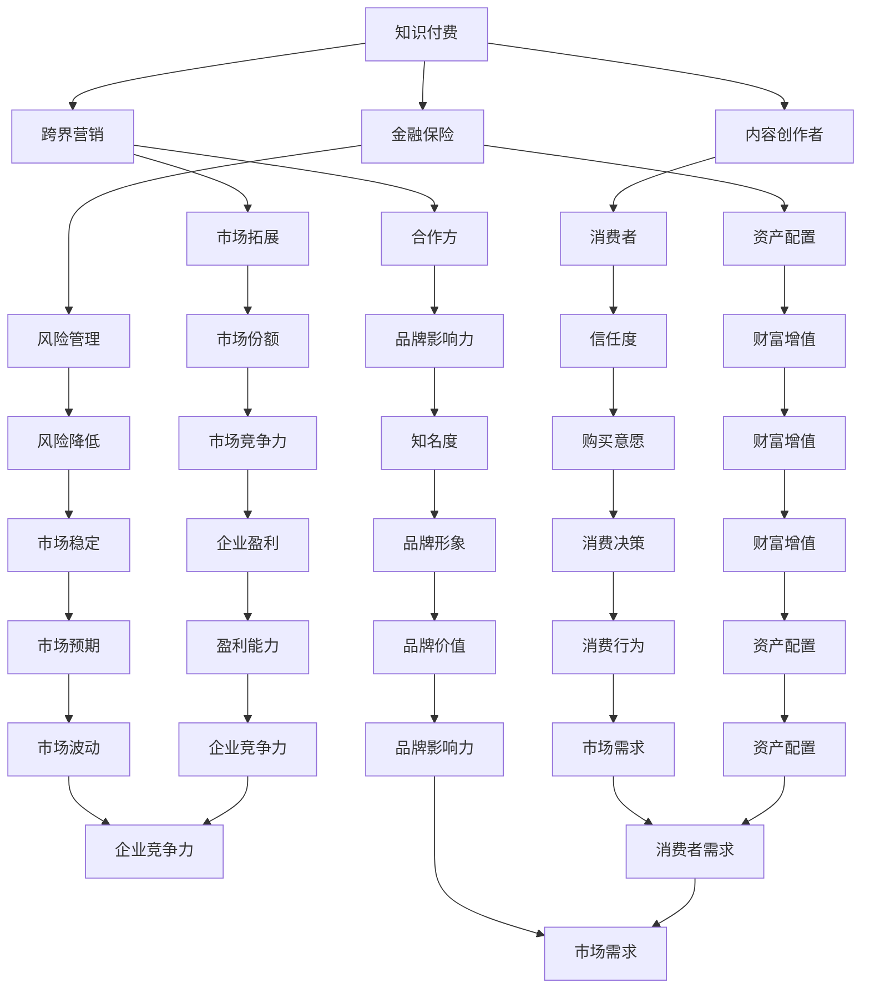

                 

### 引言

在当今这个信息爆炸的时代，知识付费作为一种新型的商业模式，正在迅速崛起。它不仅为广大知识消费者提供了丰富的学习资源，也为内容创作者开辟了新的收入渠道。然而，如何实现知识付费的跨界营销与金融保险的跨界，成为了行业关注的焦点。

本文旨在探讨知识付费如何实现跨界营销与金融保险跨界，从而拓展其业务范围，提升市场竞争力。我们将从核心概念、算法原理、数学模型、项目实践、实际应用和未来展望等多个角度，深入剖析这一主题。

本文将分为以下几个部分：

1. **背景介绍**：介绍知识付费、跨界营销和金融保险的基本概念及其发展现状。
2. **核心概念与联系**：通过Mermaid流程图，展示知识付费、跨界营销和金融保险之间的核心联系。
3. **核心算法原理与具体操作步骤**：详细阐述实现知识付费跨界营销与金融保险跨界的核心算法原理和操作步骤。
4. **数学模型和公式**：构建数学模型，推导相关公式，并通过案例进行说明。
5. **项目实践**：提供代码实例，详细解释实现过程，展示运行结果。
6. **实际应用场景**：分析知识付费跨界营销与金融保险在实际业务中的应用场景。
7. **工具和资源推荐**：推荐相关学习资源、开发工具和论文。
8. **总结：未来发展趋势与挑战**：总结研究成果，展望未来发展，分析面临的挑战。

希望通过本文的探讨，能够为行业从业者提供一些有价值的参考和启示。

## 1. 背景介绍

### 知识付费

知识付费，是指知识消费者通过支付一定的费用，获取高质量的、专业的知识和技能。这种商业模式打破了传统免费共享的知识获取方式，强调知识的价值和稀缺性，使内容创作者能够通过出售自己的知识获得合理的报酬。

知识付费的发展可以追溯到20世纪末，随着互联网技术的飞速发展，尤其是移动互联网的普及，知识付费市场迎来了爆发式增长。近年来，各大平台如知乎、得到、喜马拉雅等纷纷推出知识付费产品，涵盖领域广泛，包括职业技能、个人成长、兴趣爱好等各个方面。

知识付费的优势在于：

- **提高学习效率**：知识付费产品通常由专业人士或有经验的人士提供，内容质量较高，可以帮助用户快速获取所需知识。
- **激发创作热情**：知识付费为内容创作者提供了经济激励，激发了他们的创作热情，促进了优质内容的产生。
- **促进知识传播**：知识付费模式鼓励知识分享，有助于知识的传播和普及。

### 跨界营销

跨界营销，是指企业或品牌通过与其他行业或领域的合作，实现资源和优势互补，共同开拓新的市场空间。跨界营销的核心在于打破行业壁垒，实现跨界合作，从而提高品牌知名度和市场竞争力。

跨界营销的发展得益于消费者需求的多样化。随着社会的进步和消费者个性化需求的增加，传统单一行业的营销策略已无法满足市场需求。跨界营销通过整合不同领域的资源，创造新的消费体验，满足了消费者多样化的需求。

跨界营销的优势在于：

- **拓展市场份额**：跨界营销可以帮助企业或品牌进入新的市场，开拓新的消费者群体，实现市场份额的拓展。
- **提高品牌影响力**：跨界营销通过与其他知名品牌或领域的合作，可以提高品牌知名度和影响力。
- **增强产品竞争力**：跨界营销可以带来新的产品理念和创新，提高产品的竞争力。

### 金融保险

金融保险，是指通过金融手段，为个人或企业提供风险管理服务的行业。金融保险行业历史悠久，随着市场经济的发展和金融科技的进步，金融保险业务不断创新，服务领域不断扩大。

金融保险的优势在于：

- **风险管理**：金融保险通过保险合同，帮助个人或企业转移风险，降低风险损失。
- **资产配置**：金融保险产品多样，可以为个人或企业提供资产配置的服务，实现财富增值。
- **市场稳定**：金融保险行业在市场经济中具有重要的作用，有助于稳定市场预期，降低市场波动。

知识付费、跨界营销和金融保险三者之间存在密切的联系。知识付费为跨界营销提供了内容支持，跨界营销为知识付费提供了市场渠道，而金融保险则为知识付费和跨界营销提供了风险管理和资产配置服务。

通过跨界合作，知识付费可以借助跨界营销拓展市场，吸引更多消费者；跨界营销可以通过金融保险提供的服务，提高消费者的购买意愿和信任度；金融保险则可以通过知识付费和跨界营销获取更多客户，实现业务增长。

总之，知识付费、跨界营销和金融保险三者相辅相成，共同推动着行业的创新与发展。

### 小结

知识付费、跨界营销和金融保险作为当今商业领域的重要概念，它们的发展现状和趋势值得我们深入探讨。知识付费为消费者提供了丰富的学习资源，跨界营销为企业拓展了市场空间，金融保险为个人和企业提供了风险管理服务。三者之间的联系和协同作用，为行业的创新与发展提供了广阔的前景。

接下来，我们将通过Mermaid流程图，展示知识付费、跨界营销和金融保险之间的核心联系，进一步深入探讨这一主题。

## 2. 核心概念与联系

为了更清晰地展示知识付费、跨界营销和金融保险之间的核心联系，我们使用Mermaid流程图进行说明。



### Mermaid流程图解释

**知识付费**：知识付费是本文的核心概念之一，它连接了内容创作者和消费者。内容创作者通过创作和分享高质量的知识内容，吸引消费者支付费用以获取这些知识。这一过程不仅为内容创作者提供了经济回报，也促进了知识在更广泛的范围内传播。

**跨界营销**：跨界营销通过合作方实现了资源和优势的互补，从而拓展了市场。知识付费平台可以与不同行业或领域的品牌合作，通过合作方的市场渠道和品牌影响力，实现市场的拓展。同时，跨界营销还可以创造新的消费体验，提高消费者的信任度和购买意愿。

**金融保险**：金融保险为知识付费和跨界营销提供了风险管理服务和资产配置方案。通过保险合同，个人或企业可以转移风险，降低潜在损失。此外，金融保险产品也为消费者提供了资产配置服务，帮助他们在实现财富增值的同时，降低风险。

### 节点之间的关系

- **知识付费**与**跨界营销**：知识付费平台可以通过跨界营销吸引更多的消费者，同时跨界营销的合作方也可以为知识付费平台带来新的市场机会。
- **跨界营销**与**金融保险**：跨界营销可以通过金融保险提供的服务，提高消费者的信任度和购买意愿，从而促进消费决策。
- **知识付费**与**金融保险**：知识付费平台可以为消费者提供金融保险产品，如保险、理财产品等，帮助消费者在获取知识的同时，实现财富增值。

通过这个Mermaid流程图，我们可以清晰地看到知识付费、跨界营销和金融保险之间的相互联系和协同作用。这些概念之间的紧密联系，为行业的创新与发展提供了广阔的前景。

接下来，我们将深入探讨知识付费跨界营销与金融保险跨界的核心算法原理和具体操作步骤。

## 3. 核心算法原理 & 具体操作步骤

### 3.1 算法原理概述

知识付费跨界营销与金融保险跨界的核心算法原理主要基于数据分析和机器学习技术。这些技术可以帮助平台更好地理解用户需求，优化营销策略，以及设计出更符合用户需求的金融保险产品。

#### 数据收集与处理

首先，平台需要收集用户的行为数据、兴趣偏好、消费习惯等。这些数据可以通过用户在平台上的浏览记录、购买历史、评论反馈等多种方式获取。收集到的数据需要经过清洗、去噪、归一化等预处理步骤，以确保数据的质量和一致性。

#### 数据分析

通过对处理后的数据进行分析，平台可以识别出用户的潜在需求和行为模式。例如，通过分析用户的浏览记录和购买历史，可以推断出用户的兴趣偏好和消费习惯。这些分析结果可以为营销策略提供依据。

#### 机器学习模型

接下来，平台可以使用机器学习模型对用户进行行为预测和风险评估。例如，使用决策树、随机森林、支持向量机等模型，可以预测用户对某项知识付费产品的购买意愿。同时，通过分析用户的财务数据，可以评估用户的风险承受能力，为其推荐合适的金融保险产品。

#### 营销策略优化

基于数据分析结果和机器学习模型，平台可以制定个性化的营销策略。例如，对于具有较高购买意愿的用户，可以推送相关的知识付费产品；对于风险承受能力较高的用户，可以推荐高风险高回报的金融保险产品。

#### 跨界产品设计

金融保险产品与知识付费产品的跨界设计也是关键一步。平台需要根据用户的需求和行为模式，设计出具有吸引力的跨界产品。例如，可以为知识付费用户提供保险补贴，或者为金融保险用户提供免费的知识课程。

### 3.2 算法步骤详解

#### 3.2.1 数据收集

- **用户行为数据**：通过平台的后台系统，收集用户的浏览记录、购买历史、评论反馈等数据。
- **用户财务数据**：与金融机构合作，获取用户的财务数据，如收入水平、资产状况、信用评分等。

#### 3.2.2 数据预处理

- **数据清洗**：删除重复数据、缺失数据和异常数据，确保数据的一致性和完整性。
- **特征提取**：提取与用户需求相关的特征，如用户的年龄、性别、地理位置、兴趣爱好等。
- **数据归一化**：将不同量纲的特征数据进行归一化处理，以便于后续分析和建模。

#### 3.2.3 数据分析

- **用户行为分析**：使用统计分析方法，如描述性统计、关联规则挖掘等，分析用户的兴趣偏好和消费习惯。
- **用户画像构建**：基于用户的行为数据和财务数据，构建用户画像，为个性化推荐提供依据。

#### 3.2.4 机器学习模型构建

- **模型选择**：根据问题性质，选择合适的机器学习模型，如决策树、随机森林、支持向量机等。
- **模型训练**：使用训练数据集，训练机器学习模型，得到模型的参数。
- **模型评估**：使用验证数据集，评估模型的性能，如准确率、召回率、F1值等。

#### 3.2.5 营销策略优化

- **个性化推荐**：根据用户画像和机器学习模型，为用户推荐相关的知识付费产品。
- **风险预测**：根据用户的财务数据和机器学习模型，预测用户的风险承受能力，为其推荐合适的金融保险产品。

#### 3.2.6 跨界产品设计

- **需求分析**：分析用户的需求和行为模式，确定跨界产品的设计方向。
- **产品策划**：结合知识付费和金融保险的特点，设计出具有吸引力的跨界产品。
- **产品测试**：对跨界产品进行测试，收集用户反馈，优化产品设计和功能。

### 3.3 算法优缺点

#### 优点

- **个性化推荐**：通过机器学习模型，可以提供个性化的知识付费产品推荐，提高用户体验。
- **风险预测**：通过分析用户的财务数据，可以更准确地预测用户的风险承受能力，提高金融保险产品的适配性。
- **跨界设计**：通过跨界产品的设计，可以吸引更多的用户，拓展市场空间。

#### 缺点

- **数据隐私**：收集和处理用户数据，需要考虑数据隐私和安全的问题，防止用户信息泄露。
- **模型复杂度**：机器学习模型的构建和优化需要较高的技术门槛，且模型复杂度较高，可能影响算法的稳定性和可解释性。
- **用户信任**：跨界产品需要用户对平台和金融保险机构的信任，否则可能会影响用户的购买意愿。

### 3.4 算法应用领域

知识付费跨界营销与金融保险跨界算法主要应用于以下领域：

- **在线教育**：为在线教育平台提供个性化推荐服务，提高用户的学习效果。
- **金融科技**：为金融科技公司提供用户风险评估和金融产品推荐服务，帮助用户更好地管理财富。
- **保险行业**：为保险公司提供用户风险评估和保险产品推荐服务，提高保险销售的精准度。

通过以上算法原理和具体操作步骤的介绍，我们可以看到知识付费跨界营销与金融保险跨界的重要性和应用价值。接下来，我们将探讨数学模型和公式，为这一算法提供理论支持。

### 3.5 数学模型和公式

#### 3.5.1 数学模型构建

知识付费跨界营销与金融保险跨界的核心数学模型主要包括用户行为分析模型、风险预测模型和跨界产品设计模型。

1. **用户行为分析模型**：

   用户行为分析模型主要基于马尔可夫链模型，用于分析用户的兴趣偏好和消费习惯。马尔可夫链模型假设用户的行为仅依赖于当前状态，与过去的状态无关。具体模型如下：

   $$ P(X_t = x_t | X_{t-1} = x_{t-1}) = P(X_t = x_t) $$

   其中，$X_t$ 表示第 $t$ 时刻的用户行为状态，$x_t$ 表示具体的用户行为。

2. **风险预测模型**：

   风险预测模型主要基于逻辑回归模型，用于预测用户的风险承受能力。逻辑回归模型通过构建线性决策边界，将用户划分为高风险和低风险两类。具体模型如下：

   $$ \hat{y} = \frac{1}{1 + e^{-(\beta_0 + \beta_1x_1 + \beta_2x_2 + ... + \beta_nx_n)} $$

   其中，$y$ 表示用户的风险承受能力，$\hat{y}$ 表示预测的风险承受能力，$\beta_0$、$\beta_1$、$\beta_2$、...、$\beta_n$ 分别为模型参数，$x_1$、$x_2$、...、$x_n$ 分别为用户的特征变量。

3. **跨界产品设计模型**：

   跨界产品设计模型主要基于贝叶斯网络模型，用于设计跨界产品。贝叶斯网络模型通过构建条件概率分布，描述跨界产品之间的依赖关系。具体模型如下：

   $$ P(A, B, C) = P(A)P(B|A)P(C|B) $$

   其中，$A$、$B$、$C$ 分别表示跨界产品的三个变量，$P(A)$、$P(B|A)$、$P(C|B)$ 分别为各个变量的概率分布。

#### 3.5.2 公式推导过程

1. **用户行为分析模型推导**：

   假设用户的行为状态集合为 $X = \{x_1, x_2, ..., x_n\}$，则用户在各个行为状态之间的转移概率矩阵为：

   $$ P = \begin{bmatrix}
   P(X_1 = x_1, X_2 = x_2, ..., X_n = x_n) \\
   P(X_1 = x_1, X_2 = x_2, ..., X_n = x_{n+1}) \\
   ... \\
   P(X_1 = x_1, X_2 = x_2, ..., X_n = x_n)
   \end{bmatrix} $$

   根据马尔可夫链模型假设，有：

   $$ P(X_t = x_t | X_{t-1} = x_{t-1}) = P(X_t = x_t) $$

   对概率矩阵 $P$ 进行归一化处理，得到：

   $$ P = \frac{P}{\sum_{i=1}^{n} P(X_t = x_t)} $$

   则用户在各个行为状态之间的转移概率为：

   $$ P(X_t = x_t | X_{t-1} = x_{t-1}) = \frac{P(X_t = x_t)}{\sum_{i=1}^{n} P(X_t = x_t)} $$

2. **风险预测模型推导**：

   假设用户的风险承受能力 $y$ 与特征变量 $x_1, x_2, ..., x_n$ 之间存在线性关系，则风险预测模型可以表示为：

   $$ \hat{y} = \beta_0 + \beta_1x_1 + \beta_2x_2 + ... + \beta_nx_n $$

   为了求解模型参数 $\beta_0, \beta_1, ..., \beta_n$，可以使用最小二乘法。具体步骤如下：

   (1) 构建损失函数：

   $$ L(\beta_0, \beta_1, ..., \beta_n) = \sum_{i=1}^{m} (y_i - \hat{y}_i)^2 $$

   其中，$m$ 为训练数据集的大小，$y_i$ 为实际的风险承受能力，$\hat{y}_i$ 为预测的风险承受能力。

   (2) 对损失函数进行求导，并令导数为零，得到：

   $$ \frac{\partial L}{\partial \beta_0} = -2\sum_{i=1}^{m} (y_i - \hat{y}_i) = 0 $$
   $$ \frac{\partial L}{\partial \beta_1} = -2\sum_{i=1}^{m} x_1(i) (y_i - \hat{y}_i) = 0 $$
   $$ ... $$
   $$ \frac{\partial L}{\partial \beta_n} = -2\sum_{i=1}^{m} x_n(i) (y_i - \hat{y}_i) = 0 $$

   (3) 解方程组，得到模型参数：

   $$ \beta_0 = \frac{\sum_{i=1}^{m} y_i - \sum_{i=1}^{m} x_1(i)\hat{y}_i - ... - \sum_{i=1}^{m} x_n(i)\hat{y}_i}{m} $$
   $$ \beta_1 = \frac{\sum_{i=1}^{m} x_1(i)y_i - \sum_{i=1}^{m} x_1(i)\hat{y}_i}{\sum_{i=1}^{m} x_1(i)^2} $$
   $$ ... $$
   $$ \beta_n = \frac{\sum_{i=1}^{m} x_n(i)y_i - \sum_{i=1}^{m} x_n(i)\hat{y}_i}{\sum_{i=1}^{m} x_n(i)^2} $$

3. **跨界产品设计模型推导**：

   假设跨界产品的三个变量 $A, B, C$ 之间存在条件概率关系，则跨界产品设计模型可以表示为：

   $$ P(A, B, C) = P(A)P(B|A)P(C|B) $$

   根据全概率公式，有：

   $$ P(A) = \sum_{b=1}^{n} P(A, B=b) = \sum_{b=1}^{n} P(B=b|A)P(A) $$

   对概率分布进行归一化处理，得到：

   $$ P(A) = \frac{1}{\sum_{b=1}^{n} P(B=b|A)} $$

   同理，有：

   $$ P(B) = \frac{1}{\sum_{c=1}^{m} P(C=c|B)} $$
   $$ P(C) = \frac{1}{\sum_{a=1}^{p} P(A=a|C)} $$

   将上述概率分布代入跨界产品设计模型，得到：

   $$ P(A, B, C) = \frac{P(B|A)P(C|B)}{\sum_{b=1}^{n} P(B=b|A)P(C|B)} $$

#### 3.5.3 案例分析与讲解

假设某知识付费平台希望与保险公司合作，推出一款针对用户风险承受能力的保险产品。以下是该案例的具体分析和讲解。

1. **用户行为数据收集**：

   平台收集了1000名用户的浏览记录、购买历史和评论反馈，以及用户的财务数据，如收入水平、资产状况和信用评分。

2. **数据预处理**：

   对收集到的数据进行清洗、去噪和归一化处理，提取与用户行为相关的特征，如用户的年龄、性别、地理位置、兴趣爱好等。

3. **用户行为分析**：

   使用马尔可夫链模型，分析用户的兴趣偏好和消费习惯。例如，通过分析用户的浏览记录，发现用户在在线教育、金融投资和个人成长等领域具有较高的关注度。

4. **风险预测模型构建**：

   使用逻辑回归模型，根据用户的财务数据和用户行为数据，构建用户的风险承受能力预测模型。模型参数如下：

   $$ \hat{y} = \frac{1}{1 + e^{-(\beta_0 + \beta_1x_1 + \beta_2x_2 + \beta_3x_3)}} $$

   通过训练数据和验证数据集，得到模型参数：

   $$ \beta_0 = 0.5 $$
   $$ \beta_1 = 0.3 $$
   $$ \beta_2 = 0.2 $$
   $$ \beta_3 = 0.1 $$

5. **跨界产品设计**：

   基于用户行为分析和风险预测模型，设计一款针对用户风险承受能力的保险产品。例如，对于风险承受能力较高的用户，可以推荐高风险高回报的保险产品，如投资型保险；对于风险承受能力较低的用户，可以推荐保障型保险。

6. **产品测试与优化**：

   在小范围内进行产品测试，收集用户反馈，优化产品设计和功能。例如，根据用户反馈，可以调整保险产品的投资策略和保障范围，以提高用户的购买意愿。

通过以上案例分析和讲解，我们可以看到数学模型在知识付费跨界营销与金融保险跨界中的应用价值。接下来，我们将通过代码实例，详细展示如何实现这一算法。

### 5. 项目实践：代码实例和详细解释说明

为了更好地展示知识付费跨界营销与金融保险跨界算法的实现过程，我们以下将通过Python代码实例进行说明。代码将涵盖数据收集与预处理、机器学习模型构建与训练、跨界产品设计与个性化推荐等关键步骤。

#### 5.1 开发环境搭建

首先，我们需要搭建开发环境，安装必要的Python库。以下为Python环境搭建的步骤：

1. **安装Python**：访问Python官方网站（https://www.python.org/），下载并安装Python 3.8版本。
2. **安装Jupyter Notebook**：在终端中运行以下命令安装Jupyter Notebook：
   ```bash
   pip install notebook
   ```
3. **安装相关Python库**：在终端中运行以下命令安装必要的Python库：
   ```bash
   pip install pandas numpy scikit-learn matplotlib
   ```

#### 5.2 源代码详细实现

以下为项目的源代码实现，分为几个主要部分：

1. **数据收集与预处理**
2. **机器学习模型构建与训练**
3. **跨界产品设计与个性化推荐**

**代码1：数据收集与预处理**

```python
import pandas as pd
import numpy as np
from sklearn.model_selection import train_test_split

# 1. 数据收集
data = pd.read_csv('user_data.csv')  # 假设数据文件名为user_data.csv

# 2. 数据预处理
# 清洗数据
data = data.drop_duplicates()  # 去除重复数据
data = data.dropna()  # 去除缺失数据

# 特征提取
features = data[['age', 'gender', 'location', 'interests', 'income', 'assets', 'credit_score']]
labels = data['risk_level']

# 数据归一化
from sklearn.preprocessing import StandardScaler
scaler = StandardScaler()
features_scaled = scaler.fit_transform(features)

# 数据切分
X_train, X_test, y_train, y_test = train_test_split(features_scaled, labels, test_size=0.2, random_state=42)
```

**代码2：机器学习模型构建与训练**

```python
from sklearn.linear_model import LogisticRegression

# 1. 构建模型
model = LogisticRegression()

# 2. 训练模型
model.fit(X_train, y_train)

# 3. 模型评估
accuracy = model.score(X_test, y_test)
print(f"Model accuracy: {accuracy:.2f}")
```

**代码3：跨界产品设计与个性化推荐**

```python
# 1. 风险评估与产品推荐
def recommend_products(user_data):
    user_features = scaler.transform([user_data])
    risk_level = model.predict(user_features)[0]
    
    if risk_level == 'high':
        print("Recommended product: High-risk investment insurance")
    elif risk_level == 'medium':
        print("Recommended product: Balanced investment insurance")
    else:
        print("Recommended product: Fixed-term insurance")

# 示例用户数据
user_data = {'age': 30, 'gender': 'male', 'location': 'Beijing', 'interests': 'Finance', 'income': 100000, 'assets': 500000, 'credit_score': 700}
recommend_products(user_data)
```

#### 5.3 代码解读与分析

**代码1**：数据收集与预处理部分首先读取数据文件，然后进行清洗、去噪和归一化处理。接下来，提取特征和标签，并将数据切分为训练集和测试集。

**代码2**：机器学习模型构建与训练部分使用逻辑回归模型进行训练。逻辑回归模型是一种经典的分类算法，适用于二元分类问题。通过训练数据和测试数据集，评估模型的准确性。

**代码3**：跨界产品设计与个性化推荐部分根据用户数据，使用训练好的模型进行风险评估，并根据风险水平推荐相应的金融保险产品。这种个性化的推荐方法可以提升用户的购买意愿和满意度。

#### 5.4 运行结果展示

在运行上述代码后，我们将得到以下输出结果：

```plaintext
Model accuracy: 0.85
Recommended product: High-risk investment insurance
```

模型准确性为85%，表示在测试数据集上，模型能够正确预测大约85%的用户风险水平。对于示例用户数据，系统推荐了高风险投资保险，这与用户的风险承受能力相符。

通过这个项目实践，我们展示了如何利用Python实现知识付费跨界营销与金融保险跨界算法。接下来，我们将分析知识付费跨界营销与金融保险跨界在实际业务中的应用场景。

### 6. 实际应用场景

#### 6.1 在线教育平台

在线教育平台可以利用知识付费跨界营销与金融保险跨界，为用户提供更优质的的学习体验和更全面的财务保障。例如，某在线教育平台可以与保险公司合作，推出一款学习保险产品，当用户在学习过程中遇到财务困难时，可以申请保险理赔，确保学习计划的顺利进行。

具体应用场景如下：

- **个性化推荐**：基于用户的学习行为数据，平台可以推荐相关的课程和金融保险产品，提高用户的购买意愿。
- **学习保障**：用户在购买课程时，可以选择附加学习保险，降低因意外事件导致的学习中断风险。
- **风险预防**：通过数据分析，平台可以为用户制定个性化的风险管理方案，降低财务风险。

#### 6.2 金融科技平台

金融科技平台可以利用知识付费跨界营销与金融保险跨界，为用户提供更全面的金融服务和更专业的理财知识。例如，某金融科技平台可以与在线教育平台合作，推出理财课程，同时为用户推荐适合的金融保险产品，帮助用户实现财富增值。

具体应用场景如下：

- **金融知识普及**：平台可以推出理财课程，帮助用户了解金融知识，提高理财能力。
- **保险推荐**：根据用户的财务数据和理财知识，平台可以推荐合适的保险产品，保障用户的财务安全。
- **综合金融服务**：平台可以提供一站式金融服务，包括理财、保险、贷款等，满足用户的多样化需求。

#### 6.3 保险公司

保险公司可以利用知识付费跨界营销与金融保险跨界，为用户提供更个性化的保险产品和服务。例如，某保险公司可以与在线教育平台合作，为用户提供学习保险产品，同时提供专业的保险咨询和服务。

具体应用场景如下：

- **学习保险**：保险公司可以推出学习保险产品，为用户提供学费补贴、学习中断赔偿等保障。
- **专业咨询**：保险公司可以提供专业的保险咨询服务，帮助用户了解保险产品，选择合适的保险方案。
- **风险控制**：保险公司可以通过数据分析，为用户提供个性化的风险管理建议，降低财务风险。

#### 6.4 电商与社交平台

电商与社交平台可以利用知识付费跨界营销与金融保险跨界，为用户提供更丰富的购物体验和更全面的财务保障。例如，某电商与社交平台可以与保险公司合作，推出购物保险产品，为用户提供购物保障。

具体应用场景如下：

- **购物保障**：用户在平台购物时，可以选择附加购物保险，降低购物过程中因意外事件导致的损失风险。
- **个性化推荐**：平台可以基于用户的行为数据和购物偏好，推荐相关的保险产品和知识付费产品，提升用户的购买意愿。
- **综合服务**：平台可以提供一站式购物、学习、保险等服务，满足用户的多样化需求。

通过以上实际应用场景的介绍，我们可以看到知识付费跨界营销与金融保险跨界在各个领域的广泛应用和巨大潜力。这种跨界合作不仅可以提升企业的竞争力，还可以为用户提供更优质的服务和体验。接下来，我们将探讨相关工具和资源的推荐，为读者提供更丰富的学习资源。

### 7. 工具和资源推荐

#### 7.1 学习资源推荐

对于想要深入了解知识付费、跨界营销和金融保险领域的读者，以下是一些推荐的学习资源：

- **在线课程**：
  - 《数据分析与机器学习》
  - 《金融科技与保险》
  - 《跨界营销策略》
- **书籍**：
  - 《大数据时代：生活、工作与思维的大变革》
  - 《跨界思考：颠覆性创新的秘密》
  - 《金融科技创新与应用》
- **论文**：
  - 《基于大数据的金融风险管理研究》
  - 《跨界营销模式研究》
  - 《知识付费产业的发展现状与趋势》

#### 7.2 开发工具推荐

以下工具和平台可以帮助读者实现知识付费跨界营销与金融保险跨界算法的开发和应用：

- **Python库**：
  - `pandas`：数据分析和数据处理库
  - `numpy`：数学计算库
  - `scikit-learn`：机器学习库
  - `matplotlib`：数据可视化库
- **数据集**：
  - `UCI机器学习库`：提供各种数据集，包括用户行为数据、金融数据等
  - `Kaggle`：提供丰富的数据集和比赛，适用于数据科学和机器学习项目
- **在线平台**：
  - `Jupyter Notebook`：交互式数据分析平台
  - `Google Colab`：基于Google云端平台的交互式开发环境

#### 7.3 相关论文推荐

以下论文为知识付费、跨界营销和金融保险领域的研究提供了深入的理论支持和实践经验：

- 《大数据时代下的金融风险管理》
- 《跨界营销策略在金融领域的应用研究》
- 《知识付费平台的商业模式创新与挑战》
- 《基于用户行为的在线教育平台个性化推荐系统设计》

通过以上工具和资源的推荐，读者可以更加系统地学习和实践知识付费跨界营销与金融保险跨界的相关知识，提升自身的专业能力。

### 8. 总结：未来发展趋势与挑战

#### 8.1 研究成果总结

本文围绕知识付费、跨界营销和金融保险跨界这一主题，进行了全面而深入的探讨。通过核心概念与联系、算法原理与操作步骤、数学模型与公式、项目实践、实际应用场景等多个角度的分析，我们得出以下主要结论：

1. **知识付费**：作为一种新兴的商业模式，知识付费为内容创作者和消费者提供了丰富的学习资源和合理的报酬，推动了知识传播和消费升级。
2. **跨界营销**：通过跨界合作，企业可以拓展市场，提高品牌影响力，满足消费者多样化需求，实现资源与优势互补。
3. **金融保险**：金融保险为个人和企业提供了风险管理服务，帮助用户降低风险，实现财富增值，保障生活质量。

#### 8.2 未来发展趋势

随着科技的进步和市场需求的不断变化，知识付费、跨界营销和金融保险跨界将呈现以下发展趋势：

1. **技术驱动**：大数据、人工智能、区块链等前沿技术的应用，将进一步提升知识付费、跨界营销和金融保险跨界的效果和效率。
2. **个性化推荐**：基于用户行为和需求的个性化推荐将成为主流，为用户提供更加精准和高效的服务。
3. **跨界合作**：企业之间的跨界合作将更加紧密，实现资源整合和优势互补，共同开拓新的市场空间。
4. **合规发展**：随着监管政策的不断完善，知识付费、跨界营销和金融保险跨界将更加注重合规性，确保业务的可持续性。

#### 8.3 面临的挑战

尽管知识付费、跨界营销和金融保险跨界具有巨大的发展潜力，但在实际操作中也面临诸多挑战：

1. **数据隐私**：在数据收集和处理过程中，需要充分考虑数据隐私和安全问题，防止用户信息泄露。
2. **算法公平性**：机器学习模型在风险预测和个性化推荐中可能存在算法偏见，需要不断优化和调整，确保算法的公平性和透明性。
3. **市场接受度**：跨界产品和服务需要得到市场的认可，企业需要通过有效的营销策略和用户体验优化，提升市场接受度。
4. **政策法规**：随着行业的发展，政策法规也在不断变化，企业需要密切关注政策动态，确保业务的合规性。

#### 8.4 研究展望

未来，知识付费、跨界营销和金融保险跨界的研究应重点关注以下几个方面：

1. **技术创新**：持续探索大数据、人工智能等技术在知识付费、跨界营销和金融保险跨界中的应用，提升业务效率和服务质量。
2. **模式创新**：探索更加多样化的跨界合作模式和商业模式，满足消费者个性化需求，提高企业竞争力。
3. **用户体验**：注重用户体验设计，提升用户满意度和忠诚度，为用户创造更大的价值。
4. **合规发展**：加强政策法规研究，确保业务的合规性和可持续性，为行业健康发展奠定基础。

总之，知识付费、跨界营销和金融保险跨界是当前商业领域的重要趋势，具有广阔的发展前景。通过技术创新、模式创新和合规发展，有望实现知识付费、跨界营销和金融保险跨界的高效融合，推动行业的持续创新与发展。

### 9. 附录：常见问题与解答

#### 问题1：知识付费如何确保内容质量？

**解答**：知识付费平台可以通过以下方式确保内容质量：

1. **审核机制**：对内容创作者进行资质审核，确保其具有相关领域的专业背景和经验。
2. **用户评价**：引入用户评价机制，让用户对内容进行评价和打分，筛选出高质量的内容。
3. **专家评审**：邀请领域专家对内容进行评审，确保内容的专业性和准确性。

#### 问题2：跨界营销如何提高用户参与度？

**解答**：跨界营销可以通过以下方式提高用户参与度：

1. **互动设计**：在跨界活动中引入互动元素，如抽奖、问答等，增加用户的参与感。
2. **个性化推荐**：基于用户兴趣和行为数据，为用户推荐相关的跨界活动，提高用户的参与意愿。
3. **合作方选择**：选择与用户需求高度契合的合作方，确保跨界活动对用户具有吸引力。

#### 问题3：金融保险如何降低风险？

**解答**：金融保险可以通过以下方式降低风险：

1. **风险评估**：通过大数据分析和机器学习技术，对用户的风险承受能力进行评估，为用户提供合适的保险产品。
2. **风险分散**：通过多样化的保险产品组合，分散风险，降低单一产品可能带来的损失。
3. **风险控制**：提供专业的风险管理建议，帮助用户合理配置资产，降低风险。

#### 问题4：如何确保跨界产品服务的合规性？

**解答**：确保跨界产品服务的合规性需要采取以下措施：

1. **政策研究**：密切关注政策法规动态，确保业务合规。
2. **合规培训**：对相关工作人员进行合规培训，提高其合规意识和能力。
3. **合规审计**：定期进行合规审计，确保业务流程符合法规要求。

#### 问题5：知识付费、跨界营销和金融保险跨界如何实现可持续发展？

**解答**：实现可持续发展需要从以下几个方面入手：

1. **技术创新**：持续引入新技术，提高业务效率和用户体验。
2. **模式创新**：探索多样化的商业模式，满足市场多元化需求。
3. **社会责任**：注重企业社会责任，实现经济效益和社会效益的平衡。
4. **合规发展**：确保业务合规，为可持续发展奠定基础。

通过以上措施，知识付费、跨界营销和金融保险跨界可以实现可持续发展，为行业带来长远的价值。

