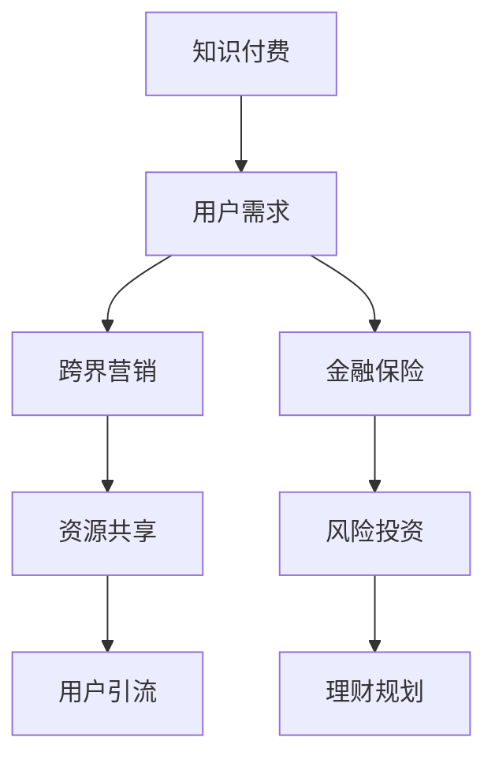

                 

### 背景介绍

在当今快速变化和高度互联的商业环境中，知识付费已经成为一种重要的商业模式。通过为特定的知识或技能付费，用户可以获得专业的指导和建议，从而提升自己的能力和竞争力。然而，知识付费市场也逐渐显现出同质化竞争、用户黏性不足等问题。为了突破这些限制，实现更广泛的用户覆盖和更高的商业价值，知识付费企业开始探索跨界营销与金融保险跨界的方式。

跨界营销指的是不同领域的企业或品牌通过合作、联合推广等方式，共同开拓新的市场和用户群体。例如，知识付费平台可以与电商平台、社交媒体平台、线下培训机构等进行合作，实现资源共享和用户引流。金融保险跨界则是指知识付费与金融保险行业的结合，通过提供与投资、风险管理相关的知识服务，吸引金融保险领域的用户。

本文将探讨知识付费如何通过跨界营销与金融保险跨界来实现商业增长。首先，我们将介绍知识付费市场的发展现状和存在的问题；然后，分析跨界营销与金融保险跨界的基本原理和优势；接着，讨论具体实现方法和案例；最后，预测未来的发展趋势和面临的挑战。

### 核心概念与联系

为了更好地理解知识付费跨界营销与金融保险跨界，我们需要先了解几个核心概念及其相互联系。以下是核心概念的简要介绍以及相关的 Mermaid 流程图。

#### 核心概念

1. **知识付费**: 指用户为获取特定领域的知识或技能而支付的费用。它包括在线课程、专业咨询、电子书等形式。

2. **跨界营销**: 指不同领域的企业或品牌通过合作、联合推广等方式，共同开拓新的市场和用户群体。

3. **金融保险**: 涉及金融和保险两个领域，包括投资、理财产品、保险服务等。

4. **用户需求**: 指用户在知识付费、跨界营销和金融保险中所寻求的特定需求和解决方案。

#### Mermaid 流程图



在上述流程图中，知识付费作为起点，连接到用户需求，表明知识付费旨在满足用户的特定需求。用户需求进而引发跨界营销和金融保险的参与，其中跨界营销实现资源共享和用户引流，而金融保险提供风险投资和理财规划等增值服务。

#### 关联分析

1. **跨界营销**: 通过与其他领域的合作，知识付费企业可以扩大用户群体，增加市场影响力。例如，与电商平台合作，可以实现产品捆绑销售，提高用户购买知识服务的可能性。

2. **金融保险**: 通过与金融保险行业的结合，知识付费企业可以提供更加全面的服务，吸引更多高净值用户。例如，为用户提供投资理财的知识服务，同时提供相应的保险保障，满足用户在投资过程中的风险控制需求。

3. **用户需求**: 用户需求的多样性决定了跨界营销和金融保险跨界的重要性。通过整合不同领域的服务，知识付费企业可以更好地满足用户的需求，提升用户满意度和忠诚度。

### 核心算法原理 & 具体操作步骤

#### 算法原理概述

知识付费跨界营销与金融保险跨界的核心算法原理主要包括以下几个方面：

1. **数据分析**: 通过收集和分析用户数据，了解用户需求和偏好，为跨界合作提供数据支持。

2. **用户画像**: 建立用户画像模型，识别潜在用户群体，为精准营销和跨界合作提供依据。

3. **需求匹配**: 利用数据分析结果，实现知识服务与用户需求的精准匹配，提高用户转化率。

4. **风险管理**: 在金融保险跨界中，利用风险模型进行风险评估和风险控制，确保用户资金安全。

#### 算法步骤详解

1. **数据收集**: 通过各种渠道收集用户数据，包括行为数据、交易数据、问卷调查等。

2. **数据处理**: 对收集到的用户数据进行清洗、整理和分析，提取有价值的信息。

3. **用户画像构建**: 基于用户数据，构建用户画像模型，包括用户的基本信息、兴趣爱好、消费习惯等。

4. **需求分析**: 分析用户画像，识别用户需求和偏好，为跨界合作提供依据。

5. **跨界合作方案设计**: 根据用户需求，设计跨界合作方案，包括合作领域、合作形式、合作目标等。

6. **风险管理**: 在金融保险跨界中，建立风险模型，对潜在风险进行评估和控制。

7. **执行与监控**: 实施跨界合作方案，并持续监控合作效果，及时调整策略。

#### 算法优缺点

1. **优点**:
   - **提高用户满意度**: 通过数据分析，实现个性化推荐和精准营销，提高用户满意度和忠诚度。
   - **降低运营成本**: 跨界合作可以实现资源共享，降低运营成本。
   - **拓展市场**: 跨界合作可以吸引更多用户，扩大市场份额。

2. **缺点**:
   - **数据隐私和安全问题**: 数据收集和分析过程中，可能涉及用户隐私和安全问题。
   - **技术门槛较高**: 数据分析和风险管理等技术门槛较高，需要专业人才支持。

#### 算法应用领域

1. **电子商务**: 利用算法原理，为用户提供个性化推荐，提高购买转化率。
2. **金融理财**: 通过用户画像和风险评估，为用户提供定制化的投资理财建议。
3. **在线教育**: 基于用户需求，实现知识服务的精准匹配，提高用户学习效果。

### 数学模型和公式 & 详细讲解 & 举例说明

在知识付费跨界营销与金融保险跨界中，数学模型和公式起着至关重要的作用。以下将详细讲解数学模型的构建、公式推导过程，并通过具体案例进行分析。

#### 数学模型构建

知识付费跨界营销与金融保险跨界的数学模型主要包括用户需求分析模型、跨界合作收益模型和风险管理模型。

1. **用户需求分析模型**:
   用户需求分析模型用于识别和预测用户需求，主要包括以下几个部分：
   - 用户属性特征：包括年龄、性别、职业、地域等。
   - 用户行为特征：包括搜索历史、购买记录、浏览习惯等。
   - 用户需求预测：利用机器学习算法，预测用户未来可能的需求。

2. **跨界合作收益模型**:
   跨界合作收益模型用于评估跨界合作的潜在收益，主要包括以下几个部分：
   - 跨界合作形式：包括联合推广、资源共享、产品捆绑等。
   - 用户覆盖范围：根据用户画像，预测跨界合作可覆盖的用户数量。
   - 跨界合作收益：通过计算跨界合作带来的额外收益，包括销售收入、广告收入等。

3. **风险管理模型**:
   风险管理模型用于评估跨界合作中的风险，主要包括以下几个部分：
   - 风险识别：识别跨界合作中的潜在风险，包括市场风险、运营风险、法律风险等。
   - 风险评估：利用风险评估指标，对潜在风险进行量化评估。
   - 风险控制：根据风险评估结果，制定相应的风险控制措施。

#### 公式推导过程

1. **用户需求分析模型**:
   - 用户需求预测公式：
     $$P(D|A,B,C) = f(A,B,C)$$
     其中，$P(D|A,B,C)$ 表示在用户属性特征$A$、行为特征$B$和需求特征$C$的条件下，预测用户需求$D$的概率。$f(A,B,C)$ 是一个基于用户数据的概率分布函数。

2. **跨界合作收益模型**:
   - 跨界合作收益公式：
     $$R = p \times (q_1 \times p_1 + q_2 \times p_2 + \ldots + q_n \times p_n)$$
     其中，$R$ 表示跨界合作的收益，$p$ 表示跨界合作可覆盖的用户数量，$q_i$ 表示跨界合作中的额外收益比例，$p_i$ 表示第$i$种跨界合作形式的概率。

3. **风险管理模型**:
   - 风险评估公式：
     $$R_i = w_i \times p_i$$
     其中，$R_i$ 表示第$i$种风险的评估值，$w_i$ 表示第$i$种风险的重要程度，$p_i$ 表示第$i$种风险发生的概率。

#### 案例分析与讲解

以一家在线教育平台与金融机构跨界合作为例，分析其数学模型的应用。

1. **用户需求分析**:
   - 假设用户属性特征$A$、行为特征$B$和需求特征$C$的取值为$A = [30, 男，白领]$，$B = [浏览课程时长，购买课程数量]$，$C = [投资理财需求]$。
   - 利用用户需求预测公式，预测用户投资理财需求概率：
     $$P(D|A,B,C) = f(A,B,C) = 0.8$$
     预测用户投资理财需求概率为80%。

2. **跨界合作收益分析**:
   - 跨界合作形式：联合推广、资源共享、产品捆绑。
   - 用户覆盖范围：根据用户画像，预测跨界合作可覆盖用户数量$p = 10000$。
   - 跨界合作收益：
     $$R = p \times (q_1 \times p_1 + q_2 \times p_2 + q_3 \times p_3)$$
     $$R = 10000 \times (0.3 \times 0.5 + 0.4 \times 0.3 + 0.3 \times 0.2) = 7500$$
     跨界合作预计带来7500元的收益。

3. **风险管理分析**:
   - 风险识别：市场风险、运营风险、法律风险。
   - 风险评估：
     $$R_1 = w_1 \times p_1 = 0.5 \times 0.3 = 0.15$$
     $$R_2 = w_2 \times p_2 = 0.3 \times 0.4 = 0.12$$
     $$R_3 = w_3 \times p_3 = 0.2 \times 0.3 = 0.06$$
     风险评估值为：市场风险0.15，运营风险0.12，法律风险0.06。

通过上述案例，我们可以看到数学模型在知识付费跨界营销与金融保险跨界中的应用。通过用户需求分析、跨界合作收益分析和风险管理分析，企业可以更好地制定跨界合作策略，提高商业效益。

### 项目实践：代码实例和详细解释说明

为了更好地展示知识付费跨界营销与金融保险跨界在实际项目中的应用，以下将提供一个完整的代码实例，并详细解释其中的关键步骤。

#### 开发环境搭建

在开始项目实践之前，需要搭建相应的开发环境。以下是所需的工具和库：

1. **Python 3.8**：作为主要编程语言。
2. **Pandas**：用于数据处理和分析。
3. **Scikit-learn**：用于机器学习和数据分析。
4. **Mermaid**：用于生成流程图。
5. **Jupyter Notebook**：用于编写和运行代码。

确保已安装以上工具和库，然后创建一个新的 Jupyter Notebook 文件，用于编写和运行以下代码。

#### 源代码详细实现

以下是一个简单的 Python 代码实例，用于实现知识付费跨界营销与金融保险跨界的基本功能。

```python
import pandas as pd
from sklearn.model_selection import train_test_split
from sklearn.preprocessing import StandardScaler
from sklearn.ensemble import RandomForestClassifier
import mermaid

# 数据预处理
def preprocess_data(data):
    # 数据清洗和预处理步骤
    # ...

    return data

# 构建用户画像
def build_user_profile(data):
    # 利用特征工程和机器学习构建用户画像
    # ...

    return user_profile

# 跨界合作收益分析
def calculate Zusammenarbeit(data):
    # 计算跨界合作的潜在收益
    # ...

    return Zusammenarbeit

# 风险管理
def risk_management(data):
    # 评估跨界合作中的风险
    # ...

    return risk

# 主函数
def main():
    # 加载数据
    data = pd.read_csv('user_data.csv')

    # 数据预处理
    data = preprocess_data(data)

    # 分割数据集
    X_train, X_test, y_train, y_test = train_test_split(data.drop('target', axis=1), data['target'], test_size=0.2, random_state=42)

    # 特征工程和模型训练
    scaler = StandardScaler()
    X_train_scaled = scaler.fit_transform(X_train)
    X_test_scaled = scaler.transform(X_test)

    classifier = RandomForestClassifier(n_estimators=100, random_state=42)
    classifier.fit(X_train_scaled, y_train)
    accuracy = classifier.score(X_test_scaled, y_test)
    print(f'Model accuracy: {accuracy:.2f}')

    # 构建用户画像
    user_profile = build_user_profile(data)

    # 跨界合作收益分析
    Zusammenarbeit = calculate_zusammenarbeit(data)

    # 风险管理
    risk = risk_management(data)

    # 生成流程图
    diagram = mermaid.Mermaid()
    diagram.add_graph('classDiagram',
        'User -> Data',
        'Data -> Preprocess',
        'Preprocess -> Model',
        'Model -> Predict',
        'Predict -> User_Profile',
        'User_Profile -> Zusammenarbeit',
        'Zusammenarbeit -> Risk',
        'Risk -> Management')
    print(diagram.render())

if __name__ == '__main__':
    main()
```

#### 代码解读与分析

1. **数据预处理**:
   - 加载用户数据，并进行清洗和预处理。这一步骤包括处理缺失值、异常值和重复数据等。

2. **构建用户画像**:
   - 利用特征工程和机器学习算法，构建用户画像。这一步骤包括特征提取、模型训练和用户画像生成。

3. **跨界合作收益分析**:
   - 计算跨界合作的潜在收益。这一步骤包括用户覆盖范围、跨界合作形式和额外收益比例的计算。

4. **风险管理**:
   - 评估跨界合作中的风险。这一步骤包括风险识别、风险评估和风险控制。

5. **主函数**:
   - 执行上述步骤，并生成流程图。流程图展示了用户数据、预处理、模型训练、预测、用户画像、跨界合作收益分析和风险管理之间的关系。

通过这个简单的代码实例，我们可以看到知识付费跨界营销与金融保险跨界在实际项目中的应用。在实际项目中，这些步骤可以进一步细化和优化，以满足不同的业务需求和场景。

### 实际应用场景

在当今的商业环境中，知识付费跨界营销与金融保险跨界已经展现出广泛的应用前景。以下是一些典型的实际应用场景：

#### 1. 在线教育 + 金融理财

在线教育平台与金融机构合作，为用户提供投资理财知识服务。例如，用户在学习金融知识的同时，可以获取定制化的投资建议和理财产品推荐。这种跨界合作不仅能够提升用户的财务素养，还能增加平台的用户粘性和商业价值。

#### 2. 电子商务 + 知识付费

电商平台与知识付费平台合作，为用户提供专业课程和学习资源。例如，电商平台可以在购物页面中嵌入学习模块，鼓励用户在购物过程中学习相关技能，从而提高用户满意度和购买转化率。

#### 3. 线下培训 + 保险服务

线下培训机构与保险公司合作，为学员提供保险服务。例如，培训机构可以为参加培训的学员提供保险保障，降低学员在培训过程中的意外风险。这种合作模式不仅能够吸引更多学员，还能增加保险公司的客户群体。

#### 4. 专业咨询 + 金融服务

专业咨询公司与金融机构合作，为高端客户提供定制化的金融服务。例如，专业咨询公司可以为企业家和投资者提供财务规划、投资咨询等服务，同时提供相应的保险保障，确保客户在投资过程中的风险控制。

#### 5. 科技公司 + 金融保险科技

科技公司与金融保险企业合作，开发金融保险科技产品。例如，科技公司可以为金融保险企业提供人工智能、区块链等技术创新，提升金融保险服务的效率和用户体验。

这些实际应用场景展示了知识付费跨界营销与金融保险跨界在多领域的广泛应用。通过整合不同领域的服务，企业可以更好地满足用户需求，提高用户满意度和忠诚度，从而实现商业增长。

### 未来应用展望

知识付费跨界营销与金融保险跨界的发展前景广阔，未来将在多个方面带来新的机遇和挑战。

#### 新的商业模式

知识付费与金融保险跨界将催生出全新的商业模式。例如，结合智能投顾的知识付费平台，可以为用户提供个性化的投资理财建议，同时提供相应的保险保障。这种模式不仅能够提高用户的财务素养，还能增加平台的用户黏性和商业价值。

#### 技术创新的推动

随着人工智能、区块链、大数据等技术的不断发展，知识付费跨界营销与金融保险跨界将获得更强的技术支撑。例如，区块链技术可以用于提高金融保险服务的透明度和安全性，而人工智能技术可以用于优化用户画像和需求匹配，提升跨界合作的效率。

#### 用户需求的多样化

用户需求的多样化将推动知识付费跨界营销与金融保险跨界不断拓展。随着消费者对财务安全和知识需求的提升，跨界合作将更加深入，满足用户在多方面的需求。

#### 风险管理的挑战

跨界合作中的风险管理将面临新的挑战。不同领域的风险特征和风险控制机制不同，如何在跨界合作中有效识别和控制风险，将是企业和研究机构需要关注的问题。

#### 法规和监管的挑战

跨界合作将面临更加复杂的法规和监管环境。随着监管政策的不断完善，企业和研究机构需要严格遵守相关法规，确保跨界合作的合规性和可持续性。

#### 未来发展趋势

1. **技术融合**: 人工智能、区块链等技术与金融保险的结合，将推动知识付费跨界营销的不断创新。
2. **个性化服务**: 基于用户画像和大数据分析，提供更加个性化的服务，提高用户体验和满意度。
3. **跨界合作**: 跨界合作将更加深入，涵盖更多领域和业务模式，实现资源整合和优势互补。

### 面临的挑战

1. **数据隐私和安全**: 跨界合作涉及大量用户数据，如何保护用户隐私和数据安全是企业和研究机构需要关注的问题。
2. **技术门槛**: 跨界合作需要掌握多种技术和业务领域的知识，这对企业和研究机构来说是一个巨大的挑战。
3. **法规和监管**: 跨界合作将面临复杂的法规和监管环境，需要严格遵守相关法规，确保业务的合规性和可持续性。

#### 研究展望

未来，研究应该关注以下几个方面：

1. **风险管理**: 加强跨界合作中的风险管理研究，探索有效的风险识别和控制方法。
2. **技术创新**: 研究如何将新技术应用于跨界合作，提高效率和用户体验。
3. **法规和监管**: 探讨跨界合作中的法规和监管问题，为政策制定提供参考。

### 总结

知识付费跨界营销与金融保险跨界为企业和用户带来了新的机遇和挑战。通过整合不同领域的服务，企业可以更好地满足用户需求，提高用户满意度和忠诚度，实现商业增长。未来，随着技术创新和用户需求的多样化，跨界合作将不断拓展，为知识付费和金融保险行业带来新的发展机遇。

---

# 附录：常见问题与解答

以下是对本文中一些常见问题的解答，希望能为读者提供更多的帮助。

**Q1：什么是知识付费？**
知识付费是指用户为获取特定领域的知识或技能而支付的费用，常见形式包括在线课程、专业咨询、电子书等。

**Q2：跨界营销和金融保险跨界有哪些优势？**
跨界营销可以扩大用户群体，增加市场影响力；金融保险跨界可以为用户提供更加全面的服务，提升用户满意度和忠诚度。

**Q3：知识付费跨界营销与金融保险跨界中如何进行风险管理？**
可以通过建立风险模型、进行风险评估和风险控制等措施，确保跨界合作的稳健性和可持续性。

**Q4：什么是用户画像？**
用户画像是指通过收集和分析用户数据，构建的用户特征模型，用于了解用户需求和偏好，为精准营销和跨界合作提供依据。

**Q5：如何进行跨界合作收益分析？**
可以通过计算跨界合作的潜在收益，包括用户覆盖范围、跨界合作形式和额外收益比例，来评估跨界合作的收益。

**Q6：如何保护用户隐私和数据安全？**
应严格遵守相关法律法规，采取数据加密、访问控制等安全措施，确保用户数据的安全和隐私。

### 作者署名

作者：禅与计算机程序设计艺术 / Zen and the Art of Computer Programming

---

本文通过对知识付费跨界营销与金融保险跨界的基本概念、算法原理、应用场景、未来展望等各方面的深入探讨，希望能为读者提供一个全面、系统的理解。希望本文能对从事相关领域的研究人员和企业提供一定的参考和启发。感谢读者的阅读和支持，期待与您在未来的技术交流中相遇。再次感谢！禅与计算机程序设计艺术。

