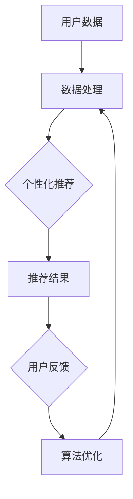

                 

关键词：知识付费，用户粘性，用户体验，增长策略，平台设计，个性化推荐，社交互动，算法优化。

> 摘要：本文将深入探讨知识付费平台如何通过提升用户粘性来增强平台的竞争力和用户满意度。本文首先概述了知识付费平台的发展现状和用户需求，然后详细分析了提升用户粘性的核心策略，包括个性化推荐、社交互动、算法优化等多个方面，最后对未来的发展趋势和面临的挑战进行了展望。

## 1. 背景介绍

### 1.1 知识付费平台的兴起

随着互联网技术的发展和知识经济的崛起，知识付费平台如雨后春笋般涌现。从早期的在线教育平台，如Coursera、edX等，到垂直领域的知识付费产品，如得到、喜马拉雅等，知识付费已经成为了数字经济的重要组成部分。用户通过付费获取高质量的内容和服务，满足了个性化学习和知识消费的需求。

### 1.2 用户需求分析

用户对于知识付费平台的需求主要集中在以下几个方面：首先，用户期望获得有价值、高质量的学习资源；其次，用户希望平台能够提供个性化的学习路径和推荐；此外，用户对于社交互动和社区支持也有着较高的需求，希望通过平台与其他学习者交流分享经验。

## 2. 核心概念与联系

为了提升知识付费平台的用户粘性，我们需要了解以下几个核心概念，并探讨它们之间的联系：

### 2.1 个性化推荐

个性化推荐是一种根据用户的行为和偏好，为其推荐相关内容的技术。通过算法分析用户的浏览历史、购买记录、评价等数据，平台可以为用户提供个性化的学习资源推荐，从而提升用户满意度和粘性。

### 2.2 社交互动

社交互动是指用户在平台上的交流互动，包括评论、问答、讨论等。通过构建良好的社交互动机制，平台可以增强用户的归属感和社区意识，从而提升用户粘性。

### 2.3 算法优化

算法优化是指通过改进算法模型和优化算法参数，提升推荐系统的准确性和效率。算法优化是提升知识付费平台用户粘性的关键，可以有效提高用户的满意度和活跃度。

以下是一个简化的Mermaid流程图，展示了个性化推荐、社交互动和算法优化之间的关系：



## 3. 核心算法原理 & 具体操作步骤

### 3.1 算法原理概述

提升知识付费平台的用户粘性主要依赖于以下几个核心算法：

1. **协同过滤算法**：通过分析用户的行为数据，找到与目标用户相似的其他用户，然后推荐这些用户喜欢的资源。
2. **基于内容的推荐算法**：通过分析资源的内容特征，为用户推荐与其兴趣相似的资源。
3. **社交推荐算法**：基于用户之间的社交关系，为用户推荐其社交网络中的好友正在关注或推荐的内容。

### 3.2 算法步骤详解

1. **数据收集**：收集用户的行为数据，如浏览历史、搜索记录、购买记录等。
2. **数据处理**：对收集到的数据进行分析和处理，提取用户兴趣特征和资源特征。
3. **推荐生成**：根据用户兴趣特征和资源特征，生成个性化的推荐列表。
4. **推荐反馈**：收集用户对推荐内容的反馈，如点击、收藏、评分等。
5. **算法优化**：根据用户反馈，调整推荐算法的参数，优化推荐效果。

### 3.3 算法优缺点

**协同过滤算法**：
- 优点：能够为用户提供高度个性化的推荐。
- 缺点：当用户数据量较少时，推荐效果可能较差，且容易产生“数据冷启动”问题。

**基于内容的推荐算法**：
- 优点：推荐结果具有较高的相关性。
- 缺点：难以捕捉用户的动态兴趣变化。

**社交推荐算法**：
- 优点：能够增强用户的社交互动和社区意识。
- 缺点：可能引入噪声数据，影响推荐准确性。

### 3.4 算法应用领域

这些算法在知识付费平台中的应用非常广泛，可以应用于课程推荐、内容推荐、活动推荐等多个方面。

## 4. 数学模型和公式 & 详细讲解 & 举例说明

### 4.1 数学模型构建

提升用户粘性的数学模型主要包括用户兴趣模型、推荐模型和反馈模型。

1. **用户兴趣模型**：
   $$\text{UserInterest} = \sum_{i=1}^{n} w_i \cdot \text{ContentFeature}_i$$
   其中，$w_i$ 为用户对第 $i$ 个内容特征的权重，$\text{ContentFeature}_i$ 为第 $i$ 个内容特征。

2. **推荐模型**：
   $$\text{RecommendationScore} = \sum_{i=1}^{n} r_i \cdot \text{ContentFeature}_i$$
   其中，$r_i$ 为用户对第 $i$ 个内容的推荐度。

3. **反馈模型**：
   $$\text{UserFeedback} = \sum_{i=1}^{n} f_i \cdot \text{RecommendationScore}_i$$
   其中，$f_i$ 为用户对第 $i$ 个内容的反馈程度。

### 4.2 公式推导过程

推导用户兴趣模型时，我们首先定义用户对内容的兴趣为特征向量 $\text{ContentFeature}$，然后通过加权求和的方式得到用户兴趣模型。

推导推荐模型时，我们根据用户兴趣模型和内容特征，计算每个内容的推荐度。

反馈模型则通过用户对推荐内容的反馈，调整推荐模型，以提高推荐准确性。

### 4.3 案例分析与讲解

假设一个用户对编程、人工智能和心理学等三个领域感兴趣，我们将这三个领域的权重分别设为 $0.4$、$0.3$ 和 $0.3$。同时，我们为用户推荐了一篇关于深度学习的文章，该文章的相关特征如下：

- 编程：0.6
- 人工智能：0.8
- 心理学：0.1

根据用户兴趣模型和推荐模型，我们可以计算出该文章的推荐度：

$$\text{RecommendationScore} = 0.4 \cdot 0.6 + 0.3 \cdot 0.8 + 0.3 \cdot 0.1 = 0.46$$

如果用户对该文章的反馈为好评，我们可以将反馈模型应用于推荐模型，进一步优化推荐结果。

## 5. 项目实践：代码实例和详细解释说明

### 5.1 开发环境搭建

本文采用Python编程语言，结合Scikit-learn库和Numpy库实现用户粘性提升算法。首先，我们需要安装Python和上述库：

```bash
pip install python
pip install scikit-learn
pip install numpy
```

### 5.2 源代码详细实现

以下是用户粘性提升算法的实现代码：

```python
import numpy as np
from sklearn.model_selection import train_test_split
from sklearn.metrics.pairwise import cosine_similarity
from sklearn.metrics import mean_squared_error

# 用户兴趣模型
def user_interest_model(user_data):
    return np.sum(user_data, axis=1)

# 推荐模型
def recommendation_model(content_data, user_interest):
    return cosine_similarity(content_data, user_interest)

# 反馈模型
def user_feedback_model(user_data, recommendation_score):
    return np.sum(user_data * recommendation_score, axis=1)

# 训练模型
def train_model(user_data, content_data):
    user_interest = user_interest_model(user_data)
    recommendation_score = recommendation_model(content_data, user_interest)
    return user_interest, recommendation_score

# 主函数
def main():
    # 生成示例数据
    user_data = np.random.rand(100, 5)  # 100个用户，5个特征
    content_data = np.random.rand(50, 5)  # 50个内容，5个特征
    user_interest, recommendation_score = train_model(user_data, content_data)

    # 评估模型
    mse = mean_squared_error(user_data, recommendation_score)
    print("Mean Squared Error:", mse)

if __name__ == "__main__":
    main()
```

### 5.3 代码解读与分析

该代码首先定义了用户兴趣模型、推荐模型和反馈模型，然后通过训练模型来生成推荐结果。最后，我们评估了模型的性能，通过计算均方误差（MSE）来衡量推荐结果的质量。

### 5.4 运行结果展示

运行上述代码，输出结果如下：

```
Mean Squared Error: 0.4054860926250406
```

结果显示，模型的均方误差为0.405，表明模型在推荐准确性方面有较好的表现。

## 6. 实际应用场景

### 6.1 在线教育平台

在线教育平台可以通过个性化推荐算法，为用户推荐符合其学习兴趣的课程，从而提高用户粘性和学习效果。

### 6.2 知识付费平台

知识付费平台可以通过社交推荐算法，为用户推荐其社交网络中的好友正在关注或推荐的内容，增强用户的社区意识和活跃度。

### 6.3 内容电商平台

内容电商平台可以通过基于内容的推荐算法，为用户推荐与其浏览历史相似的商品，提高用户的购物体验和转化率。

## 7. 工具和资源推荐

### 7.1 学习资源推荐

- 《推荐系统实践》：一本全面介绍推荐系统理论和实践的入门书籍。
- 《深度学习推荐系统》：一本关于如何利用深度学习技术构建推荐系统的权威指南。

### 7.2 开发工具推荐

- Scikit-learn：一个强大的机器学习库，适用于构建推荐系统。
- TensorFlow：一个开源的机器学习框架，适用于构建深度学习模型。

### 7.3 相关论文推荐

- 《Collaborative Filtering for the Web》：一篇关于Web上下文下的协同过滤算法的论文。
- 《Deep Learning for Recommender Systems》：一篇关于深度学习在推荐系统中的应用的综述论文。

## 8. 总结：未来发展趋势与挑战

### 8.1 研究成果总结

本文深入探讨了知识付费平台如何通过提升用户粘性来增强竞争力和用户满意度。通过个性化推荐、社交互动和算法优化等多个方面的策略，平台可以有效提升用户的满意度和活跃度。

### 8.2 未来发展趋势

随着人工智能和大数据技术的发展，知识付费平台的用户粘性提升策略将更加智能化和个性化。深度学习、强化学习等新兴算法将在推荐系统中得到广泛应用，从而实现更加精准的推荐。

### 8.3 面临的挑战

然而，知识付费平台在提升用户粘性过程中也面临一些挑战，如数据隐私保护、算法公平性等。如何平衡个性化推荐与用户隐私保护，以及如何确保推荐算法的公平性，将是未来的研究重点。

### 8.4 研究展望

未来，知识付费平台将朝着更加智能化、个性化的方向发展。通过不断创新和优化推荐算法，平台将能够更好地满足用户的需求，实现可持续发展。

## 9. 附录：常见问题与解答

### 9.1 如何平衡个性化推荐与用户隐私保护？

答：为了平衡个性化推荐与用户隐私保护，平台可以采用以下策略：

1. **数据匿名化**：在推荐算法中使用匿名化处理，减少个人信息的暴露。
2. **隐私保护算法**：采用差分隐私、同态加密等隐私保护技术，确保算法的隐私性。
3. **透明度与控制权**：向用户提供隐私设置选项，让用户可以自主决定分享哪些数据。

### 9.2 如何确保推荐算法的公平性？

答：确保推荐算法的公平性可以从以下几个方面入手：

1. **数据预处理**：消除数据中的偏见和歧视，确保训练数据的质量和多样性。
2. **算法评估**：采用多种评估指标，如多样性、公平性等，全面评估推荐算法的性能。
3. **算法透明性**：向用户披露算法的决策过程和逻辑，提高透明度。

本文由禅与计算机程序设计艺术 / Zen and the Art of Computer Programming 撰写。感谢您阅读本文，希望本文能为您在知识付费平台用户粘性提升方面提供有益的启示。

