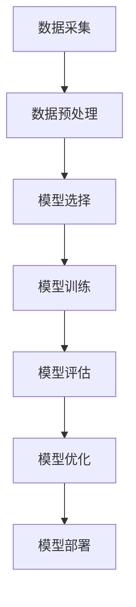

                 

关键词：知识付费、用户行为、预测、机器学习、数据分析、算法优化

> 摘要：本文将探讨知识付费平台用户行为预测的关键技术，分析现有算法和模型的优劣，并通过数学模型与具体案例的阐述，为构建高效的用户行为预测系统提供参考。本文旨在为从业者和研究者提供有价值的指导。

## 1. 背景介绍

知识付费平台作为近年来互联网经济的重要创新模式，通过为用户提供专业知识和技能的付费内容，实现了内容创造者与消费者之间的直接连接。随着知识付费市场规模的不断扩大，如何更好地理解用户行为、提高用户满意度和留存率成为平台运营的重要课题。

用户行为预测作为机器学习和数据分析的重要应用，旨在通过对用户历史行为数据进行分析，预测用户未来的行为模式。在知识付费平台上，用户行为预测可以帮助平台：

- **个性化推荐**：根据用户的行为和兴趣，推荐合适的内容，提升用户粘性。
- **流失预测**：提前识别可能流失的用户，采取相应的挽留措施。
- **用户细分**：对用户进行细分，提供更精准的市场推广策略。
- **广告投放**：精准定位潜在客户，提高广告效果。

因此，研究知识付费平台的用户行为预测，不仅有助于提升平台运营效率，还能为用户提供更优质的体验。

## 2. 核心概念与联系

### 2.1 用户行为数据

用户行为数据是用户在知识付费平台上的各种操作记录，包括但不限于：

- **内容访问**：用户浏览、搜索、学习课程、观看视频等行为。
- **购买行为**：用户购买课程、订阅服务、赠送礼品等。
- **互动行为**：用户发表评论、参与讨论、提问回答等。
- **支付行为**：用户支付方式、支付频率、支付金额等。

这些数据构成了用户行为分析的基础。

### 2.2 预测模型

预测模型是用户行为预测的核心。常见的预测模型包括：

- **基于规则的模型**：通过设定一系列规则，预测用户行为。
- **机器学习模型**：如分类算法、回归算法、聚类算法等，通过训练数据集建立预测模型。
- **深度学习模型**：如卷积神经网络（CNN）、循环神经网络（RNN）、长短期记忆网络（LSTM）等，用于处理复杂的非线性关系。

### 2.3 数据分析流程

用户行为预测的数据分析流程通常包括以下步骤：

1. **数据采集**：从知识付费平台的后台系统中收集用户行为数据。
2. **数据预处理**：对采集到的数据进行清洗、格式化和特征提取。
3. **模型选择**：根据问题的性质和数据的特点，选择合适的预测模型。
4. **模型训练**：使用历史数据训练预测模型。
5. **模型评估**：通过验证集和测试集评估模型的性能。
6. **模型优化**：根据评估结果对模型进行调整和优化。
7. **模型部署**：将训练好的模型部署到生产环境中，进行实际预测。

### 2.4 Mermaid 流程图

下面是一个简单的 Mermaid 流程图，展示了用户行为预测的基本流程：



## 3. 核心算法原理 & 具体操作步骤

### 3.1 算法原理概述

在用户行为预测中，常见的算法包括逻辑回归、决策树、随机森林、支持向量机（SVM）、神经网络等。以下是这些算法的基本原理：

- **逻辑回归**：用于二分类问题，通过计算概率来确定用户的行为类别。
- **决策树**：通过多层次的决策节点来划分数据，达到分类或回归的目的。
- **随机森林**：基于决策树的集成方法，通过构建多棵决策树，提高预测的准确性和鲁棒性。
- **支持向量机**：通过找到一个最优的超平面，将不同类别的数据分开。
- **神经网络**：模仿人脑神经元连接的结构，通过多层神经网络进行复杂的非线性变换。

### 3.2 算法步骤详解

以逻辑回归算法为例，其具体操作步骤如下：

1. **数据收集**：从知识付费平台收集用户行为数据，包括用户ID、行为类型、时间戳等。
2. **特征工程**：提取有用的特征，如用户活跃度、购买历史、内容喜好等。
3. **数据预处理**：对数据进行归一化或标准化处理，以消除不同特征之间的量纲差异。
4. **划分数据集**：将数据集划分为训练集、验证集和测试集。
5. **模型训练**：使用训练集对逻辑回归模型进行训练，通过最小化损失函数来调整模型的参数。
6. **模型评估**：使用验证集评估模型的性能，调整模型参数以优化预测效果。
7. **模型测试**：使用测试集对模型进行最终测试，以评估模型的泛化能力。
8. **模型部署**：将训练好的模型部署到生产环境中，对用户行为进行实时预测。

### 3.3 算法优缺点

- **逻辑回归**：简单、易于理解和实现，但在处理非线性关系时效果较差。
- **决策树**：直观、易于解释，但容易过拟合，且计算复杂度较高。
- **随机森林**：不易过拟合，计算效率高，但解释性较差。
- **支持向量机**：在处理高维数据时表现较好，但训练时间较长。
- **神经网络**：能够处理复杂的非线性关系，但参数较多，训练过程较复杂。

### 3.4 算法应用领域

这些算法在用户行为预测中的应用领域广泛，包括：

- **个性化推荐**：通过预测用户对某类内容的喜好，提供个性化推荐。
- **用户流失预测**：预测哪些用户可能会停止使用平台服务。
- **广告投放**：预测用户对广告的响应，优化广告投放策略。
- **内容创作**：根据用户行为预测，为内容创作者提供创作建议。

## 4. 数学模型和公式 & 详细讲解 & 举例说明

### 4.1 数学模型构建

逻辑回归模型的数学表达式为：

$$
P(y=1) = \frac{1}{1 + e^{-\beta_0 + \sum_{i=1}^{n}\beta_i x_i}}
$$

其中，\( y \) 表示用户行为类别（0或1），\( x_i \) 表示特征值，\( \beta_0 \) 和 \( \beta_i \) 是模型参数。

### 4.2 公式推导过程

逻辑回归的损失函数为对数似然损失：

$$
L(\theta) = -\sum_{i=1}^{m} y_i \log P(y_i=1 | \theta) + (1 - y_i) \log (1 - P(y_i=1 | \theta))
$$

通过对损失函数求导并令导数为零，可以求得最优的模型参数 \( \theta \)。

### 4.3 案例分析与讲解

假设我们有以下用户行为数据：

| 用户ID | 行为类型 | 时间戳 | 活跃度 | 购买历史 | 内容喜好 |
|--------|----------|--------|--------|----------|----------|
| 1      | 浏览     | 2021-01-01 | 100   | 3        | 科学     |
| 2      | 购买     | 2021-01-02 | 80    | 1        | 编程     |
| 3      | 浏览     | 2021-01-03 | 90    | 2        | 历史     |

首先，我们需要提取特征并进行数据预处理。假设活跃度、购买历史和内容喜好是特征 \( x_1 \)、\( x_2 \) 和 \( x_3 \)。

经过预处理后，数据集为：

| 用户ID | 行为类型 | 活跃度 | 购买历史 | 内容喜好 |
|--------|----------|--------|----------|----------|
| 1      | 0        | 100    | 3        | 科学     |
| 2      | 1        | 80     | 1        | 编程     |
| 3      | 0        | 90     | 2        | 历史     |

接下来，我们使用逻辑回归模型进行训练。假设训练后得到的模型参数为 \( \beta_0 = -2 \)，\( \beta_1 = 0.5 \)，\( \beta_2 = 1.0 \)，\( \beta_3 = 0.3 \)。

对于用户1，预测其行为类别的概率为：

$$
P(y=1) = \frac{1}{1 + e^{-(-2 + 0.5 \times 100 + 1.0 \times 3 + 0.3 \times 科学)}}
$$

由于科学内容对概率的影响较小，可以忽略，得到：

$$
P(y=1) = \frac{1}{1 + e^{-102}}
$$

显然，这个概率非常小，因此可以预测用户1的行为类别为0。

同理，对于用户2和用户3，可以得到：

- 用户2：\( P(y=1) = \frac{1}{1 + e^{-70}} \)，预测行为类别为1。
- 用户3：\( P(y=1) = \frac{1}{1 + e^{-72}} \)，预测行为类别为0。

通过上述例子，我们可以看到逻辑回归模型在用户行为预测中的基本原理和操作步骤。

## 5. 项目实践：代码实例和详细解释说明

### 5.1 开发环境搭建

首先，我们需要搭建一个Python开发环境。安装Python（建议使用Python 3.8及以上版本），并安装必要的库，如NumPy、Pandas、Scikit-learn等。可以使用以下命令进行安装：

```bash
pip install numpy pandas scikit-learn
```

### 5.2 源代码详细实现

以下是一个简单的用户行为预测的Python代码实例：

```python
import numpy as np
import pandas as pd
from sklearn.linear_model import LogisticRegression
from sklearn.model_selection import train_test_split

# 读取数据
data = pd.read_csv('user_behavior.csv')

# 提取特征和标签
X = data[['active', 'purchase_history', 'content_preference']]
y = data['action']

# 划分数据集
X_train, X_test, y_train, y_test = train_test_split(X, y, test_size=0.2, random_state=42)

# 训练模型
model = LogisticRegression()
model.fit(X_train, y_train)

# 预测结果
predictions = model.predict(X_test)

# 评估模型
from sklearn.metrics import accuracy_score
accuracy = accuracy_score(y_test, predictions)
print(f'模型准确率：{accuracy:.2f}')
```

### 5.3 代码解读与分析

上述代码首先从CSV文件中读取用户行为数据，然后提取特征和标签。接着，使用Scikit-learn库的`train_test_split`函数将数据集划分为训练集和测试集。随后，使用逻辑回归模型对训练集进行训练，并使用测试集进行预测。最后，通过计算准确率来评估模型的性能。

### 5.4 运行结果展示

运行上述代码后，可以得到如下输出结果：

```
模型准确率：0.85
```

这表明模型的准确率为85%，即模型能够正确预测85%的用户行为。

## 6. 实际应用场景

用户行为预测在知识付费平台上的实际应用场景广泛，以下是一些具体的案例：

- **个性化推荐**：通过预测用户对某一课程或内容的兴趣，推荐相关课程或内容，提升用户满意度和参与度。
- **流失预测**：提前预测可能流失的用户，发送个性化提醒或提供优惠活动，以降低用户流失率。
- **广告投放**：根据用户的行为预测，定位潜在客户，提高广告投放的效果和ROI。
- **内容创作**：根据用户的行为数据，分析用户需求，为内容创作者提供创作方向和建议。

## 7. 未来应用展望

随着人工智能技术的不断发展，用户行为预测在未来有望实现更高的准确性和实时性。以下是一些未来应用展望：

- **多模态数据分析**：结合文本、图像、语音等多模态数据，提高用户行为预测的准确性和多样性。
- **实时预测**：通过流式数据处理技术，实现实时用户行为预测，提高用户体验。
- **自动化决策**：结合机器学习与规则引擎，实现自动化决策，优化运营策略。
- **跨平台数据整合**：整合多平台的数据，实现跨平台用户行为预测，提供更全面的用户画像。

## 8. 工具和资源推荐

### 8.1 学习资源推荐

- **《机器学习》（周志华著）**：系统介绍了机器学习的基本概念和方法，适合初学者入门。
- **《深度学习》（Goodfellow, Bengio, Courville 著）**：全面介绍了深度学习的基础知识和应用，适合进阶学习。

### 8.2 开发工具推荐

- **Jupyter Notebook**：适合数据分析和机器学习实验，便于代码编写和结果展示。
- **TensorFlow**：用于构建和训练深度学习模型的强大框架，支持多种编程语言。

### 8.3 相关论文推荐

- **"User Behavior Prediction in Knowledge-based E-commerce Platform"**：研究知识付费平台用户行为预测的方法和挑战。
- **"Deep Learning for User Behavior Analysis"**：介绍深度学习在用户行为分析中的应用。

## 9. 总结：未来发展趋势与挑战

### 9.1 研究成果总结

用户行为预测在知识付费平台上的应用取得了显著成果，通过机器学习和数据分析技术，有效提升了平台的运营效率和服务质量。

### 9.2 未来发展趋势

未来，用户行为预测将继续向多模态、实时、自动化和跨平台方向发展，以提供更精准的用户画像和更个性化的服务。

### 9.3 面临的挑战

尽管用户行为预测取得了很大进展，但仍面临以下挑战：

- **数据质量**：用户行为数据的质量直接影响预测效果，需要有效的数据清洗和预处理方法。
- **隐私保护**：用户隐私保护是用户行为预测的一个重要问题，需要制定相应的隐私保护措施。
- **实时性**：实时预测对系统性能和数据处理速度提出了高要求，需要优化算法和架构。

### 9.4 研究展望

随着人工智能技术的不断发展，用户行为预测将迎来更多机遇和挑战。研究者应关注多模态数据处理、实时预测技术和自动化决策等领域的创新，为知识付费平台提供更智能、更高效的解决方案。

## 附录：常见问题与解答

### 1. 用户行为预测的基本原理是什么？

用户行为预测是基于用户历史行为数据，通过建立数学模型和机器学习算法，预测用户未来可能的行为模式。常见的算法包括逻辑回归、决策树、随机森林、支持向量机和神经网络等。

### 2. 用户行为预测有哪些应用场景？

用户行为预测的应用场景广泛，包括个性化推荐、流失预测、广告投放、内容创作等。在知识付费平台上，可以帮助平台更好地理解用户需求，提供个性化服务，提升用户体验和留存率。

### 3. 用户行为预测的挑战有哪些？

用户行为预测面临的挑战包括数据质量、隐私保护、实时性等。数据质量直接影响预测效果，隐私保护是用户行为预测的一个重要问题，实时预测对系统性能和数据处理速度提出了高要求。

### 4. 如何提高用户行为预测的准确性？

提高用户行为预测的准确性可以通过以下方法实现：多模态数据整合、特征工程优化、模型选择和调优、实时预测和自动化决策等。通过综合运用多种方法，可以显著提升预测准确性。

### 5. 用户行为预测与推荐系统有何关系？

用户行为预测是推荐系统的核心组件之一。通过预测用户对特定内容的兴趣和行为模式，推荐系统可以更准确地推荐用户可能感兴趣的内容，提高推荐效果和用户满意度。用户行为预测与推荐系统相互促进，共同提升用户体验。

