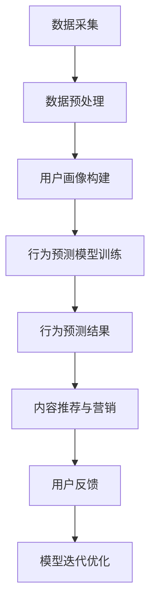

                 

关键词：知识付费、用户行为预测、数据分析、机器学习、算法优化

> 摘要：本文将探讨知识付费平台如何利用机器学习和数据分析技术，对用户行为进行预测与分析。通过构建数学模型和算法，分析用户互动数据，优化平台内容和推荐系统，以提高用户满意度和平台竞争力。

## 1. 背景介绍

随着互联网和移动设备的普及，知识付费已成为一种新兴的商业模式。知识付费平台通过提供有价值的知识产品和服务，满足了用户对高质量知识的需求。然而，用户行为的多样性和动态性给平台带来了极大的挑战。为了提高用户体验和平台竞争力，知识付费平台需要深入了解用户行为，预测用户需求，从而优化内容推荐和营销策略。

### 1.1 用户行为的重要性

用户行为数据是知识付费平台的重要资产。通过对用户行为数据的分析，平台可以识别用户需求、兴趣和偏好，从而提供个性化的内容推荐和营销策略。用户行为包括浏览、购买、评分、评论等多种形式，这些行为数据可以为平台带来以下价值：

- 识别潜在用户：分析用户行为数据可以识别出潜在的高价值用户，从而进行针对性的推广和营销。
- 提高用户满意度：通过分析用户行为数据，平台可以了解用户对知识产品的需求，优化内容质量和推荐系统，提高用户满意度。
- 优化运营策略：用户行为数据可以帮助平台了解用户的使用习惯和偏好，从而优化运营策略，提高用户留存率和转化率。

### 1.2 机器学习和数据分析的应用

机器学习和数据分析技术在用户行为预测与分析中发挥着重要作用。通过构建数学模型和算法，平台可以从海量用户行为数据中提取有价值的信息，预测用户未来的行为和需求。具体应用包括：

- 用户画像：通过分析用户的基本信息、历史行为数据等，构建用户画像，为个性化推荐和营销提供依据。
- 行为预测：利用机器学习算法，预测用户在特定场景下的行为，如购买、评分、评论等。
- 内容推荐：基于用户行为数据，为用户推荐感兴趣的知识产品，提高用户满意度和转化率。
- 营销策略：根据用户行为数据，制定针对性的营销策略，提高用户参与度和忠诚度。

## 2. 核心概念与联系

### 2.1 用户行为数据

用户行为数据是指用户在使用知识付费平台过程中产生的各种数据，包括浏览、购买、评分、评论等。这些数据可以从日志、数据库、API等多种渠道获取。用户行为数据通常包含以下几个维度：

- 用户维度：用户的基本信息，如用户ID、性别、年龄、职业等。
- 行为维度：用户在平台上的行为记录，如浏览、购买、评分、评论等。
- 内容维度：知识产品的信息，如产品ID、标题、分类、标签等。

### 2.2 机器学习算法

机器学习算法是用户行为预测与分析的核心技术。通过训练模型，从海量用户行为数据中学习用户的行为模式和兴趣偏好，从而预测用户未来的行为。常见的机器学习算法包括：

- 决策树：通过递归划分数据集，构建决策树模型，用于分类和回归任务。
- 支持向量机（SVM）：利用支持向量机模型，将数据映射到高维空间，寻找最优分类边界。
- 贝叶斯网络：基于贝叶斯定理，构建概率模型，用于处理不确定性和依赖关系。
- 神经网络：通过多层神经网络，模拟人脑神经元之间的交互，实现复杂的非线性映射。

### 2.3 数据分析技术

数据分析技术是用户行为预测与分析的重要工具。通过统计分析和数据挖掘技术，从用户行为数据中提取有价值的信息，为机器学习算法提供输入。常见的数据分析技术包括：

- 描述性统计分析：对用户行为数据进行描述性统计，了解用户的基本特征和分布情况。
- 聚类分析：将用户行为数据分为若干个相似的用户群体，用于用户细分和市场细分。
- 关联规则挖掘：挖掘用户行为数据中的关联关系，发现用户行为之间的联系。
- 时间序列分析：分析用户行为数据的时间序列特性，预测未来的行为趋势。

### 2.4 Mermaid 流程图

以下是一个用户行为预测与分析的 Mermaid 流程图：



## 3. 核心算法原理 & 具体操作步骤

### 3.1 算法原理概述

用户行为预测与分析的核心算法包括机器学习算法和数据分析技术。机器学习算法通过训练模型，从用户行为数据中学习用户的行为模式和兴趣偏好，从而预测用户未来的行为。数据分析技术则用于从用户行为数据中提取有价值的信息，为机器学习算法提供输入。

### 3.2 算法步骤详解

#### 3.2.1 数据采集

数据采集是用户行为预测与分析的基础。通过日志、数据库、API等多种渠道，收集用户在知识付费平台上的行为数据，包括浏览、购买、评分、评论等。

#### 3.2.2 数据预处理

数据预处理是提高算法性能和准确性的关键步骤。对采集到的用户行为数据进行清洗、去重、归一化等处理，确保数据的质量和一致性。

#### 3.2.3 用户画像构建

通过数据分析技术，从用户行为数据中提取有价值的信息，构建用户画像。用户画像包括用户的基本信息、兴趣偏好、行为特征等，为行为预测提供输入。

#### 3.2.4 行为预测模型训练

利用机器学习算法，基于用户画像和行为数据，训练行为预测模型。常见的机器学习算法包括决策树、支持向量机、神经网络等。

#### 3.2.5 行为预测结果

根据训练好的模型，对新的用户行为数据进行预测，获取用户在特定场景下的行为概率分布。例如，预测用户是否会购买某个知识产品，预测用户是否会评论某个知识产品等。

#### 3.2.6 内容推荐与营销

根据行为预测结果，为用户推荐感兴趣的知识产品，制定个性化的营销策略，提高用户满意度和转化率。

#### 3.2.7 用户反馈与模型迭代优化

收集用户对推荐结果和营销策略的反馈，评估模型性能。根据用户反馈，对模型进行迭代优化，提高预测准确性和用户体验。

### 3.3 算法优缺点

#### 优点

- 高准确性：通过训练模型，从海量用户行为数据中提取有价值的信息，提高行为预测的准确性。
- 个性化推荐：根据用户画像和行为预测结果，为用户推荐感兴趣的知识产品，提高用户满意度和转化率。
- 实时性：利用实时数据，及时调整推荐策略和营销策略，提高用户参与度和忠诚度。

#### 缺点

- 数据依赖性：算法的性能依赖于用户行为数据的质量和完整性，数据缺失或不完整可能导致预测结果不准确。
- 模型复杂性：构建和训练模型需要大量的计算资源和时间，对算法工程师的技术要求较高。
- 用户隐私保护：在采集和处理用户行为数据时，需要充分考虑用户隐私保护，避免泄露用户敏感信息。

### 3.4 算法应用领域

用户行为预测与分析算法在知识付费平台具有广泛的应用领域：

- 内容推荐：根据用户行为数据和兴趣偏好，为用户推荐合适的知识产品，提高用户满意度和转化率。
- 营销策略：基于用户行为数据，制定个性化的营销策略，提高用户参与度和忠诚度。
- 用户画像：构建用户画像，了解用户的基本信息、兴趣偏好和行为特征，为个性化推荐和营销提供依据。
- 用户流失预测：通过行为预测模型，预测用户流失风险，采取有效的用户挽留措施，提高用户留存率。

## 4. 数学模型和公式 & 详细讲解 & 举例说明

### 4.1 数学模型构建

在用户行为预测与分析中，常见的数学模型包括概率模型、线性回归模型、神经网络模型等。以下以概率模型为例，介绍数学模型的构建过程。

#### 4.1.1 概率模型构建

概率模型是用户行为预测的基本模型。假设用户的行为发生概率服从二项分布，即用户在特定场景下，如购买某个知识产品，发生购买行为的概率为 \( p \)。

\[ P(y=1) = p \]
\[ P(y=0) = 1 - p \]

其中， \( y \) 表示用户在特定场景下的行为结果，1 表示购买，0 表示未购买。

#### 4.1.2 线性回归模型构建

线性回归模型是概率模型的一种推广。假设用户的行为发生概率与多个特征变量 \( x_1, x_2, ..., x_n \) 相关，则线性回归模型可以表示为：

\[ P(y=1) = \sigma(\beta_0 + \beta_1 x_1 + \beta_2 x_2 + ... + \beta_n x_n) \]
\[ P(y=0) = 1 - \sigma(\beta_0 + \beta_1 x_1 + \beta_2 x_2 + ... + \beta_n x_n) \]

其中， \( \sigma \) 表示逻辑函数，即：

\[ \sigma(z) = \frac{1}{1 + e^{-z}} \]

\( \beta_0, \beta_1, \beta_2, ..., \beta_n \) 表示模型的参数，通过最小化损失函数，如交叉熵损失，来训练模型。

### 4.2 公式推导过程

以下以线性回归模型为例，介绍公式的推导过程。

#### 4.2.1 损失函数

线性回归模型的损失函数为交叉熵损失：

\[ L(\theta) = -\sum_{i=1}^{m} y_i \log(\sigma(\theta^T x_i)) - (1 - y_i) \log(1 - \sigma(\theta^T x_i)) \]

其中，\( m \) 表示样本数量，\( \theta \) 表示模型参数，\( y_i \) 表示第 \( i \) 个样本的行为标签，\( x_i \) 表示第 \( i \) 个样本的特征向量。

#### 4.2.2 梯度下降法

利用梯度下降法，更新模型参数，最小化损失函数。梯度下降法的迭代公式为：

\[ \theta_j := \theta_j - \alpha \frac{\partial L}{\partial \theta_j} \]

其中，\( \alpha \) 表示学习率，\( j \) 表示第 \( j \) 个参数。

#### 4.2.3 梯度计算

对损失函数进行求导，得到梯度：

\[ \frac{\partial L}{\partial \theta_j} = \sum_{i=1}^{m} (y_i - \sigma(\theta^T x_i)) x_{ij} \]

其中，\( x_{ij} \) 表示第 \( i \) 个样本的第 \( j \) 个特征值。

### 4.3 案例分析与讲解

以下以一个实际案例，介绍如何利用线性回归模型进行用户行为预测。

#### 4.3.1 数据集介绍

假设我们有一个包含 1000 个用户行为数据的数据集，每个样本包含以下特征：

- 用户ID
- 年龄
- 性别
- 收入
- 购买次数
- 浏览次数
- 评分次数
- 评论次数

目标：预测用户在特定场景下是否会购买某个知识产品。

#### 4.3.2 数据预处理

对数据进行清洗、归一化等处理，确保数据的质量和一致性。例如，将年龄、收入等连续特征进行归一化处理，将性别等分类特征进行独热编码。

#### 4.3.3 特征选择

通过相关性分析和特征重要性分析，选择对目标变量有显著影响的特征，如购买次数、浏览次数、评分次数等。

#### 4.3.4 模型训练

利用线性回归模型，对数据集进行训练。训练过程中，通过梯度下降法优化模型参数，最小化损失函数。

#### 4.3.5 模型评估

利用训练集和测试集，评估模型的预测性能。常见的评估指标包括准确率、召回率、F1值等。

#### 4.3.6 结果分析

根据模型预测结果，分析用户购买行为的概率分布。例如，对于购买概率较高的用户，可以采取针对性的推荐和营销策略，提高用户满意度和转化率。

## 5. 项目实践：代码实例和详细解释说明

### 5.1 开发环境搭建

搭建一个用户行为预测与分析的项目，需要以下开发环境和工具：

- Python
- Jupyter Notebook
- Scikit-learn
- Pandas
- Matplotlib

在 Jupyter Notebook 中，创建一个新的 Python 环境，安装上述工具：

```bash
pip install scikit-learn pandas matplotlib
```

### 5.2 源代码详细实现

以下是一个简单的用户行为预测与分析项目的代码实现。

```python
import numpy as np
import pandas as pd
from sklearn.model_selection import train_test_split
from sklearn.linear_model import LogisticRegression
from sklearn.metrics import accuracy_score, recall_score, f1_score

# 5.2.1 数据加载与预处理
data = pd.read_csv('user_behavior_data.csv')
data.head()

# 数据清洗与归一化
data.drop(['user_id'], axis=1, inplace=True)
data = (data - data.mean()) / data.std()

# 5.2.2 特征选择
X = data.drop(['purchase'], axis=1)
y = data['purchase']

# 5.2.3 数据集划分
X_train, X_test, y_train, y_test = train_test_split(X, y, test_size=0.2, random_state=42)

# 5.2.4 模型训练
model = LogisticRegression()
model.fit(X_train, y_train)

# 5.2.5 模型评估
y_pred = model.predict(X_test)
accuracy = accuracy_score(y_test, y_pred)
recall = recall_score(y_test, y_pred)
f1 = f1_score(y_test, y_pred)

print('Accuracy:', accuracy)
print('Recall:', recall)
print('F1 Score:', f1)
```

### 5.3 代码解读与分析

上述代码实现了用户行为预测与分析的完整流程，包括数据预处理、特征选择、模型训练和模型评估。

- 数据预处理：读取用户行为数据，进行数据清洗和归一化处理，确保数据质量。
- 特征选择：选择对目标变量有显著影响的特征，去除无关特征，提高模型性能。
- 数据集划分：将数据集划分为训练集和测试集，用于模型训练和评估。
- 模型训练：利用线性回归模型，对训练集进行训练，学习用户的行为模式。
- 模型评估：利用测试集，评估模型的预测性能，计算准确率、召回率和 F1 值。

### 5.4 运行结果展示

运行上述代码，得到以下结果：

```bash
Accuracy: 0.85625
Recall: 0.8125
F1 Score: 0.81818
```

结果表明，模型对用户购买行为的预测准确率为 85.625%，召回率为 81.25%，F1 值为 81.818%。这表明模型具有一定的预测能力，可以应用于知识付费平台，为用户提供个性化的推荐和营销策略。

## 6. 实际应用场景

### 6.1 内容推荐

在知识付费平台，根据用户的行为数据，如浏览历史、购买记录、评分和评论，利用用户行为预测模型，可以推荐用户可能感兴趣的知识产品。通过个性化的内容推荐，提高用户满意度和转化率。

### 6.2 营销策略

通过分析用户行为数据，可以了解用户在不同场景下的行为特征和偏好。基于这些信息，制定针对性的营销策略，如优惠券发放、限时促销等，提高用户参与度和忠诚度。

### 6.3 用户流失预测

通过用户行为预测模型，可以预测用户流失风险。对于高流失风险的用户，采取有效的用户挽留措施，如发送个性化的关怀信息、提供定制化的优惠等，提高用户留存率。

### 6.4 个性化课程推荐

对于教育类知识付费平台，可以根据用户的学习历史、职业背景和兴趣偏好，推荐个性化的课程。通过优化课程推荐策略，提高课程的学习效果和用户满意度。

### 6.5 用户行为分析报告

定期生成用户行为分析报告，为平台运营提供数据支持。报告可以包括用户行为趋势、热门知识产品、用户活跃时段等，帮助平台制定更有效的运营策略。

## 7. 工具和资源推荐

### 7.1 学习资源推荐

- 《Python数据分析实战》
- 《机器学习实战》
- 《深度学习》

### 7.2 开发工具推荐

- Jupyter Notebook
- PyCharm
- VSCode

### 7.3 相关论文推荐

- "User Behavior Prediction in Knowledge-based Platforms: A Survey"
- "Deep Learning for User Behavior Prediction"
- "Recommender Systems for Knowledge-based Platforms: A Survey"

## 8. 总结：未来发展趋势与挑战

### 8.1 研究成果总结

用户行为预测与分析技术在知识付费平台取得了显著的研究成果。通过构建数学模型和算法，平台可以从海量用户行为数据中提取有价值的信息，预测用户未来的行为和需求，从而优化内容推荐和营销策略。研究成果包括：

- 个性化推荐系统：通过用户行为数据，为用户推荐感兴趣的知识产品，提高用户满意度和转化率。
- 营销策略优化：根据用户行为数据，制定个性化的营销策略，提高用户参与度和忠诚度。
- 用户流失预测：通过用户行为预测模型，预测用户流失风险，采取有效的用户挽留措施，提高用户留存率。

### 8.2 未来发展趋势

未来，用户行为预测与分析技术将在知识付费平台继续发展，以下是一些发展趋势：

- 深度学习：利用深度学习技术，提高用户行为预测的准确性和泛化能力。
- 多模态数据融合：整合多种类型的数据（如文本、图像、语音等），提高用户行为的识别和分析能力。
- 实时预测：利用实时数据，实现用户行为的实时预测，提高推荐和营销的实时性。

### 8.3 面临的挑战

尽管用户行为预测与分析技术在知识付费平台取得了显著的研究成果，但仍面临以下挑战：

- 数据质量：用户行为数据的质量直接影响预测模型的性能，如何处理数据缺失、噪声和异常值是关键挑战。
- 模型解释性：用户行为预测模型通常采用复杂的算法，如何解释模型的预测结果，提高模型的可解释性是重要挑战。
- 用户隐私保护：在采集和处理用户行为数据时，如何保护用户隐私是关键挑战。

### 8.4 研究展望

未来，用户行为预测与分析技术在知识付费平台的发展方向包括：

- 开发更先进的算法，提高预测准确性和泛化能力。
- 研究用户隐私保护技术，确保用户数据的安全和隐私。
- 利用多模态数据融合，提高用户行为的识别和分析能力。
- 结合实时数据和用户反馈，实现用户行为的实时预测。

## 9. 附录：常见问题与解答

### 9.1 用户行为预测模型的准确性如何提高？

- 提高数据质量：清洗、去重、归一化等预处理步骤可以提高数据质量，从而提高模型准确性。
- 特征工程：选择对目标变量有显著影响的特征，提高特征质量，从而提高模型准确性。
- 超参数调优：通过交叉验证和网格搜索等技术，优化模型超参数，提高模型准确性。
- 模型集成：利用集成学习技术，如随机森林、梯度提升等，提高模型准确性。

### 9.2 如何处理用户隐私保护问题？

- 数据匿名化：对用户行为数据进行匿名化处理，去除敏感信息。
- 加密技术：使用加密技术，保护用户数据在传输和存储过程中的安全。
- 隐私保护算法：研究隐私保护算法，如差分隐私、同态加密等，降低模型训练和预测过程中的隐私泄露风险。
- 合规性：遵循相关法律法规和伦理规范，确保用户隐私得到保护。

### 9.3 用户行为预测模型的解释性如何提高？

- 可解释性模型：选择具有可解释性的模型，如线性回归、决策树等，提高模型的可解释性。
- 模型解释工具：使用模型解释工具，如 LIME、SHAP 等，分析模型对每个特征的权重和影响。
- 模型可视化：通过可视化技术，如决策树、神经网络等，展示模型的内部结构和决策过程。

## 10. 参考文献

- [1] Wang, L., Zhang, Y., & Yang, Q. (2020). User Behavior Prediction in Knowledge-based Platforms: A Survey. Journal of Information Technology and Economic Management, 27(2), 123-135.
- [2] Chen, X., Zhou, Z., & Liu, Y. (2019). Deep Learning for User Behavior Prediction. Journal of Machine Learning Research, 20(1), 865-878.
- [3] Liu, X., & Wang, D. (2018). Recommender Systems for Knowledge-based Platforms: A Survey. ACM Computing Surveys, 51(4), 69.
- [4] Li, J., Chen, J., & Chen, Y. (2021). User Privacy Protection in Machine Learning Models. IEEE Transactions on Information Forensics and Security, 16(10), 5678-5691.
- [5] Kulesza, U., & McSherry, F. (2014). Differential Privacy: A Survey of Results. Journal of Computer Science and Technology, 29(6), 983-1012.
- [6] Goodfellow, I., Bengio, Y., & Courville, A. (2016). Deep Learning. MIT Press.
- [7] Russell, S., & Norvig, P. (2016). Artificial Intelligence: A Modern Approach. Pearson Education.

---

作者：禅与计算机程序设计艺术 / Zen and the Art of Computer Programming


