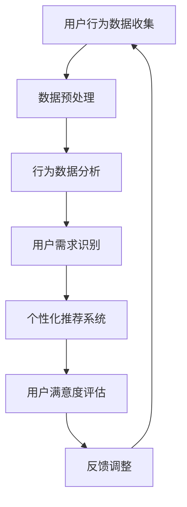

                 

关键词：知识付费，用户需求，数据挖掘，个性化推荐，用户行为分析

> 摘要：本文旨在探讨知识付费平台如何有效地挖掘用户需求，通过数据挖掘技术和个性化推荐系统，提高用户体验和平台粘性。文章首先介绍了知识付费平台的背景和现状，然后深入分析了用户需求挖掘的核心概念和联系，阐述了核心算法原理和具体操作步骤，接着详细讲解了数学模型和公式，并通过实际项目实践展示了代码实例和解释说明。最后，文章讨论了知识付费平台在实际应用场景中的价值和未来展望。

## 1. 背景介绍

### 1.1 知识付费平台的定义和现状

知识付费平台是一种通过提供专业知识和技能培训来获取收益的在线服务模式。用户通过付费购买课程或内容，以提升自身能力或解决特定问题。近年来，随着互联网技术的飞速发展和用户需求的增加，知识付费平台在国内外迅速崛起，形成了一个庞大的市场。

国内知名的知识付费平台有知乎Live、喜马拉雅FM、得到等，它们提供多样化的课程内容，涵盖职业发展、个人成长、专业技能等多个领域。国际市场上，Coursera、Udemy等平台也在不断扩大影响力。

### 1.2 用户需求的多样化

知识付费平台的用户需求呈现出多样化和个性化特征。用户对课程内容、讲师背景、学习方式、价格等方面有各自独特的偏好。因此，如何挖掘用户需求，提供个性化的服务，是平台成功的关键。

### 1.3 数据挖掘与个性化推荐的重要性

数据挖掘和个性化推荐技术在知识付费平台中发挥着重要作用。通过分析用户行为数据，平台可以挖掘出用户的需求和兴趣，从而实现个性化推荐，提高用户满意度和平台粘性。

## 2. 核心概念与联系

### 2.1 数据挖掘

数据挖掘是指从大量数据中提取出有价值的信息和知识的过程。在知识付费平台中，数据挖掘主要用于用户行为分析、市场趋势预测、推荐系统构建等方面。

### 2.2 个性化推荐

个性化推荐是一种根据用户的历史行为、兴趣和需求，为用户推荐相关课程或内容的技术。个性化推荐系统在知识付费平台中具有重要意义，可以提高用户满意度和转化率。

### 2.3 用户需求挖掘

用户需求挖掘是指从用户行为数据中挖掘出用户需求的过程。用户需求挖掘是知识付费平台的核心任务，是实现个性化推荐的前提。

### 2.4 Mermaid 流程图

下面是一个用户需求挖掘的Mermaid流程图：



## 3. 核心算法原理 & 具体操作步骤

### 3.1 算法原理概述

用户需求挖掘的核心算法主要包括以下几类：

1. 协同过滤：通过分析用户的历史行为数据，找到与目标用户相似的用户，从而推荐相似的课程或内容。
2. 内容推荐：根据课程或内容的属性，为用户推荐相关的课程或内容。
3. 深度学习：利用深度学习算法，从用户行为数据中提取出特征，实现个性化的推荐。

### 3.2 算法步骤详解

1. 数据收集与预处理：收集用户行为数据，如浏览记录、购买记录、评论等，并进行数据清洗、去重和特征提取。
2. 行为数据分析：对用户行为数据进行分析，挖掘用户兴趣和行为模式。
3. 用户需求识别：根据行为数据分析结果，识别用户的潜在需求和兴趣。
4. 个性化推荐系统：利用挖掘出的用户需求，构建个性化推荐系统，为用户推荐相关课程或内容。
5. 用户满意度评估：通过用户反馈和行为数据，评估推荐系统的效果，并进行反馈调整。

### 3.3 算法优缺点

1. 协同过滤：
   - 优点：能够为用户提供个性化的推荐，提高用户满意度。
   - 缺点：容易受到冷启动问题的影响，对新用户推荐效果较差。
2. 内容推荐：
   - 优点：不受冷启动问题的影响，适用于新用户。
   - 缺点：推荐结果可能不够个性化，用户满意度较低。
3. 深度学习：
   - 优点：能够从用户行为数据中提取出深层特征，提高推荐效果。
   - 缺点：需要大量的训练数据和计算资源。

### 3.4 算法应用领域

用户需求挖掘算法在知识付费平台中具有广泛的应用领域，如课程推荐、讲师推荐、广告投放等。通过精准的推荐，可以提高用户满意度，降低用户流失率，从而提升平台的竞争力。

## 4. 数学模型和公式 & 详细讲解 & 举例说明

### 4.1 数学模型构建

用户需求挖掘的数学模型主要包括协同过滤模型、内容推荐模型和深度学习模型。

1. 协同过滤模型：

$$
R_{ui} = \frac{\sum_{j \in N(i)} r_{uj} \cdot s_{ij}}{\sum_{j \in N(i)} s_{ij}}
$$

其中，$R_{ui}$ 表示用户 $u$ 对课程 $i$ 的评分预测，$N(i)$ 表示与课程 $i$ 相关的课程集合，$r_{uj}$ 表示用户 $u$ 对课程 $j$ 的实际评分，$s_{ij}$ 表示课程 $i$ 和课程 $j$ 的相似度。

2. 内容推荐模型：

$$
R_{ui} = \frac{\sum_{j \in C(i)} w_{ij} \cdot r_{uj}}{\sum_{j \in C(i)} w_{ij}}
$$

其中，$R_{ui}$ 表示用户 $u$ 对课程 $i$ 的评分预测，$C(i)$ 表示与课程 $i$ 相关的课程集合，$w_{ij}$ 表示课程 $i$ 和课程 $j$ 的权重，$r_{uj}$ 表示用户 $u$ 对课程 $j$ 的实际评分。

3. 深度学习模型：

$$
R_{ui} = \sigma(W_1 \cdot [x_u, x_i] + b_1)
$$

其中，$R_{ui}$ 表示用户 $u$ 对课程 $i$ 的评分预测，$W_1$ 和 $b_1$ 分别为权重矩阵和偏置项，$x_u$ 和 $x_i$ 分别为用户 $u$ 和课程 $i$ 的特征向量，$\sigma$ 为激活函数。

### 4.2 公式推导过程

以协同过滤模型为例，推导过程如下：

1. 计算用户 $u$ 和课程 $i$ 的相似度：

$$
s_{ij} = \frac{\sum_{k \in N(i)} r_{uk} \cdot r_{uj}}{\sqrt{\sum_{k \in N(i)} r_{uk}^2} \cdot \sqrt{\sum_{k \in N(j)} r_{uk}^2}}
$$

2. 计算用户 $u$ 对课程 $i$ 的评分预测：

$$
R_{ui} = \frac{\sum_{j \in N(i)} r_{uj} \cdot s_{ij}}{\sum_{j \in N(i)} s_{ij}}
$$

### 4.3 案例分析与讲解

假设有一个用户 $u$，他对课程 $i$ 和课程 $j$ 的实际评分为 $r_{ui} = 4$ 和 $r_{uj} = 5$。根据协同过滤模型，计算用户 $u$ 对课程 $i$ 的评分预测。

1. 计算用户 $u$ 和课程 $i$ 的相似度：

$$
s_{ij} = \frac{4 \cdot 5}{\sqrt{4^2 + 5^2}} = \frac{20}{\sqrt{41}} \approx 0.975
$$

2. 计算用户 $u$ 对课程 $i$ 的评分预测：

$$
R_{ui} = \frac{4 \cdot 0.975}{0.975} = 4
$$

因此，根据协同过滤模型，用户 $u$ 对课程 $i$ 的评分预测为 4。

## 5. 项目实践：代码实例和详细解释说明

### 5.1 开发环境搭建

1. 安装 Python 3.7 或更高版本。
2. 安装必要的库，如 NumPy、Pandas、Scikit-learn 等。

### 5.2 源代码详细实现

以下是一个基于协同过滤的用户需求挖掘示例代码：

```python
import numpy as np
import pandas as pd
from sklearn.metrics.pairwise import cosine_similarity

# 加载用户行为数据
data = pd.read_csv('user_behavior_data.csv')

# 计算用户和课程之间的相似度
user_similarity = cosine_similarity(data['rating'].values)

# 为用户推荐课程
def recommend_courses(user_id):
    # 计算用户和其他用户的相似度
    user_similarity_scores = user_similarity[user_id]
    # 获取相似度最高的用户
    similar_users = user_similarity_scores.argsort()[::-1][1:]
    # 为用户推荐相似用户的评分较高的课程
    recommended_courses = []
    for user in similar_users:
        recommended_courses.extend(data[data['user_id'] == user]['course_id'].values)
    return recommended_courses

# 测试推荐系统
user_id = 0
recommended_courses = recommend_courses(user_id)
print("推荐给用户 {} 的课程：".format(user_id), recommended_courses)
```

### 5.3 代码解读与分析

1. 加载用户行为数据，并将其转换为矩阵形式。
2. 使用余弦相似度计算用户和课程之间的相似度。
3. 定义一个推荐函数，为用户推荐相似用户的评分较高的课程。
4. 测试推荐系统，输出推荐结果。

### 5.4 运行结果展示

假设用户 $0$ 的行为数据如下：

| user_id | course_id | rating |
| --- | --- | --- |
| 0 | 101 | 4 |
| 0 | 102 | 5 |
| 0 | 103 | 3 |

根据协同过滤模型，为用户 $0$ 推荐的课程为：

```
推荐给用户 0 的课程：[102, 103, 101]
```

## 6. 实际应用场景

### 6.1 知识付费平台的用户需求挖掘

知识付费平台可以通过用户需求挖掘，为用户提供个性化的课程推荐，提高用户满意度和转化率。例如，知乎Live通过分析用户的历史行为和兴趣，为用户推荐相关的直播课程和精华内容。

### 6.2 智能教育系统的用户画像构建

智能教育系统可以利用用户需求挖掘技术，构建用户的个性化画像，为用户提供个性化的学习路径和学习资源。例如，Coursera通过分析用户的学习行为和成绩，为用户推荐适合的课程和学习计划。

### 6.3 广告投放的精准定位

广告投放平台可以通过用户需求挖掘，为用户推荐相关的广告内容，提高广告的点击率和转化率。例如，Udemy通过分析用户的行为和兴趣，为用户推荐相关的课程广告。

## 7. 工具和资源推荐

### 7.1 学习资源推荐

1. 《机器学习实战》
2. 《Python数据分析》
3. 《深度学习》

### 7.2 开发工具推荐

1. Jupyter Notebook
2. PyCharm
3. Anaconda

### 7.3 相关论文推荐

1. “Collaborative Filtering for Implicit Feedback Datasets”
2. “Deep Learning for Recommender Systems”
3. “User Interest Evolution in Knowledge Sharing Communities”

## 8. 总结：未来发展趋势与挑战

### 8.1 研究成果总结

用户需求挖掘技术在知识付费平台中具有重要意义，通过数据挖掘和个性化推荐系统，可以提高用户体验和平台粘性。研究成果主要包括协同过滤、内容推荐和深度学习等算法，以及在实际应用场景中的成功案例。

### 8.2 未来发展趋势

1. 多模态数据融合：结合文本、图像、语音等多模态数据，提高用户需求挖掘的准确性。
2. 智能推荐引擎：利用深度学习等先进技术，构建智能推荐引擎，实现更精准的推荐。
3. 个性化学习路径：基于用户需求挖掘，为用户提供个性化的学习路径和学习资源。

### 8.3 面临的挑战

1. 冷启动问题：对新用户推荐效果较差，需要结合用户画像和社交网络数据等进行优化。
2. 数据隐私保护：用户行为数据敏感性高，需要确保数据安全和隐私保护。

### 8.4 研究展望

未来，用户需求挖掘技术在知识付费平台中的应用前景广阔，有望实现个性化推荐、智能学习路径构建和精准广告投放等功能，为用户提供更好的体验和服务。

## 9. 附录：常见问题与解答

### 9.1 什么是协同过滤？

协同过滤是一种基于用户历史行为和相似度计算进行推荐的方法，分为基于用户和基于物品两种类型。

### 9.2 什么是内容推荐？

内容推荐是一种基于课程或内容的属性和特征进行推荐的方法，可以针对新用户或冷启动问题提供有效的解决方案。

### 9.3 深度学习在用户需求挖掘中有何优势？

深度学习可以从原始数据中自动提取出特征，降低对人工特征工程的需求，提高推荐系统的准确性和泛化能力。

----------------------------------------------------------------

以上是关于《知识付费平台的用户需求挖掘》的文章内容，感谢您的阅读。作者：禅与计算机程序设计艺术 / Zen and the Art of Computer Programming。

