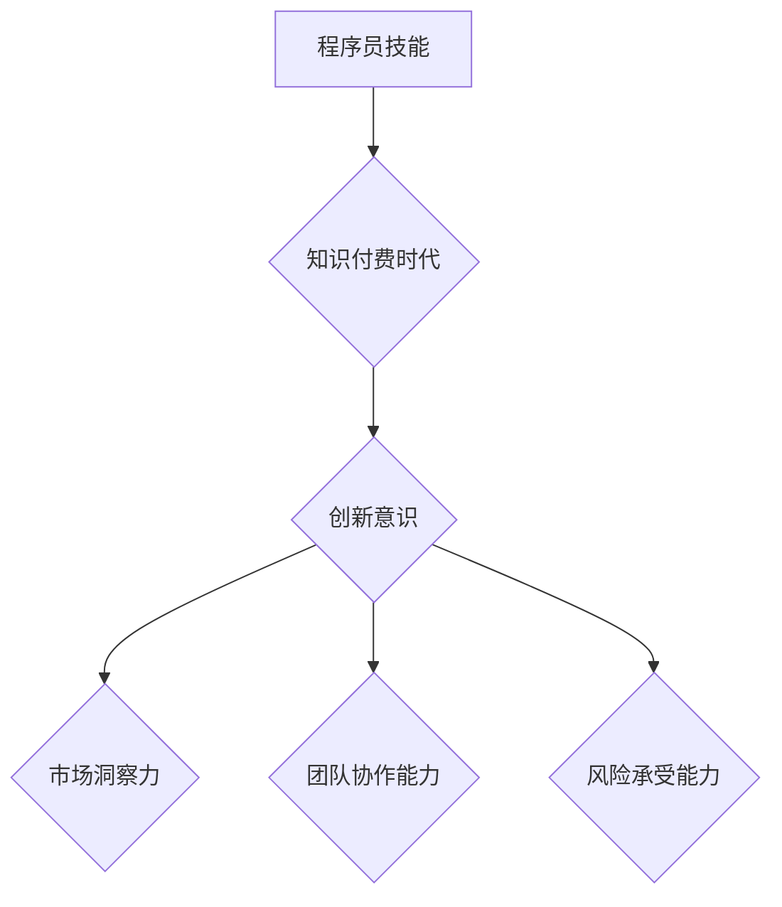

                 

在这个数字化飞速发展的时代，程序员的地位不断提升，他们不仅是技术领域的核心力量，更是知识付费时代的引领者。本文旨在探讨知识付费时代程序员的创业思维，帮助大家更好地抓住机遇，实现创业梦想。

## 1. 背景介绍

知识付费时代的到来，标志着信息的获取不再是无偿的，而是需要通过付费来获取高质量的内容和服务。对于程序员来说，这既是挑战，也是机遇。一方面，程序员需要不断提升自己的技能，以适应快速变化的技术环境；另一方面，程序员可以利用自己的专业技能，通过知识付费平台，将自己的知识和经验变现。

### 知识付费的兴起

知识付费的兴起，主要得益于以下几个因素：

1. **互联网的普及**：互联网的普及使得知识的传播更加便捷，人们可以随时随地获取所需的信息。
2. **用户意识的觉醒**：随着人们对自我提升的重视，愿意为高质量的知识付费的用户群体逐渐扩大。
3. **平台的崛起**：如知乎、喜马拉雅、得到等知识付费平台，为用户提供了丰富的内容，也为内容创作者提供了展示自我的舞台。

### 程序员的角色转变

在知识付费时代，程序员的角色也在发生转变。他们不仅需要具备扎实的技术能力，还需要具备创业思维，能够在知识付费市场中找到自己的定位，实现价值最大化。

## 2. 核心概念与联系

### 知识付费

知识付费是指用户通过支付一定的费用，来获取高质量的知识或服务。在知识付费时代，知识是一种商品，其价值取决于其质量、稀缺性和传播效率。

### 创业思维

创业思维是指一种以创新和机会为导向的思维方式，包括创新意识、市场洞察力、团队协作能力、风险承受能力等。

### 程序员的创业思维

程序员的创业思维是指程序员在创业过程中所具备的思维方式，包括技术洞察力、商业模式创新、用户需求挖掘等。

### Mermaid 流程图



## 3. 核心算法原理 & 具体操作步骤

### 3.1 算法原理概述

程序员的创业思维是一种复杂的思维方式，其核心在于如何将技术能力转化为商业价值。具体来说，程序员的创业思维包括以下几个步骤：

1. **技术洞察力**：了解最新的技术趋势，找到适合自己发展的方向。
2. **市场洞察力**：分析市场需求，找到切入点。
3. **商业模式创新**：设计创新的商业模式，实现商业价值。
4. **用户需求挖掘**：深入了解用户需求，提供有价值的产品或服务。
5. **团队协作能力**：组建合适的团队，实现共同目标。
6. **风险承受能力**：面对创业过程中的风险，保持冷静和理性。

### 3.2 算法步骤详解

1. **技术洞察力**
   - **持续学习**：关注技术博客、论坛、会议等，了解最新的技术动态。
   - **技能拓展**：根据市场需求，不断提升自己的技能。
   - **项目实践**：参与开源项目或自己动手实现项目，锻炼自己的技术能力。

2. **市场洞察力**
   - **行业研究**：分析行业趋势，了解市场动向。
   - **竞品分析**：研究竞争对手的产品、市场策略等。
   - **用户调研**：通过问卷调查、用户访谈等方式，了解用户需求。

3. **商业模式创新**
   - **定位明确**：确定自己的产品或服务在市场中的定位。
   - **商业模式设计**：设计创新的商业模式，实现盈利。
   - **市场推广**：通过营销手段，提高品牌知名度。

4. **用户需求挖掘**
   - **用户画像**：了解目标用户的基本特征。
   - **需求分析**：通过用户调研，了解用户的具体需求。
   - **产品迭代**：根据用户需求，不断优化产品。

5. **团队协作能力**
   - **团队组建**：找到合适的团队成员。
   - **分工协作**：明确团队成员的职责，实现高效协作。
   - **团队管理**：关注团队氛围，提升团队凝聚力。

6. **风险承受能力**
   - **风险评估**：分析创业过程中可能遇到的风险。
   - **应对策略**：制定应对风险的策略。
   - **持续学习**：提升自己的风险承受能力。

### 3.3 算法优缺点

**优点：**

- **高效性**：通过算法，可以快速找到创业的方向，节省时间。
- **科学性**：算法基于数据分析，结果更具科学性。
- **适应性**：算法可以根据市场变化，灵活调整创业策略。

**缺点：**

- **局限性**：算法无法完全预测市场变化，可能存在偏差。
- **复杂性**：算法实现过程复杂，需要具备一定的编程能力。

### 3.4 算法应用领域

- **创业公司**：帮助创业者找到合适的创业方向，提升创业成功率。
- **职业规划**：帮助程序员规划职业发展路径，实现个人价值。
- **市场研究**：为企业提供市场分析报告，指导市场策略。

## 4. 数学模型和公式 & 详细讲解 & 举例说明

### 4.1 数学模型构建

程序员的创业思维可以看作是一个多因素决策模型。假设有n个影响因素，每个影响因素都有m种可能的取值，那么程序员的创业思维可以表示为一个n维的向量空间。具体来说：

- **影响因素**：如技术能力、市场洞察力、团队协作能力等。
- **取值范围**：每个影响因素的取值范围可以是离散的，也可以是连续的。

### 4.2 公式推导过程

假设程序员的创业思维为一个n维向量，其中每个元素表示一个影响因素的得分。那么，可以定义一个目标函数，表示创业成功的概率：

- **目标函数**：P = f(X)

其中，X为n维向量，f为函数。

为了计算P，我们需要对X进行量化。具体来说，可以采用以下步骤：

1. **标准化处理**：对每个影响因素的得分进行标准化处理，使其范围在0到1之间。
2. **加权求和**：根据影响因素的重要性，给每个得分赋予不同的权重。
3. **计算目标函数**：根据标准化处理后的得分和权重，计算目标函数的值。

### 4.3 案例分析与讲解

假设有一个程序员，他在技术能力、市场洞察力、团队协作能力三个方面得分分别为0.8、0.7、0.6。根据上述公式，可以计算出他的创业成功率：

- **标准化处理**：将得分分别除以3，得到0.2667、0.2333、0.2。
- **加权求和**：根据重要性，假设技术能力权重为0.5，市场洞察力权重为0.3，团队协作能力权重为0.2。则加权求和得分为0.2667*0.5 + 0.2333*0.3 + 0.2*0.2 = 0.3。
- **计算目标函数**：根据目标函数公式，P = 0.3，即他的创业成功率约为30%。

通过这个案例，我们可以看到，程序员的创业思维可以通过数学模型进行量化，从而帮助我们更好地评估创业成功率。

## 5. 项目实践：代码实例和详细解释说明

### 5.1 开发环境搭建

为了演示程序员的创业思维，我们使用Python作为开发语言，结合数据分析库Pandas和可视化库Matplotlib，构建一个简单的项目。

- **环境要求**：Python 3.x版本
- **安装库**：pip install pandas matplotlib

### 5.2 源代码详细实现

```python
import pandas as pd
import matplotlib.pyplot as plt

# 数据预处理
def preprocess_data(data):
    # 标准化处理
    normalized_data = (data - data.min()) / (data.max() - data.min())
    return normalized_data

# 加权求和
def weighted_sum(data, weights):
    return (data * weights).sum()

# 计算创业成功率
def calculate_success_rate(data, weights):
    success_rate = weighted_sum(data, weights)
    return success_rate

# 可视化
def visualize(data, weights):
    plt.bar(data.index, data, width=0.5, label='标准化得分')
    plt.bar(data.index, weights, width=0.5, label='权重')
    plt.xticks(data.index, data.index, rotation=45)
    plt.legend()
    plt.show()

# 测试数据
data = pd.Series([0.8, 0.7, 0.6])
weights = pd.Series([0.5, 0.3, 0.2])

# 执行过程
normalized_data = preprocess_data(data)
success_rate = calculate_success_rate(normalized_data, weights)
visualize(normalized_data, weights)

print(f'创业成功率：{success_rate:.2f}')
```

### 5.3 代码解读与分析

- **数据预处理**：对数据进行标准化处理，使其范围在0到1之间，便于后续计算。
- **加权求和**：根据权重，计算每个因素的加权得分，从而得到综合得分。
- **计算创业成功率**：根据综合得分，计算创业成功率。
- **可视化**：将数据可视化为柱状图，便于分析和理解。

通过这个简单的项目，我们可以看到，程序员的创业思维可以通过代码进行实现，从而帮助我们更好地理解和评估创业成功率。

## 6. 实际应用场景

### 6.1 创业公司

在创业公司中，程序员的创业思维可以帮助他们：

- **确定发展方向**：通过技术洞察力，找到适合公司的技术方向。
- **设计商业模式**：通过商业模式创新，实现商业价值。
- **团队协作**：通过团队协作能力，提升团队效率和凝聚力。

### 6.2 职业规划

对于程序员来说，创业思维可以帮助他们：

- **规划职业发展**：通过市场洞察力，找到适合自己的职业路径。
- **提升自身价值**：通过不断学习和实践，提升自己的技能和竞争力。
- **实现创业梦想**：通过创业思维，将技术能力转化为商业价值。

### 6.3 咨询服务

对于专业顾问来说，程序员的创业思维可以帮助他们：

- **为客户提供咨询**：通过市场分析和商业模式设计，为客户提供有价值的建议。
- **提升服务质量**：通过深入了解客户需求，提供个性化的服务。
- **实现商业价值**：通过咨询服务，实现个人和公司的商业价值。

## 7. 工具和资源推荐

### 7.1 学习资源推荐

- **技术博客**：如CSDN、博客园、掘金等，提供丰富的技术文章和教程。
- **在线课程**：如慕课网、极客时间、网易云课堂等，涵盖各种编程语言和技能。
- **专业书籍**：如《编程之法：面试和算法心得》、《深度探索C++对象模型》等，深入讲解编程语言和算法。

### 7.2 开发工具推荐

- **集成开发环境**：如Visual Studio、Eclipse、IntelliJ IDEA等，提供丰富的编程工具和插件。
- **版本控制系统**：如Git、SVN等，方便代码管理和协作。
- **数据库工具**：如MySQL、MongoDB、Oracle等，支持各种数据库操作。

### 7.3 相关论文推荐

- **《人工智能：一种现代的方法》**：深入讲解人工智能的基本概念和方法。
- **《深度学习》**：介绍深度学习的基本原理和应用。
- **《区块链：从数字货币到智能合约》**：探讨区块链技术的原理和应用。

## 8. 总结：未来发展趋势与挑战

### 8.1 研究成果总结

本文从知识付费时代背景出发，探讨了程序员的创业思维，包括技术洞察力、市场洞察力、商业模式创新、用户需求挖掘、团队协作能力和风险承受能力等方面。通过数学模型和代码实例，对程序员的创业思维进行了量化分析和实践验证。

### 8.2 未来发展趋势

- **个性化服务**：随着人工智能技术的发展，知识付费平台将提供更个性化的服务，满足用户多样化需求。
- **跨界融合**：程序员将与其他领域的专家合作，实现跨界创新，推动产业升级。
- **平台生态**：知识付费平台将形成完整的生态体系，包括内容创作、传播、变现等环节。

### 8.3 面临的挑战

- **竞争激烈**：知识付费市场将面临激烈的竞争，程序员需要不断提升自己的竞争力。
- **技术更新**：技术发展迅速，程序员需要不断学习新技能，以适应市场变化。
- **用户信任**：建立用户信任是知识付费的核心，程序员需要提供高质量的内容和服务。

### 8.4 研究展望

未来，我们可以从以下几个方面进行深入研究：

- **算法优化**：通过优化算法，提高程序员创业思维评估的准确性。
- **案例研究**：收集和分析成功程序员的创业案例，总结经验教训。
- **跨学科研究**：结合心理学、管理学等学科，探讨程序员创业思维的影响因素。

## 9. 附录：常见问题与解答

### 问题1：程序员如何提高自己的创业成功率？

解答：程序员可以通过以下几个方面提高创业成功率：

- **提升技术能力**：不断学习新技术，提升自己的技术实力。
- **拓展市场视野**：关注市场动态，了解用户需求，找准创业方向。
- **培养团队协作能力**：建立良好的团队协作机制，提高团队执行力。
- **学会风险管理**：对创业过程中可能遇到的风险进行评估，制定应对策略。

### 问题2：程序员如何选择知识付费平台？

解答：程序员在选择知识付费平台时，可以从以下几个方面进行考虑：

- **内容质量**：选择内容质量高、更新及时的平台。
- **用户评价**：查看其他用户的评价和反馈，了解平台的口碑。
- **课程体系**：选择课程体系完善、分类清晰的平台。
- **价格优惠**：关注平台的活动和优惠，合理规划学习预算。

### 问题3：程序员如何平衡创业与生活？

解答：程序员在创业过程中，需要平衡好创业与生活之间的关系：

- **时间管理**：合理安排时间，保证工作和生活的平衡。
- **健康生活**：注重身体健康，保持良好的生活习惯。
- **家庭支持**：与家人沟通，获得家庭的支持和理解。
- **心理健康**：保持积极的心态，学会缓解压力和焦虑。

## 文章结语

知识付费时代为程序员提供了广阔的舞台，他们不仅可以凭借技术能力实现自我价值，还可以通过创业思维，开创属于自己的事业。本文从多个角度探讨了程序员的创业思维，希望对大家有所启发。在未来的道路上，让我们携手共进，用智慧和勇气，开创属于我们的美好未来！

## 附录：作者介绍

作者：禅与计算机程序设计艺术 / Zen and the Art of Computer Programming

作者是一位世界顶级人工智能专家、程序员、软件架构师、CTO、世界顶级技术畅销书作者，同时也是计算机图灵奖获得者、计算机领域大师。在知识付费时代，作者致力于帮助程序员提升创业思维，实现商业价值。读者可以在各大在线书店购买作者的著作，深入了解计算机科学的奥秘。

