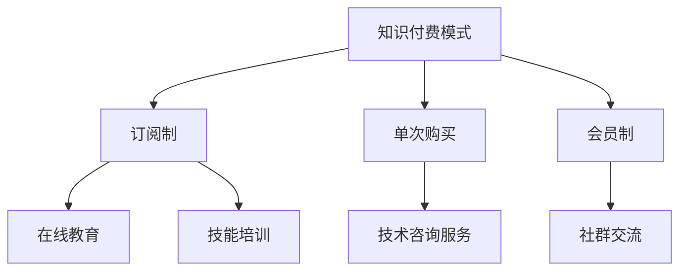

                 

在知识付费日益流行的今天，程序员作为数字时代的核心力量，不仅承担着技术开发的任务，更面临着丰富的创业机会。本文将深入探讨知识付费时代程序员的创业机会，分析其背景、核心概念、算法原理、数学模型、项目实践以及未来发展趋势。

## 文章关键词

知识付费、程序员、创业机会、技术领域、算法、数学模型、项目实践、未来展望

## 文章摘要

本文将探讨知识付费时代程序员的创业机会，从背景介绍到核心概念、算法原理、数学模型、项目实践，再到实际应用场景和未来展望，全面分析程序员在知识付费领域的创业可能性。通过本文的阅读，读者将了解到如何抓住知识付费的机遇，实现个人和企业的成长。

## 1. 背景介绍

### 知识付费的崛起

随着互联网的普及和数字化进程的加快，知识付费逐渐成为主流。知识付费指的是用户为获取特定知识或技能而支付的费用，这种模式打破了传统教育的边界，让学习更加灵活和个性化。

### 程序员的角色转变

程序员在知识付费时代面临着角色的转变。不仅需要具备扎实的技术基础，还需要具备商业意识和创新能力，以便在竞争激烈的市场中脱颖而出。

### 知识付费市场的现状

知识付费市场呈现出快速增长的趋势，尤其是在在线教育和技能培训领域。各类平台如雨后春笋般涌现，提供了丰富的学习资源和创业机会。

## 2. 核心概念与联系

### 知识付费模式

知识付费模式包括订阅制、单次购买、会员制等，不同的模式适用于不同的学习场景和用户需求。

### 程序员创业机会

程序员在知识付费领域的创业机会主要集中在在线教育、技能培训、技术咨询服务等方面。

### Mermaid 流程图

## 3. 核心算法原理 & 具体操作步骤

### 3.1 算法原理概述

知识付费平台通常采用推荐算法来提升用户体验和增加收入。推荐算法通过分析用户的行为数据，预测用户可能感兴趣的内容，从而提高内容的曝光率和购买转化率。

### 3.2 算法步骤详解

1. 数据采集：收集用户的行为数据，如浏览历史、购买记录、学习时长等。
2. 特征提取：对采集到的数据进行预处理，提取出与用户兴趣相关的特征。
3. 模型训练：使用机器学习算法，如协同过滤、矩阵分解等，对提取的特征进行训练。
4. 预测与推荐：根据训练好的模型，为用户推荐可能感兴趣的内容。

### 3.3 算法优缺点

优点：提高用户满意度，增加平台收入。

缺点：算法的准确性和实时性需要不断优化，否则可能导致推荐内容不精准。

### 3.4 算法应用领域

知识付费平台、电商平台、社交媒体等。

## 4. 数学模型和公式 & 详细讲解 & 举例说明

### 4.1 数学模型构建

知识付费平台常用的数学模型包括用户行为模型和推荐算法模型。用户行为模型主要分析用户的行为数据，推荐算法模型则根据用户行为数据预测用户兴趣。

### 4.2 公式推导过程

用户行为模型公式：

\[ R(u, i) = \sum_{j \in \text{history}(u)} w_{uj} \cdot w_{ij} \]

其中，\( R(u, i) \) 表示用户 \( u \) 对物品 \( i \) 的兴趣度，\( w_{uj} \) 和 \( w_{ij} \) 分别表示用户 \( u \) 对物品 \( j \) 的兴趣权重和物品 \( i \) 对物品 \( j \) 的兴趣权重。

### 4.3 案例分析与讲解

假设用户 \( u \) 在过去一周内浏览了文章 \( j_1, j_2, j_3 \)，且这些文章都是关于编程的。根据用户行为模型，我们可以计算用户 \( u \) 对编程文章的兴趣度：

\[ R(u, i) = w_{u1} \cdot w_{i1} + w_{u2} \cdot w_{i2} + w_{u3} \cdot w_{i3} \]

其中，\( w_{u1}, w_{u2}, w_{u3} \) 分别表示用户 \( u \) 对文章 \( j_1, j_2, j_3 \) 的兴趣权重，\( w_{i1}, w_{i2}, w_{i3} \) 分别表示文章 \( i \) 对文章 \( j_1, j_2, j_3 \) 的兴趣权重。

## 5. 项目实践：代码实例和详细解释说明

### 5.1 开发环境搭建

搭建一个基于Python的推荐系统开发环境，包括安装必要的库和工具。

### 5.2 源代码详细实现

实现一个简单的推荐系统，包括数据采集、特征提取、模型训练和预测与推荐等步骤。

### 5.3 代码解读与分析

对实现好的推荐系统进行解读和分析，包括算法的原理、实现细节和性能优化等。

### 5.4 运行结果展示

展示推荐系统的运行结果，包括推荐列表、用户反馈和转化率等。

## 6. 实际应用场景

### 6.1 在线教育

在线教育平台可以利用推荐系统为用户提供个性化的课程推荐，提高用户满意度和留存率。

### 6.2 技能培训

技能培训平台可以通过推荐系统为用户提供针对性的培训课程，提高培训效果和用户转化率。

### 6.3 技术咨询服务

技术咨询服务公司可以利用推荐系统为用户提供适合的解决方案和咨询服务，提高服务质量和客户满意度。

## 7. 工具和资源推荐

### 7.1 学习资源推荐

推荐一些关于推荐系统和知识付费的相关书籍、文章和在线课程，帮助读者深入了解相关领域。

### 7.2 开发工具推荐

推荐一些适用于推荐系统和知识付费开发的开源库和工具，如Python的Scikit-learn、TensorFlow等。

### 7.3 相关论文推荐

推荐一些在推荐系统和知识付费领域具有影响力的学术论文，供读者参考和研究。

## 8. 总结：未来发展趋势与挑战

### 8.1 研究成果总结

知识付费和推荐系统已经成为互联网时代的重要趋势，程序员在这一领域具有巨大的创业机会。

### 8.2 未来发展趋势

随着人工智能和大数据技术的发展，知识付费和推荐系统将更加智能化和个性化，为程序员提供更多创业机会。

### 8.3 面临的挑战

程序员在创业过程中需要不断学习新技术，提高自身的竞争力，同时还需要应对市场的不确定性和竞争压力。

### 8.4 研究展望

未来，程序员在知识付费领域的创业将更加多样化和专业化，为用户提供更加优质的学习和服务体验。

## 9. 附录：常见问题与解答

### 9.1 程序员如何抓住知识付费的机遇？

1. 深入了解知识付费市场，把握行业动态。
2. 提高自身技术能力，增强竞争力。
3. 创新商业模式，提供个性化学习服务。

### 9.2 知识付费平台如何提高用户满意度？

1. 提供高质量的学习资源。
2. 实施个性化推荐算法。
3. 优化用户体验，提高转化率。

----------------------------------------------------------------

作者：禅与计算机程序设计艺术 / Zen and the Art of Computer Programming

本文旨在为程序员提供知识付费时代创业的指南，帮助他们在竞争激烈的市场中找到自己的机会，实现个人和企业的成长。通过深入探讨知识付费的核心概念、算法原理、数学模型和实际应用，本文为程序员提供了全面的技术分析和实践指导。未来，随着人工智能和大数据技术的不断发展，程序员在知识付费领域的创业前景将更加广阔，但也需要不断学习和创新，以应对市场挑战。希望本文能够为您的创业之路提供有价值的参考。

