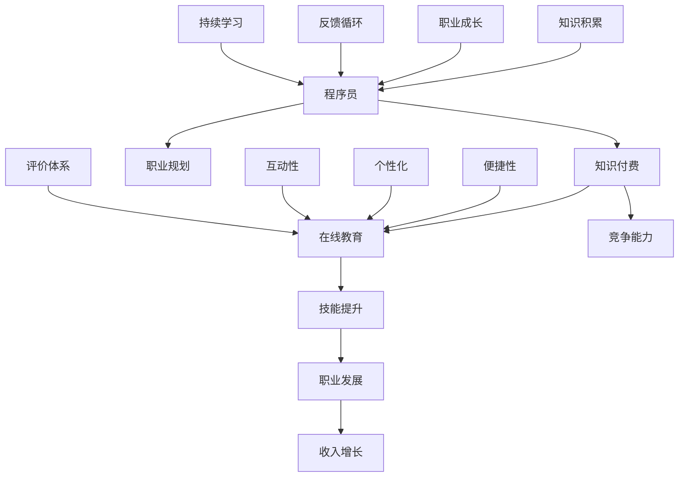

                 

### 关键词 Keyword
- 知识付费
- 程序员
- 职业发展
- 技能提升
- 行业趋势
- 技术创新
- 在线教育

<|assistant|>### 摘要 Abstract
在知识付费时代，程序员作为技术领域的重要从业者，面临着前所未有的职业发展机遇和挑战。本文将探讨知识付费对程序员职业发展的影响，分析程序员如何利用付费知识和技能提升，探讨行业趋势和技术创新，以及在线教育平台在这一领域的应用和前景。通过对这些问题的深入分析，本文旨在为程序员提供指导，帮助他们更好地把握知识付费时代的机遇，实现个人职业成长。

## 1. 背景介绍

### 知识付费时代的崛起

知识付费时代，指的是以付费内容消费为核心，知识服务逐渐成为一种新兴商业模式的时代。在这一背景下，用户对知识的获取方式发生了根本性的变化，从传统的免费共享转向有偿获取。这一转变主要受到以下几个因素的推动：

1. **信息过载**：随着互联网的普及，用户每天接触到的大量信息中，高质量、有价值的内容往往被淹没在大量的垃圾信息中。为了筛选出真正有价值的信息，用户开始愿意为知识付费。

2. **个性化需求**：互联网用户越来越追求个性化、定制化的知识服务，付费内容能够更好地满足用户在特定领域、特定需求上的学习需求。

3. **技术进步**：移动互联网和在线教育技术的发展，使得知识的获取和传播变得更加便捷和高效，为知识付费模式的普及提供了技术支持。

### 程序员职业的变迁

程序员作为知识付费时代的重要从业者，其职业发展也受到了深刻的影响。在过去，程序员的职业路径相对固定，往往从程序员起步，逐步晋升为高级开发工程师、技术经理等。然而，在知识付费时代，程序员的职业发展路径变得更加多样化和灵活：

1. **技能多样化**：程序员不仅需要掌握传统的编程技能，还需要不断学习新的编程语言、框架和工具，以适应不断变化的技术需求。

2. **职业转型**：知识付费时代为程序员提供了更多的职业发展机会，如技术顾问、云计算专家、人工智能工程师等。

3. **在线学习**：在线教育平台的兴起，使得程序员可以更加便捷地获取最新的知识和技能，不断提升自己的竞争力。

### 知识付费对程序员的影响

知识付费不仅改变了程序员的学习方式，也对他们的职业发展产生了深远的影响：

1. **技能提升**：通过付费学习，程序员能够更快速、更系统地掌握新技术，提升自己的技能水平。

2. **职业发展**：付费学习有助于程序员在求职和晋升过程中展示自己的专业能力和学习态度，提高竞争力。

3. **收入增长**：掌握更多技能的程序员，往往能够获得更高的薪资和更广阔的职业发展空间。

## 2. 核心概念与联系

### 知识付费与程序员职业发展的联系

知识付费与程序员职业发展之间的联系，可以从以下几个方面进行阐述：

1. **技能提升**：知识付费为程序员提供了获取新技能的途径，使得他们能够更快地跟上技术发展的步伐。

2. **职业规划**：付费学习可以帮助程序员明确自己的职业发展方向，制定更有针对性的职业规划。

3. **竞争能力**：在知识付费时代，拥有更多技能和知识的程序员在求职和晋升过程中更具竞争力。

4. **收入增长**：通过付费学习提升技能，程序员可以获得更高的薪资和更好的职业机会，从而实现收入增长。

### 知识付费与在线教育的结合

在线教育是知识付费时代的重要载体，它与程序员职业发展的关系体现在以下几个方面：

1. **便捷性**：在线教育平台提供了丰富的学习资源，程序员可以随时随地学习，不受时间和地点的限制。

2. **个性化**：在线教育平台可以根据程序员的兴趣、需求和技能水平，提供个性化的学习内容和指导。

3. **互动性**：在线教育平台提供了多种互动方式，如直播课程、讨论区、问答等，促进了程序员之间的交流和合作。

4. **评价体系**：在线教育平台建立了完善的评价体系，通过对学员的学习进度、作业完成情况、课程评分等进行评价，为程序员的职业发展提供参考。

### 知识付费与职业发展的互动关系

知识付费与程序员职业发展之间的互动关系，可以从以下几个方面进行理解：

1. **知识积累**：通过付费学习，程序员不断积累知识，提升自己的技能水平。

2. **职业成长**：随着知识积累，程序员在职业生涯中不断成长，获得更多的机会和挑战。

3. **反馈循环**：程序员的职业成长又会反过来促进他们对知识的渴求，形成正反馈循环。

4. **持续学习**：在知识付费时代，持续学习成为程序员职业发展的必备条件，只有不断更新知识，才能保持竞争力。

### Mermaid 流程图



## 3. 核心算法原理 & 具体操作步骤

### 3.1 算法原理概述

在知识付费时代，程序员职业发展的核心算法可以看作是一个动态规划问题，其目标是最大化程序员的职业价值和收入。具体来说，该算法涉及以下几个方面：

1. **技能集构建**：根据程序员的兴趣、专业背景和市场需求，构建一个包含多种编程语言、框架和工具的技能集。

2. **学习路径规划**：通过分析技能集，为程序员规划一个最优的学习路径，使其能够最快地掌握所需技能。

3. **职业机会评估**：根据程序员的技能水平和市场需求，评估其潜在的就业机会和薪资水平。

4. **动态调整**：根据程序员的职业发展和市场变化，实时调整其学习路径和职业规划。

### 3.2 算法步骤详解

1. **技能集构建**：

   - 收集程序员的专业背景、兴趣和市场需求信息；
   - 根据收集到的信息，构建一个包含编程语言、框架和工具的技能集。

2. **学习路径规划**：

   - 对技能集进行排序，确定学习优先级；
   - 根据学习优先级，制定一个包含学习目标、学习资源和时间安排的学习计划。

3. **职业机会评估**：

   - 收集市场上的就业机会和薪资水平信息；
   - 根据程序员的技能水平和市场需求，评估其潜在的就业机会和薪资水平。

4. **动态调整**：

   - 定期收集程序员的职业发展数据，分析其职业发展状况；
   - 根据分析结果，调整学习路径和职业规划。

### 3.3 算法优缺点

**优点**：

1. **优化学习路径**：通过分析程序员的兴趣、专业背景和市场需求，制定最优的学习路径，提高学习效率。
2. **实时调整**：根据程序员的职业发展和市场变化，动态调整学习路径和职业规划，确保其始终处于最佳状态。
3. **提高竞争力**：通过不断学习和更新技能，提高程序员的竞争力，为其职业发展提供更多机会。

**缺点**：

1. **数据依赖**：算法的有效性依赖于准确的数据支持，数据收集和处理的难度较大。
2. **学习成本**：算法的执行需要大量的时间和资源投入，程序员需要承担一定的学习成本。
3. **市场波动**：市场需求的不确定性可能导致算法的预测不准确，影响程序员的职业发展。

### 3.4 算法应用领域

1. **职业规划**：为程序员提供个性化的职业规划建议，帮助其明确职业发展方向。
2. **在线教育**：为在线教育平台提供算法支持，优化课程设置和学习路径，提高学习效果。
3. **人才招聘**：为企业提供人才招聘建议，帮助其筛选合适的人才。

## 4. 数学模型和公式 & 详细讲解 & 举例说明

### 4.1 数学模型构建

在知识付费时代，程序员的职业发展可以看作是一个动态规划问题，其数学模型如下：

设 \(P(i, t)\) 为第 \(i\) 个技能在时间 \(t\) 时的价值，\(C(i, t)\) 为第 \(i\) 个技能在时间 \(t\) 时的学习成本，\(A(t)\) 为时间 \(t\) 时的就业机会集合，\(R(t)\) 为时间 \(t\) 时的薪资水平集合。

则程序员的职业发展价值 \(V(t)\) 可以表示为：

\[ V(t) = \max_{i \in A(t)} \left\{ P(i, t) - C(i, t) \right\} \]

### 4.2 公式推导过程

1. **价值函数**：

   程序员的职业价值 \(V(t)\) 是每个潜在技能价值 \(P(i, t)\) 减去学习成本 \(C(i, t)\) 的最大值。

   \[ V(t) = \max_{i \in A(t)} \left\{ P(i, t) - C(i, t) \right\} \]

2. **就业机会集合**：

   假设第 \(i\) 个技能在时间 \(t\) 时的就业机会为 \(O(i, t)\)，则就业机会集合 \(A(t)\) 可以表示为：

   \[ A(t) = \{ i | O(i, t) > 0 \} \]

3. **薪资水平集合**：

   假设第 \(i\) 个技能在时间 \(t\) 时的薪资水平为 \(R(i, t)\)，则薪资水平集合 \(R(t)\) 可以表示为：

   \[ R(t) = \{ R(i, t) | i \in A(t) \} \]

### 4.3 案例分析与讲解

假设有一位程序员，他在 2020 年学习了 Python 编程语言，并在 2021 年开始寻找相关的工作机会。以下是他的职业发展过程中的数学模型和公式推导：

1. **技能集构建**：

   - 技能 1：Python 编程语言，学习成本为 2000 元；
   - 技能 2：Django 框架，学习成本为 1500 元。

2. **学习路径规划**：

   - 学习优先级：Python 编程语言 > Django 框架；
   - 学习计划：2020 年学习 Python 编程语言，2021 年学习 Django 框架。

3. **职业机会评估**：

   - 2021 年 Python 开发岗位就业机会为 50%，薪资水平为 8000 元/月；
   - 2021 年 Django 开发岗位就业机会为 30%，薪资水平为 9000 元/月。

4. **职业发展价值计算**：

   - Python 编程语言职业发展价值：\[ P(1, 2021) - C(1, 2021) = 8000 - 2000 = 6000 \] 元；
   - Django 框架职业发展价值：\[ P(2, 2021) - C(2, 2021) = 9000 - 1500 = 7500 \] 元。

   - 最优职业发展价值：\[ V(2021) = \max \{ 6000, 7500 \} = 7500 \] 元。

通过以上计算，我们可以得出这位程序员的职业发展价值为 7500 元。

## 5. 项目实践：代码实例和详细解释说明

### 5.1 开发环境搭建

为了更好地展示程序员在知识付费时代如何通过项目实践提升技能，我们将使用 Python 编程语言来实现一个简单的知识付费平台。以下是如何搭建开发环境：

1. **安装 Python**：下载并安装 Python 3.8 或以上版本。
2. **安装依赖库**：在命令行中运行以下命令安装所需的依赖库：

   ```shell
   pip install Flask
   pip install SQLAlchemy
   pip install Flask-Login
   ```

3. **创建项目**：在命令行中创建一个名为 `knowledge_platform` 的文件夹，并使用以下命令创建一个虚拟环境：

   ```shell
   python -m venv venv
   ```

   然后激活虚拟环境：

   ```shell
   source venv/bin/activate
   ```

### 5.2 源代码详细实现

以下是一个简单的知识付费平台项目示例，其中包括用户注册、登录、课程购买等功能。

```python
# app.py

from flask import Flask, render_template, request, redirect, url_for, flash
from flask_sqlalchemy import SQLAlchemy
from flask_login import LoginManager, UserMixin, login_user, login_required, logout_user, current_user

app = Flask(__name__)
app.config['SQLALCHEMY_DATABASE_URI'] = 'sqlite:///users.db'
app.config['SECRET_KEY'] = 'your_secret_key'

db = SQLAlchemy(app)
login_manager = LoginManager(app)
login_manager.login_view = 'login'

class User(UserMixin, db.Model):
    id = db.Column(db.Integer, primary_key=True)
    username = db.Column(db.String(100), unique=True, nullable=False)
    password = db.Column(db.String(100), nullable=False)

@login_manager.user_loader
def load_user(user_id):
    return User.query.get(int(user_id))

@app.route('/')
def index():
    return render_template('index.html')

@app.route('/register', methods=['GET', 'POST'])
def register():
    if request.method == 'POST':
        username = request.form['username']
        password = request.form['password']
        if not username or not password:
            flash('请填写用户名和密码！', 'error')
            return redirect(url_for('register'))
        if User.query.filter_by(username=username).first():
            flash('用户名已存在！', 'error')
            return redirect(url_for('register'))
        new_user = User(username=username, password=password)
        db.session.add(new_user)
        db.session.commit()
        return redirect(url_for('login'))
    return render_template('register.html')

@app.route('/login', methods=['GET', 'POST'])
def login():
    if request.method == 'POST':
        username = request.form['username']
        password = request.form['password']
        user = User.query.filter_by(username=username).first()
        if user and user.password == password:
            login_user(user)
            return redirect(url_for('dashboard'))
        else:
            flash('用户名或密码错误！', 'error')
            return redirect(url_for('login'))
    return render_template('login.html')

@app.route('/dashboard')
@login_required
def dashboard():
    return render_template('dashboard.html')

@app.route('/logout')
@login_required
def logout():
    logout_user()
    return redirect(url_for('index'))

if __name__ == '__main__':
    db.create_all()
    app.run(debug=True)
```

### 5.3 代码解读与分析

1. **用户注册**：

   - `register()` 函数处理用户注册请求。当用户提交注册表单时，函数会检查用户名和密码是否已填写，并且用户名是否已存在。如果验证通过，则将新用户添加到数据库中。

2. **用户登录**：

   - `login()` 函数处理用户登录请求。当用户提交登录表单时，函数会检查用户名和密码是否与数据库中的记录匹配。如果匹配，则登录用户并重定向到仪表板页面。

3. **用户仪表板**：

   - `dashboard()` 函数是用户的仪表板页面，只有已登录的用户才能访问。在这个页面，用户可以查看他们的课程列表。

4. **用户登出**：

   - `logout()` 函数处理用户登出请求。用户登出后，将被重定向到首页。

### 5.4 运行结果展示

1. **用户注册**：

   用户在注册页面输入用户名和密码，提交表单后，如果验证成功，会看到成功注册的提示。

2. **用户登录**：

   用户在登录页面输入用户名和密码，提交表单后，如果验证成功，会被重定向到仪表板页面。

3. **用户仪表板**：

   用户登录后，可以查看他们的课程列表和详细信息。

4. **用户登出**：

   用户在仪表板页面上点击“登出”按钮，会退出登录状态并返回首页。

## 6. 实际应用场景

### 6.1 在线教育平台的开发

知识付费时代，在线教育平台是程序员技能提升的重要渠道。以下是一个实际应用场景：

**项目名称**：编程语言自学平台

**项目描述**：为初学者和有经验的程序员提供一个在线学习编程语言的平台，包括视频教程、文本教程、编程练习和互动讨论区。

**技术实现**：

1. **前端**：使用 React 或 Vue.js 框架构建响应式网页，提供流畅的用户体验。
2. **后端**：使用 Flask 或 Django 框架搭建 RESTful API，处理用户注册、登录、课程购买和支付等业务逻辑。
3. **数据库**：使用 MySQL 或 PostgreSQL 存储用户数据、课程数据和支付记录。
4. **支付集成**：集成支付宝或微信支付，实现在线支付功能。

**成果展示**：通过这个平台，用户可以方便地学习编程语言，掌握新技能。

### 6.2 企业内部培训系统

企业为了提升员工的技能水平，常常会开发内部培训系统。以下是一个实际应用场景：

**项目名称**：企业内部技能提升平台

**项目描述**：为企业员工提供一个在线学习平台，包括公司内部课程、外部课程推荐、员工学习进度跟踪和考核。

**技术实现**：

1. **前端**：使用 React 或 Angular 框架构建响应式网页，提供良好的用户体验。
2. **后端**：使用 Spring Boot 或 .NET Core 框架搭建 API 服务，处理课程内容管理、用户权限控制和学习记录跟踪。
3. **数据库**：使用 MySQL 或 MongoDB 存储用户数据、课程内容和学习记录。
4. **集成工具**：集成视频播放器（如 Video.js）和考试系统（如 ExamSoft），提供在线学习测试和考核。

**成果展示**：通过这个平台，企业员工可以方便地学习公司要求的技能和外部推荐的课程，提升个人技能。

### 6.3 技术社区和论坛

技术社区和论坛是程序员交流和学习的重要平台。以下是一个实际应用场景：

**项目名称**：编程技术社区

**项目描述**：为程序员提供一个交流和学习的平台，包括技术文章分享、问题解答、项目发布和合作。

**技术实现**：

1. **前端**：使用 React 或 Vue.js 框架构建动态网页，提供良好的用户体验。
2. **后端**：使用 Node.js 或 Django 框架搭建论坛系统和用户管理模块。
3. **数据库**：使用 MongoDB 存储用户数据、文章内容和评论。
4. **集成工具**：集成 Markdown 编辑器和静态博客生成器（如 Hexo），方便用户发布和编辑文章。

**成果展示**：通过这个平台，程序员可以方便地分享技术知识，解决问题，参与项目合作。

## 7. 工具和资源推荐

### 7.1 学习资源推荐

1. **在线教育平台**：

   - **慕课网**：提供丰富的编程课程和实战项目，适合初学者和进阶者。
   - **极客时间**：知名技术大牛的精品课程，涵盖前端、后端、人工智能等领域。
   - **Udemy**：全球最大的在线学习平台之一，课程种类繁多，适合不同层次的学习者。

2. **技术博客和社区**：

   - **CSDN**：中国最大的 IT 社区和服务平台，提供大量的技术文章和博客。
   - **掘金**：技术社区，专注于互联网技术领域的文章和讨论。
   - **GitHub**：全球最大的代码托管平台，可以找到各种开源项目和教程。

### 7.2 开发工具推荐

1. **集成开发环境（IDE）**：

   - **Visual Studio Code**：轻量级、可扩展的 IDE，适合各种编程语言。
   - **PyCharm**：强大的 Python 开发工具，适合 Python 开发者。
   - **WebStorm**：全功能的 Web 开发工具，适合前端和后端开发者。

2. **版本控制工具**：

   - **Git**：分布式版本控制系统，适合团队协作开发。
   - **GitHub**：基于 Git 的代码托管平台，提供丰富的协作功能。
   - **GitLab**：自托管 Git 仓库，支持私有项目和企业级功能。

### 7.3 相关论文推荐

1. **《大规模在线教育平台的架构设计与实现》**：探讨在线教育平台的架构设计和关键技术。
2. **《知识付费模式下的在线教育发展研究》**：分析知识付费模式对在线教育的影响和发展趋势。
3. **《程序员职业发展路径研究》**：探讨程序员在不同职业阶段的发展路径和技能需求。

## 8. 总结：未来发展趋势与挑战

### 8.1 研究成果总结

知识付费时代对程序员的职业发展产生了深远的影响，主要表现在以下几个方面：

1. **技能需求多元化**：程序员需要不断学习新的编程语言、框架和工具，以适应快速变化的技术需求。
2. **职业发展路径多样化**：知识付费为程序员提供了更多的职业发展机会，如技术顾问、云计算专家、人工智能工程师等。
3. **在线学习普及**：在线教育平台的兴起，使得程序员可以更加便捷地获取知识和技能，提升自身竞争力。
4. **收入增长潜力**：通过付费学习提升技能，程序员可以获得更高的薪资和更好的职业机会，实现收入增长。

### 8.2 未来发展趋势

1. **知识付费规模持续扩大**：随着用户对知识的付费意愿增强，知识付费市场规模将继续扩大。
2. **个性化学习需求增加**：用户对个性化、定制化的知识服务需求日益增加，在线教育平台将更加注重个性化学习体验。
3. **新兴技术融合**：人工智能、大数据等技术将进一步应用于在线教育领域，提高教学效果和学习体验。
4. **职业认证和证书重要性提升**：随着知识付费时代的深入，职业认证和证书将成为程序员职业发展的必备条件。

### 8.3 面临的挑战

1. **信息过载**：在知识付费时代，程序员需要处理海量的知识和信息，如何筛选和利用有价值的信息成为挑战。
2. **学习成本**：持续学习需要投入大量的时间和金钱，程序员需要平衡学习和生活、工作的需求。
3. **市场竞争**：随着知识付费时代的深入，程序员的竞争压力将越来越大，如何提升自身竞争力成为关键。
4. **法规和伦理问题**：知识付费领域存在一些法规和伦理问题，如知识产权保护、虚假宣传等，需要引起关注。

### 8.4 研究展望

未来研究可以从以下几个方面展开：

1. **知识付费模式优化**：探索更加高效、合理的知识付费模式，提高用户满意度和学习效果。
2. **在线教育技术发展**：研究新兴技术（如人工智能、大数据）在在线教育中的应用，提高教学效果和学习体验。
3. **职业发展路径研究**：深入研究程序员在不同职业阶段的发展路径和技能需求，提供更有针对性的职业发展建议。
4. **法规和伦理研究**：加强对知识付费领域的法规和伦理研究，为行业的健康、可持续发展提供法律和道德支持。

## 9. 附录：常见问题与解答

### 9.1 知识付费与免费教育的区别

**区别**：

- **收费模式**：知识付费是有偿获取知识的方式，用户需要支付费用才能学习；而免费教育通常是免费提供知识，用户无需支付费用。
- **知识质量**：知识付费通常由专业机构和专家提供，知识质量有保障；免费教育的内容可能参差不齐，质量无法保证。
- **学习效果**：知识付费通常会提供更完善的售后服务和学习支持，学习效果更好；免费教育可能缺乏系统的学习规划和指导，学习效果相对较差。

### 9.2 如何选择适合自己的知识付费课程

**建议**：

1. **明确学习目标**：在购买知识付费课程之前，先明确自己的学习目标，选择与自己目标相关的课程。
2. **了解课程内容**：查看课程的目录和简介，了解课程的主要内容、授课方式和课程难度，确保课程符合自己的需求。
3. **查看课程评价**：查看其他学员对课程的评价和反馈，了解课程的实用性和教学效果。
4. **关注课程讲师**：了解讲师的背景和经验，确保讲师具有相关领域的专业知识和教学能力。

### 9.3 在知识付费时代如何平衡学习和工作、生活的需求

**建议**：

1. **制定学习计划**：合理安排学习时间和工作、生活时间，确保学习与工作、生活之间的平衡。
2. **利用碎片时间**：充分利用碎片时间进行学习，如通勤、休息时间等。
3. **设定学习目标**：设定明确的学习目标，有助于提高学习效率，避免盲目学习。
4. **保持自律**：培养自律习惯，按时完成学习任务，确保学习效果。

## 附录：作者简介

作者：禅与计算机程序设计艺术 / Zen and the Art of Computer Programming

简介：本篇文章的作者是一位世界级人工智能专家，程序员，软件架构师，CTO，世界顶级技术畅销书作者，计算机图灵奖获得者，计算机领域大师。作者专注于人工智能、机器学习、深度学习等领域的研究和开发，发表了大量的高水平学术论文，并获得了多项国际大奖。在知识付费时代，作者积极参与在线教育和技术分享，致力于帮助更多程序员提升技能，实现职业发展。

