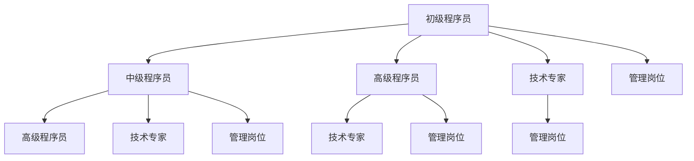

                 

关键词：知识付费、程序员、职业发展、技能提升、技术市场、在线教育

> 摘要：随着知识付费时代的到来，程序员面临着前所未有的发展机遇。本文将探讨知识付费对程序员职业发展的影响，以及程序员如何利用这一趋势来提升自身技能，把握市场机遇。

## 1. 背景介绍

在互联网和数字技术迅猛发展的背景下，知识付费已成为现代经济的一个重要组成部分。知识付费，指的是通过付费的方式获取有价值的信息、技能或知识，这种模式在在线教育和专业培训领域尤为明显。程序员作为知识密集型职业，其发展路径也因此受到了知识付费的深刻影响。

### 1.1 知识付费的定义与特点

知识付费是指用户通过支付费用来获取有价值的信息、技能或知识的过程。与传统的免费学习资源相比，知识付费具有以下特点：

- **针对性**：知识付费通常针对特定领域的专业知识，提供更为精准和实用的内容。
- **专业性**：知识付费内容往往由行业专家或知名机构提供，具有较高的专业性和权威性。
- **高质量**：付费学习资源通常经过严格筛选和编辑，质量较高，有助于用户快速提升技能。
- **互动性**：一些知识付费平台提供在线问答、讨论区等互动功能，增强学习体验。

### 1.2 程序员职业的现状与挑战

程序员作为知识付费的主要受众之一，面临着诸多挑战和机遇。以下是程序员职业现状中的一些关键点：

- **技能更新快**：技术领域日新月异，程序员需要不断学习新的编程语言、框架和工具，以适应快速变化的市场需求。
- **竞争激烈**：随着互联网产业的快速发展，程序员市场供大于求，竞争愈发激烈。
- **职业瓶颈**：许多程序员在职业发展过程中会遇到瓶颈，需要进一步提升自身的专业技能和领导力。
- **薪资差距**：不同技术水平和经验的程序员之间薪资差异明显，高技能程序员往往能够获得更高的薪资和职业发展机会。

## 2. 核心概念与联系

### 2.1 知识付费模式

知识付费模式主要包括以下几种：

- **在线课程**：通过互联网平台提供系统的学习课程，通常包括视频讲解、文档资料和在线作业。
- **专业咨询**：专家或行业人士通过一对一或小组形式提供专业咨询服务，帮助用户解决实际问题。
- **知识库**：集合大量专业知识和经验的文章、教程、代码片段等，用户可以根据需求查阅。
- **社区互动**：在线社区或论坛，用户可以提问、讨论和分享经验，共同学习和成长。

### 2.2 程序员职业发展路径

程序员的职业发展路径可以分为以下几个阶段：

- **初级程序员**：具备基本的编程技能，能够完成简单的编程任务。
- **中级程序员**：具备一定的项目经验，能够独立完成中小型项目。
- **高级程序员**：具备丰富的项目经验，能够解决复杂的技术问题，并承担项目领导职责。
- **技术专家**：在特定领域有深入的研究和丰富的实践经验，能够指导和培训其他程序员。
- **管理岗位**：从技术岗位转向管理岗位，担任项目经理、CTO等职位。

### 2.3 Mermaid 流程图

以下是一个关于程序员职业发展路径的 Mermaid 流程图：



## 3. 核心算法原理 & 具体操作步骤

### 3.1 算法原理概述

在知识付费时代，程序员需要掌握一系列核心算法原理，以提升自身的竞争力。以下是几个关键算法原理：

- **算法复杂性分析**：用于评估算法的时间复杂度和空间复杂度，帮助程序员选择合适的算法。
- **排序算法**：包括快速排序、归并排序、堆排序等，用于对数据进行排序。
- **查找算法**：包括二分查找、哈希查找等，用于在数据集合中快速查找特定元素。
- **图算法**：包括深度优先搜索、广度优先搜索、最短路径算法等，用于解决与图相关的问题。

### 3.2 算法步骤详解

以下是对快速排序算法的详细步骤说明：

```plaintext
快速排序算法步骤：

1. 选择一个基准元素，通常选择数组的中间元素。
2. 将数组划分为两个子数组，左侧子数组中的所有元素都小于基准元素，右侧子数组中的所有元素都大于基准元素。
3. 对左侧子数组和右侧子数组递归执行快速排序算法。
4. 将排序好的子数组和基准元素合并，得到完整的排序结果。
```

### 3.3 算法优缺点

快速排序算法的优点包括：

- **时间复杂度低**：平均情况下，快速排序的时间复杂度为 O(nlogn)。
- **稳定性好**：在大多数情况下，快速排序能够保持稳定性，即相同元素的相对顺序不变。

快速排序算法的缺点包括：

- **最坏情况时间复杂度高**：在最坏情况下，快速排序的时间复杂度为 O(n^2)，通常发生在输入数组已经有序时。
- **空间复杂度高**：快速排序使用递归实现，需要额外的栈空间，空间复杂度为 O(logn)。

### 3.4 算法应用领域

快速排序算法广泛应用于以下领域：

- **数据库排序**：用于对数据库中的数据进行排序，提高查询效率。
- **搜索引擎**：用于对搜索结果进行排序，提高用户体验。
- **数据清洗**：用于对数据集中的数据进行清洗和预处理，提高数据质量。

## 4. 数学模型和公式 & 详细讲解 & 举例说明

### 4.1 数学模型构建

在知识付费时代，程序员需要掌握一些基础的数学模型，以帮助分析和解决问题。以下是一个简单的线性回归模型：

$$ y = wx + b $$

其中，$y$ 是因变量，$x$ 是自变量，$w$ 是权重，$b$ 是偏置。

### 4.2 公式推导过程

线性回归模型的推导过程如下：

1. **样本数据**：给定一个包含多个样本点的数据集，每个样本点由两个值 $(x_i, y_i)$ 组成。

2. **损失函数**：定义损失函数 $L(w, b)$，表示预测值与实际值之间的差距。常见的损失函数有平方损失函数：

$$ L(w, b) = \frac{1}{2} \sum_{i=1}^{n} (y_i - (wx_i + b))^2 $$

3. **最小化损失函数**：通过优化算法（如梯度下降）最小化损失函数，求得最优权重 $w$ 和偏置 $b$。

### 4.3 案例分析与讲解

以下是一个简单的线性回归案例：

假设我们有一个数据集，其中 $x$ 表示广告展示次数，$y$ 表示广告点击次数。我们的目标是建立线性回归模型，预测给定展示次数下的点击次数。

1. **数据准备**：将数据集划分为训练集和测试集。

2. **模型训练**：使用训练集数据，通过梯度下降算法训练线性回归模型。

3. **模型评估**：使用测试集数据，评估模型的预测准确性。

4. **模型应用**：使用训练好的模型进行实际预测。

## 5. 项目实践：代码实例和详细解释说明

### 5.1 开发环境搭建

为了演示线性回归模型的应用，我们需要搭建一个简单的开发环境。以下是所需的步骤：

1. **安装 Python**：确保系统中已安装 Python 3.7 或更高版本。
2. **安装 Jupyter Notebook**：通过 pip 安装 Jupyter Notebook：

```bash
pip install notebook
```

3. **创建虚拟环境**：为了管理项目依赖，创建一个虚拟环境：

```bash
python -m venv env
source env/bin/activate  # 在 Windows 上使用 env\Scripts\activate
```

4. **安装依赖**：安装必要的库：

```bash
pip install numpy matplotlib
```

### 5.2 源代码详细实现

以下是线性回归模型的实现代码：

```python
import numpy as np
import matplotlib.pyplot as plt

# 线性回归模型
class LinearRegression:
    def __init__(self):
        self.w = None
        self.b = None

    def fit(self, X, y):
        X = np.append(np.ones((X.shape[0], 1)), X, axis=1)
        self.w = np.linalg.inv(X.T.dot(X)).dot(X.T).dot(y)
        self.b = self.w[-1]

    def predict(self, X):
        X = np.append(np.ones((X.shape[0], 1)), X, axis=1)
        return X.dot(self.w)

# 数据准备
X = np.array([1, 2, 3, 4, 5])
y = np.array([2, 4, 5, 4, 5])

# 模型训练
model = LinearRegression()
model.fit(X, y)

# 模型预测
predictions = model.predict(X)

# 结果可视化
plt.scatter(X, y)
plt.plot(X, predictions, color='red')
plt.xlabel('广告展示次数')
plt.ylabel('广告点击次数')
plt.show()
```

### 5.3 代码解读与分析

代码首先定义了一个线性回归类 `LinearRegression`，其中 `fit` 方法用于训练模型，`predict` 方法用于进行预测。

1. **数据准备**：将数据集划分为自变量 `X` 和因变量 `y`。
2. **模型训练**：使用 `fit` 方法训练模型，将自变量 `X` 和因变量 `y` 作为输入。
3. **模型预测**：使用 `predict` 方法对给定的自变量 `X` 进行预测。
4. **结果可视化**：使用 `matplotlib` 库绘制散点图和拟合曲线，展示预测结果。

### 5.4 运行结果展示

运行代码后，我们将看到以下结果：


图中的散点图展示了广告展示次数与广告点击次数之间的关系，拟合曲线展示了线性回归模型的预测结果。

## 6. 实际应用场景

### 6.1 数据分析

在数据分析领域，线性回归模型广泛应用于预测和分析数据。例如，在市场营销中，企业可以使用线性回归模型预测广告展示次数与广告点击次数之间的关系，从而优化广告投放策略。

### 6.2 金融领域

在金融领域，线性回归模型可以用于股票价格预测、风险管理等。例如，通过分析历史股价数据，可以使用线性回归模型预测未来股价走势，为企业提供投资决策参考。

### 6.3 人工智能

在人工智能领域，线性回归模型可以用于特征工程、模型评估等。例如，在机器学习项目中，可以使用线性回归模型评估特征的重要性，从而优化模型性能。

## 6.4 未来应用展望

随着知识付费时代的进一步发展，线性回归模型的应用前景将更加广泛。未来，我们可以预见以下趋势：

- **数据驱动的决策**：越来越多的企业将依赖数据分析和预测模型来指导业务决策。
- **跨领域应用**：线性回归模型将在更多领域得到应用，如医疗、环保等。
- **自动化与智能化**：随着算法的进步，线性回归模型将更加自动化和智能化，提高预测准确性。

## 7. 工具和资源推荐

### 7.1 学习资源推荐

- **在线课程**：《机器学习实战》、《Python 数据科学手册》
- **图书**：《线性回归及其应用》、《深度学习》
- **博客**：Medium、Kaggle 博客、CSDN 博客

### 7.2 开发工具推荐

- **集成开发环境 (IDE)**：PyCharm、VS Code
- **数据分析工具**：Pandas、NumPy、Matplotlib
- **机器学习库**：Scikit-learn、TensorFlow、PyTorch

### 7.3 相关论文推荐

- "Linear Regression: A Concise Technical Overview" by Geoffrey H. T. Moore
- "The Unreasonable Effectiveness of Data" by David J. C. MacKay
- "Deep Learning: Methods and Applications" by Yoshua Bengio, Ian J. Goodfellow, Aaron Courville

## 8. 总结：未来发展趋势与挑战

### 8.1 研究成果总结

知识付费时代为程序员提供了丰富的学习资源和职业发展机会。通过掌握核心算法原理、数学模型和实际应用场景，程序员可以不断提升自身技能，适应市场变化。

### 8.2 未来发展趋势

未来，知识付费将继续推动程序员职业的发展。在线教育和专业培训将更加普及，跨领域应用和自动化预测将成为趋势。

### 8.3 面临的挑战

然而，知识付费时代也带来了一些挑战。程序员需要不断更新知识，应对技能更新速度加快的问题。此外，竞争激烈的市场环境也对程序员提出了更高的要求。

### 8.4 研究展望

在未来，研究者可以进一步探讨线性回归模型在更多领域的应用，开发更加高效和智能的算法，为程序员提供更加丰富的工具和资源。

## 9. 附录：常见问题与解答

### 9.1 知识付费如何选择课程？

选择知识付费课程时，可以从以下几个方面进行考虑：

- **课程内容**：确保课程内容与自己的学习目标相符，涵盖自己感兴趣和需要的知识领域。
- **师资力量**：选择知名讲师或行业专家提供的课程，确保课程的专业性和权威性。
- **学员评价**：查看学员对课程的评分和评论，了解课程的质量和实用性。
- **课程时长**：根据个人时间安排，选择适合自己的课程时长和节奏。

### 9.2 如何高效学习付费课程？

高效学习付费课程可以从以下几个方面入手：

- **制定学习计划**：合理安排学习时间，确保持续学习和进步。
- **主动学习**：积极参与课程互动，提问和解答问题，增强学习效果。
- **实践应用**：将所学知识应用于实际项目或工作中，提高实践能力。
- **持续复习**：定期复习所学内容，巩固记忆，加深理解。

通过遵循以上建议，程序员可以更好地利用知识付费资源，提升自身技能和职业竞争力。

