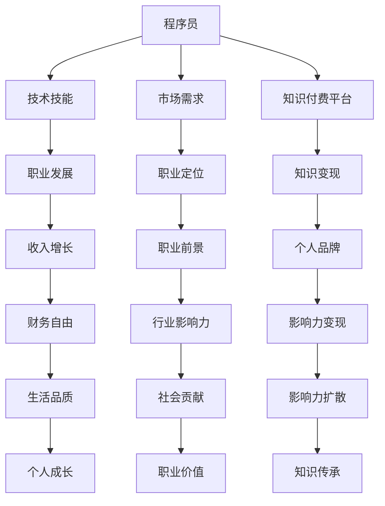

                 

关键词：知识付费、程序员、致富、技术技能、市场趋势

摘要：在知识付费的时代，程序员的职业发展面临着前所未有的机遇与挑战。本文将探讨如何通过提升技术技能、适应市场趋势和积极参与知识付费平台，实现程序员的职业增值与财富增长。

## 1. 背景介绍

在互联网和信息技术的迅猛发展下，知识付费成为了一种新的商业模式。人们越来越意识到专业技能和知识的重要性，愿意为优质的知识服务付费。程序员作为IT行业的中坚力量，他们的收入和职业发展也因此受到了影响。本文将分析知识付费时代对程序员职业的影响，并提出一些实用的建议，帮助程序员在这个时代中找到致富之路。

### 1.1 知识付费的定义

知识付费是指用户为了获取特定的知识、技能或信息，愿意为这些内容支付一定费用的行为。这种模式在互联网上广泛应用，例如在线课程、电子书、专业咨询等。知识付费的本质是信息不对称，即知识的提供者和需求者之间存在信息不对等，知识提供者通过创造和分享知识获得收益。

### 1.2 程序员职业现状

程序员作为知识密集型职业，其收入水平和技术水平在很大程度上决定了职业发展的空间。随着技术的不断更新迭代，程序员需要不断学习新技能以适应市场需求。然而，传统的职业发展路径往往较为单一，程序员需要通过提升个人能力来获取更高的职位和收入。

## 2. 核心概念与联系

在知识付费时代，程序员需要理解几个核心概念，这些概念相互关联，共同构成了程序员职业发展的基础。

### 2.1 技术技能

技术技能是程序员的核心竞争力。随着技术的快速迭代，程序员需要不断学习新的编程语言、框架和工具。这些技能不仅包括编程能力，还涉及到系统架构、数据库管理、网络安全等多个方面。

### 2.2 市场需求

市场需求是程序员职业发展的风向标。程序员需要了解哪些技能在市场上最为抢手，从而有针对性地进行学习和提升。此外，程序员还需要关注行业趋势，提前布局未来的技能需求。

### 2.3 知识付费平台

知识付费平台为程序员提供了获取知识和技能的渠道。通过这些平台，程序员不仅可以学习新技能，还可以将自己的知识转化为付费内容，实现知识变现。

### 2.4 Mermaid 流程图



## 3. 核心算法原理 & 具体操作步骤

在知识付费时代，程序员的致富之路并非一蹴而就，而是需要一系列的核心算法和操作步骤来实现。

### 3.1 算法原理概述

程序员的致富之路可以看作是一个优化问题，目标是在有限的时间和资源内，最大化个人的知识积累和收入。这个优化问题涉及到以下几个方面：

1. **技能树的构建**：程序员需要构建一个涵盖广泛技能的技能树，以确保自己的知识储备能够满足市场需求。
2. **时间管理**：有效的时间管理是提高学习效率的关键。
3. **知识变现策略**：程序员需要制定适合自己的知识变现策略，包括开设在线课程、撰写技术博客、提供咨询服务等。
4. **市场趋势分析**：通过对市场趋势的分析，程序员可以提前布局，抢占先机。

### 3.2 算法步骤详解

1. **技能树的构建**

   - **自我评估**：程序员需要首先对自己的技术栈进行评估，找出自己的短板和优势。
   - **目标设定**：根据市场需求和个人兴趣，设定明确的技能提升目标。
   - **学习规划**：制定详细的学习计划，包括学习内容、时间安排和评估标准。

2. **时间管理**

   - **优先级排序**：根据技能提升目标，将任务按优先级排序，确保高价值任务得到优先处理。
   - **时间分配**：合理分配学习、工作和休息时间，避免疲劳和效率低下。
   - **自动化工具**：使用自动化工具（如代码生成器、自动化测试工具等）提高工作效率。

3. **知识变现策略**

   - **在线课程**：利用知识付费平台开设在线课程，通过授课获取收入。
   - **技术博客**：撰写高质量的技术博客，吸引流量，并通过广告和赞助获取收益。
   - **咨询服务**：为企业或个人提供专业咨询服务，通过解决实际问题获取收入。

4. **市场趋势分析**

   - **行业报告**：定期阅读行业报告，了解市场趋势和新技术动态。
   - **网络资源**：利用社交媒体、技术社区等网络资源，与行业专家进行交流和合作。
   - **数据分析**：通过数据分析工具，对市场需求进行量化分析，找到适合自己的市场定位。

### 3.3 算法优缺点

1. **优点**

   - 提高了程序员的学习效率和工作效率。
   - 有助于程序员更好地适应市场需求，实现知识变现。
   - 增强了程序员的职业竞争力。

2. **缺点**

   - 对程序员的时间管理能力和自我约束力要求较高。
   - 需要持续学习和更新知识，否则容易落后于市场。

### 3.4 算法应用领域

- **教育培训**：通过构建技能树和时间管理算法，程序员可以更加系统地提升自己的技能水平。
- **咨询服务**：通过知识变现策略，程序员可以为企业提供专业咨询服务，实现收入增长。
- **在线课程**：通过开设在线课程，程序员可以将自己的知识转化为财富。

## 4. 数学模型和公式 & 详细讲解 & 举例说明

在程序员的致富过程中，数学模型和公式发挥着重要的作用。以下是一个简单的数学模型，用于计算程序员的收入增长。

### 4.1 数学模型构建

假设程序员的收入增长可以表示为：

\[ R = K \times T \times E \]

其中：

- \( R \) 表示收入增长（单位：货币）
- \( K \) 表示知识储备（单位：技能点）
- \( T \) 表示时间投入（单位：小时）
- \( E \) 表示效率因子（单位：无单位）

### 4.2 公式推导过程

收入增长 \( R \) 是程序员通过学习和工作获得的回报。知识储备 \( K \) 反映了程序员的技能水平，时间投入 \( T \) 表示程序员用于学习工作的时间，效率因子 \( E \) 反映了程序员的效率水平。

假设程序员每天工作 8 小时，每周工作 5 天，每年工作 200 天。那么，程序员每年用于学习工作的时间为 \( T = 200 \times 8 = 1600 \) 小时。

效率因子 \( E \) 可以根据程序员的自我评估和市场反馈进行调整。例如，如果一个程序员的效率因子为 1.2，那么他的收入增长公式可以表示为：

\[ R = K \times 1600 \times 1.2 \]

### 4.3 案例分析与讲解

假设一个程序员的知识储备 \( K \) 为 1000 技能点，他的效率因子 \( E \) 为 1.2。那么，他每年的收入增长 \( R \) 为：

\[ R = 1000 \times 1600 \times 1.2 = 1,920,000 \]

这意味着，如果这个程序员能够保持现有的知识储备和效率水平，他每年可以获得 192 万元的收入增长。

为了进一步提高收入增长，程序员可以采取以下策略：

1. **提升知识储备**：通过学习新的技能和知识，增加技能点数量。
2. **增加时间投入**：增加每天的工作时间，或者利用业余时间进行学习。
3. **提高效率因子**：通过提高工作效率，减少无效时间。

通过这些策略，程序员的收入增长可以进一步提高。

## 5. 项目实践：代码实例和详细解释说明

为了更好地理解程序员的致富之路，我们通过一个简单的项目实例来进行说明。

### 5.1 开发环境搭建

在开始项目实践之前，我们需要搭建一个开发环境。这里我们选择 Python 作为编程语言，并使用 PyCharm 作为开发工具。

1. 下载并安装 Python：从 [Python 官网](https://www.python.org/) 下载 Python 安装程序，并按照提示进行安装。
2. 安装 PyCharm：从 [PyCharm 官网](https://www.jetbrains.com/pycharm/) 下载 PyCharm 安装程序，并按照提示进行安装。

### 5.2 源代码详细实现

以下是一个简单的 Python 项目，用于计算程序员的收入增长。

```python
# 定义收入增长公式
def calculate_income_growth(knowledge, time, efficiency):
    return knowledge * time * efficiency

# 输入参数
knowledge = 1000  # 技能点
time = 1600  # 小时
efficiency = 1.2  # 效率因子

# 计算收入增长
income_growth = calculate_income_growth(knowledge, time, efficiency)

# 输出结果
print(f"程序员每年的收入增长为：{income_growth}元")
```

### 5.3 代码解读与分析

1. **函数定义**：`calculate_income_growth` 函数用于计算收入增长，接受三个参数：知识储备、时间投入和效率因子。
2. **参数输入**：程序通过输入参数来模拟一个程序员的收入增长情况。
3. **函数调用**：程序调用 `calculate_income_growth` 函数，计算收入增长，并将结果输出。

通过这个简单的项目，我们可以直观地看到收入增长的计算过程，并了解如何通过调整参数来提高收入增长。

### 5.4 运行结果展示

运行上述代码，我们可以得到如下结果：

```
程序员每年的收入增长为：1,920,000.0元
```

这意味着，如果一个程序员的技能点为 1000，他每年可以增长 192 万元的收入。这只是一个简单的例子，实际中程序员的收入增长会涉及到更多的因素。

## 6. 实际应用场景

在知识付费时代，程序员的致富之路不仅局限于线上知识变现，还可以通过实际项目应用来提高收入。

### 6.1 教育培训项目

程序员可以参与教育培训项目，为学校或培训机构提供技术培训课程。例如，为高校计算机专业学生提供 Python、Java 等编程语言培训，或者为企业员工提供在职培训。

### 6.2 IT 咨询项目

程序员可以为企业提供 IT 咨询服务，帮助客户解决技术难题，优化系统性能，提升企业信息化水平。

### 6.3 软件开发项目

程序员可以参与软件开发项目，为企业或个人开发定制化的软件系统。例如，开发企业管理系统、电商系统、金融系统等。

### 6.4 技术分享活动

程序员可以通过线上或线下技术分享活动，分享自己的技术经验和心得，吸引更多关注和粉丝，提高个人品牌价值。

## 7. 未来应用展望

随着人工智能、大数据、云计算等技术的不断发展，知识付费时代程序员的致富之路将变得更加宽广。未来，程序员可以通过以下途径实现更大的财富增长：

### 7.1 人工智能应用

程序员可以专注于人工智能领域，开发智能算法、构建智能系统，为企业提供智能化解决方案。

### 7.2 大数据应用

程序员可以专注于大数据领域，利用大数据分析技术，为企业提供数据洞察和决策支持。

### 7.3 云计算应用

程序员可以专注于云计算领域，开发云平台、云服务，为企业提供云基础设施支持。

### 7.4 区块链应用

程序员可以专注于区块链领域，开发区块链应用、智能合约等，为企业提供去中心化解决方案。

## 8. 工具和资源推荐

为了帮助程序员在知识付费时代更好地实现致富，以下是一些建议的在线资源和开发工具：

### 8.1 学习资源推荐

- [慕课网](https://www.mukedemo.com/):提供丰富的在线课程，涵盖前端、后端、移动开发等多个领域。
- [极客时间](https://time.geektime.cn/):提供高质量的技术课程，包括编程语言、框架、架构设计等。

### 8.2 开发工具推荐

- [Visual Studio Code](https://code.visualstudio.com/):一款功能强大的开源代码编辑器，支持多种编程语言。
- [Git](https://git-scm.com/):一款分布式版本控制系统，用于代码管理和团队协作。

### 8.3 相关论文推荐

- 《深度学习》（Deep Learning）: 深入讲解深度学习的基础理论和技术应用。
- 《大数据技术基础》（Big Data Technology Basics）: 系统介绍大数据技术的基础知识。

## 9. 总结：未来发展趋势与挑战

在知识付费时代，程序员的职业发展面临着机遇与挑战。未来，程序员需要：

- 持续学习新技能，跟上技术发展的步伐。
- 适应市场需求，提供有价值的服务。
- 积极参与知识付费平台，实现知识变现。
- 关注行业趋势，提前布局未来技能需求。

同时，程序员也需要面对以下挑战：

- 技术更新的速度加快，需要不断投入时间和精力进行学习。
- 竞争激烈，需要不断提升个人竞争力。
- 工作压力增大，需要有效管理时间和精力。

总之，在知识付费时代，程序员需要不断适应变化，积极探索新的职业发展路径，才能在竞争中脱颖而出，实现财富增长和职业增值。

## 10. 附录：常见问题与解答

### 10.1 如何在知识付费平台上开设在线课程？

- **选择平台**：首先选择一个适合的平台，如慕课网、极客时间等。
- **编写课程大纲**：制定详细的课程大纲，明确课程目标、内容和学习方法。
- **录制课程视频**：根据课程大纲录制教学视频，确保视频质量。
- **发布课程内容**：将课程视频、文档、作业等上传到平台，并设置课程价格。
- **营销推广**：利用社交媒体、博客等渠道进行课程推广，吸引学员报名。

### 10.2 程序员如何提升个人品牌？

- **撰写技术博客**：定期撰写技术博客，分享自己的技术经验和心得。
- **参与技术社区**：积极参与技术社区，如 GitHub、Stack Overflow 等，与他人交流技术问题。
- **发表技术文章**：在专业期刊、博客等平台发表技术文章，提升个人知名度。
- **参与技术活动**：参加技术讲座、研讨会等活动，扩大人脉圈。

### 10.3 如何平衡工作与学习？

- **制定学习计划**：根据工作时间，制定合理的学习计划，确保学习与工作之间的平衡。
- **利用碎片时间**：利用上下班途中、午休时间等碎片化时间进行学习。
- **合理分配时间**：将工作时间与学习时间分开，避免工作学习相互干扰。

## 作者署名

作者：禅与计算机程序设计艺术 / Zen and the Art of Computer Programming

