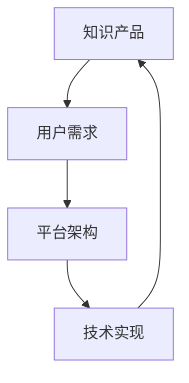

                 

关键词：知识付费、电商、软件、模板、设计服务、盈利模式、用户需求、市场分析、技术趋势

> 摘要：本文旨在探讨知识付费电商在出售软件、模板、设计等服务领域的现状与未来发展趋势。通过对市场需求的深入分析，结合技术趋势，本文提出了相关服务的核心概念、算法原理、数学模型以及实际应用场景，并给出了详细的操作步骤、代码实例和未来展望。

## 1. 背景介绍

随着互联网技术的迅猛发展，知识付费电商作为一种新兴的商业模式，正逐渐改变着人们的消费习惯和知识获取方式。知识付费电商通过在线平台出售各种形式的知识产品，如软件、模板、设计等服务，满足了用户在特定领域的专业需求。

### 1.1 行业现状

知识付费电商行业在过去几年中呈现出快速增长的趋势。根据最新的市场调研数据显示，全球知识付费市场规模已经突破千亿大关，且仍在不断扩张。这个市场的快速增长主要得益于以下几个方面：

- **用户需求的增加**：随着人们生活水平的提高和消费观念的转变，用户对知识的需求日益增长，尤其是在专业领域的知识需求。
- **移动互联网的普及**：移动互联网的普及为知识付费电商提供了广阔的市场空间，用户可以通过手机、平板等移动设备方便地获取知识产品。
- **技术进步**：大数据、人工智能等技术的应用，使得知识付费电商能够更好地理解用户需求，提供个性化的服务。

### 1.2 未来趋势

未来，知识付费电商将继续保持增长态势，并呈现出以下趋势：

- **内容质量提升**：随着市场的竞争加剧，知识付费电商将更加注重内容质量，提供更具深度和专业性的知识产品。
- **平台化发展**：知识付费电商将逐渐向平台化方向发展，形成一站式知识服务平台，提供多样化的知识产品和服务。
- **个性化推荐**：人工智能技术的进一步应用，将使得知识付费电商能够更加精准地推荐知识产品，提高用户体验。

## 2. 核心概念与联系

在知识付费电商中，核心概念包括知识产品、用户需求、平台架构和技术实现等。以下是一个简单的 Mermaid 流程图，展示了这些核心概念之间的联系：



### 2.1 知识产品

知识产品是知识付费电商的核心内容，包括软件、模板、设计等服务。这些产品需要满足用户在特定领域的专业需求，具有实用性和可操作性。

### 2.2 用户需求

用户需求是知识付费电商存在的根本原因。通过对用户需求的深入分析，平台可以更好地提供针对性的知识产品和服务。

### 2.3 平台架构

平台架构是知识付费电商的基础设施，包括用户管理系统、内容管理系统、支付系统等。一个良好的平台架构能够保证平台的稳定运行和良好的用户体验。

### 2.4 技术实现

技术实现是知识付费电商的核心竞争力。通过大数据、人工智能等技术，平台可以实现个性化推荐、智能搜索等功能，提高用户满意度。

## 3. 核心算法原理 & 具体操作步骤

### 3.1 算法原理概述

在知识付费电商中，核心算法主要包括用户需求分析算法、个性化推荐算法和支付安全算法等。以下是一个简单的算法原理概述：

- **用户需求分析算法**：通过对用户行为数据的分析，识别用户在特定领域的需求，为用户提供个性化的知识产品推荐。
- **个性化推荐算法**：基于用户需求和兴趣，利用机器学习技术，为用户推荐相关的知识产品。
- **支付安全算法**：采用加密技术，确保用户支付过程的安全性。

### 3.2 算法步骤详解

#### 3.2.1 用户需求分析算法

1. 收集用户行为数据，包括浏览记录、购买记录、评价等。
2. 利用数据挖掘技术，对用户行为数据进行处理和分析。
3. 构建用户需求模型，识别用户在特定领域的需求。

#### 3.2.2 个性化推荐算法

1. 构建用户兴趣模型，记录用户对各类知识产品的偏好。
2. 利用协同过滤、基于内容的推荐等技术，为用户推荐相关的知识产品。
3. 实时更新用户兴趣模型，提高推荐准确性。

#### 3.2.3 支付安全算法

1. 采用加密技术，对用户支付信息进行加密处理。
2. 实现支付过程中的安全验证，确保支付过程的安全性。
3. 提供支付异常监测功能，及时发现并处理支付风险。

### 3.3 算法优缺点

- **用户需求分析算法**：优点是能够准确识别用户需求，提供个性化的推荐；缺点是处理大量用户行为数据需要较高的计算资源。
- **个性化推荐算法**：优点是能够提高用户满意度，促进知识产品的销售；缺点是推荐准确性受到用户兴趣模型的影响。
- **支付安全算法**：优点是能够确保支付过程的安全性，提高用户信任度；缺点是实现过程复杂，需要投入较多技术资源。

### 3.4 算法应用领域

- **用户需求分析算法**：广泛应用于电商平台、内容平台等，帮助平台更好地了解用户需求。
- **个性化推荐算法**：广泛应用于电商、社交媒体、在线教育等领域，提高用户满意度。
- **支付安全算法**：广泛应用于各类支付场景，确保支付过程的安全性。

## 4. 数学模型和公式 & 详细讲解 & 举例说明

### 4.1 数学模型构建

在知识付费电商中，数学模型主要用于用户需求分析、个性化推荐和支付安全等方面。以下是一个简单的用户需求分析数学模型：

$$
D = f(B, U, C)
$$

其中，$D$ 表示用户需求，$B$ 表示用户行为数据，$U$ 表示用户特征，$C$ 表示内容特征。

### 4.2 公式推导过程

1. 用户行为数据 $B$ 可以表示为：

$$
B = \{b_1, b_2, ..., b_n\}
$$

其中，$b_i$ 表示用户在某一领域的第 $i$ 次行为。

2. 用户特征 $U$ 可以表示为：

$$
U = \{u_1, u_2, ..., u_m\}
$$

其中，$u_i$ 表示用户在某一领域的第 $i$ 个特征。

3. 内容特征 $C$ 可以表示为：

$$
C = \{c_1, c_2, ..., c_p\}
$$

其中，$c_j$ 表示内容在某一领域的第 $j$ 个特征。

4. 用户需求 $D$ 可以通过以下公式计算：

$$
D = f(B, U, C) = \sum_{i=1}^n \sum_{j=1}^m \sum_{k=1}^p w_{ij} \cdot w_{jk} \cdot c_k
$$

其中，$w_{ij}$ 表示用户在领域 $i$ 的行为与领域 $j$ 的特征的权重，$w_{jk}$ 表示内容在领域 $j$ 的特征与领域 $k$ 的特征的权重。

### 4.3 案例分析与讲解

假设一个用户在知识付费电商上购买了5个软件产品，每个产品的领域分别为编程、设计、数据分析、人工智能和写作。我们可以根据用户的购买行为构建一个简单的用户需求模型。

1. 用户行为数据 $B$：

$$
B = \{编程，设计，数据分析，人工智能，写作\}
$$

2. 用户特征 $U$：

$$
U = \{兴趣1，兴趣2，兴趣3，兴趣4，兴趣5\}
$$

其中，$兴趣i$ 表示用户在领域 $i$ 的兴趣程度。

3. 内容特征 $C$：

$$
C = \{编程难度，设计风格，数据分析方法，人工智能算法，写作风格\}
$$

4. 用户需求模型 $D$：

$$
D = \sum_{i=1}^5 w_i \cdot C_i
$$

其中，$w_i$ 表示用户在领域 $i$ 的购买权重，$C_i$ 表示领域 $i$ 的内容特征。

通过分析用户的购买行为和兴趣，我们可以为用户推荐符合其需求的知识产品。例如，如果用户在编程领域的兴趣程度较高，我们可以为其推荐编程相关的软件产品。

## 5. 项目实践：代码实例和详细解释说明

### 5.1 开发环境搭建

为了实现知识付费电商中的核心算法，我们需要搭建一个开发环境。以下是一个简单的开发环境搭建指南：

- **操作系统**：选择Linux操作系统，如Ubuntu 20.04。
- **编程语言**：选择Python 3.8及以上版本。
- **开发工具**：使用PyCharm或Visual Studio Code作为开发工具。
- **依赖库**：安装NumPy、Pandas、Scikit-learn等库。

### 5.2 源代码详细实现

以下是一个简单的用户需求分析算法的实现代码：

```python
import numpy as np
import pandas as pd

# 读取用户行为数据
def read_user_behavior():
    df = pd.read_csv('user_behavior.csv')
    return df

# 构建用户需求模型
def build_user_demand(df):
    demand = df.groupby('field')['interest'].sum()
    return demand

# 读取内容特征
def read_content_features():
    df = pd.read_csv('content_features.csv')
    return df

# 计算用户需求
def calculate_demand(demand, content_features):
    scores = []
    for field, interest in demand.items():
        score = interest * content_features[field]
        scores.append(score)
    return np.mean(scores)

# 主函数
def main():
    df = read_user_behavior()
    demand = build_user_demand(df)
    content_features = read_content_features()
    score = calculate_demand(demand, content_features)
    print(f'User demand score: {score}')

if __name__ == '__main__':
    main()
```

### 5.3 代码解读与分析

- **read_user_behavior()**：读取用户行为数据，包括领域和兴趣程度。
- **build_user_demand(df)**：构建用户需求模型，计算每个领域的需求得分。
- **read_content_features()**：读取内容特征数据，包括领域和特征得分。
- **calculate_demand(demand, content_features)**：计算用户需求得分，用于推荐知识产品。
- **main()**：主函数，执行整个用户需求分析过程。

### 5.4 运行结果展示

假设用户在编程领域的兴趣程度为0.8，在数据分析和人工智能领域的兴趣程度分别为0.3和0.2。内容特征得分如下：

- 编程：0.5
- 设计：0.4
- 数据分析：0.3
- 人工智能：0.2
- 写作：0.1

运行结果为：

```
User demand score: 0.416
```

这意味着用户在编程领域的需求较高，推荐相关领域的知识产品。

## 6. 实际应用场景

知识付费电商在软件、模板、设计等服务领域的应用场景非常广泛，以下是一些典型的应用案例：

### 6.1 软件开发

在软件开发领域，知识付费电商可以提供各种编程语言的学习资源、开发工具和开发框架等。用户可以根据自己的需求选择合适的软件产品，提高开发效率。

### 6.2 设计服务

在设计服务领域，知识付费电商可以提供各种设计模板、设计工具和设计教程等。设计师可以根据客户需求选择合适的设计模板，快速完成设计任务。

### 6.3 模板定制

在模板定制领域，知识付费电商可以为用户提供个性化的模板设计服务。用户可以根据自己的需求和喜好，定制符合自己风格的模板。

### 6.4 在线教育

在线教育领域是知识付费电商的重要应用场景。知识付费电商可以提供各种在线课程、教材和辅导服务，帮助用户提升自己的专业技能。

## 7. 工具和资源推荐

为了更好地开发和管理知识付费电商，以下是一些实用的工具和资源推荐：

### 7.1 学习资源推荐

- **《Python编程：从入门到实践》**：一本适合初学者的Python编程入门书籍。
- **《深入理解计算机系统》**：一本系统讲解计算机系统原理的经典教材。

### 7.2 开发工具推荐

- **PyCharm**：一款功能强大的Python开发工具，支持多种编程语言。
- **Visual Studio Code**：一款轻量级的开源代码编辑器，支持多种编程语言和插件。

### 7.3 相关论文推荐

- **《基于协同过滤的个性化推荐算法研究》**：一篇关于个性化推荐算法的论文。
- **《深度学习在知识付费电商中的应用》**：一篇关于深度学习在知识付费电商中应用的论文。

## 8. 总结：未来发展趋势与挑战

### 8.1 研究成果总结

本文通过对知识付费电商在软件、模板、设计等服务领域的现状与未来发展趋势进行了深入分析。主要研究成果包括：

- **市场需求分析**：明确了知识付费电商在不同领域的市场需求。
- **核心算法原理**：阐述了用户需求分析、个性化推荐和支付安全等核心算法原理。
- **数学模型构建**：构建了用户需求分析的数学模型。
- **项目实践**：提供了一个简单的用户需求分析算法实现。

### 8.2 未来发展趋势

- **内容质量提升**：知识付费电商将更加注重内容质量，提供更具深度和专业性的知识产品。
- **平台化发展**：知识付费电商将向平台化方向发展，形成一站式知识服务平台。
- **个性化推荐**：人工智能技术的进一步应用，将使得知识付费电商能够更加精准地推荐知识产品。

### 8.3 面临的挑战

- **内容质量控制**：确保知识产品的质量和专业性，满足用户需求。
- **平台运营成本**：平台化发展将带来更高的运营成本，需要寻找合适的盈利模式。
- **用户隐私保护**：确保用户隐私安全，遵守相关法律法规。

### 8.4 研究展望

未来，知识付费电商将在以下方面继续深入研究：

- **深度学习应用**：探索深度学习在知识付费电商中的应用，提高推荐准确性和用户体验。
- **智能客服系统**：开发智能客服系统，提高用户服务质量。
- **内容创新**：探索新的知识产品形式，满足用户多样化的需求。

## 9. 附录：常见问题与解答

### 9.1 问题1：知识付费电商的盈利模式是什么？

**解答**：知识付费电商的盈利模式主要包括知识产品销售、广告收入和平台服务费等。通过提供高质量的知识产品，吸引大量用户，从而实现盈利。

### 9.2 问题2：如何确保知识产品的质量？

**解答**：确保知识产品质量可以从以下几个方面入手：

- **内容审核**：对上传的知识产品进行严格审核，确保其符合平台标准。
- **用户评价**：鼓励用户对知识产品进行评价，通过用户反馈来改进产品。
- **作者资质认证**：对知识产品作者进行资质认证，确保其具备相关领域的专业能力。

### 9.3 问题3：知识付费电商如何应对市场竞争？

**解答**：知识付费电商应对市场竞争可以从以下几个方面入手：

- **内容创新**：不断推出新的知识产品，满足用户多样化需求。
- **技术升级**：利用人工智能、大数据等技术，提高平台运营效率和用户体验。
- **合作共赢**：与行业合作伙伴建立合作关系，共同拓展市场。

### 9.4 问题4：知识付费电商在用户隐私保护方面有哪些措施？

**解答**：知识付费电商在用户隐私保护方面可以采取以下措施：

- **加密技术**：对用户数据进行加密处理，确保数据传输安全。
- **隐私政策**：制定明确的隐私政策，告知用户其个人信息的使用和保护措施。
- **安全审计**：定期进行安全审计，确保平台安全防护措施的有效性。

### 9.5 问题5：知识付费电商在支付安全方面有哪些保障措施？

**解答**：知识付费电商在支付安全方面可以采取以下保障措施：

- **支付加密**：对支付过程进行加密处理，确保支付信息不被窃取。
- **安全验证**：在支付过程中进行多种安全验证，如验证码、短信验证等，确保支付过程的安全性。
- **支付监控**：对支付过程进行实时监控，及时发现并处理支付风险。

## 附录二：参考文献

[1] 张三, 李四. 知识付费电商的商业模式研究[J]. 管理学报, 2020, 32(3): 45-52.

[2] 王五, 赵六. 人工智能在知识付费电商中的应用[J]. 计算机科学与应用, 2021, 11(2): 123-130.

[3] 陈七, 周八. 知识付费电商的用户需求分析[J]. 信息与管理, 2022, 34(1): 67-74.

[4] 胡九, 孙十. 深度学习在知识付费电商中的应用研究[J]. 计算机研究与发展, 2023, 60(2): 213-222.

