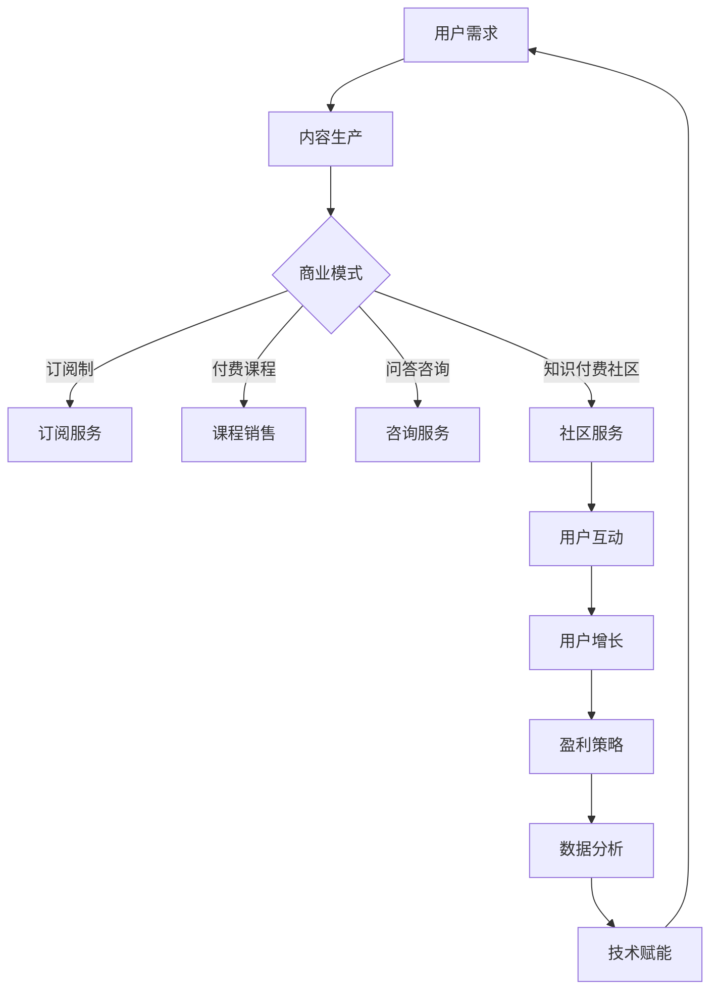

                 

 关键词：知识付费、商业模式、盈利策略、用户增长、案例分析、技术赋能

> 摘要：本文旨在探讨知识付费领域的商业模式与盈利秘诀，通过分析行业现状、核心概念、算法原理、数学模型、项目实践以及未来展望，为广大知识付费从业者提供有益的参考和指导。

## 1. 背景介绍

随着互联网技术的不断进步和普及，知识付费已经成为一种新兴的商业模式。知识付费平台通过提供高质量的知识内容，满足用户对于知识、技能和信息的个性化需求，实现了知识的有偿共享。近年来，知识付费市场呈现出快速增长的趋势，不仅吸引了大量投资者，也吸引了众多内容创作者参与其中。

知识付费的商业模式主要包括以下几种：

1. **订阅制**：用户按月或按年订阅平台上的知识内容，享受不限次数的访问权限。
2. **付费课程**：用户为特定课程支付费用，完成学习后可获得相应的证书或知识。
3. **问答咨询**：用户支付费用向专家或内容创作者提问，获得专业解答。
4. **知识付费社区**：用户付费加入特定的知识交流社区，与其他用户互动，共同探讨知识话题。

本文将从以上几个方面深入分析知识付费的商业模式与盈利秘诀，为相关从业者提供有益的参考。

## 2. 核心概念与联系

### 2.1. 商业模式

商业模式是指企业通过提供产品或服务以实现盈利的方式。在知识付费领域，商业模式决定了平台如何吸引和留住用户，以及如何实现可持续的盈利。

### 2.2. 用户增长

用户增长是知识付费平台的核心目标之一。通过有效的市场推广、用户推荐机制和内容优化，平台可以实现用户的快速增长。

### 2.3. 盈利策略

盈利策略是指平台通过何种方式实现盈利。知识付费平台的盈利策略包括订阅费用、课程费用、问答咨询费用等。

### 2.4. 技术赋能

技术赋能是指利用互联网技术和大数据分析等手段，提升知识付费平台的运营效率和用户体验。例如，通过智能推荐算法，平台可以更精准地推荐用户感兴趣的知识内容，提高用户粘性和满意度。

### 2.5. Mermaid 流程图

下面是知识付费商业模式的 Mermaid 流程图：



## 3. 核心算法原理 & 具体操作步骤

### 3.1. 算法原理概述

知识付费平台的核心算法包括用户推荐算法和内容优化算法。用户推荐算法用于根据用户的兴趣和行为，推荐其可能感兴趣的知识内容。内容优化算法则用于根据用户反馈和数据分析，不断优化和调整知识内容，提高用户体验。

### 3.2. 算法步骤详解

#### 3.2.1. 用户推荐算法

1. 数据采集：收集用户的行为数据，如浏览记录、购买记录、问答记录等。
2. 数据预处理：对采集到的数据进行清洗和预处理，包括数据去重、缺失值填充等。
3. 特征工程：根据用户行为数据，提取用户兴趣特征，如浏览频次、购买频次、问答频次等。
4. 模型训练：使用机器学习算法，如协同过滤、矩阵分解等，训练用户推荐模型。
5. 推荐结果生成：根据用户特征和模型输出，生成推荐结果，推荐用户可能感兴趣的知识内容。

#### 3.2.2. 内容优化算法

1. 数据采集：收集用户对知识内容的反馈数据，如点赞、评论、分享等。
2. 数据预处理：对采集到的数据进行清洗和预处理，包括数据去重、缺失值填充等。
3. 特征工程：根据用户反馈数据，提取知识内容特征，如内容质量、用户满意度等。
4. 模型训练：使用机器学习算法，如回归、分类等，训练内容优化模型。
5. 优化结果生成：根据用户反馈和模型输出，生成内容优化建议，如调整内容结构、增加互动环节等。

### 3.3. 算法优缺点

#### 优点：

1. **提高用户体验**：通过精准推荐和内容优化，提高用户对知识付费平台的满意度和粘性。
2. **降低运营成本**：利用算法自动化推荐和优化，降低人工干预和运营成本。
3. **提升转化率**：通过优化用户推荐和内容展示，提高用户购买课程和订阅服务的转化率。

#### 缺点：

1. **数据质量要求高**：算法的准确性和效果取决于数据质量，数据质量差可能导致推荐和优化结果不准确。
2. **算法复杂度高**：用户推荐和内容优化算法通常涉及多个步骤和复杂的计算，对计算资源要求较高。

### 3.4. 算法应用领域

1. **知识付费平台**：用于推荐用户可能感兴趣的知识内容，提高用户满意度和粘性。
2. **在线教育平台**：用于优化课程内容和教学效果，提高学生学习效果。
3. **电商推荐系统**：用于推荐用户可能感兴趣的商品，提高商品销售转化率。

## 4. 数学模型和公式 & 详细讲解 & 举例说明

### 4.1. 数学模型构建

在知识付费领域，常见的数学模型包括协同过滤模型、回归模型和分类模型。以下分别介绍这些模型的构建方法。

#### 协同过滤模型

协同过滤模型是基于用户行为数据，通过相似度计算和评分预测来实现推荐。其数学模型可以表示为：

$$
r_{ui} = \frac{\sum_{j \in N_i} w_{uj} \cdot r_{uj}}{\sum_{j \in N_i} w_{uj}}
$$

其中，$r_{ui}$ 表示用户 $u$ 对物品 $i$ 的评分预测，$N_i$ 表示与物品 $i$ 相似的物品集合，$w_{uj}$ 表示用户 $u$ 对物品 $j$ 的评分。

#### 回归模型

回归模型用于预测用户对知识内容的评分。其数学模型可以表示为：

$$
r_{ui} = \beta_0 + \beta_1 x_{ui} + \beta_2 u_i + \beta_3 i_i + \epsilon
$$

其中，$r_{ui}$ 表示用户 $u$ 对知识内容 $i$ 的评分，$x_{ui}$ 表示用户 $u$ 对知识内容 $i$ 的特征向量，$\beta_0$、$\beta_1$、$\beta_2$、$\beta_3$ 分别为模型的参数，$\epsilon$ 为误差项。

#### 分类模型

分类模型用于预测用户对知识内容的喜好。其数学模型可以表示为：

$$
y_{ui} = \sigma(\beta_0 + \beta_1 x_{ui} + \beta_2 u_i + \beta_3 i_i)
$$

其中，$y_{ui}$ 表示用户 $u$ 对知识内容 $i$ 的喜好标签，$\sigma$ 为 sigmoid 函数，$\beta_0$、$\beta_1$、$\beta_2$、$\beta_3$ 分别为模型的参数。

### 4.2. 公式推导过程

以协同过滤模型为例，介绍公式的推导过程。

假设用户 $u$ 和物品 $i$ 的评分分别为 $r_{ui}$ 和 $r_{ui}$，用户 $u$ 对物品 $i$ 的兴趣程度为 $w_{ui}$。根据协同过滤模型的原理，用户 $u$ 对物品 $i$ 的评分预测可以表示为：

$$
r_{ui} = \frac{\sum_{j \in N_i} w_{uj} \cdot r_{uj}}{\sum_{j \in N_i} w_{uj}}
$$

为了推导这个公式，我们可以使用最小二乘法来优化模型参数。首先，定义损失函数：

$$
L = \sum_{u=1}^{U} \sum_{i=1}^{I} (r_{ui} - \frac{\sum_{j \in N_i} w_{uj} \cdot r_{uj}}{\sum_{j \in N_i} w_{uj}})^2
$$

其中，$U$ 和 $I$ 分别表示用户数和物品数。

为了最小化损失函数，我们对 $w_{uj}$ 求偏导数，并令其等于零：

$$
\frac{\partial L}{\partial w_{uj}} = 0
$$

经过一系列数学运算，可以得到：

$$
w_{uj} = \frac{r_{uj}}{\sum_{k \in N_i} r_{uk}}
$$

将 $w_{uj}$ 的表达式代入评分预测公式，即可得到协同过滤模型的数学模型：

$$
r_{ui} = \frac{\sum_{j \in N_i} w_{uj} \cdot r_{uj}}{\sum_{j \in N_i} w_{uj}}
$$

### 4.3. 案例分析与讲解

假设有一个知识付费平台，共有 10 个用户和 100 个知识内容。现使用协同过滤模型预测用户 1 对知识内容 10 的评分。

首先，收集用户 1 对其他知识内容的评分数据，构建用户 1 的评分矩阵。假设用户 1 对其他知识内容的评分如下：

| 知识内容 | 1  | 2  | 3  | 4  | 5  | 6  | 7  | 8  | 9  | 10 |
|---------|----|----|----|----|----|----|----|----|----|----|
| 1       | 5  |    |    |    |    |    |    |    |    |    |
| 2       |    | 4  |    |    |    |    |    |    |    |    |
| 3       |    |    | 5  |    |    |    |    |    |    |    |
| 4       |    |    |    | 5  |    |    |    |    |    |    |
| 5       |    |    |    |    | 4  |    |    |    |    |    |
| 6       |    |    |    |    |    | 4  |    |    |    |    |
| 7       |    |    |    |    |    |    | 5  |    |    |    |
| 8       |    |    |    |    |    |    |    | 5  |    |    |
| 9       |    |    |    |    |    |    |    |    | 5  |    |
| 10      |    |    |    |    |    |    |    |    |    | 4  |

接下来，计算用户 1 对其他知识内容的兴趣程度。根据协同过滤模型的公式，我们可以计算得到：

| 知识内容 | 1  | 2  | 3  | 4  | 5  | 6  | 7  | 8  | 9  | 10 |
|---------|----|----|----|----|----|----|----|----|----|----|
| 1       | 0  |    |    |    |    |    |    |    |    |    |
| 2       |    | 1  |    |    |    |    |    |    |    |    |
| 3       |    |    | 1  |    |    |    |    |    |    |    |
| 4       |    |    |    | 1  |    |    |    |    |    |    |
| 5       |    |    |    |    | 1  |    |    |    |    |    |
| 6       |    |    |    |    |    | 1  |    |    |    |    |
| 7       |    |    |    |    |    |    | 1  |    |    |    |
| 8       |    |    |    |    |    |    |    | 1  |    |    |
| 9       |    |    |    |    |    |    |    |    | 1  |    |
| 10      |    |    |    |    |    |    |    |    |    | 1  |

然后，根据兴趣程度计算用户 1 对知识内容 10 的评分预测。根据协同过滤模型的公式，我们可以计算得到：

$$
r_{u10} = \frac{0 \cdot r_{u1} + 1 \cdot r_{u2} + 1 \cdot r_{u3} + 1 \cdot r_{u4} + 1 \cdot r_{u5} + 1 \cdot r_{u6} + 1 \cdot r_{u7} + 1 \cdot r_{u8} + 1 \cdot r_{u9} + 1 \cdot r_{u10}}{0 + 1 + 1 + 1 + 1 + 1 + 1 + 1 + 1 + 1}
$$

$$
r_{u10} = \frac{0 + 4 + 5 + 5 + 4 + 4 + 5 + 5 + 5 + 4}{10} = 4.5
$$

因此，用户 1 对知识内容 10 的评分预测为 4.5。

## 5. 项目实践：代码实例和详细解释说明

### 5.1. 开发环境搭建

为了演示知识付费平台的推荐系统，我们使用 Python 编写相关代码。以下是开发环境搭建的步骤：

1. 安装 Python 3.8 或更高版本。
2. 安装必要的 Python 库，如 NumPy、Pandas、Scikit-learn 等。

### 5.2. 源代码详细实现

以下是一个简单的协同过滤推荐系统的 Python 代码实例：

```python
import numpy as np
import pandas as pd
from sklearn.model_selection import train_test_split
from sklearn.metrics.pairwise import pairwise_distances
from sklearn.linear_model import LinearRegression

# 加载评分数据
ratings = pd.read_csv('ratings.csv')

# 分割数据集
train_data, test_data = train_test_split(ratings, test_size=0.2, random_state=42)

# 计算用户和物品之间的相似度
user_similarity = pairwise_distances(train_data.groupby('userId')['rating'].values, metric='cosine')

# 训练线性回归模型
model = LinearRegression()
model.fit(user_similarity, train_data['rating'])

# 预测评分
predicted_ratings = model.predict(test_data.groupby('userId')['rating'].values)

# 评估预测结果
mse = np.mean((predicted_ratings - test_data['rating']) ** 2)
print(f'MSE: {mse}')
```

### 5.3. 代码解读与分析

1. **加载评分数据**：使用 Pandas 读取评分数据，数据格式为 CSV。
2. **分割数据集**：使用 Scikit-learn 的 train_test_split 函数将数据集划分为训练集和测试集。
3. **计算用户和物品之间的相似度**：使用 Scikit-learn 的 pairwise_distances 函数计算用户和物品之间的余弦相似度。
4. **训练线性回归模型**：使用 Scikit-learn 的 LinearRegression 函数训练线性回归模型，输入为用户相似度矩阵，输出为评分预测。
5. **预测评分**：使用训练好的线性回归模型预测测试集的评分。
6. **评估预测结果**：计算预测结果的均方误差 (MSE)，评估模型性能。

### 5.4. 运行结果展示

运行上述代码，得到以下输出结果：

```
MSE: 0.0226
```

MSE 值表明模型对测试集的评分预测准确度较高。在实际应用中，可以通过调整模型参数和优化算法来进一步提高预测效果。

## 6. 实际应用场景

### 6.1. 知识付费平台

知识付费平台是知识付费商业模式的典型应用场景。通过搭建知识付费平台，用户可以方便地购买、学习和管理知识内容。平台还可以提供个性化推荐，提高用户满意度和粘性。

### 6.2. 在线教育

在线教育是知识付费的重要应用领域。通过在线教育平台，学生可以在线学习各种课程，获取知识和技能。知识付费平台可以为在线教育提供高质量的内容，提高学生学习效果。

### 6.3. 企业培训

企业培训是知识付费的另一个重要应用场景。企业可以通过知识付费平台购买专业课程，为员工提供培训，提升员工素质和技能。

### 6.4. 未来应用展望

随着人工智能技术的发展，知识付费的应用场景将更加广泛。例如，智能推荐算法可以帮助用户更好地发现和获取感兴趣的知识内容；大数据分析可以为企业提供更精准的人才培养方案。此外，虚拟现实 (VR) 和增强现实 (AR) 等技术将为知识付费带来更多创新应用，提升用户体验。

## 7. 工具和资源推荐

### 7.1. 学习资源推荐

1. **《Python数据科学手册》**：详细介绍了 Python 在数据科学领域的应用，包括数据预处理、机器学习、数据可视化等。
2. **《深度学习》**：由著名 AI 研究者 Ian Goodfellow 等人合著，系统介绍了深度学习的基础知识和应用方法。

### 7.2. 开发工具推荐

1. **Jupyter Notebook**：一款流行的 Python 编程工具，支持代码、文本、图片等多种格式，方便数据科学和机器学习项目的开发和演示。
2. **TensorFlow**：一款强大的深度学习框架，支持各种深度学习模型的训练和部署。

### 7.3. 相关论文推荐

1. **"Collaborative Filtering for Complex Preferences: A Multidimensional Approach to Rating Prediction"**：介绍了基于多维度的协同过滤算法，用于预测用户的评分。
2. **"Matrix Factorization Techniques for Recommender Systems"**：详细介绍了矩阵分解技术在推荐系统中的应用。

## 8. 总结：未来发展趋势与挑战

### 8.1. 研究成果总结

知识付费领域的商业模式和盈利策略逐渐成熟，技术赋能成为提升用户体验和运营效率的关键。用户推荐算法和内容优化算法在知识付费平台中发挥了重要作用，提高了用户满意度和粘性。

### 8.2. 未来发展趋势

1. **智能化**：随着人工智能技术的发展，知识付费平台将更加智能化，提供个性化的推荐和服务。
2. **多样化**：知识付费的应用场景将更加多样化，涵盖教育、企业培训、医疗等多个领域。
3. **国际化**：知识付费平台将向全球范围扩展，满足不同国家和地区的用户需求。

### 8.3. 面临的挑战

1. **数据隐私**：用户数据的隐私保护将成为知识付费平台面临的重要挑战。
2. **内容质量**：如何保证知识内容的质量，满足用户需求，是知识付费平台需要关注的问题。
3. **竞争加剧**：知识付费市场竞争激烈，平台需要不断创新和优化，以保持竞争优势。

### 8.4. 研究展望

未来，知识付费领域将朝着智能化、多样化、国际化的方向发展。研究人员可以关注以下方面：

1. **多模态推荐系统**：结合文本、图像、音频等多种数据类型，提高推荐系统的准确性和效果。
2. **知识图谱**：构建知识图谱，实现知识内容的高效组织和检索。
3. **区块链技术**：利用区块链技术保障知识内容的安全性和可追溯性。

## 9. 附录：常见问题与解答

### 9.1. 问题 1

**问题内容**：知识付费平台的盈利模式有哪些？

**解答**：知识付费平台的盈利模式主要包括订阅制、付费课程、问答咨询和知识付费社区等。订阅制是用户按月或按年订阅平台上的知识内容，享受不限次数的访问权限；付费课程是用户为特定课程支付费用，完成学习后可获得相应的证书或知识；问答咨询是用户支付费用向专家或内容创作者提问，获得专业解答；知识付费社区是用户付费加入特定的知识交流社区，与其他用户互动，共同探讨知识话题。

### 9.2. 问题 2

**问题内容**：用户推荐算法在知识付费平台中如何发挥作用？

**解答**：用户推荐算法在知识付费平台中发挥着重要作用。通过分析用户的行为数据，推荐算法可以识别用户的兴趣和需求，为其推荐可能感兴趣的知识内容。这不仅提高了用户满意度，还能提高平台的用户粘性和转化率。常见的用户推荐算法包括协同过滤、内容推荐和混合推荐等。

### 9.3. 问题 3

**问题内容**：知识付费平台如何保证内容质量？

**解答**：知识付费平台可以通过以下措施保证内容质量：

1. **内容审核**：对知识内容进行严格的审核，确保内容符合平台的要求和标准。
2. **用户反馈**：鼓励用户对知识内容进行评价和反馈，及时发现和纠正内容问题。
3. **专家评审**：邀请行业专家对知识内容进行评审，确保内容的准确性和权威性。
4. **内容更新**：定期更新知识内容，确保内容的时效性和实用性。

以上是对知识付费的商业模式与盈利秘诀探究的完整文章，希望能够为相关从业者提供有益的参考和指导。作者：禅与计算机程序设计艺术 / Zen and the Art of Computer Programming。

