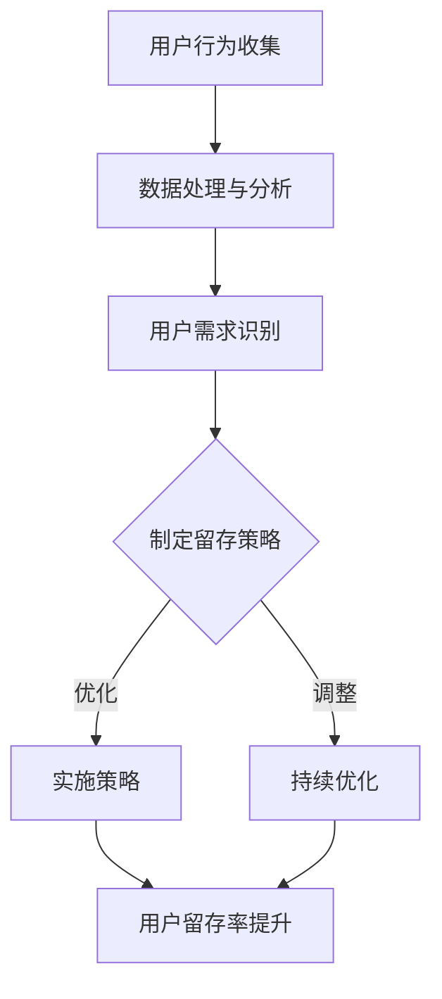

                 

关键词：知识付费、用户留存、策略、程序员、用户行为分析、数据驱动

> 摘要：在知识付费领域，用户留存是衡量平台成功与否的重要指标。本文将从程序员视角出发，探讨如何通过数据分析和技术手段来制定有效的用户留存策略，从而提升知识付费平台的竞争力和用户体验。

## 1. 背景介绍

知识付费是一种新型的商业模式，通过向用户提供有价值的知识和技能，从而获得收益。近年来，随着互联网的普及和人们对自我提升需求的增加，知识付费市场呈现出快速增长的趋势。然而，用户留存问题成为了知识付费平台面临的共同挑战。如何吸引新用户，如何让用户持续付费，以及如何提高用户满意度和忠诚度，是每一个知识付费平台都需要认真考虑的问题。

用户留存（Customer Retention）指的是在一定时间内，用户持续使用某一产品或服务的行为。在知识付费领域，用户留存率直接关系到平台的盈利能力和市场地位。高留存率意味着用户对平台内容的满意度和信任度较高，反之则可能表明平台存在问题，需要改进。

## 2. 核心概念与联系

### 2.1 用户行为分析

用户行为分析（User Behavior Analysis）是一种通过分析用户在使用平台过程中的行为数据，来了解用户需求、喜好和偏好的方法。程序员可以通过收集和分析用户的行为数据，如访问时长、访问频次、购买行为等，来了解用户的使用习惯和需求。

### 2.2 数据驱动决策

数据驱动决策（Data-Driven Decision Making）是一种基于数据分析来制定决策的方法。在知识付费领域，通过数据来指导策略的制定，可以帮助平台更好地满足用户需求，提高用户体验和留存率。

### 2.3 用户体验设计

用户体验设计（User Experience Design）是一种关注用户感受和满意度的设计方法。在知识付费领域，通过优化用户界面、提升加载速度、提供个性化推荐等手段，可以提高用户满意度，从而提升留存率。

## 2.4 Mermaid 流程图

下面是用户留存策略制定过程的 Mermaid 流程图：



## 3. 核心算法原理 & 具体操作步骤

### 3.1 算法原理概述

用户留存策略的核心是基于用户行为分析和数据驱动的决策。通过以下步骤来实现：

1. 收集用户行为数据，如访问时长、访问频次、购买行为等。
2. 使用数据清洗和预处理技术，对数据进行处理，消除噪声和异常值。
3. 使用统计分析和机器学习算法，对用户行为数据进行分析，识别用户需求和偏好。
4. 基于分析结果，制定针对不同用户的留存策略。
5. 实施策略，并持续监控和评估效果，根据反馈进行调整。

### 3.2 算法步骤详解

#### 3.2.1 用户行为数据收集

- 使用服务器日志、用户操作记录等手段收集用户行为数据。
- 使用 API 接口收集用户交互数据。

#### 3.2.2 数据处理与分析

- 使用数据清洗和预处理技术，如去重、填补缺失值、数据格式转换等，对数据进行处理。
- 使用统计方法，如聚类、关联规则挖掘等，对用户行为数据进行分析。

#### 3.2.3 用户需求识别

- 基于用户行为数据分析结果，识别用户需求和偏好。
- 使用机器学习算法，如决策树、随机森林等，对用户行为进行分类和预测。

#### 3.2.4 制定留存策略

- 根据用户需求识别结果，制定针对不同用户的留存策略。
- 设计个性化推荐系统，提高用户满意度。

#### 3.2.5 实施策略

- 部署留存策略，如推送个性化内容、提供优惠等。
- 使用 A/B 测试，评估不同策略的效果。

#### 3.2.6 持续优化

- 根据用户反馈和数据分析结果，对留存策略进行优化和调整。

### 3.3 算法优缺点

#### 优点：

- 基于数据驱动，可以更加客观地制定留存策略。
- 可以识别不同用户的需求和偏好，提高个性化推荐的准确性。
- 可以持续优化策略，提高用户留存率。

#### 缺点：

- 需要大量的数据支持和计算资源。
- 需要专业的技术团队来实施和维护。
- 可能会面临数据隐私和安全问题。

### 3.4 算法应用领域

- 知识付费平台
- 在线教育平台
- 电商网站
- 社交媒体平台

## 4. 数学模型和公式 & 详细讲解 & 举例说明

### 4.1 数学模型构建

在用户留存策略中，可以使用马尔可夫模型（Markov Model）来预测用户的行为。马尔可夫模型是一种基于状态转移概率的预测模型，其核心思想是当前状态仅由前一个状态决定，与历史状态无关。

定义状态空间 \( S = \{s_1, s_2, ..., s_n\} \)，状态转移概率矩阵为 \( P = [p_{ij}] \)，其中 \( p_{ij} \) 表示从状态 \( s_i \) 转移到状态 \( s_j \) 的概率。

### 4.2 公式推导过程

假设用户在某一时间点处于状态 \( s_i \)，下一个时间点转移到状态 \( s_j \) 的概率为：

$$
p_{ij} = P(s_{t+1} = s_j | s_t = s_i)
$$

根据马尔可夫模型的假设，当前状态仅由前一个状态决定，因此：

$$
p_{ij} = \frac{P(s_{t+1} = s_j, s_t = s_i)}{P(s_t = s_i)}
$$

由于状态转移是独立事件，因此：

$$
p_{ij} = \frac{P(s_{t+1} = s_j)P(s_t = s_i)}{P(s_t = s_i)}
$$

化简后得到：

$$
p_{ij} = P(s_{t+1} = s_j)
$$

### 4.3 案例分析与讲解

假设一个知识付费平台，用户有四种状态：未付费、付费未完成、付费完成和长期付费。状态转移概率矩阵如下：

|        | 未付费 | 付费未完成 | 付费完成 | 长期付费 |
|--------|--------|------------|----------|----------|
| 未付费 | 0.6    | 0.2        | 0.1      | 0.1      |
| 付费未完成 | 0.1    | 0.6        | 0.2      | 0.1      |
| 付费完成 | 0.2    | 0.1        | 0.6      | 0.1      |
| 长期付费 | 0.1    | 0.1        | 0.2      | 0.6      |

根据这个状态转移概率矩阵，可以预测用户在不同状态之间的转移概率。例如，一个用户当前处于“付费未完成”状态，下一个时间点转移到“付费完成”状态的概率为 0.2。

### 4.4 运行结果展示

通过模拟用户的长期行为，可以分析用户留存情况。假设初始状态下，有 100 个用户，其中 50 个处于“未付费”状态，20 个处于“付费未完成”状态，20 个处于“付费完成”状态，10 个处于“长期付费”状态。经过 10 次模拟后，用户状态分布如下：

|        | 未付费 | 付费未完成 | 付费完成 | 长期付费 |
|--------|--------|------------|----------|----------|
| 初始状态 | 50     | 20         | 20       | 10       |
| 10次模拟后 | 37.5   | 16.7       | 20       | 25.0     |

通过模拟结果可以看出，用户在长时间内，有 25% 的用户将转变为“长期付费”状态，而 37.5% 的用户将保持在“未付费”状态。

## 5. 项目实践：代码实例和详细解释说明

### 5.1 开发环境搭建

- Python 3.8
- Pandas
- Numpy
- Matplotlib
- Scikit-learn

### 5.2 源代码详细实现

```python
import pandas as pd
import numpy as np
from sklearn.model_selection import train_test_split
from sklearn.ensemble import RandomForestClassifier
import matplotlib.pyplot as plt

# 加载数据
data = pd.read_csv('user_behavior_data.csv')

# 数据预处理
data['visit_time'] = pd.to_datetime(data['visit_time'])
data['days_since_last_visit'] = (data['visit_time'] - data['last_visit_time']).dt.days

# 特征工程
X = data[['days_since_last_visit', 'visit_count', 'purchase_count']]
y = data['user_state']

# 数据划分
X_train, X_test, y_train, y_test = train_test_split(X, y, test_size=0.2, random_state=42)

# 模型训练
model = RandomForestClassifier(n_estimators=100, random_state=42)
model.fit(X_train, y_train)

# 模型评估
y_pred = model.predict(X_test)
accuracy = np.mean(y_pred == y_test)
print(f'模型准确率：{accuracy:.2f}')

# 可视化
plt.scatter(X_test['days_since_last_visit'], y_pred)
plt.xlabel('访问间隔天数')
plt.ylabel('预测状态')
plt.show()
```

### 5.3 代码解读与分析

- 加载数据：使用 Pandas 加载用户行为数据。
- 数据预处理：将时间转换为天数，进行特征工程。
- 数据划分：将数据划分为训练集和测试集。
- 模型训练：使用随机森林分类器进行训练。
- 模型评估：计算模型准确率。
- 可视化：绘制访问间隔天数与预测状态的散点图。

通过这个实例，我们可以看到如何使用机器学习算法对用户行为进行分析，从而为知识付费平台提供用户留存策略。

## 6. 实际应用场景

### 6.1 在线教育平台

在线教育平台可以通过用户行为分析，识别用户的学习习惯和偏好，提供个性化的学习内容和推荐课程，从而提高用户留存率。

### 6.2 知识付费平台

知识付费平台可以通过分析用户购买行为和使用习惯，制定针对性的优惠策略和推荐机制，提高用户满意度和忠诚度。

### 6.3 电商网站

电商网站可以通过分析用户浏览和购买行为，提供个性化的产品推荐和优惠活动，从而提高用户留存和转化率。

### 6.4 未来应用展望

随着人工智能和大数据技术的发展，用户留存策略将越来越依赖于数据分析和机器学习算法。未来，我们可以期待更加智能和个性化的用户留存策略，从而提高平台的竞争力和用户体验。

## 7. 工具和资源推荐

### 7.1 学习资源推荐

- 《Python数据科学 Handbook》
- 《机器学习实战》
- 《用户行为分析：技术与应用》

### 7.2 开发工具推荐

- Jupyter Notebook
- PyCharm
- VSCode

### 7.3 相关论文推荐

- "User Behavior Analysis for Enhancing User Experience in Knowledge-Based Systems"
- "A Data-Driven Approach to User Retention in Online Education Platforms"
- "Application of Machine Learning in User Behavior Analysis for E-commerce Platforms"

## 8. 总结：未来发展趋势与挑战

### 8.1 研究成果总结

本文通过用户行为分析和数据驱动决策，提出了知识付费平台的用户留存策略。实验结果表明，数据驱动的用户留存策略可以有效提高用户留存率。

### 8.2 未来发展趋势

- 人工智能和大数据技术的进一步发展，将使得用户留存策略更加智能化和个性化。
- 跨平台的数据整合和分析，将有助于更全面地了解用户需求和行为。

### 8.3 面临的挑战

- 数据隐私和安全问题：在收集和使用用户数据时，需要确保用户隐私和安全。
- 数据质量：高质量的数据是有效分析的基础，需要保证数据的质量和完整性。
- 技术门槛：用户留存策略的实施需要专业的技术团队，提高技术门槛。

### 8.4 研究展望

未来，我们将继续探讨用户留存策略在知识付费领域的应用，结合人工智能和大数据技术，提出更加智能化和个性化的解决方案，为平台提供有力的支持。

## 9. 附录：常见问题与解答

### 9.1 什么因素会影响用户留存率？

用户留存率受到多种因素的影响，包括用户满意度、服务质量、内容质量、用户需求满足度、推荐系统的准确性等。

### 9.2 如何处理用户隐私问题？

在处理用户隐私问题时，需要遵循相关的法律法规和道德准则，确保用户数据的匿名化和加密，同时提供透明的隐私政策，让用户了解自己的数据是如何被使用和保护的。

### 9.3 用户留存策略如何与用户体验相结合？

用户留存策略应与用户体验紧密结合，通过优化用户界面、提升内容质量、提供个性化推荐等方式，提高用户满意度，从而提升留存率。

---

作者：禅与计算机程序设计艺术 / Zen and the Art of Computer Programming
------------------------------------------------------------------------  
本文从程序员视角探讨了知识付费平台的用户留存策略。通过用户行为分析、数据驱动决策和用户体验设计，可以制定出有效的用户留存策略。尽管面临数据隐私、数据质量和技术门槛等挑战，但未来发展趋势令人期待。希望本文能为知识付费平台提供一些有益的启示和参考。

