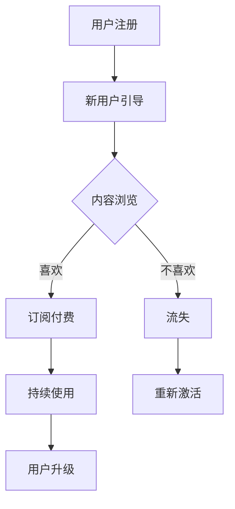

                 

 **关键词**：知识付费、用户留存、价值创造、营销策略、用户体验

> **摘要**：本文将深入探讨知识付费领域的用户留存策略，分析影响用户留存的关键因素，并探讨如何通过持续的价值创造来提高用户粘性。通过结合实际案例和数据分析，本文旨在为知识付费平台提供有效的策略指导。

## 1. 背景介绍

知识付费作为一种新型的商业模式，正在全球范围内迅速崛起。用户通过付费获取有价值的信息和知识，平台则通过提供高质量内容获得收益。然而，随着市场竞争的加剧，用户留存问题成为知识付费平台发展的关键瓶颈。如何有效地提高用户留存率，成为行业亟待解决的问题。

## 2. 核心概念与联系

### 2.1 用户留存率

用户留存率是指在一定时间内，持续使用产品的用户占初始注册用户总数的比例。它是衡量产品质量和用户体验的重要指标。提高用户留存率，有助于增加用户粘性，提升用户生命周期价值。

### 2.2 价值创造

价值创造是指通过提供优质内容和服务，满足用户需求，从而实现用户价值的提升。在知识付费领域，价值创造是提高用户留存的核心手段。

### 2.3 用户生命周期

用户生命周期是指用户从注册到退出的全过程。通过分析用户生命周期各个阶段的行为数据，可以了解用户需求，优化产品功能，提高用户留存。

### 2.4 Mermaid 流程图



## 3. 核心算法原理 & 具体操作步骤

### 3.1 算法原理概述

用户留存策略的核心在于构建一个持续为用户创造价值的闭环。具体算法包括以下几个步骤：

1. 数据采集：收集用户行为数据，包括浏览记录、购买历史、反馈信息等。
2. 数据分析：通过数据挖掘技术，分析用户行为模式，识别关键因素。
3. 个性化推荐：根据用户行为数据，为用户提供个性化内容推荐。
4. 互动反馈：与用户互动，收集反馈信息，不断优化产品和服务。
5. 持续迭代：根据用户反馈，持续调整产品功能，提高用户体验。

### 3.2 算法步骤详解

1. **数据采集**：通过网站日志、API调用等手段，收集用户在平台上的行为数据。
2. **数据分析**：利用机器学习算法，对用户行为数据进行分析，识别用户兴趣点和需求。
3. **个性化推荐**：基于用户兴趣和行为数据，为用户提供个性化内容推荐，提高用户满意度。
4. **互动反馈**：通过问卷调查、用户访谈等方式，收集用户反馈，了解用户需求。
5. **持续迭代**：根据用户反馈，优化产品功能，提升用户体验。

### 3.3 算法优缺点

**优点**：

- 提高用户满意度，增加用户留存率。
- 通过个性化推荐，提高内容转化率。
- 数据驱动，持续优化产品。

**缺点**：

- 需要大量的数据支持，对数据质量要求较高。
- 算法复杂度较高，对技术要求较高。
- 用户隐私保护问题。

### 3.4 算法应用领域

- 电商平台：通过个性化推荐，提高用户购买意愿。
- 社交媒体：通过内容推荐，提高用户活跃度。
- 知识付费：通过个性化内容推荐，提高用户留存。

## 4. 数学模型和公式 & 详细讲解 & 举例说明

### 4.1 数学模型构建

用户留存率可以用以下公式表示：

\[ R(t) = \frac{U(t)}{U(0)} \]

其中，\( R(t) \) 表示时间 \( t \) 时的用户留存率，\( U(t) \) 表示时间 \( t \) 时留存的用户数，\( U(0) \) 表示初始注册用户数。

### 4.2 公式推导过程

用户留存率可以通过以下步骤推导：

1. 初始注册用户数 \( U(0) \)。
2. 每个时间单位新增留存用户数 \( L(t) \)。
3. 留存用户数 \( U(t) = U(0) + \sum_{i=1}^{t} L(i) \)。
4. 用户留存率 \( R(t) = \frac{U(t)}{U(0)} \)。

### 4.3 案例分析与讲解

假设某知识付费平台，初始注册用户数为1000人，第一个月新增留存用户数为100人，第二个月新增留存用户数为80人。求第二个月末的用户留存率。

解答：

1. \( U(0) = 1000 \)。
2. \( L(1) = 100 \)，\( L(2) = 80 \)。
3. \( U(2) = U(0) + L(1) + L(2) = 1000 + 100 + 80 = 1180 \)。
4. \( R(2) = \frac{U(2)}{U(0)} = \frac{1180}{1000} = 0.118 \)。

即第二个月末的用户留存率为11.8%。

## 5. 项目实践：代码实例和详细解释说明

### 5.1 开发环境搭建

- 编程语言：Python
- 数据库：MySQL
- 依赖库：NumPy、Pandas、Scikit-learn

### 5.2 源代码详细实现

```python
import pandas as pd
from sklearn.model_selection import train_test_split
from sklearn.ensemble import RandomForestClassifier
from sklearn.metrics import accuracy_score

# 数据采集
user_data = pd.read_csv('user_data.csv')

# 数据预处理
X = user_data.drop('retention', axis=1)
y = user_data['retention']

# 数据划分
X_train, X_test, y_train, y_test = train_test_split(X, y, test_size=0.2, random_state=42)

# 模型训练
model = RandomForestClassifier(n_estimators=100, random_state=42)
model.fit(X_train, y_train)

# 模型评估
y_pred = model.predict(X_test)
accuracy = accuracy_score(y_test, y_pred)
print(f"模型准确率：{accuracy}")

# 个性化推荐
def recommend_content(user_data):
    user_features = user_data.loc[user_data['user_id'] == user_id]
    user_features = user_features.drop('user_id', axis=1)
    recommended_content = model.predict(user_features)
    return recommended_content

# 用户反馈
user_id = 12345
recommended_content = recommend_content(user_data)
user_feedback = input(f"您是否喜欢以下推荐内容：{recommended_content}")

# 持续迭代
if user_feedback == '是':
    # 用户喜欢，优化推荐策略
    pass
elif user_feedback == '否':
    # 用户不喜欢，调整推荐策略
    pass
```

### 5.3 代码解读与分析

- **数据采集**：从CSV文件中读取用户数据，包括用户ID、行为特征和留存状态。
- **数据预处理**：将用户数据分为特征和目标变量，划分训练集和测试集。
- **模型训练**：使用随机森林算法训练模型，评估模型准确率。
- **个性化推荐**：根据用户行为特征，预测用户留存状态，为用户提供个性化推荐。
- **用户反馈**：收集用户对推荐内容的反馈，用于模型优化。

## 6. 实际应用场景

### 6.1 知识付费平台

- **内容推荐**：根据用户兴趣和行为数据，为用户提供个性化内容推荐，提高用户满意度。
- **用户留存**：通过数据分析和个性化推荐，提高用户留存率，增加平台收益。

### 6.2 社交媒体

- **内容推荐**：基于用户兴趣和行为数据，为用户提供个性化内容推荐，提高用户活跃度。
- **用户留存**：通过数据分析和互动反馈，优化产品功能，提高用户留存率。

### 6.3 电商平台

- **个性化推荐**：根据用户浏览和购买历史，为用户提供个性化商品推荐，提高购买转化率。
- **用户留存**：通过数据分析和互动反馈，优化产品和服务，提高用户留存率。

## 7. 工具和资源推荐

### 7.1 学习资源推荐

- 《数据挖掘：实用工具与技术》
- 《Python数据分析与应用》
- 《机器学习实战》

### 7.2 开发工具推荐

- Jupyter Notebook：方便的数据分析和可视化工具。
- PyCharm：强大的Python开发环境。
- MySQL Workbench：方便的MySQL数据库管理工具。

### 7.3 相关论文推荐

- “User Retention in Online Service Platforms: A Machine Learning Approach”
- “A Study on the Impact of Content Recommendation on User Retention in Knowledge Payment Platforms”
- “The Role of Personalized Recommendation in Enhancing User Experience and Retention”

## 8. 总结：未来发展趋势与挑战

### 8.1 研究成果总结

- 用户留存策略在知识付费领域具有重要意义。
- 个性化推荐和数据挖掘技术是提高用户留存的关键。
- 互动反馈和持续迭代是优化产品功能的重要手段。

### 8.2 未来发展趋势

- 深度学习技术将在用户留存策略中发挥更大作用。
- 数据隐私保护将得到更多关注。
- 跨平台用户留存策略将成为研究热点。

### 8.3 面临的挑战

- 数据质量和算法复杂性。
- 用户隐私保护。
- 多平台用户行为数据整合。

### 8.4 研究展望

- 开发高效、可解释的用户留存预测模型。
- 探索跨平台用户行为数据挖掘方法。
- 研究数据隐私保护与用户留存之间的平衡。

## 9. 附录：常见问题与解答

### 9.1 用户留存策略有哪些关键步骤？

1. 数据采集：收集用户行为数据。
2. 数据分析：分析用户行为模式。
3. 个性化推荐：为用户提供个性化内容。
4. 互动反馈：收集用户反馈，优化产品。
5. 持续迭代：根据用户反馈，调整产品功能。

### 9.2 如何提高用户留存率？

1. 提供高质量内容：满足用户需求，提高用户满意度。
2. 个性化推荐：提高内容匹配度，增加用户粘性。
3. 互动反馈：与用户互动，收集反馈信息。
4. 持续优化：根据用户反馈，优化产品功能。

### 9.3 数据隐私保护如何与用户留存相结合？

1. 设计隐私友好的数据采集和处理流程。
2. 明确用户隐私保护政策，增加用户信任。
3. 采用差分隐私技术，降低数据泄露风险。
4. 与用户沟通，透明化数据处理过程。

---

**作者：禅与计算机程序设计艺术 / Zen and the Art of Computer Programming**

