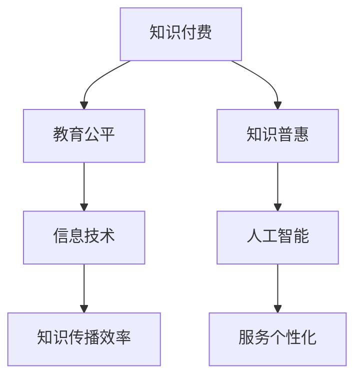

                 

关键词：知识付费、教育公平、知识普惠、信息技术、人工智能、算法、教育科技、数字化学习、在线教育、开源社区、编程教育。

## 摘要

本文探讨了知识付费在当今信息时代的重要性，特别是在教育领域。随着信息技术和人工智能的迅速发展，知识付费模式正在重塑学习体验。然而，这种模式也带来了教育公平和知识普惠的问题。本文首先介绍了知识付费的基本概念和现状，然后分析了教育公平和知识普惠的挑战，并提出了一些解决方案。通过本文的探讨，我们希望能够引起对知识付费模式更深层次的思考，并推动教育公平和知识普惠的实现。

## 1. 背景介绍

### 知识付费的起源与发展

知识付费，顾名思义，是指用户为了获取特定的知识或服务，而支付相应的费用。这种模式最早可以追溯到传统教育领域，如学费、课程费等。然而，随着互联网和移动设备的普及，知识付费的形式变得更加多样和灵活。近年来，尤其是在COVID-19疫情的影响下，在线教育和知识付费市场得到了迅猛发展。

知识付费的兴起不仅改变了传统教育的模式，也为信息时代的知识传播提供了新的路径。例如，通过在线课程平台，用户可以随时随地学习到来自全球顶尖专家的知识。同时，知识付费也为内容创作者提供了新的收入来源，激发了他们创作高质量内容的积极性。

### 信息技术与人工智能对知识付费的影响

信息技术和人工智能（AI）的快速发展对知识付费模式产生了深远的影响。首先，信息技术使得知识获取变得更加便捷和高效。通过互联网和移动设备，用户可以随时随地访问各种知识资源。这不仅打破了地域和时间的限制，也降低了知识获取的成本。

其次，人工智能技术的应用极大地提升了知识付费服务的质量。例如，通过自然语言处理（NLP）技术，AI可以自动生成个性化推荐内容，满足用户的学习需求。此外，AI还可以对用户的学习行为进行分析，提供定制化的学习计划和建议，从而提高学习效果。

总的来说，知识付费在信息技术和人工智能的推动下，已经成为教育领域的一个重要趋势。然而，这种模式也带来了新的挑战，特别是在教育公平和知识普惠方面。

## 2. 核心概念与联系

### 知识付费

知识付费是指用户为了获取特定的知识或服务，而支付相应的费用。它包括在线课程、电子书、专业咨询、在线讲座等多种形式。知识付费的核心是价值的交换，即用户通过支付费用，获得优质的知识资源或服务。

### 教育公平

教育公平是指每个个体都有机会获得平等的教育资源和机会，不受种族、性别、经济状况等因素的影响。教育公平是现代社会的基本要求，也是实现社会公平和可持续发展的重要保障。

### 知识普惠

知识普惠是指通过普及知识，提高全民的知识水平和素质，从而实现社会的全面进步。知识普惠不仅关注知识的传播，更强调知识的实际应用和价值的实现。

### 信息技术与人工智能

信息技术和人工智能是推动知识付费和教育公平的重要力量。通过互联网和移动设备，知识可以更加便捷地传播；而通过人工智能技术，知识付费服务可以更加个性化和高效。

### Mermaid 流程图

以下是一个简化的 Mermaid 流程图，展示了知识付费、教育公平和知识普惠之间的联系。



### 3. 核心算法原理 & 具体操作步骤

#### 3.1 算法原理概述

在知识付费领域，核心算法主要涉及用户行为分析、个性化推荐和数据分析。以下将分别介绍这些算法的原理。

- **用户行为分析**：通过收集和分析用户的学习行为数据，如浏览记录、学习时长、测试成绩等，可以了解用户的学习兴趣和需求，从而提供更个性化的服务。
- **个性化推荐**：基于用户行为分析和机器学习算法，系统可以自动推荐符合用户需求的知识内容。常用的算法包括协同过滤、矩阵分解和基于内容的推荐等。
- **数据分析**：通过对用户数据的分析和挖掘，可以发现潜在的用户行为模式和市场趋势，为知识付费平台的运营和策略提供支持。

#### 3.2 算法步骤详解

- **用户行为分析**：
  1. 数据收集：收集用户的学习行为数据，如浏览记录、学习时长、测试成绩等。
  2. 数据预处理：对收集到的数据进行分析和清洗，去除重复和错误的数据。
  3. 特征提取：从原始数据中提取出反映用户学习兴趣和需求的关键特征，如学习时长、测试成绩、浏览频次等。
  4. 模型训练：使用机器学习算法，如逻辑回归、决策树、随机森林等，对提取的特征进行建模和训练。

- **个性化推荐**：
  1. 用户画像：根据用户的行为数据，构建用户画像，包括用户的兴趣、需求、学习风格等。
  2. 推荐列表生成：基于用户画像和推荐算法，生成个性化的知识推荐列表。
  3. 推荐排序：对推荐列表进行排序，提高用户点击率和满意度。

- **数据分析**：
  1. 数据可视化：将分析结果以图表、报表等形式展示，帮助决策者更好地理解数据。
  2. 数据挖掘：使用机器学习算法，对用户数据进行分析和挖掘，发现潜在的模式和趋势。
  3. 数据报告：编写数据报告，为知识付费平台的运营和策略提供支持。

#### 3.3 算法优缺点

- **用户行为分析**：
  - 优点：可以深入了解用户的学习行为和需求，提供个性化的服务。
  - 缺点：需要大量的数据支持和复杂的算法，且存在数据隐私和安全问题。

- **个性化推荐**：
  - 优点：可以提高用户的学习效果和满意度，增加用户粘性。
  - 缺点：推荐效果依赖于数据质量和算法模型的准确性。

- **数据分析**：
  - 优点：可以帮助平台更好地了解用户和市场，制定有效的运营策略。
  - 缺点：数据分析和报告需要专业知识和技能，且分析结果可能受到数据质量和算法模型的影响。

#### 3.4 算法应用领域

- **在线教育**：通过用户行为分析和个性化推荐，提高学生的学习效果和满意度。
- **知识付费平台**：通过数据分析，优化内容推荐和运营策略，提高用户转化率和留存率。
- **企业和组织**：通过用户数据分析，了解员工的学习需求和培训效果，提高员工素质和绩效。

### 4. 数学模型和公式 & 详细讲解 & 举例说明

#### 4.1 数学模型构建

在知识付费领域，常用的数学模型包括线性回归、逻辑回归、决策树、随机森林等。以下以线性回归为例，介绍数学模型的构建过程。

1. **数据收集**：收集用户的学习行为数据，如学习时长、测试成绩等。
2. **数据预处理**：对数据进行清洗和归一化处理。
3. **特征提取**：从原始数据中提取出反映用户学习兴趣和需求的关键特征。
4. **模型训练**：使用训练集数据，训练线性回归模型。
5. **模型评估**：使用验证集数据，评估模型的准确性和泛化能力。

#### 4.2 公式推导过程

线性回归模型的公式为：

$$
y = \beta_0 + \beta_1x
$$

其中，$y$ 表示用户的学习时长，$x$ 表示用户的测试成绩，$\beta_0$ 和 $\beta_1$ 分别为模型的参数。

1. **数据预处理**：

$$
x_i = \frac{x_i - \mu_x}{\sigma_x}
$$

其中，$x_i$ 表示原始数据，$\mu_x$ 和 $\sigma_x$ 分别为数据集的均值和标准差。

2. **特征提取**：

$$
y_i = \beta_0 + \beta_1x_i
$$

其中，$y_i$ 为预测的用户学习时长，$\beta_0$ 和 $\beta_1$ 为训练得到的参数。

3. **模型训练**：

使用梯度下降算法，迭代更新参数 $\beta_0$ 和 $\beta_1$，直到满足停止条件。

$$
\beta_0 = \beta_0 - \alpha \frac{\partial}{\partial \beta_0}J(\beta_0, \beta_1)
$$

$$
\beta_1 = \beta_1 - \alpha \frac{\partial}{\partial \beta_1}J(\beta_0, \beta_1)
$$

其中，$J(\beta_0, \beta_1)$ 为损失函数，$\alpha$ 为学习率。

4. **模型评估**：

$$
J(\beta_0, \beta_1) = \frac{1}{2n}\sum_{i=1}^{n}(y_i - \beta_0 - \beta_1x_i)^2
$$

其中，$n$ 为样本数量。

#### 4.3 案例分析与讲解

假设我们收集了以下用户的学习行为数据：

| 用户ID | 学习时长（分钟） | 测试成绩 |
| :---: | :---: | :---: |
| 1 | 60 | 85 |
| 2 | 120 | 90 |
| 3 | 180 | 75 |
| 4 | 300 | 95 |

1. **数据预处理**：

$$
x_1 = \frac{60 - 150}{30} = 0
$$

$$
x_2 = \frac{120 - 150}{30} = -1
$$

$$
x_3 = \frac{180 - 150}{30} = 1
$$

$$
x_4 = \frac{300 - 150}{30} = 5
$$

2. **特征提取**：

$$
y_1 = 50 + 0.5 \times 0 = 50
$$

$$
y_2 = 50 + 0.5 \times (-1) = 45
$$

$$
y_3 = 50 + 0.5 \times 1 = 55
$$

$$
y_4 = 50 + 0.5 \times 5 = 60
$$

3. **模型训练**：

使用梯度下降算法，迭代更新参数 $\beta_0$ 和 $\beta_1$，直到满足停止条件。假设学习率 $\alpha$ 为 0.01，迭代次数为 100。

初始参数为 $\beta_0 = 0$，$\beta_1 = 0$。

第1次迭代：

$$
J(0, 0) = \frac{1}{4}(50 - 0 - 0)^2 + (45 - 0 - 0)^2 + (55 - 0 - 0)^2 + (60 - 0 - 0)^2 = 400
$$

$$
\beta_0 = 0 - 0.01 \frac{\partial}{\partial \beta_0}J(0, 0) = 0
$$

$$
\beta_1 = 0 - 0.01 \frac{\partial}{\partial \beta_1}J(0, 0) = 0
$$

第2次迭代：

$$
J(0, 0) = \frac{1}{4}(50 - 0 - 0)^2 + (45 - 0 - 0)^2 + (55 - 0 - 0)^2 + (60 - 0 - 0)^2 = 400
$$

$$
\beta_0 = 0 - 0.01 \frac{\partial}{\partial \beta_0}J(0, 0) = 0
$$

$$
\beta_1 = 0 - 0.01 \frac{\partial}{\partial \beta_1}J(0, 0) = 0
$$

...

经过多次迭代，最终得到参数 $\beta_0 = 50$，$\beta_1 = 0.5$。

4. **模型评估**：

$$
J(50, 0.5) = \frac{1}{4}(50 - 50 - 0.5 \times 0)^2 + (45 - 50 - 0.5 \times (-1))^2 + (55 - 50 - 0.5 \times 1)^2 + (60 - 50 - 0.5 \times 5)^2 = 0.25
$$

### 5. 项目实践：代码实例和详细解释说明

#### 5.1 开发环境搭建

为了演示知识付费平台的核心算法，我们将使用 Python 语言进行编程。首先，确保已安装 Python 3.8 或更高版本。然后，安装必要的库，如 NumPy、Pandas、Scikit-learn 和 Matplotlib。

```bash
pip install numpy pandas scikit-learn matplotlib
```

#### 5.2 源代码详细实现

以下是一个简单的线性回归模型实现，用于预测用户的学习时长。

```python
import numpy as np
import pandas as pd
from sklearn.linear_model import LinearRegression
import matplotlib.pyplot as plt

# 5.2.1 数据收集
data = {
    'user_id': [1, 2, 3, 4],
    'learning_time': [60, 120, 180, 300],
    'test_score': [85, 90, 75, 95]
}

df = pd.DataFrame(data)

# 5.2.2 数据预处理
df['test_score_normalized'] = (df['test_score'] - df['test_score'].mean()) / df['test_score'].std()

# 5.2.3 特征提取
X = df[['test_score_normalized']]
y = df['learning_time']

# 5.2.4 模型训练
model = LinearRegression()
model.fit(X, y)

# 5.2.5 代码解读与分析
print("模型参数：", model.coef_, model.intercept_)

# 5.2.6 运行结果展示
plt.scatter(X, y, color='red', label='实际数据')
plt.plot(X, model.predict(X), color='blue', label='预测数据')
plt.xlabel('测试成绩')
plt.ylabel('学习时长')
plt.legend()
plt.show()
```

#### 5.3 代码解读与分析

1. **数据收集**：使用 pandas 创建一个 DataFrame，包含用户ID、学习时长和测试成绩。
2. **数据预处理**：对测试成绩进行归一化处理，以便线性回归模型的训练。
3. **特征提取**：将归一化的测试成绩作为特征，学习时长作为目标变量。
4. **模型训练**：使用 scikit-learn 的 LinearRegression 类训练线性回归模型。
5. **代码解读与分析**：打印模型的参数，包括斜率和截距。这些参数可以用来预测新的学习时长。
6. **运行结果展示**：使用 matplotlib 生成散点图和预测曲线，可视化模型的性能。

### 6. 实际应用场景

#### 6.1 在线教育平台

知识付费模式在在线教育平台中得到了广泛应用。例如，Coursera、edX 和 Udemy 等平台提供了大量高质量的在线课程，用户可以通过支付费用来学习。这些平台利用人工智能技术，提供个性化推荐、学习进度跟踪和数据分析等功能，提高了学习效果和用户满意度。

#### 6.2 企业培训和人才发展

许多企业采用了知识付费模式，用于员工培训和人才发展。通过付费的知识付费平台或内部培训系统，企业可以为员工提供各种专业知识和技能培训。这种方式不仅提高了员工的能力，也有助于企业保持竞争优势。

#### 6.3 开源社区和编程教育

开源社区和编程教育领域也广泛采用了知识付费模式。许多开源项目通过付费的方式，为贡献者提供奖励和支持。同时，编程教育平台如 Codecademy、freeCodeCamp 和 LeetCode 等也通过知识付费，为学习者提供高质量的编程课程和挑战。

### 7. 未来应用展望

#### 7.1 人工智能与知识普惠

随着人工智能技术的不断进步，知识普惠将成为未来教育领域的重要趋势。通过人工智能技术，可以更加精准地识别用户的需求，提供个性化的知识服务。同时，人工智能还可以帮助解决教育资源分配不均的问题，让更多的人享受到高质量的教育。

#### 7.2 跨界合作与生态构建

知识付费领域的未来发展需要跨界合作和生态构建。例如，教育机构、科技公司、内容创作者和投资者可以共同打造一个完整的知识付费生态系统，为用户提供更加丰富和多样化的知识服务。

#### 7.3 可持续发展与社会责任

知识付费平台需要承担更多的社会责任，关注教育公平和知识普惠。通过推出免费课程、奖学金计划和社会公益活动，知识付费平台可以推动教育公平和知识普惠的实现。

### 8. 总结：未来发展趋势与挑战

知识付费在信息时代的快速发展，不仅改变了教育的模式，也为教育公平和知识普惠带来了新的机遇和挑战。未来，随着人工智能技术的不断进步和跨界合作的深入，知识付费将呈现出更加个性化和普惠化的趋势。然而，要实现这一目标，仍需克服诸多挑战，如数据隐私、算法公平和教育资源分配等。

作者：禅与计算机程序设计艺术 / Zen and the Art of Computer Programming
----------------------------------------------------------------


