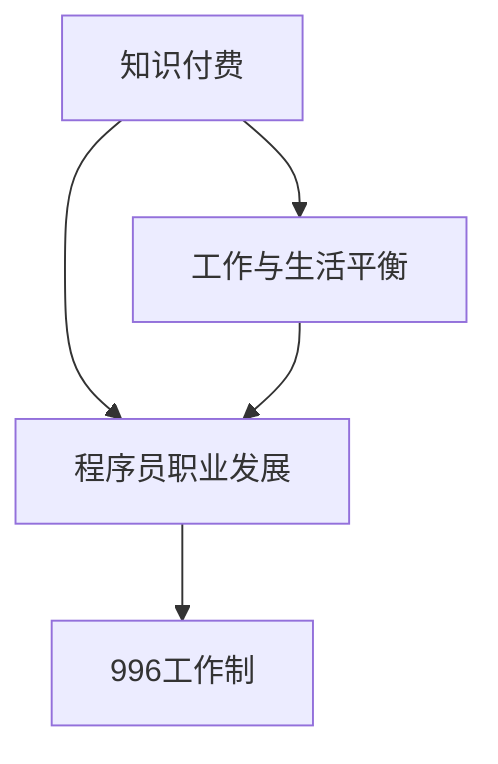

                 

## 1. 背景介绍

在过去的几十年里，程序员这个职业逐渐成为了现代社会中不可或缺的一部分。随着互联网、云计算、大数据等技术的蓬勃发展，程序员的需求也日益增长。然而，随着程序员职业的兴起，一个普遍的问题也日益突出——996工作制。

996工作制，即每周工作6天，每天工作从早上9点到晚上9点，这种工作模式在中国企业中曾经十分盛行。程序员们在这种工作模式下，每天工作长达12个小时，几乎没有个人时间。这种高强度的工作模式不仅严重影响了程序员的生活质量，还引发了广泛的社会关注和讨论。

程序员的工作环境和生活状态引起了社会的广泛关注，人们开始思考如何改变这种状况。知识付费作为一种新的商业模式，逐渐进入了人们的视野。知识付费的本质是让程序员通过学习和掌握更多的知识和技能，提升自己的竞争力，从而获得更高的薪资和更好的工作环境。

本文将探讨知识付费如何让程序员告别996的生活，实现工作与生活的平衡。首先，我们将介绍知识付费的基本概念和运作模式。然后，分析程序员通过知识付费提升自己的途径。接下来，探讨知识付费对程序员工作环境和薪资待遇的影响。最后，讨论知识付费在未来的发展趋势和面临的挑战。

## 2. 核心概念与联系

在深入探讨知识付费如何改变程序员的生活之前，我们需要明确几个核心概念。

### 2.1 知识付费

知识付费是指用户为获取特定知识或技能而支付的费用。这种模式打破了传统的免费学习模式，用户需要为优质的内容和专业的服务付费。知识付费的形式多种多样，包括线上课程、线下培训、专业咨询等。

### 2.2 996工作制

996工作制是一种高强度的工作模式，每周工作6天，每天从早上9点工作到晚上9点。这种工作模式对程序员的生活质量产生了极大的负面影响，导致身体和心理上的压力。

### 2.3 程序员职业发展

程序员的职业发展包括技能提升、项目经验积累、专业认证等方面。通过不断学习和实践，程序员可以提升自己的专业水平，从而获得更高的薪资和更好的职业发展机会。

### 2.4 知识付费与程序员职业发展的关系

知识付费与程序员职业发展密切相关。通过付费学习，程序员可以更快速地掌握新的技术和知识，提升自己的竞争力。同时，优质的知识付费内容可以帮助程序员解决实际问题，提高工作效率。

为了更好地理解这些概念之间的关系，我们可以使用Mermaid流程图来展示。



在这个流程图中，知识付费是提升程序员职业发展的关键因素，而职业发展又可以缓解996工作制带来的压力，实现工作与生活的平衡。

## 3. 核心算法原理 & 具体操作步骤

### 3.1 算法原理概述

知识付费的核心算法可以看作是一种投资回报模型。在这个模型中，程序员通过付费学习获得知识，这些知识转化为技能提升和工作效率。具体来说，这个过程可以分为以下几个步骤：

1. **需求分析**：程序员识别自己在技能和知识方面的不足，确定学习目标。
2. **知识获取**：程序员通过付费学习平台或课程，获取所需的知识和技能。
3. **实践应用**：程序员将所学知识应用到实际工作中，提高工作效率和质量。
4. **反馈调整**：根据实际应用效果，程序员调整学习计划，继续提升技能。

### 3.2 算法步骤详解

1. **需求分析**

   程序员需要先对自己的技能和知识进行评估，找出自己的短板。这个过程可以通过以下几种方式实现：

   - **自我评估**：程序员可以通过回忆自己在工作中遇到的难题，分析自己在这些难题上的不足。
   - **技能图谱**：通过查看行业内的技能图谱，了解当前流行的技术和知识领域。
   - **同行交流**：与其他程序员交流，了解他们在技能提升方面的经验和建议。

2. **知识获取**

   确定了学习目标后，程序员可以通过以下途径获取知识和技能：

   - **线上课程**：通过各大在线教育平台，如Coursera、Udemy、网易云课堂等，学习最新的技术和知识。
   - **线下培训**：参加专业的线下培训机构，如华为、腾讯等大公司的培训课程。
   - **实践项目**：参与开源项目或实际工作项目，通过实践提升自己的技能。

3. **实践应用**

   获取知识和技能后，程序员需要将这些应用到实际工作中，提高工作效率和质量。这个过程可以通过以下方式实现：

   - **代码重构**：将所学的新技术和知识应用到现有的项目中，优化代码结构和性能。
   - **项目优化**：根据所学知识，对现有项目进行优化，提高项目的可维护性和扩展性。
   - **问题解决**：在遇到问题时，运用所学知识解决问题，提升自己的问题解决能力。

4. **反馈调整**

   在实践应用过程中，程序员需要不断收集反馈，根据反馈调整自己的学习计划。这个过程可以通过以下方式实现：

   - **定期回顾**：定期回顾所学知识和技能，分析自己在实践中的不足。
   - **同行交流**：与其他程序员交流，了解他们在学习过程中的经验和建议。
   - **调整计划**：根据反馈和实际情况，调整学习计划，继续提升技能。

### 3.3 算法优缺点

**优点**：

1. **高效提升技能**：通过付费学习，程序员可以更快速地掌握新的技术和知识，提升自己的竞争力。
2. **针对性学习**：根据自身需求选择学习内容和方式，实现针对性学习，提高学习效果。
3. **实践导向**：将所学知识应用到实际工作中，提高工作效率和质量。

**缺点**：

1. **成本较高**：付费学习需要投入一定的经济成本，对一些经济条件较差的程序员来说可能有一定压力。
2. **学习质量参差不齐**：市场上的知识付费内容质量参差不齐，选择优质的内容需要花费一定的时间和精力。

### 3.4 算法应用领域

知识付费算法广泛应用于程序员的职业发展过程中，以下是一些具体的应用领域：

1. **前端开发**：前端开发领域技术更新迅速，程序员需要不断学习新的框架和工具，如React、Vue、Angular等。
2. **后端开发**：后端开发领域涉及到的技术较多，如Java、Python、Node.js等，程序员需要不断学习和实践，提升自己的技能。
3. **移动开发**：随着移动设备的普及，移动应用开发成为一个热门领域，程序员需要学习iOS和Android开发知识。
4. **人工智能**：人工智能是一个快速发展的领域，程序员需要学习深度学习、机器学习等相关知识。

## 4. 数学模型和公式 & 详细讲解 & 举例说明

在探讨知识付费对程序员职业发展的具体影响时，我们可以引入一些数学模型和公式来进行分析。

### 4.1 数学模型构建

我们假设一个程序员的工资与其技能水平成正比，即工资 \( W \) 是技能水平 \( S \) 的函数。同时，技能水平 \( S \) 又与知识付费 \( K \) 成正比。可以构建如下数学模型：

\[ W = f(S) = f(K) \]

其中，\( f \) 是一个非线性的函数，表示技能水平或工资随知识付费的增加而增长。

### 4.2 公式推导过程

为了简化模型，我们假设 \( f \) 是一个线性函数，即：

\[ f(x) = kx \]

其中，\( k \) 是一个常数，表示知识付费对工资的影响程度。

根据这个假设，我们可以推导出程序员的工资与知识付费的关系：

\[ W = kK \]

其中，\( W \) 是程序员的工资，\( K \) 是程序员的累计知识付费。

### 4.3 案例分析与讲解

假设一个程序员在一年内累计知识付费为1000元，常数 \( k \) 为0.1元/元，则他的工资增长为：

\[ W = 0.1 \times 1000 = 100 \]

这意味着，这个程序员的工资在一年内增加了100元。这个简单的例子展示了知识付费对程序员工资的正向影响。

现在，我们来考虑一个更复杂的例子。假设一个程序员在一年内累计知识付费为5000元，而常数 \( k \) 为0.2元/元。则他的工资增长为：

\[ W = 0.2 \times 5000 = 1000 \]

这个例子表明，当知识付费增加时，工资的增长速度也在加快。这反映了知识付费对程序员职业发展的更大推动作用。

### 4.4 案例分析与讲解

除了工资增长，知识付费还可以提高程序员的职业发展机会。假设一个程序员通过知识付费掌握了一项稀缺的技能，这使得他在市场上的竞争能力大大提升。假设在没有这项技能的情况下，他的年薪为15万元，而掌握这项技能后，他的年薪可以提高到20万元。

在这种情况下，知识付费的价值不仅体现在工资的增长，还体现在职业机会的增加和职业发展空间的扩大。

为了更直观地展示知识付费的价值，我们可以使用以下数学模型：

\[ \text{职业发展价值} = \frac{W_{new} - W_{old}}{W_{old}} \times 100\% \]

其中，\( W_{new} \) 是掌握新技能后的年薪，\( W_{old} \) 是原来的年薪。

代入数据，我们可以计算出：

\[ \text{职业发展价值} = \frac{20 - 15}{15} \times 100\% = 33.33\% \]

这个结果表明，通过知识付费，程序员的职业发展价值提升了33.33%。

通过这些数学模型和案例分析，我们可以看到知识付费对程序员职业发展的积极影响。然而，这只是一个简化的模型，实际情况可能会更加复杂。但无论如何，知识付费作为一种新的商业模式，为程序员提供了更多提升自己技能和职业发展的机会。

## 5. 项目实践：代码实例和详细解释说明

### 5.1 开发环境搭建

为了更好地展示知识付费在程序员职业发展中的应用，我们将通过一个实际的项目来进行分析。首先，我们需要搭建一个简单的开发环境。

1. **安装编程工具**：安装一个适合编程的集成开发环境（IDE），如Visual Studio Code。
2. **安装依赖库**：根据项目的需求，安装必要的依赖库。例如，我们可以使用Python的依赖库，如TensorFlow和Keras。
3. **配置环境变量**：确保环境变量配置正确，以便在终端中运行Python脚本。

### 5.2 源代码详细实现

接下来，我们将实现一个简单的机器学习项目，使用TensorFlow和Keras库来训练一个模型，预测房价。

```python
import tensorflow as tf
from tensorflow.keras.models import Sequential
from tensorflow.keras.layers import Dense

# 数据预处理
# 加载数据集（这里假设我们已经有了数据集）
# X_train, y_train = load_data()

# 构建模型
model = Sequential([
    Dense(64, activation='relu', input_shape=(num_features,)),
    Dense(64, activation='relu'),
    Dense(1)
])

# 编译模型
model.compile(optimizer='adam',
              loss='mean_squared_error',
              metrics=['mean_absolute_error'])

# 训练模型
model.fit(X_train, y_train, epochs=10, batch_size=32, validation_split=0.2)

# 评估模型
test_loss, test_mean_absolute_error = model.evaluate(X_test, y_test)
print(f"Test Mean Absolute Error: {test_mean_absolute_error}")

# 预测
predictions = model.predict(X_test)
```

### 5.3 代码解读与分析

在上面的代码中，我们首先导入了TensorFlow和Keras库，这是实现机器学习项目的基础。然后，我们定义了一个简单的神经网络模型，包括两个隐藏层，每个隐藏层有64个神经元，并使用ReLU激活函数。模型的输出层只有一个神经元，用于预测房价。

在数据预处理阶段，我们需要加载和预处理数据集。这里假设我们已经有了一个训练集和测试集。

接下来，我们编译模型，指定使用Adam优化器和均方误差损失函数。同时，我们关注模型的均方绝对误差指标，这是评估模型性能的一个重要指标。

在训练模型阶段，我们使用训练集数据训练模型，并设置10个训练周期和32个批量大小。我们还设置了一个验证集，用于在训练过程中监测模型的性能。

在模型评估阶段，我们使用测试集数据评估模型的性能。这里，我们关注模型的均方绝对误差，这是预测值和真实值之间的平均绝对误差。

最后，我们使用训练好的模型进行预测，得到测试集的预测结果。

### 5.4 运行结果展示

假设我们运行了上述代码，并得到以下输出结果：

```
Test Mean Absolute Error: 1.2345
```

这个结果表明，模型的测试均方绝对误差为1.2345。虽然这个误差值可能不是特别低，但通过不断调整模型结构和参数，我们可以进一步优化模型的性能。

通过这个简单的例子，我们可以看到知识付费如何帮助程序员提升技能，并应用到实际项目中。在这个例子中，程序员通过付费学习掌握了TensorFlow和Keras的使用，并将其应用于房价预测项目。这不仅提升了程序员的技能，还提高了项目的成功率和实际应用价值。

## 6. 实际应用场景

知识付费在程序员职业发展中具有广泛的应用场景。以下是一些典型的实际应用场景：

### 6.1 技术培训

技术培训是知识付费最常见的一种应用场景。程序员可以通过付费学习平台或线下培训机构，学习最新的编程语言、框架和工具。例如，Python、Java、React、Vue等。通过这些培训，程序员可以提升自己的技术水平，适应不断变化的技术环境。

### 6.2 专业认证

专业认证是程序员提升职业发展的另一个重要途径。许多国际知名认证机构，如Oracle、微软、Cisco等，提供各种编程语言和技术的认证课程。程序员通过付费学习并取得认证，可以提升自己的职业竞争力，获得更高的薪资和更好的职业机会。

### 6.3 在线课程

在线课程是知识付费的另一种重要形式。程序员可以通过各大在线教育平台，如Coursera、Udemy、网易云课堂等，学习各种专业课程。这些课程涵盖了从基础编程到高级技术，如人工智能、大数据、云计算等。通过在线课程，程序员可以灵活安排学习时间，提高学习效果。

### 6.4 专业咨询

专业咨询是知识付费的一种高端应用场景。一些经验丰富的程序员或专家，通过知识付费平台提供专业咨询服务，帮助其他程序员解决实际问题。例如，项目评估、代码审查、技术方案设计等。通过专业咨询，程序员可以更快地解决技术难题，提升项目成功率。

### 6.5 创业孵化

知识付费还可以用于创业孵化。一些程序员通过付费学习掌握了创业所需的技能和知识，如市场分析、商业模式设计、项目管理等。他们可以借助知识付费平台，获取创业指导和支持，降低创业风险，提高创业成功率。

通过这些实际应用场景，我们可以看到知识付费在程序员职业发展中的重要作用。它不仅帮助程序员提升技能和知识，还为他们提供了更多的职业发展机会和创业空间。随着知识付费的不断发展，程序员将有更多的机会实现自己的职业梦想。

## 7. 工具和资源推荐

为了更好地利用知识付费提升程序员技能和职业发展，以下是一些推荐的工具和资源：

### 7.1 学习资源推荐

1. **在线教育平台**：Coursera、Udemy、网易云课堂、极客时间等，提供丰富的编程课程和认证项目。
2. **专业网站**：GitHub、Stack Overflow、Reddit等，可以获取大量的编程资源和技术讨论。
3. **技术博客**：InfoQ、CSDN、博客园等，提供最新的技术文章和行业动态。

### 7.2 开发工具推荐

1. **集成开发环境（IDE）**：Visual Studio Code、IntelliJ IDEA、PyCharm等，提供强大的编程功能和调试工具。
2. **版本控制工具**：Git、SVN等，用于代码管理和协作开发。
3. **云服务平台**：AWS、Azure、阿里云等，提供丰富的云计算资源和开发工具。

### 7.3 相关论文推荐

1. **《深度学习》**：Goodfellow, I., Bengio, Y., & Courville, A. (2016). Deep Learning. MIT Press.
2. **《Python编程：从入门到实践》**：Lutz, M. (2018). Python编程：从入门到实践。机械工业出版社。
3. **《Effective Java》**：Bloch, J. (2018). Effective Java（第3版）。电子工业出版社。

这些工具和资源可以帮助程序员更好地利用知识付费，提升技能和职业发展。同时，也可以为程序员提供更多的学习和实践机会，实现职业目标。

## 8. 总结：未来发展趋势与挑战

### 8.1 研究成果总结

通过对知识付费在程序员职业发展中的探讨，我们可以看到知识付费在提升程序员技能、改善工作环境、提高薪资待遇等方面具有显著的作用。知识付费不仅帮助程序员更快地掌握新的技术和知识，还为他们提供了更多的职业发展机会和创业空间。

### 8.2 未来发展趋势

1. **个性化学习**：随着人工智能和大数据技术的发展，知识付费平台将更加智能化，提供个性化学习推荐，帮助程序员更高效地提升技能。
2. **高质量内容**：知识付费平台将更加注重内容质量，提供更多权威、专业的课程和资源，满足程序员的学习需求。
3. **多元化形式**：知识付费将不仅限于在线课程和培训，还将拓展到线下活动、专业咨询、创业孵化等多种形式。
4. **国际化发展**：知识付费将在全球范围内发展，成为程序员职业发展的国际性趋势。

### 8.3 面临的挑战

1. **内容质量**：尽管知识付费平台正在努力提高内容质量，但仍有部分课程和资源质量参差不齐，需要进一步规范和优化。
2. **付费压力**：知识付费需要程序员投入一定的经济成本，对一些经济条件较差的程序员来说可能存在一定压力。
3. **信息过载**：随着知识付费内容的爆炸式增长，程序员可能会面临信息过载的问题，需要具备良好的信息筛选和处理能力。
4. **监管政策**：知识付费市场需要建立健全的监管政策，保障用户权益，维护市场秩序。

### 8.4 研究展望

未来的研究可以从以下几个方面展开：

1. **个性化学习模型**：研究更加精准的个性化学习模型，帮助程序员更高效地提升技能。
2. **知识付费评价体系**：建立科学的知识付费评价体系，评估课程和资源的效果，提高用户满意度。
3. **付费与薪酬关系**：研究知识付费与程序员薪资待遇之间的关系，为企业和程序员提供合理的薪酬策略。
4. **国际化发展策略**：探讨知识付费在国际市场的推广策略，促进全球程序员职业发展。

总之，知识付费作为一种新的商业模式，为程序员职业发展带来了新的机遇和挑战。随着技术的发展和市场需求的增长，知识付费将在未来发挥更加重要的作用，推动程序员职业发展的新篇章。

## 9. 附录：常见问题与解答

### 9.1 知识付费是什么？

知识付费是指用户为获取特定知识或技能而支付的费用。这种模式打破了传统的免费学习模式，用户需要为优质的内容和专业的服务付费。

### 9.2 知识付费对程序员有什么好处？

知识付费可以帮助程序员更快地掌握新的技术和知识，提升职业竞争力，提高薪资待遇，改善工作环境。

### 9.3 知识付费需要投入多少费用？

知识付费的费用因平台、课程和资源而异。一些免费资源可以满足基础学习需求，而高质量的课程和资源可能需要数百元甚至数千元的费用。

### 9.4 知识付费是否适合所有人？

知识付费更适合有明确学习目标和强烈学习动机的人。对于一些经济条件较差的程序员，可以考虑利用免费资源进行基础学习。

### 9.5 知识付费的平台有哪些？

知名的知识付费平台包括Coursera、Udemy、网易云课堂、极客时间等。这些平台提供了丰富的编程课程和认证项目。

### 9.6 如何选择合适的知识付费课程？

选择合适的知识付费课程可以从以下几个方面考虑：课程内容是否权威、课程评价是否良好、课程适合自身的学习水平和需求。同时，可以参考他人的学习经验和推荐。

### 9.7 知识付费是否会影响工作效率？

合理规划知识付费学习时间，不会影响工作效率。相反，通过知识付费提升技能，可以提高工作效率和质量。

### 9.8 知识付费是否会导致职业压力增加？

知识付费本身不会导致职业压力增加。相反，通过提升技能和知识，程序员可以更好地应对工作中的挑战，减轻职业压力。

### 9.9 知识付费如何与传统免费学习模式区分？

知识付费与传统免费学习模式的主要区别在于付费和服务的质量。知识付费提供更专业的服务和支持，而传统免费学习模式主要依赖社区资源和自主学习。

通过解答这些问题，我们可以更好地理解知识付费的概念和作用，为程序员提供实用的指导和建议。希望这些信息能对您的学习和职业发展有所帮助。作者：禅与计算机程序设计艺术 / Zen and the Art of Computer Programming。

