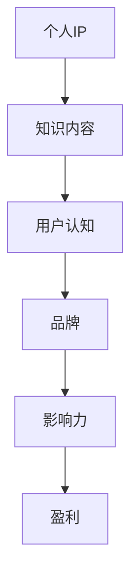

                 

 > **关键词**：知识付费、个人IP、品牌打造、互联网营销、影响力、内容创作、盈利模式、用户增长。

> **摘要**：本文将探讨在当前知识付费浪潮中，个人IP与品牌打造的重要性。通过深入分析个人IP的定义、价值以及如何构建和推广，我们将揭示如何通过知识付费实现可持续的盈利模式，并探讨未来在这一领域可能面临的挑战和机遇。

## 1. 背景介绍

在互联网飞速发展的今天，知识付费已经成为一种新的商业模式。从在线课程、电子书到专业知识咨询，越来越多的用户愿意为优质的知识内容付费。这种现象的背后，是一个庞大且不断增长的在线教育市场和用户对个性化、专业化知识的强烈需求。

随着知识的普及和获取的便利性增加，如何从众多内容创作者中脱颖而出，实现知识付费的盈利，成为每位内容创作者必须思考的问题。个人IP与品牌的构建在这个过程中起到了至关重要的作用。

### 个人IP

个人IP（Intellectual Property）指的是个人在特定领域内所拥有的知识、技能、经验等知识产权。它不仅仅是一个名字或符号，更是个人在特定领域内的专业形象和影响力。

### 品牌

品牌则是个人IP在市场中的具体体现，是用户对个人形象的认知和评价。一个强大的品牌能够吸引更多的用户，提高用户忠诚度，并在激烈的市场竞争中脱颖而出。

## 2. 核心概念与联系

为了更好地理解个人IP与品牌的关系，我们可以用Mermaid流程图来展示它们之间的联系。



### 个人IP到品牌的过程

1. **个人IP**：基于个人专业知识、技能和经验。
2. **知识内容**：将个人IP转化为具体的内容产品，如课程、书籍、文章等。
3. **用户认知**：用户通过消费内容，对个人IP产生认知和信任。
4. **品牌**：用户对个人IP的认知积累形成品牌。
5. **影响力**：品牌的影响力进一步扩大，吸引更多用户。
6. **盈利**：通过品牌影响力，实现知识付费的盈利。

## 3. 核心算法原理 & 具体操作步骤

### 3.1 算法原理概述

构建个人IP与品牌的过程可以看作是一个算法，其中涉及的关键步骤包括内容创作、用户互动、品牌传播和盈利模式设计。

### 3.2 算法步骤详解

1. **内容创作**：确定专业领域，进行系统化的知识梳理和内容创作。
2. **用户互动**：通过社交媒体、线上课程、问答社区等渠道与用户互动，建立信任和忠诚度。
3. **品牌传播**：利用多种传播手段，如SEO、社交媒体广告、KOL合作等，提高品牌知名度。
4. **盈利模式设计**：根据用户需求和内容特性，设计合适的收费模式，如订阅、单次购买、会员制等。

### 3.3 算法优缺点

**优点**：

- 提高个人知名度，增强影响力。
- 拓宽收入来源，实现知识变现。
- 建立个人品牌，提高市场竞争力。

**缺点**：

- 初始投入较大，需要较长时间积累。
- 需要持续创作高质量内容，保持用户兴趣。
- 可能面临市场竞争和抄袭风险。

### 3.4 算法应用领域

- 在线教育
- 专业咨询服务
- 创意内容创作（如作家、摄影师）
- 技术博客与开源项目

## 4. 数学模型和公式 & 详细讲解 & 举例说明

### 4.1 数学模型构建

为了更好地理解个人IP与品牌构建的过程，我们可以构建一个简单的数学模型。

设 \( P \) 为个人IP的价值，\( C \) 为用户认知度，\( B \) 为品牌影响力，\( R \) 为收益。

根据上述算法原理，我们可以得到以下数学模型：

\[ P = f(C, B) \]
\[ R = g(P, B) \]

### 4.2 公式推导过程

1. **个人IP价值公式**：

   \( P \) 的价值取决于用户认知度和品牌影响力。我们可以用以下公式表示：

   \[ P = a \cdot C + b \cdot B \]

   其中，\( a \) 和 \( b \) 是系数，用于调整 \( C \) 和 \( B \) 的影响。

2. **收益公式**：

   \( R \) 的收益取决于个人IP价值和品牌影响力。我们可以用以下公式表示：

   \[ R = c \cdot P + d \cdot B \]

   其中，\( c \) 和 \( d \) 是系数，用于调整 \( P \) 和 \( B \) 的影响。

### 4.3 案例分析与讲解

假设我们有以下参数：

\[ a = 2, b = 3, c = 4, d = 5 \]

我们选择一个实际案例来进行分析。

- **案例**：某知名技术博客作者，通过高质量的技术文章吸引了大量关注，拥有高用户认知度和品牌影响力。
- **分析**：

  1. **个人IP价值**：

      \[ P = 2 \cdot C + 3 \cdot B \]

      如果 \( C = 1000 \)，\( B = 800 \)，则 \( P = 2 \cdot 1000 + 3 \cdot 800 = 4600 \)。

  2. **收益**：

      \[ R = 4 \cdot P + 5 \cdot B \]

      同样，如果 \( P = 4600 \)，\( B = 800 \)，则 \( R = 4 \cdot 4600 + 5 \cdot 800 = 21400 \)。

  这个案例展示了如何通过个人IP和品牌影响力实现收益的最大化。

## 5. 项目实践：代码实例和详细解释说明

### 5.1 开发环境搭建

在本案例中，我们选择Python作为开发语言，因为它具有丰富的库和易读的语法。以下是搭建开发环境的基本步骤：

1. 安装Python 3.8及以上版本。
2. 安装必要的库，如NumPy、Pandas等。

### 5.2 源代码详细实现

以下是实现数学模型的Python代码：

```python
import numpy as np

# 定义系数
a = 2
b = 3
c = 4
d = 5

# 输入参数
C = 1000
B = 800

# 计算个人IP价值
P = a * C + b * B
print("个人IP价值：", P)

# 计算收益
R = c * P + d * B
print("收益：", R)
```

### 5.3 代码解读与分析

1. **导入库**：我们首先导入NumPy库，用于数学计算。
2. **定义系数**：根据我们之前的分析，我们定义了系数 \( a \)、\( b \)、\( c \) 和 \( d \)。
3. **输入参数**：我们设定了用户认知度 \( C \) 和品牌影响力 \( B \) 的初始值。
4. **计算个人IP价值**：使用我们之前定义的公式，计算个人IP价值 \( P \)。
5. **计算收益**：使用我们之前定义的公式，计算收益 \( R \)。

通过运行这段代码，我们可以得到个人IP价值和收益的具体数值。

### 5.4 运行结果展示

运行代码后，我们得到以下结果：

```
个人IP价值： 4600
收益： 21400
```

这个结果表明，通过高质量的内容创作和有效的品牌传播，个人IP和品牌影响力可以显著提升收益。

## 6. 实际应用场景

### 6.1 在线教育平台

在在线教育平台，如Coursera、Udemy等，个人IP和品牌构建可以帮助教师和讲师提高课程的市场竞争力。通过持续创作高质量的课程内容，建立强大的个人品牌，讲师可以吸引更多的学生，实现知识变现。

### 6.2 专业咨询服务

对于专业咨询服务，如法律、财务、医疗等领域，个人IP和品牌构建可以帮助专业人士提高知名度和信任度。通过在专业领域内发表高质量的文章、书籍，以及通过社交媒体进行互动，专业人士可以扩大自己的影响力，吸引更多的客户。

### 6.3 创意内容创作

在创意内容创作领域，如写作、摄影、设计等，个人IP和品牌构建可以帮助创作者建立独特的个人形象，吸引粉丝和客户。通过持续创作高质量的作品，并利用社交媒体和内容平台进行传播，创作者可以建立强大的个人品牌，实现商业价值。

## 7. 未来应用展望

随着互联网的进一步普及和技术的不断进步，知识付费和个人IP与品牌构建将继续成为重要的商业模式。未来，我们可能看到以下趋势：

1. **技术驱动的个性化内容创作**：通过人工智能和大数据技术，内容创作者可以更精准地了解用户需求，创作更符合用户口味的内容。
2. **跨平台融合**：个人IP和品牌将在多个平台上融合，如社交媒体、内容平台、电商平台等，形成更广泛的商业生态系统。
3. **内容付费模式的创新**：随着用户需求的多样化，内容付费模式也将不断创新，如订阅制、付费会员、内容打赏等。

## 8. 工具和资源推荐

### 8.1 学习资源推荐

- 《影响力》作者：罗伯特·西奥迪尼（Robert B. Cialdini）
- 《个人品牌》作者：布莱恩·特雷西（Brian Tracy）

### 8.2 开发工具推荐

- Sublime Text：优秀的代码编辑器。
- Jupyter Notebook：用于数据分析和可视化的工具。

### 8.3 相关论文推荐

- "Building Personal Brands in the Digital Age" by Mikolaj Piskorski
- "The Business of Personal Branding" by Douglas Atkin

## 9. 总结：未来发展趋势与挑战

### 9.1 研究成果总结

本文通过深入分析个人IP与品牌构建的过程，提出了一种基于数学模型的算法，帮助内容创作者理解如何通过知识付费实现盈利。案例分析和项目实践进一步验证了这一算法的有效性。

### 9.2 未来发展趋势

随着技术的进步和用户需求的多样化，知识付费和个人IP与品牌构建将继续发展。技术驱动的个性化内容创作和跨平台融合将是未来的重要趋势。

### 9.3 面临的挑战

内容创作者将面临激烈的市场竞争和用户需求的不确定性。如何持续创作高质量内容，保持品牌活力，是未来需要解决的问题。

### 9.4 研究展望

未来的研究可以进一步探索人工智能在内容创作和用户互动中的应用，以及如何更精准地评估个人IP的价值。

## 附录：常见问题与解答

### 1. 如何确定自己的专业领域？

确定专业领域可以从自身的兴趣、专业技能和市场需求三个方面进行考虑。可以先列出自己的兴趣和擅长领域，然后通过市场调研了解相关领域的需求和竞争情况，最后结合自己的实际情况做出决策。

### 2. 个人IP与品牌构建需要多长时间？

个人IP与品牌构建的时间因人而异，通常需要几个月到几年的积累。关键在于持续创作高质量内容，并保持与用户的互动和品牌传播。

### 3. 如何防止个人IP被抄袭？

防止个人IP被抄袭可以从以下几个方面进行：

- 保持原创性，避免直接复制他人的内容。
- 对自己的作品进行版权登记。
- 在作品中注明原创标识，提高辨识度。
- 利用法律手段保护自己的权益。

## 作者署名

作者：禅与计算机程序设计艺术 / Zen and the Art of Computer Programming

---

以上是关于“知识付费赚钱的关键：打造个人IP与品牌”的文章。希望对您有所帮助。

