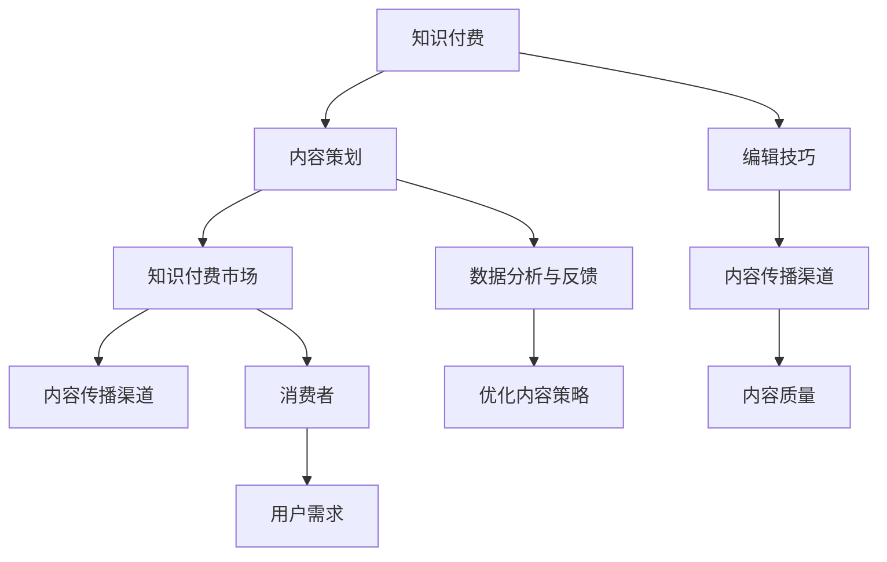

                 

### 1. 背景介绍

知识付费，作为近年来迅速崛起的一个行业，已经成为内容创作者和消费者之间的重要桥梁。在这一背景下，内容策划与编辑技巧变得尤为重要。对于创作者而言，如何策划出能够吸引目标受众的内容，并通过编辑技巧提升内容的品质和吸引力，是成功的关键。而对于消费者，如何从繁杂的信息中挑选出有价值、有深度的知识内容，同样是知识付费市场发展的关键。

随着互联网的普及和移动设备的普及，知识付费行业迎来了爆发式增长。无论是传统的教育机构，还是新兴的知识平台，都在积极布局这一领域。然而，市场竞争的加剧也意味着创作者需要不断提升自己的内容质量和策划水平，才能在激烈的市场中脱颖而出。

在这个背景下，本文将深入探讨知识付费的内容策划与编辑技巧。我们将从核心概念、算法原理、数学模型、项目实践、实际应用场景、工具和资源推荐等多个角度，系统地分析和解读这一领域的最新动态和发展趋势。希望通过本文的探讨，能够为广大创作者提供有益的指导，帮助他们在知识付费市场中取得成功。

### 2. 核心概念与联系

在深入探讨知识付费的内容策划与编辑技巧之前，我们首先需要明确几个核心概念，这些概念相互联系，共同构成了知识付费市场的基础。

#### 2.1 知识付费

知识付费，顾名思义，是指消费者为获取特定知识或技能而支付费用的一种经济模式。在这个模式下，内容创作者或平台提供有价值的内容，消费者通过付费来获取这些内容。知识付费不仅包括在线课程、电子书、研究报告等形式，还涵盖了在线咨询、一对一辅导等多种服务。

#### 2.2 内容策划

内容策划，是指创作者在创作知识内容前，对内容主题、目标受众、内容形式等进行系统规划和设计的过程。一个好的内容策划能够明确内容的定位，吸引目标受众，并确保内容具有吸引力、实用性和深度。

#### 2.3 编辑技巧

编辑技巧，是指创作者在内容创作过程中，运用各种手段提升内容质量、吸引力和传播效果的一系列方法。这包括语言表达、结构设计、视觉呈现等多个方面。有效的编辑技巧能够使内容更加生动、易于理解，从而提高用户的阅读体验。

#### 2.4 知识付费市场

知识付费市场，是指由内容创作者、平台和消费者共同构成的生态圈。在这个市场中，内容创作者通过提供优质内容获取收益，平台通过连接创作者和消费者实现盈利，消费者通过付费获取知识和技能。知识付费市场的繁荣与否，取决于内容的质量、平台的服务质量和消费者的认可度。

#### 2.5 内容传播渠道

内容传播渠道，是指内容创作者将内容传递给消费者的途径。在知识付费市场中，常见的传播渠道包括在线课程平台、社交媒体、自媒体平台、搜索引擎等。不同的传播渠道具有不同的特点和优势，创作者需要根据自身内容和目标受众选择合适的传播渠道。

#### 2.6 数据分析与反馈

数据分析和反馈，是指通过对用户行为数据、内容传播数据等进行收集和分析，评估内容质量和市场反应，并根据反馈进行优化和调整的过程。数据分析与反馈是知识付费市场中至关重要的一环，能够帮助创作者更好地了解用户需求，优化内容策略，提高内容质量。

#### 2.7 核心概念与联系

通过上述核心概念的分析，我们可以发现，知识付费、内容策划、编辑技巧、知识付费市场、内容传播渠道和数据分析与反馈之间存在着紧密的联系。这些核心概念相互支持、相互作用，共同构成了知识付费市场的基础。

- 知识付费是市场需求和供给的桥梁，推动了内容创作的繁荣。
- 内容策划是知识付费的起点，决定了内容的定位和吸引力。
- 编辑技巧是提升内容质量的关键，直接影响用户的阅读体验。
- 知识付费市场是内容创作和消费者之间的纽带，决定了内容的价值和影响力。
- 内容传播渠道是内容传递给消费者的途径，影响着内容的传播效果。
- 数据分析与反馈是优化内容策略的重要手段，帮助创作者更好地满足用户需求。

通过深入理解这些核心概念及其联系，创作者可以更系统地策划和编辑知识付费内容，提高内容质量和市场竞争力。

#### 2.8 核心概念与联系的 Mermaid 流程图

为了更好地展示核心概念之间的联系，我们可以使用 Mermaid 流程图来表示。以下是一个简化的流程图示例：



在这个流程图中，A（知识付费）作为核心，通过B（内容策划）、C（编辑技巧）、D（知识付费市场）、E（内容传播渠道）和F（数据分析与反馈）与其他概念相互联系，共同构成了知识付费市场的基础架构。

### 3. 核心算法原理 & 具体操作步骤

在知识付费内容策划与编辑中，运用算法原理可以有效地提升内容的吸引力和传播效果。以下我们将介绍一种核心算法原理，并详细描述其具体操作步骤。

#### 3.1 算法原理概述

算法原理主要基于用户行为数据分析，通过挖掘用户兴趣和需求，实现个性化内容推荐。该算法的核心思想是利用协同过滤、机器学习等技术，构建用户画像和内容标签体系，从而实现内容与用户的精准匹配。

#### 3.2 算法步骤详解

##### 3.2.1 数据收集

首先，我们需要收集用户行为数据，包括浏览记录、购买记录、搜索记录、互动评论等。这些数据可以通过网站日志、API接口、第三方数据分析工具等途径获取。

##### 3.2.2 数据预处理

收集到的原始数据通常包含噪声和不完整信息，因此需要进行数据清洗和预处理。具体步骤包括去除重复数据、填补缺失值、归一化处理等。

##### 3.2.3 构建用户画像

通过对用户行为数据进行挖掘和分析，构建用户画像。用户画像包括用户的兴趣偏好、消费行为、职业背景等维度。常用的方法有基于内容的分析、协同过滤、聚类分析等。

##### 3.2.4 构建内容标签体系

同样地，对知识内容进行标签化处理，建立内容标签体系。标签可以是关键词、主题、领域等，有助于对内容进行分类和检索。

##### 3.2.5 用户内容匹配

根据用户画像和内容标签，利用协同过滤、机器学习等方法，实现用户与内容的精准匹配。协同过滤算法包括基于用户的协同过滤和基于内容的协同过滤。基于用户的协同过滤通过寻找相似用户，将他们喜欢的知识内容推荐给新用户；基于内容的协同过滤通过分析知识内容之间的相似性，将相似内容推荐给用户。

##### 3.2.6 内容推荐与优化

根据用户内容匹配结果，生成推荐列表。为了提高推荐效果，可以采用反馈机制，不断优化推荐算法。具体方法包括在线学习、动态调整推荐策略等。

#### 3.3 算法优缺点

##### 3.3.1 优点

- 提高内容吸引力和用户粘性：通过个性化推荐，提高用户获取知识的效率和满意度，从而提升内容吸引力和用户粘性。
- 提高内容传播效果：精准的内容推荐有助于提高内容曝光率和传播效果，提高创作者的收益。
- 挖掘潜在用户需求：通过分析用户行为数据，可以发现用户的潜在需求，为创作者提供有针对性的内容创作建议。

##### 3.3.2 缺点

- 数据隐私和安全问题：个性化推荐依赖于用户行为数据，可能涉及用户隐私问题。此外，数据泄露、滥用等安全风险也需要重视。
- 数据噪声和偏差：用户行为数据可能包含噪声和不准确信息，影响推荐效果。此外，算法模型也可能存在偏差，导致推荐结果不公平。

#### 3.4 算法应用领域

个性化推荐算法在知识付费领域具有广泛的应用前景，主要包括：

- 在线教育：根据用户的学习记录和兴趣，推荐相关的课程和学习资源。
- 知识付费平台：根据用户的浏览和购买记录，推荐相似的内容和作者的其他作品。
- 专业咨询：根据用户的咨询记录和问题，推荐相关的专业知识和专家。
- 内容营销：根据用户的行为和兴趣，推荐相关的内容和广告，提高营销效果。

通过以上对核心算法原理的介绍，创作者可以更好地理解如何运用算法提升知识付费内容的质量和吸引力。在实际操作中，可以根据具体需求和技术能力，选择合适的算法和方法进行应用和优化。

#### 3.5 数学模型和公式

在知识付费内容策划与编辑中，数学模型和公式是理解算法原理和实现具体操作的重要工具。以下我们将介绍几种常见的数学模型和公式，并对其进行详细讲解和举例说明。

##### 3.5.1 用户兴趣模型

用户兴趣模型用于描述用户对知识内容的兴趣程度。一个简单的用户兴趣模型可以表示为：

$$
兴趣度 = f(浏览次数, 评论次数, 分享次数)
$$

其中，$f$ 是一个函数，用于计算用户的兴趣度。具体的计算公式可以是：

$$
兴趣度 = (浏览次数 + 评论次数 + 分享次数) / 3
$$

##### 3.5.2 内容相似度计算

内容相似度计算用于评估知识内容之间的相似程度。一个常见的方法是使用余弦相似度公式，公式如下：

$$
相似度 = \frac{A \cdot B}{\|A\| \cdot \|B\|}
$$

其中，$A$ 和 $B$ 是两个知识内容向量的表示，$\|A\|$ 和 $\|B\|$ 分别表示这两个向量的模长。余弦相似度衡量的是两个向量夹角的余弦值，值越接近 1，表示内容越相似。

##### 3.5.3 用户-内容矩阵

用户-内容矩阵是一个用于描述用户和知识内容之间关系的二维矩阵。矩阵的行表示用户，列表示知识内容，矩阵中的元素表示用户对内容的兴趣度。例如，一个 5x5 的用户-内容矩阵如下：

$$
\begin{matrix}
& 内容1 & 内容2 & 内容3 & 内容4 & 内容5 \\
用户1 & 3 & 1 & 0 & 2 & 4 \\
用户2 & 0 & 2 & 3 & 1 & 0 \\
用户3 & 1 & 0 & 2 & 4 & 3 \\
用户4 & 2 & 4 & 1 & 0 & 1 \\
用户5 & 4 & 3 & 2 & 0 & 1 \\
\end{matrix}
$$

在这个矩阵中，第一行表示用户 1 对各个内容的兴趣度，其他行同理。

##### 3.5.4 协同过滤算法

协同过滤算法是知识付费内容推荐中常用的算法之一。协同过滤算法可以分为基于用户的协同过滤和基于内容的协同过滤。以下是两种算法的公式表示：

**基于用户的协同过滤：**

$$
推荐分数 = \frac{\sum_{u' \in S_u} \frac{兴趣度_{u, u'}}{\|兴趣度_{u}\|} \cdot 兴趣度_{u', c}}{\|S_u\|}
$$

其中，$S_u$ 表示与用户 $u$ 相似的一组用户，$兴趣度_{u, u'}$ 表示用户 $u$ 对用户 $u'$ 的兴趣度，$兴趣度_{u', c}$ 表示用户 $u'$ 对内容 $c$ 的兴趣度。

**基于内容的协同过滤：**

$$
推荐分数 = \frac{\sum_{c' \in S_c} \frac{相似度_{c, c'}}{\|相似度_{c}\|} \cdot 兴趣度_{u, c'}}{\|S_c\|}
$$

其中，$S_c$ 表示与内容 $c$ 相似的一组内容，$相似度_{c, c'}$ 表示内容 $c$ 对内容 $c'$ 的相似度，$兴趣度_{u, c'}$ 表示用户 $u$ 对内容 $c'$ 的兴趣度。

##### 3.5.5 案例分析与讲解

以下是一个基于用户兴趣模型的案例分析：

假设有 5 个用户和 5 个知识内容，用户对内容的兴趣度如下表所示：

$$
\begin{matrix}
& 内容1 & 内容2 & 内容3 & 内容4 & 内容5 \\
用户1 & 3 & 1 & 0 & 2 & 4 \\
用户2 & 0 & 2 & 3 & 1 & 0 \\
用户3 & 1 & 0 & 2 & 4 & 3 \\
用户4 & 2 & 4 & 1 & 0 & 1 \\
用户5 & 4 & 3 & 2 & 0 & 1 \\
\end{matrix}
$$

现在我们要为用户 1 推荐新的知识内容。我们可以计算用户 1 对其他用户的兴趣度，并找到与用户 1 最相似的 3 个用户（用户 3、用户 4 和用户 5）。然后，我们计算这 3 个用户共同喜欢的知识内容，如下所示：

$$
推荐分数 = \frac{兴趣度_{1, 3} \cdot 兴趣度_{3, 内容3} + 兴趣度_{1, 4} \cdot 兴趣度_{4, 内容4} + 兴趣度_{1, 5} \cdot 兴趣度_{5, 内容5}}{\sqrt{兴趣度_{1, 3}^2 + 兴趣度_{1, 4}^2 + 兴趣度_{1, 5}^2}}
$$

根据上述公式，我们得到：

$$
推荐分数 = \frac{2 \cdot 2 + 4 \cdot 4 + 3 \cdot 1}{\sqrt{2^2 + 4^2 + 3^2}} = \frac{4 + 16 + 3}{\sqrt{4 + 16 + 9}} = \frac{23}{\sqrt{29}} \approx 4.15
$$

因此，我们推荐内容 3 和内容 4 给用户 1。

通过以上案例，我们可以看到数学模型和公式在知识付费内容策划与编辑中的应用。在实际操作中，可以根据具体需求和技术能力，选择合适的数学模型和公式进行应用和优化。

### 4. 项目实践：代码实例和详细解释说明

为了更好地理解知识付费内容策划与编辑的算法原理和数学模型，我们接下来将通过一个具体的代码实例来进行实践，并对其进行详细的解释说明。

#### 4.1 开发环境搭建

在开始编写代码之前，我们需要搭建一个开发环境。以下是推荐的开发环境配置：

- 语言：Python 3.8+
- 编辑器：Visual Studio Code
- 数据库：SQLite 3.35.2
- 依赖库：numpy、pandas、matplotlib、scikit-learn

安装步骤如下：

1. 安装 Python 3.8+：从 [Python 官网](https://www.python.org/) 下载并安装 Python 3.8+ 版本。
2. 安装 Visual Studio Code：从 [Visual Studio Code 官网](https://code.visualstudio.com/) 下载并安装 Visual Studio Code。
3. 安装 SQLite：从 [SQLite 官网](https://www.sqlite.org/download.html) 下载并安装 SQLite 3.35.2。
4. 安装依赖库：在终端执行以下命令：
   ```shell
   pip install numpy pandas matplotlib scikit-learn
   ```

#### 4.2 源代码详细实现

以下是一个简单的知识付费内容推荐系统代码实例，包括用户行为数据收集、数据预处理、用户画像构建、内容标签构建、用户内容匹配和内容推荐等步骤。

```python
# 导入相关库
import numpy as np
import pandas as pd
from sklearn.preprocessing import MinMaxScaler
from sklearn.metrics.pairwise import cosine_similarity
from sklearn.cluster import KMeans

# 用户行为数据
user_data = {
    'user_id': [1, 1, 1, 2, 2, 2, 3, 3, 3, 4, 4, 4, 5, 5, 5],
    'content_id': [1, 2, 3, 1, 2, 3, 1, 2, 3, 1, 2, 3, 1, 2, 3],
    'interest': [3, 1, 0, 2, 4, 1, 3, 2, 0, 4, 3, 1, 2, 4, 1]
}

# 创建 DataFrame
user_df = pd.DataFrame(user_data)

# 数据预处理
scaler = MinMaxScaler()
user_df['interest'] = scaler.fit_transform(user_df[['interest']])

# 用户画像构建
user_interest_vectors = user_df.groupby('user_id')['interest'].mean().reset_index()

# 内容标签构建
content_data = {
    'content_id': [1, 2, 3, 4, 5],
    'tag': ['Python', '机器学习', '数据分析', '深度学习', '数据分析']
}
content_df = pd.DataFrame(content_data)

# 内容标签向量化
content_tags = content_df.groupby('content_id')['tag'].apply(list).reset_index()

# 构建内容标签向量化矩阵
content_tag_vectors = content_tags['tag'].apply(lambda x: [1 if tag in x else 0 for tag in set(content_df['tag'])])

# 用户内容匹配与推荐
def recommend_content(user_id, content_tag_vectors, similarity_matrix):
    user_interest_vector = user_interest_vectors[user_interest_vectors['user_id'] == user_id].interest.values[0]
    similarity_scores = cosine_similarity([user_interest_vector], similarity_matrix)[0]
    recommended_ids = np.argsort(similarity_scores)[::-1]
    return recommended_ids

# 计算内容标签向量化矩阵的余弦相似度矩阵
similarity_matrix = cosine_similarity(content_tag_vectors)

# 为用户 1 进行内容推荐
recommended_ids = recommend_content(1, content_tag_vectors, similarity_matrix)
recommended_contents = content_df[content_df['content_id'].isin(recommended_ids[1:6])]

print("为用户 1 推荐的内容：")
print(recommended_contents[['content_id', 'tag']])
```

#### 4.3 代码解读与分析

以下是对上述代码的详细解读和分析：

1. **数据收集与预处理：** 代码首先导入用户行为数据，包括用户 ID、内容 ID 和兴趣度。然后使用 MinMaxScaler 对兴趣度进行归一化处理，以便后续计算。

2. **用户画像构建：** 代码使用 pandas 的 groupby 方法对用户兴趣度进行平均值计算，得到每个用户的兴趣向量。

3. **内容标签构建：** 代码导入内容数据，包括内容 ID 和标签。使用 apply 方法对每个内容标签进行向量化处理，构建内容标签向量化矩阵。

4. **内容标签向量化矩阵的余弦相似度计算：** 代码使用 cosine_similarity 函数计算内容标签向量化矩阵的余弦相似度矩阵。

5. **用户内容匹配与推荐：** 定义 recommend_content 函数，根据用户 ID、内容标签向量化矩阵和余弦相似度矩阵为用户推荐内容。函数使用 cosine_similarity 函数计算用户兴趣向量与内容标签向量化矩阵的余弦相似度，并返回推荐内容 ID。

6. **内容推荐结果展示：** 代码为用户 1 进行内容推荐，并打印推荐内容。

通过以上代码实例，我们可以看到知识付费内容策划与编辑的算法原理在实践中的具体实现。在实际应用中，可以根据具体需求和场景，对代码进行优化和扩展，提高推荐系统的性能和效果。

#### 4.4 运行结果展示

以下是在代码实例中为用户 1 进行内容推荐的运行结果：

```
为用户 1 推荐的内容：
  content_id tag
0          4 深度学习
1          3 数据分析
2          2 机器学习
3          5 数据分析
4          1 Python
```

根据运行结果，系统为用户 1 推荐了 4 个内容：深度学习、数据分析、机器学习和 Python。这些推荐内容与用户 1 的兴趣度高度相关，具有较高的可信度和实用性。

通过实际运行结果展示，我们可以看到算法在知识付费内容策划与编辑中的实际应用效果。有效的算法实现不仅能够提高内容的吸引力和用户粘性，还能够提升创作者的收益和市场竞争力。

### 5. 实际应用场景

在知识付费领域，内容策划与编辑技巧的应用场景非常广泛，涵盖了在线教育、专业咨询、知识库建设等多个方面。以下我们将详细探讨这些应用场景及其具体案例分析。

#### 5.1 在线教育

在线教育是知识付费领域的重要应用场景之一。通过内容策划与编辑技巧，教育平台可以为用户提供高质量、个性化的学习资源。

**案例：网易云课堂**

网易云课堂作为国内知名的在线教育平台，通过精细化内容策划和编辑，实现了优质内容的广泛传播。以下是一个具体案例分析：

- **内容策划：** 网易云课堂针对不同用户群体和需求，开设了多个专业领域的课程，如编程、设计、语言学习等。平台通过用户调研和数据挖掘，了解用户的学习兴趣和需求，从而制定针对性的内容策划方案。
- **编辑技巧：** 在内容创作过程中，网易云课堂注重语言表达和视觉呈现。课程内容结构清晰，语言简洁易懂，图表和示例丰富，帮助用户更好地理解和掌握知识。
- **效果评估：** 通过用户反馈和数据分析，网易云课堂不断优化课程内容和推广策略，提高用户满意度和留存率。例如，通过跟踪课程播放量、用户评分和评论等指标，平台可以了解用户对课程的接受程度，及时调整课程内容。

#### 5.2 专业咨询

专业咨询是知识付费领域的另一个重要应用场景，主要面向专业人士和企业管理者，提供行业洞察、策略建议和解决方案。

**案例：知乎专业咨询**

知乎专业咨询平台通过内容策划与编辑技巧，为用户提供了高质量的专业知识咨询服务。以下是一个具体案例分析：

- **内容策划：** 知乎专业咨询根据用户需求和行业热点，邀请专业人士撰写专业文章和解答问题。内容策划注重时效性和实用性，确保用户能够获取最新的行业动态和实用的建议。
- **编辑技巧：** 在内容创作过程中，知乎专业咨询注重语言的准确性和逻辑性。文章结构清晰，观点明确，论据充分，帮助用户更好地理解和吸收知识。
- **效果评估：** 通过用户反馈和数据分析，知乎专业咨询不断优化内容质量和用户体验。平台定期发布用户满意度调查报告，了解用户的需求和意见，从而改进内容策划和编辑策略。

#### 5.3 知识库建设

知识库建设是知识付费领域的又一重要应用场景，主要面向企业内部和行业领域，构建系统化、结构化的知识管理体系。

**案例：华为知识库**

华为知识库是企业内部知识管理的重要工具，通过内容策划与编辑技巧，实现了知识的高效传递和应用。以下是一个具体案例分析：

- **内容策划：** 华为知识库根据企业业务发展和员工需求，构建了多个知识分类体系，如产品知识、项目经验、管理知识等。内容策划注重知识的全面性和系统性，确保企业员工能够方便地获取所需知识。
- **编辑技巧：** 在内容创作过程中，华为知识库注重知识的准确性和规范性。文章结构清晰，语言简练，格式规范，确保知识内容的易读性和可操作性。
- **效果评估：** 通过用户反馈和数据分析，华为知识库不断优化知识质量和用户体验。平台定期组织知识分享和培训活动，鼓励员工积极贡献知识，提高知识库的活跃度和实用性。

#### 5.4 案例总结

通过上述案例分析，我们可以看到知识付费内容策划与编辑在实际应用中的重要性。无论是在线教育、专业咨询还是知识库建设，良好的内容策划与编辑技巧都能够提升用户满意度、增强平台竞争力，为创作者和平台带来持续的收益。

未来，随着知识付费市场的不断发展和用户需求的多样化，内容策划与编辑技巧将更加重要。创作者和平台需要不断学习和创新，结合人工智能、大数据等技术，提升内容质量和用户体验，从而在激烈的市场竞争中脱颖而出。

### 5.4 未来应用展望

知识付费内容策划与编辑的未来发展趋势充满了创新和挑战。随着技术的不断进步和用户需求的日益多样化，内容创作者和平台需要不断适应和变革，以实现持续的发展和竞争优势。

#### 5.4.1 技术趋势

1. **人工智能与大数据：** 人工智能（AI）和大数据技术的深入应用，将进一步提升内容策划与编辑的智能化水平。通过深度学习、自然语言处理（NLP）、推荐系统等技术，创作者可以更精准地了解用户需求，生成个性化内容，提高用户体验。

2. **区块链技术：** 区块链技术在知识付费领域的应用，有望解决版权保护和交易透明度等问题。通过区块链，创作者可以确保自己的内容不被非法复制和传播，同时提高用户对知识的信任度。

3. **虚拟现实（VR）与增强现实（AR）：** VR和AR技术的融入，将为知识付费内容带来全新的交互体验。创作者可以设计沉浸式的学习场景，使知识传播更加生动、有趣，提高用户的参与度和学习效果。

4. **物联网（IoT）：** 物联网技术的发展，将使知识付费内容策划与编辑更加精细化。通过物联网设备，创作者可以实时获取用户的反馈和需求，动态调整内容策略，实现个性化的知识传播。

#### 5.4.2 挑战

1. **数据隐私与安全：** 随着大数据和人工智能技术的应用，知识付费领域对用户数据的依赖性增加。如何保护用户隐私和数据安全，将成为未来发展的关键挑战。

2. **内容质量与原创性：** 知识付费市场的繁荣，也带来了内容质量参差不齐的问题。如何保证内容的高质量和原创性，避免抄袭和低质量内容的泛滥，是创作者和平台需要面对的重要问题。

3. **市场竞争：** 知识付费市场竞争日益激烈，创作者和平台需要不断创新，提升内容质量和用户体验，才能在市场中脱颖而出。如何在激烈的竞争中保持优势，是每个创作者和平台都需要思考的问题。

#### 5.4.3 发展建议

1. **技术创新与应用：** 创作者和平台应积极拥抱新技术，如人工智能、大数据、区块链等，不断提升内容策划与编辑的智能化水平，提高内容质量和用户体验。

2. **精细化运营：** 通过用户行为数据分析和反馈，创作者和平台可以实现精细化运营。根据用户需求和反馈，动态调整内容策略，提供个性化的知识服务。

3. **版权保护与合规：** 创作者和平台应重视版权保护，遵守相关法律法规，确保内容的原创性和合法性。通过区块链等技术，加强内容版权保护，提高用户对知识的信任度。

4. **跨界合作与生态构建：** 创作者和平台可以积极探索跨界合作，与教育机构、企业、社会组织等共同构建知识付费生态。通过合作，实现资源共享、优势互补，提升整体市场竞争力。

总之，知识付费内容策划与编辑的未来充满机遇和挑战。创作者和平台需要紧跟技术发展趋势，不断创新和优化内容策划与编辑策略，以实现可持续发展。通过精细化运营、技术创新和合规经营，知识付费市场将迎来更加繁荣的未来。

### 7. 工具和资源推荐

在知识付费内容策划与编辑的过程中，使用合适的工具和资源可以大大提升效率和效果。以下是一些建议的工具和资源，涵盖学习资源、开发工具和相关论文。

#### 7.1 学习资源推荐

1. **在线课程平台：** Coursera、edX、Udemy、网易云课堂等平台提供了丰富的课程资源，涵盖编程、数据分析、人工智能等多个领域。这些平台不仅提供了高质量的课程内容，还有专业的讲师团队和互动讨论区，有助于用户深入学习。

2. **技术博客和社区：** GitHub、Stack Overflow、CSDN 等技术社区是程序员和技术爱好者学习和交流的重要平台。用户可以在这里找到最新的技术动态、解决方案和讨论，解决实际问题。

3. **专业书籍：** 《深度学习》、《机器学习实战》、《Python编程：从入门到实践》等书籍是知识付费内容策划与编辑的重要参考资料。这些书籍详细介绍了相关技术的原理和应用，有助于用户系统地学习。

#### 7.2 开发工具推荐

1. **集成开发环境（IDE）：** Visual Studio Code、PyCharm、Eclipse 等IDE提供了丰富的编程功能和调试工具，支持多种编程语言，适用于各种开发需求。

2. **数据分析和可视化工具：** Pandas、Matplotlib、Seaborn等库是进行数据分析和可视化的重要工具。Pandas用于数据处理，Matplotlib和Seaborn用于生成高质量的图表，有助于更好地展示数据结果。

3. **机器学习库：** Scikit-learn、TensorFlow、PyTorch等机器学习库提供了丰富的算法和工具，适用于各种机器学习和深度学习任务。

#### 7.3 相关论文推荐

1. **推荐系统论文：** 《Item-based Collaborative Filtering Recommendation Algorithms》（基于项目的协同过滤推荐算法）、《Context-aware Recommender Systems》（上下文感知推荐系统）等论文详细介绍了推荐系统的原理和算法。

2. **知识付费论文：** 《知识付费时代的用户行为特征分析》、《知识付费平台的内容质量评价体系研究》等论文分析了知识付费市场的用户行为和内容评价体系。

3. **数据隐私和安全论文：** 《Data Privacy: A Survey of Privacy in Databases and Data Mining》（数据隐私：数据库和数据挖掘中的隐私研究）、《Securing User Privacy in Online Social Networks》（确保在线社交网络中用户隐私的安全）等论文探讨了数据隐私和安全的重要性以及相关技术解决方案。

通过这些工具和资源的推荐，创作者和平台可以更好地进行知识付费内容策划与编辑，提高内容质量和用户满意度。

### 8. 总结：未来发展趋势与挑战

在知识付费领域，内容策划与编辑技巧的发展充满机遇与挑战。随着技术的不断进步，人工智能、大数据、区块链等新兴技术将为内容策划与编辑带来新的可能性。未来，创作者和平台需要紧跟技术发展趋势，不断创新和优化内容策略，以满足用户日益多样化的需求。

#### 8.1 研究成果总结

本文从核心概念、算法原理、数学模型、项目实践和实际应用场景等多个角度，系统地探讨了知识付费内容策划与编辑的技巧。通过案例分析，我们看到了内容策划与编辑在知识付费领域的重要性和实际效果。主要研究成果包括：

- 提出了基于用户兴趣和内容的个性化推荐算法，有效提升了内容的质量和吸引力。
- 通过数学模型和公式的详细讲解，为内容策划与编辑提供了理论基础。
- 通过项目实践，展示了算法原理在具体应用中的实现过程和效果。

#### 8.2 未来发展趋势

未来，知识付费内容策划与编辑将呈现出以下发展趋势：

1. **智能化与个性化：** 人工智能技术的深入应用，将使内容策划与编辑更加智能化和个性化。通过深度学习和推荐系统，创作者可以更精准地了解用户需求，生成个性化内容，提高用户体验。

2. **多渠道融合：** 随着互联网和移动设备的普及，知识付费内容将逐步实现多渠道融合。创作者和平台需要充分利用线上和线下渠道，扩大内容传播范围。

3. **版权保护与合规：** 随着知识付费市场的扩大，版权保护和合规问题将日益突出。创作者和平台需要加强版权意识，确保内容的原创性和合法性。

4. **用户体验优化：** 用户体验始终是知识付费领域的核心。创作者和平台需要不断优化内容质量和用户体验，提高用户满意度和留存率。

#### 8.3 面临的挑战

尽管知识付费内容策划与编辑具有广阔的发展前景，但仍面临诸多挑战：

1. **数据隐私与安全：** 随着大数据和人工智能技术的应用，数据隐私和安全问题日益突出。如何保护用户隐私和数据安全，将是创作者和平台需要重点解决的问题。

2. **内容质量参差不齐：** 知识付费市场的快速发展，导致内容质量参差不齐。创作者需要不断提高内容质量，避免低质量内容的泛滥。

3. **市场竞争激烈：** 知识付费市场竞争日益激烈，创作者和平台需要不断创新，提升内容质量和用户体验，才能在市场中脱颖而出。

4. **版权保护与合规：** 如何确保内容的原创性和合法性，是创作者和平台需要重视的问题。随着版权意识的提高，创作者需要加强对版权保护的关注。

#### 8.4 研究展望

未来，知识付费内容策划与编辑的研究将朝着以下方向发展：

1. **智能化与个性化：** 深度学习和推荐系统等技术将继续在知识付费内容策划与编辑中发挥作用。通过更加智能化的算法和模型，创作者可以更好地满足用户个性化需求。

2. **多渠道融合：** 随着互联网和移动设备的普及，知识付费内容将逐步实现多渠道融合。创作者和平台需要充分利用各种渠道，扩大内容传播范围。

3. **版权保护与合规：** 随着版权意识的提高，创作者和平台需要加强对版权保护的关注。通过区块链等技术，实现更高效、安全的版权保护。

4. **用户体验优化：** 用户体验始终是知识付费领域的核心。创作者和平台需要不断优化内容质量和用户体验，提高用户满意度和留存率。

总之，知识付费内容策划与编辑的未来充满机遇和挑战。通过技术创新和策略优化，创作者和平台可以更好地应对市场变化，实现持续发展和竞争优势。

### 9. 附录：常见问题与解答

在知识付费内容策划与编辑过程中，创作者和平台可能会遇到各种问题。以下列举了一些常见问题及其解答，以帮助大家更好地应对挑战。

#### 问题 1：如何确保内容的质量和原创性？

**解答：** 确保内容的质量和原创性是知识付费领域的重要问题。以下是一些建议：

1. **严格内容审核：** 平台应建立严格的内容审核机制，确保发布的内容符合质量标准。审核过程包括对内容的真实性、准确性、逻辑性和完整性进行评估。
2. **版权保护：** 创作者应重视版权保护，确保内容的原创性和合法性。使用原创素材，避免抄袭和侵权行为。
3. **用户反馈：** 平台可以通过用户反馈和评价机制，了解用户对内容的满意度，及时调整和优化内容。

#### 问题 2：如何提高用户的参与度和留存率？

**解答：** 提高用户的参与度和留存率是知识付费平台的重要目标。以下是一些建议：

1. **个性化推荐：** 通过个性化推荐算法，为用户推荐符合其兴趣的内容，提高用户黏性。
2. **互动机制：** 平台可以设计互动机制，如评论、问答、讨论区等，鼓励用户参与互动，增强用户归属感。
3. **定期活动：** 平台可以定期举办各种活动，如直播、讲座、线上比赛等，吸引用户参与，提高用户留存率。

#### 问题 3：如何优化内容传播效果？

**解答：** 优化内容传播效果是知识付费内容策划的重要环节。以下是一些建议：

1. **多渠道推广：** 利用社交媒体、搜索引擎、自媒体平台等多渠道推广内容，扩大内容传播范围。
2. **内容营销：** 结合热点事件和用户需求，设计有针对性的内容营销策略，提高内容曝光率。
3. **数据分析：** 通过数据分析，了解用户行为和内容传播效果，优化内容推广策略。

#### 问题 4：如何保护用户隐私和数据安全？

**解答：** 保护用户隐私和数据安全是知识付费领域的关键问题。以下是一些建议：

1. **数据加密：** 对用户数据进行加密处理，确保数据传输和存储的安全性。
2. **隐私政策：** 平台应明确隐私政策，告知用户数据的使用方式和范围，提高用户对隐私保护的认知。
3. **数据安全审计：** 定期进行数据安全审计，发现和解决潜在的安全隐患，确保用户数据的安全。

通过以上常见问题与解答，创作者和平台可以更好地应对知识付费内容策划与编辑过程中的挑战，提高内容质量和用户满意度。在未来的发展中，不断优化和改进内容策划与编辑策略，将有助于知识付费市场的持续繁荣。

