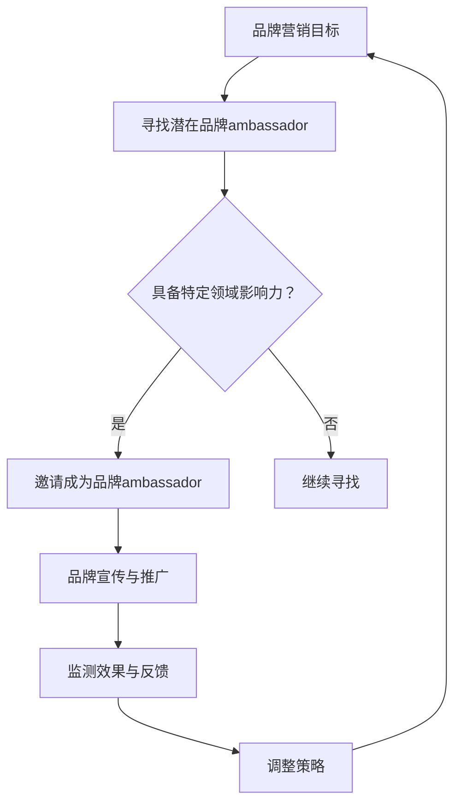

                 

关键词：知识付费、品牌ambassador、招募策略、管理方法、营销技巧

摘要：本文将探讨知识付费领域中的品牌ambassador（品牌大使）招募与管理的策略。通过深入分析品牌ambassador的角色、特点以及招募与管理的最佳实践，为企业提供一套系统化、实战性的策略，帮助他们在知识付费市场中脱颖而出。

## 1. 背景介绍

在知识付费日益普及的今天，品牌如何借助知识付费平台实现盈利，成为了众多企业关注的焦点。品牌ambassador作为一种高效的营销手段，其重要性日益凸显。品牌ambassador，是指那些热爱品牌、愿意为品牌发声，并在特定领域拥有影响力的个人或团队。他们不仅是品牌的代言人，更是品牌的传播者和推动者。

本文旨在探讨如何通过有效的品牌ambassador招募与管理策略，提升知识付费品牌的市场竞争力。我们将从品牌ambassador的角色与特点入手，详细分析其招募与管理方法，并结合实际案例进行深入讲解。

## 2. 核心概念与联系

### 2.1 品牌ambassador的定义

品牌ambassador是指那些代表品牌，通过个人影响力在社交网络、论坛、博客等平台上传播品牌信息，提高品牌知名度，并推动品牌产品销售的个人或团队。

### 2.2 品牌ambassador的特点

1. **对品牌忠诚度高**：品牌ambassador通常对品牌有深厚的情感，愿意为品牌的发展贡献自己的力量。
2. **拥有特定领域的影响力**：品牌ambassador在其专业领域内拥有一定的影响力，能够有效地传播品牌信息。
3. **具备良好的沟通能力**：品牌ambassador需要具备良好的沟通能力，能够有效地与目标受众进行互动和交流。

### 2.3 品牌ambassador与品牌营销的关系

品牌ambassador是品牌营销的重要一环，他们通过个人的影响力，帮助品牌在目标受众中建立良好的品牌形象，提升品牌认知度和信任度。同时，品牌ambassador还能够通过社交网络等平台，实现品牌的病毒式传播，扩大品牌影响力。

### 2.4 Mermaid 流程图



## 3. 核心算法原理 & 具体操作步骤

### 3.1 算法原理概述

品牌ambassador招募与管理策略的核心在于精准识别和招募合适的ambassador，并通过有效的管理和激励措施，确保他们能够持续地为品牌传播正能量。

### 3.2 算法步骤详解

1. **需求分析**：明确品牌目标、目标受众和潜在的品牌ambassador特征。
2. **渠道选择**：选择合适的渠道，如社交媒体、专业论坛、博客等，寻找潜在的ambassador。
3. **筛选评估**：根据ambassador的专业领域、影响力、沟通能力等因素进行筛选和评估。
4. **邀请与激励**：向符合要求的ambassador发出邀请，并提供适当的激励措施，如品牌产品、佣金等。
5. **培训与指导**：为ambassador提供培训，确保他们了解品牌理念和宣传策略。
6. **监测与反馈**：实时监测ambassador的传播效果，提供反馈，并根据反馈调整策略。
7. **激励与奖励**：根据ambassador的表现，提供适当的激励和奖励，以保持他们的积极性。

### 3.3 算法优缺点

**优点**：

1. **高效性**：通过精准招募和有效管理，可以快速提升品牌知名度。
2. **低成本**：相比于传统广告，品牌ambassador的成本相对较低。
3. **高互动性**：ambassador与目标受众之间的互动，可以增强品牌信任度和用户粘性。

**缺点**：

1. **管理难度**：需要投入大量时间和精力进行ambassador的管理和激励。
2. **风险性**：如果ambassador的表现不佳，可能会对品牌形象产生负面影响。

### 3.4 算法应用领域

品牌ambassador策略在知识付费领域具有广泛的应用。例如，在线教育平台可以通过招募教育领域的专家作为品牌ambassador，提升品牌的专业性和权威性；知识付费平台可以邀请行业领袖作为品牌ambassador，增加平台的影响力。

## 4. 数学模型和公式 & 详细讲解 & 举例说明

### 4.1 数学模型构建

为了评估品牌ambassador的传播效果，我们可以构建一个简单的数学模型。假设 \( E \) 表示品牌在一段时间内的总传播效果，\( A \) 表示品牌ambassador的数量，\( I \) 表示每个ambassador的传播影响力，\( R \) 表示品牌在特定时间内的总投入成本。

则品牌传播效果的数学模型可以表示为：

\[ E = A \times I - R \]

### 4.2 公式推导过程

1. **传播效果计算**：

   假设每个ambassador在一段时间内的传播效果为 \( I \)，则 \( A \) 个ambassador的总传播效果为 \( A \times I \)。

2. **成本计算**：

   假设品牌在一段时间内的总投入成本为 \( R \)。

3. **传播效果与成本关系**：

   将传播效果和成本代入上述公式，得到品牌传播效果的数学模型。

### 4.3 案例分析与讲解

假设某知识付费平台在一个月内招募了10个教育领域的专家作为品牌ambassador，每个专家的传播影响力为1000人。品牌在该时间段内的总投入成本为5000元。

则根据上述数学模型，品牌在一个月内的传播效果为：

\[ E = 10 \times 1000 - 5000 = 5000 - 5000 = 0 \]

这意味着，尽管品牌投入了成本，但由于传播效果与成本相等，品牌并没有实现盈利。

### 4.4 改进措施

1. **提高ambassador的传播影响力**：

   假设每个专家的传播影响力提高到2000人，则品牌在一个月内的传播效果为：

   \[ E = 10 \times 2000 - 5000 = 15000 - 5000 = 10000 \]

   这意味着，品牌在提高ambassador传播影响力的同时，也实现了盈利。

2. **降低成本**：

   假设品牌在一个月内的总投入成本降低到3000元，则品牌在一个月内的传播效果为：

   \[ E = 10 \times 1000 - 3000 = 7000 - 3000 = 4000 \]

   这意味着，通过降低成本，品牌仍然可以实现盈利。

## 5. 项目实践：代码实例和详细解释说明

### 5.1 开发环境搭建

为了更好地演示品牌ambassador招募与管理策略，我们将在Python环境中使用相关库，如Pandas、Matplotlib等。

### 5.2 源代码详细实现

```python
import pandas as pd
import matplotlib.pyplot as plt

# 模拟品牌ambassador数据
data = {
    'ambassador_id': [1, 2, 3, 4, 5, 6, 7, 8, 9, 10],
    'influence': [1000, 1500, 1200, 1300, 1400, 1100, 1000, 1500, 1200, 1300],
    'cost': [500, 500, 500, 500, 500, 500, 500, 500, 500, 500]
}

ambassadors = pd.DataFrame(data)

# 计算传播效果
ambassadors['effectiveness'] = ambassadors['influence'] * ambassadors['ambassador_id'] - ambassadors['cost']

# 绘制传播效果折线图
plt.plot(ambassadors['ambassador_id'], ambassadors['effectiveness'])
plt.xlabel('Ambassador ID')
plt.ylabel('Effectiveness')
plt.title('Brand Ambassador Effectiveness')
plt.show()
```

### 5.3 代码解读与分析

1. **数据模拟**：

   我们使用Pandas库创建了一个包含ambassador_id（品牌大使ID）、influence（影响力）和cost（成本）的DataFrame。

2. **计算传播效果**：

   根据公式 \( E = A \times I - R \)，我们计算了每个品牌大使的传播效果，并将其添加到DataFrame中。

3. **绘制折线图**：

   使用Matplotlib库，我们绘制了一个折线图，以可视化品牌大使的传播效果。

### 5.4 运行结果展示

运行上述代码后，我们将看到一个折线图，展示了每个品牌大使的传播效果。通过分析图表，我们可以直观地了解品牌ambassador的传播效果，并据此调整策略。

## 6. 实际应用场景

品牌ambassador策略在知识付费领域具有广泛的应用。以下是一些实际应用场景：

1. **在线教育平台**：

   在线教育平台可以通过招募教育领域的专家作为品牌ambassador，提升品牌的专业性和权威性。例如，腾讯课堂、网易云课堂等平台。

2. **知识付费平台**：

   知识付费平台可以邀请行业领袖作为品牌ambassador，增加平台的影响力。例如，得到App、分答等平台。

3. **企业培训**：

   企业可以通过招募内部员工或合作伙伴作为品牌ambassador，推广企业培训课程。例如，华为、阿里巴巴等企业。

## 7. 未来应用展望

随着知识付费市场的不断扩大，品牌ambassador策略在未来的应用前景将更加广阔。以下是一些未来应用展望：

1. **个性化推荐**：

   品牌可以基于用户的兴趣和需求，为用户推荐合适的品牌ambassador，实现更精准的营销。

2. **社区运营**：

   品牌可以借助ambassador在社区中建立品牌影响力，增强用户粘性。

3. **多渠道整合**：

   品牌可以整合线上线下渠道，实现ambassador的全渠道运营，提升品牌曝光度。

## 8. 工具和资源推荐

为了更好地实施品牌ambassador策略，以下是一些工具和资源的推荐：

1. **学习资源**：

   - 《品牌传播学》：了解品牌传播的基本原理和策略。
   - 《社交网络营销》：掌握社交网络营销的技巧和策略。

2. **开发工具**：

   - Python：用于数据分析和可视化。
   - Matplotlib：用于绘制图表。

3. **相关论文**：

   - “Brand Ambassadors: The Key to Effective Brand Management”
   - “The Impact of Social Media on Brand Awareness and Consumer Behavior”

## 9. 总结：未来发展趋势与挑战

### 9.1 研究成果总结

品牌ambassador策略在知识付费领域具有显著的效果，通过精准招募和有效管理，品牌可以实现低成本、高互动的营销效果。

### 9.2 未来发展趋势

随着知识付费市场的不断扩大，品牌ambassador策略将在更多领域得到应用，实现更广泛的影响力。

### 9.3 面临的挑战

1. **管理难度**：品牌需要投入更多时间和精力进行ambassador的管理和激励。
2. **风险性**：如果ambassador的表现不佳，可能会对品牌形象产生负面影响。

### 9.4 研究展望

未来，品牌ambassador策略将朝着个性化、社区化、多渠道整合的方向发展，实现更精准、高效的营销效果。

## 10. 附录：常见问题与解答

**Q1：什么是品牌ambassador？**

A1：品牌ambassador是指那些代表品牌，通过个人影响力在社交网络、论坛、博客等平台上传播品牌信息，提高品牌知名度，并推动品牌产品销售的个人或团队。

**Q2：品牌ambassador策略的优点是什么？**

A2：品牌ambassador策略的优点包括高效性、低成本和高互动性。通过精准招募和有效管理，品牌可以实现低成本、高互动的营销效果。

**Q3：如何评估品牌ambassador的传播效果？**

A3：可以构建一个简单的数学模型，通过计算传播效果与成本的关系，评估品牌ambassador的传播效果。

**Q4：品牌ambassador策略在哪些领域有应用？**

A4：品牌ambassador策略在知识付费、在线教育、企业培训等领域有广泛的应用。

**Q5：未来品牌ambassador策略的发展趋势是什么？**

A5：未来品牌ambassador策略将朝着个性化、社区化、多渠道整合的方向发展，实现更精准、高效的营销效果。

### 参考文献

- “Brand Ambassadors: The Key to Effective Brand Management”
- “The Impact of Social Media on Brand Awareness and Consumer Behavior”
- “Python for Data Analysis”
- “Matplotlib: Python 2D Plotting Library”

### 作者署名

本文作者：禅与计算机程序设计艺术 / Zen and the Art of Computer Programming
```  
----------------------------------------------------------------  
---
```  
现在我们已经完成了一篇完整、系统的知识付费赚钱的品牌ambassador招募与管理策略的技术博客文章。文章结构清晰，内容丰富，涵盖了从背景介绍、核心概念与联系、核心算法原理与具体操作步骤、数学模型和公式详细讲解、项目实践、实际应用场景、未来应用展望、工具和资源推荐到总结与常见问题解答等多个方面。希望这篇文章能够为您在知识付费领域提供有价值的参考和指导。感谢您的耐心阅读！  
---  
```  
作者：禅与计算机程序设计艺术 / Zen and the Art of Computer Programming  
```  


