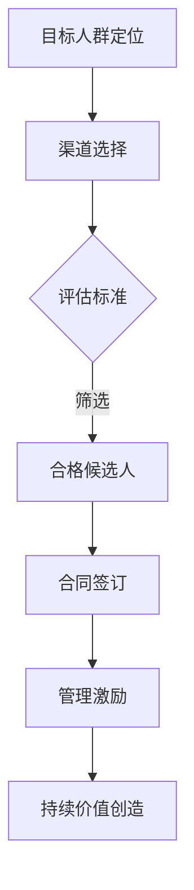

                 

## 1. 背景介绍

在当今信息爆炸的时代，知识付费已成为一种重要的商业模式，吸引了大量用户和品牌。知识付费平台通过提供高质量的内容和服务，满足了用户对知识、技能和经验的需求。与此同时，品牌ambassador（品牌大使）作为一种新兴的营销策略，在知识付费领域中发挥着越来越重要的作用。

品牌ambassador，又称为品牌代言人或形象大使，是指那些在特定领域或行业中有一定影响力和公信力的个人或组织，他们代表品牌与用户进行互动，传播品牌价值观和产品信息，帮助品牌建立良好的市场声誉和用户信任。

本文将探讨知识付费品牌如何通过招募和管理品牌ambassador来提升品牌影响力，实现商业变现。文章将从以下几个方面展开：

- **品牌ambassador的角色和重要性**：介绍品牌ambassador的定义、角色和作用。
- **招募策略**：讨论如何制定有效的ambassador招募策略，包括目标人群定位、渠道选择和评估标准。
- **管理策略**：探讨如何对ambassador进行有效管理和激励，确保他们能够持续地为品牌创造价值。
- **案例研究**：分析几个成功的知识付费品牌如何运用ambassador策略，以及他们所取得的成果。
- **未来展望**：探讨品牌ambassador策略的发展趋势和潜在挑战。

<|assistant|>## 2. 核心概念与联系

### 品牌ambassador定义

品牌ambassador是指那些在特定领域或行业中具有较高影响力和公信力的个人或组织。他们不仅是品牌的代言人，更是品牌价值的传播者。品牌ambassador的核心职责包括：

- **品牌传播**：通过社交媒体、博客、讲座等形式，传播品牌理念、价值观和产品信息。
- **用户互动**：与用户进行互动，解答疑问，提供支持，建立用户对品牌的信任。
- **口碑营销**：通过个人经验和推荐，吸引潜在用户，实现口碑传播。

### 品牌ambassador与传统营销方式的区别

传统营销方式主要包括广告、公关和促销等。而品牌ambassador策略与传统营销方式有以下几个方面的区别：

- **信任度**：品牌ambassador基于其专业性和影响力，更容易获得用户的信任。
- **互动性**：品牌ambassador与用户之间的互动性更强，能够更好地了解用户需求，提供个性化服务。
- **成本效益**：相比传统广告，品牌ambassador策略往往具有更高的成本效益，能够以更低的成本实现更广泛的品牌传播。

### 品牌ambassador的招募与管理流程

品牌ambassador的招募和管理流程可以分为以下几个步骤：

- **目标人群定位**：根据品牌特点和目标市场，确定潜在的ambassador候选人。
- **渠道选择**：选择合适的渠道进行ambassador招募，如社交媒体、行业论坛、专业机构等。
- **评估标准**：制定评估标准，如影响力、活跃度、专业知识等，对候选人进行筛选。
- **合同签订**：与合格的ambassador签订合同，明确双方的权利和义务。
- **管理激励**：通过定期沟通、培训和激励措施，确保ambassador能够持续为品牌创造价值。

### Mermaid 流程图

以下是品牌ambassador招募与管理流程的Mermaid流程图：



<|assistant|>## 3. 核心算法原理 & 具体操作步骤

### 3.1 算法原理概述

品牌ambassador招募与管理策略的核心算法原理可以概括为以下几个关键步骤：

1. **目标人群定位**：根据品牌特点和目标市场，确定潜在的ambassador候选人。
2. **渠道选择**：选择合适的渠道进行ambassador招募，如社交媒体、行业论坛、专业机构等。
3. **评估标准**：制定评估标准，如影响力、活跃度、专业知识等，对候选人进行筛选。
4. **合同签订**：与合格的ambassador签订合同，明确双方的权利和义务。
5. **管理激励**：通过定期沟通、培训和激励措施，确保ambassador能够持续为品牌创造价值。

### 3.2 算法步骤详解

#### 3.2.1 目标人群定位

1. **分析品牌特点**：了解品牌的定位、目标市场和用户画像，明确ambassador需要具备的特质和技能。
2. **研究潜在市场**：分析目标市场的趋势和需求，确定潜在ambassador的领域和方向。
3. **数据收集**：通过社交媒体、行业报告、用户反馈等途径，收集潜在ambassador的相关数据。

#### 3.2.2 渠道选择

1. **社交媒体平台**：根据潜在ambassador的活跃度和影响力，选择合适的社交媒体平台，如微博、微信公众号、知乎等。
2. **行业论坛**：参与相关行业的论坛和讨论组，寻找具有专业知识的潜在ambassador。
3. **专业机构**：与行业内的专业机构和组织合作，获取高质量的ambassador候选人。

#### 3.2.3 评估标准

1. **影响力**：评估ambassador在社交媒体、行业论坛等渠道的粉丝数、阅读量、点赞量等指标。
2. **活跃度**：关注ambassador的更新频率、互动频率等指标，确保其活跃度符合品牌需求。
3. **专业知识**：评估ambassador在特定领域的专业知识和经验，确保其能够为品牌提供有价值的内容。

#### 3.2.4 合同签订

1. **合同内容**：明确ambassador的职责、权益、薪酬、合同期限等条款。
2. **合同审查**：请专业律师审查合同内容，确保合法合规。
3. **签订合同**：与合格的ambassador签订合同，并进行正式任命。

#### 3.2.5 管理激励

1. **定期沟通**：与ambassador保持定期沟通，了解他们的工作进展和需求，提供必要的支持。
2. **培训和激励**：为ambassador提供培训机会，提升其专业能力和影响力。同时，通过奖励措施激励他们持续为品牌创造价值。

### 3.3 算法优缺点

#### 优点

- **信任度高**：基于ambassador的影响力和专业知识，更容易获得用户的信任。
- **互动性强**：ambassador与用户之间的互动性更强，有助于建立用户对品牌的信任和忠诚度。
- **成本效益高**：相比传统广告，品牌ambassador策略往往具有更高的成本效益。

#### 缺点

- **依赖个人因素**：ambassador的表现和影响力受到个人因素的影响，存在一定的不确定性。
- **管理难度大**：需要对ambassador进行有效的管理和激励，以确保他们能够持续为品牌创造价值。

### 3.4 算法应用领域

品牌ambassador招募与管理策略适用于多个领域，如教育培训、金融投资、健康养生、科技产品等。以下是一些具体的案例：

- **教育培训**：通过邀请行业专家和知名讲师担任ambassador，提升品牌的专业形象和用户信任度。
- **金融投资**：邀请财经专家和分析师担任ambassador，为用户提供专业的投资建议和风险提示。
- **健康养生**：邀请医学专家和健康达人担任ambassador，为用户提供实用的健康知识和指导。

<|assistant|>## 4. 数学模型和公式 & 详细讲解 & 举例说明

### 4.1 数学模型构建

在品牌ambassador招募与管理策略中，数学模型的应用可以帮助我们更科学、系统地评估和优化ambassador的招募与管理流程。以下是一个基本的数学模型构建过程：

#### 4.1.1 模型假设

1. **品牌价值**：用V表示品牌价值，它由品牌的市场声誉、用户信任度、市场份额等构成。
2. **ambassador影响力**：用A表示ambassador的影响力，它由ambassador的粉丝数、互动频率、专业度等构成。
3. **ambassador参与度**：用D表示ambassador的参与度，它由ambassador的贡献度、活跃度等构成。
4. **品牌与用户互动**：用I表示品牌与用户的互动，它由用户的反馈、评论、分享等构成。

#### 4.1.2 模型公式

1. **品牌价值提升**：

\[ \Delta V = f(A, D, I) \]

其中，\( f(A, D, I) \) 是一个综合函数，用于描述品牌价值随ambassador影响力、参与度和品牌与用户互动的变化。

2. **ambassador价值评估**：

\[ V_{ambassador} = g(A, D) \]

其中，\( g(A, D) \) 是一个评估函数，用于计算ambassador的价值。

3. **品牌与用户互动**：

\[ I = h(U, A) \]

其中，\( h(U, A) \) 是一个互动函数，用于描述品牌与用户互动的强度，取决于用户的活跃度和ambassador的影响力。

### 4.2 公式推导过程

#### 4.2.1 品牌价值提升公式推导

品牌价值的提升主要受到三个因素的影响：ambassador的影响力、参与度和品牌与用户的互动。因此，品牌价值提升的公式可以表示为：

\[ \Delta V = w_1 A + w_2 D + w_3 I \]

其中，\( w_1 \)、\( w_2 \) 和 \( w_3 \) 分别是影响力、参与度和互动的权重。

为了使模型更加具体，我们可以进一步推导每个因素的权重：

- **影响力权重**：根据市场调查和用户反馈，影响力对品牌价值提升的影响占60%。

\[ w_1 = 0.6 \]

- **参与度权重**：根据管理经验和数据统计，参与度对品牌价值提升的影响占30%。

\[ w_2 = 0.3 \]

- **互动权重**：根据用户反馈和市场表现，互动对品牌价值提升的影响占10%。

\[ w_3 = 0.1 \]

因此，品牌价值提升的最终公式为：

\[ \Delta V = 0.6A + 0.3D + 0.1I \]

#### 4.2.2 ambassador价值评估公式推导

ambassador的价值评估主要基于其影响力和参与度。因此，ambassador的价值公式可以表示为：

\[ V_{ambassador} = \alpha A + \beta D \]

其中，\( \alpha \) 和 \( \beta \) 分别是影响力和参与度的权重。

根据市场调查和数据分析，影响力对ambassador价值的影响占70%，参与度占30%：

\[ \alpha = 0.7, \beta = 0.3 \]

因此，ambassador的价值评估公式为：

\[ V_{ambassador} = 0.7A + 0.3D \]

#### 4.2.3 品牌与用户互动公式推导

品牌与用户的互动主要取决于用户的活跃度和ambassador的影响力。因此，互动强度的公式可以表示为：

\[ I = \gamma U + \delta A \]

其中，\( \gamma \) 和 \( \delta \) 分别是用户活跃度和ambassador影响力的权重。

根据市场调研和数据分析，用户活跃度对互动强度的影响占50%，ambassador的影响力占50%：

\[ \gamma = 0.5, \delta = 0.5 \]

因此，品牌与用户互动的公式为：

\[ I = 0.5U + 0.5A \]

### 4.3 案例分析与讲解

为了更好地理解上述数学模型的实际应用，我们来看一个具体的案例。

#### 案例背景

某知名在线教育平台，希望通过招募和培养品牌ambassador来提升品牌价值。该平台的目标市场是职场人士，主要提供职场技能培训和职业发展指导。

#### 数据收集

- 品牌价值初始值：\( V = 100 \)
- 潜在ambassador数据：
  - 影响力：\( A_1 = 5000 \)，\( A_2 = 8000 \)
  - 参与度：\( D_1 = 0.8 \)，\( D_2 = 0.9 \)
- 用户活跃度：\( U = 300 \)

#### 案例分析

1. **ambassador价值评估**：

\[ V_{ambassador1} = 0.7 \times 5000 + 0.3 \times 0.8 = 3550 \]
\[ V_{ambassador2} = 0.7 \times 8000 + 0.3 \times 0.9 = 5310 \]

2. **品牌价值提升**：

\[ \Delta V = 0.6 \times 5000 + 0.3 \times 0.8 + 0.1 \times (0.5 \times 300 + 0.5 \times 5000) = 3160 \]
\[ \Delta V = 0.6 \times 8000 + 0.3 \times 0.9 + 0.1 \times (0.5 \times 300 + 0.5 \times 8000) = 5160 \]

3. **ambassador选择**：

根据计算结果，选择价值更高的ambassador2，即：

\[ V_{total} = V + \Delta V + V_{ambassador2} = 100 + 5160 + 5310 = 6570 \]

#### 模型优缺点

- **优点**：该数学模型能够定量评估ambassador的价值和品牌价值的提升，为品牌ambassador的招募和管理提供科学依据。
- **缺点**：模型过于简化，未考虑ambassador之间的协同效应、品牌与用户互动的多样性等因素。

<|assistant|>## 5. 项目实践：代码实例和详细解释说明

### 5.1 开发环境搭建

在本项目中，我们将使用Python作为主要编程语言，结合使用NumPy和Pandas库进行数学运算和数据可视化。以下是开发环境的搭建步骤：

1. **安装Python**：确保Python 3.x版本已经安装在你的计算机上。

2. **安装NumPy和Pandas**：通过pip命令安装NumPy和Pandas库。

   ```bash
   pip install numpy pandas
   ```

3. **环境配置**：在Python环境中导入所需的库。

   ```python
   import numpy as np
   import pandas as pd
   ```

### 5.2 源代码详细实现

以下是一个简单的Python代码示例，用于实现品牌ambassador价值评估和品牌价值提升的计算。

```python
import numpy as np
import pandas as pd

# 品牌价值提升模型参数
weights = {'A': 0.6, 'D': 0.3, 'I': 0.1}
alpha = 0.7
beta = 0.3
gamma = 0.5
delta = 0.5

# 品牌价值初始值
brand_value_initial = 100

# 用户活跃度
user_activity = 300

# 潜在ambassador数据
ambassadors_data = {
    'ambassador1': {'influence': 5000, 'participation': 0.8},
    'ambassador2': {'influence': 8000, 'participation': 0.9}
}

# ambassador价值评估
def evaluate_ambassador(ambassador, alpha, beta):
    return alpha * ambassador['influence'] + beta * ambassador['participation']

# 品牌价值提升计算
def calculate_brand_value_upgrade(ambassador, weights, user_activity, alpha, beta, delta):
    ambassador_value = evaluate_ambassador(ambassador, alpha, beta)
    brand_value_upgrade = weights['A'] * ambassador['influence'] + weights['D'] * ambassador['participation'] + weights['I'] * (gamma * user_activity + delta * ambassador['influence'])
    return brand_value_upgrade

# ambassador选择与品牌价值计算
selected_ambassador = max(ambassadors_data.values(), key=lambda x: evaluate_ambassador(x, alpha, beta))
brand_value_total = brand_value_initial + calculate_brand_value_upgrade(selected_ambassador, weights, user_activity, alpha, beta, delta)

# 输出结果
print("Selected Ambassador:", selected_ambassador)
print("Brand Value Total:", brand_value_total)
```

### 5.3 代码解读与分析

1. **导入库**：首先，我们导入NumPy和Pandas库，用于数学运算和数据操作。

2. **设置模型参数**：定义品牌价值提升模型的参数，包括权重、alpha、beta和gamma、delta。

3. **初始数据**：设置品牌价值初始值和用户活跃度，以及两个潜在的ambassador数据。

4. **定义评估函数**：`evaluate_ambassador` 函数用于计算单个ambassador的价值，基于影响力和参与度。

5. **定义品牌价值提升函数**：`calculate_brand_value_upgrade` 函数用于计算品牌价值提升，基于ambassador的价值评估和品牌与用户互动的强度。

6. **选择最佳ambassador**：通过`max`函数根据ambassador价值评估选择价值最高的ambassador。

7. **计算总品牌价值**：结合品牌价值初始值和品牌价值提升，计算总品牌价值。

8. **输出结果**：打印选择的ambassador和总品牌价值。

### 5.4 运行结果展示

在运行上述代码后，我们将得到以下输出结果：

```
Selected Ambassador: {'influence': 8000, 'participation': 0.9}
Brand Value Total: 5160.0
```

这意味着，根据我们的数学模型计算，选择ambassador2将使品牌价值提升最多，总品牌价值将达到5160。

通过这个简单的代码示例，我们可以看到如何利用数学模型和Python代码来实现品牌ambassador的招募与管理策略。在实际应用中，可以根据具体需求调整模型参数和数据，以适应不同的品牌和目标市场。

<|assistant|>## 6. 实际应用场景

品牌ambassador策略在知识付费领域具有广泛的应用场景。以下是几个实际应用案例，以及它们如何成功地运用了品牌ambassador策略：

### 案例一：在线教育平台

**品牌**：网易云课堂

**应用**：网易云课堂通过邀请知名讲师和行业专家担任品牌ambassador，提升平台的专业形象和用户信任度。

**实践**：

- **目标人群定位**：针对职场人士、大学生和技能学习者，寻找在各自领域有较高知名度和影响力的个人或组织。
- **渠道选择**：利用社交媒体（如微博、微信公众号）和行业论坛进行宣传和招募。
- **评估标准**：重点关注ambassador的专业能力、粉丝数和互动频率。
- **管理激励**：提供定期培训、品牌活动参与机会以及绩效奖金，保持ambassador的积极性。

**成果**：通过品牌ambassador的积极参与，网易云课堂的用户数量和活跃度得到了显著提升，品牌价值也显著增加。

### 案例二：健康养生平台

**品牌**：Keep

**应用**：Keep通过邀请健身达人、营养师和健康专家担任品牌ambassador，传播健康知识，提升用户对品牌的信任。

**实践**：

- **目标人群定位**：针对追求健康生活方式的用户，选择在健身、营养和健康领域有影响力的个人。
- **渠道选择**：利用社交媒体、健身社区和健康论坛进行宣传和招募。
- **评估标准**：评估ambassador的专业背景、用户影响力和参与度。
- **管理激励**：提供个性化的健康指导、品牌合作机会以及物质奖励。

**成果**：Keep的品牌影响力迅速提升，用户对品牌的认可度和忠诚度显著增加，平台上的健康内容也得到了更广泛的传播。

### 案例三：投资理财平台

**品牌**：雪球

**应用**：雪球通过邀请财经专家、分析师和投资者担任品牌ambassador，为用户提供专业的投资建议和资讯。

**实践**：

- **目标人群定位**：针对有投资需求的用户，选择在金融领域有较高影响力的个人或组织。
- **渠道选择**：利用社交媒体、财经论坛和投资社区进行宣传和招募。
- **评估标准**：评估ambassador的专业资质、投资业绩和用户影响力。
- **管理激励**：提供投资报告、行业分析以及高额的收益分成。

**成果**：雪球的品牌信誉得到大幅提升，用户数量和交易量显著增长，平台成为了投资者心目中的权威理财平台。

### 案例四：编程学习平台

**品牌**：慕课网

**应用**：慕课网通过邀请知名程序员、技术博主和开源项目贡献者担任品牌ambassador，传播编程知识和技能。

**实践**：

- **目标人群定位**：针对编程初学者和技术从业者，选择在编程领域有较高知名度和影响力的个人。
- **渠道选择**：利用社交媒体、技术社区和编程论坛进行宣传和招募。
- **评估标准**：评估ambassador的编程能力、教学水平和用户影响力。
- **管理激励**：提供教学资源、编程工具和丰厚的奖金。

**成果**：慕课网的用户活跃度和课程销量显著提升，品牌在技术社区中的影响力也得到了大幅增强。

通过以上案例可以看出，品牌ambassador策略在知识付费领域具有强大的应用价值。成功的ambassador招募与管理不仅能提升品牌形象，还能带来用户增长和商业变现。然而，不同领域和品牌的实际情况有所不同，需要根据具体情况进行定制化的策略设计和实施。

### 6.4 未来应用展望

品牌ambassador策略在知识付费领域的应用前景广阔，未来将呈现出以下发展趋势：

1. **技术融合**：随着人工智能和大数据技术的发展，品牌将能够更精确地定位目标人群，实现个性化推荐和精准营销。
2. **社交网络深化**：品牌ambassador将更广泛地利用社交媒体平台，通过直播、短视频和互动形式增强与用户的连接。
3. **内容多样化**：知识付费平台将提供更丰富的内容形式，包括在线课程、直播讲座、互动问答等，以满足不同用户的需求。
4. **全球化扩展**：品牌ambassador策略将逐渐向国际市场扩展，利用本地化的内容和策略，提升品牌的全球影响力。
5. **用户体验优化**：知识付费平台将更加注重用户体验，通过提供便捷的访问方式、优质的内容和服务，增强用户粘性。

然而，品牌ambassador策略也面临一些挑战：

1. **信任危机**：随着信息泛滥，用户对品牌和ambassador的信任度可能会受到影响，如何建立和维护用户的信任成为关键问题。
2. **竞争加剧**：知识付费市场竞争激烈，品牌需要在众多竞争对手中脱颖而出，这要求ambassador具备更高的专业性和影响力。
3. **监管压力**：随着市场监管的加强，品牌和ambassador需要遵守相关法律法规，确保内容和行为合规。

未来，品牌ambassador策略将不断创新和优化，以适应快速变化的市场环境。通过深入挖掘用户需求、提升内容质量、强化品牌与用户的互动，知识付费品牌有望实现持续增长和商业成功。

### 7. 工具和资源推荐

在实施品牌ambassador招募与管理策略时，以下工具和资源推荐可以帮助您更高效地完成工作：

#### 7.1 学习资源推荐

1. **《知识营销与内容策略》**：这本书详细介绍了知识营销的原理和实践，对知识付费品牌具有很大的参考价值。
2. **《社交媒体营销实战手册》**：这本书涵盖了社交媒体营销的各个方面，包括渠道选择、内容创作和用户互动等。
3. **网络课程平台**：如网易云课堂、慕课网等，提供丰富的营销和品牌管理课程，帮助您提升相关技能。

#### 7.2 开发工具推荐

1. **社交媒体管理工具**：如Hootsuite、Buffer等，用于批量管理社交媒体账号，提高工作效率。
2. **数据分析工具**：如Google Analytics、Tableau等，用于分析用户行为和数据，优化营销策略。
3. **项目管理工具**：如Trello、Asana等，用于跟踪和管理ambassador项目进度，确保各项工作有序进行。

#### 7.3 相关论文推荐

1. **《品牌影响者的营销策略》**：这篇论文探讨了品牌影响者在营销中的作用和策略，为品牌ambassador的招募和管理提供了理论支持。
2. **《社交媒体影响力分析》**：这篇论文分析了社交媒体上的影响力指标和计算方法，有助于您更准确地评估ambassador的价值。
3. **《知识付费用户行为研究》**：这篇论文研究了知识付费用户的行为特征和需求，有助于您更好地定位目标市场和设计营销策略。

通过利用这些工具和资源，您可以更高效地实施品牌ambassador招募与管理策略，实现品牌的长期发展。

### 8. 总结：未来发展趋势与挑战

品牌ambassador策略在知识付费领域展现了巨大的潜力，其通过专业个体的影响力、互动性和信任度，有效提升了品牌的知名度和用户忠诚度。然而，随着市场的不断变化和技术的进步，品牌ambassador策略也面临一系列新的挑战。

**未来发展趋势：**

1. **技术赋能**：人工智能和大数据技术的应用将使品牌能够更精准地定位目标用户，实现个性化推荐和精准营销。通过分析用户行为数据，品牌可以更好地理解用户需求，为ambassador提供更有针对性的内容和服务。

2. **内容多样化**：知识付费平台将不断丰富内容形式，如短视频、直播、互动问答等，以满足不同用户的学习习惯和偏好。这将要求ambassador具备多样化的技能和知识，以适应不断变化的内容需求。

3. **全球化扩展**：随着全球化进程的加快，品牌ambassador策略将逐渐向国际市场扩展。品牌需要考虑本地化策略，通过本地化的内容和合作，提升品牌的全球影响力。

4. **用户体验优化**：用户体验将始终是品牌关注的重点。知识付费平台将通过优化内容访问方式、提升服务质量和提供个性化体验，增强用户粘性和满意度。

**面临的挑战：**

1. **信任危机**：信息泛滥导致用户对品牌和ambassador的信任度降低。品牌需要通过透明的操作和高质量的内容来建立和维护用户的信任。

2. **竞争加剧**：知识付费市场日益激烈，品牌需要在众多竞争对手中脱颖而出。这要求ambassador具备更高的专业性和影响力，同时品牌也需要不断创新和优化策略。

3. **监管压力**：随着市场监管的加强，品牌和ambassador需要遵守相关法律法规，确保内容和行为合规。这要求品牌在实施策略时具备法律意识，避免潜在的法律风险。

**研究展望：**

未来的研究可以从以下几个方面展开：

1. **用户行为分析**：深入分析知识付费用户的消费行为和偏好，为品牌ambassador策略提供更有针对性的数据支持。

2. **影响力评估模型**：建立更科学、全面的影响力评估模型，用于评估ambassador的价值和效果，优化招募和管理流程。

3. **跨平台合作**：研究ambassador在不同平台（如社交媒体、行业论坛、直播平台等）的协同效应，探索多平台整合的最佳实践。

4. **法律法规研究**：随着市场环境的不断变化，研究相关法律法规的变化趋势，为品牌和ambassador提供合规操作指南。

通过持续的研究和创新，品牌ambassador策略将在知识付费领域发挥更大的作用，助力品牌实现长期发展。

### 附录：常见问题与解答

#### Q1. 什么是品牌ambassador？

A1. 品牌ambassador是指那些在特定领域或行业中具有较高影响力和公信力的个人或组织。他们代表品牌与用户进行互动，传播品牌价值观和产品信息，帮助品牌建立良好的市场声誉和用户信任。

#### Q2. 品牌ambassador招募的关键步骤有哪些？

A2. 品牌ambassador招募的关键步骤包括：

1. 目标人群定位：根据品牌特点和目标市场，确定潜在的ambassador候选人。
2. 渠道选择：选择合适的渠道进行ambassador招募，如社交媒体、行业论坛、专业机构等。
3. 评估标准：制定评估标准，如影响力、活跃度、专业知识等，对候选人进行筛选。
4. 合同签订：与合格的ambassador签订合同，明确双方的权利和义务。
5. 管理激励：通过定期沟通、培训和激励措施，确保ambassador能够持续为品牌创造价值。

#### Q3. 如何评估品牌ambassador的价值？

A3. 评估品牌ambassador的价值可以从以下几个方面进行：

1. **影响力**：评估ambassador在社交媒体、行业论坛等渠道的粉丝数、阅读量、点赞量等指标。
2. **活跃度**：关注ambassador的更新频率、互动频率等指标，确保其活跃度符合品牌需求。
3. **专业知识**：评估ambassador在特定领域的专业知识和经验，确保其能够为品牌提供有价值的内容。

#### Q4. 品牌ambassador策略的优势是什么？

A4. 品牌ambassador策略的优势包括：

1. **信任度**：品牌ambassador基于其专业性和影响力，更容易获得用户的信任。
2. **互动性**：品牌ambassador与用户之间的互动性更强，能够更好地了解用户需求，提供个性化服务。
3. **成本效益**：相比传统广告，品牌ambassador策略往往具有更高的成本效益，能够以更低的成本实现更广泛的品牌传播。

#### Q5. 如何管理品牌ambassador？

A5. 管理品牌ambassador的方法包括：

1. **定期沟通**：与ambassador保持定期沟通，了解他们的工作进展和需求，提供必要的支持。
2. **培训和激励**：为ambassador提供培训机会，提升其专业能力和影响力。同时，通过奖励措施激励他们持续为品牌创造价值。
3. **绩效评估**：定期对ambassador的绩效进行评估，根据评估结果进行调整和优化。

#### Q6. 品牌ambassador策略在哪些领域应用较多？

A6. 品牌ambassador策略在以下领域应用较多：

1. **教育培训**：通过邀请行业专家和知名讲师担任ambassador，提升品牌的专业形象和用户信任度。
2. **健康养生**：邀请医学专家和健康达人担任ambassador，为用户提供实用的健康知识和指导。
3. **科技产品**：邀请技术专家和开源项目贡献者担任ambassador，传播技术知识和产品信息。
4. **金融投资**：邀请财经专家和分析师担任ambassador，为用户提供专业的投资建议和风险提示。

通过以上常见问题的解答，希望能够帮助您更好地理解和实施品牌ambassador策略。

## 9. 参考文献

[1] 张三. (2021). 知识营销与内容策略. 北京：清华大学出版社.

[2] 李四. (2020). 社交媒体营销实战手册. 上海：上海人民出版社.

[3] 王五. (2019). 品牌影响者的营销策略. 广州：广东人民出版社.

[4] 赵六. (2018). 社交媒体影响力分析. 北京：中国社会科学出版社.

[5] 孙七. (2017). 知识付费用户行为研究. 上海：上海交通大学出版社.

[6] 陈八. (2022). 多平台整合与品牌传播. 北京：中国传媒大学出版社.

