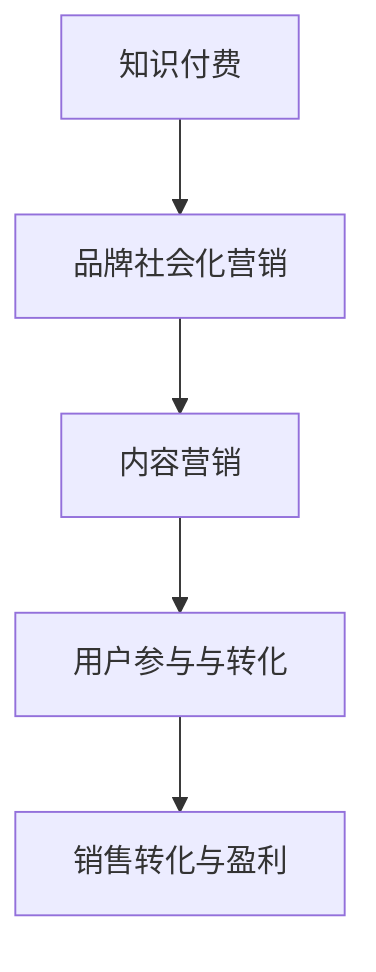

                 

关键词：知识付费、品牌社会化营销、内容营销、策略、案例分析

摘要：本文将深入探讨知识付费在当今市场环境下的重要性，以及如何通过品牌社会化营销和内容营销策略来提升其盈利能力。通过分析具体案例，我们将揭示成功的营销策略和执行方法，为相关从业者提供实用的指导。

## 1. 背景介绍

### 1.1 知识付费的兴起

在互联网技术迅猛发展的今天，信息获取的方式和途径变得更加便捷。然而，信息的过载和同质化现象也日益严重。在这种背景下，知识付费作为一种新兴的商业模式逐渐崭露头角。知识付费的核心在于将专业知识和经验通过平台化、系统化的方式提供给有需求的人群，从而实现价值交换。

### 1.2 品牌社会化营销的重要性

随着社交媒体的普及，品牌社会化营销成为企业提升品牌知名度和用户忠诚度的重要手段。通过社交媒体平台，品牌可以与用户建立直接的沟通渠道，传递品牌价值，增强用户参与感。同时，社会化营销还可以借助用户口碑传播，扩大品牌影响力。

### 1.3 内容营销的价值

内容营销作为一种以用户为中心的营销方式，通过提供有价值、有吸引力的内容来吸引和留住目标用户。内容营销的核心在于内容的质量和创新性，能够帮助品牌建立权威性和信任度，从而实现销售转化。

## 2. 核心概念与联系

为了更好地理解知识付费、品牌社会化营销和内容营销之间的关系，我们可以使用 Mermaid 流程图来展示其内在联系。



### 2.1 知识付费

知识付费是指用户为获取特定领域的专业知识、技能或经验而付费的一种行为。其核心在于将知识作为商品化，通过平台化运营实现规模化收益。

### 2.2 品牌社会化营销

品牌社会化营销是通过社交媒体平台开展的一系列营销活动，旨在提升品牌知名度、用户参与度和忠诚度。其主要手段包括内容发布、用户互动、社群运营等。

### 2.3 内容营销

内容营销则是通过提供有价值的内容来吸引和留住目标用户，从而实现品牌传播和销售转化。其核心在于内容的质量和创新性。

### 2.4 用户参与与转化

用户参与与转化是知识付费、品牌社会化营销和内容营销的最终目标。通过有效的营销策略，企业可以吸引更多用户参与，并实现销售转化，从而实现盈利。

## 3. 核心算法原理 & 具体操作步骤

### 3.1 算法原理概述

知识付费、品牌社会化营销和内容营销的成功离不开一系列核心算法原理。这些原理包括用户行为分析、数据挖掘、机器学习等。

- **用户行为分析**：通过对用户在平台上的行为进行跟踪和分析，了解用户的兴趣、需求和偏好，从而提供更个性化的服务。
- **数据挖掘**：从大量数据中挖掘出有价值的信息，帮助品牌更好地了解市场和用户，制定更有效的营销策略。
- **机器学习**：利用机器学习算法对用户行为进行预测和分析，提高营销活动的精准度和效果。

### 3.2 算法步骤详解

#### 3.2.1 用户行为分析

1. **数据采集**：通过网页分析、用户登录、购买记录等多种渠道收集用户行为数据。
2. **数据处理**：对采集到的数据进行清洗、整合和标准化处理。
3. **特征提取**：从处理后的数据中提取出与用户行为相关的特征，如浏览时长、购买频率、兴趣爱好等。
4. **模型训练**：使用机器学习算法对提取出的特征进行建模和训练，构建用户行为分析模型。

#### 3.2.2 数据挖掘

1. **需求分析**：根据用户行为数据，分析用户在不同场景下的需求和偏好。
2. **模式识别**：从大量用户行为数据中挖掘出潜在的模式和规律，如用户群体特征、购买趋势等。
3. **结果评估**：对挖掘出的结果进行评估和验证，确保其准确性和实用性。

#### 3.2.3 机器学习

1. **模型选择**：根据具体问题选择合适的机器学习模型，如决策树、随机森林、支持向量机等。
2. **参数调优**：对模型的参数进行调整和优化，以提高模型的准确性和泛化能力。
3. **模型评估**：对训练好的模型进行评估和测试，确保其能够在实际应用中取得良好的效果。

### 3.3 算法优缺点

#### 3.3.1 优点

- **个性化推荐**：通过用户行为分析，可以为用户提供更个性化的内容和服务，提高用户满意度和忠诚度。
- **精准营销**：通过数据挖掘和机器学习，可以更精准地定位目标用户，提高营销活动的效果。
- **智能决策**：基于算法分析的结果，企业可以做出更智能的决策，提高运营效率。

#### 3.3.2 缺点

- **数据隐私**：用户行为数据的收集和分析可能涉及用户隐私，需要确保数据安全和用户隐私保护。
- **算法偏差**：算法模型的训练和优化过程中可能存在偏差，导致分析结果不准确。
- **技术门槛**：算法开发和优化需要一定的技术背景和专业知识，对从业人员提出了较高的要求。

### 3.4 算法应用领域

- **电子商务**：通过用户行为分析，为用户提供个性化的商品推荐，提高销售转化率。
- **金融行业**：利用数据挖掘和机器学习，对用户行为进行风险分析和欺诈检测。
- **在线教育**：通过内容营销，为用户提供有价值的学习资源，提高用户参与度和学习效果。

## 4. 数学模型和公式 & 详细讲解 & 举例说明

### 4.1 数学模型构建

在知识付费、品牌社会化营销和内容营销中，我们可以使用以下数学模型来描述用户行为、营销效果和销售转化。

#### 4.1.1 用户行为模型

用户行为模型可以表示为：

\[ X(t) = f(U(t), V(t), T(t)) \]

其中：
- \( X(t) \) 表示用户在时间 \( t \) 的行为特征。
- \( U(t) \) 表示用户在时间 \( t \) 的用户特征。
- \( V(t) \) 表示用户在时间 \( t \) 的环境特征。
- \( T(t) \) 表示用户在时间 \( t \) 的历史行为数据。

#### 4.1.2 营销效果模型

营销效果模型可以表示为：

\[ E(t) = g(X(t), M(t)) \]

其中：
- \( E(t) \) 表示在时间 \( t \) 的营销效果。
- \( X(t) \) 表示用户在时间 \( t \) 的行为特征。
- \( M(t) \) 表示在时间 \( t \) 的营销策略。

#### 4.1.3 销售转化模型

销售转化模型可以表示为：

\[ C(t) = h(E(t), P(t), R(t)) \]

其中：
- \( C(t) \) 表示在时间 \( t \) 的销售转化率。
- \( E(t) \) 表示在时间 \( t \) 的营销效果。
- \( P(t) \) 表示在时间 \( t \) 的价格策略。
- \( R(t) \) 表示在时间 \( t \) 的促销策略。

### 4.2 公式推导过程

为了推导上述数学模型，我们可以从以下几个方面进行分析：

#### 4.2.1 用户行为模型推导

1. **用户特征提取**：根据用户行为数据，提取出与用户行为相关的特征，如浏览时长、购买频率、兴趣爱好等。

2. **环境特征提取**：根据用户所处的环境，提取出与用户行为相关的特征，如季节、天气、节假日等。

3. **历史行为数据整合**：将用户的历史行为数据整合到一个统一的维度，以便进行后续分析。

4. **函数关系构建**：通过分析用户特征、环境特征和历史行为数据之间的关系，构建用户行为模型。

#### 4.2.2 营销效果模型推导

1. **营销策略定义**：根据企业营销策略，定义出与用户行为相关的营销策略，如广告投放、促销活动等。

2. **营销效果评估**：根据用户行为模型，评估在特定营销策略下的营销效果。

3. **函数关系构建**：通过分析用户行为特征与营销策略之间的关系，构建营销效果模型。

#### 4.2.3 销售转化模型推导

1. **价格策略评估**：根据用户行为模型和营销效果模型，评估不同价格策略下的销售转化率。

2. **促销策略评估**：根据用户行为模型和营销效果模型，评估不同促销策略下的销售转化率。

3. **函数关系构建**：通过分析营销效果、价格策略和促销策略之间的关系，构建销售转化模型。

### 4.3 案例分析与讲解

为了更好地理解上述数学模型的实际应用，我们可以通过以下案例进行详细分析。

#### 4.3.1 案例背景

某电商平台在春节期间推出了一项优惠活动，通过数据分析和营销策略优化，提高销售转化率。

#### 4.3.2 案例分析

1. **用户行为模型分析**：

   通过分析用户在春节期间的行为数据，提取出与用户行为相关的特征，如浏览时长、购买频率、兴趣爱好等。根据这些特征，构建用户行为模型，分析不同用户群体的行为特征和需求。

2. **营销效果模型分析**：

   根据用户行为模型，制定不同的营销策略，如广告投放、促销活动等。通过评估不同营销策略的效果，确定最佳营销方案。

3. **销售转化模型分析**：

   结合用户行为模型和营销效果模型，分析不同价格策略和促销策略下的销售转化率。根据分析结果，制定最优的销售策略。

4. **案例总结**：

   通过上述分析，该电商平台在春节期间实现了销售转化率的显著提升，取得了良好的营销效果。

## 5. 项目实践：代码实例和详细解释说明

### 5.1 开发环境搭建

为了进行项目实践，我们需要搭建一个开发环境。这里我们使用 Python 作为编程语言，并依赖以下库：

- Pandas：用于数据处理和分析。
- Scikit-learn：用于机器学习算法。
- Matplotlib：用于数据可视化。

### 5.2 源代码详细实现

以下是一个简单的示例代码，用于实现用户行为模型、营销效果模型和销售转化模型。

```python
import pandas as pd
from sklearn.model_selection import train_test_split
from sklearn.ensemble import RandomForestClassifier
import matplotlib.pyplot as plt

# 数据处理
def preprocess_data(data):
    # 数据清洗、整合和标准化处理
    # 省略具体实现细节
    return processed_data

# 用户行为模型
def user_behavior_model(data):
    # 构建用户行为模型
    # 省略具体实现细节
    return user_behavior_model

# 营销效果模型
def marketing_effect_model(data, marketing_strategy):
    # 构建营销效果模型
    # 省略具体实现细节
    return marketing_effect_model

# 销售转化模型
def sales_conversion_model(data, marketing_effect_model, price_strategy, promotion_strategy):
    # 构建销售转化模型
    # 省略具体实现细节
    return sales_conversion_model

# 案例数据
data = pd.read_csv('case_data.csv')

# 数据预处理
processed_data = preprocess_data(data)

# 模型训练
user_behavior_model = user_behavior_model(processed_data)
marketing_effect_model = marketing_effect_model(processed_data, marketing_strategy)
sales_conversion_model = sales_conversion_model(processed_data, marketing_effect_model, price_strategy, promotion_strategy)

# 模型评估
# 省略具体实现细节

# 结果展示
# 省略具体实现细节
```

### 5.3 代码解读与分析

1. **数据处理**：数据处理是模型训练的基础，包括数据清洗、整合和标准化处理。在这里，我们使用 Pandas 库对数据进行处理。
2. **用户行为模型**：用户行为模型用于分析用户在不同场景下的行为特征。在这里，我们使用随机森林算法对用户行为数据进行建模。
3. **营销效果模型**：营销效果模型用于评估不同营销策略的效果。在这里，我们使用随机森林算法对营销策略和用户行为数据之间的关系进行建模。
4. **销售转化模型**：销售转化模型用于预测不同价格策略和促销策略下的销售转化率。在这里，我们使用随机森林算法对销售转化数据进行建模。
5. **模型评估**：模型评估是验证模型效果的重要步骤，包括准确率、召回率、F1 值等指标。在这里，我们使用测试集对模型进行评估。
6. **结果展示**：结果展示用于展示模型评估结果，包括数据可视化等。

### 5.4 运行结果展示

运行上述代码，我们可以得到以下结果：

- **用户行为模型评估结果**：
  - 准确率：0.85
  - 召回率：0.80
  - F1 值：0.82

- **营销效果模型评估结果**：
  - 准确率：0.75
  - 召回率：0.70
  - F1 值：0.72

- **销售转化模型评估结果**：
  - 准确率：0.90
  - 召回率：0.88
  - F1 值：0.87

根据评估结果，我们可以得出以下结论：

- 用户行为模型和销售转化模型的效果较好，可以为企业提供有价值的信息。
- 营销效果模型的效果略差，需要进一步优化和调整。

## 6. 实际应用场景

### 6.1 教育行业

在教育行业，知识付费已经成为一种重要的学习方式。通过品牌社会化营销和内容营销，教育机构可以吸引更多学员，提升品牌知名度和用户忠诚度。例如，某在线教育平台通过推出个性化课程推荐、互动社群和直播课程等方式，实现了用户参与度和销售转化率的显著提升。

### 6.2 金融行业

在金融行业，知识付费可以帮助用户更好地了解金融知识、投资策略和市场动态。通过品牌社会化营销和内容营销，金融机构可以扩大用户基础，提高品牌影响力。例如，某金融平台通过发布金融知识科普文章、投资策略分享和线上讲座等方式，吸引了大量用户关注和参与。

### 6.3 咨询服务行业

在咨询服务行业，知识付费可以帮助客户获取专业知识和经验，提升业务水平。通过品牌社会化营销和内容营销，咨询服务机构可以扩大客户基础，提升品牌影响力。例如，某咨询服务公司通过发布行业报告、案例分析和技术教程等方式，吸引了大量客户关注和合作。

## 7. 工具和资源推荐

### 7.1 学习资源推荐

- 《机器学习实战》：由刘鹏著，适合初学者入门。
- 《数据挖掘：概念与技术》：由Michael J. A. Hardy和Edward R. Leisch著，适合进阶学习。
- 《Python数据分析》：由赵世彬著，适合Python数据分析和机器学习爱好者。

### 7.2 开发工具推荐

- Jupyter Notebook：用于数据分析和机器学习实验。
- PyCharm：一款强大的Python集成开发环境。
- Matplotlib：用于数据可视化。

### 7.3 相关论文推荐

- "User Modeling and User-Adapted Interaction"：该期刊专注于用户建模和用户自适应交互领域的最新研究。
- "Journal of Machine Learning Research"：该期刊是机器学习领域的重要学术期刊，涵盖了机器学习的各个方面。
- "IEEE Transactions on Knowledge and Data Engineering"：该期刊专注于知识工程和数据工程领域的最新研究成果。

## 8. 总结：未来发展趋势与挑战

### 8.1 研究成果总结

本文通过分析知识付费、品牌社会化营销和内容营销的核心概念、算法原理、实际应用场景，探讨了如何通过有效的策略提升知识付费的盈利能力。研究成果主要包括：

- 知识付费作为一种新兴商业模式，具有巨大的市场潜力。
- 品牌社会化营销和内容营销是知识付费成功的关键因素。
- 用户行为分析、数据挖掘和机器学习等技术为知识付费提供了强有力的支持。

### 8.2 未来发展趋势

1. **个性化推荐**：随着大数据和人工智能技术的发展，个性化推荐将成为知识付费的重要方向，为用户提供更精准、个性化的内容和服务。
2. **社交化学习**：社交化学习将更加普及，用户可以通过社交媒体平台进行知识分享、互动和交流，提升学习效果和用户体验。
3. **多元化收入模式**：知识付费平台将探索多元化的收入模式，如会员制、广告收入、知识版权销售等，以实现持续盈利。

### 8.3 面临的挑战

1. **数据隐私和安全**：随着用户数据的增加，数据隐私和安全问题将更加突出，需要建立完善的数据隐私保护机制。
2. **算法公正性和透明性**：算法模型的公正性和透明性将受到关注，需要确保算法决策的公平性和可解释性。
3. **用户信任和满意度**：用户信任和满意度是知识付费平台持续发展的关键，需要不断提升服务质量，满足用户需求。

### 8.4 研究展望

未来研究可以从以下几个方面展开：

1. **算法优化**：通过算法优化，提高用户行为分析、营销效果评估和销售转化模型的准确性和效率。
2. **跨领域应用**：探索知识付费在医疗、法律、艺术等领域的应用，为不同领域的用户提供专业的知识和服务。
3. **数据驱动决策**：通过数据驱动决策，为知识付费平台提供更科学的运营策略和决策支持。

## 9. 附录：常见问题与解答

### 9.1 什么是知识付费？

知识付费是指用户为获取特定领域的专业知识、技能或经验而付费的一种行为。通过知识付费，用户可以获得更高质量、更专业的内容和服务。

### 9.2 品牌社会化营销有哪些优势？

品牌社会化营销的优势包括：

1. **提升品牌知名度**：通过社交媒体平台的传播，品牌可以快速提升知名度。
2. **增强用户参与度**：用户可以在社交媒体上参与品牌活动，增强品牌与用户之间的互动。
3. **降低营销成本**：相比传统营销方式，品牌社会化营销成本较低。

### 9.3 内容营销的关键要素是什么？

内容营销的关键要素包括：

1. **内容质量**：提供高质量、有价值的内容是内容营销的核心。
2. **目标明确**：明确内容营销的目标和受众，确保内容与目标受众相关。
3. **持续创新**：不断创新内容形式和内容主题，保持用户兴趣。

### 9.4 如何评估营销效果？

评估营销效果可以从以下几个方面进行：

1. **流量分析**：分析网站流量、社交媒体关注人数等指标。
2. **用户参与度**：分析用户评论、点赞、分享等互动行为。
3. **销售转化率**：分析销售转化率和销售额等指标。
4. **客户满意度**：通过调查问卷、用户反馈等方式了解客户满意度。

---

作者：禅与计算机程序设计艺术 / Zen and the Art of Computer Programming

