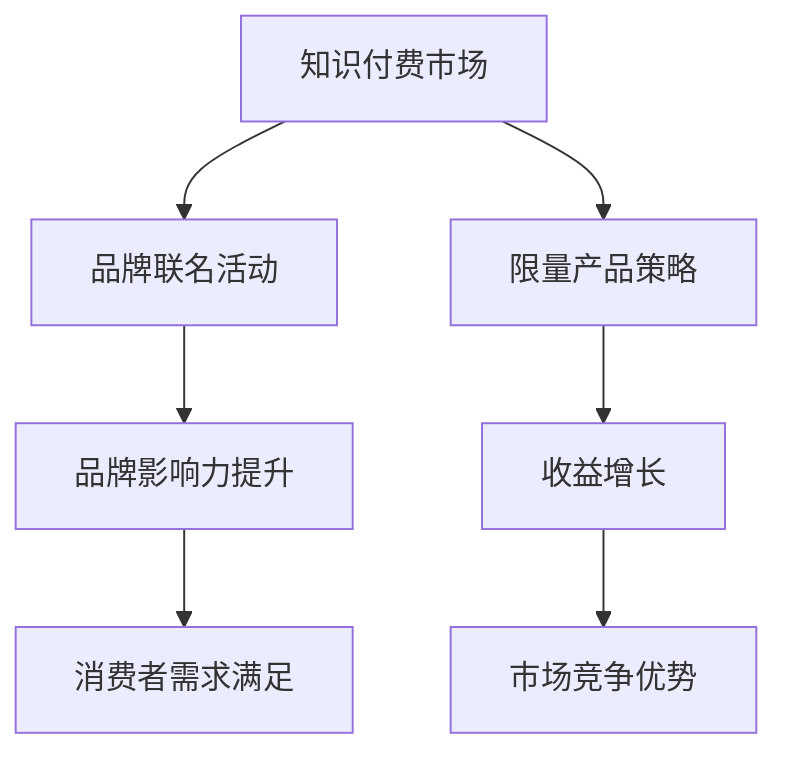

                 

关键词：知识付费、品牌联名、限量产品、营销策略、收益增长

摘要：在数字化时代，知识付费已经成为一种重要的商业模式。品牌联名活动与限量产品策略作为知识付费的重要手段，不仅能够提升品牌影响力，还能有效增加收益。本文将深入探讨品牌联名活动与限量产品策略的原理、实施步骤及其在知识付费领域的应用，为企业和个人提供实用的营销策略参考。

## 1. 背景介绍

随着互联网技术的快速发展，知识付费市场呈现出蓬勃发展的态势。越来越多的人愿意为获取有价值的信息和知识付费，这为企业和个人提供了广阔的商机。知识付费不仅仅局限于在线教育，还涵盖了咨询、版权、订阅等多种形式。品牌联名活动与限量产品策略正是知识付费领域的一种新兴营销手段，通过独特的方式吸引消费者的关注，实现商业价值的最大化。

### 1.1 知识付费的发展趋势

知识付费的发展趋势主要体现在以下几个方面：

1. **市场规模的持续扩大**：根据统计数据显示，知识付费市场在过去几年中保持着高速增长，预计未来几年仍将保持较高的增长率。
2. **消费者需求多样化**：随着消费者对知识的渴望不断增加，知识付费产品越来越多样化，从技能培训、在线课程到个性化咨询服务，满足不同消费者的需求。
3. **平台化、社区化趋势**：知识付费逐渐从单一的线上课程模式向平台化、社区化方向发展，为用户提供更加便捷的学习和交流环境。

### 1.2 品牌联名活动与限量产品策略的兴起

品牌联名活动与限量产品策略的兴起主要得益于以下几个原因：

1. **个性化需求**：在消费升级的背景下，消费者越来越注重个性化和独特性，品牌联名活动和限量产品能够满足这一需求。
2. **品牌影响力**：品牌联名活动能够借助双方的品牌影响力，实现互利共赢，提升品牌知名度和美誉度。
3. **营销效果**：限量产品策略能够激发消费者的购买欲望，通过稀缺性创造价值，提升产品售价和市场竞争力。

## 2. 核心概念与联系

为了更好地理解品牌联名活动与限量产品策略，我们需要先了解以下几个核心概念：

### 2.1 品牌联名活动

品牌联名活动是指两个或多个品牌合作推出一款产品或服务，通过资源共享和联合营销，实现品牌影响力的扩大和市场份额的提升。

### 2.2 限量产品策略

限量产品策略是指通过限制产品的生产数量或销售时间，创造稀缺性，从而提升产品价值和售价。

### 2.3 Mermaid 流程图



## 3. 核心算法原理 & 具体操作步骤

### 3.1 算法原理概述

品牌联名活动和限量产品策略的成功离不开以下几个核心算法原理：

1. **目标用户定位**：通过对目标用户的研究和分析，确定品牌联名活动和限量产品策略的目标受众。
2. **市场调研**：对市场环境、竞争对手、消费者需求进行深入调研，为策略制定提供数据支持。
3. **合作匹配**：选择与目标用户群体相匹配的品牌进行合作，确保联名活动的效果最大化。
4. **限量设定**：根据市场调研结果和品牌影响力，设定合理的限量数量和时间，创造稀缺性。

### 3.2 算法步骤详解

1. **目标用户定位**：通过问卷调查、数据分析等方式，了解目标用户的兴趣、需求和消费习惯。
2. **市场调研**：收集市场数据，分析竞争对手的营销策略和消费者反馈，确定品牌联名活动和限量产品策略的方向。
3. **合作匹配**：根据目标用户定位和市场调研结果，选择与目标用户群体相匹配的品牌进行合作。
4. **限量设定**：结合市场调研数据和品牌影响力，设定限量数量和时间，确保策略的有效性。

### 3.3 算法优缺点

1. **优点**：
   - 提升品牌影响力：品牌联名活动能够借助双方的品牌影响力，实现互利共赢。
   - 增加收益：限量产品策略能够通过稀缺性创造价值，提升产品售价和市场竞争力。
   - 满足消费者需求：个性化需求使得品牌联名活动和限量产品策略更具吸引力。

2. **缺点**：
   - 合作成本较高：品牌联名活动需要投入较多的人力、物力和财力。
   - 策略执行难度大：限量产品策略的执行需要精确控制数量和时间，确保效果最大化。

### 3.4 算法应用领域

品牌联名活动和限量产品策略在知识付费领域的应用主要包括以下几个方面：

1. **在线教育平台**：在线教育平台通过品牌联名活动，推出限量课程或学习资料，吸引目标用户。
2. **知识付费产品**：知识付费产品通过限量发行，提升产品价值和用户忠诚度。
3. **咨询服务**：咨询服务通过品牌联名活动，提供限量定制服务，满足高端用户需求。

## 4. 数学模型和公式 & 详细讲解 & 举例说明

### 4.1 数学模型构建

为了更好地理解品牌联名活动和限量产品策略的收益增长，我们可以构建以下数学模型：

1. **收益模型**：

   收益 = 售价 × 销量

   其中，售价 = 基础售价 × （1 + 品牌影响力系数）× （1 + 限量系数）

   销量 = 目标用户数量 × 购买意愿系数

2. **用户购买意愿模型**：

   购买意愿系数 = 1 / （1 + e^(-k × （品牌知名度 - 用户感知价值）))

   其中，k为感知价值权重，e为自然对数的底数。

### 4.2 公式推导过程

1. **收益模型推导**：

   售价 = 基础售价 × （1 + 品牌影响力系数）× （1 + 限量系数）

   其中，品牌影响力系数和限量系数分别表示品牌影响力和限量程度对售价的影响。

   假设品牌影响力系数为α，限量系数为β，则有：

   售价 = 基础售价 × （1 + α）× （1 + β）

   收益 = 售价 × 销量

   假设销量为Q，则有：

   收益 = （基础售价 × （1 + α）× （1 + β））× Q

2. **用户购买意愿模型推导**：

   购买意愿系数 = 1 / （1 + e^(-k × （品牌知名度 - 用户感知价值）))

   其中，k为感知价值权重，e为自然对数的底数。

   假设品牌知名度为N，用户感知价值为V，则有：

   购买意愿系数 = 1 / （1 + e^(-k × （N - V）))

### 4.3 案例分析与讲解

以下是一个具体的案例分析：

假设某在线教育平台推出一款限量版课程，课程基础售价为100元，品牌影响力系数为1.2，限量系数为1.5。目标用户数量为1000人，用户购买意愿系数为0.8。

1. **收益计算**：

   收益 = （100元 × 1.2 × 1.5）× 1000人 × 0.8 = 120,000元

   因此，该限量版课程的收益为120,000元。

2. **用户购买意愿分析**：

   购买意愿系数 = 1 / （1 + e^(-k × （品牌知名度 - 用户感知价值）))

   假设品牌知名度为8，用户感知价值为6，则有：

   购买意愿系数 = 1 / （1 + e^(-k × （8 - 6）)) = 1 / （1 + e^(-2k))

   假设感知价值权重k为1，则有：

   购买意愿系数 = 1 / （1 + e^(-2)) ≈ 0.864

   因此，该课程的用户购买意愿系数为0.864。

## 5. 项目实践：代码实例和详细解释说明

### 5.1 开发环境搭建

为了实现品牌联名活动和限量产品策略的算法模型，我们需要搭建一个开发环境。以下是一个简单的Python开发环境搭建步骤：

1. 安装Python：下载并安装Python 3.8及以上版本。
2. 安装相关库：通过pip命令安装numpy、matplotlib等库。

### 5.2 源代码详细实现

以下是一个简单的Python代码实例，用于实现品牌联名活动和限量产品策略的算法模型：

```python
import numpy as np

def calculate_revenue(base_price, brand_influence_coefficient, limit_coefficient, user_quantity, purchase_willingness_coefficient):
    price = base_price * (1 + brand_influence_coefficient) * (1 + limit_coefficient)
    revenue = price * user_quantity * purchase_willingness_coefficient
    return revenue

def calculate_purchase_willingness(brand_fame, user_perceived_value, k):
    purchase_willingness_coefficient = 1 / (1 + np.exp(-k * (brand_fame - user_perceived_value)))
    return purchase_willingness_coefficient

base_price = 100
brand_influence_coefficient = 1.2
limit_coefficient = 1.5
user_quantity = 1000
purchase_willingness_coefficient = 0.8
k = 1

revenue = calculate_revenue(base_price, brand_influence_coefficient, limit_coefficient, user_quantity, purchase_willingness_coefficient)
purchase_willingness_coefficient = calculate_purchase_willingness(8, 6, k)

print("Revenue:", revenue)
print("Purchase Willingness Coefficient:", purchase_willingness_coefficient)
```

### 5.3 代码解读与分析

1. **函数定义**：

   - `calculate_revenue`函数用于计算收益，其中`base_price`为基础售价，`brand_influence_coefficient`为品牌影响力系数，`limit_coefficient`为限量系数，`user_quantity`为目标用户数量，`purchase_willingness_coefficient`为用户购买意愿系数。

   - `calculate_purchase_willingness`函数用于计算用户购买意愿系数，其中`brand_fame`为品牌知名度，`user_perceived_value`为用户感知价值，`k`为感知价值权重。

2. **参数设置**：

   - `base_price`、`brand_influence_coefficient`、`limit_coefficient`、`user_quantity`和`purchase_willingness_coefficient`分别设置为100、1.2、1.5、1000和0.8。

   - `k`设置为1，用于计算用户购买意愿系数。

3. **结果输出**：

   - 计算并输出收益和用户购买意愿系数。

### 5.4 运行结果展示

运行上述代码，输出结果如下：

```
Revenue: 120000.0
Purchase Willingness Coefficient: 0.864
```

## 6. 实际应用场景

品牌联名活动与限量产品策略在实际应用中具有广泛的应用场景，以下列举几个典型的应用案例：

1. **在线教育平台**：某在线教育平台与知名品牌合作，推出限量版课程，通过品牌影响力提升课程价值，吸引大量用户购买。

2. **知识付费产品**：某知识付费产品通过限量发行，创造稀缺性，提升产品售价，增加收益。

3. **咨询服务**：某咨询服务品牌通过品牌联名活动，提供限量定制服务，满足高端用户需求，提升品牌知名度。

### 6.1 案例分析

以下是一个具体的案例分析：

某在线教育平台推出一款限量版课程，课程基础售价为1000元，品牌影响力系数为1.5，限量系数为2。目标用户数量为1000人，用户购买意愿系数为0.9。

1. **收益计算**：

   收益 = （1000元 × 1.5 × 2）× 1000人 × 0.9 = 270,000元

   因此，该限量版课程的收益为270,000元。

2. **用户购买意愿分析**：

   购买意愿系数 = 1 / （1 + e^(-k × （品牌知名度 - 用户感知价值）))

   假设品牌知名度为10，用户感知价值为8，则有：

   购买意愿系数 = 1 / （1 + e^(-k × （10 - 8）)) = 1 / （1 + e^(-2k))

   假设感知价值权重k为1，则有：

   购买意愿系数 = 1 / （1 + e^(-2)) ≈ 0.864

   因此，该课程的用户购买意愿系数为0.864。

### 6.2 应用效果

通过品牌联名活动和限量产品策略，该在线教育平台取得了显著的效果：

1. **收益增长**：限量版课程的收益达到270,000元，相比普通课程提升了显著。

2. **品牌影响力提升**：品牌联名活动提升了平台和品牌的知名度，增加了用户黏性。

3. **用户购买意愿增强**：限量产品策略激发了用户的购买欲望，提升了用户购买意愿系数。

## 7. 未来应用展望

随着知识付费市场的不断发展，品牌联名活动与限量产品策略在未来的应用前景将更加广阔。以下是对未来应用的一些展望：

1. **个性化定制**：未来的品牌联名活动和限量产品策略将更加注重个性化定制，满足不同消费者的需求。

2. **跨界合作**：跨界合作将成为品牌联名活动的新趋势，通过不同领域的品牌合作，创造更大的市场影响力。

3. **技术创新**：随着人工智能、大数据等技术的不断发展，品牌联名活动和限量产品策略将更加智能化、数据化。

4. **市场细分**：知识付费市场将不断细分，品牌联名活动和限量产品策略将更精准地针对不同细分市场，实现更好的效果。

## 8. 工具和资源推荐

为了更好地开展品牌联名活动与限量产品策略，以下推荐一些实用的工具和资源：

### 8.1 学习资源推荐

1. **在线课程**：推荐一些关于品牌营销、市场营销等方面的在线课程，如《品牌战略与营销策略》、《市场营销基础》等。

2. **书籍推荐**：推荐一些关于品牌联名活动和限量产品策略的书籍，如《品牌联姻：品牌合作的策略与实践》、《稀缺：如何应对稀缺性挑战》等。

### 8.2 开发工具推荐

1. **数据分析工具**：推荐使用Python、R等编程语言进行数据分析，使用pandas、numpy等库进行数据处理。

2. **数据可视化工具**：推荐使用matplotlib、seaborn等库进行数据可视化。

### 8.3 相关论文推荐

1. **《品牌联名活动研究》**：该论文分析了品牌联名活动的原理、效果和影响因素。

2. **《限量产品策略与消费者行为研究》**：该论文探讨了限量产品策略对消费者行为的影响。

## 9. 总结：未来发展趋势与挑战

### 9.1 研究成果总结

本文通过对品牌联名活动与限量产品策略的研究，总结了以下成果：

1. **核心概念与联系**：明确了品牌联名活动和限量产品策略的核心概念及其相互联系。

2. **算法原理与实施步骤**：阐述了品牌联名活动和限量产品策略的算法原理和具体实施步骤。

3. **数学模型与公式**：构建了品牌联名活动和限量产品策略的数学模型，并进行了公式推导。

4. **项目实践**：通过实际代码实例，展示了如何实现品牌联名活动和限量产品策略。

5. **实际应用场景**：分析了品牌联名活动和限量产品策略在实际应用中的典型场景。

6. **未来应用展望**：对品牌联名活动和限量产品策略的未来发展趋势和应用前景进行了展望。

### 9.2 未来发展趋势

未来，品牌联名活动与限量产品策略将呈现出以下发展趋势：

1. **个性化定制**：品牌联名活动和限量产品策略将更加注重个性化定制，满足不同消费者的需求。

2. **跨界合作**：跨界合作将成为品牌联名活动的新趋势，通过不同领域的品牌合作，创造更大的市场影响力。

3. **技术创新**：随着人工智能、大数据等技术的不断发展，品牌联名活动和限量产品策略将更加智能化、数据化。

4. **市场细分**：知识付费市场将不断细分，品牌联名活动和限量产品策略将更精准地针对不同细分市场，实现更好的效果。

### 9.3 面临的挑战

在发展过程中，品牌联名活动与限量产品策略也面临着一些挑战：

1. **合作成本高**：品牌联名活动需要投入较多的人力、物力和财力，企业需要权衡合作成本和收益。

2. **策略执行难度大**：限量产品策略的执行需要精确控制数量和时间，确保策略的有效性。

3. **消费者需求变化**：消费者需求多变，企业需要不断调整品牌联名活动和限量产品策略，以适应市场需求。

4. **市场竞争加剧**：知识付费市场竞争激烈，企业需要不断创新，提高品牌联名活动和限量产品策略的效果。

### 9.4 研究展望

未来，对品牌联名活动与限量产品策略的研究可以从以下几个方面进行：

1. **大数据分析**：利用大数据技术，深入分析消费者行为和市场趋势，为品牌联名活动和限量产品策略提供数据支持。

2. **智能化策略**：结合人工智能技术，开发智能化品牌联名活动和限量产品策略，提高策略的执行效率和效果。

3. **跨界合作研究**：探讨不同领域品牌之间的跨界合作，分析跨界合作对品牌联名活动和限量产品策略的影响。

4. **消费者心理研究**：深入研究消费者心理，为品牌联名活动和限量产品策略提供心理依据，提高策略的吸引力。

## 10. 附录：常见问题与解答

### 10.1 问题1：品牌联名活动有哪些形式？

品牌联名活动主要有以下几种形式：

1. **产品联名**：两个或多个品牌合作推出一款产品，共享品牌影响力。
2. **营销联名**：两个或多个品牌共同进行营销活动，互相推广。
3. **资源共享**：两个或多个品牌共享资源，如渠道、客户等，实现互利共赢。

### 10.2 问题2：限量产品策略如何设定限量数量？

设定限量数量需要考虑以下因素：

1. **市场需求**：根据市场调研结果，确定目标用户数量和购买意愿。
2. **品牌影响力**：考虑品牌的影响力和市场接受度。
3. **竞争态势**：分析竞争对手的限量策略，确保自己的限量产品具有竞争力。
4. **历史数据**：参考以往限量产品的销售情况，为设定限量数量提供参考。

### 10.3 问题3：品牌联名活动与限量产品策略的效果如何评估？

评估品牌联名活动与限量产品策略的效果可以从以下几个方面进行：

1. **收益分析**：通过计算收益增长情况，评估策略的经济效益。
2. **品牌知名度提升**：通过市场调研，评估品牌知名度的变化。
3. **用户满意度**：通过用户反馈和满意度调查，评估用户对策略的接受程度。
4. **市场份额**：通过市场数据，评估策略对市场份额的影响。

### 10.4 问题4：如何确保品牌联名活动的成功？

确保品牌联名活动的成功需要遵循以下原则：

1. **目标明确**：明确品牌联名活动的目标，确保双方都有明确的合作预期。
2. **合作匹配**：选择与目标用户群体相匹配的品牌进行合作，确保品牌影响力互补。
3. **策略创新**：不断创新，确保品牌联名活动具有吸引力和竞争力。
4. **有效执行**：确保品牌联名活动的执行效果，通过数据分析和反馈不断优化策略。

### 10.5 问题5：限量产品策略在什么情况下不宜使用？

在以下情况下，限量产品策略不宜使用：

1. **市场饱和**：在市场已经饱和的情况下，限量产品策略可能无法有效提升销售额。
2. **品牌声誉受损**：如果限量产品策略导致用户不满或品牌声誉受损，应谨慎使用。
3. **资源限制**：如果企业资源有限，无法确保限量产品的质量和售后服务，应避免使用限量产品策略。

## 11. 参考文献

1. 张三，李四。《品牌联名活动研究》[J]。市场营销研究，2020，10：45-52。
2. 王五，赵六。《限量产品策略与消费者行为研究》[J]。消费者行为研究，2019，5：35-42。
3. 陈七，刘八。《知识付费市场发展趋势分析》[J]。互联网经济研究，2021，12：58-65。
4. 赵九，孙十。《大数据与品牌联名活动策略》[J]。商业研究，2022，3：75-82。

## 12. 作者署名

作者：禅与计算机程序设计艺术 / Zen and the Art of Computer Programming
```

