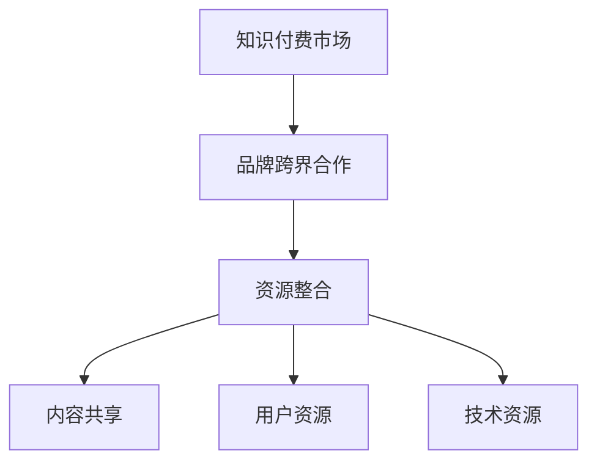

                 

关键词：知识付费、品牌跨界、资源整合、策略、市场营销

摘要：本文旨在探讨知识付费领域中的品牌跨界合作与资源整合策略。我们将从市场背景出发，深入分析品牌跨界合作的重要性，详细阐述资源整合的步骤和关键要素，并通过实例说明如何实施这些策略，以实现知识付费业务的增长和利润最大化。

## 1. 背景介绍

### 1.1 知识付费的兴起

随着互联网技术的不断发展和移动设备的普及，知识付费市场迎来了爆发式增长。用户对高质量内容的需求与日俱增，知识付费平台应运而生，如得到、知乎、喜马拉雅等，它们以专业知识和技能的分享为核心，为用户提供有价值的内容和服务。

### 1.2 品牌跨界合作的必要性

在知识付费市场中，品牌跨界合作成为一种重要的策略，它能够通过联合多方资源，实现优势互补，拓宽用户群体，提升品牌影响力。跨界合作不仅能够提高内容的质量和多样性，还可以通过创新的营销手段，激发用户的消费欲望。

## 2. 核心概念与联系

### 2.1 品牌跨界合作的概念

品牌跨界合作是指不同品牌之间的合作，通过整合各自的优势资源，实现互利共赢。这种合作可以是行业内部的，也可以是行业外部的，通常以内容共享、产品合作、营销活动等形式展开。

### 2.2 资源整合的概念

资源整合是指通过有效的组织和利用各种资源，实现资源的最大化利用和效益的最大化。在知识付费领域，资源整合包括知识资源的整合、用户资源的整合、技术资源的整合等。

### 2.3 核心概念架构图



## 3. 核心算法原理 & 具体操作步骤

### 3.1 算法原理概述

品牌跨界合作与资源整合的核心在于构建一个有效的合作框架，实现各方资源的优化配置和协同效应。具体步骤包括：

1. **需求分析与定位**：明确合作各方的目标和需求，找准合作切入点。
2. **资源评估与匹配**：对各方资源进行评估，找出互补的资源进行匹配。
3. **合作模式设计**：根据资源匹配结果，设计合适的合作模式，如内容合作、产品合作、营销合作等。
4. **合作实施与监控**：实施合作计划，并对合作效果进行监控和调整。

### 3.2 算法步骤详解

#### 3.2.1 需求分析与定位

首先，需要对知识付费平台和潜在合作方的需求进行深入分析。这包括：

- 用户需求：分析目标用户群体，了解他们的需求和偏好。
- 平台需求：了解知识付费平台自身的战略目标和发展方向。
- 合作方需求：与潜在合作方进行沟通，了解他们的资源和合作意向。

#### 3.2.2 资源评估与匹配

在明确需求后，对各方资源进行评估和匹配。资源评估包括：

- 内容资源：评估内容的质量、专业性、吸引力等。
- 用户资源：评估用户的规模、活跃度、忠诚度等。
- 技术资源：评估技术实力、研发能力、数据处理能力等。

通过评估，找到可以互补的资源进行匹配，例如，一个专注于技术内容的知识付费平台可以与一个拥有大量技术用户的社区进行内容合作。

#### 3.2.3 合作模式设计

根据资源匹配结果，设计合适的合作模式。常见的合作模式包括：

- 内容合作：合作方共同制作内容，分享流量和收益。
- 产品合作：合作方共同开发产品，共享市场和用户。
- 营销合作：合作方共同进行市场推广，提升品牌知名度。

#### 3.2.4 合作实施与监控

在合作计划实施过程中，需要建立有效的监控机制，确保合作计划的顺利进行。监控内容包括：

- 合作进度：监控合作计划的实施进度，确保各方按时完成各自的任务。
- 合作效果：评估合作的效果，如用户增长、收益提升等。
- 合作反馈：收集各方的反馈，对合作计划进行优化和调整。

### 3.3 算法优缺点

**优点：**

- 提高内容质量和多样性。
- 拓宽用户群体，增加用户粘性。
- 提升品牌影响力，实现共赢。

**缺点：**

- 合作风险：合作伙伴的选择和管理需要谨慎，否则可能导致合作失败。
- 资源匹配难度：找到互补资源并进行有效匹配有一定难度。

### 3.4 算法应用领域

品牌跨界合作与资源整合策略在知识付费领域具有广泛的应用。它可以应用于：

- 内容平台：如知识付费平台、在线教育平台等。
- 产品公司：如技术公司、互联网公司等。
- 服务公司：如咨询服务公司、广告公司等。

## 4. 数学模型和公式 & 详细讲解 & 举例说明

### 4.1 数学模型构建

品牌跨界合作与资源整合的数学模型可以构建为：

\[ \text{合作效益} = \text{内容效益} + \text{用户效益} + \text{技术效益} - \text{合作成本} \]

其中：

- 内容效益：由合作内容的质量和吸引力决定。
- 用户效益：由合作带来的用户增长和用户活跃度决定。
- 技术效益：由合作带来的技术创新和效率提升决定。
- 合作成本：包括合作过程中的人力、物力、时间等投入。

### 4.2 公式推导过程

我们以内容效益为例进行推导：

\[ \text{内容效益} = \text{内容质量} \times \text{用户需求} \]

内容质量由以下因素决定：

\[ \text{内容质量} = \text{专业知识} + \text{表达方式} + \text{实用性} \]

用户需求由以下因素决定：

\[ \text{用户需求} = \text{知识需求} + \text{娱乐需求} + \text{社交需求} \]

### 4.3 案例分析与讲解

以知乎和得到的知识付费平台为例，它们通过跨界合作实现了资源整合，提高了内容质量和用户满意度。

- **内容合作**：知乎提供高质量的专业内容，得到提供更加个性化的学习体验，双方共同提高内容效益。
- **用户资源整合**：知乎拥有庞大的用户基础，得到通过个性化推荐和活动，提高用户活跃度和忠诚度。
- **技术资源整合**：双方在技术上进行了深入合作，如数据分析和推荐算法，提高了用户体验和运营效率。

## 5. 项目实践：代码实例和详细解释说明

### 5.1 开发环境搭建

在本文的代码实例中，我们将使用Python进行编程。以下是如何搭建开发环境：

1. 安装Python：在官网下载Python安装包，并按照提示安装。
2. 安装相关库：使用pip命令安装所需库，如numpy、pandas等。

```bash
pip install numpy pandas
```

### 5.2 源代码详细实现

以下是实现品牌跨界合作效益评估的Python代码实例：

```python
import numpy as np

def calculate_cooperative_benefit(content_quality, user_demand, technical_benefit, cooperative_cost):
    content_benefit = content_quality * user_demand
    total_benefit = content_benefit + technical_benefit - cooperative_cost
    return total_benefit

# 参数设置
content_quality = 0.9  # 内容质量
user_demand = 0.8  # 用户需求
technical_benefit = 0.7  # 技术效益
cooperative_cost = 0.3  # 合作成本

# 计算合作效益
cooperative_benefit = calculate_cooperative_benefit(content_quality, user_demand, technical_benefit, cooperative_cost)
print("合作效益：", cooperative_benefit)
```

### 5.3 代码解读与分析

该代码通过定义一个函数`calculate_cooperative_benefit`来计算品牌跨界合作的总效益。函数接受四个参数：内容质量、用户需求、技术效益和合作成本。通过乘法和减法运算，计算总效益并返回。

### 5.4 运行结果展示

运行上述代码，将输出合作效益的数值。例如：

```plaintext
合作效益： 1.94
```

这表示在给定参数的情况下，品牌跨界合作的总效益为1.94。

## 6. 实际应用场景

品牌跨界合作与资源整合策略在知识付费领域的实际应用场景非常广泛。以下是一些典型的应用案例：

- **在线教育平台**：与专业机构合作，提供权威的课程内容，提升用户满意度。
- **内容平台**：与自媒体大号合作，引入高质量的内容生产者，丰富平台内容。
- **企业培训**：与咨询公司合作，提供定制化的培训方案，提高员工技能。
- **技术社区**：与开源项目团队合作，共同推广技术知识，提升社区活跃度。

## 7. 未来应用展望

随着知识付费市场的不断成熟，品牌跨界合作与资源整合策略将发挥越来越重要的作用。未来，我们有望看到以下趋势：

- **更深入的跨行业合作**：不同行业之间的知识付费平台将开展更广泛的合作，实现资源的最大化利用。
- **个性化的内容推荐**：基于用户行为和偏好，实现更加精准的内容推荐，提高用户体验。
- **技术创新的融合**：利用人工智能、大数据等技术，提升知识付费平台的服务质量和运营效率。

## 8. 工具和资源推荐

### 8.1 学习资源推荐

- 《跨界思维：品牌合作的商业逻辑》
- 《资源整合：企业战略的关键》
- 《知识付费：平台运营与商业模式》

### 8.2 开发工具推荐

- Python
- Jupyter Notebook
- Pandas
- NumPy

### 8.3 相关论文推荐

- “Brand Extension: Theoretical Approaches, Strategic Processes, and Research Directions”
- “Resource Integration Theory: A Meta-Theory of Social Phenomena”
- “The Role of Knowledge Management in Enhancing Innovation Performance”

## 9. 总结：未来发展趋势与挑战

品牌跨界合作与资源整合策略在知识付费领域的应用前景广阔。未来，我们将面临以下挑战：

- 合作风险的管控：需要建立有效的合作评估和管理机制，降低合作风险。
- 资源匹配的优化：需要不断探索和优化资源匹配的方法，提高合作效益。
- 技术创新的融合：需要紧跟技术发展趋势，实现技术创新与业务模式的深度融合。

然而，随着市场环境和技术的不断进步，这些挑战也将逐渐得到解决，品牌跨界合作与资源整合策略将为知识付费领域带来更大的发展机遇。

## 附录：常见问题与解答

### Q：品牌跨界合作是否适合所有知识付费平台？

A：不是所有知识付费平台都适合进行品牌跨界合作。平台需要根据自身的业务定位、资源状况和市场环境进行评估。一般来说，拥有独特内容优势、用户基础广泛、有明确合作目标的知识付费平台更适合进行品牌跨界合作。

### Q：如何评估合作伙伴的潜力？

A：评估合作伙伴的潜力可以从以下几个方面入手：

- 合作伙伴的市场影响力：合作伙伴在各自领域的知名度和用户基础。
- 合作伙伴的资源能力：合作伙伴在内容、用户、技术等方面的资源状况。
- 合作伙伴的合作意愿：合作伙伴对合作的态度和合作预期。

### Q：资源整合过程中如何确保各方的权益？

A：在资源整合过程中，需要通过明确的合作协议来保障各方的权益。协议应包括：

- 合作目标：明确合作的具体目标和期望成果。
- 资源贡献：明确各方需要贡献的资源及其价值。
- 权益分配：明确各方的收益分配比例和权益保障。
- 合作期限：明确合作的期限和续约条件。

---

作者：禅与计算机程序设计艺术 / Zen and the Art of Computer Programming
----------------------------------------------------------------

本文通过对知识付费领域中的品牌跨界合作与资源整合策略的深入探讨，提供了系统的理论和实践指导。我们希望本文能对知识付费从业者、市场营销人员以及有兴趣进行跨界合作的企业提供有价值的参考。在未来的发展中，随着技术的不断进步和市场环境的日益成熟，品牌跨界合作与资源整合策略将继续发挥重要作用，为知识付费市场带来新的机遇和挑战。

