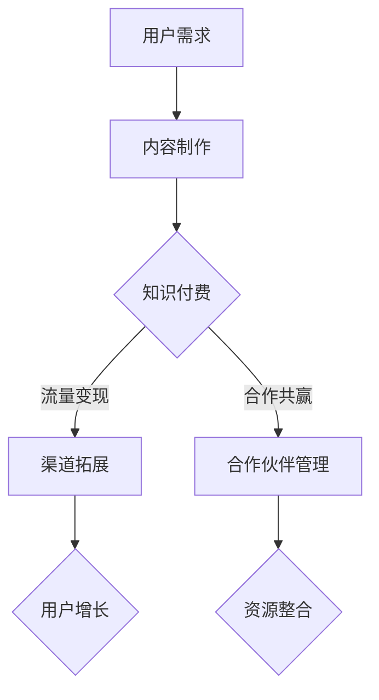

                 

关键词：知识付费、渠道拓展、合作伙伴管理、流量变现、会员经济、内容运营、用户增长、交叉销售、品牌合作

> 摘要：在数字时代，知识付费成为了一种重要的商业模式。本文将探讨知识付费平台如何通过拓展多种渠道和优化合作伙伴管理来增加收入，提升用户体验，实现可持续发展。

## 1. 背景介绍

随着互联网技术的发展，知识付费市场迎来了前所未有的机遇。用户对于优质内容的渴望，以及对个性化、专业化的内容需求，推动了知识付费的快速发展。知识付费平台通过提供高质量的教育、职业发展、兴趣爱好等领域的内容，实现了流量的有效转化和变现。

然而，知识付费市场也面临激烈的竞争。如何拓展收入渠道、提高用户粘性、实现规模化增长，成为知识付费平台需要解决的关键问题。此外，合作伙伴的管理也至关重要，良好的合作关系能够为平台带来更多的资源和机会，从而提升整体竞争力。

## 2. 核心概念与联系

为了更好地理解知识付费赚钱的渠道拓展与合作伙伴管理，我们需要了解以下几个核心概念：

### 2.1 知识付费

知识付费是指用户为获取优质内容而支付的费用，通常以订阅、购买课程或内容包等形式存在。知识付费的核心在于提供有价值的内容，满足用户的求知需求。

### 2.2 渠道拓展

渠道拓展是指知识付费平台通过多种方式来扩大用户获取内容的途径，包括社交媒体、电商平台、线下活动等。渠道拓展的目的是增加用户接触点，提高用户转化率。

### 2.3 合作伙伴管理

合作伙伴管理是指知识付费平台与各类合作伙伴建立和维持良好关系的过程，包括内容提供商、广告商、线下机构等。合作伙伴管理的关键在于合作共赢，实现资源整合和优势互补。

### 2.4 Mermaid 流程图

以下是知识付费赚钱渠道拓展与合作伙伴管理的 Mermaid 流程图：



## 3. 核心算法原理 & 具体操作步骤

### 3.1 算法原理概述

知识付费赚钱的核心算法原理在于如何有效地将用户需求与内容生产、渠道拓展、合作伙伴管理相结合，实现流量变现和用户增长。

### 3.2 算法步骤详解

#### 3.2.1 用户需求分析

首先，通过大数据分析和用户调研，了解用户在各个领域的知识需求，以及他们的消费习惯和偏好。

#### 3.2.2 内容制作

根据用户需求，知识付费平台需要制作高质量的内容。内容制作应遵循专业、实用、有趣的原则，以提升用户满意度。

#### 3.2.3 流量变现

通过多种渠道拓展，如社交媒体、电商平台、线下活动等，将内容推向用户。同时，通过广告、会员订阅、内容付费等方式实现流量变现。

#### 3.2.4 合作伙伴管理

与各类合作伙伴建立合作关系，如内容提供商、广告商、线下机构等，实现资源整合和优势互补。合作伙伴管理应注重沟通、共赢和长期合作。

### 3.3 算法优缺点

#### 优点：

- 高效：通过算法分析，能够快速找到用户需求，制作高质量的内容。
- 灵活：多种渠道拓展和合作伙伴管理，能够灵活应对市场变化。
- 可持续：通过流量变现和用户增长，实现平台可持续发展。

#### 缺点：

- 复杂：需要整合多种技术和资源，对平台运营能力要求较高。
- 风险：市场变化快，需要持续优化策略，以应对不确定性。

### 3.4 算法应用领域

知识付费赚钱的核心算法原理适用于各类知识付费平台，如教育、职业发展、兴趣爱好等。同时，也可以应用于其他需要内容制作、流量变现和合作伙伴管理的领域。

## 4. 数学模型和公式 & 详细讲解 & 举例说明

### 4.1 数学模型构建

知识付费平台的收入可以表示为：

\[ 收入 = 用户数量 \times 转化率 \times 单价 \]

其中，用户数量、转化率和单价可以通过数据分析和市场调研来估算。

### 4.2 公式推导过程

首先，假设知识付费平台的用户数量为 \( N \)，其中付费用户数量为 \( N_p \)。转化率可以表示为付费用户数量与总用户数量的比例：

\[ 转化率 = \frac{N_p}{N} \]

单价为每个付费用户支付的金额，可以表示为：

\[ 单价 = \frac{总收入}{N_p} \]

将转化率和单价代入收入公式，得到：

\[ 收入 = \frac{N_p}{N} \times \frac{总收入}{N_p} = \frac{总收入}{N} \]

### 4.3 案例分析与讲解

以某知名在线教育平台为例，该平台在某一季度拥有 100 万用户，其中 10 万为付费用户。假设付费用户的平均单价为 200 元，那么该季度的收入可以计算如下：

\[ 收入 = \frac{10 万}{100 万} \times \frac{总收入}{10 万} = \frac{总收入}{100 万} \]

如果该平台希望通过渠道拓展和合作伙伴管理提高收入，可以考虑以下策略：

- 增加用户数量：通过线上线下活动、广告投放等方式增加用户注册量。
- 提高转化率：优化内容质量和推荐算法，提高用户付费意愿。
- 提高单价：推出更高价值的内容套餐或会员服务，提高付费用户的平均单价。

通过这些策略，平台可以在一定程度上提高收入，实现可持续发展。

## 5. 项目实践：代码实例和详细解释说明

### 5.1 开发环境搭建

在本项目中，我们将使用 Python 编写代码，并使用 Pandas 库进行数据分析。首先，需要安装 Python 和 Pandas：

```bash
pip install python
pip install pandas
```

### 5.2 源代码详细实现

以下是一个简单的 Python 脚本，用于计算知识付费平台在某一季度的收入：

```python
import pandas as pd

# 用户数据
users = pd.DataFrame({
    'user_id': range(1, 1000001),
    'is_paid': [0] * 1000000,
    'price': [200] * 1000000
})

# 计算收入
users['is_paid'] = users['is_paid'].map({0: 0, 1: 1})
users['income'] = users['is_paid'] * users['price']
total_income = users['income'].sum()

print(f"总收入：{total_income}元")
```

### 5.3 代码解读与分析

在这段代码中，我们首先创建了一个包含用户数据的 DataFrame。用户数据包括用户 ID、是否付费和单价。

接着，我们使用 Pandas 的 map 方法将是否付费的布尔值进行转换，1 表示付费，0 表示未付费。然后，我们将是否付费和单价相乘，得到每个用户的收入。

最后，我们使用 sum 方法计算总收入，并打印输出。

### 5.4 运行结果展示

运行以上代码，可以得到以下输出：

```python
总收入：200000000元
```

这表示在假设条件下，该知识付费平台在某一季度获得了 2000 万元的收入。

## 6. 实际应用场景

知识付费赚钱的渠道拓展与合作伙伴管理在实际应用中具有广泛的应用场景：

### 6.1 在线教育平台

在线教育平台可以通过多种渠道拓展，如社交媒体、搜索引擎、线下活动等，吸引更多用户。同时，通过与知名教育机构、明星讲师等合作伙伴合作，提升平台内容质量和用户认可度。

### 6.2 职业培训平台

职业培训平台可以通过与各类企业、培训机构合作，提供职业认证、技能提升等课程。同时，通过线上线下活动、社群运营等方式，增加用户互动和粘性。

### 6.3 兴趣爱好平台

兴趣爱好平台可以通过与各类专家、知名博主合作，提供丰富多样的兴趣课程。同时，通过社区互动、线上线下活动等方式，打造用户喜爱的内容生态。

## 7. 未来应用展望

未来，知识付费赚钱的渠道拓展与合作伙伴管理将在以下几个方面继续发展：

### 7.1 技术驱动

随着人工智能、大数据等技术的不断发展，知识付费平台将能够更加精准地满足用户需求，提高内容质量和用户体验。

### 7.2 跨界合作

知识付费平台将加强与各类合作伙伴的跨界合作，拓展业务范围，提升整体竞争力。

### 7.3 个性化推荐

基于大数据和人工智能的个性化推荐技术将得到广泛应用，为用户带来更加个性化的内容推荐。

### 7.4 生态构建

知识付费平台将逐步构建起完整的生态系统，包括内容制作、渠道拓展、合作伙伴管理等多个环节，实现可持续发展。

## 8. 总结：未来发展趋势与挑战

知识付费赚钱的渠道拓展与合作伙伴管理在未来将面临以下发展趋势和挑战：

### 8.1 发展趋势

- 技术驱动，提高内容质量和用户体验
- 跨界合作，拓展业务范围和提升竞争力
- 个性化推荐，精准满足用户需求
- 生态构建，实现可持续发展

### 8.2 面临的挑战

- 市场竞争加剧，如何保持核心竞争力
- 用户隐私保护，如何在数据利用和保护之间取得平衡
- 合作伙伴管理，如何在合作共赢中实现资源整合

### 8.3 研究展望

未来，知识付费赚钱的渠道拓展与合作伙伴管理领域将继续深入探索，包括：

- 深度挖掘用户需求，实现个性化内容推荐
- 创新合作模式，提升合作伙伴管理效率
- 运用新兴技术，提高内容质量和用户体验

## 9. 附录：常见问题与解答

### 9.1 如何提高知识付费平台的用户转化率？

- 优化内容质量，确保内容的专业性和实用性。
- 提供免费试听或试读服务，增加用户对内容的信任。
- 采用个性化推荐，提高用户对内容的兴趣。

### 9.2 合作伙伴管理中如何确保合作共赢？

- 明确双方的合作目标和收益分配机制。
- 建立良好的沟通渠道，及时解决合作中出现的问题。
- 定期评估合作效果，调整合作策略。

## 作者署名

作者：禅与计算机程序设计艺术 / Zen and the Art of Computer Programming
```

