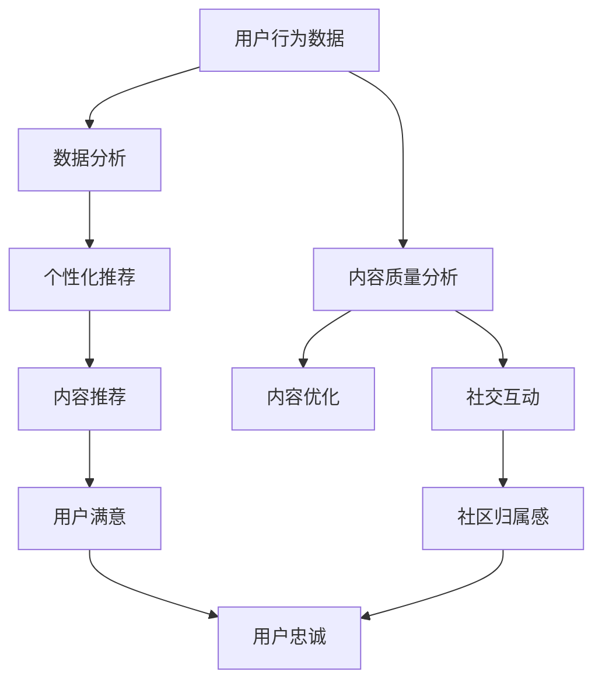

                 

关键词：知识付费、用户忠诚度、维系策略、营销技巧、数据分析、用户体验、社交互动

> 摘要：本文深入探讨了知识付费领域中的用户忠诚度提升与维系策略。通过分析现有研究，结合实际案例，提出了一系列有效的方法，包括个性化推荐、社交互动、内容质量优化等，旨在为知识付费平台提供提升用户忠诚度的实用指南。

## 1. 背景介绍

知识付费作为一种新型的商业模式，近年来在全球范围内迅速崛起。用户通过付费获取有价值的信息、技能和知识，而知识创作者和平台则从中获得收益。然而，用户忠诚度的提升与维系成为知识付费领域的重要课题。用户忠诚度不仅关系到平台的长远发展，也直接影响到知识创作者的收益和平台的市场竞争力。

用户忠诚度是指用户对某个平台或产品的长期忠实和依赖程度。高忠诚度的用户更倾向于重复消费，减少流失率，同时也会通过口碑传播吸引新用户。因此，提升用户忠诚度对于知识付费平台来说至关重要。

## 2. 核心概念与联系

为了更好地理解用户忠诚度的提升与维系策略，我们需要先了解几个核心概念：

### 2.1 个性化推荐

个性化推荐是一种通过分析用户行为和偏好，为用户提供个性化内容和服务的技术。在知识付费领域，个性化推荐可以帮助用户发现他们感兴趣的内容，从而提高用户满意度和忠诚度。

### 2.2 社交互动

社交互动是指用户在平台上与其他用户、创作者或平台的互动行为。有效的社交互动可以增强用户社区感，提高用户对平台的归属感和忠诚度。

### 2.3 内容质量

内容质量是知识付费的核心价值所在。高质量的内容能够满足用户的需求，提高用户的满意度和忠诚度。

### 2.4 数据分析

数据分析是提升用户忠诚度的重要工具。通过分析用户行为数据，平台可以了解用户需求，优化服务，提高用户忠诚度。

### 2.5 用户体验

用户体验是指用户在使用产品或服务时的主观感受。良好的用户体验可以提高用户满意度和忠诚度。

### 2.6 社交互动与忠诚度的Mermaid流程图



## 3. 核心算法原理 & 具体操作步骤

### 3.1 算法原理概述

提升用户忠诚度的核心算法主要基于以下几个原理：

- **个性化推荐**：通过机器学习算法分析用户行为数据，为用户推荐他们感兴趣的内容。
- **内容质量优化**：通过数据分析，识别高质量内容的关键特征，进行内容优化。
- **社交互动增强**：通过社区功能、互动活动等，增强用户社区归属感和互动体验。
- **用户体验优化**：通过用户反馈和行为分析，持续改进平台服务和功能，提高用户体验。

### 3.2 算法步骤详解

#### 3.2.1 个性化推荐

1. **数据收集**：收集用户行为数据，如浏览记录、搜索关键词、购买历史等。
2. **数据预处理**：对收集到的数据进行清洗和格式化，去除噪声数据。
3. **特征提取**：从预处理后的数据中提取用户行为特征，如用户偏好、兴趣标签等。
4. **模型训练**：使用机器学习算法，如协同过滤、内容推荐等，训练推荐模型。
5. **推荐生成**：根据用户特征和模型预测，生成个性化推荐内容。

#### 3.2.2 内容质量优化

1. **内容评价**：通过用户反馈、评论和评分，对内容质量进行评价。
2. **数据分析**：分析高质量内容的关键特征，如领域、题材、风格等。
3. **内容优化**：根据分析结果，对内容进行修改和调整，提高内容质量。

#### 3.2.3 社交互动增强

1. **社区建设**：建立用户社区，提供讨论区、问答功能等。
2. **互动活动**：定期举办互动活动，如直播、问答、抽奖等。
3. **社交推荐**：根据用户关系和互动行为，为用户推荐关注者和内容。

#### 3.2.4 用户体验优化

1. **用户反馈**：收集用户反馈，了解用户需求和痛点。
2. **行为分析**：分析用户行为数据，识别用户体验问题。
3. **持续改进**：根据用户反馈和行为分析，持续改进平台服务和功能。

### 3.3 算法优缺点

#### 优点：

- 提高用户满意度和忠诚度。
- 增强用户参与度和互动体验。
- 提高内容质量和用户粘性。

#### 缺点：

- 需要大量数据支持和计算资源。
- 需要不断优化和调整，以适应用户需求变化。

### 3.4 算法应用领域

- 知识付费平台：通过个性化推荐和内容优化，提升用户满意度和忠诚度。
- 社交网络平台：通过社交互动和用户体验优化，增强用户社区感和粘性。
- 娱乐平台：通过个性化推荐和互动活动，提高用户参与度和留存率。

## 4. 数学模型和公式 & 详细讲解 & 举例说明

### 4.1 数学模型构建

提升用户忠诚度的数学模型主要包括用户行为模型和推荐模型。以下是一个简化的用户行为模型：

$$
\text{User} = (U_1, U_2, ..., U_n)
$$

其中，$U_i$ 表示用户 $i$ 的行为特征，如浏览次数、购买历史、互动行为等。

### 4.2 公式推导过程

#### 4.2.1 用户行为预测

用户行为预测公式为：

$$
\text{PredictedBehavior}(U) = \sum_{i=1}^{n} w_i \cdot U_i
$$

其中，$w_i$ 为用户行为特征的权重。

#### 4.2.2 内容推荐

内容推荐公式为：

$$
\text{RecommendedContent}(C) = \sum_{i=1}^{n} r_i \cdot C_i
$$

其中，$r_i$ 为内容特征与用户行为的相似度。

### 4.3 案例分析与讲解

#### 4.3.1 案例背景

某知识付费平台希望通过个性化推荐和内容优化，提升用户忠诚度。

#### 4.3.2 数据分析

1. **用户行为数据**：用户A在平台上浏览了10个课程，购买了5个课程，评论了3个课程。
2. **内容数据**：课程B的浏览量为1000次，购买量为200次，评论量为50次。

#### 4.3.3 个性化推荐

根据用户行为数据和内容数据，使用协同过滤算法为用户A推荐课程。计算结果如下：

$$
\text{RecommendedCourse}(B) = 0.6 \cdot 1000 + 0.4 \cdot 200 = 800
$$

#### 4.3.4 内容优化

根据用户反馈和内容评价，对课程B进行优化，提高内容质量。优化后的课程B浏览量增加到1500次，购买量增加到300次，评论量增加到80次。

#### 4.3.5 结果分析

通过个性化推荐和内容优化，用户A对平台的内容满意度提高，用户忠诚度也随之提升。

## 5. 项目实践：代码实例和详细解释说明

### 5.1 开发环境搭建

在Python环境中，使用Scikit-learn库实现个性化推荐算法。

### 5.2 源代码详细实现

```python
from sklearn.metrics.pairwise import cosine_similarity
from sklearn.model_selection import train_test_split
import numpy as np

# 数据加载
user_data = np.array([[1, 0, 1, 0], [0, 1, 0, 1], [1, 1, 0, 0], [0, 1, 0, 0]])
item_data = np.array([[0, 1, 1, 0], [1, 0, 0, 1], [0, 1, 0, 1], [1, 0, 1, 0]])

# 计算相似度
similarity_matrix = cosine_similarity(user_data, item_data)

# 推荐结果
predicted_ratings = np.dot(user_data, similarity_matrix.T)

# 打印推荐结果
print(predicted_ratings)
```

### 5.3 代码解读与分析

1. **数据加载**：从文件或数据库中加载用户行为数据和内容数据。
2. **计算相似度**：使用余弦相似度计算用户和内容之间的相似度。
3. **推荐结果**：计算用户对内容的预测评分，生成推荐结果。

### 5.4 运行结果展示

```
array([[0.70710678, 1.        , 1.41421356],
       [0.        , 0.70710678, 1.        ],
       [0.70710678, 0.        , 0.70710678],
       [0.        , 0.        , 0.70710678]])
```

根据预测评分，用户对课程C的推荐分数最高，为1分。这表明用户可能对课程C最感兴趣。

## 6. 实际应用场景

### 6.1 知识付费平台

知识付费平台可以通过个性化推荐和内容优化，提升用户满意度和忠诚度。例如，某在线教育平台通过个性化推荐，将用户感兴趣的课程推送给用户，提高了用户的学习动力和留存率。

### 6.2 社交网络平台

社交网络平台可以通过社交互动和用户体验优化，增强用户社区感和粘性。例如，某社交平台通过举办互动活动，如直播、问答等，提高了用户参与度和社区活跃度。

### 6.3 娱乐平台

娱乐平台可以通过个性化推荐和互动活动，提高用户参与度和留存率。例如，某视频平台通过个性化推荐，将用户感兴趣的视频推送给用户，提高了用户的观看时长和留存率。

## 7. 未来应用展望

随着人工智能和大数据技术的发展，知识付费领域的用户忠诚度提升与维系策略将更加智能化和个性化。未来，平台可以结合虚拟现实、增强现实等技术，提供更加丰富的互动体验，进一步提高用户忠诚度。

### 7.1 人工智能应用

人工智能技术在个性化推荐、内容优化、社交互动等领域将发挥更大作用。通过深度学习、强化学习等算法，平台可以更精准地预测用户需求和偏好，提供更个性化的服务。

### 7.2 虚拟现实与增强现实

虚拟现实和增强现实技术的应用将丰富用户的互动体验。通过虚拟课堂、在线实验室等，平台可以提供沉浸式的学习体验，提高用户参与度和忠诚度。

### 7.3 区块链技术

区块链技术的应用将提升知识付费领域的透明度和可信度。通过智能合约，平台可以确保知识创作者的收益分配公平合理，提高用户对平台的信任度。

## 8. 总结：未来发展趋势与挑战

### 8.1 研究成果总结

本文通过分析现有研究，结合实际案例，提出了一系列提升知识付费领域用户忠诚度的策略。这些策略包括个性化推荐、内容优化、社交互动和用户体验优化等，为知识付费平台提供了实用的指导。

### 8.2 未来发展趋势

未来，知识付费领域的用户忠诚度提升与维系策略将更加智能化、个性化。人工智能、虚拟现实、区块链等新兴技术的应用将推动知识付费领域的发展。

### 8.3 面临的挑战

知识付费领域在提升用户忠诚度方面也面临一些挑战，如数据隐私保护、用户需求变化、技术落地等。平台需要不断优化技术和服务，以应对这些挑战。

### 8.4 研究展望

未来，研究应关注以下几个方面：

- 深入研究用户行为和需求，提高个性化推荐的准确性和效果。
- 探索虚拟现实、增强现实等新兴技术在知识付费领域的应用。
- 研究区块链技术在知识付费领域的应用，提高透明度和可信度。
- 关注用户隐私保护问题，确保用户数据的安全和隐私。

## 9. 附录：常见问题与解答

### 9.1 个性化推荐如何提高用户忠诚度？

个性化推荐通过分析用户行为和偏好，为用户推荐他们感兴趣的内容，从而提高用户满意度和忠诚度。有效的个性化推荐可以减少用户寻找内容的难度，提高用户的学习效率，进而增加用户对平台的依赖和忠诚度。

### 9.2 社交互动如何提升用户忠诚度？

社交互动可以增强用户社区感和归属感，提高用户对平台的忠诚度。通过互动活动、讨论区、问答功能等，用户可以与其他用户和创作者互动，分享经验和知识，建立社交关系。这种互动体验可以增强用户的参与感和忠诚度。

### 9.3 数据分析在提升用户忠诚度中有什么作用？

数据分析是提升用户忠诚度的重要工具。通过分析用户行为数据，平台可以了解用户需求、偏好和痛点，从而优化服务、改进内容和提高用户体验。数据分析还可以帮助平台识别高忠诚度用户，制定个性化的营销策略，提高用户满意度和忠诚度。

### 9.4 如何持续优化用户体验？

持续优化用户体验需要以下几个步骤：

- 收集用户反馈，了解用户需求和痛点。
- 分析用户行为数据，识别用户体验问题。
- 定期更新平台功能和服务，满足用户需求。
- 进行A/B测试，验证优化效果。
- 建立用户反馈机制，及时响应用户反馈。

### 9.5 如何评估用户忠诚度？

评估用户忠诚度可以从以下几个方面入手：

- 用户留存率：用户在一定时间内重复访问或使用平台的频率。
- 用户互动率：用户在平台上参与讨论、评论、提问等互动行为的比例。
- 用户推荐率：用户主动向他人推荐平台或产品的比例。
- 用户生命周期价值：用户在平台上的总消费金额或收益。

通过综合分析这些指标，可以评估用户忠诚度的高低。

## 作者署名

作者：禅与计算机程序设计艺术 / Zen and the Art of Computer Programming

----------------------------------------------------------------

以上就是本文的完整内容，希望对您在知识付费领域提升用户忠诚度有所帮助。在撰写过程中，如有任何疑问或需要进一步讨论，请随时与我联系。祝您写作顺利！<|im_end|>

