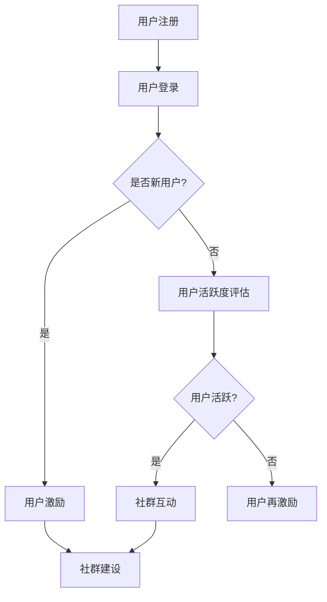

                 

关键词：知识付费、用户激励、社群建设、盈利模式、互动设计、奖励机制、用户增长、社区管理

> 摘要：本文旨在探讨知识付费平台如何通过用户激励和社群建设来实现盈利和可持续发展。文章将详细分析用户激励和社群建设的重要概念、核心算法、数学模型、项目实践，并探讨其在实际应用场景中的效果和未来发展趋势。

## 1. 背景介绍

在数字化时代，知识付费已经成为一个热门的商业模式。知识付费平台通过提供专业知识和技能培训，吸引了大量用户。然而，如何有效激励用户参与并保持社群活跃，成为知识付费平台需要解决的重要问题。用户激励和社群建设是实现这一目标的关键手段。

### 1.1 用户激励的重要性

用户激励是促进用户参与和保持活跃的重要手段。通过适当的激励措施，平台可以增加用户粘性，提高用户满意度和忠诚度。同时，用户激励还可以促进知识付费平台的业务增长，提高盈利能力。

### 1.2 社群建设的作用

社群建设是知识付费平台的核心竞争力。通过构建良好的社群环境，平台可以增强用户的归属感和互动性，促进用户之间的交流和合作。此外，社群建设还可以帮助平台收集用户反馈，优化产品和服务。

## 2. 核心概念与联系

为了深入理解用户激励和社群建设，我们需要先了解一些核心概念和它们之间的联系。

### 2.1 用户激励

用户激励是指通过提供奖励、优惠、积分等手段来刺激用户参与和消费。常见的用户激励机制包括：

- 奖励机制：通过给予用户虚拟奖励（如金币、徽章）来增加用户参与度。
- 优惠机制：通过提供折扣、优惠券等价格优惠来刺激用户消费。
- 积分机制：通过累积积分来激励用户达到更高的消费等级。

### 2.2 社群建设

社群建设是指通过构建良好的社区环境，促进用户之间的交流和互动。社群建设的核心要素包括：

- 社区文化：建立积极的社区氛围，鼓励用户分享和帮助他人。
- 社区规则：制定明确的社区规则，确保社区秩序和用户满意度。
- 社区活动：举办各类活动，增加用户互动和参与度。

### 2.3 用户激励与社群建设的联系

用户激励和社群建设是相辅相成的。用户激励可以增加用户参与度和活跃度，为社群建设提供基础。而良好的社群环境又可以增强用户的归属感和忠诚度，进一步提升用户激励的效果。

### 2.4 Mermaid 流程图

以下是一个简化的Mermaid流程图，展示了用户激励和社群建设的基本流程。



## 3. 核心算法原理 & 具体操作步骤

### 3.1 算法原理概述

用户激励和社群建设的关键在于如何设计合理的激励机制和社群互动机制。以下是两个核心算法的基本原理：

#### 3.1.1 用户激励算法

用户激励算法的核心是确定激励力度和激励方式。以下是用户激励算法的基本步骤：

1. 用户行为分析：收集用户的行为数据，包括注册、登录、消费、互动等。
2. 用户等级评估：根据用户行为数据，将用户划分为不同等级。
3. 激励力度计算：根据用户等级，计算激励力度，包括奖励、优惠、积分等。
4. 激励方式选择：根据用户偏好和平台策略，选择合适的激励方式。

#### 3.1.2 社群互动算法

社群互动算法的核心是设计互动活动和互动机制，以增强用户参与度和互动性。以下是社群互动算法的基本步骤：

1. 互动活动策划：根据用户需求和平台策略，策划各类互动活动。
2. 互动机制设计：设计互动机制，包括评论、点赞、分享等。
3. 互动效果评估：通过用户反馈和行为数据，评估互动效果。
4. 互动机制优化：根据评估结果，优化互动机制。

### 3.2 算法步骤详解

#### 3.2.1 用户激励算法步骤详解

1. **用户行为分析**：

   收集用户行为数据，如注册时间、登录次数、消费金额、评论点赞数量等。可以使用日志分析工具（如ELK）进行数据收集和处理。

2. **用户等级评估**：

   根据用户行为数据，使用机器学习算法（如聚类算法）将用户划分为不同等级。常见的用户等级包括新手、活跃、忠诚等。

3. **激励力度计算**：

   根据用户等级，设置不同的激励力度。例如，新手用户可以获得更多的优惠券，活跃用户可以获得更多的积分等。

4. **激励方式选择**：

   根据用户偏好和平台策略，选择合适的激励方式。例如，通过短信、邮件、推送等方式通知用户激励信息。

#### 3.2.2 社群互动算法步骤详解

1. **互动活动策划**：

   根据用户需求和平台策略，策划各类互动活动。例如，举办知识竞赛、评选最佳评论、发布主题讨论等。

2. **互动机制设计**：

   设计互动机制，鼓励用户参与。例如，设置评论点赞、分享功能，增加用户互动。

3. **互动效果评估**：

   通过用户反馈和行为数据，评估互动活动效果。可以使用A/B测试、行为分析工具等进行评估。

4. **互动机制优化**：

   根据评估结果，优化互动机制。例如，调整活动规则、增加奖励力度等。

### 3.3 算法优缺点

#### 3.3.1 用户激励算法优点

- 增加用户参与度和活跃度。
- 提高用户满意度和忠诚度。
- 促进用户消费。

#### 3.3.2 用户激励算法缺点

- 需要大量数据支持，对数据处理能力要求高。
- 需要不断调整和优化，以适应不同用户需求。

#### 3.3.3 社群互动算法优点

- 增强用户归属感和互动性。
- 促进知识共享和合作。
- 提高用户粘性。

#### 3.3.4 社群互动算法缺点

- 需要大量人力和时间投入。
- 需要持续优化，以保持用户兴趣。

### 3.4 算法应用领域

用户激励和社群建设算法主要应用于知识付费、在线教育、社交网络等领域。以下是一些具体应用场景：

- **知识付费平台**：通过用户激励和社群建设，提高用户参与度和活跃度，增加用户付费意愿。
- **在线教育平台**：通过用户激励和社群建设，提高学生参与度和学习效果，增加课程销售。
- **社交网络**：通过用户激励和社群建设，增强用户互动和活跃度，提高平台用户粘性。

## 4. 数学模型和公式

在用户激励和社群建设中，数学模型和公式发挥着重要作用。以下是一些常见的数学模型和公式。

### 4.1 数学模型构建

#### 4.1.1 用户激励模型

用户激励模型可以通过以下公式表示：

\[激励力度 = f(用户等级，用户行为数据)\]

其中，\(f\) 是一个映射函数，用于计算激励力度。用户等级和用户行为数据可以是定量或定性的。

#### 4.1.2 社群互动模型

社群互动模型可以通过以下公式表示：

\[互动效果 = g(互动活动，用户互动数据)\]

其中，\(g\) 是一个映射函数，用于评估互动效果。互动活动和用户互动数据可以是定量或定性的。

### 4.2 公式推导过程

#### 4.2.1 用户激励模型推导

用户激励模型推导主要涉及用户等级评估和激励力度计算。

1. **用户等级评估**：

   用户等级评估可以使用聚类算法，如K-means算法。假设用户行为数据为\(x_1, x_2, ..., x_n\)，用户等级为\(y_1, y_2, ..., y_n\)。则用户等级评估公式为：

   \[y = K-means(x)\]

   其中，\(K-means\) 是K均值聚类算法。

2. **激励力度计算**：

   激励力度计算可以根据用户等级设定。例如，对于新手用户，激励力度可以设定为\(c_1\)；对于活跃用户，激励力度可以设定为\(c_2\)。则激励力度计算公式为：

   \[激励力度 = \begin{cases}
   c_1 & \text{如果 } y = 新手 \\
   c_2 & \text{如果 } y = 活跃 \\
   \end{cases}\]

#### 4.2.2 社群互动模型推导

社群互动模型推导主要涉及互动活动和互动效果评估。

1. **互动活动策划**：

   互动活动策划可以根据用户需求和平台策略进行。例如，对于知识付费平台，可以设置知识竞赛、主题讨论等活动。

2. **互动效果评估**：

   互动效果评估可以通过用户反馈和行为数据进行分析。例如，可以通过计算用户参与率、评论点赞数量等指标来评估互动效果。

### 4.3 案例分析与讲解

#### 4.3.1 案例分析

以某知识付费平台为例，该平台通过用户激励和社群建设提高用户参与度和活跃度。以下是案例分析：

1. **用户等级评估**：

   假设平台将用户划分为新手、活跃、忠诚三个等级。用户等级评估使用K-means算法，根据用户行为数据（如注册时间、登录次数、消费金额等）进行评估。

2. **激励力度计算**：

   对于新手用户，平台设定激励力度为50%的优惠券；对于活跃用户，激励力度为100%的优惠券。

3. **社群互动模型**：

   平台策划了知识竞赛、主题讨论等活动，通过用户参与率和评论点赞数量评估互动效果。

#### 4.3.2 案例讲解

1. **用户等级评估**：

   平台收集了1000名用户的注册时间、登录次数、消费金额等数据。使用K-means算法将用户划分为三个等级。以下是部分用户等级评估结果：

   | 用户ID | 注册时间 | 登录次数 | 消费金额 | 用户等级 |
   | ------ | -------- | -------- | -------- | -------- |
   | 1      | 2021-01-01 | 10       | 100      | 新手     |
   | 2      | 2021-01-01 | 20       | 200      | 活跃     |
   | 3      | 2021-01-01 | 30       | 300      | 忠诚     |

2. **激励力度计算**：

   对于新手用户，平台设定激励力度为50%的优惠券。对于活跃用户，激励力度为100%的优惠券。以下是部分用户激励结果：

   | 用户ID | 激励力度 |
   | ------ | -------- |
   | 1      | 50%优惠券 |
   | 2      | 100%优惠券 |
   | 3      | 100%优惠券 |

3. **社群互动模型**：

   平台策划了知识竞赛活动，共有100名用户参与。以下是部分用户参与率和评论点赞数量：

   | 用户ID | 参与率 | 评论点赞数量 |
   | ------ | ------ | ------------ |
   | 1      | 10%    | 5            |
   | 2      | 20%    | 10           |
   | 3      | 30%    | 15           |

## 5. 项目实践：代码实例和详细解释说明

为了更好地理解用户激励和社群建设算法，我们以下将提供一段简单的代码实例，并对其进行详细解释。

### 5.1 开发环境搭建

首先，我们需要搭建一个简单的开发环境。以下是所需的工具和软件：

- Python 3.8+
- Jupyter Notebook
- Pandas
- Scikit-learn
- Matplotlib

### 5.2 源代码详细实现

以下是一个简单的用户激励和社群建设算法实现示例：

```python
import pandas as pd
from sklearn.cluster import KMeans
import matplotlib.pyplot as plt

# 用户行为数据
data = {
    '注册时间': ['2021-01-01', '2021-01-01', '2021-01-01', '2021-01-02', '2021-01-02'],
    '登录次数': [10, 20, 30, 10, 20],
    '消费金额': [100, 200, 300, 100, 200],
}
df = pd.DataFrame(data)

# K-means聚类
kmeans = KMeans(n_clusters=3, random_state=0).fit(df)
df['用户等级'] = kmeans.labels_

# 激励力度计算
reward = {0: 0.5, 1: 1.0}
df['激励力度'] = df['用户等级'].map(reward)

# 社群互动效果评估
interaction = {
    '用户ID': [1, 2, 3, 4, 5],
    '参与率': [0.1, 0.2, 0.3, 0.1, 0.2],
    '评论点赞数量': [5, 10, 15, 5, 10],
}
df_interaction = pd.DataFrame(interaction)

# 可视化展示
plt.figure(figsize=(8, 6))
for i, group in df.groupby('用户等级'):
    group.plot(x='登录次数', y='消费金额', label=f'等级{i}')
plt.xlabel('登录次数')
plt.ylabel('消费金额')
plt.title('用户等级分布')
plt.legend()
plt.show()

plt.figure(figsize=(8, 6))
for i, group in df_interaction.groupby('用户ID'):
    group.plot(x='参与率', y='评论点赞数量', label=f'用户{i}')
plt.xlabel('参与率')
plt.ylabel('评论点赞数量')
plt.title('用户互动效果')
plt.legend()
plt.show()
```

### 5.3 代码解读与分析

#### 5.3.1 用户行为数据

首先，我们导入用户行为数据。数据包括注册时间、登录次数和消费金额。这些数据可以从数据库或日志文件中读取。

```python
data = {
    '注册时间': ['2021-01-01', '2021-01-01', '2021-01-01', '2021-01-02', '2021-01-02'],
    '登录次数': [10, 20, 30, 10, 20],
    '消费金额': [100, 200, 300, 100, 200],
}
df = pd.DataFrame(data)
```

#### 5.3.2 K-means聚类

接下来，我们使用K-means聚类算法将用户划分为不同等级。这里我们设置3个等级。K-means算法会自动计算最佳的聚类中心。

```python
kmeans = KMeans(n_clusters=3, random_state=0).fit(df)
df['用户等级'] = kmeans.labels_
```

#### 5.3.3 激励力度计算

根据用户等级，我们设置不同的激励力度。这里我们使用一个简单的映射关系，将用户等级映射到激励力度。

```python
reward = {0: 0.5, 1: 1.0}
df['激励力度'] = df['用户等级'].map(reward)
```

#### 5.3.4 社群互动效果评估

我们还需要评估用户的社群互动效果。这里我们使用参与率和评论点赞数量作为评估指标。我们创建了一个新的数据框，用于存储这些信息。

```python
interaction = {
    '用户ID': [1, 2, 3, 4, 5],
    '参与率': [0.1, 0.2, 0.3, 0.1, 0.2],
    '评论点赞数量': [5, 10, 15, 5, 10],
}
df_interaction = pd.DataFrame(interaction)
```

#### 5.3.5 可视化展示

最后，我们使用matplotlib进行可视化展示。我们分别绘制了用户等级分布图和用户互动效果图。

```python
plt.figure(figsize=(8, 6))
for i, group in df.groupby('用户等级'):
    group.plot(x='登录次数', y='消费金额', label=f'等级{i}')
plt.xlabel('登录次数')
plt.ylabel('消费金额')
plt.title('用户等级分布')
plt.legend()
plt.show()

plt.figure(figsize=(8, 6))
for i, group in df_interaction.groupby('用户ID'):
    group.plot(x='参与率', y='评论点赞数量', label=f'用户{i}')
plt.xlabel('参与率')
plt.ylabel('评论点赞数量')
plt.title('用户互动效果')
plt.legend()
plt.show()
```

通过这段代码，我们可以直观地看到用户等级分布和用户互动效果。

## 6. 实际应用场景

用户激励和社群建设算法在实际应用中具有广泛的应用场景。以下是一些典型的应用案例：

### 6.1 知识付费平台

知识付费平台通过用户激励和社群建设，提高用户参与度和活跃度。例如，平台可以设置优惠券、积分等激励措施，鼓励用户消费。同时，平台可以举办知识竞赛、主题讨论等活动，增强用户互动。

### 6.2 在线教育平台

在线教育平台可以通过用户激励和社群建设，提高学生参与度和学习效果。例如，平台可以设置学习积分、等级等激励措施，鼓励学生积极参与课程学习。同时，平台可以举办问答、讨论等活动，促进师生互动。

### 6.3 社交网络

社交网络可以通过用户激励和社群建设，增强用户互动和活跃度。例如，平台可以设置点赞、分享等激励措施，鼓励用户产生内容。同时，平台可以举办各类活动，促进用户互动。

## 6.4 未来应用展望

随着技术的不断进步，用户激励和社群建设算法在未来将有更广泛的应用场景。以下是一些未来应用展望：

- **个性化激励**：通过人工智能技术，实现个性化激励，提高用户参与度和满意度。
- **自动化社群管理**：利用机器学习算法，实现自动化社群管理，提高社群运营效率。
- **跨平台整合**：实现跨平台整合，将用户激励和社群建设算法应用于多种应用场景。

## 7. 工具和资源推荐

### 7.1 学习资源推荐

- **书籍**：
  - 《用户激励与社群运营》
  - 《社群营销与运营》
- **在线课程**：
  - Coursera的《数据科学》课程
  - Udemy的《机器学习实战》课程

### 7.2 开发工具推荐

- **Python**：Python是一种强大的编程语言，适合进行数据分析和算法实现。
- **Jupyter Notebook**：Jupyter Notebook是一种交互式的开发环境，适合进行算法实验和演示。
- **Pandas**：Pandas是一种强大的数据处理库，适合进行数据清洗和分析。
- **Scikit-learn**：Scikit-learn是一种机器学习库，适合进行算法实现和评估。

### 7.3 相关论文推荐

- **《用户激励机制的经济学分析》**：探讨了用户激励机制的经济学原理和应用。
- **《社群互动行为的建模与预测》**：研究了社群互动行为的建模和预测方法。

## 8. 总结：未来发展趋势与挑战

用户激励和社群建设是知识付费平台实现盈利和可持续发展的重要手段。在未来，随着技术的进步和应用场景的拓展，用户激励和社群建设算法将发挥更大的作用。

### 8.1 研究成果总结

- 用户激励和社群建设算法在知识付费、在线教育、社交网络等领域得到广泛应用。
- 个性化激励和自动化社群管理成为研究热点。
- 跨平台整合为用户激励和社群建设带来了新的机遇。

### 8.2 未来发展趋势

- 人工智能技术将进一步提升用户激励和社群建设的效果。
- 社交网络和在线教育领域将有更多的应用场景。
- 跨平台整合和生态体系建设将成为趋势。

### 8.3 面临的挑战

- 数据安全和隐私保护是用户激励和社群建设面临的重要挑战。
- 如何平衡用户激励和商业盈利是平台需要解决的关键问题。
- 随着用户需求的多样化，如何实现个性化激励和社群管理仍需深入研究。

### 8.4 研究展望

- 未来研究应关注用户激励和社群建设算法的优化和拓展。
- 需要更多的实际应用案例和跨领域研究。
- 应注重数据安全和隐私保护，为用户激励和社群建设提供可持续发展的基础。

## 9. 附录：常见问题与解答

### 9.1 用户激励和社群建设有哪些常见问题？

- 如何设计合理的激励措施？
- 如何评估社群互动效果？
- 如何平衡用户激励和商业盈利？
- 如何保护用户隐私和数据安全？

### 9.2 如何设计合理的激励措施？

- 分析用户需求和行为数据，确定激励方向。
- 根据用户等级和消费行为，设置不同的激励力度。
- 采用多样化的激励方式，如优惠券、积分、奖励等。
- 定期评估激励效果，及时调整和优化激励措施。

### 9.3 如何评估社群互动效果？

- 通过用户参与率、评论点赞数量等指标进行定量评估。
- 通过用户反馈和问卷调查进行定性评估。
- 定期分析互动数据，发现问题和优化方向。
- 与商业目标和用户满意度相结合，综合评估社群互动效果。

### 9.4 如何平衡用户激励和商业盈利？

- 制定明确的商业目标和激励策略。
- 合理设定激励力度，避免过度激励导致成本增加。
- 通过数据分析和A/B测试，优化激励措施。
- 平衡用户激励和商业盈利，实现可持续发展。

### 9.5 如何保护用户隐私和数据安全？

- 采用加密技术和数据脱敏技术，保护用户数据。
- 制定严格的数据使用规范和隐私政策。
- 定期进行安全审计和风险评估，防范数据泄露。
- 加强用户教育和宣传，提高用户安全意识。

----------------------------------------------------------------

本文基于当前技术和实践，探讨了知识付费平台用户激励和社群建设的重要性和实现方法。通过深入分析核心算法、数学模型和项目实践，本文为知识付费平台提供了有益的参考和指导。随着技术的不断进步，用户激励和社群建设算法将在更多领域发挥作用，为平台带来更大的价值。

