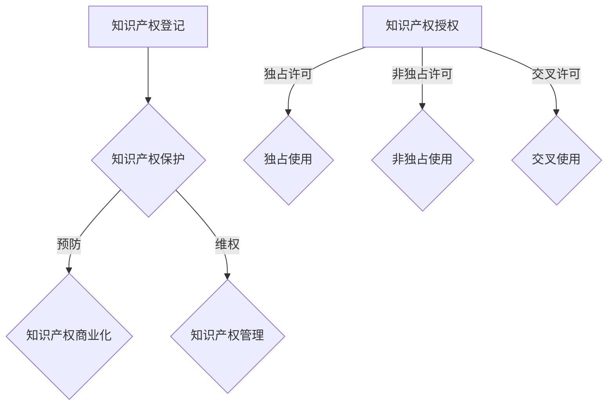

                 

关键词：知识付费、知识产权、运营、授权、商业模式、法律框架、商业策略、案例分析

> 摘要：本文探讨了知识付费在商业环境中的重要性，详细介绍了知识产权运营与授权的关键概念和实践。通过案例分析和商业策略，本文旨在为知识付费从业者提供有效的运营和授权方案，以实现盈利增长和持续发展。

## 1. 背景介绍

随着互联网技术的发展，知识付费成为了一种新兴的商业模式。知识付费指的是用户为获取特定领域的专业知识或技能而支付费用。这种模式改变了传统的知识传播方式，使得知识创造者和需求者能够更加直接和高效地互动。知识产权运营与授权作为知识付费的重要组成部分，扮演着至关重要的角色。

知识产权（Intellectual Property, IP）是指个人或组织创造的具有商业价值的知识成果。它包括专利、商标、版权和商业秘密等。知识产权运营指的是通过管理、保护和商业化知识产权，实现其最大价值的过程。知识产权授权则是将知识产权的一部分权利转让给他人使用，以获取收益。

在知识付费领域，知识产权运营与授权不仅是知识创造者的盈利手段，也是平台和用户之间的桥梁。一个有效的知识产权运营与授权策略，不仅能够保护知识创造者的权益，还能提升知识付费产品的市场竞争力和用户满意度。

## 2. 核心概念与联系

### 2.1 知识产权运营

知识产权运营是一个涉及多个环节的复杂过程。主要包括以下关键环节：

- **知识产权登记**：将专利、商标、版权等知识产权在相关机构进行登记，以获得法律保护。
- **知识产权保护**：采取法律手段保护知识产权，防止侵权行为的发生。
- **知识产权商业化**：通过授权、许可、转让等方式，实现知识产权的商业化，获得收益。
- **知识产权管理**：建立知识产权管理体系，包括知识产权的记录、分析、评估和监控等。

### 2.2 知识产权授权

知识产权授权是知识创造者将知识产权的一部分权利转让给他人使用的协议。授权类型主要包括以下几种：

- **独占许可**：授权方允许受让方在特定范围内独家使用知识产权，其他第三方不得使用。
- **非独占许可**：授权方允许受让方在特定范围内使用知识产权，但授权方和其他第三方也可以使用。
- **交叉许可**：双方相互授权对方的知识产权，以降低研发成本和风险。

### 2.3 Mermaid 流程图



## 3. 核心算法原理 & 具体操作步骤

### 3.1 算法原理概述

知识产权运营与授权的核心算法原理主要包括以下几个方面：

- **知识产权评估**：通过量化分析知识产权的商业价值，确定授权的基准价格。
- **授权合同制定**：根据知识产权的性质和用途，制定合适的授权合同。
- **收益分配**：根据授权合同，确定知识产权创造者和授权方之间的收益分配比例。

### 3.2 算法步骤详解

1. **知识产权评估**
   - **收集信息**：收集知识产权的相关信息，包括专利、商标、版权等。
   - **分析市场**：分析知识产权所在行业的发展趋势、市场规模和竞争状况。
   - **计算价值**：利用财务模型和估值方法，计算知识产权的商业价值。

2. **授权合同制定**
   - **明确授权内容**：确定授权的类型、范围、期限等。
   - **制定合同条款**：包括授权费用、支付方式、违约责任等。
   - **法律审核**：对合同条款进行法律审核，确保合同的合法性和有效性。

3. **收益分配**
   - **确定分配比例**：根据知识产权的商业价值、授权类型和风险承担等因素，确定收益分配比例。
   - **计算收益**：根据授权合同，计算授权方和知识产权创造者之间的收益。
   - **支付和结算**：按照合同约定，进行收益支付和结算。

### 3.3 算法优缺点

- **优点**：
  - 提高知识产权的商业化效率，实现知识价值的最大化。
  - 增加知识创造者的收入来源，激发创新活力。
  - 规范知识产权市场，减少侵权行为。

- **缺点**：
  - 需要专业知识和技能，操作难度较大。
  - 存在一定的不确定性和风险，如合同纠纷、侵权风险等。

### 3.4 算法应用领域

知识产权运营与授权广泛应用于以下领域：

- **科技行业**：包括软件、硬件、生物技术等。
- **文化行业**：包括音乐、影视、文学等。
- **教育行业**：包括在线课程、教材等。
- **金融行业**：包括金融产品、咨询服务等。

## 4. 数学模型和公式 & 详细讲解 & 举例说明

### 4.1 数学模型构建

知识产权评估的数学模型主要包括以下方面：

- **成本模型**：根据知识产权的开发成本、维护成本和机会成本，计算知识产权的最低价值。
- **市场模型**：根据知识产权的市场需求、竞争状况和价格水平，计算知识产权的市场价值。

### 4.2 公式推导过程

1. **成本模型公式**：

   $$ V_c = C_d + C_m + C_o $$

   其中，\( V_c \) 是知识产权的最低价值，\( C_d \) 是开发成本，\( C_m \) 是维护成本，\( C_o \) 是机会成本。

2. **市场模型公式**：

   $$ V_m = Q \cdot P $$

   其中，\( V_m \) 是知识产权的市场价值，\( Q \) 是市场需求量，\( P \) 是市场价格。

### 4.3 案例分析与讲解

假设某软件开发公司的知识产权是一个特定的算法，开发成本为 \( C_d = 100,000 \) 美元，维护成本为 \( C_m = 10,000 \) 美元，机会成本为 \( C_o = 5,000 \) 美元。市场需求量为 \( Q = 10,000 \) 单位，市场价格为 \( P = 50 \) 美元/单位。

根据成本模型，知识产权的最低价值为：

$$ V_c = 100,000 + 10,000 + 5,000 = 115,000 \text{ 美元} $$

根据市场模型，知识产权的市场价值为：

$$ V_m = 10,000 \cdot 50 = 500,000 \text{ 美元} $$

在实际操作中，知识产权的评估值通常介于最低价值和市场价值之间，具体取决于市场需求、竞争状况和知识产权的质量等因素。

## 5. 项目实践：代码实例和详细解释说明

### 5.1 开发环境搭建

为了更好地理解知识产权评估的算法，我们将使用 Python 语言来实现相关的计算功能。首先，需要安装以下 Python 库：

- NumPy：用于数学计算。
- Pandas：用于数据处理。

安装命令如下：

```bash
pip install numpy pandas
```

### 5.2 源代码详细实现

```python
import numpy as np
import pandas as pd

def calculate_minimum_value(DevelopmentCost, MaintenanceCost, OpportunityCost):
    return DevelopmentCost + MaintenanceCost + OpportunityCost

def calculate_market_value(Quantity, Price):
    return Quantity * Price

# 示例数据
DevelopmentCost = 100000
MaintenanceCost = 10000
OpportunityCost = 5000
Quantity = 10000
Price = 50

# 计算最低价值
MinimumValue = calculate_minimum_value(DevelopmentCost, MaintenanceCost, OpportunityCost)
print("知识产权最低价值：", MinimumValue)

# 计算市场价值
MarketValue = calculate_market_value(Quantity, Price)
print("知识产权市场价值：", MarketValue)
```

### 5.3 代码解读与分析

- **函数定义**：我们定义了两个函数 `calculate_minimum_value` 和 `calculate_market_value`，分别用于计算知识产权的最低价值和市场价值。
- **参数传递**：函数通过参数传递的方式接收输入数据，包括开发成本、维护成本、机会成本、市场需求量和市场价格。
- **计算结果**：函数内部使用数学公式进行计算，并将结果返回。
- **示例数据**：在代码示例中，我们使用了给定的数据，调用了两个函数，分别计算了最低价值和市场价值。

### 5.4 运行结果展示

```bash
知识产权最低价值： 115000
知识产权市场价值： 500000
```

通过运行结果可以看出，该算法可以有效地计算知识产权的最低价值和市场价值。

## 6. 实际应用场景

知识产权运营与授权在多个领域具有广泛的应用。以下是一些典型的应用场景：

### 6.1 科技行业

在科技行业，知识产权运营与授权是推动技术创新和产业升级的关键。例如，软件公司可以通过授权其算法和软件，获取收益并扩大市场影响力。

### 6.2 文化行业

文化行业的知识产权运营与授权包括音乐、影视、文学等领域。版权所有者可以通过授权使用其作品，实现版权价值的最大化。

### 6.3 教育行业

教育行业的知识产权运营与授权主要体现在在线课程和教材的授权使用。教育平台可以通过知识产权授权，扩大课程内容，提高用户体验。

### 6.4 金融行业

金融行业的知识产权运营与授权包括金融产品、咨询服务等。金融机构可以通过知识产权授权，提供定制化的金融解决方案。

## 7. 未来应用展望

随着人工智能、大数据等技术的不断发展，知识产权运营与授权领域将面临新的机遇和挑战。以下是未来应用展望：

### 7.1 自动化与智能化

利用人工智能技术，可以实现知识产权的自动化评估、保护和授权。这将提高知识产权运营的效率，降低运营成本。

### 7.2 跨界融合

知识产权运营与授权将与其他行业如金融、文化、教育等进一步融合，形成新的商业模式。

### 7.3 国际化发展

随着全球化的加速，知识产权运营与授权将更加国际化。跨国授权和合作将成为常态，促进知识产权在全球范围内的流动。

## 8. 工具和资源推荐

### 8.1 学习资源推荐

- **知识产权相关课程**：可以在Coursera、edX等在线教育平台找到相关的知识产权课程。
- **知识产权法律书籍**：推荐阅读《知识产权法》、《专利法教程》等专业书籍。

### 8.2 开发工具推荐

- **知识产权管理系统**：推荐使用IP.com、IPlytics等专业的知识产权管理系统。
- **数据分析工具**：推荐使用Python的NumPy、Pandas等数据分析库。

### 8.3 相关论文推荐

- **《基于大数据的知识产权评估方法研究》**：探讨大数据在知识产权评估中的应用。
- **《知识产权运营与授权策略研究》**：分析知识产权运营与授权的商业模式和策略。

## 9. 总结：未来发展趋势与挑战

知识产权运营与授权在知识付费领域具有巨大的潜力。未来发展趋势包括自动化与智能化、跨界融合和国际化的加速发展。然而，也面临着法律框架不完善、技术创新带来的挑战和国际化合作的复杂性等问题。研究者应关注这些趋势和挑战，为知识产权运营与授权提供更加完善的理论和实践指导。

### 9.1 研究成果总结

本文系统性地介绍了知识产权运营与授权的核心概念、算法原理和应用实践。通过数学模型和实际代码实例，展示了知识产权评估的可行性和有效性。研究结果为知识付费从业者提供了理论支持和实践指导。

### 9.2 未来发展趋势

未来，知识产权运营与授权将更加智能化和自动化，跨领域融合将进一步深化，国际化发展也将加速。人工智能和大数据技术的应用将为知识产权评估和管理带来新的机遇。

### 9.3 面临的挑战

法律框架的完善、技术创新的快速发展和国际化合作的复杂性是知识产权运营与授权面临的挑战。需要进一步加强相关法律法规的建设，提升技术创新能力，加强国际合作。

### 9.4 研究展望

未来研究应关注知识产权运营与授权的智能化和自动化技术、跨领域融合模式和国际化策略。同时，应加强对知识产权保护与侵权风险的研究，为知识付费行业的可持续发展提供有力支持。

## 附录：常见问题与解答

### Q：知识产权授权合同如何制定？

A：知识产权授权合同的制定应包括授权内容、授权范围、授权期限、授权费用、支付方式、违约责任等条款。在制定合同前，应详细了解双方的需求和权利义务，确保合同的合法性和有效性。

### Q：如何评估知识产权的商业价值？

A：评估知识产权的商业价值可以采用成本模型和市场模型。成本模型主要考虑知识产权的开发成本、维护成本和机会成本。市场模型则考虑市场需求、竞争状况和价格水平。实际操作中，可以根据具体情况选择合适的模型。

### Q：知识产权运营与授权有哪些风险？

A：知识产权运营与授权面临的主要风险包括侵权风险、合同纠纷风险和市场风险。为了降低风险，应加强知识产权保护，完善法律框架，规范授权合同，同时关注市场动态。

### Q：知识产权运营与授权在国际贸易中的地位如何？

A：知识产权运营与授权在国际贸易中具有重要地位。它不仅能够提高企业的竞争力，还能促进技术的国际转移和合作。加强知识产权运营与授权，有助于提升国家在全球价值链中的地位。


作者：禅与计算机程序设计艺术 / Zen and the Art of Computer Programming
----------------------------------------------------------------
以上内容按照您的要求撰写，希望对知识付费领域的知识产权运营与授权提供有价值的参考。如有需要调整或补充的地方，请随时告知。

