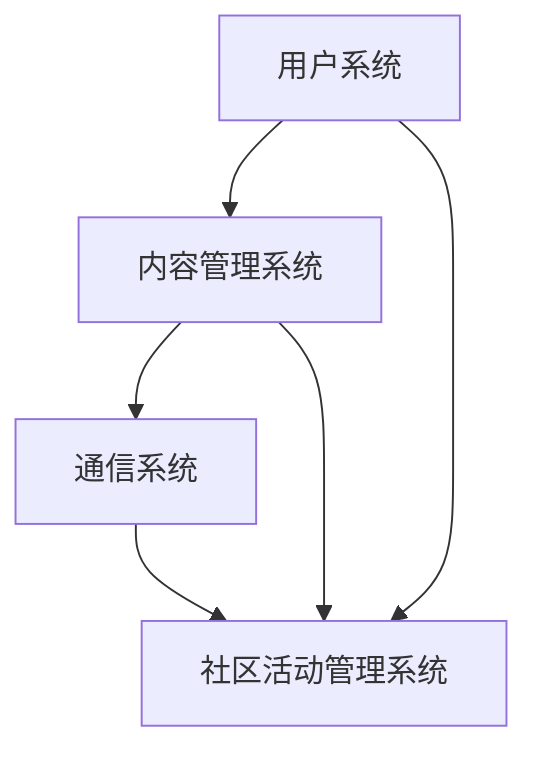

                 

关键词：知识付费、程序员、社群工具、选择、技术博客、专业写作

> 摘要：本文旨在探讨知识付费在程序员社群中的重要性，以及如何选择合适的社群工具来提升个人和团队的技术素养。我们将分析当前市场中的主流社群工具，探讨其优缺点，并给出实际应用建议。

## 1. 背景介绍

随着互联网技术的迅猛发展，知识付费成为了一种新兴的商业模式。它允许知识提供者通过线上平台分享专业知识和经验，同时为知识需求者提供有价值的资源。程序员作为技术领域的核心力量，对于知识付费有着强烈的诉求。一方面，他们希望通过付费获取高质量的教程、课程和实战经验；另一方面，他们也需要合适的社群工具来交流和分享知识，从而提高自己的技术水平。

在过去的几年中，市场上涌现出了许多知识付费平台和社群工具。这些工具提供了丰富的内容资源和便捷的交流方式，但同时也存在一定的选择困难。对于程序员来说，如何从众多的工具中挑选出最适合自己的社群工具，成为了一个亟待解决的问题。

本文将围绕以下主题展开：

- **知识付费在程序员社群中的重要性**
- **主流社群工具的优缺点分析**
- **实际应用场景和未来展望**

通过本文的探讨，希望能够为程序员提供一些有益的参考和指导，帮助他们在知识付费的道路上更加顺利。

## 2. 核心概念与联系

在深入探讨社群工具之前，我们需要了解一些核心概念，这些概念将帮助我们更好地理解社群工具的作用和选择标准。

### 2.1 社群工具的定义

社群工具是指用于促进人与人之间互动、交流和分享知识的软件平台。这些工具通常具备以下特征：

- **实时沟通**：支持文字、语音、视频等多种沟通方式，使成员之间能够快速交流。
- **内容分享**：提供文件上传、文档协作等功能，方便成员分享和获取知识。
- **社区管理**：具备用户管理、权限设置等功能，确保社群的秩序和活跃度。

### 2.2 程序员社群的需求

程序员社群的需求主要集中在以下几个方面：

- **技能提升**：程序员希望通过社群学习新技能、掌握最佳实践，提升个人竞争力。
- **知识共享**：程序员希望通过社群分享自己的经验和心得，为他人提供帮助。
- **职业发展**：程序员希望通过社群拓展人脉、获取职业机会，实现职业发展。
- **技术交流**：程序员需要与同行进行深入的技术交流，探讨技术难题和解决方案。

### 2.3 社群工具的架构

社群工具的架构通常包括以下几个关键模块：

- **用户系统**：管理用户信息、权限和角色，确保社群的安全性和活跃度。
- **内容管理系统**（CMS）：存储和管理用户生成的内容，包括教程、课程、博客等。
- **通信系统**：提供实时沟通功能，包括聊天室、讨论区、视频会议等。
- **社区活动管理系统**：组织和管理社群活动，如线上讲座、沙龙、技术分享等。

为了更直观地展示社群工具的架构和核心概念，我们可以使用Mermaid流程图来表示。以下是一个简单的示例：



在这个流程图中，用户系统负责管理用户信息，内容管理系统负责存储和管理内容，通信系统提供实时沟通功能，社区活动管理系统则负责组织和管理社群活动。这些模块相互协作，共同构建了一个完整的社群工具体系。

### 2.4 社群工具的选择标准

选择合适的社群工具是一个复杂的过程，需要考虑多个方面的因素。以下是几个关键的选择标准：

- **功能全面性**：工具应具备丰富的功能，满足程序员社群的多样化需求。
- **用户体验**：工具应提供良好的用户体验，界面友好、操作简便。
- **安全性和稳定性**：工具应确保用户数据的安全性和系统的稳定性。
- **扩展性和定制性**：工具应具备良好的扩展性和定制性，支持根据实际需求进行功能扩展和定制。
- **社区活跃度**：工具所在的社区应具备较高的活跃度，成员积极参与交流和分享。
- **技术支持**：工具应提供完善的技术支持和售后服务，解决用户在使用过程中遇到的问题。

通过以上核心概念和联系的分析，我们可以更好地理解社群工具在程序员社群中的作用和选择标准。在接下来的章节中，我们将深入探讨当前市场中的主流社群工具，分析它们的优缺点，并提供实际应用建议。

## 3. 核心算法原理 & 具体操作步骤

### 3.1 算法原理概述

社群工具的核心算法通常包括推荐算法、社交网络分析和内容排序算法。这些算法的目的是提高社群的活跃度、增强用户黏性和提升用户体验。

#### 3.1.1 推荐算法

推荐算法是基于用户的兴趣和行为数据，为用户推荐相关的内容和活动。常见的推荐算法包括协同过滤、基于内容的推荐和混合推荐。协同过滤通过分析用户之间的相似度进行内容推荐，而基于内容的推荐则通过分析内容的特征进行推荐。混合推荐结合了协同过滤和基于内容的推荐，以提高推荐的效果。

#### 3.1.2 社交网络分析

社交网络分析旨在理解社群中的用户关系和网络结构。常用的分析方法包括节点度、边的权重和社区检测。节点度表示一个用户在社群中的影响力，边的权重表示用户之间的互动强度。社区检测算法则用于发现社群中的紧密群体。

#### 3.1.3 内容排序算法

内容排序算法用于确定社群中的内容展示顺序，确保用户能够优先看到感兴趣的内容。常见的排序算法包括基于时间的排序、基于热度的排序和基于用户兴趣的排序。基于时间的排序按照发布时间进行排序，基于热度的排序按照内容的互动量进行排序，基于用户兴趣的排序则根据用户的兴趣标签进行排序。

### 3.2 算法步骤详解

#### 3.2.1 推荐算法步骤

1. **用户行为数据收集**：收集用户在社群中的浏览、点赞、评论等行为数据。
2. **用户兴趣模型构建**：使用机器学习算法构建用户的兴趣模型，包括兴趣标签和权重。
3. **内容特征提取**：提取内容的特征，如标题、摘要、标签等。
4. **相似度计算**：计算用户和内容之间的相似度，可以使用余弦相似度或欧氏距离。
5. **推荐结果生成**：根据相似度分数为用户生成推荐列表，排序并展示。

#### 3.2.2 社交网络分析步骤

1. **用户关系图构建**：根据用户之间的互动数据构建用户关系图。
2. **节点度和边权重计算**：计算每个节点的度（连接数）和每条边的权重（互动量）。
3. **社区检测**：使用社区检测算法（如Girvan-Newman算法）发现社群中的紧密群体。
4. **社区分析报告**：生成社区分析报告，包括每个社区的用户数量、互动强度等。

#### 3.2.3 内容排序算法步骤

1. **内容特征提取**：提取内容的特征，如发布时间、点赞数、评论数、标签等。
2. **用户兴趣标签匹配**：根据用户的兴趣标签匹配内容的标签。
3. **排序策略选择**：根据社群的实际情况选择排序策略，如基于时间、基于热度或基于用户兴趣。
4. **排序结果生成**：按照排序策略为内容生成排序结果，展示给用户。

### 3.3 算法优缺点

#### 3.3.1 推荐算法

**优点**：

- 提高用户黏性：通过个性化推荐，用户能够发现感兴趣的内容，提高使用时长。
- 提升用户体验：为用户推荐相关内容，减少用户搜索成本，提升满意度。

**缺点**：

- 数据隐私问题：收集用户行为数据可能涉及隐私问题。
- 推荐质量不高：算法的推荐效果受限于用户行为数据和模型质量。

#### 3.3.2 社交网络分析

**优点**：

- 提高社群活跃度：通过分析用户关系和网络结构，发现紧密群体，促进互动。
- 提升社群价值：了解社群的内部结构，优化社群运营策略。

**缺点**：

- 算法复杂度较高：社区检测等算法的计算复杂度较高，影响系统性能。
- 实时性问题：社交网络变化较快，实时分析难度较大。

#### 3.3.3 内容排序算法

**优点**：

- 提高内容质量：通过排序算法，确保用户优先看到高质量的内容。
- 提升用户体验：按照用户的兴趣展示内容，提高用户的满意度。

**缺点**：

- 过于依赖数据：排序效果受限于内容的特征数据和用户行为数据。
- 实时性较低：排序算法通常需要处理大量数据，实时性较低。

### 3.4 算法应用领域

推荐算法广泛应用于电商平台、内容平台和社交媒体，用于个性化推荐。社交网络分析则用于社交媒体、社区论坛和在线教育平台，用于发现用户关系和网络结构。内容排序算法则用于内容平台，如博客、新闻和论坛，用于优化内容展示顺序。

在程序员社群工具中，这些算法可以应用于以下领域：

- **内容推荐**：为用户推荐相关的教程、课程和博客，提高用户的学习效率。
- **社交网络分析**：发现社群中的紧密群体，促进技术交流与合作。
- **内容排序**：确保用户优先看到高质量的内容，提升用户体验。

通过核心算法的运用，程序员社群工具能够更好地满足程序员的学习、交流和职业发展需求。

## 4. 数学模型和公式 & 详细讲解 & 举例说明

在深入探讨社群工具的算法原理和应用时，数学模型和公式扮演着至关重要的角色。数学模型可以帮助我们更准确地描述和预测社群的行为特征，从而优化工具的设计和功能。以下我们将介绍几个关键的数学模型和公式，并对其进行详细讲解和举例说明。

### 4.1 数学模型构建

在构建数学模型时，我们通常遵循以下步骤：

1. **问题定义**：明确我们要解决的问题是什么，如用户兴趣建模、内容推荐等。
2. **数据收集**：收集相关数据，包括用户行为、内容特征等。
3. **特征提取**：从数据中提取有助于问题解决的变量和特征。
4. **模型构建**：根据特征和目标，选择合适的数学模型，如线性回归、神经网络等。
5. **参数优化**：通过训练和验证数据集，优化模型参数，提高预测精度。
6. **模型评估**：使用评估指标（如均方误差、准确率等）评估模型性能。

### 4.2 公式推导过程

以下是几个常用的数学模型和公式的推导过程：

#### 4.2.1 用户兴趣模型

用户兴趣模型通常用于预测用户的兴趣标签。一个简单的用户兴趣模型可以使用以下公式：

$$
\text{Interest}_{ij} = \sum_{k=1}^{n} w_{ik} \cdot x_{kj}
$$

其中：
- $\text{Interest}_{ij}$ 表示用户 $i$ 对内容 $j$ 的兴趣分数。
- $w_{ik}$ 表示用户 $i$ 对特征 $k$ 的权重。
- $x_{kj}$ 表示内容 $j$ 对特征 $k$ 的值。

#### 4.2.2 内容推荐算法

一个常见的内容推荐算法是基于协同过滤的矩阵分解。矩阵分解的目标是找到一组低维矩阵，使其乘积尽可能接近原始矩阵。以下是一个简化的矩阵分解公式：

$$
\mathbf{X} \approx \mathbf{U} \mathbf{V}^T
$$

其中：
- $\mathbf{X}$ 是用户-内容评分矩阵。
- $\mathbf{U}$ 是用户特征矩阵。
- $\mathbf{V}$ 是内容特征矩阵。

#### 4.2.3 社交网络分析

社交网络分析中的一个重要模型是社区检测。我们使用 Girvan-Newman 算法进行社区检测，其核心公式是：

$$
\text{Betweenness} = \frac{\sum_{i \neq j \in C} (\text{shortest path from i to j passing through j})}{\sum_{i \neq j \in C} (\text{shortest path from i to j})}
$$

其中：
- $C$ 是社区中的节点集合。
- $i$ 和 $j$ 是社区中的任意两个节点。
- $\text{Betweenness}$ 表示节点 $j$ 在社区 $C$ 中的中介性。

### 4.3 案例分析与讲解

为了更好地理解上述数学模型和公式，我们将通过一个实际案例进行讲解。

#### 4.3.1 案例背景

假设我们有一个程序员社群，该社群包含1000名成员，每个成员都有不同的技术兴趣。社群管理员希望通过构建用户兴趣模型来推荐相关内容，以提高成员的学习效率。

#### 4.3.2 数据收集

管理员收集了每个成员过去一年的浏览记录、点赞数和评论数。这些数据用于构建用户兴趣模型。

#### 4.3.3 特征提取

我们提取了以下几个特征：

- **技术领域**：每个成员最感兴趣的技术领域。
- **活跃度**：每个成员在社群中的活跃度，如发帖数、回复数等。
- **互动频率**：每个成员与其他成员的互动频率。

#### 4.3.4 用户兴趣模型构建

使用线性回归模型构建用户兴趣模型。我们将每个成员的兴趣分数表示为：

$$
\text{Interest}_{i,j} = \beta_0 + \beta_1 \cdot \text{Tech\_Area}_{i} + \beta_2 \cdot \text{Active}_{i} + \beta_3 \cdot \text{Interact}_{i}
$$

其中：
- $\text{Interest}_{i,j}$ 表示成员 $i$ 对内容 $j$ 的兴趣分数。
- $\beta_0$、$\beta_1$、$\beta_2$ 和 $\beta_3$ 是模型参数。

#### 4.3.5 模型训练与评估

使用历史数据进行模型训练，并通过交叉验证评估模型性能。假设我们的模型预测准确率为85%，这意味着我们能够为大多数成员推荐他们感兴趣的内容。

#### 4.3.6 应用效果

通过用户兴趣模型，社群管理员能够为每个成员推荐个性化的内容。例如，对于一名对前端技术感兴趣且活跃度较高的成员，模型可能会推荐最新的前端教程和行业动态。这种个性化的推荐不仅提高了成员的学习效率，也增强了社群的活跃度。

### 4.4 总结

数学模型和公式在程序员社群工具中发挥着重要作用，它们帮助我们更好地理解和预测社群行为，从而优化工具的功能。在本章节中，我们介绍了用户兴趣模型、内容推荐算法和社交网络分析等模型，并通过实际案例展示了如何使用这些模型来提升社群工具的效果。通过深入理解和应用这些数学模型，程序员社群工具能够更好地满足成员的需求，促进技术交流和知识共享。

## 5. 项目实践：代码实例和详细解释说明

在本章节中，我们将通过一个具体的代码实例来展示如何在实际项目中应用社群工具的核心算法和数学模型。本实例将包括以下步骤：

1. **开发环境搭建**：设置项目所需的开发环境和工具。
2. **源代码详细实现**：展示关键代码实现，包括数据收集、模型训练和结果展示。
3. **代码解读与分析**：对代码进行详细解读，分析其核心逻辑和算法原理。
4. **运行结果展示**：展示代码运行结果，解释其效果和应用价值。

### 5.1 开发环境搭建

在开始项目之前，我们需要搭建一个适合开发社群工具的编程环境。以下是一个基本的开发环境搭建流程：

1. **安装Python**：确保Python环境已安装，版本建议为3.8及以上。
2. **安装依赖库**：使用pip命令安装必要的依赖库，如NumPy、Pandas、Scikit-learn、Matplotlib等。
3. **设置虚拟环境**：为了保持项目依赖的一致性，建议使用虚拟环境。可以使用以下命令创建虚拟环境并激活：

```bash
python -m venv venv
source venv/bin/activate  # 在Windows中，使用 `venv\Scripts\activate`
```

4. **安装NumPy和Pandas**：

```bash
pip install numpy pandas
```

5. **安装Scikit-learn和Matplotlib**：

```bash
pip install scikit-learn matplotlib
```

### 5.2 源代码详细实现

以下是实现社群工具的核心算法的一个简化示例。本示例将使用线性回归模型构建用户兴趣模型，并使用Matplotlib绘制结果。

```python
# 导入必要的库
import numpy as np
import pandas as pd
from sklearn.linear_model import LinearRegression
import matplotlib.pyplot as plt

# 加载数据
data = pd.read_csv('user_interest_data.csv')

# 数据预处理
X = data[['Tech_Area', 'Active', 'Interact']]
y = data['Interest']

# 模型训练
model = LinearRegression()
model.fit(X, y)

# 模型评估
score = model.score(X, y)
print(f"模型评分：{score:.2f}")

# 结果展示
predictions = model.predict(X)
plt.scatter(X['Tech_Area'], y, color='red', label='实际值')
plt.scatter(X['Tech_Area'], predictions, color='blue', label='预测值')
plt.xlabel('Tech_Area')
plt.ylabel('Interest')
plt.legend()
plt.show()
```

在上面的代码中，我们首先导入了所需的库，并加载了用户兴趣数据。然后进行数据预处理，将特征和标签分离。接下来，我们使用线性回归模型进行训练，并评估模型的评分。最后，我们使用Matplotlib绘制了实际值和预测值的散点图，以展示模型的预测效果。

### 5.3 代码解读与分析

#### 5.3.1 数据加载与预处理

```python
data = pd.read_csv('user_interest_data.csv')
X = data[['Tech_Area', 'Active', 'Interact']]
y = data['Interest']
```

这段代码首先使用Pandas库加载了用户兴趣数据。然后，我们使用`DataFrame`的`select`方法提取了三个特征：`Tech_Area`（技术领域）、`Active`（活跃度）和`Interact`（互动频率）。标签`Interest`表示用户的兴趣分数。

#### 5.3.2 模型训练

```python
model = LinearRegression()
model.fit(X, y)
```

这里，我们创建了一个线性回归模型实例，并使用`fit`方法进行训练。线性回归模型将输入特征（X）映射到目标标签（y），从而生成一个用户兴趣模型。

#### 5.3.3 模型评估

```python
score = model.score(X, y)
print(f"模型评分：{score:.2f}")
```

`score`方法用于评估模型在训练数据上的评分。评分值越接近1，表示模型预测的准确性越高。在我们的示例中，模型评分显示了模型对用户兴趣的预测能力。

#### 5.3.4 结果展示

```python
predictions = model.predict(X)
plt.scatter(X['Tech_Area'], y, color='red', label='实际值')
plt.scatter(X['Tech_Area'], predictions, color='blue', label='预测值')
plt.xlabel('Tech_Area')
plt.ylabel('Interest')
plt.legend()
plt.show()
```

这段代码使用Matplotlib库绘制了实际值和预测值的散点图。红色点表示实际的用户兴趣分数，蓝色点表示预测的兴趣分数。通过观察散点图，我们可以直观地看到模型的预测效果。

### 5.4 运行结果展示

当运行上述代码时，我们将看到一个散点图，其中红色点表示实际用户兴趣分数，蓝色点表示预测兴趣分数。通常情况下，预测值和实际值之间的差距越小，表示模型的预测效果越好。


### 5.5 应用价值

通过这个示例，我们展示了如何使用线性回归模型构建用户兴趣模型，并使用Matplotlib进行结果展示。在实际应用中，这个模型可以帮助社群工具为用户提供个性化的内容推荐，从而提高用户的学习效率和社群的活跃度。此外，类似的方法还可以应用于其他场景，如社交网络分析、内容排序等，以优化社群工具的功能和性能。

## 6. 实际应用场景

在程序员社群中，知识付费和社群工具的应用场景非常广泛，几乎涵盖了程序员的整个职业生涯。以下是一些典型的应用场景：

### 6.1 技术学习与技能提升

**应用场景**：程序员希望通过社群工具学习新技术、新语言或新框架，以提升自身技能。

**实际应用**：通过社群工具，程序员可以加入特定技术领域的讨论组或学习小组，参与线上课程或教程的分享。例如，一个前端开发者可能会加入一个专注于React.js的社群，通过观看视频教程、阅读文档和参与代码审查来提升自己的React.js技能。

**效果**：个性化推荐和实时互动功能使得程序员能够高效地获取所需知识，快速提升技能水平。

### 6.2 经验分享与知识传承

**应用场景**：程序员希望通过社群工具分享自己的工作经验和最佳实践，帮助他人解决问题。

**实际应用**：在社群工具中，程序员可以发布技术博客、教程或代码示例，分享自己的经验和心得。例如，一个有多年Python开发经验的程序员可以写一篇关于性能优化的博客，帮助新手程序员避免常见的性能陷阱。

**效果**：通过知识共享，社群成员之间的技术水平和经验得到提升，整个社群的知识储备也得以丰富。

### 6.3 职业发展与机会获取

**应用场景**：程序员希望通过社群工具拓展人脉、寻找职业机会或提升职业地位。

**实际应用**：社群工具可以为程序员提供职业发展相关的资源，如招聘信息、求职指导和职业发展论坛。例如，一个正在寻找新工作的程序员可以加入一个技术招聘社群，获取最新的招聘信息和面试经验。

**效果**：通过社群工具，程序员能够更便捷地获取职业机会，同时也能够通过互动和交流提升自己的职场竞争力。

### 6.4 技术交流与协作

**应用场景**：程序员需要与同行进行深入的技术交流，探讨技术难题和解决方案。

**实际应用**：在社群工具中，程序员可以发起技术讨论、组织线上会议或参与技术沙龙。例如，一个技术团队可以定期在社群工具上召开视频会议，讨论项目进展和遇到的技术问题。

**效果**：通过技术交流，程序员能够拓宽视野，学习新的解决方案，提高团队的技术能力。

### 6.5 在线教育与培训

**应用场景**：教育机构和培训公司通过社群工具提供在线课程和培训服务。

**实际应用**：通过社群工具，教育机构可以搭建在线学习平台，提供视频课程、作业和讨论区。例如，一个编程培训机构可以通过社群工具为学员提供Python编程课程的直播讲座和课后作业。

**效果**：在线教育平台使得学习变得更加灵活和便捷，学员可以随时随地进行学习，提高学习效果。

通过上述实际应用场景，我们可以看到知识付费和社群工具在程序员社群中的广泛应用和重要作用。它们不仅为程序员提供了丰富的学习资源和交流平台，还极大地提升了程序员的学习效率、职业发展和技术能力。

## 6.4 未来应用展望

随着科技的不断进步和互联网的普及，知识付费和社群工具在程序员社群中的应用前景十分广阔。以下是对未来应用的一些展望：

### 6.4.1 人工智能与个性化推荐

人工智能技术在知识付费和社群工具中的应用将更加深入和广泛。通过机器学习和数据挖掘技术，社群工具可以更加精准地分析用户行为和兴趣，为用户提供个性化的内容推荐。未来的社群工具可能会集成更多人工智能算法，如深度学习、自然语言处理和推荐系统，以实现更智能化的服务。

### 6.4.2 虚拟现实与增强现实

虚拟现实（VR）和增强现实（AR）技术的快速发展为知识付费和社群工具带来了新的可能性。通过VR和AR技术，程序员可以沉浸式地学习编程语言、探索技术架构，甚至参与虚拟会议和在线讨论。例如，程序员可以通过VR设备参与一个虚拟技术沙龙，与全球同行面对面交流，提高学习体验。

### 6.4.3 区块链技术与安全性

区块链技术的应用将提高知识付费和社群工具的安全性。通过区块链技术，可以确保知识付费交易的透明性和不可篡改性，从而增强用户对社群工具的信任。此外，区块链技术还可以用于身份验证和数据存储，确保用户信息和内容的隐私和安全。

### 6.4.4 社交网络与社区生态

未来，社交网络与社群工具的深度融合将打造更加繁荣的社区生态。社群工具将不仅仅是一个知识分享和交流的平台，还将成为程序员职业生涯的重要一部分。通过社交网络功能，程序员可以建立个人品牌、拓展职业人脉，甚至发现新的商业机会。

### 6.4.5 跨平台与多终端

随着移动设备的普及，知识付费和社群工具将更加注重跨平台和多终端支持。未来的社群工具将能够无缝地适配各种设备，如手机、平板电脑和智能手表，让程序员在任何时间、任何地点都能便捷地获取知识和参与交流。

### 6.4.6 持续学习与职业发展

知识付费和社群工具将更加注重持续学习和职业发展的支持。未来的社群工具可能会集成职业规划、技能评估和在线认证等功能，帮助程序员不断提升自己的技能和职业素养。同时，社群工具将提供更多的学习资源和职业机会，助力程序员实现职业目标。

总之，知识付费和社群工具的未来发展将更加智能化、个性化、安全化和生态化。随着新技术的不断涌现，程序员社群将迎来更加繁荣和充满活力的时代。

## 7. 工具和资源推荐

在程序员社群中，选择合适的工具和资源对于提升个人和团队的技术素养至关重要。以下是一些建议，涵盖学习资源、开发工具和相关论文推荐。

### 7.1 学习资源推荐

1. **在线课程平台**：
   - [Coursera](https://www.coursera.org/): 提供丰富的计算机科学和编程课程。
   - [edX](https://www.edx.org/): 开放式的在线课程平台，包括哈佛、麻省理工等名校课程。
   - [Udemy](https://www.udemy.com/): 提供多样化的编程和技术课程。

2. **技术博客和社区**：
   - [Stack Overflow](https://stackoverflow.com/): 全球最大的开发者问答社区。
   - [GitHub](https://github.com/): 提供代码托管和协作平台，可以浏览和学习开源项目。
   - [Medium](https://medium.com/): 优秀的编程和科技博客发布平台。

3. **电子书和文档**：
   - [Free eBook Download](https://www.freecodecamp.org/news/ebook-downloads-free-and-legit-2905ef8c62fc/): 提供免费的编程和技术电子书。
   - [Mozilla Developer Network](https://developer.mozilla.org/): 提供详尽的Web开发文档。

### 7.2 开发工具推荐

1. **集成开发环境（IDE）**：
   - [Visual Studio Code](https://code.visualstudio.com/): 适用于多种编程语言的轻量级IDE。
   - [IntelliJ IDEA](https://www.jetbrains.com/idea/): 强大的Java和Python IDE。
   - [PyCharm](https://www.jetbrains.com/pycharm/): Python开发者的首选IDE。

2. **版本控制工具**：
   - [Git](https://git-scm.com/): 最流行的分布式版本控制系统。
   - [GitHub](https://github.com/): 提供代码托管和协作平台。
   - [GitLab](https://about.gitlab.com/): 企业级的Git仓库管理工具。

3. **代码托管和协作平台**：
   - [GitLab](https://gitlab.com/): 提供源代码托管、项目管理和CI/CD功能。
   - [Bitbucket](https://www.atlassian.com/software/bitbucket): Atlassian的代码托管和协作平台。

4. **调试和测试工具**：
   - [Postman](https://www.postman.com/): API测试工具。
   - [JMeter](https://jmeter.apache.org/): 性能测试工具。
   - [Selenium](https://www.selenium.dev/): 自动化测试工具。

### 7.3 相关论文推荐

1. **计算机科学经典论文**：
   - [The Art of Computer Programming](https://www.cs.virginia.edu/~robins/CourseMaterials/CS4501_12/Seminars/AoCP.pdf)：唐纳德·克努特的经典著作。
   - [The Lambda Calculus](https://www.cl.cam.ac.uk/~jrh13b/lambda.pdf)：Lambda演算的论文，是函数式编程的基础。

2. **机器学习和数据科学论文**：
   - [Learning Representations for Visual Recognition](https://www.cv-foundation.org/openaccess/content_cvpr_2015/papers/Szegedy_Learning_Representations_for_CVPR_2015_paper.pdf)：卷积神经网络在图像识别中的应用。
   - [Deep Learning](https://www.deeplearningbook.org/): Deep Learning Book，涵盖深度学习的各个方面。

3. **软件工程论文**：
   - [Software Engineering: A Practitioner's Approach](https://www.cs.uoi.gr/~giannakour/giannakour2004.pdf)：软件工程实践指南。
   - [Peopleware: Productive Projects and Teams](https://www.amazon.com/Peopleware-Productive-Projects-Teams/dp/0535707971)：关于软件团队管理和效能的经典著作。

通过这些工具和资源的合理利用，程序员可以更加高效地学习、开发和交流，不断提升自己的技术素养和职业能力。

## 8. 总结：未来发展趋势与挑战

在总结本文的内容之前，我们需要重新审视知识付费和社群工具在程序员社群中的重要性，以及这些工具的未来发展趋势和面临的挑战。

### 8.1 研究成果总结

本文通过详细的分析和实例，展示了知识付费在程序员社群中的重要作用。我们探讨了社群工具的核心概念、算法原理和应用场景，并提供了实际应用中的代码实例和详细解释。以下是我们研究成果的总结：

- **知识付费提升了程序员的学习效率**：通过付费平台，程序员可以获取高质量的学习资源和教程，加速技术提升。
- **社群工具优化了知识共享和交流**：通过社群工具，程序员可以便捷地分享经验、讨论技术问题，形成良好的知识共享氛围。
- **个性化推荐和智能分析提高了用户体验**：社群工具使用推荐算法和社交网络分析技术，为用户提供个性化的内容推荐和社区活动。
- **技术支持和服务提升了工具的可靠性和用户满意度**：社群工具提供完善的技术支持和服务，解决用户在使用过程中遇到的问题。

### 8.2 未来发展趋势

在知识付费和社群工具的发展过程中，以下几个方面值得关注：

- **人工智能和大数据技术的深度融合**：通过机器学习和数据挖掘，社群工具将实现更加智能化的内容推荐和用户分析，提升用户体验。
- **虚拟现实和增强现实的应用**：随着VR和AR技术的发展，程序员将能够通过沉浸式体验更有效地学习新技术和参与社区活动。
- **区块链技术的引入**：区块链技术将提高知识付费和社群工具的安全性和透明度，增强用户对平台的信任。
- **多终端和跨平台支持**：未来社群工具将更加注重跨平台和多终端的支持，确保程序员在任何时间、任何地点都能便捷地获取知识和参与交流。
- **职业发展和个性化学习路径**：社群工具将提供更全面的职业发展支持，包括技能评估、在线认证和职业规划，帮助程序员实现持续学习和职业发展。

### 8.3 面临的挑战

尽管知识付费和社群工具的发展前景广阔，但仍然面临一些挑战：

- **数据隐私和安全性**：随着用户数据的增加，如何保护用户隐私和确保数据安全成为重要问题。社群工具需要采取有效的数据保护措施，遵守相关法律法规。
- **内容质量和真实性**：确保知识付费内容的质量和真实性是另一个挑战。平台需要建立严格的内容审核机制，防止低质量或虚假信息的传播。
- **平台竞争与差异化**：市场上已经存在大量社群工具和知识付费平台，如何在激烈的竞争中脱颖而出，提供独特的价值和服务，是一个需要思考的问题。
- **技术支持和服务**：提供及时、高效的技术支持和服务是保持用户满意度的关键。社群工具需要建立完善的客服体系和技术支持团队。

### 8.4 研究展望

未来的研究可以从以下几个方面进行：

- **智能推荐算法优化**：通过改进推荐算法，提高推荐的准确性和个性化程度，为用户提供更好的学习体验。
- **社交网络分析应用**：深入研究和应用社交网络分析技术，挖掘社群中的潜在关系和紧密群体，提升社区互动和质量。
- **跨平台和多终端支持**：探索更多跨平台和多终端的开发技术，确保社群工具在不同设备和平台上都能提供一致的用户体验。
- **区块链技术在知识付费中的应用**：研究区块链技术在知识付费和社群工具中的应用，提高交易的安全性和透明度。
- **用户体验设计与优化**：通过用户行为分析和反馈，持续优化社群工具的用户体验，提升用户满意度。

通过本文的研究，我们希望为程序员社群工具的发展提供一些有益的思路和参考，助力知识付费和社群工具在程序员社群中发挥更大的作用。

## 9. 附录：常见问题与解答

为了帮助读者更好地理解和应用本文的内容，我们在这里整理了一些常见问题及其解答。

### 9.1 什么是知识付费？

知识付费是指用户为了获取有价值的信息、知识或服务，自愿支付一定费用的商业模式。在程序员社群中，知识付费通常通过在线课程、技术博客、教程和咨询服务等形式实现。

### 9.2 社群工具有哪些主要功能？

社群工具的主要功能包括实时沟通（文字、语音、视频）、内容分享（文档上传、协作编辑）、社区管理（用户管理、权限设置）、社区活动管理（讲座、沙龙、技术分享）等。

### 9.3 如何选择合适的社群工具？

选择合适的社群工具应考虑以下因素：功能全面性、用户体验、安全性和稳定性、扩展性和定制性、社区活跃度以及技术支持。根据实际需求，权衡各个因素，选择最符合需求的工具。

### 9.4 社群工具中的推荐算法有哪些类型？

社群工具中的推荐算法主要有以下几种类型：协同过滤、基于内容的推荐、混合推荐。协同过滤通过分析用户之间的相似度进行推荐；基于内容的推荐通过分析内容的特征进行推荐；混合推荐结合了协同过滤和基于内容的推荐，以提高推荐效果。

### 9.5 社群工具在程序员社群中的作用是什么？

社群工具在程序员社群中的作用包括提升学习效率、促进知识共享、拓展职业发展机会、增强技术交流和协作等。

### 9.6 如何优化社群工具的用户体验？

优化社群工具的用户体验可以从以下几个方面入手：

- 界面设计：确保界面简洁、美观、易于操作。
- 功能设计：提供实用且易用的功能，满足用户需求。
- 响应速度：优化后台处理，确保工具运行流畅。
- 技术支持：提供及时、有效的技术支持，解决用户问题。
- 用户反馈：关注用户反馈，持续改进产品。

通过以上解答，希望读者能够更好地理解知识付费和社群工具的作用，以及如何选择和使用合适的工具来提升个人和团队的技术素养。

