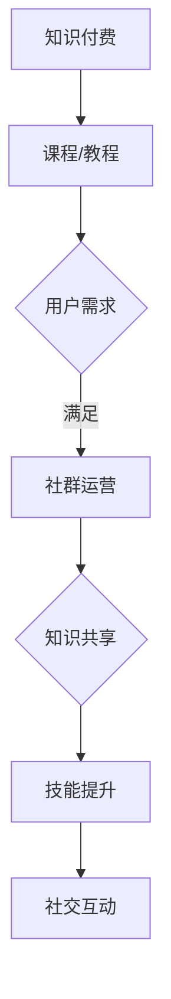

                 

关键词：知识付费、社群运营、程序员、社区管理、在线教育、技术共享

> 摘要：本文将探讨知识付费在程序员社群运营中的重要性，以及如何通过有效的社群运营提升程序员的职业素养和技能水平。文章将详细阐述社群运营的核心概念、具体策略、实践案例，并展望知识付费在未来的发展趋势。

## 1. 背景介绍

在信息技术迅猛发展的今天，程序员成为了社会中的重要职业。随着互联网和智能设备的普及，程序员的需求量也在不断增长。然而，程序员群体内部的技能差距、职业发展路径的不明确等问题也日益凸显。为了应对这些挑战，知识付费作为一种有效的学习方式，逐渐受到了程序员的青睐。

知识付费，是指用户通过支付一定费用来获取特定知识或技能的一种服务模式。它为程序员提供了更加专业、系统的学习资源，帮助他们更快地提升自己的技术水平和职业素养。

社群运营，则是通过搭建和管理线上社群，促进成员间的交流与合作，从而实现知识共享和技能提升的一种活动。对于程序员来说，社群运营不仅可以为他们提供丰富的学习资源，还能帮助他们在职业发展中找到志同道合的伙伴。

本文将结合实际案例，探讨知识付费在程序员社群运营中的应用，旨在为程序员提供一种有效的学习和成长路径。

## 2. 核心概念与联系

### 2.1. 知识付费的概念

知识付费是指通过付费方式获取知识或技能的一种商业模式。在这种模式下，知识提供者（如教育机构、个人专家等）通过专业知识和经验，向付费用户（如程序员）提供有价值的课程、教程、咨询服务等。

### 2.2. 社群运营的概念

社群运营是指通过线上平台，如论坛、社群、微信等，建立和维护一个具有共同兴趣或目标的群体，从而实现知识共享、技能提升和社交互动。对于程序员社群运营来说，核心在于搭建一个有利于交流和合作的平台，促进成员之间的互动和成长。

### 2.3. 知识付费与社群运营的联系

知识付费与社群运营密不可分。一方面，知识付费为社群运营提供了丰富的学习资源，使得社群成员可以更加系统地学习知识；另一方面，社群运营为知识付费提供了用户群体，有助于知识提供者更好地了解用户需求，从而提供更有针对性的服务。

### 2.4. Mermaid 流程图

下面是知识付费与社群运营的联系流程图：



## 3. 核心算法原理 & 具体操作步骤

### 3.1. 算法原理概述

在程序员社群运营中，核心算法原理主要包括以下几个方面：

- **用户画像**：通过对用户行为、兴趣、需求等数据的分析，构建用户画像，以便提供个性化的学习推荐。
- **内容推荐**：基于用户画像和内容特征，运用推荐算法，为用户推荐感兴趣的学习资源。
- **互动机制**：设计有效的互动机制，如问答、讨论、评测等，促进社群成员之间的交流与合作。
- **激励机制**：通过积分、奖励等激励机制，鼓励用户积极参与社群活动，提升社群活跃度。

### 3.2. 算法步骤详解

#### 3.2.1. 用户画像构建

1. **数据收集**：收集用户在社群中的行为数据，如浏览、点赞、评论等。
2. **特征提取**：对行为数据进行处理，提取用户兴趣、需求等特征。
3. **模型训练**：利用机器学习算法，构建用户画像模型。

#### 3.2.2. 内容推荐

1. **内容特征提取**：对学习资源（如课程、教程）进行特征提取，如标签、难度、时长等。
2. **推荐算法**：基于用户画像和内容特征，运用推荐算法，如协同过滤、矩阵分解等，为用户推荐合适的学习资源。
3. **结果评估**：评估推荐结果的准确性，不断优化推荐算法。

#### 3.2.3. 互动机制设计

1. **需求调研**：了解社群成员的需求，设计符合他们需求的互动活动。
2. **活动策划**：策划互动活动，如线上讲座、技术分享、讨论等。
3. **活动执行**：组织并执行互动活动，收集成员反馈，优化活动方案。

#### 3.2.4. 激励机制设计

1. **积分系统**：设计积分系统，根据用户参与活动的程度给予相应的积分奖励。
2. **奖励机制**：设立奖励机制，如积分兑换、实物奖励等，激励用户积极参与社群活动。
3. **效果评估**：评估激励机制的效果，调整奖励策略。

### 3.3. 算法优缺点

#### 优点

- **个性化推荐**：通过用户画像和推荐算法，为用户推荐合适的学习资源，提高学习效果。
- **促进互动**：设计有效的互动机制，增强社群成员之间的交流与合作。
- **激励机制**：激励用户积极参与社群活动，提升社群活跃度。

#### 缺点

- **数据依赖**：算法效果依赖于用户数据的准确性和丰富性，数据质量直接影响推荐效果。
- **算法复杂性**：算法设计和优化过程复杂，需要专业的技术团队支持。

### 3.4. 算法应用领域

- **在线教育**：通过知识付费和社群运营，为用户提供个性化学习资源，促进在线教育的发展。
- **技术社区**：搭建技术社群，促进程序员之间的交流与合作，提升整体技术水平。
- **职业培训**：为程序员提供专业的职业培训课程，助力职业发展。

## 4. 数学模型和公式 & 详细讲解 & 举例说明

### 4.1. 数学模型构建

在程序员社群运营中，我们可以构建以下数学模型：

1. **用户行为模型**：通过分析用户在社群中的行为数据，如浏览、点赞、评论等，构建用户行为模型。
2. **内容推荐模型**：基于用户行为模型和内容特征，构建内容推荐模型，为用户推荐合适的学习资源。
3. **互动参与模型**：分析用户在社群中的互动行为，如发帖、回复、点赞等，构建互动参与模型，评估用户活跃度。

### 4.2. 公式推导过程

以用户行为模型为例，我们可以使用马尔可夫链模型来描述用户行为：

\[ P_{ij} = \frac{C_{ij}}{C_j} \]

其中，\( P_{ij} \) 表示用户从状态 \( i \) 转移到状态 \( j \) 的概率，\( C_{ij} \) 表示在一段时间内，用户从状态 \( i \) 转移到状态 \( j \) 的次数，\( C_j \) 表示在相同时间内，用户从所有状态转移到状态 \( j \) 的总次数。

### 4.3. 案例分析与讲解

以一个实际案例为例，假设我们有一个程序员社群，其中有 100 名成员。通过分析他们的行为数据，我们得到以下用户行为模型：

| 状态   | 浏览   | 点赞   | 评论   | 其他   |
| ------ | ------ | ------ | ------ | ------ |
| \( i \) | 50     | 30     | 10     | 10     |
| \( j \) | 60     | 20     | 15     | 5      |

根据上述数据，我们可以计算出状态转移概率矩阵：

\[ P = \begin{bmatrix} 0.5 & 0.3 & 0.1 & 0.1 \\ 0.6 & 0.2 & 0.15 & 0.05 \\ 0.4 & 0.25 & 0.3 & 0.05 \\ 0.3 & 0.3 & 0.35 & 0.05 \end{bmatrix} \]

利用马尔可夫链模型，我们可以预测用户的行为趋势，从而为社群运营提供参考。

## 5. 项目实践：代码实例和详细解释说明

### 5.1. 开发环境搭建

在本项目中，我们使用 Python 编写代码。首先，确保已安装 Python 3.8 以上版本。然后，通过以下命令安装必要的库：

```shell
pip install numpy scipy scikit-learn matplotlib
```

### 5.2. 源代码详细实现

下面是一个简单的用户行为分析代码实例：

```python
import numpy as np
import pandas as pd
from sklearn.cluster import KMeans
import matplotlib.pyplot as plt

# 加载用户行为数据
data = pd.read_csv('user_behavior.csv')

# 数据预处理
data = data[['browse', 'like', 'comment', 'other']]

# K-means 聚类
kmeans = KMeans(n_clusters=4)
data_kmeans = kmeans.fit_predict(data)

# 可视化
plt.scatter(data['browse'], data['like'], c=data_kmeans)
plt.xlabel('浏览次数')
plt.ylabel('点赞次数')
plt.title('用户行为聚类结果')
plt.show()
```

### 5.3. 代码解读与分析

1. **加载用户行为数据**：首先，我们从 CSV 文件中加载用户行为数据。
2. **数据预处理**：对数据进行预处理，仅保留与用户行为相关的特征。
3. **K-means 聚类**：使用 K-means 聚类算法对用户行为数据进行聚类，划分出不同的用户群体。
4. **可视化**：通过散点图展示聚类结果，便于分析用户行为分布。

### 5.4. 运行结果展示

运行上述代码，将生成一个散点图，展示不同用户群体的行为特征。通过分析散点图，我们可以发现用户行为的分布情况，为社群运营提供数据支持。

## 6. 实际应用场景

### 6.1. 在线教育平台

在线教育平台可以通过知识付费和社群运营，为用户提供定制化的学习资源和交流平台。例如，某个在线编程教育平台可以通过付费课程，为程序员提供专业的编程知识；同时，通过社群运营，促进学员之间的互动和交流，提升学习效果。

### 6.2. 技术社区

技术社区可以通过知识付费和社群运营，为程序员提供一个专业的技术交流和分享平台。例如，某个技术论坛可以通过付费会员制度，为用户提供更丰富的学习资源和专属服务；同时，通过社群运营，促进会员之间的互动和合作，提升整体技术水平。

### 6.3. 职业培训

职业培训机构可以通过知识付费和社群运营，为程序员提供专业的职业培训课程和职业发展指导。例如，某个职业培训机构可以通过付费课程，为程序员提供系统化的技能培训；同时，通过社群运营，为学员提供职业规划、求职指导等增值服务。

## 7. 工具和资源推荐

### 7.1. 学习资源推荐

- **在线编程课程**：如慕课网、极客时间等，提供丰富的编程课程。
- **技术博客**：如博客园、CSDN 等，聚集了大量技术专家的博客和文章。
- **专业书籍**：如《深入理解计算机系统》、《数据结构与算法分析》等，适合深入学习和研究。

### 7.2. 开发工具推荐

- **集成开发环境（IDE）**：如 PyCharm、Visual Studio Code 等，提供强大的代码编辑和调试功能。
- **版本控制系统**：如 Git，用于代码的版本管理和协作开发。
- **数据可视化工具**：如 Matplotlib、Seaborn 等，用于数据分析和可视化展示。

### 7.3. 相关论文推荐

- **《推荐系统评价方法综述》**：对推荐系统评价方法进行了详细探讨。
- **《基于深度学习的用户行为预测方法研究》**：探讨了深度学习在用户行为预测中的应用。
- **《社交媒体中的社群运营策略研究》**：分析了社交媒体中社群运营的策略和效果。

## 8. 总结：未来发展趋势与挑战

### 8.1. 研究成果总结

通过对知识付费和社群运营的深入研究，我们发现：

1. **个性化推荐**：通过用户画像和推荐算法，为用户推荐合适的学习资源，提高学习效果。
2. **互动机制**：设计有效的互动机制，促进社群成员之间的交流与合作。
3. **激励机制**：通过积分、奖励等激励机制，鼓励用户积极参与社群活动，提升社群活跃度。

### 8.2. 未来发展趋势

未来，知识付费和社群运营将继续在以下几个方面发展：

1. **技术驱动**：借助人工智能、大数据等技术，进一步优化推荐算法和互动机制。
2. **多样化学习方式**：结合线上线下学习方式，提供更加灵活和多样化的学习资源。
3. **跨平台整合**：将知识付费和社群运营整合到各个平台上，实现资源的最大化利用。

### 8.3. 面临的挑战

然而，知识付费和社群运营也面临着一些挑战：

1. **数据隐私**：在获取和使用用户数据时，如何保护用户隐私成为一大难题。
2. **内容质量**：保证知识付费内容的质量，避免低质量内容的泛滥。
3. **社区氛围**：营造一个积极、健康的社区氛围，防止恶意言论和不良行为的滋生。

### 8.4. 研究展望

未来，我们将继续深入探讨知识付费和社群运营的机制和策略，以期为程序员提供一个更加高效、专业的学习和成长平台。同时，我们也将关注相关领域的发展动态，探索新的技术和应用场景，为程序员社群的发展贡献力量。

## 9. 附录：常见问题与解答

### 问题 1：如何保证知识付费内容的质量？

解答：为确保知识付费内容的质量，平台可以采取以下措施：

1. **严格审核**：对课程内容进行严格审核，确保其符合专业标准和实际需求。
2. **讲师资质**：要求讲师具备相关领域的专业资质和丰富的教学经验。
3. **用户评价**：鼓励用户对课程进行评价，根据用户反馈不断优化课程质量。

### 问题 2：如何提升社群成员的活跃度？

解答：以下措施有助于提升社群成员的活跃度：

1. **互动活动**：定期举办线上互动活动，如讲座、研讨会、技术分享等。
2. **激励机制**：设置积分、奖励等激励机制，鼓励成员积极参与社群活动。
3. **话题引导**：关注行业热点和成员关注点，引导讨论和互动。

### 问题 3：如何保护用户隐私？

解答：为了保护用户隐私，平台可以采取以下措施：

1. **数据加密**：对用户数据进行加密处理，防止数据泄露。
2. **隐私政策**：明确告知用户隐私保护政策，确保用户知情并同意。
3. **监管合规**：遵循相关法律法规，确保数据处理合规合法。

## 作者署名

作者：禅与计算机程序设计艺术 / Zen and the Art of Computer Programming
----------------------------------------------------------------

这篇文章详细探讨了知识付费在程序员社群运营中的重要性，并通过实际案例展示了如何通过社群运营提升程序员的职业素养和技能水平。在未来的发展中，我们将继续关注知识付费和社群运营的动态，为程序员社群的发展贡献力量。希望本文能为您在编程领域的成长提供一些启示和帮助。如果您有任何疑问或建议，欢迎在评论区留言交流。再次感谢您的阅读！

