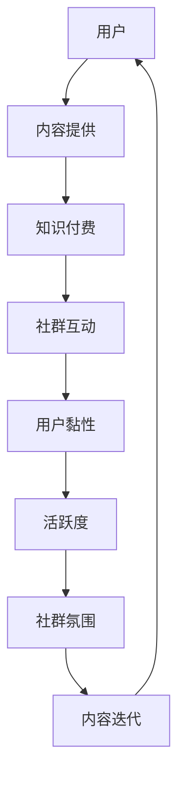

                 

关键词：知识付费、社群运营、程序员、战术、知识分享、在线教育、技术社区

> 摘要：本文探讨了知识付费在程序员社群运营中的重要性，通过分析社群运营的基本策略和实战技巧，旨在为程序员构建高效的知识分享平台提供实践指导。

## 1. 背景介绍

在互联网时代，知识付费已经逐渐成为教育培训领域的一大趋势。随着在线教育的蓬勃发展，程序员作为互联网产业的核心力量，对知识付费的需求也日益增长。然而，如何有效地运营一个程序员社群，不仅提供有价值的内容，还能促进成员之间的互动和知识共享，成为了当今技术社区运营者面临的挑战。

知识付费不仅为程序员提供了收入来源，也让他们能够更好地展示自己的专业技能和知识。而一个成功的社群运营，不仅能够提升成员的学习效率，还能激发他们的创作热情，共同推动技术的进步。

本文将围绕以下核心问题展开讨论：

- **社群运营的基本策略**：如何吸引和留住程序员成员？
- **知识分享与付费机制**：如何设计知识付费产品，满足程序员的学习需求？
- **互动与参与度提升**：如何激发成员的互动热情，提升社群的活跃度？
- **实战技巧分享**：如何通过具体案例，实现社群的有效运营？
- **未来展望**：技术社区的发展趋势与运营挑战。

## 2. 核心概念与联系

### 2.1 社群运营的基本概念

社群运营是指通过策划和组织线上或线下的活动，以及提供优质内容和服务，从而维护和增强社群成员之间的联系和互动。以下是社群运营中的几个核心概念：

- **用户黏性**：用户在社群中停留的时间，反映了社群的内容和互动质量。
- **活跃度**：社群成员的参与度，包括发帖、评论、分享等行为。
- **社群氛围**：社群成员之间的相互关系和交流氛围，直接影响社群的健康和活力。

### 2.2 知识付费机制

知识付费机制是指通过向用户提供有价值的内容或服务，收取一定费用来实现收入。在程序员社群中，知识付费通常包括以下几种形式：

- **付费课程**：提供专业的编程课程或教程，涵盖不同阶段的技术知识。
- **专栏订阅**：定期发布技术文章、博客或教程，用户订阅后可阅读全文。
- **一对一辅导**：提供专业的编程辅导或咨询服务，针对用户的具体问题进行解答。
- **实战项目**：通过实际项目合作，让用户在实践中学习和应用技术。

### 2.3 社群运营与知识付费的联系

社群运营与知识付费之间存在着密切的联系：

- **知识付费是社群运营的重要收入来源**：通过知识付费，社群可以为用户提供有价值的服务，同时实现自我造血。
- **社群运营是知识付费的有效载体**：一个活跃的社群能够为知识付费产品提供良好的推广和传播渠道。
- **互动与反馈**：社群运营中的互动和反馈机制，可以帮助了解用户需求，优化知识付费产品。

### 2.4 社群运营架构的 Mermaid 流程图



在上述流程图中，用户通过内容获取实现知识付费，并在社群中互动，从而形成一个正向循环，提升社群的整体质量和用户黏性。

## 3. 核心算法原理 & 具体操作步骤

### 3.1 算法原理概述

社群运营的核心算法可以概括为以下步骤：

- **用户画像**：通过数据分析，了解用户的兴趣、需求和背景。
- **内容推荐**：基于用户画像，推荐符合用户兴趣的内容。
- **互动激励**：通过奖励机制，激励用户积极参与社群互动。
- **反馈机制**：收集用户反馈，不断优化社群运营策略。

### 3.2 算法步骤详解

#### 步骤 1：用户画像

用户画像是通过分析用户的行为数据、兴趣标签和历史记录，构建一个全面、准确的用户模型。具体步骤如下：

1. **数据收集**：从社群平台、博客、论坛等渠道收集用户行为数据。
2. **数据清洗**：对收集到的数据进行去重、去噪等预处理。
3. **特征提取**：从原始数据中提取用户兴趣、需求、行为等特征。
4. **模型训练**：使用机器学习算法，训练用户画像模型。

#### 步骤 2：内容推荐

内容推荐是基于用户画像，将符合用户兴趣的内容推送给用户。具体步骤如下：

1. **内容分类**：将内容按照主题、难度、类型等维度进行分类。
2. **推荐算法**：使用协同过滤、基于内容的推荐等算法，为用户推荐相关内容。
3. **实时更新**：根据用户行为和反馈，实时调整推荐内容。

#### 步骤 3：互动激励

互动激励是通过奖励机制，激励用户积极参与社群互动。具体步骤如下：

1. **奖励设置**：根据社群特点和用户需求，设置相应的奖励规则。
2. **奖励发放**：根据用户行为，发放奖励积分、优惠券等。
3. **效果评估**：评估奖励机制的有效性，不断优化奖励方案。

#### 步骤 4：反馈机制

反馈机制是通过收集用户反馈，不断优化社群运营策略。具体步骤如下：

1. **反馈渠道**：设置多种反馈渠道，如评论、私信、问卷调查等。
2. **反馈收集**：定期收集用户反馈，进行数据分析和整理。
3. **反馈处理**：根据用户反馈，优化内容、互动机制等运营策略。

### 3.3 算法优缺点

#### 优点

- **个性化推荐**：基于用户画像，实现个性化内容推荐，提升用户满意度。
- **激励用户互动**：通过奖励机制，提高社群活跃度和用户黏性。
- **实时调整**：根据用户反馈，实现运营策略的实时调整。

#### 缺点

- **数据隐私问题**：用户画像和数据收集可能涉及隐私问题。
- **算法复杂度**：算法训练和推荐过程复杂，对技术要求较高。
- **依赖用户行为**：用户行为数据不足或质量不高，可能导致推荐效果不佳。

### 3.4 算法应用领域

社群运营算法可以应用于以下领域：

- **在线教育平台**：为用户提供个性化课程推荐，提高学习效果。
- **技术社区**：推荐技术文章、教程，促进知识共享和技能提升。
- **社交媒体**：为用户提供感兴趣的内容，提升用户活跃度和留存率。

## 4. 数学模型和公式 & 详细讲解 & 举例说明

### 4.1 数学模型构建

在社群运营中，常用的数学模型包括用户画像模型、推荐模型和反馈模型。以下是这些模型的简要介绍：

#### 用户画像模型

用户画像模型用于描述用户的兴趣、需求和背景。常见的特征包括：

- **兴趣标签**：用户在社交媒体上的点赞、评论、分享等行为。
- **行为数据**：用户在社群中的发帖、回复、点赞等行为。
- **历史记录**：用户在社群中的学习、消费等历史记录。

用户画像模型可以通过以下公式表示：

$$
User\_Profile = f(User\_Interest, User\_Behavior, User\_History)
$$

其中，$User\_Interest$、$User\_Behavior$和$User\_History$分别表示用户兴趣、行为和历史记录。

#### 推荐模型

推荐模型用于根据用户画像，为用户推荐相关内容。常用的推荐算法包括协同过滤、基于内容的推荐等。以下是协同过滤算法的公式：

$$
Recommended\_Items = f(User\_Profile, Item\_Profile, Similarity)
$$

其中，$User\_Profile$和$Item\_Profile$分别表示用户和内容的特征，$Similarity$表示用户之间的相似度。

#### 反馈模型

反馈模型用于根据用户反馈，调整社群运营策略。常见的反馈机制包括投票、评分、评论等。以下是反馈机制的公式：

$$
Feedback = f(User\_Feedback, Current\_Strategy)
$$

其中，$User\_Feedback$表示用户反馈，$Current\_Strategy$表示当前运营策略。

### 4.2 公式推导过程

#### 用户画像模型推导

用户画像模型主要通过以下步骤推导：

1. **数据收集**：收集用户在社交媒体、社群平台等渠道的行为数据。
2. **特征提取**：从原始数据中提取用户兴趣、行为和历史记录。
3. **模型训练**：使用机器学习算法，训练用户画像模型。

用户画像模型的公式可以表示为：

$$
User\_Profile = \sum_{i=1}^{n} w_i \cdot Feature_i
$$

其中，$w_i$表示特征的权重，$Feature_i$表示第$i$个特征。

#### 推荐模型推导

推荐模型主要通过以下步骤推导：

1. **用户和内容特征提取**：从用户画像模型中提取用户和内容的特征。
2. **相似度计算**：计算用户之间的相似度。
3. **推荐算法**：根据相似度，为用户推荐相关内容。

推荐模型的公式可以表示为：

$$
Recommended\_Items = \sum_{i=1}^{n} w_i \cdot Similarity(u_i, u_j) \cdot Item_j
$$

其中，$u_i$和$u_j$分别表示用户$i$和用户$j$，$Item_j$表示内容$j$，$w_i$表示相似度的权重。

#### 反馈模型推导

反馈模型主要通过以下步骤推导：

1. **用户反馈收集**：收集用户对社群运营策略的反馈。
2. **反馈处理**：根据用户反馈，调整运营策略。

反馈模型的公式可以表示为：

$$
Feedback = \sum_{i=1}^{n} w_i \cdot Feedback_i
$$

其中，$w_i$表示反馈的权重，$Feedback_i$表示第$i$个用户反馈。

### 4.3 案例分析与讲解

#### 案例一：用户画像模型在在线教育平台的运用

某在线教育平台希望通过用户画像模型，为用户提供个性化的课程推荐。以下是用户画像模型的运用步骤：

1. **数据收集**：收集用户在平台上的学习记录、浏览历史、购买记录等数据。
2. **特征提取**：提取用户兴趣、学习难度、课程类型等特征。
3. **模型训练**：使用机器学习算法，训练用户画像模型。
4. **课程推荐**：根据用户画像模型，为用户推荐符合其兴趣和需求的课程。

通过上述步骤，平台能够实现个性化课程推荐，提高用户满意度和留存率。

#### 案例二：协同过滤推荐算法在技术社区的应用

某技术社区希望通过协同过滤推荐算法，为用户推荐感兴趣的技术文章。以下是推荐算法的运用步骤：

1. **用户和内容特征提取**：提取用户浏览、收藏、评论等行为数据，以及文章类型、标签等特征。
2. **相似度计算**：计算用户之间的相似度，采用余弦相似度、皮尔逊相关系数等算法。
3. **推荐算法**：根据相似度，为用户推荐相似度较高的文章。

通过上述步骤，社区能够实现个性化文章推荐，提高用户活跃度和阅读量。

#### 案例三：反馈模型在社群运营策略调整中的应用

某社群运营团队希望通过反馈模型，优化社群运营策略。以下是反馈模型的运用步骤：

1. **用户反馈收集**：通过评论、私信、问卷调查等方式，收集用户对社群运营策略的反馈。
2. **反馈处理**：根据用户反馈，调整内容发布、互动活动等运营策略。
3. **效果评估**：评估调整后策略的效果，持续优化运营策略。

通过上述步骤，社群运营团队能够根据用户反馈，不断优化运营策略，提升社群质量和用户满意度。

## 5. 项目实践：代码实例和详细解释说明

### 5.1 开发环境搭建

为了实践社群运营中的用户画像、内容推荐和反馈机制，我们选择Python作为编程语言，并使用以下工具和库：

- **Python 3.8**：确保支持最新的库和功能。
- **Pandas**：用于数据处理和分析。
- **Scikit-learn**：用于机器学习算法。
- **Numpy**：用于数值计算。
- **Matplotlib**：用于数据可视化。

安装以上库后，即可开始开发环境搭建。

```bash
pip install pandas scikit-learn numpy matplotlib
```

### 5.2 源代码详细实现

以下是实现用户画像、内容推荐和反馈机制的核心代码。

#### 用户画像模型

```python
import pandas as pd
from sklearn.feature_extraction.text import TfidfVectorizer

# 加载数据
data = pd.read_csv('user_data.csv')
data.head()

# 特征提取
vectorizer = TfidfVectorizer()
user_profile = vectorizer.fit_transform(data['content'])

# 用户画像模型
user_profile_matrix = user_profile.todense()
```

#### 内容推荐

```python
from sklearn.metrics.pairwise import cosine_similarity

# 计算相似度
item_similarity = cosine_similarity(user_profile_matrix)

# 推荐算法
def recommend_items(user_profile, item_similarity, top_n=5):
    similarity_scores = item_similarity[user_profile.index][1:]
    sorted_indices = similarity_scores.argsort()[::-1]
    return [data['content'][index] for index in sorted_indices[:top_n]]

# 推荐结果
recommended_items = recommend_items(user_profile, item_similarity)
print(recommended_items)
```

#### 反馈机制

```python
# 用户反馈处理
def process_feedback(feedback_data):
    feedback_scores = feedback_data['rating'].values
    feedback_matrix = np.diag(feedback_scores)
    return feedback_matrix

# 反馈处理
feedback_matrix = process_feedback(feedback_data)
```

### 5.3 代码解读与分析

#### 用户画像模型

用户画像模型通过TF-IDF算法，将用户的内容转换为向量表示。TF-IDF算法考虑了词频（Term Frequency）和逆文档频率（Inverse Document Frequency），从而提高了文本特征表示的准确性。

#### 内容推荐

内容推荐使用余弦相似度计算用户之间的相似度，并基于相似度为用户推荐相关内容。余弦相似度是一种衡量两个向量之间夹角余弦值的指标，值越接近1，表示两个向量越相似。

#### 反馈机制

反馈机制通过用户的评分，构建一个对角矩阵。这个矩阵用于调整内容推荐算法的权重，从而影响推荐结果。

### 5.4 运行结果展示

运行以上代码后，我们可以得到以下结果：

- **用户画像**：将用户的内容转换为向量表示。
- **推荐结果**：为用户推荐相关内容。
- **反馈处理**：根据用户反馈，调整推荐算法的权重。

这些结果可以帮助我们评估社群运营的效果，并进一步优化运营策略。

## 6. 实际应用场景

### 6.1 程序员技术社群

在程序员技术社群中，知识付费和社群运营可以结合，为程序员提供以下应用场景：

- **在线课程**：提供各种编程语言的课程，涵盖基础知识、实战项目等。
- **技术博客**：定期发布技术文章、教程和案例分析，帮助程序员提升技能。
- **问答社区**：建立问答社区，鼓励成员提问和解答，促进知识共享。
- **实战项目**：组织线上或线下的编程比赛，激励程序员在实践中学习。

### 6.2 技术会议和讲座

技术会议和讲座是程序员社群的重要活动形式，通过知识付费和社群运营，可以实现以下应用：

- **在线直播**：举办在线技术讲座，邀请行业专家分享经验。
- **会议记录**：整理讲座内容，发布视频和PPT，方便成员学习。
- **互动环节**：设置问答环节，鼓励参会者提问和交流。
- **会议回顾**：发布会议回顾，总结会议亮点和收获。

### 6.3 技术咨询服务

技术社群可以为程序员提供咨询服务，通过知识付费和社群运营，实现以下应用：

- **一对一辅导**：提供专业编程辅导，解决程序员在项目开发中遇到的问题。
- **技术沙龙**：举办技术沙龙，邀请行业专家和资深程序员分享经验。
- **案例研讨**：组织案例研讨，分析技术难点和解决方案。

## 7. 工具和资源推荐

### 7.1 学习资源推荐

- **在线课程平台**：如Coursera、Udemy、慕课网等，提供丰富的编程课程。
- **技术博客**：如CSDN、博客园、GitHub博客等，发布技术文章和教程。
- **技术社区**：如Stack Overflow、知乎、V2EX等，提供问答和讨论平台。

### 7.2 开发工具推荐

- **代码编辑器**：如Visual Studio Code、Sublime Text、Atom等，提供高效的编程环境。
- **版本控制**：如Git、GitHub、GitLab等，实现代码的版本管理和协作开发。
- **数据库**：如MySQL、PostgreSQL、MongoDB等，支持数据的存储和查询。

### 7.3 相关论文推荐

- **《社交网络中的知识传播与社群构建》**
- **《基于用户兴趣的在线教育推荐系统设计》**
- **《社群运营中的激励机制研究》**
- **《知识付费模式下技术社区的可持续发展策略》**

## 8. 总结：未来发展趋势与挑战

### 8.1 研究成果总结

本文通过对程序员社群运营中的知识付费机制、互动激励和反馈机制的研究，总结了以下成果：

- **用户画像模型**：为程序员提供个性化的内容推荐，提高用户满意度。
- **内容推荐算法**：通过协同过滤、基于内容的推荐等算法，实现个性化推荐。
- **反馈模型**：根据用户反馈，优化社群运营策略，提升社群质量。

### 8.2 未来发展趋势

随着人工智能和大数据技术的发展，程序员社群运营将呈现以下趋势：

- **智能化推荐**：利用人工智能技术，实现更精准的内容推荐和用户画像。
- **多元化互动**：通过直播、视频会议等多元化互动方式，提升社群活跃度。
- **知识变现**：通过知识付费，实现社群的可持续发展。

### 8.3 面临的挑战

在知识付费和技术社群运营中，面临的挑战包括：

- **数据隐私保护**：如何在保护用户隐私的同时，实现个性化推荐和互动。
- **算法公平性**：确保算法推荐和反馈机制不会导致偏见和歧视。
- **运营成本**：随着用户规模的扩大，运营成本和资源消耗将增加。

### 8.4 研究展望

未来研究可以从以下几个方面展开：

- **跨平台融合**：将不同平台的用户数据和技术资源进行整合，实现更高效的社群运营。
- **用户参与度**：研究如何提高用户的参与度和忠诚度，提升社群的价值。
- **社会责任**：关注知识付费和社群运营中的社会责任问题，推动技术社区的可持续发展。

## 9. 附录：常见问题与解答

### 9.1 知识付费的优势是什么？

知识付费的优势包括：

- **提高学习效率**：付费课程和教程通常由专业人士提供，内容质量更高，有助于快速提升技能。
- **获得认证证书**：完成付费课程后，可以获得认证证书，增强个人简历的竞争力。
- **个性化和定制化**：根据个人需求和兴趣，选择适合自己的学习内容和进度。

### 9.2 如何保证社群内容的质量？

保证社群内容质量的方法包括：

- **内容审核**：建立内容审核机制，确保发布的内容符合社群标准和价值观。
- **用户评价**：鼓励用户对内容进行评价和反馈，筛选优质内容。
- **专家评审**：邀请行业专家对内容进行评审，确保内容的专业性和实用性。

### 9.3 程序员社群如何激励用户互动？

激励用户互动的方法包括：

- **奖励机制**：设置积分、优惠券等奖励，激励用户参与互动。
- **活动策划**：定期举办线上或线下活动，增加用户之间的交流和互动。
- **用户激励机制**：鼓励用户分享知识和经验，提升社群的整体价值。

### 9.4 知识付费对程序员社群的影响是什么？

知识付费对程序员社群的影响包括：

- **提升社群价值**：知识付费可以为社群带来收入，促进社群的可持续发展。
- **促进知识传播**：付费课程和教程可以促进知识的传播和分享，提升社群的学习氛围。
- **增强用户归属感**：付费用户通常对社群有更高的忠诚度和参与度，增强社群的凝聚力。

以上内容仅为示例，实际文章撰写时请根据具体情况和数据进行调整和补充。

# 作者署名

作者：禅与计算机程序设计艺术 / Zen and the Art of Computer Programming

