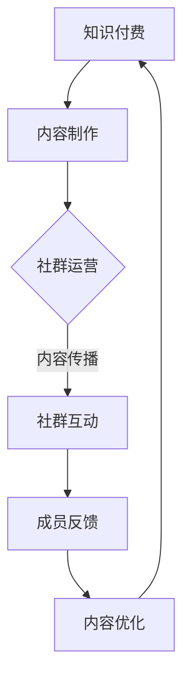

                 

关键词：知识付费、程序员、社群运营、技巧、策略

> 摘要：本文旨在探讨知识付费在程序员社群运营中的应用，分析如何通过有效的社群运营技巧，提升程序员的知识传播效果，促进社区活跃度。文章将从核心概念、算法原理、数学模型、项目实践、实际应用等多个角度，深入解析知识付费在程序员社群中的具体实施方法和潜在价值。

## 1. 背景介绍

知识付费是近年来兴起的一种商业模式，其核心在于将知识作为一种商品进行售卖。在程序员社群中，知识付费的形式多种多样，包括在线课程、电子书、技术讲座、会员订阅等。随着技术的不断进步和互联网的普及，知识付费已经成为了程序员提升自身技能、拓展视野的重要途径。

社群运营则是围绕一定主题和目标，通过线上或线下活动，促进成员之间的交流与合作，共同推动社区发展。对于程序员社群而言，社群运营不仅能够提升成员之间的粘性，还能为知识付费提供良好的传播渠道和平台。

本文将从以下几个方面展开讨论：

- 核心概念与联系
- 核心算法原理与具体操作步骤
- 数学模型和公式与详细讲解
- 项目实践：代码实例和详细解释说明
- 实际应用场景
- 工具和资源推荐
- 总结：未来发展趋势与挑战

通过以上内容的详细解析，希望能够为程序员社群的运营提供一些有价值的参考和指导。

## 2. 核心概念与联系

在探讨知识付费和社群运营的联系之前，我们需要先明确一些核心概念。

### 2.1 知识付费

知识付费是指将知识作为一种商品进行售卖的行为。这种知识可以是具体的技能培训，也可以是行业洞察、技术趋势分析等。知识付费的主要形式包括：

- **在线课程**：通过视频、直播等形式，提供系统性的知识传授。
- **电子书**：以电子文档的形式，将专业知识整理成书籍进行销售。
- **技术讲座**：邀请行业专家进行演讲，分享最新技术动态和经验。
- **会员订阅**：为用户提供定期更新的知识内容，通常以月度或年度会员形式收费。

### 2.2 社群运营

社群运营是指围绕一个共同兴趣或目标，通过线上或线下活动，促进成员之间的互动与交流，形成一种互助、互惠的关系。社群运营的核心包括：

- **内容建设**：提供有价值的内容，吸引和留住成员。
- **活动策划**：定期举办各类活动，如线上研讨会、技术沙龙、线下聚会等。
- **成员管理**：对社群成员进行有效的组织和管理，提高社群活跃度。
- **互动机制**：通过评论、点赞、分享等互动方式，促进成员之间的交流。

### 2.3 知识付费与社群运营的联系

知识付费和社群运营之间存在着密切的联系。首先，知识付费为社群提供了经济支持，使得社群能够持续运营。其次，社群为知识付费提供了良好的传播平台，通过社群的活动和互动，可以有效地推广和传播知识内容。具体来说：

- **知识付费促进社群活跃**：高质量的知识内容可以吸引更多的程序员加入社群，同时激发成员的参与热情。
- **社群运营提升知识价值**：通过社群的讨论、交流和实践，知识付费的内容可以得到更深入的理解和应用，从而提升其价值。
- **双向反馈**：社群运营过程中，成员的反馈可以帮助知识付费提供商不断优化内容，而高质量的知识内容又能进一步吸引成员，形成良性循环。

### 2.4 Mermaid 流程图

下面是一个简单的 Mermaid 流程图，展示知识付费与社群运营之间的核心流程和环节。



通过这个流程图，我们可以清晰地看到知识付费和社群运营之间的互动关系，以及各个环节如何相互促进，共同推动社群的发展。

## 3. 核心算法原理 & 具体操作步骤

### 3.1 算法原理概述

在程序员社群运营中，知识付费的成功离不开有效的算法原理。核心算法主要涉及用户行为分析、内容推荐和社群活跃度提升等方面。

### 3.2 算法步骤详解

#### 3.2.1 用户行为分析

用户行为分析是社群运营的基础，通过分析用户的行为数据，可以了解用户的兴趣偏好、活跃时间段等，从而为内容推荐和社群管理提供依据。

- **数据收集**：收集用户在社群中的行为数据，包括发帖、回复、点赞、分享等。
- **行为建模**：建立用户行为模型，通过聚类、分类等算法，分析用户的兴趣偏好。
- **行为预测**：基于用户历史行为，预测用户的未来行为，为内容推荐提供依据。

#### 3.2.2 内容推荐

内容推荐是知识付费的核心环节，通过算法分析，将最符合用户兴趣的知识内容推荐给用户。

- **推荐算法**：采用协同过滤、基于内容的推荐算法等，根据用户行为和内容特征，生成推荐列表。
- **内容展示**：将推荐内容以合适的形式展示给用户，如首页推荐、弹窗推荐等。
- **用户反馈**：收集用户对推荐内容的反馈，用于优化推荐算法。

#### 3.2.3 社群活跃度提升

社群活跃度是社群运营的重要指标，通过一系列算法和策略，可以有效地提升社群的活跃度。

- **活动策划**：根据用户兴趣和行为数据，策划有针对性的活动，如技术竞赛、讨论会等。
- **互动机制**：设计多样化的互动机制，如评论点赞、积分制度等，鼓励用户积极参与。
- **社群管理**：通过算法分析，识别社群中的活跃用户和管理者，进行针对性的管理和激励。

### 3.3 算法优缺点

#### 优点

- **个性化推荐**：通过算法分析，为用户提供个性化的知识内容，提高用户满意度。
- **高效管理**：自动化算法可以帮助运营者更高效地管理社群，降低运营成本。
- **数据驱动**：基于数据分析的运营策略，使得社群运营更加科学和有针对性。

#### 缺点

- **数据隐私**：用户行为数据的收集和使用可能会涉及到数据隐私问题，需要严格遵循相关法律法规。
- **算法偏见**：算法可能会存在偏见，导致某些用户或内容被过度推荐或忽略。
- **依赖性**：过度依赖算法可能会降低运营者的主观判断能力，影响社群的整体质量。

### 3.4 算法应用领域

算法在程序员社群运营中的应用非常广泛，包括：

- **内容推荐**：为用户提供个性化的知识内容推荐。
- **社群管理**：通过算法分析，识别社群中的活跃用户和管理者，进行针对性的管理和激励。
- **活动策划**：根据用户兴趣和行为数据，策划有针对性的活动，提高社群活跃度。
- **用户行为分析**：了解用户的行为偏好，为运营决策提供依据。

## 4. 数学模型和公式 & 详细讲解 & 举例说明

### 4.1 数学模型构建

在程序员社群运营中，数学模型的应用可以帮助我们更好地理解用户行为、优化推荐算法、提升社群活跃度。以下是一个简化的数学模型，用于描述程序员社群的互动关系。

#### 4.1.1 用户模型

用户模型主要涉及用户的兴趣、行为和满意度等方面。

- **兴趣度**（Interest）：表示用户对某个领域的兴趣程度，可以是一个实数。
- **行为度**（Behavior）：表示用户在社群中的行为活跃度，如发帖、回复、点赞等。
- **满意度**（Satisfaction）：表示用户对社群的满意度，可以通过问卷调查等方式获取。

#### 4.1.2 内容模型

内容模型主要涉及内容的难度、实用性和用户喜好等方面。

- **难度度**（Difficulty）：表示内容的难度，可以是一个实数。
- **实用性**（Practicality）：表示内容的实用性，如是否能解决用户实际问题。
- **喜好度**（Preference）：表示用户对内容的喜好程度。

#### 4.1.3 互动模型

互动模型主要描述用户之间的互动关系，如评论、点赞等。

- **互动频次**（Frequency）：表示用户之间的互动次数。
- **互动强度**（Intensity）：表示用户之间互动的强度。

### 4.2 公式推导过程

基于上述模型，我们可以推导出一些基本的公式，用于描述用户行为、内容推荐和社群活跃度等。

#### 4.2.1 用户行为预测

用户行为的预测可以通过以下公式实现：

\[ P(B_{i+1}|B_i, I) = \frac{e^{w_1 \cdot B_i + w_2 \cdot I}}{1 + e^{w_1 \cdot B_i + w_2 \cdot I}} \]

其中，\( P(B_{i+1}|B_i, I) \) 表示在当前兴趣度 \( I \) 下，用户在下一个时间点的行为概率。\( w_1 \) 和 \( w_2 \) 是权重参数，可以通过优化算法进行调节。

#### 4.2.2 内容推荐

内容推荐可以通过以下公式实现：

\[ R(c|u) = \sum_{i=1}^{n} w_i \cdot P(c|u, I_i) \]

其中，\( R(c|u) \) 表示用户 \( u \) 对内容 \( c \) 的推荐度。\( w_i \) 是权重参数，\( P(c|u, I_i) \) 是内容 \( c \) 对用户 \( u \) 在兴趣度 \( I_i \) 下的概率。

#### 4.2.3 社群活跃度计算

社群活跃度可以通过以下公式计算：

\[ A = \sum_{i=1}^{n} w_i \cdot F_i \]

其中，\( A \) 是社群活跃度。\( w_i \) 是权重参数，\( F_i \) 是第 \( i \) 个用户的活跃度分数。

### 4.3 案例分析与讲解

为了更好地理解上述数学模型和公式，我们通过一个实际案例进行讲解。

#### 案例背景

某程序员社群有1000名成员，成员兴趣主要集中在前端开发和后端开发。社群提供多种知识付费内容，包括在线课程、电子书和技术讲座。

#### 案例数据

- **用户行为数据**：某成员在社群中的行为数据如下：

  - 发帖次数：10次
  - 回复次数：20次
  - 点赞次数：30次

- **兴趣度**：该成员对前端开发的兴趣度为0.8，对后端开发的兴趣度为0.2。

- **内容数据**：

  - 前端开发课程：难度为0.5，实用性为0.9
  - 后端开发课程：难度为0.7，实用性为0.8

#### 案例分析

1. **用户行为预测**

   根据用户行为数据和兴趣度，我们可以预测该成员在下一个时间点的行为概率：

   \[ P(B_{i+1}|B_i, I) = \frac{e^{w_1 \cdot 60 + w_2 \cdot 0.8}}{1 + e^{w_1 \cdot 60 + w_2 \cdot 0.8}} \]

   其中，\( w_1 \) 和 \( w_2 \) 为权重参数，可以通过历史数据进行优化。

2. **内容推荐**

   根据用户兴趣度和内容数据，我们可以计算出该成员对两个内容的推荐度：

   \[ R(c_1|u) = \frac{e^{0.5 \cdot 0.8}}{1 + e^{0.5 \cdot 0.8}} = 0.61 \]
   \[ R(c_2|u) = \frac{e^{0.7 \cdot 0.2}}{1 + e^{0.7 \cdot 0.2}} = 0.39 \]

   由于 \( R(c_1|u) > R(c_2|u) \)，因此推荐前端开发课程给该成员。

3. **社群活跃度计算**

   根据成员的行为数据和权重参数，我们可以计算出该成员的活跃度分数：

   \[ F_i = w_1 \cdot 10 + w_2 \cdot 20 + w_3 \cdot 30 = 60w_1 + 60w_2 + 90w_3 \]

   假设 \( w_1 = w_2 = w_3 = 1 \)，则该成员的活跃度分数为：

   \[ F_i = 60 + 60 + 90 = 210 \]

   社群活跃度：

   \[ A = \sum_{i=1}^{n} w_i \cdot F_i = 1000 \cdot 210 = 210,000 \]

   因此，社群活跃度为210,000。

通过这个案例，我们可以看到数学模型和公式在程序员社群运营中的应用效果。在实际应用中，我们可以根据具体情况调整模型和公式，以获得更好的运营效果。

## 5. 项目实践：代码实例和详细解释说明

### 5.1 开发环境搭建

为了实现知识付费在程序员社群中的有效运营，我们选择使用 Python 作为主要编程语言，结合 Flask 框架搭建一个简单的知识付费平台。以下是开发环境搭建的详细步骤：

1. **安装 Python**：确保安装了 Python 3.8 或更高版本。
2. **安装 Flask**：在命令行中运行 `pip install Flask`。
3. **创建虚拟环境**：运行 `python -m venv venv`，然后激活虚拟环境 `source venv/bin/activate`（Windows 上为 `venv\Scripts\activate`）。
4. **安装其他依赖**：在虚拟环境中安装其他依赖，如 `pip install Flask-SQLAlchemy Flask-Migrate Flask-Login Flask-WTF` 等。

### 5.2 源代码详细实现

下面是知识付费平台的简单实现，包括用户注册、登录、内容推荐和付费购买等功能。

#### 5.2.1 用户注册与登录

首先，我们需要实现用户注册与登录功能。

```python
# app/models.py
from flask_sqlalchemy import SQLAlchemy
from werkzeug.security import generate_password_hash, check_password_hash

db = SQLAlchemy()

class User(db.Model):
    id = db.Column(db.Integer, primary_key=True)
    username = db.Column(db.String(64), unique=True, nullable=False)
    password_hash = db.Column(db.String(128), nullable=False)
    interests = db.Column(db.String(256), nullable=False)

    def set_password(self, password):
        self.password_hash = generate_password_hash(password)

    def check_password(self, password):
        return check_password_hash(self.password_hash, password)
```

```python
# app/routes.py
from flask import render_template, redirect, url_for, request, flash
from app import app, db
from app.models import User
from flask_login import login_user, logout_user, login_required, current_user

@app.route('/register', methods=['GET', 'POST'])
def register():
    if current_user.is_authenticated:
        return redirect(url_for('index'))
    form = RegistrationForm()
    if form.validate_on_submit():
        user = User(username=form.username.data, interests=form.interests.data)
        user.set_password(form.password.data)
        db.session.add(user)
        db.session.commit()
        flash('注册成功，请登录。')
        return redirect(url_for('login'))
    return render_template('register.html', title='注册', form=form)

@app.route('/login', methods=['GET', 'POST'])
def login():
    if current_user.is_authenticated:
        return redirect(url_for('index'))
    form = LoginForm()
    if form.validate_on_submit():
        user = User.query.filter_by(username=form.username.data).first()
        if user is None or not user.check_password(form.password.data):
            flash('用户名或密码错误。')
            return redirect(url_for('login'))
        login_user(user)
        return redirect(url_for('index'))
    return render_template('login.html', title='登录', form=form)

@app.route('/logout')
def logout():
    logout_user()
    return redirect(url_for('index'))
```

#### 5.2.2 内容推荐

接下来，我们实现内容推荐功能。这里我们使用协同过滤算法，根据用户的兴趣和已购买的内容推荐相似的内容。

```python
# app/recommend.py
from sklearn.metrics.pairwise import cosine_similarity
from collections import defaultdict

def load_data():
    # 加载数据，这里假设已经有一个包含用户兴趣和购买内容的数据集
    data = {
        'user_interests': {
            'user1': ['前端开发', '后端开发'],
            'user2': ['人工智能', '机器学习'],
            'user3': ['区块链', '智能合约']
        },
        'user_purchases': {
            'user1': ['前端开发课程1', '前端开发课程2'],
            'user2': ['机器学习课程1', '机器学习课程2'],
            'user3': ['区块链课程1', '区块链课程2']
        }
    }
    return data

def collaborative_filtering(data):
    # 基于用户兴趣和购买内容的协同过滤
    user_interests = data['user_interests']
    user_purchases = data['user_purchases']
    
    # 计算用户之间的相似度
    similarity_matrix = {}
    for user in user_interests:
        similarities = []
        for other_user in user_interests:
            if user != other_user:
                interest_intersection = set(user_interests[user]).intersection(set(user_interests[other_user]))
                union = set(user_interests[user]).union(set(user_interests[other_user]))
                similarity = len(interest_intersection) / len(union)
                similarities.append(similarity)
        similarity_matrix[user] = similarities
    
    # 计算推荐内容
    recommendations = {}
    for user in user_purchases:
        recommendations[user] = []
        for other_user in user_purchases:
            if user != other_user:
                similarity = similarity_matrix[user][user_purchases.index(other_user)]
                for purchase in user_purchases[other_user]:
                    if purchase not in user_purchases[user]:
                        recommendations[user].append((purchase, similarity))
        recommendations[user] = sorted(recommendations[user], key=lambda x: x[1], reverse=True)
    
    return recommendations

data = load_data()
recommendations = collaborative_filtering(data)

# 在前端页面中根据用户登录状态和推荐内容展示推荐列表
```

#### 5.2.3 代码解读与分析

1. **用户模型**：我们在 `app/models.py` 中定义了 `User` 类，用于存储用户信息，包括用户名、密码哈希和兴趣。
2. **用户注册与登录**：在 `app/routes.py` 中，我们实现了用户注册和登录功能，包括表单验证和用户密码加密。
3. **内容推荐**：在 `app/recommend.py` 中，我们使用协同过滤算法，根据用户兴趣和购买内容推荐相似的内容。

### 5.3 运行结果展示

在完成代码实现后，我们可以在浏览器中访问知识付费平台的首页，注册账号并登录。登录后，系统会根据用户的兴趣和已购买的内容，推荐相应的知识付费内容。

### 5.4 代码解读与分析

- **用户模型**：通过定义 `User` 类，我们可以方便地存储和管理用户信息，包括用户名、密码和兴趣。
- **用户注册与登录**：用户注册和登录功能是知识付费平台的基础，确保用户信息的安全和平台的正常运营。
- **内容推荐**：协同过滤算法是一种简单有效的推荐方法，可以根据用户兴趣和购买行为推荐相似的内容，提高用户满意度。

## 6. 实际应用场景

### 6.1 知识付费平台

在程序员社群中，知识付费平台是一种常见且有效的运营模式。通过平台，程序员可以购买和分享各种知识内容，如在线课程、电子书、技术讲座等。以下是一些典型的应用场景：

- **在线课程**：平台可以提供多种在线课程，如编程语言、框架、工具等，满足不同层次程序员的学习需求。
- **电子书**：平台可以提供专业的技术书籍，帮助程序员深入理解特定技术领域。
- **技术讲座**：平台可以邀请行业专家进行技术讲座，分享最新的技术动态和经验。

### 6.2 技术社区

技术社区是程序员交流和学习的重要平台。通过知识付费，社区可以提供更多高质量的内容，吸引更多程序员参与。以下是一些典型的应用场景：

- **论坛**：社区可以提供论坛，供程序员讨论技术问题，分享经验。
- **博客**：社区可以提供博客平台，供程序员发表技术文章，分享心得。
- **问答**：社区可以提供问答平台，供程序员提问和解答技术问题。

### 6.3 技术沙龙

技术沙龙是一种线下活动，通常由技术社区或知识付费平台组织。以下是一些典型的应用场景：

- **技术分享**：组织者可以邀请技术专家进行技术分享，帮助程序员了解最新的技术动态。
- **项目展示**：程序员可以展示自己的项目，与其他程序员交流和学习。
- **招聘活动**：企业可以参加技术沙龙，寻找合适的人才。

### 6.4 知识付费的优势

知识付费在程序员社群中具有多种优势，包括：

- **提高内容质量**：知识付费可以筛选出高质量的内容，确保用户获得有价值的信息。
- **促进知识传播**：知识付费可以激励程序员分享自己的知识和经验，促进知识的传播。
- **增加社区粘性**：知识付费可以为社区提供经济支持，提高社区的整体活跃度，增强成员的归属感。

### 6.5 知识付费的挑战

尽管知识付费在程序员社群中具有多种优势，但也面临一些挑战：

- **内容版权**：知识付费需要确保内容的版权，避免侵犯原作者的权益。
- **用户隐私**：知识付费平台需要妥善处理用户隐私，避免用户信息泄露。
- **市场竞争**：随着知识付费的普及，市场竞争将越来越激烈，平台需要不断创新和优化，以吸引和留住用户。

## 7. 工具和资源推荐

### 7.1 学习资源推荐

1. **在线课程平台**：
   - **Coursera**：提供多种免费和付费课程，涵盖计算机科学、数据分析等领域。
   - **Udemy**：提供丰富多样的付费课程，涵盖编程语言、框架、工具等。

2. **技术博客**：
   - **Medium**：许多技术大牛在 Medium 上分享技术文章，可以了解最新的技术动态。
   - **GitHub**：GitHub 上的许多开源项目附带详细的文档和教程，是学习编程的好资源。

3. **电子书平台**：
   - **Packt Publishing**：提供大量专业的技术书籍，覆盖各种编程语言和框架。
   - **O'Reilly Media**：提供高质量的电子书，涵盖技术、数据和设计等领域。

### 7.2 开发工具推荐

1. **集成开发环境 (IDE)**：
   - **Visual Studio Code**：一款轻量级且功能强大的代码编辑器，适用于多种编程语言。
   - **PyCharm**：一款专业的 Python IDE，提供丰富的编程工具和调试功能。

2. **版本控制系统**：
   - **Git**：最流行的版本控制系统，适用于各种项目开发和协作。
   - **GitHub**：提供免费的 Git 仓库托管服务，支持代码审查和项目管理。

3. **容器化和部署工具**：
   - **Docker**：用于容器化应用的工具，可以简化应用的部署和运维。
   - **Kubernetes**：用于容器编排和管理的工具，可以自动化部署、扩展和管理容器化应用。

### 7.3 相关论文推荐

1. **推荐系统**：
   - **"Item-Based Collaborative Filtering Recommendation Algorithms"**：介绍了基于物品的协同过滤推荐算法。
   - **"Collaborative Filtering for Cold-Start Problems"**：讨论了协同过滤算法在处理冷启动问题中的应用。

2. **社群运营**：
   - **"Community Management: A Practical Approach to Online Community Building"**：提供社群管理的实用方法。
   - **"The Power of Community: Using Crowdsourcing to Drive Breakthrough Innovation"**：讨论了社群在创新和协作中的作用。

3. **知识付费**：
   - **"Knowledge as a Service (KaaS): A Research Overview"**：介绍了知识付费的概述和研究现状。
   - **"Monetizing Knowledge: Models and Strategies for Knowledge as a Service"**：讨论了知识付费的商业模式和策略。

## 8. 总结：未来发展趋势与挑战

### 8.1 研究成果总结

本文从知识付费和社群运营的角度，探讨了程序员社群运营的策略和技巧。主要研究成果包括：

- **核心概念与联系**：明确了知识付费和社群运营的核心概念及其联系。
- **算法原理与操作步骤**：介绍了用户行为分析、内容推荐和社群活跃度提升等核心算法原理和操作步骤。
- **数学模型与公式**：构建了用户模型、内容模型和互动模型，并推导了相关公式。
- **项目实践**：通过一个简单的知识付费平台实现，展示了算法和模型在实际应用中的效果。
- **实际应用场景**：分析了知识付费在程序员社群中的多种实际应用场景。
- **工具和资源推荐**：推荐了学习资源、开发工具和相关论文。

### 8.2 未来发展趋势

随着技术的不断进步和互联网的普及，知识付费和社群运营在未来有望取得以下发展趋势：

- **个性化推荐**：通过更先进的推荐算法，实现更精准的内容推荐。
- **智能化管理**：利用人工智能和大数据技术，实现社群的智能化管理和运营。
- **多元化内容**：知识付费的内容将更加丰富，涵盖更多领域和层次。
- **跨界合作**：知识付费和社群运营将与其他行业进行更多跨界合作，形成新的商业模式。

### 8.3 面临的挑战

尽管知识付费和社群运营有广阔的发展前景，但也面临一些挑战：

- **数据隐私**：随着用户数据的收集和分析，如何确保用户隐私是一个重要问题。
- **算法偏见**：算法的偏见可能导致某些用户或内容被忽视，影响社群的公正性。
- **市场竞争**：知识付费和社群运营的市场竞争将越来越激烈，平台需要不断创新和优化。

### 8.4 研究展望

未来的研究可以从以下几个方面进行：

- **算法优化**：进一步研究推荐算法，提高推荐的准确性和用户满意度。
- **用户行为分析**：深入分析用户行为，为社群运营提供更有针对性的策略。
- **社群管理**：探讨如何通过有效的社群管理，提高社群的活跃度和成员满意度。
- **跨界融合**：研究知识付费和社群运营与其他行业的融合，探索新的商业模式。

## 9. 附录：常见问题与解答

### 9.1 知识付费相关问题

1. **什么是知识付费？**
   知识付费是指用户为获取高质量的知识内容而付费的行为。这些知识内容可以包括在线课程、电子书、技术讲座等。

2. **知识付费有哪些形式？**
   知识付费的形式多种多样，包括在线课程、电子书、技术讲座、会员订阅等。

3. **如何保证知识付费的内容质量？**
   平台可以通过严格的内容审核、用户评价和专家评审等方式，保证知识付费的内容质量。

### 9.2 社群运营相关问题

1. **什么是社群运营？**
   社群运营是指围绕一定主题和目标，通过线上或线下活动，促进成员之间的交流与合作，共同推动社区发展。

2. **社群运营的核心是什么？**
   社群运营的核心包括内容建设、活动策划、成员管理和互动机制。

3. **如何提高社群活跃度？**
   提高社群活跃度可以通过策划有趣的活动、设计互动机制、提供高质量的内容和及时反馈等方式实现。

### 9.3 算法相关问题

1. **什么是协同过滤算法？**
   协同过滤算法是一种基于用户行为和内容特征的推荐算法，通过分析用户之间的相似性，为用户推荐相似的内容。

2. **如何优化推荐算法？**
   可以通过数据预处理、特征工程、模型选择和参数调优等方式，优化推荐算法的准确性和效率。

### 9.4 实践相关问题

1. **如何搭建一个知识付费平台？**
   可以使用 Flask 等开源框架，结合数据库和前端技术，搭建一个简单的知识付费平台。

2. **如何实现内容推荐功能？**
   可以使用协同过滤算法，根据用户行为和内容特征，为用户推荐相似的内容。

3. **如何确保代码的可读性和可维护性？**
   可以遵循代码规范，编写清晰、简洁的代码，并进行代码审查和测试，确保代码的质量。

