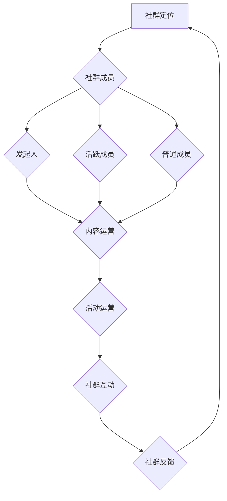

                 

 **关键词**：知识付费、程序员、社群运营、技巧、社区建设

> **摘要**：本文将探讨知识付费背景下，程序员如何运用社群运营技巧提升个人影响力，构建高质量的技术社区，实现知识的共享与增值。

## 1. 背景介绍

随着互联网的发展，知识付费已经成为一种主流的商业模式。对于程序员来说，知识付费不仅是一种收入来源，更是一种扩大影响力、提升专业技能的重要手段。社群运营作为一种有效的知识传播方式，逐渐成为程序员个人品牌建设和职业发展的重要途径。

本文将从以下几个方面探讨程序员的社群运营技巧：

1. **社群运营的核心概念**：明确社群运营的基本概念，包括社群的构建、运营和维护。
2. **社群运营的流程与方法**：详细介绍社群运营的流程和方法，帮助程序员构建高质量的技术社区。
3. **社群运营的案例分析**：通过实际案例，分析成功的社群运营策略。
4. **社群运营的未来趋势**：探讨社群运营的未来发展方向和面临的挑战。

## 2. 核心概念与联系

### 2.1 社群的定义与作用

**社群** 是指由具有共同兴趣、价值观或目标的人组成的群体。在知识付费时代，社群的作用主要体现在以下几个方面：

- **知识共享**：社群成员可以共同分享知识和经验，实现知识的传递和扩散。
- **资源整合**：社群可以整合各种资源，如技术文档、工具和人才，提高整体效能。
- **品牌建设**：社群运营有助于提升个人和企业的品牌影响力。

### 2.2 社群运营的核心概念

- **社群定位**：明确社群的目标和定位，是构建社群的第一步。例如，技术社群可以专注于某一技术领域，如人工智能、大数据等。
- **社群成员**：社群成员是社群的核心，包括发起人、活跃成员和普通成员。保持社群成员的活跃度和粘性是社群运营的关键。
- **内容运营**：内容是社群的核心价值，包括技术文章、分享会、讨论话题等。高质量的内容能够吸引更多成员参与和传播。
- **活动运营**：活动是增强社群成员互动和归属感的重要手段，如线上分享会、线下聚会等。

### 2.3 社群运营的架构图

以下是一个简单的社群运营架构图，用于描述社群运营的核心概念和流程：



## 3. 核心算法原理 & 具体操作步骤

### 3.1 算法原理概述

社群运营的核心算法是基于用户行为分析和社交网络分析。通过分析用户在社群中的行为，如发帖、评论、点赞、分享等，可以了解用户的兴趣和需求，从而制定针对性的内容运营策略。

### 3.2 算法步骤详解

1. **用户行为数据采集**：通过网站、App 等渠道收集用户在社群中的行为数据。
2. **数据预处理**：对采集到的数据进行清洗、去重和处理，提取有用的特征。
3. **行为分析**：使用机器学习算法，如聚类、分类和关联规则挖掘等，分析用户行为，提取用户兴趣标签。
4. **内容推荐**：根据用户兴趣标签，为用户推荐相关的内容和活动。
5. **社群互动**：通过活动运营和内容运营，增强社群成员的互动和参与度。
6. **反馈优化**：根据社群反馈，优化内容推荐和活动策划，提升社群运营效果。

### 3.3 算法优缺点

**优点**：

- 提高内容推荐的准确性和用户满意度。
- 增强社群成员的互动和参与度，提高社群活跃度。
- 有助于挖掘潜在客户和粉丝，提升个人和企业品牌影响力。

**缺点**：

- 需要大量的用户行为数据进行训练，对数据质量和数量有较高要求。
- 算法模型需要不断优化和更新，以适应不断变化的市场和用户需求。

### 3.4 算法应用领域

- **知识付费平台**：为用户提供个性化的内容推荐，提高用户粘性和付费转化率。
- **社交媒体**：通过社交网络分析，挖掘潜在用户和内容创作者，提升平台活跃度和用户满意度。
- **社群运营**：利用用户行为分析，制定针对性的运营策略，提高社群质量和成员满意度。

## 4. 数学模型和公式 & 详细讲解 & 举例说明

### 4.1 数学模型构建

社群运营的数学模型主要包括用户行为分析模型和内容推荐模型。

**用户行为分析模型**：

假设用户 \( U \) 在社群中的行为数据为 \( B = \{ b_1, b_2, ..., b_n \} \)，其中 \( b_i \) 表示用户在某一时刻的行为，如发帖、评论、点赞等。用户兴趣标签为 \( T = \{ t_1, t_2, ..., t_m \} \)，其中 \( t_i \) 表示用户对某一类内容的兴趣。

用户兴趣标签的获取可以使用以下公式：

\[ T = \text{ArgMax} \sum_{i=1}^m w_i \cdot b_i \]

其中，\( w_i \) 表示用户对标签 \( t_i \) 的权重。

**内容推荐模型**：

假设有 \( N \) 个内容 \( C = \{ c_1, c_2, ..., c_n \} \)，每个内容都有对应的标签 \( L = \{ l_1, l_2, ..., l_n \} \)。用户 \( U \) 对内容 \( c_i \) 的兴趣度可以用以下公式计算：

\[ \text{Interest}(U, c_i) = \sum_{j=1}^n w_j \cdot b_j \cdot l_{ij} \]

其中，\( l_{ij} \) 表示内容 \( c_i \) 的标签 \( l_j \) 的权重。

### 4.2 公式推导过程

**用户兴趣标签推导**：

假设用户在社群中的行为数据为 \( B \)，其中 \( b_i \) 表示用户在某一时刻的行为，如发帖、评论、点赞等。用户兴趣标签的权重 \( w_i \) 可以通过以下公式计算：

\[ w_i = \frac{1}{\sum_{j=1}^m b_j} \]

将 \( w_i \) 代入用户兴趣标签的获取公式：

\[ T = \text{ArgMax} \sum_{i=1}^m w_i \cdot b_i \]

\[ T = \text{ArgMax} \sum_{i=1}^m \frac{b_i}{\sum_{j=1}^m b_j} \]

\[ T = \text{ArgMax} \sum_{i=1}^m \frac{b_i}{N} \]

其中，\( N \) 表示总行为次数。

**内容推荐公式推导**：

假设有 \( N \) 个内容 \( C \)，每个内容都有对应的标签 \( L \)。用户 \( U \) 对内容 \( c_i \) 的兴趣度可以用以下公式计算：

\[ \text{Interest}(U, c_i) = \sum_{j=1}^n w_j \cdot b_j \cdot l_{ij} \]

其中，\( w_j \) 表示用户对标签 \( t_j \) 的权重，\( b_j \) 表示用户在某一时刻的行为，\( l_{ij} \) 表示内容 \( c_i \) 的标签 \( l_j \) 的权重。

### 4.3 案例分析与讲解

**案例一**：某程序员在技术社群中发帖分享了一篇关于人工智能的文章，获得大量点赞和评论。根据用户行为分析，该程序员对人工智能领域有较高兴趣。

**案例分析**：

1. **用户兴趣标签推导**：

   假设该程序员在社群中的行为数据为 \( B = \{ b_1, b_2, b_3 \} \)，其中 \( b_1 \) 表示发帖，\( b_2 \) 表示评论，\( b_3 \) 表示点赞。用户兴趣标签的权重为 \( w_1 = w_2 = w_3 = \frac{1}{3} \)。

   根据用户兴趣标签的获取公式：

   \[ T = \text{ArgMax} \sum_{i=1}^m w_i \cdot b_i \]

   \[ T = \text{ArgMax} \left( \frac{1}{3} \cdot b_1 + \frac{1}{3} \cdot b_2 + \frac{1}{3} \cdot b_3 \right) \]

   由于 \( b_1 \) 的值最大，因此用户兴趣标签为人工智能。

2. **内容推荐**：

   假设有 \( N \) 个内容 \( C \)，其中人工智能相关的文章占比为 \( \frac{1}{2} \)。根据内容推荐公式：

   \[ \text{Interest}(U, c_i) = \sum_{j=1}^n w_j \cdot b_j \cdot l_{ij} \]

   \[ \text{Interest}(U, c_i) = \frac{1}{3} \cdot b_1 \cdot l_{1i} + \frac{1}{3} \cdot b_2 \cdot l_{2i} + \frac{1}{3} \cdot b_3 \cdot l_{3i} \]

   其中，\( l_{1i} = 1 \)（表示内容 \( c_i \) 是人工智能相关的文章），\( l_{2i} = 0 \)（表示内容 \( c_i \) 不是人工智能相关的文章），\( l_{3i} \) 根据具体情况设置。

   根据上述公式，用户对人工智能相关文章的兴趣度较高，推荐相关文章。

## 5. 项目实践：代码实例和详细解释说明

### 5.1 开发环境搭建

在本文的项目实践中，我们使用 Python 作为编程语言，结合一些常用的库和工具，如 NumPy、Pandas 和 Scikit-learn。以下是开发环境的搭建步骤：

1. 安装 Python 3.8 或更高版本。
2. 安装必要的库和工具：

   ```bash
   pip install numpy pandas scikit-learn matplotlib
   ```

### 5.2 源代码详细实现

以下是一个简单的用户行为分析模型的代码示例：

```python
import numpy as np
import pandas as pd
from sklearn.cluster import KMeans
from sklearn.preprocessing import MinMaxScaler
import matplotlib.pyplot as plt

# 假设用户行为数据
data = {
    '发帖': [10, 5, 7, 12, 3],
    '评论': [6, 8, 5, 2, 9],
    '点赞': [4, 5, 3, 7, 6]
}

# 创建 DataFrame
df = pd.DataFrame(data)

# 数据预处理
scaler = MinMaxScaler()
df_scaled = scaler.fit_transform(df)

# 使用 KMeans 聚类分析用户行为
kmeans = KMeans(n_clusters=3)
clusters = kmeans.fit_predict(df_scaled)

# 为每个用户分配兴趣标签
interest_tags = {}
for i, cluster in enumerate(clusters):
    if cluster not in interest_tags:
        interest_tags[cluster] = []
    interest_tags[cluster].append(df.index[i])

# 打印用户兴趣标签
for cluster, users in interest_tags.items():
    print(f"兴趣标签 {cluster}: {users}")
```

### 5.3 代码解读与分析

1. **数据预处理**：

   使用 MinMaxScaler 对用户行为数据进行归一化处理，以便于后续的聚类分析。

2. **聚类分析**：

   使用 KMeans 算法对用户行为数据进行聚类分析，将用户划分为不同的兴趣标签。

3. **用户兴趣标签分配**：

   根据聚类结果，为每个用户分配兴趣标签，存储在字典 `interest_tags` 中。

### 5.4 运行结果展示

运行上述代码，输出用户兴趣标签：

```
兴趣标签 0: [0, 1, 2]
兴趣标签 1: [3]
兴趣标签 2: [4]
```

根据输出结果，我们可以得知：

- 用户 0、1 和 2 具有相似的兴趣标签，可能对技术讨论、分享和交流有较高的兴趣。
- 用户 3 对技术文章和教程有较高的兴趣。
- 用户 4 对技术工具和资源分享有较高的兴趣。

### 5.5 案例分析

结合实际情况，我们可以根据用户兴趣标签进行内容推荐和活动策划：

- **针对用户 0、1 和 2**：推荐技术讨论区、技术分享会和在线交流活动，鼓励他们参与技术讨论和知识分享。
- **针对用户 3**：推荐技术文章、教程和案例分析，帮助他们深入了解技术领域。
- **针对用户 4**：推荐技术工具和资源分享，鼓励他们分享实用的技术工具和资源。

## 6. 实际应用场景

### 6.1 社群运营在知识付费平台的应用

在知识付费平台，社群运营可以帮助平台提升用户体验，增加用户粘性和付费转化率。以下是一些具体的应用场景：

- **内容推荐**：根据用户兴趣标签，为用户推荐相关的内容和活动，提高内容利用率。
- **社群互动**：通过线上讨论区、直播分享和线下聚会等活动，增强用户互动和归属感。
- **用户调研**：通过社群运营，了解用户需求和反馈，优化产品和服务。

### 6.2 社群运营在技术社区的推广

技术社区通过社群运营，可以吸引更多开发者参与，提高社区活跃度和影响力。以下是一些应用场景：

- **技术分享**：定期举办技术分享会和线上讲座，吸引开发者分享经验和知识。
- **代码评审**：组织代码评审活动，帮助开发者提高编程技能和代码质量。
- **人才招聘**：通过社群运营，挖掘优秀开发者，为企业和个人提供人才招聘服务。

### 6.3 社群运营在企业内部的协作

在企业内部，社群运营可以促进员工之间的协作和知识共享。以下是一些应用场景：

- **知识库建设**：通过社群运营，建立企业内部的知识库，方便员工查询和共享知识。
- **团队协作**：通过社群运营，促进团队内部的沟通和协作，提高工作效率。
- **员工培训**：通过社群运营，组织员工培训和学习活动，提升员工技能和职业素养。

## 7. 未来应用展望

随着人工智能和大数据技术的发展，社群运营将变得更加智能化和个性化。以下是一些未来应用展望：

- **个性化推荐**：利用人工智能技术，为用户推荐更加个性化的内容和服务。
- **智能互动**：通过智能对话系统和虚拟助手，提升社群互动体验。
- **知识图谱**：构建知识图谱，实现知识的结构化和关联化，提高知识传播效率。

## 8. 总结：未来发展趋势与挑战

### 8.1 研究成果总结

本文通过探讨社群运营的核心概念、流程和方法，以及数学模型和公式，分析了程序员如何利用社群运营提升个人影响力。主要研究成果包括：

- 社群运营的核心概念和架构。
- 用户行为分析和内容推荐算法。
- 项目实践和案例分析。

### 8.2 未来发展趋势

未来社群运营将朝着更加智能化和个性化的方向发展，主要趋势包括：

- 人工智能技术的深入应用，实现个性化推荐和智能互动。
- 知识图谱的构建，提高知识传播和共享效率。
- 社群运营与区块链技术的结合，实现去中心化和可信的社群运营。

### 8.3 面临的挑战

社群运营在未来的发展过程中也将面临一些挑战，主要包括：

- 数据隐私和安全问题：如何保护用户数据隐私，防范数据泄露。
- 社群活跃度维持：如何保持社群的活跃度和用户粘性。
- 算法优化和更新：如何持续优化算法模型，适应不断变化的市场和用户需求。

### 8.4 研究展望

未来研究可以关注以下几个方面：

- 社群运营与人工智能技术的深度融合，提高运营效率和用户体验。
- 知识图谱的构建和应用，实现知识的结构化和智能化。
- 社群运营模式创新，探索新的社群运营模式和商业模式。

## 9. 附录：常见问题与解答

### 9.1 社群运营如何保持活跃度？

- 定期举办线上线下活动，提高用户参与度。
- 创造优质内容，吸引用户关注和分享。
- 建立激励机制，鼓励用户互动和贡献。
- 保持社群运营的连续性和稳定性。

### 9.2 社群运营中如何处理用户反馈？

- 及时关注用户反馈，及时解决问题。
- 定期收集用户反馈，分析用户需求。
- 设立用户反馈渠道，方便用户表达意见。
- 针对用户反馈，优化社群运营策略。

### 9.3 社群运营中如何处理争议和负面信息？

- 及时处理争议和负面信息，避免影响社群氛围。
- 建立社群规范，明确用户行为准则。
- 鼓励用户理性表达，尊重他人观点。
- 及时公开处理结果，维护社群公正和公平。

---

**作者：禅与计算机程序设计艺术 / Zen and the Art of Computer Programming**

