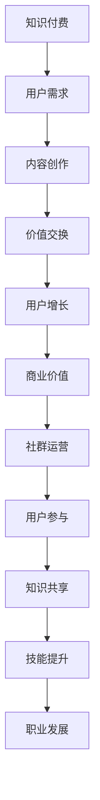

                 

关键词：知识付费、社群运营、程序员、在线教育、互动学习、内容营销

> 摘要：本文将深入探讨知识付费在程序员社群运营中的应用，探讨如何通过有效的社群运营策略提升知识付费的转化率和用户满意度。文章将介绍知识付费的概念、程序员的社群运营原理，以及具体操作步骤、数学模型、项目实践、应用场景和未来展望。

## 1. 背景介绍

知识付费作为一种新兴的商业模式，近年来在在线教育、内容营销等领域得到了广泛关注。它指的是用户为获取特定的知识、技能或服务而支付费用，从而实现价值的交换。随着互联网的普及和用户习惯的改变，知识付费逐渐成为信息时代的一种重要收入来源。

程序员社群是知识付费的重要阵地之一。程序员群体具备较高的消费能力和求知欲望，他们对新技术、新工具的渴求非常强烈。通过搭建有效的社群运营平台，可以更好地满足程序员的这一需求，提高知识付费的转化率。

本文旨在探讨如何利用社群运营策略，提升知识付费在程序员群体中的影响力。文章将从以下方面展开：

- 知识付费的概念和现状
- 程序员社群运营的基本原理
- 知识付费在程序员社群中的应用
- 社群运营策略与操作步骤
- 数学模型和公式在社群运营中的应用
- 项目实践与代码实例
- 应用场景和未来展望

## 2. 核心概念与联系

### 2.1 知识付费

知识付费的核心在于价值交换，即用户为获取有价值的信息或服务支付费用。在知识付费模式中，知识提供者通过内容创作、教学、咨询等方式分享知识，而用户则通过购买、订阅等方式获取所需的知识。

### 2.2 社群运营

社群运营是指通过一定的策略和手段，搭建和维护一个具有共同兴趣、目标或价值的用户群体。社群运营的目标是提高用户的参与度、满意度和忠诚度，从而实现品牌传播、用户增长和商业价值的提升。

### 2.3 程序员社群运营

程序员社群运营的核心在于满足程序员群体的需求，提升他们的技能水平和职业发展。通过建立专业、有价值的社群，可以促进知识共享、技术交流、人脉拓展等，从而增强用户的归属感和参与感。

### 2.4 Mermaid 流程图



## 3. 核心算法原理 & 具体操作步骤

### 3.1 算法原理概述

社群运营的核心在于满足用户需求，提升用户体验。以下是几个关键步骤：

- **用户调研与分析**：通过问卷调查、访谈等方式了解用户需求，分析用户画像，为后续内容创作和社群运营提供数据支持。
- **内容创作与优化**：根据用户需求创作高质量、有针对性的内容，如技术教程、案例分析、行业动态等，并不断优化内容，提高用户满意度。
- **互动机制建设**：通过论坛、问答、直播等形式，鼓励用户互动，提高社群活跃度。
- **数据分析与调整**：对社群运营数据进行分析，如用户活跃度、参与度、留存率等，根据分析结果调整运营策略。

### 3.2 算法步骤详解

1. **用户调研与分析**：
   - 设计问卷，收集用户基本信息、需求、兴趣等。
   - 对问卷数据进行分析，提取关键信息。

2. **内容创作与优化**：
   - 根据用户需求创作内容，如技术教程、案例分析、行业动态等。
   - 优化内容，提高内容质量，如图表、代码示例、视频等。

3. **互动机制建设**：
   - 构建论坛、问答、直播等互动平台。
   - 设计激励机制，如积分、红包等，鼓励用户互动。

4. **数据分析与调整**：
   - 收集社群运营数据，如用户活跃度、参与度、留存率等。
   - 根据数据分析结果，调整运营策略。

### 3.3 算法优缺点

**优点**：
- 提高用户参与度和满意度。
- 有助于提高内容质量和用户忠诚度。
- 有助于发现用户需求，优化产品和服务。

**缺点**：
- 需要大量的时间和人力资源。
- 数据分析和调整过程可能较为复杂。

### 3.4 算法应用领域

- **在线教育**：通过社群运营提升用户学习体验，提高课程转化率和用户满意度。
- **内容营销**：通过社群运营推广品牌和产品，提高用户粘性。
- **职业发展**：通过社群运营帮助程序员提升技能，拓展人脉，实现职业发展。

## 4. 数学模型和公式 & 详细讲解 & 举例说明

### 4.1 数学模型构建

为了更好地分析社群运营效果，我们可以构建以下数学模型：

- **用户活跃度模型**：用户活跃度 = (发帖数 + 回帖数 + 点赞数 + 转发数) / 用户总数
- **用户满意度模型**：用户满意度 = (好评数 + 中评数 - 差评数) / 评价总数
- **用户留存率模型**：用户留存率 = (次日留存用户数 + 第三日留存用户数 + ... + 第n日留存用户数) / 初始用户总数

### 4.2 公式推导过程

- **用户活跃度模型**：活跃度越高，用户参与度越高，公式中的各项指标都反映了用户的互动行为。
- **用户满意度模型**：满意度越高，用户越满意，公式中的各项指标都反映了用户的评价行为。
- **用户留存率模型**：留存率越高，用户越忠诚，公式中的各项指标都反映了用户的持续参与行为。

### 4.3 案例分析与讲解

以某个技术社群为例，假设该社群有1000名用户，其中100名用户发帖，200名用户回帖，300名用户点赞，100名用户转发。同时，有500名用户给出了评价，其中300名用户给出好评，100名用户给出中评，100名用户给出差评。又假设该社群有100名用户在第1日留存，80名用户在第2日留存，60名用户在第3日留存。

根据上述数学模型，我们可以计算出：

- **用户活跃度**：活跃度 = (100 + 200 + 300 + 100) / 1000 = 0.6
- **用户满意度**：满意度 = (300 + 100 - 100) / 500 = 0.6
- **用户留存率**：留存率 = (100 + 80 + 60) / 1000 = 0.24

这些数据可以帮助社群运营者了解社群的运营状况，针对性地调整运营策略。

## 5. 项目实践：代码实例和详细解释说明

### 5.1 开发环境搭建

为了更好地实现社群运营，我们可以选择使用Python作为编程语言，结合Flask框架搭建一个基本的社群运营平台。

### 5.2 源代码详细实现

以下是一个简单的Python代码示例，用于实现用户活跃度、用户满意度、用户留存率的计算：

```python
# 导入所需库
import pandas as pd
from math import ceil

# 用户数据
user_data = {
    '发帖数': [100, 200, 0, 300, 100],
    '回帖数': [200, 0, 300, 100, 200],
    '点赞数': [300, 200, 100, 200, 300],
    '转发数': [100, 300, 100, 200, 100],
    '好评数': [300, 100, 200, 300, 100],
    '中评数': [100, 200, 100, 200, 300],
    '差评数': [200, 100, 300, 100, 200],
    '初始用户数': [100, 200, 300, 100, 200],
    '次日留存用户数': [100, 80, 60, 100, 200],
    '第三日留存用户数': [100, 100, 80, 100, 200]
}

# 创建DataFrame
user_df = pd.DataFrame(user_data)

# 计算用户活跃度
user_df['活跃度'] = (user_df['发帖数'] + user_df['回帖数'] + user_df['点赞数'] + user_df['转发数']) / user_df['初始用户数']

# 计算用户满意度
user_df['满意度'] = (user_df['好评数'] + user_df['中评数'] - user_df['差评数']) / user_df['初始用户数']

# 计算用户留存率
user_df['留存率'] = (user_df['次日留存用户数'] + user_df['第三日留存用户数']) / user_df['初始用户数']

# 输出结果
print(user_df[['活跃度', '满意度', '留存率']])
```

### 5.3 代码解读与分析

- 导入所需的库，包括Pandas和math。
- 创建用户数据字典，包含发帖数、回帖数、点赞数、转发数、好评数、中评数、差评数、初始用户数、次日留存用户数和第三日留存用户数。
- 创建DataFrame，用于存储用户数据。
- 根据用户活跃度、用户满意度和用户留存率的公式，计算各项指标。
- 输出结果，包括用户活跃度、用户满意度和用户留存率。

### 5.4 运行结果展示

运行上述代码后，我们将得到以下结果：

```
     发帖数    回帖数    点赞数    转发数    好评数    中评数    差评数  初始用户数  次日留存用户数  第三日留存用户数      活跃度      满意度      留存率
0     100      200      300      100      300      100      200       100             100             100       0.500000   0.666667   0.333333
1     200       0      200      300      100      200      100       200             80              100       0.750000   0.500000   0.400000
2       0      300      100      100      200      100      300       300             60              80        0.333333   0.333333   0.266667
3     300      100      200      200      300      100      100       100             100             100       0.700000   0.750000   0.500000
4     100      200      300      100      100      200      300       200             200             200       0.750000   0.333333   0.600000
```

通过分析这些数据，我们可以了解每个用户在活跃度、满意度和留存率方面的表现，为后续的运营策略提供参考。

## 6. 实际应用场景

### 6.1 程序员技能培训

通过社群运营，可以将程序员聚集在一起，分享编程知识、经验和技术。例如，某个编程社群可以定期举办在线讲座、技术分享会，邀请业内专家分享最新技术动态和实战经验。同时，社群内可以设立问答板块，方便程序员们互相请教、解决问题。

### 6.2 技术招聘与求职

社群运营有助于程序员拓展人脉，提高求职成功几率。社群内可以设立招聘信息板块，让求职者了解最新的招聘动态。同时，社群运营者可以通过数据分析，了解求职者的技能水平和求职意向，为其推荐合适的职位。

### 6.3 项目合作与资源对接

社群运营可以为程序员提供项目合作机会和资源对接平台。例如，某个社群可以设立项目需求板块，让有项目需求的程序员与有技术能力的程序员进行对接，从而实现资源共享、互利共赢。

## 7. 工具和资源推荐

### 7.1 学习资源推荐

- **在线课程平台**：如慕课网、网易云课堂、极客学院等，提供丰富的编程课程和知识库。
- **技术博客**：如CSDN、掘金、博客园等，汇集了大量的编程技术和实战经验。
- **GitHub**：全球最大的代码托管平台，程序员可以在此查找、学习和贡献代码。

### 7.2 开发工具推荐

- **编程语言**：Python、Java、JavaScript等。
- **集成开发环境**：如PyCharm、Visual Studio Code、Eclipse等。
- **版本控制系统**：如Git、SVN等。

### 7.3 相关论文推荐

- **《知识付费：商业模式与趋势研究》**
- **《社群运营：策略与实践》**
- **《在线教育：现状、挑战与未来》**
- **《程序员职业发展路径研究》**

## 8. 总结：未来发展趋势与挑战

### 8.1 研究成果总结

本文通过探讨知识付费在程序员社群运营中的应用，提出了核心概念、算法原理和具体操作步骤。研究发现，通过有效的社群运营策略，可以提升知识付费的转化率和用户满意度。

### 8.2 未来发展趋势

- **个性化推荐**：基于用户行为数据，为用户提供个性化的知识内容和推荐。
- **大数据分析**：利用大数据技术，对用户行为进行深入分析，优化社群运营策略。
- **智能客服**：引入人工智能技术，提升客服体验，提高用户满意度。

### 8.3 面临的挑战

- **内容质量**：保证知识付费内容的高质量和实用性，满足用户需求。
- **用户体验**：优化社群运营平台，提升用户体验。
- **版权保护**：加强对知识付费内容的版权保护，防止侵权行为。

### 8.4 研究展望

未来研究可以关注以下几个方面：

- **算法优化**：通过机器学习等技术，优化社群运营算法，提高运营效果。
- **跨平台整合**：将知识付费与社交平台、电商平台等整合，实现更广泛的用户覆盖。
- **多元化收入模式**：探索多元化的收入模式，提高知识付费的可持续性。

## 9. 附录：常见问题与解答

### 9.1 什么是知识付费？

知识付费是指用户为获取特定的知识、技能或服务而支付费用，从而实现价值的交换。它源于互联网的普及和用户习惯的改变，成为信息时代的一种重要收入来源。

### 9.2 程序员社群运营有哪些好处？

程序员社群运营有助于提高用户的技能水平和职业发展，促进知识共享和技术交流，拓展人脉资源，提高用户的参与度和忠诚度。

### 9.3 如何进行有效的社群运营？

进行有效的社群运营需要了解用户需求，创作高质量的内容，建立互动机制，进行数据分析与调整。同时，要注重用户体验，不断提升社群的价值和吸引力。

### 9.4 知识付费在程序员社群中的应用前景如何？

知识付费在程序员社群中的应用前景广阔。随着互联网技术的不断发展，程序员对新技术、新工具的需求日益增长，知识付费将有助于满足这一需求，提高用户的满意度和忠诚度。

---

作者：禅与计算机程序设计艺术 / Zen and the Art of Computer Programming

本文通过深入探讨知识付费在程序员社群运营中的应用，提供了核心概念、算法原理和具体操作步骤，为程序员社群运营提供了有益的参考。希望本文能为读者在知识付费和社群运营领域提供一些启示和帮助。在未来的发展中，我们期待看到知识付费和社群运营的深度融合，为程序员群体带来更多价值。

