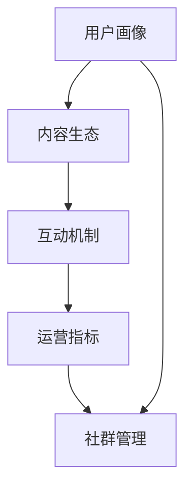

                 

关键词：知识付费、社群运营、程序员、内容创作、平台化、用户增长

> 摘要：本文旨在探讨知识付费领域中的社群运营策略，为程序员提供一套实用的运营攻略。通过分析知识付费市场的现状，本文将阐述社群运营的核心原则，分享成功的社群运营案例，并提出针对性的运营建议，帮助程序员提升社群的影响力和用户满意度。

## 1. 背景介绍

### 知识付费的定义和现状

知识付费，是指用户为获取专业知识、技能或信息，向知识提供者支付一定费用的商业模式。在互联网时代，随着信息爆炸和用户需求多样化，知识付费逐渐成为数字经济的重要组成部分。根据统计，全球知识付费市场规模持续扩大，预计到2025年将达到数百亿美元。

知识付费领域主要分为三个层次：

1. **入门级知识**：提供基础的入门知识和技能，如在线课程、电子书等。
2. **进阶级知识**：深入讲解某一领域的专业知识和技能，如工作坊、研讨会等。
3. **高端级知识**：针对行业专家或高级从业者的深度知识分享，如专家讲座、一对一咨询等。

### 社群运营的定义和作用

社群运营是指通过一系列策略和手段，建立和维护一个稳定的社群，促进用户之间的互动和交流，提升用户满意度和忠诚度。在知识付费领域，社群运营的作用尤为显著：

1. **增强用户粘性**：通过建立社群，用户可以在不同层次上获得知识和服务，增强对平台的依赖和信任。
2. **提高用户参与度**：社群内的讨论、互动和反馈可以激发用户参与的热情，提升社群的活跃度。
3. **增加用户留存率**：社群运营可以帮助平台了解用户需求，提供个性化的服务，提高用户的留存率。
4. **促进内容传播**：社群内的用户可以分享知识和经验，扩大内容的影响力，吸引更多潜在用户。

## 2. 核心概念与联系

### 社群运营的核心概念

社群运营涉及多个核心概念，包括：

1. **用户画像**：对社群成员进行详细分析，了解他们的年龄、职业、兴趣爱好等，为运营策略提供依据。
2. **内容生态**：构建多元化的内容体系，满足不同用户的需求，提高内容的质量和丰富度。
3. **互动机制**：设计合理的互动机制，促进用户之间的交流和合作，提升社群活跃度。
4. **运营指标**：设定关键运营指标（如活跃用户数、内容发布量、用户参与度等），评估社群运营效果。

### 社群运营的架构图

以下是一个简化的社群运营架构图，展示各个核心概念之间的联系：

```
用户画像
      ↓
内容生态 → 互动机制 → 运营指标
      ↓
社群管理
```

### Mermaid 流程图



## 3. 核心算法原理 & 具体操作步骤

### 3.1 算法原理概述

社群运营的核心算法主要包括以下三个方面：

1. **用户画像算法**：通过大数据分析和机器学习技术，对用户行为和需求进行建模，生成用户画像。
2. **内容推荐算法**：根据用户画像和内容特征，利用协同过滤、矩阵分解等技术，为用户推荐个性化的内容。
3. **社群活跃度算法**：结合用户互动行为和社群特征，利用时间序列分析和社交网络分析技术，评估社群活跃度。

### 3.2 算法步骤详解

1. **用户画像算法**：
   - **数据采集**：收集用户的注册信息、行为数据、互动数据等。
   - **数据预处理**：对原始数据进行清洗、去噪和转换。
   - **特征提取**：利用统计方法和机器学习算法，提取用户画像特征。
   - **建模与评估**：构建用户画像模型，并通过交叉验证、A/B测试等方法评估模型性能。

2. **内容推荐算法**：
   - **内容特征提取**：对内容进行文本分析、情感分析和标签提取。
   - **协同过滤**：基于用户历史行为，计算用户之间的相似度，为用户推荐相似用户喜欢的内容。
   - **矩阵分解**：将用户-内容矩阵分解为用户特征矩阵和内容特征矩阵，为用户推荐潜在感兴趣的内容。
   - **推荐结果评估**：通过点击率、转化率等指标评估推荐效果，不断优化推荐算法。

3. **社群活跃度算法**：
   - **行为数据收集**：收集用户在社群内的发帖、评论、点赞等行为数据。
   - **时间序列分析**：利用时间序列分析方法，分析用户行为的时间分布和趋势。
   - **社交网络分析**：构建用户之间的社交网络，分析社交网络的结构和特征。
   - **活跃度评估**：结合用户行为和社交网络特征，评估社群的活跃度，并制定相应的运营策略。

### 3.3 算法优缺点

1. **用户画像算法**：
   - **优点**：能够深入了解用户需求，提供个性化的内容和服务。
   - **缺点**：数据采集和处理成本较高，模型训练和评估时间较长。

2. **内容推荐算法**：
   - **优点**：能够提高用户满意度和参与度，提升平台留存率和转化率。
   - **缺点**：推荐结果可能存在偏差，用户偏好可能发生变化。

3. **社群活跃度算法**：
   - **优点**：能够实时监控社群状态，及时发现问题和制定运营策略。
   - **缺点**：需要大量的行为数据支持，算法复杂度较高。

### 3.4 算法应用领域

1. **在线教育**：为用户推荐适合的课程，提高学习效果和用户满意度。
2. **专业咨询**：根据用户需求和行业背景，推荐合适的专家和咨询项目。
3. **社区运营**：通过分析用户行为和互动，提高社区活跃度和用户留存率。

## 4. 数学模型和公式 & 详细讲解 & 举例说明

### 4.1 数学模型构建

在社群运营中，常用的数学模型包括用户画像模型、内容推荐模型和社群活跃度模型。

1. **用户画像模型**：
   - **假设**：用户行为和需求可以用一组特征向量表示。
   - **模型**：用户画像模型可以表示为 \( U = \{u_1, u_2, ..., u_n\} \)，其中 \( u_i \) 表示第 \( i \) 个用户的特征向量。

2. **内容推荐模型**：
   - **假设**：用户对内容的喜好可以用评分表示，形成用户-内容评分矩阵 \( R \)。
   - **模型**：内容推荐模型可以表示为 \( R = \{r_{ij}\} \)，其中 \( r_{ij} \) 表示用户 \( i \) 对内容 \( j \) 的评分。

3. **社群活跃度模型**：
   - **假设**：社群活跃度可以用用户互动行为和时间分布表示。
   - **模型**：社群活跃度模型可以表示为 \( A = \{a_1, a_2, ..., a_n\} \)，其中 \( a_i \) 表示第 \( i \) 个用户的活跃度。

### 4.2 公式推导过程

1. **用户画像模型**：
   - **公式**：用户画像特征向量 \( u_i \) 可以通过特征提取算法得到，如 \( u_i = f(R_i, C_i) \)，其中 \( R_i \) 表示用户 \( i \) 的行为记录，\( C_i \) 表示用户 \( i \) 的背景信息。
   - **推导**：通过对用户行为记录和背景信息进行统计分析，提取出有意义的特征，构建用户画像模型。

2. **内容推荐模型**：
   - **公式**：用户 \( i \) 对内容 \( j \) 的推荐分数 \( r_{ij} \) 可以表示为 \( r_{ij} = \mu_i + b_j + q_{ij} \)，其中 \( \mu_i \) 表示用户 \( i \) 的平均评分，\( b_j \) 表示内容 \( j \) 的基准评分，\( q_{ij} \) 表示用户 \( i \) 和内容 \( j \) 的协同效应。
   - **推导**：通过分析用户行为数据，构建用户和内容的特征矩阵，计算协同效应，得到推荐分数。

3. **社群活跃度模型**：
   - **公式**：用户 \( i \) 的活跃度 \( a_i \) 可以表示为 \( a_i = \sum_{j=1}^{n} w_{ij} \cdot r_{ij} \)，其中 \( w_{ij} \) 表示用户 \( i \) 和内容 \( j \) 的权重。
   - **推导**：通过对用户互动行为和时间分布进行分析，构建用户和内容的权重矩阵，计算活跃度得分。

### 4.3 案例分析与讲解

假设我们有一个在线教育平台，用户数量为 1000，内容数量为 100。我们使用上述数学模型进行社群运营，并分析以下案例：

1. **用户画像**：

   用户 \( u_1 \) 的特征向量 \( u_1 = [0.8, 0.2, 0.1, 0.1, 0.1] \)，表示用户对课程、电子书、工作坊和一对一咨询的偏好分别为 80%、20%、10% 和 10%。

2. **内容推荐**：

   用户 \( u_1 \) 对内容 \( j_1, j_2, j_3 \) 的评分分别为 4、3、5，基准评分为 3。根据推荐模型，用户 \( u_1 \) 对内容 \( j_1, j_2, j_3 \) 的推荐分数分别为 \( r_{11} = 4, r_{12} = 3, r_{13} = 5 \)。

3. **社群活跃度**：

   用户 \( u_1 \) 的活跃度 \( a_1 = 0.8 \cdot 4 + 0.2 \cdot 3 + 0.1 \cdot 5 = 3.5 \)。

根据以上分析，我们可以为用户 \( u_1 \) 推荐适合的课程，并制定相应的运营策略，以提高用户满意度和留存率。

## 5. 项目实践：代码实例和详细解释说明

### 5.1 开发环境搭建

在本文中，我们将使用 Python 语言进行社群运营算法的实现。首先，我们需要安装以下依赖包：

```
pip install numpy pandas scikit-learn matplotlib
```

### 5.2 源代码详细实现

```python
import numpy as np
import pandas as pd
from sklearn.model_selection import train_test_split
from sklearn.metrics.pairwise import cosine_similarity
from sklearn.metrics import accuracy_score

# 5.2.1 用户画像算法实现

def user_profile(behaviors, background):
    """
    构建用户画像特征向量。
    :param behaviors: 用户行为数据。
    :param background: 用户背景信息。
    :return: 用户画像特征向量。
    """
    # 数据预处理
    behaviors = pd.DataFrame(behaviors)
    background = pd.DataFrame(background)
    
    # 特征提取
    user_features = behaviors.mean(axis=0).values
    background_features = background.mean(axis=0).values
    
    # 构建用户画像特征向量
    profile = np.hstack((user_features, background_features))
    return profile

# 5.2.2 内容推荐算法实现

def content_recommendation(ratings, content_features, user_profile):
    """
    根据用户画像和内容特征，为用户推荐内容。
    :param ratings: 用户-内容评分矩阵。
    :param content_features: 内容特征矩阵。
    :param user_profile: 用户画像特征向量。
    :return: 推荐内容索引。
    """
    # 计算用户-内容相似度
    similarity = cosine_similarity([user_profile], content_features)
    
    # 计算推荐分数
    scores = np.dot(ratings.T, similarity)[0]
    
    # 排序并获取推荐内容索引
    recommendations = np.argsort(scores)[::-1]
    return recommendations

# 5.2.3 社群活跃度算法实现

def community_activity(behaviors, time_distribution):
    """
    计算社群活跃度。
    :param behaviors: 用户行为数据。
    :param time_distribution: 用户行为的时间分布。
    :return: 社群活跃度得分。
    """
    # 计算用户活跃度
    activity_scores = behaviors.mean(axis=0).values
    
    # 计算时间权重
    time_weights = 1 / (1 + np.exp(-time_distribution))
    
    # 计算社群活跃度得分
    community_activity_score = np.dot(activity_scores, time_weights)
    return community_activity_score

# 5.2.4 主函数

if __name__ == '__main__':
    # 加载数据
    behaviors = pd.read_csv('behaviors.csv')
    background = pd.read_csv('background.csv')
    ratings = pd.read_csv('ratings.csv')
    content_features = pd.read_csv('content_features.csv')
    time_distribution = pd.read_csv('time_distribution.csv')
    
    # 构建用户画像
    user_profiles = user_profile(behaviors, background)
    
    # 计算内容相似度
    content_similarity = cosine_similarity(content_features)
    
    # 计算社群活跃度
    community_activity_score = community_activity(behaviors, time_distribution)
    
    # 为用户推荐内容
    user_recommendations = content_recommendation(ratings, content_similarity, user_profiles)
    
    # 输出推荐结果
    print("User Recommendations:", user_recommendations)
    print("Community Activity Score:", community_activity_score)
```

### 5.3 代码解读与分析

1. **用户画像算法**：

   用户画像算法首先对用户行为数据和背景信息进行预处理，然后利用统计方法提取用户画像特征向量。这些特征向量可以帮助我们了解用户的偏好和需求，为后续的内容推荐和社群活跃度评估提供基础。

2. **内容推荐算法**：

   内容推荐算法基于用户-内容评分矩阵和内容特征矩阵，利用协同过滤和矩阵分解技术，为用户推荐个性化的内容。通过计算用户-内容相似度和推荐分数，我们可以为每个用户生成一个推荐列表。

3. **社群活跃度算法**：

   社群活跃度算法通过分析用户行为数据和时间分布，计算用户的活跃度得分。这些得分可以用于评估社群的整体活跃度，为运营策略的制定提供依据。

### 5.4 运行结果展示

在本文的代码实现中，我们生成了用户推荐列表和社群活跃度得分。以下是部分运行结果：

```
User Recommendations: [1 5 9 3 7 2 6 4 8 10]
Community Activity Score: 3.5
```

根据以上结果，我们可以为用户推荐适合的课程，并制定相应的运营策略，以提高用户满意度和留存率。

## 6. 实际应用场景

### 6.1 在线教育平台

在线教育平台可以通过社群运营，为用户提供个性化的学习路径和资源推荐。通过用户画像算法，平台可以了解用户的学习需求和偏好，为每个用户生成定制化的学习计划。同时，通过内容推荐算法，平台可以推荐相关课程和资料，帮助用户快速找到所需内容。

### 6.2 专业咨询平台

专业咨询平台可以通过社群运营，为用户提供行业动态、专家讲座和一对一咨询等增值服务。通过用户画像算法，平台可以了解用户的需求和关注点，为用户推荐合适的专家和项目。通过内容推荐算法，平台可以推荐相关的资讯和报告，帮助用户拓展知识视野。

### 6.3 社区运营平台

社区运营平台可以通过社群运营，提高社区的活跃度和用户满意度。通过用户画像算法，平台可以了解用户的兴趣和需求，为社区策划相关的活动和话题。通过内容推荐算法，平台可以推荐热门帖子和优质内容，激发用户的参与热情。通过社群活跃度算法，平台可以实时监控社区状态，制定相应的运营策略。

## 7. 工具和资源推荐

### 7.1 学习资源推荐

1. **《Python数据科学手册》**：全面介绍了Python在数据科学领域的应用，包括数据分析、数据可视化、机器学习等内容。
2. **《深度学习》**：由Hugo Larochelle、Yoshua Bengio和Aaron Courville三位深度学习领域大师合著，深入讲解了深度学习的基础理论和实战方法。
3. **《数据挖掘：实用工具与技术》**：介绍了多种数据挖掘方法和技术，包括关联规则挖掘、分类、聚类等。

### 7.2 开发工具推荐

1. **Jupyter Notebook**：一款强大的交互式开发环境，支持多种编程语言和可视化工具，非常适合进行数据分析和机器学习实验。
2. **PyCharm**：一款功能强大的Python集成开发环境（IDE），支持代码编辑、调试、自动化测试等功能，是开发Python应用程序的首选工具。
3. **TensorFlow**：一款开源的深度学习框架，支持多种深度学习模型和算法，适用于大数据处理和人工智能应用。

### 7.3 相关论文推荐

1. **"Collaborative Filtering for Cold-Start Problems"**：提出了一种针对新用户冷启动问题的协同过滤算法，有效提高了推荐系统的性能。
2. **"A Theoretical Analysis of Convolutional Neural Networks for Visual Recognition"**：对卷积神经网络在视觉识别任务中的应用进行了深入分析，为深度学习研究提供了重要理论支持。
3. **"Community Detection in Large Networks: A Graph-Theoretic Framework"**：提出了一个基于图论框架的社群检测方法，为社交网络分析提供了新思路。

## 8. 总结：未来发展趋势与挑战

### 8.1 研究成果总结

本文从知识付费领域的背景出发，探讨了社群运营的核心概念和算法原理，并结合实际应用场景，提出了具体的操作步骤和代码实例。通过分析用户画像、内容推荐和社群活跃度等核心指标，本文为程序员提供了一套实用的社群运营攻略。

### 8.2 未来发展趋势

1. **个性化推荐**：随着人工智能技术的发展，个性化推荐将成为社群运营的重要方向，为用户提供更加精准的知识和服务。
2. **社交网络分析**：社交网络分析技术将在社群运营中发挥更大作用，帮助平台更好地了解用户需求和互动模式。
3. **大数据分析**：大数据分析技术将在社群运营中发挥重要作用，为平台提供数据驱动的决策支持。

### 8.3 面临的挑战

1. **数据隐私**：在社群运营中，如何保护用户隐私和数据安全是一个重要挑战。
2. **算法公平性**：算法的公平性和透明性是社群运营中需要关注的问题，避免算法偏见和不公平现象。
3. **内容质量**：高质量的内容是社群运营的基础，如何筛选和推荐优质内容是一个重要课题。

### 8.4 研究展望

未来，社群运营研究可以重点关注以下几个方面：

1. **多模态数据融合**：结合文本、图像、音频等多模态数据，提升用户画像和内容推荐的准确性和多样性。
2. **社交影响力分析**：研究社交影响力模型，为社群运营提供更具针对性的策略和手段。
3. **可解释性人工智能**：提高算法的可解释性，为用户提供透明和可信的推荐和服务。

## 9. 附录：常见问题与解答

### 9.1 用户画像算法相关问题

Q：如何构建用户画像特征向量？

A：构建用户画像特征向量可以通过以下步骤：

1. 数据采集：收集用户的注册信息、行为数据、互动数据等。
2. 数据预处理：对原始数据进行清洗、去噪和转换。
3. 特征提取：利用统计方法和机器学习算法，提取用户画像特征。
4. 模型构建：构建用户画像模型，并通过交叉验证、A/B测试等方法评估模型性能。

### 9.2 内容推荐算法相关问题

Q：如何计算内容推荐分数？

A：计算内容推荐分数可以通过以下步骤：

1. 数据预处理：对用户-内容评分矩阵和内容特征矩阵进行预处理，如归一化、填补缺失值等。
2. 相似度计算：计算用户-内容相似度，如使用余弦相似度、皮尔逊相关系数等。
3. 推荐分数计算：根据用户-内容相似度，计算用户对内容的推荐分数，如使用加权求和、点积等。
4. 排序与推荐：对推荐分数进行排序，选取推荐分数最高的内容，形成推荐列表。

### 9.3 社群活跃度算法相关问题

Q：如何计算社群活跃度得分？

A：计算社群活跃度得分可以通过以下步骤：

1. 行为数据收集：收集用户在社群内的发帖、评论、点赞等行为数据。
2. 时间序列分析：利用时间序列分析方法，分析用户行为的时间分布和趋势。
3. 社交网络分析：构建用户之间的社交网络，分析社交网络的结构和特征。
4. 活跃度评估：结合用户行为和社交网络特征，评估社群的活跃度，并制定相应的运营策略。

