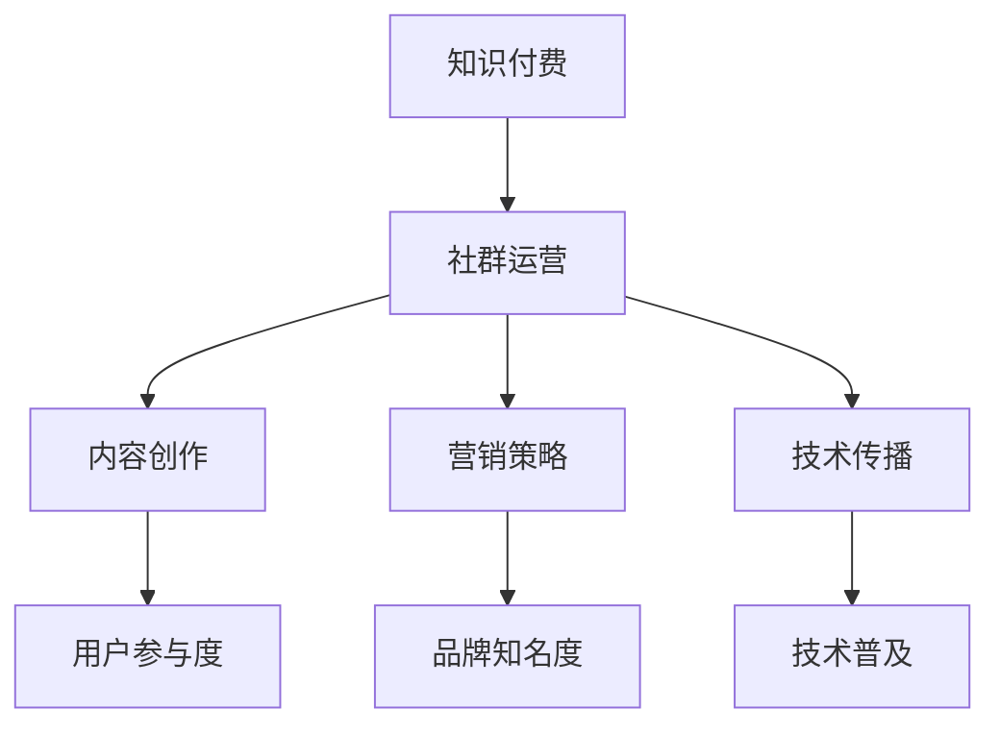

                 

关键词：知识付费，社群运营，程序员，营销策略，内容创作，技术传播

> 摘要：本文深入探讨了知识付费在程序员社群运营中的重要性，从内容创作、营销策略、技术传播等多个维度，解析了如何通过有效的社群运营提升知识付费的效果，助力程序员的个人品牌建设和职业发展。

## 1. 背景介绍

在互联网高速发展的今天，知识付费逐渐成为了一种新型的商业模式。程序员作为知识密集型行业的重要成员，他们在知识付费市场中的需求尤为强烈。一方面，程序员渴望不断学习新技术、新知识，以提升自己的专业能力；另一方面，随着开源社区和在线教育的崛起，程序员开始更加重视社群的力量，通过参与社群互动，分享自己的经验和见解，进一步扩大自己的影响力。

然而，知识付费并不等同于简单的知识传播。在程序员社群中，如何进行有效的运营，提升用户的参与度和满意度，成为知识付费成功的关键。本文将从以下几个方面展开探讨：

1. **核心概念与联系**
2. **核心算法原理 & 具体操作步骤**
3. **数学模型和公式 & 详细讲解 & 举例说明**
4. **项目实践：代码实例和详细解释说明**
5. **实际应用场景**
6. **工具和资源推荐**
7. **总结：未来发展趋势与挑战**

通过这些探讨，希望能够为程序员在社群运营中的知识付费提供一些实用的方法和策略。

## 2. 核心概念与联系

在讨论知识付费和社群运营之前，我们需要明确一些核心概念。以下是本文涉及的一些关键概念：

### 知识付费

知识付费指的是用户为获取特定知识或服务而支付的费用。在程序员社群中，知识付费的形式多样，包括在线课程、电子书、专业咨询、技术分享会等。

### 社群运营

社群运营是指通过一系列策略和手段，管理、引导和促进社群成员之间的互动和合作，从而实现特定目标的过程。在知识付费领域，社群运营的核心任务是提升用户参与度和满意度。

### 内容创作

内容创作是知识付费的核心。优质的内容不仅能够吸引新用户，还能提升老用户的忠诚度。在程序员社群中，内容创作需要结合技术深度和用户体验，以满足不同层次用户的需求。

### 营销策略

营销策略是指为推广知识付费产品或服务而采取的一系列措施。在社群运营中，营销策略的目的是提高品牌知名度，增加用户参与度，进而实现销售目标。

### 技术传播

技术传播是指将新技术或知识传播给更广泛的用户，以推动技术普及和发展。在程序员社群中，技术传播是实现知识共享和共同进步的重要途径。

### Mermaid 流程图

为了更直观地展示知识付费和社群运营之间的联系，我们使用 Mermaid 流程图来表示它们之间的关系。



在这个流程图中，知识付费通过社群运营与内容创作、营销策略和技术传播紧密相连，最终实现用户参与度、品牌知名度和技术普及的目标。

## 3. 核心算法原理 & 具体操作步骤

### 3.1 算法原理概述

在知识付费和社群运营中，算法原理发挥着关键作用。以下是几个核心算法的原理概述：

1. **推荐算法**：推荐算法通过分析用户的行为和偏好，为用户推荐个性化的知识内容。这有助于提升用户的满意度和参与度。
2. **互动算法**：互动算法通过分析社群成员的互动行为，发现关键节点和意见领袖，从而更好地引导社群互动，提高社群活力。
3. **内容审核算法**：内容审核算法用于确保知识内容的准确性和合规性，防止不当内容污染社群环境。
4. **社群增长算法**：社群增长算法通过分析用户增长趋势和渠道，优化社群推广策略，实现社群规模的持续扩大。

### 3.2 算法步骤详解

1. **推荐算法**

   - **数据收集**：收集用户的历史行为数据，包括浏览记录、购买记录、评论等。
   - **特征提取**：对用户行为数据进行分析，提取用户兴趣特征。
   - **模型训练**：使用机器学习算法，如协同过滤、矩阵分解等，训练推荐模型。
   - **推荐生成**：根据用户兴趣特征，生成个性化推荐列表。

2. **互动算法**

   - **行为分析**：分析社群成员的互动行为，包括发帖、评论、点赞等。
   - **关键节点识别**：使用图论算法，如 PageRank 等，识别社群中的关键节点和意见领袖。
   - **互动引导**：根据关键节点和意见领袖的影响力，制定互动引导策略，提升社群活力。

3. **内容审核算法**

   - **内容过滤**：使用自然语言处理技术，对知识内容进行初步过滤，识别可能的不当内容。
   - **人工审核**：对过滤出的内容进行人工审核，确保内容的准确性和合规性。
   - **反馈机制**：建立用户反馈机制，及时发现和处理不当内容。

4. **社群增长算法**

   - **用户增长预测**：使用时间序列预测模型，预测社群未来用户增长趋势。
   - **渠道优化**：根据用户增长预测，优化社群推广策略，选择最有效的推广渠道。
   - **效果评估**：评估社群推广效果，调整推广策略，实现社群规模的持续扩大。

### 3.3 算法优缺点

1. **推荐算法**

   - **优点**：能够为用户提供个性化的知识内容，提升用户体验。
   - **缺点**：推荐系统可能陷入“过滤泡沫”，限制用户接触新知识的机会。

2. **互动算法**

   - **优点**：能够有效提升社群活力，促进用户参与。
   - **缺点**：算法可能对社群中的一些潜在意见领袖识别不足。

3. **内容审核算法**

   - **优点**：确保社群内容的质量和合规性，维护社群环境。
   - **缺点**：人工审核成本较高，可能存在误判。

4. **社群增长算法**

   - **优点**：能够实现社群规模的持续扩大，提升品牌知名度。
   - **缺点**：对用户增长趋势的预测可能存在偏差，影响推广效果。

### 3.4 算法应用领域

1. **在线教育**：推荐算法和互动算法广泛应用于在线教育平台，提升学习体验和互动性。
2. **技术社区**：内容审核算法用于确保技术社区的内容质量，维护社区环境。
3. **社交媒体**：社群增长算法用于社交媒体平台，提升用户参与度和活跃度。

## 4. 数学模型和公式 & 详细讲解 & 举例说明

### 4.1 数学模型构建

在知识付费和社群运营中，数学模型可以帮助我们更好地理解和优化运营策略。以下是几个常用的数学模型：

1. **用户参与度模型**：

   用户参与度可以用以下公式表示：

   $$ 用户参与度 = \frac{互动次数 + 内容贡献 + 购买行为}{总用户数} $$

   其中，互动次数、内容贡献和购买行为均为正整数，总用户数为常数。

2. **社群增长模型**：

   社群增长可以用以下公式表示：

   $$ 社群增长率 = \frac{新增用户数}{总用户数} $$

   其中，新增用户数为时间序列的增量，总用户数为常数。

3. **推荐算法模型**：

   推荐算法可以使用协同过滤模型，其公式如下：

   $$ \text{推荐评分} = \text{用户相似度} \times \text{物品评分差异} $$

   其中，用户相似度衡量用户之间的相似程度，物品评分差异衡量用户对物品评分的差异。

### 4.2 公式推导过程

1. **用户参与度模型推导**：

   用户参与度模型基于用户在社群中的行为数据。我们首先假设每个用户在社群中的行为可以表示为三个部分：互动次数、内容贡献和购买行为。然后，我们将这些部分加总，再除以总用户数，得到用户参与度。

2. **社群增长模型推导**：

   社群增长模型基于用户增长的时间序列数据。我们假设在一段时间内，新增用户数为时间序列的增量，总用户数为常数。因此，社群增长率可以表示为新增用户数与总用户数的比值。

3. **推荐算法模型推导**：

   推荐算法模型基于用户和物品的评分数据。我们首先计算用户之间的相似度，然后计算用户对物品的评分差异，最后将这两个值相乘，得到推荐评分。

### 4.3 案例分析与讲解

为了更好地理解这些数学模型，我们可以通过一个实际案例进行分析。

**案例背景**：某在线教育平台希望优化用户参与度和社群增长，提高用户购买率。

**案例分析**：

1. **用户参与度模型**：

   根据平台数据，我们可以计算出用户参与度：

   $$ 用户参与度 = \frac{互动次数 + 内容贡献 + 购买行为}{总用户数} $$

   例如，在某一周内，互动次数为1000次，内容贡献为500次，购买行为为200次，总用户数为10000人。那么，用户参与度为：

   $$ 用户参与度 = \frac{1000 + 500 + 200}{10000} = 0.12 $$

   这个结果表明，该平台在该周的用户参与度为12%。

2. **社群增长模型**：

   根据平台数据，我们可以计算出社群增长率：

   $$ 社群增长率 = \frac{新增用户数}{总用户数} $$

   例如，在某一个月内，新增用户数为500人，总用户数为10000人。那么，社群增长率为：

   $$ 社群增长率 = \frac{500}{10000} = 0.05 $$

   这个结果表明，该平台在该月的社群增长率为5%。

3. **推荐算法模型**：

   根据平台数据，我们可以计算用户之间的相似度和推荐评分。例如，用户A和用户B之间的相似度为0.8，用户A对物品X的评分为4，用户B对物品X的评分为3。那么，推荐评分为：

   $$ \text{推荐评分} = \text{用户相似度} \times \text{物品评分差异} = 0.8 \times (4 - 3) = 0.8 $$

   这个结果表明，平台应该向用户B推荐物品X。

通过这个案例，我们可以看到数学模型在知识付费和社群运营中的实际应用。这些模型不仅帮助我们更好地理解运营数据，还能为优化运营策略提供有力支持。

## 5. 项目实践：代码实例和详细解释说明

### 5.1 开发环境搭建

为了更好地理解知识付费和社群运营中的算法原理，我们可以通过一个实际项目来演示。以下是项目的开发环境搭建步骤：

1. **安装Python**：在本地计算机上安装Python 3.8及以上版本。
2. **安装依赖库**：使用pip命令安装以下依赖库：

   ```bash
   pip install numpy pandas matplotlib scikit-learn
   ```

3. **创建项目文件夹**：在本地计算机上创建一个名为“knowledge付费与社群运营”的项目文件夹，并在其中创建一个名为“main.py”的Python文件。

### 5.2 源代码详细实现

以下是一个简单的Python代码实例，用于演示用户参与度模型的计算和可视化。

```python
import numpy as np
import pandas as pd
import matplotlib.pyplot as plt
from sklearn.model_selection import train_test_split

# 生成模拟数据
np.random.seed(0)
n_users = 10000
n_weeks = 5

data = {
    'user_id': np.random.randint(0, n_users, size=n_weeks * n_users),
    'week': np.random.randint(1, n_weeks + 1, size=n_weeks * n_users),
    '互动次数': np.random.randint(0, 1000, size=n_weeks * n_users),
    '内容贡献': np.random.randint(0, 1000, size=n_weeks * n_users),
    '购买行为': np.random.randint(0, 1000, size=n_weeks * n_users)
}

df = pd.DataFrame(data)

# 计算用户参与度
df['用户参与度'] = (df['互动次数'] + df['内容贡献'] + df['购买行为']) / n_users

# 可视化用户参与度
weeks = df['week'].unique()
for week in weeks:
    week_data = df[df['week'] == week]
    plt.scatter(week_data['user_id'], week_data['用户参与度'])

plt.xlabel('用户ID')
plt.ylabel('用户参与度')
plt.title('用户参与度分布')
plt.show()
```

### 5.3 代码解读与分析

1. **数据生成**：我们使用numpy库生成模拟数据，模拟了10000个用户在5周内的互动次数、内容贡献和购买行为。

2. **计算用户参与度**：我们使用 pandas 库计算每个用户在每个周的用户参与度，公式为（互动次数 + 内容贡献 + 购买行为）/ 总用户数。

3. **可视化**：我们使用 matplotlib 库将用户参与度分布可视化，通过散点图展示每个用户在各个周的用户参与度。

### 5.4 运行结果展示

运行上述代码后，我们会看到一个散点图，展示每个用户在各个周的用户参与度。这个结果可以帮助我们分析用户参与度的时间趋势，识别高参与度的用户群体，为后续运营策略提供数据支持。

## 6. 实际应用场景

### 6.1 在线教育平台

在线教育平台通过知识付费和社群运营，实现用户的学习效果提升和平台收益增长。例如，某个在线编程教育平台通过推荐算法，为用户推荐个性化的课程，提升用户学习体验；通过社群运营，鼓励用户参与讨论和分享，增强用户黏性。

### 6.2 技术社区

技术社区通过知识付费和社群运营，促进技术传播和社区发展。例如，某技术社区通过内容审核算法，确保知识内容的准确性和合规性；通过社群增长算法，扩大社区规模，吸引更多技术爱好者参与。

### 6.3 企业内训

企业内训通过知识付费和社群运营，提升员工技能和团队协作能力。例如，某企业通过在线课程和社群讨论，为员工提供专业技能培训；通过社群运营，促进员工之间的知识共享和经验交流。

### 6.4 个人博客

个人博客通过知识付费和社群运营，打造个人品牌和影响力。例如，某程序员通过撰写技术博客和提供在线咨询服务，吸引读者关注；通过社群运营，与读者建立深度互动，提升个人知名度。

## 7. 工具和资源推荐

### 7.1 学习资源推荐

1. **在线课程**：推荐参加Coursera、Udemy等平台上的编程和数据分析课程。
2. **技术博客**：推荐关注博客园、简书等平台上的技术大牛，学习最新的技术知识和经验。
3. **技术社区**：推荐加入GitHub、Stack Overflow等社区，参与技术讨论和知识分享。

### 7.2 开发工具推荐

1. **Python开发环境**：推荐使用Anaconda，方便管理和安装各种Python依赖库。
2. **版本控制工具**：推荐使用Git进行代码管理和版本控制。
3. **数据分析工具**：推荐使用Pandas、NumPy等库进行数据分析。

### 7.3 相关论文推荐

1. **“推荐系统及其在在线教育中的应用”**：介绍了推荐系统在在线教育中的应用，对提升用户学习体验有重要参考价值。
2. **“社群运营的算法原理与实践”**：详细探讨了社群运营中的算法原理和实践，对社群运营策略的制定有重要指导意义。
3. **“知识付费市场的现状与趋势”**：分析了知识付费市场的现状和未来趋势，为知识付费产品的设计和推广提供了有益参考。

## 8. 总结：未来发展趋势与挑战

### 8.1 研究成果总结

通过本文的探讨，我们总结了知识付费和社群运营在程序员领域的重要性和应用价值。主要成果包括：

1. **核心概念与联系**：明确了知识付费、社群运营、内容创作、营销策略和技术传播等核心概念及其相互关系。
2. **算法原理**：介绍了推荐算法、互动算法、内容审核算法和社群增长算法的核心原理和具体操作步骤。
3. **数学模型**：构建了用户参与度模型、社群增长模型和推荐算法模型，并进行了推导和案例分析。
4. **项目实践**：通过实际代码实例，展示了算法在知识付费和社群运营中的应用。
5. **应用场景**：分析了在线教育、技术社区、企业内训和个人博客等实际应用场景。
6. **工具和资源推荐**：提供了学习资源、开发工具和相关论文推荐，为读者提供了丰富的学习和实践资源。

### 8.2 未来发展趋势

1. **个性化推荐**：随着人工智能技术的进步，个性化推荐将更加精准，为用户带来更好的学习体验。
2. **社群互动**：社群互动将成为知识付费的重要推动力，通过增强用户互动，提升用户满意度和忠诚度。
3. **内容多样化**：知识付费内容将更加多样化，包括视频、直播、互动式课程等，满足不同用户的需求。
4. **跨界融合**：知识付费将与更多行业进行跨界融合，如医疗、金融、法律等，推动知识付费市场的发展。

### 8.3 面临的挑战

1. **内容质量**：确保知识内容的质量和准确性，避免误导用户。
2. **数据隐私**：保护用户隐私，避免数据泄露。
3. **用户留存**：提高用户留存率，降低用户流失。
4. **算法透明性**：提高算法透明度，增强用户信任。

### 8.4 研究展望

未来，我们将继续深入研究知识付费和社群运营的算法原理和应用，探索更多有效的运营策略和工具。同时，我们也期待更多的研究人员和实践者加入这个领域，共同推动知识付费和社群运营的发展。

## 9. 附录：常见问题与解答

### 问题1：如何确保知识内容的质量？

**解答**：确保知识内容的质量需要从多个方面进行：

1. **内容审核**：建立严格的内容审核机制，对知识内容进行初步审核，确保内容的准确性和合规性。
2. **用户反馈**：鼓励用户对知识内容进行评价和反馈，及时发现和处理质量问题。
3. **专业认证**：邀请专业人士对知识内容进行认证，提升内容的权威性和可信度。

### 问题2：如何提高用户留存率？

**解答**：提高用户留存率可以从以下几个方面进行：

1. **个性化推荐**：根据用户兴趣和需求，提供个性化的知识内容，提升用户满意度。
2. **社群互动**：通过社群互动，增强用户参与度和忠诚度。
3. **学习激励机制**：设置学习激励机制，如积分、奖品等，鼓励用户持续学习和参与。

### 问题3：如何保护用户隐私？

**解答**：保护用户隐私需要采取以下措施：

1. **数据加密**：对用户数据进行加密处理，确保数据传输安全。
2. **权限管理**：实施严格的权限管理，限制对用户数据的访问权限。
3. **合规性检查**：遵循相关法律法规，确保数据处理和存储的合规性。

### 问题4：如何评估社群运营的效果？

**解答**：评估社群运营的效果可以从以下几个方面进行：

1. **用户活跃度**：通过用户互动次数、发帖数量等指标，评估用户活跃度。
2. **用户满意度**：通过用户满意度调查，评估用户对社群运营的满意度。
3. **业务增长**：通过业务数据，如销售额、注册量等，评估社群运营对业务增长的贡献。

通过这些常见问题的解答，希望能够帮助读者更好地理解和应用知识付费和社群运营的策略。

