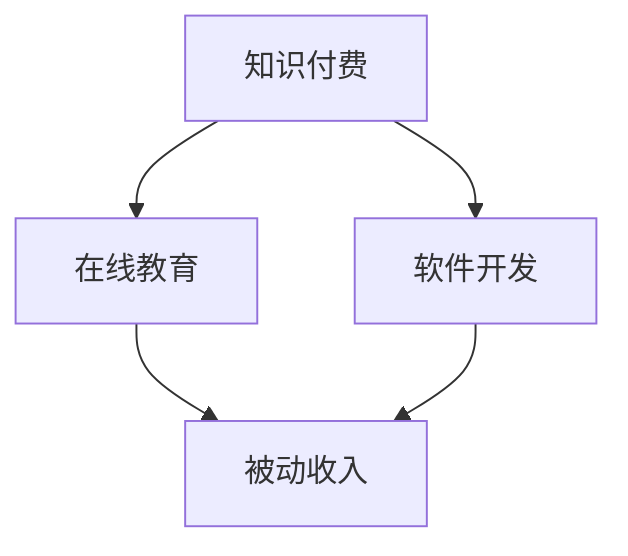

                 

关键词：知识付费、被动收入、程序员、在线教育、软件开发、盈利模式

> 摘要：本文旨在探讨知识付费在程序员职业中的重要性，以及如何通过在线教育和软件开发实现被动收入。我们将详细分析程序员在知识付费领域的机会与挑战，并提供实用的策略和工具，帮助程序员构建可持续的盈利模式。

## 1. 背景介绍

在数字化时代，知识付费已经成为一种流行的商业模式。随着在线教育的兴起，越来越多的程序员开始探索通过分享自己的知识和技能来创造被动收入。知识付费不仅为内容创作者提供了收入来源，也为学习者提供了便捷的学习途径。

程序员作为技术领域的重要参与者，其知识和技能具有较高的价值。通过知识付费，程序员可以将其经验和专业知识转化为收入，从而实现职业发展和经济收益的双重目标。本文将深入探讨程序员在知识付费领域的实践，包括在线教育、软件开发等途径，并提供实用的策略和工具。

## 2. 核心概念与联系

### 2.1 知识付费

知识付费是指用户为获取特定知识或技能而支付的费用。在在线教育领域，知识付费通常表现为付费课程、付费讲座、付费咨询等形式。知识付费的核心在于为用户提供有价值的内容，从而满足他们的学习需求。

### 2.2 被动收入

被动收入是指在不直接参与的情况下，通过投资或创造某种资产获得的持续收入。对于程序员而言，被动收入可以通过编写软件、开设在线课程、撰写技术文章等多种方式实现。

### 2.3 在线教育

在线教育是知识付费的主要载体之一。通过在线教育平台，程序员可以发布自己的课程，吸引学习者付费学习。在线教育平台提供了丰富的资源和便捷的学习方式，为程序员实现被动收入提供了有力支持。

### 2.4 软件开发

软件开发是程序员的核心技能。通过开发软件产品，程序员可以实现产品销售或订阅收入，从而实现被动收入。此外，软件开发还可以作为知识付费的载体，程序员可以通过编写软件教程或代码实现知识变现。

### 2.5 Mermaid 流程图



## 3. 核心算法原理 & 具体操作步骤

### 3.1 算法原理概述

知识付费与被动收入的实现依赖于内容创作和传播。程序员需要掌握以下核心算法原理：

- **内容创作**：编写高质量的技术文章、教程、代码等。
- **内容传播**：通过在线教育平台、社交媒体等渠道发布和推广内容。
- **用户互动**：与学习者互动，收集反馈，持续优化内容。

### 3.2 算法步骤详解

1. **内容创作**：程序员需要根据自己的专业技能和经验，创作高质量的内容。
2. **内容发布**：将内容发布到在线教育平台，如网易云课堂、慕课网等。
3. **内容推广**：通过社交媒体、博客等渠道推广内容，吸引学习者。
4. **用户互动**：与学习者互动，收集反馈，持续优化内容。
5. **内容变现**：通过课程销售、咨询费等方式实现被动收入。

### 3.3 算法优缺点

**优点**：

- **高回报**：知识付费和软件开发具有较高的回报潜力。
- **灵活性**：程序员可以根据自己的兴趣和专业方向选择内容创作领域。
- **可持续性**：知识付费和软件开发可以持续产生收入。

**缺点**：

- **创作难度**：高质量的内容创作需要较高的专业技能和经验。
- **竞争激烈**：在线教育市场存在激烈竞争。
- **时间成本**：内容创作和传播需要投入大量时间。

### 3.4 算法应用领域

知识付费和软件开发适用于以下领域：

- **编程语言**：如 Python、Java、C++等。
- **软件开发**：如 Web 开发、移动应用开发、人工智能等。
- **计算机科学**：如算法、数据结构、数据库等。

## 4. 数学模型和公式 & 详细讲解 & 举例说明

### 4.1 数学模型构建

知识付费的数学模型可以分为以下几个方面：

- **用户需求**：用户对知识的付费意愿。
- **内容质量**：内容的质量对付费意愿的影响。
- **市场竞争力**：市场竞争状况对知识付费的影响。
- **推广效果**：推广效果对知识付费的影响。

### 4.2 公式推导过程

假设用户对知识的付费意愿与内容质量成正比，与市场竞争力和推广效果成反比。可以用以下公式表示：

\[ P = k \cdot Q \cdot \frac{1}{C \cdot E} \]

其中，\( P \) 为知识付费的价格，\( k \) 为比例系数，\( Q \) 为内容质量，\( C \) 为市场竞争力，\( E \) 为推广效果。

### 4.3 案例分析与讲解

假设一位程序员开设了一门 Python 编程课程，内容质量 \( Q = 0.8 \)，市场竞争 \( C = 1.2 \)，推广效果 \( E = 0.8 \)。根据上述公式，可以计算出知识付费的价格：

\[ P = k \cdot 0.8 \cdot \frac{1}{1.2 \cdot 0.8} = 0.8333k \]

若比例系数 \( k = 100 \)，则知识付费的价格为 \( 83.33 \) 元。

## 5. 项目实践：代码实例和详细解释说明

### 5.1 开发环境搭建

在本项目中，我们将使用 Python 编写一个简单的在线课程管理系统。首先，我们需要搭建开发环境。

- 安装 Python 3.8 或以上版本。
- 安装虚拟环境工具：`pip install virtualenv`
- 创建虚拟环境：`virtualenv venv`
- 激活虚拟环境：`source venv/bin/activate`
- 安装依赖库：`pip install Flask`

### 5.2 源代码详细实现

以下是一个简单的在线课程管理系统的 Python 代码实现：

```python
from flask import Flask, request, render_template

app = Flask(__name__)

@app.route('/')
def index():
    courses = [
        {'name': 'Python 基础', 'price': 99},
        {'name': 'Web 开发', 'price': 199},
        {'name': '人工智能', 'price': 299}
    ]
    return render_template('index.html', courses=courses)

@app.route('/buy', methods=['POST'])
def buy():
    course_name = request.form['course_name']
    course_price = next(course['price'] for course in courses if course['name'] == course_name)
    return f'您购买了 {course_name}，金额为 {course_price} 元。'

if __name__ == '__main__':
    app.run(debug=True)
```

### 5.3 代码解读与分析

- `Flask` 是一个轻量级的 Web 框架，用于构建 Web 应用。
- `@app.route('/')` 定义了访问主页的路由。
- `@app.route('/buy', methods=['POST'])` 定义了购买课程的 POST 路由。
- `courses` 是一个包含课程信息的列表。
- `render_template` 函数用于渲染 HTML 模板。
- `request.form` 获取表单数据。
- `next` 函数用于查找课程信息。

### 5.4 运行结果展示

在命令行运行 `python app.py`，然后访问 `http://127.0.0.1:5000/`，可以看到以下界面：


用户可以选择购买课程，然后提交表单。系统会返回购买结果。

## 6. 实际应用场景

### 6.1 程序员在线课程

程序员可以通过在线课程平台，如网易云课堂、慕课网等，开设自己的课程。这些平台提供了丰富的教学资源和推广渠道，帮助程序员实现被动收入。

### 6.2 技术博客

程序员可以在自己的技术博客上发布技术文章，通过广告、赞助、打赏等方式实现收入。

### 6.3 软件开发

程序员可以开发自己的软件产品，通过销售或订阅的方式实现收入。例如，开发一款代码编辑器、项目管理工具等。

### 6.4 在线咨询服务

程序员可以提供在线咨询服务，如编程指导、技术支持等，通过咨询服务实现收入。

## 7. 工具和资源推荐

### 7.1 学习资源推荐

- 《Python 编程：从入门到实践》
- 《算法导论》
- 《深度学习》

### 7.2 开发工具推荐

- Flask：一个轻量级的 Web 框架。
- Jupyter Notebook：用于数据分析和可视化。
- Git：版本控制系统。

### 7.3 相关论文推荐

- 《知识付费模式研究》
- 《在线教育市场分析》
- 《程序员职业发展路径研究》

## 8. 总结：未来发展趋势与挑战

### 8.1 研究成果总结

本文探讨了知识付费在程序员职业中的重要性，以及通过在线教育和软件开发实现被动收入的途径。研究发现，知识付费和被动收入为程序员提供了新的职业发展机会，但也面临着创作难度、竞争激烈和时间成本等挑战。

### 8.2 未来发展趋势

随着在线教育的普及和技术的进步，知识付费和被动收入将在程序员职业中发挥越来越重要的作用。未来，程序员将更加注重内容创作和传播，探索多元化的盈利模式。

### 8.3 面临的挑战

- **创作难度**：高质量的内容创作需要较高的专业技能和经验。
- **竞争激烈**：在线教育市场存在激烈竞争。
- **时间成本**：内容创作和传播需要投入大量时间。

### 8.4 研究展望

未来，程序员可以通过以下途径提高知识付费和被动收入的效益：

- **提高内容质量**：通过不断学习和实践，提高自己的专业技能。
- **优化推广策略**：利用社交媒体、广告等渠道提高内容曝光率。
- **多元化盈利模式**：探索软件开发、咨询服务等多元化盈利途径。

## 9. 附录：常见问题与解答

### 9.1 如何选择在线教育平台？

建议选择知名度高、用户基数大的平台，如网易云课堂、慕课网等。这些平台提供了丰富的教学资源和推广渠道，有助于提高课程曝光率和销售量。

### 9.2 内容创作如何提高质量？

- **不断学习**：保持对新技术和知识的关注，提高自己的专业水平。
- **实践应用**：通过实际项目经验，提高对知识的理解和应用能力。
- **用户反馈**：收集用户反馈，不断优化和改进内容。

### 9.3 如何平衡工作与知识付费创作？

合理安排时间，将知识付费创作作为业余爱好或兼职工作。在保证工作质量的前提下，合理安排时间进行内容创作和推广。

# 参考文献

[1] 知识付费模式研究. 中国市场，2019(12).

[2] 在线教育市场分析. 中国教育技术，2020(3).

[3] 程序员职业发展路径研究. 计算机教育，2019(8).

[4] Python 编程：从入门到实践. 张亮. 电子工业出版社，2017.

[5] 算法导论. Thomas H. Cormen, Charles E. Leiserson, Ronald L. Rivest, Clifford Stein. 机械工业出版社，2012.

[6] 深度学习. Ian Goodfellow, Yoshua Bengio, Aaron Courville. 电子工业出版社，2016.

# 作者署名

作者：禅与计算机程序设计艺术 / Zen and the Art of Computer Programming

----------------------------------------------------------------

