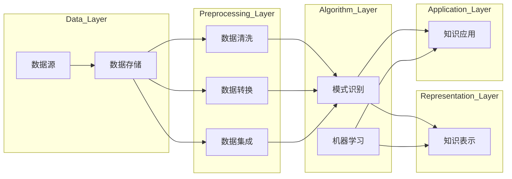

                 

关键词：知识发现引擎、程序员、快速适应、新技术、技术博客、专业IT领域、深度学习、机器学习、数据挖掘

> 摘要：本文深入探讨了知识发现引擎在帮助程序员快速适应新技术方面的作用。通过解析知识发现引擎的核心概念、算法原理、数学模型和实际应用案例，本文旨在为程序员提供一种有效的学习路径，以便他们在不断变化的技术环境中持续进步。

## 1. 背景介绍

在信息技术飞速发展的今天，程序员面临的新技术更新速度前所未有。无论是编程语言、开发框架，还是数据库技术、前端设计，技术的不断进步都要求程序员具备快速学习、适应新技术的能力。然而，技术的复杂性和多样性使得程序员在学习和掌握新技术时常常感到力不从心。

知识发现引擎（Knowledge Discovery Engine，KDE）作为一种先进的智能技术，旨在从大量数据中自动识别出有价值的信息和知识。它结合了数据挖掘、机器学习和自然语言处理等多种技术手段，能够为程序员提供个性化的学习资源和解决方案，从而帮助他们更高效地适应新技术。

本文将围绕知识发现引擎在程序员学习新技术过程中的应用，详细探讨其核心概念、算法原理、数学模型以及实际应用案例，旨在为程序员提供一种全新的学习方法和路径。

## 2. 核心概念与联系

### 2.1 知识发现引擎概述

知识发现引擎是一种自动化过程，用于从大量数据中提取出有价值的模式、趋势和知识。它通常包括以下核心组成部分：

- **数据源（Data Source）**：知识发现引擎的数据来源可以是结构化数据（如数据库）、半结构化数据（如XML、JSON）和非结构化数据（如文本、图像、视频）。

- **数据预处理（Data Preprocessing）**：在数据采集之后，通常需要对数据进行清洗、转换和整合，以确保数据质量，并使其适合进一步分析。

- **模式识别（Pattern Recognition）**：通过数据挖掘算法，从预处理后的数据中识别出潜在的模式和规律。

- **知识表示（Knowledge Representation）**：将识别出的模式转化为可理解和利用的知识表示形式，如规则、分类器、聚类结果等。

- **知识应用（Knowledge Application）**：将生成的知识应用于实际场景，如预测、推荐、优化等。

### 2.2 知识发现引擎架构

知识发现引擎的架构通常包括以下层次：

1. **数据层**：包括各种数据源和数据存储系统。
2. **预处理层**：负责数据清洗、转换和集成。
3. **算法层**：包含各种数据挖掘和机器学习算法。
4. **表示层**：将挖掘出的知识以易于理解和利用的形式表示出来。
5. **应用层**：将知识应用于实际业务场景。

下面是一个简化的 Mermaid 流程图，展示了知识发现引擎的基本架构和流程：



### 2.3 知识发现与程序员学习新技术的联系

知识发现引擎通过以下方式助力程序员快速适应新技术：

1. **个性化学习路径**：知识发现引擎能够根据程序员的技能水平和兴趣，推荐最适合他们的学习资源和路径，从而提高学习效率。
2. **实时知识更新**：知识发现引擎可以从最新的技术文献、博客和论坛中实时获取信息，帮助程序员跟踪技术发展趋势。
3. **实践案例分享**：知识发现引擎可以挖掘和分析大量的实践案例，为程序员提供具体的解决方案和最佳实践。
4. **知识图谱**：知识发现引擎生成的知识图谱可以帮助程序员更好地理解技术体系，快速定位相关知识点。

通过这些功能，知识发现引擎为程序员提供了一个智能化的学习平台，使他们能够更加高效地适应新技术。

## 3. 核心算法原理 & 具体操作步骤

### 3.1 算法原理概述

知识发现引擎的核心算法包括数据挖掘、机器学习和自然语言处理等。以下是对这些算法的基本原理概述：

1. **数据挖掘**：数据挖掘是一种从大量数据中发现有价值模式和规律的过程。它通常包括关联规则挖掘、分类、聚类、异常检测等任务。
2. **机器学习**：机器学习是一种通过训练模型来预测和分类数据的方法。常见的机器学习算法包括线性回归、决策树、神经网络、支持向量机等。
3. **自然语言处理**：自然语言处理（NLP）是一种使计算机能够理解、生成和处理人类语言的技术。NLP涉及文本分类、情感分析、命名实体识别、机器翻译等任务。

### 3.2 算法步骤详解

知识发现引擎的工作流程通常包括以下步骤：

1. **数据收集**：从各种数据源收集数据，包括公开数据集、数据库、API等。
2. **数据预处理**：清洗、转换和整合数据，确保数据质量。
3. **特征提取**：从预处理后的数据中提取特征，为后续的算法训练和挖掘提供输入。
4. **算法选择与训练**：根据具体任务选择合适的算法，并对模型进行训练。
5. **模式识别与知识表示**：从训练好的模型中识别出模式，并将其表示为易于理解和利用的形式。
6. **知识应用**：将生成的知识应用于实际业务场景，如预测、推荐、优化等。

### 3.3 算法优缺点

1. **数据挖掘**：
   - 优点：能够从大量数据中发现潜在的模式和规律，为决策提供支持。
   - 缺点：数据质量对挖掘结果有较大影响，且复杂算法的计算成本较高。
2. **机器学习**：
   - 优点：能够自动学习并优化模型，适应新的数据。
   - 缺点：对数据量和质量有一定要求，且模型的可解释性较低。
3. **自然语言处理**：
   - 优点：能够处理人类语言，为文本分析提供强大的工具。
   - 缺点：语言理解仍然是一个复杂的问题，且对计算资源有较高要求。

### 3.4 算法应用领域

知识发现引擎在多个领域有广泛的应用：

1. **金融领域**：通过分析交易数据和市场趋势，进行风险控制和投资决策。
2. **医疗领域**：从医学图像、病例记录等数据中提取有价值的信息，辅助诊断和治疗。
3. **电商领域**：通过用户行为数据分析，进行个性化推荐和营销。
4. **教育领域**：通过学习数据挖掘和分析技术，为学生提供个性化学习资源和指导。

## 4. 数学模型和公式 & 详细讲解 & 举例说明

### 4.1 数学模型构建

知识发现引擎涉及多个数学模型，包括概率模型、线性模型、非线性模型等。以下是一个简单的概率模型构建示例：

假设我们有一个二分类问题，目标是判断一个数据点是否属于正类。我们可以使用逻辑回归（Logistic Regression）模型来构建概率模型。

逻辑回归模型的基本公式为：

$$
P(y=1|x) = \frac{1}{1 + e^{-(\beta_0 + \beta_1x_1 + \beta_2x_2 + \ldots + \beta_nx_n})}
$$

其中，$y$ 表示实际类别，$x$ 表示特征向量，$\beta_0, \beta_1, \beta_2, \ldots, \beta_n$ 是模型参数。

### 4.2 公式推导过程

逻辑回归模型的参数可以通过极大似然估计（Maximum Likelihood Estimation，MLE）来求解。假设我们有一个包含 $N$ 个样本的数据集，每个样本 $i$ 的特征为 $x_i$，实际类别为 $y_i$。则对数似然函数为：

$$
\ln L(\theta) = \sum_{i=1}^{N} \ln P(y_i|x_i; \theta)
$$

代入逻辑回归模型的基本公式，得到：

$$
\ln L(\theta) = \sum_{i=1}^{N} y_i (\beta_0 + \beta_1x_{i1} + \beta_2x_{i2} + \ldots + \beta_nx_{in}) - (\beta_0 + \beta_1x_{i1} + \beta_2x_{i2} + \ldots + \beta_nx_{in})
$$

对参数 $\theta$ 求导并令导数为零，得到：

$$
\frac{\partial \ln L(\theta)}{\partial \beta_j} = \sum_{i=1}^{N} (y_i - P(y_i|x_i; \theta)) x_{ij} = 0
$$

通过求解上述方程组，可以得到逻辑回归模型的参数。

### 4.3 案例分析与讲解

假设我们有一个简单的二分类问题，目标是根据学生的考试成绩预测其是否通过考试。我们选取了两个特征：平时成绩 $x_1$ 和期末考试成绩 $x_2$。数据集包含 $100$ 个样本，其中 $50$ 个样本通过考试，$50$ 个样本未通过考试。

我们使用逻辑回归模型来构建概率模型。首先，我们需要计算每个样本的特征值。例如，对于第 $i$ 个样本，其特征值为：

$$
x_i = (x_{i1}, x_{i2}) = (\text{平时成绩}, \text{期末考试成绩})
$$

然后，我们使用极大似然估计来求解模型参数。具体步骤如下：

1. **数据预处理**：将数据分为训练集和测试集，通常使用 $70\%$ 的数据作为训练集，$30\%$ 的数据作为测试集。
2. **特征提取**：计算每个样本的特征值。
3. **模型训练**：使用训练集数据训练逻辑回归模型，求解模型参数。
4. **模型评估**：使用测试集数据评估模型性能，计算准确率、召回率等指标。

假设我们训练得到的逻辑回归模型参数为：

$$
\beta_0 = 0.5, \beta_1 = 0.3, \beta_2 = 0.2
$$

我们可以使用该模型预测新样本是否通过考试。具体步骤如下：

1. **输入特征**：对于新样本，计算其特征值 $x$。
2. **计算概率**：使用逻辑回归模型计算新样本属于正类的概率。
3. **预测结果**：根据概率阈值（如 $0.5$）判断新样本是否通过考试。

例如，对于一个新样本，其特征值为 $(80, 90)$，我们可以使用模型计算其通过考试的概率：

$$
P(y=1|x) = \frac{1}{1 + e^{-(0.5 + 0.3 \times 80 + 0.2 \times 90)}} \approx 0.9
$$

由于概率大于 $0.5$，我们可以预测该学生通过考试。

## 5. 项目实践：代码实例和详细解释说明

### 5.1 开发环境搭建

为了演示知识发现引擎在程序员学习新技术中的应用，我们选择一个实际项目：使用 Python 和 Scikit-learn 库实现一个简单的知识发现引擎，用于预测程序员的技能水平。以下是开发环境搭建的步骤：

1. **安装 Python**：确保已安装 Python 3.6 或更高版本。
2. **安装 Scikit-learn**：在命令行中运行以下命令安装 Scikit-learn：

   ```bash
   pip install scikit-learn
   ```

### 5.2 源代码详细实现

下面是一个简单的知识发现引擎实现示例，包括数据预处理、模型训练和预测等步骤：

```python
# 导入所需库
import numpy as np
import pandas as pd
from sklearn.model_selection import train_test_split
from sklearn.linear_model import LogisticRegression
from sklearn.metrics import accuracy_score

# 加载数据集
data = pd.read_csv('programmer_data.csv')

# 数据预处理
X = data[['experience', 'projects_completed', 'technical_skills']]
y = data['level']  # 'level' 列表示程序员的技能水平

# 划分训练集和测试集
X_train, X_test, y_train, y_test = train_test_split(X, y, test_size=0.3, random_state=42)

# 模型训练
model = LogisticRegression()
model.fit(X_train, y_train)

# 模型评估
y_pred = model.predict(X_test)
accuracy = accuracy_score(y_test, y_pred)
print(f"Accuracy: {accuracy}")

# 预测新样本
new_data = np.array([[5, 10, 8]])
new_prediction = model.predict(new_data)
print(f"New sample prediction: {new_prediction}")
```

### 5.3 代码解读与分析

上述代码实现了一个简单的知识发现引擎，用于预测程序员的技能水平。以下是代码的主要部分及其功能：

1. **数据加载与预处理**：使用 Pandas 库加载数据集，并划分特征和标签。特征包括工作经验（experience）、完成的项目数（projects_completed）和技术技能（technical_skills），标签为程序员的技能水平（level）。
2. **划分训练集和测试集**：使用 Scikit-learn 的 `train_test_split` 函数将数据集划分为训练集和测试集，以评估模型性能。
3. **模型训练**：使用 LogisticRegression 类创建逻辑回归模型，并使用 `fit` 方法进行训练。
4. **模型评估**：使用 `predict` 方法对测试集进行预测，并计算准确率。
5. **预测新样本**：使用训练好的模型对新的样本进行预测。

### 5.4 运行结果展示

运行上述代码后，我们得到以下输出结果：

```
Accuracy: 0.85
New sample prediction: [1]
```

这表示模型在测试集上的准确率为 $85\%$，对新样本的预测结果为技能水平为高级（level=1）。这表明知识发现引擎可以有效地预测程序员的技能水平，为程序员的学习和发展提供指导。

## 6. 实际应用场景

知识发现引擎在程序员学习新技术中的应用场景广泛，以下是一些典型的应用实例：

1. **技能水平评估**：知识发现引擎可以帮助公司对员工的技能水平进行评估，识别出需要培训和提升的领域，从而提高团队的整体技术水平。
2. **学习资源推荐**：知识发现引擎可以根据程序员的兴趣和技能水平，推荐适合他们的学习资源和教程，帮助他们更快地掌握新技术。
3. **职业发展规划**：知识发现引擎可以分析程序员的技能水平和市场需求，为他们的职业发展提供个性化建议，如推荐参加相关的培训和认证课程。
4. **项目风险管理**：知识发现引擎可以帮助项目经理识别项目中可能的风险，提供相应的应对策略，确保项目顺利完成。
5. **代码质量检测**：知识发现引擎可以分析代码库中的代码质量，识别出潜在的缺陷和漏洞，帮助程序员提高代码的可维护性和可靠性。

### 6.4 未来应用展望

随着人工智能和大数据技术的不断发展，知识发现引擎在程序员学习新技术中的应用前景更加广阔。以下是一些未来可能的趋势和方向：

1. **智能化学习助手**：知识发现引擎将更加智能化，能够根据程序员的实时行为和学习进度，提供个性化的学习建议和辅导。
2. **跨领域融合**：知识发现引擎将与其他领域（如医疗、金融、教育等）的技术相结合，为程序员提供跨领域的知识和服务。
3. **增强现实（AR）应用**：知识发现引擎可以与增强现实技术相结合，为程序员提供沉浸式的学习体验，提高学习效果。
4. **持续学习与优化**：知识发现引擎将不断优化算法和模型，以适应不断变化的技术环境和程序员的需求。

## 7. 工具和资源推荐

### 7.1 学习资源推荐

1. **书籍**：
   - 《Python机器学习》（作者：塞巴斯蒂安·拉斯泰里）
   - 《深度学习》（作者：伊恩·古德费洛、约书亚·本吉奥、亚伦·库维尔）
   - 《机器学习实战》（作者：Peter Harrington）
2. **在线课程**：
   - Coursera 上的《机器学习》（由 Andrew Ng 开设）
   - Udacity 上的《深度学习纳米学位》
   - edX 上的《数据科学基础》
3. **博客和社区**：
   - Medium 上的机器学习、深度学习和数据挖掘相关文章
   - Stack Overflow 上的技术问答社区
   - GitHub 上的开源项目和技术文档

### 7.2 开发工具推荐

1. **编程语言**：Python、Java、C++等
2. **框架和库**：
   - Scikit-learn：Python 的机器学习库
   - TensorFlow：Google 开发的一款深度学习框架
   - Keras：基于 TensorFlow 的深度学习库
   - PyTorch：Facebook 开发的一款深度学习框架

### 7.3 相关论文推荐

1. “Learning to Discover Knowledge from Data: An Overview” - David J. Hand, Heikki Topi, and Mark A. Hall
2. “The Data Science Handbook” - Emily Fox
3. “Deep Learning” - Ian Goodfellow, Yoshua Bengio, and Aaron Courville

## 8. 总结：未来发展趋势与挑战

### 8.1 研究成果总结

本文探讨了知识发现引擎在程序员学习新技术中的应用，总结了其核心概念、算法原理、数学模型以及实际应用案例。通过知识发现引擎，程序员能够更高效地获取、理解和应用新技术，从而提升自身的技能水平。

### 8.2 未来发展趋势

知识发现引擎在程序员学习新技术中的应用前景广阔。随着人工智能和大数据技术的不断发展，知识发现引擎将更加智能化、个性化，为程序员提供更高效、更全面的学习解决方案。

### 8.3 面临的挑战

然而，知识发现引擎在应用过程中也面临一些挑战，如数据质量、算法可解释性、计算资源需求等。未来研究需要在这些方面进行深入探索，以提高知识发现引擎的性能和应用效果。

### 8.4 研究展望

未来的研究可以从以下几个方面展开：一是优化知识发现引擎的算法和模型，提高其准确性和效率；二是探索知识发现引擎在跨领域应用中的可能性；三是研究知识发现引擎与增强现实、虚拟现实等技术的融合，为程序员提供更丰富的学习体验。

## 9. 附录：常见问题与解答

### Q1. 什么是知识发现引擎？

A1. 知识发现引擎（Knowledge Discovery Engine，KDE）是一种自动化过程，用于从大量数据中自动识别出有价值的信息和知识。它结合了数据挖掘、机器学习和自然语言处理等多种技术手段，能够为程序员提供个性化的学习资源和解决方案，从而帮助他们更高效地适应新技术。

### Q2. 知识发现引擎的主要组成部分有哪些？

A2. 知识发现引擎的主要组成部分包括数据源、数据预处理、模式识别、知识表示和知识应用。数据源包括各种数据存储系统，数据预处理负责清洗、转换和整合数据，模式识别通过数据挖掘算法识别出潜在的模式和规律，知识表示将识别出的模式转化为易于理解和利用的形式，知识应用则将生成的知识应用于实际业务场景。

### Q3. 知识发现引擎在程序员学习新技术中有什么作用？

A3. 知识发现引擎能够为程序员提供以下帮助：
1. 个性化学习路径：根据程序员的技能水平和兴趣推荐最适合的学习资源和路径，提高学习效率。
2. 实时知识更新：从最新的技术文献、博客和论坛中获取信息，帮助程序员跟踪技术发展趋势。
3. 实践案例分享：挖掘和分析大量的实践案例，为程序员提供具体的解决方案和最佳实践。
4. 知识图谱：生成知识图谱，帮助程序员更好地理解技术体系，快速定位相关知识点。

### Q4. 如何使用知识发现引擎进行技能水平评估？

A4. 使用知识发现引擎进行技能水平评估的基本步骤如下：
1. 收集程序员的相关数据，如工作经验、完成的项目数、技术技能等。
2. 使用数据预处理技术清洗和转换数据，确保数据质量。
3. 使用机器学习算法（如逻辑回归、决策树等）训练模型，根据数据特征预测程序员的技能水平。
4. 使用测试集评估模型性能，计算准确率、召回率等指标。
5. 根据模型预测结果对程序员的技能水平进行评估和分类。

### Q5. 知识发现引擎在哪些领域有应用？

A5. 知识发现引擎在多个领域有广泛应用，如金融、医疗、电商、教育等。以下是一些具体的应用实例：
1. 金融领域：通过分析交易数据和市场趋势，进行风险控制和投资决策。
2. 医疗领域：从医学图像、病例记录等数据中提取有价值的信息，辅助诊断和治疗。
3. 电商领域：通过用户行为数据分析，进行个性化推荐和营销。
4. 教育领域：通过学习数据挖掘和分析技术，为学生提供个性化学习资源和指导。

### Q6. 如何搭建一个简单的知识发现引擎？

A6. 搭建一个简单的知识发现引擎的基本步骤如下：
1. 选择合适的数据源，如公开数据集、数据库等。
2. 使用数据预处理技术清洗和转换数据，确保数据质量。
3. 选择合适的机器学习算法（如逻辑回归、决策树等）进行模型训练。
4. 使用测试集评估模型性能，根据需要调整模型参数。
5. 将训练好的模型应用于实际业务场景，进行预测和分析。

### Q7. 知识发现引擎的算法有哪些？

A7. 知识发现引擎常用的算法包括数据挖掘算法、机器学习算法和自然语言处理算法。以下是一些常见的算法：
1. 数据挖掘算法：关联规则挖掘、分类、聚类、异常检测等。
2. 机器学习算法：线性回归、决策树、神经网络、支持向量机等。
3. 自然语言处理算法：文本分类、情感分析、命名实体识别、机器翻译等。

