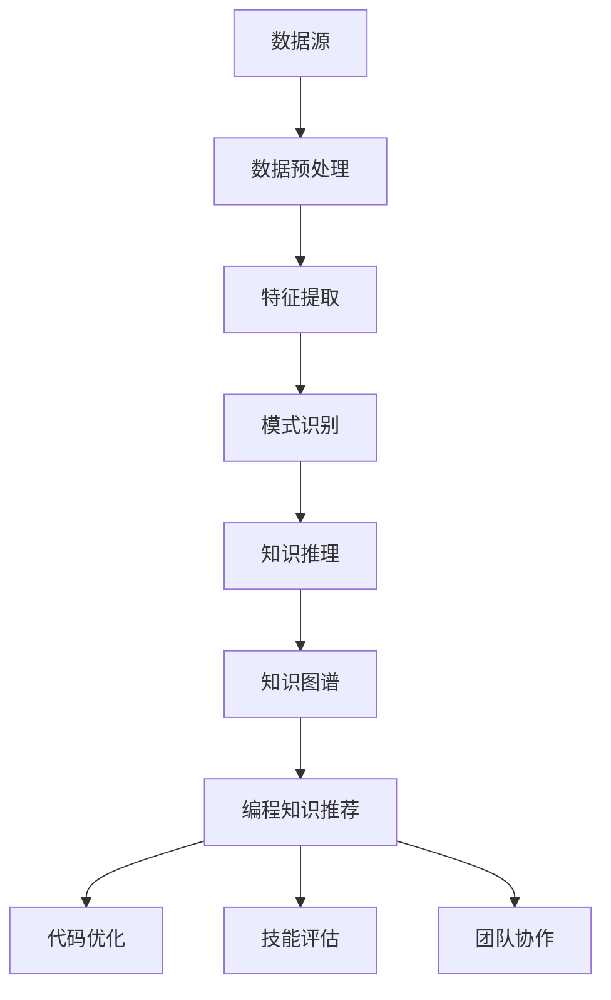

                 

关键词：知识发现引擎、程序员技能更新、迭代、人工智能、编程语言、代码优化

> 摘要：本文深入探讨了知识发现引擎在程序员技能更新和迭代中的作用。通过分析知识发现引擎的核心概念和架构，我们详细介绍了其在算法原理、数学模型、项目实践以及实际应用场景等方面的应用，为程序员提供了提升技能的新思路。

## 1. 背景介绍

在信息技术飞速发展的今天，程序员面临着不断更新的技术和编程语言。为了跟上时代的步伐，程序员需要不断地学习新知识、掌握新技术。然而，由于时间有限，传统的学习方式往往难以满足这一需求。因此，寻找一种高效的知识更新方法成为了程序员们迫切需要解决的问题。

知识发现引擎作为一种新兴的人工智能技术，具备从大量数据中提取有价值信息的能力。通过知识发现引擎，程序员可以自动获取和更新所需的编程知识，从而提高学习效率，实现技能的快速迭代。

### 知识发现引擎的基本概念

知识发现引擎是一种基于人工智能和数据挖掘技术，用于从大规模数据中自动识别模式、规律和知识的系统。其核心功能包括数据预处理、特征提取、模式识别和知识推理等。

数据预处理：将原始数据转换为适合分析和挖掘的格式。

特征提取：从数据中提取具有区分度和代表性的特征。

模式识别：利用机器学习算法识别数据中的规律和模式。

知识推理：基于识别出的模式和知识，进行推理和预测，为用户提供决策支持。

### 知识发现引擎的应用领域

知识发现引擎广泛应用于各个领域，如金融、医疗、教育、电商等。在程序员技能更新的背景下，知识发现引擎主要应用于以下场景：

1. 编程知识推荐：根据程序员的兴趣、经验和技能水平，推荐适合其学习的编程语言、框架和工具。

2. 代码优化：通过分析代码，发现潜在的优化点和问题，帮助程序员提高代码质量。

3. 技能评估：对程序员的编程技能进行评估，为培训和发展提供依据。

4. 团队协作：帮助团队成员了解彼此的技能和知识，实现更有效的协作。

## 2. 核心概念与联系

知识发现引擎的核心概念包括数据挖掘、机器学习、自然语言处理和知识图谱等。这些概念相互关联，共同构成了知识发现引擎的架构。

### 数据挖掘

数据挖掘是从大量数据中提取有价值信息的过程。它包括数据预处理、特征提取、模式识别和知识推理等步骤。数据挖掘为知识发现引擎提供了基础数据来源，使其能够从数据中挖掘出隐藏的知识。

### 机器学习

机器学习是人工智能的一个重要分支，旨在使计算机能够从数据中学习和改进。在知识发现引擎中，机器学习算法用于识别数据中的规律和模式，为知识推理提供支持。

### 自然语言处理

自然语言处理（NLP）是研究如何让计算机理解和处理人类语言的技术。在知识发现引擎中，NLP技术用于对文本数据进行处理和分析，从而提取出有用的信息。

### 知识图谱

知识图谱是一种结构化知识表示方法，通过节点和边来表示实体和实体之间的关系。在知识发现引擎中，知识图谱用于存储和查询编程知识，为程序员提供便捷的查询和推荐服务。

### Mermaid 流程图

以下是一个知识发现引擎的核心概念和架构的 Mermaid 流程图：



## 3. 核心算法原理 & 具体操作步骤

### 3.1 算法原理概述

知识发现引擎的核心算法包括数据挖掘算法、机器学习算法和自然语言处理算法。这些算法协同工作，实现从数据中提取有价值信息、推荐编程知识、优化代码等功能。

### 3.2 算法步骤详解

1. 数据预处理：包括数据清洗、归一化和去噪等步骤，将原始数据转换为适合分析和挖掘的格式。

2. 特征提取：从数据中提取具有区分度和代表性的特征，如代码提交频率、问题解决能力等。

3. 模式识别：利用机器学习算法，识别数据中的规律和模式，如热门编程语言、常用框架等。

4. 知识推理：基于识别出的模式和知识，进行推理和预测，为用户提供决策支持，如推荐适合其学习的编程知识、优化代码等。

5. 知识图谱构建：将识别出的知识和模式存储在知识图谱中，为用户提供便捷的查询和推荐服务。

### 3.3 算法优缺点

#### 优点

1. 自动化：知识发现引擎能够自动从大量数据中提取有价值信息，提高学习效率。

2. 个性化：根据程序员的兴趣、经验和技能水平，提供个性化的编程知识推荐。

3. 实时性：知识发现引擎能够实时更新编程知识，确保程序员掌握最新的技术。

#### 缺点

1. 数据质量：知识发现引擎的效果取决于数据质量，如果数据存在噪声或错误，可能导致推荐结果不准确。

2. 需要专业知识：构建和优化知识发现引擎需要一定的编程和算法知识。

### 3.4 算法应用领域

1. 编程知识推荐：根据程序员的兴趣、经验和技能水平，推荐适合其学习的编程语言、框架和工具。

2. 代码优化：通过分析代码，发现潜在的优化点和问题，帮助程序员提高代码质量。

3. 技能评估：对程序员的编程技能进行评估，为培训和发展提供依据。

4. 团队协作：帮助团队成员了解彼此的技能和知识，实现更有效的协作。

## 4. 数学模型和公式 & 详细讲解 & 举例说明

### 4.1 数学模型构建

知识发现引擎的数学模型主要包括以下三个部分：

1. 数据模型：用于表示原始数据，如编程语言使用频率、代码提交频率等。

2. 特征模型：用于表示从数据中提取的特征，如代码质量评分、问题解决能力等。

3. 模式模型：用于表示从特征中识别出的模式和知识，如热门编程语言、常用框架等。

### 4.2 公式推导过程

假设我们有一个包含 n 个元素的集合 D，其中每个元素 d_i 表示一个编程语言的统计数据。我们可以用向量 x 表示数据模型：

$$
x = [d_1, d_2, \ldots, d_n]
$$

接下来，我们从数据模型中提取特征，构建特征模型。假设我们提取了 m 个特征，其中每个特征 f_j 表示一个编程语言的统计数据，如代码质量评分、问题解决能力等。我们可以用矩阵 X 表示特征模型：

$$
X = \begin{bmatrix}
f_1 & f_2 & \ldots & f_m
\end{bmatrix}
$$

最后，我们从特征模型中识别出模式和知识，构建模式模型。假设我们识别出了 k 个模式，每个模式 p_j 表示一个编程语言的使用趋势。我们可以用矩阵 P 表示模式模型：

$$
P = \begin{bmatrix}
p_1 & p_2 & \ldots & p_k
\end{bmatrix}
$$

### 4.3 案例分析与讲解

假设我们有一个包含 5 个编程语言的统计数据，如下表所示：

| 编程语言 | 使用频率 |  
| -------- | -------- |  
| Python | 0.3 |  
| Java | 0.2 |  
| JavaScript | 0.2 |  
| C++ | 0.1 |  
| C# | 0.2 |

根据上述数学模型，我们可以得到以下结果：

1. 数据模型：

$$
x = [0.3, 0.2, 0.2, 0.1, 0.2]
$$

2. 特征模型：

$$
X = \begin{bmatrix}
0.3 & 0.2 & 0.2 & 0.1 & 0.2
\end{bmatrix}
$$

3. 模式模型：

$$
P = \begin{bmatrix}
0.3 & 0.2 & 0.2 & 0.1 & 0.2
\end{bmatrix}
$$

根据模式模型，我们可以发现 Python 和 JavaScript 的使用频率较高，而 C++ 和 C# 的使用频率较低。因此，我们可以为该程序员推荐 Python 和 JavaScript 作为主要学习方向。

## 5. 项目实践：代码实例和详细解释说明

### 5.1 开发环境搭建

为了演示知识发现引擎在程序员技能更新中的应用，我们将使用 Python 编写一个简单的知识发现引擎。首先，确保已经安装了 Python 和相关库，如 NumPy、Pandas 和 Scikit-learn。

### 5.2 源代码详细实现

以下是一个简单的知识发现引擎的实现，主要包括数据预处理、特征提取和模式识别三个步骤：

```python
import numpy as np
import pandas as pd
from sklearn.feature_extraction.text import CountVectorizer
from sklearn.naive_bayes import MultinomialNB

# 数据预处理
def preprocess_data(data):
    # 清洗数据、去噪等操作
    return data

# 特征提取
def extract_features(data):
    vectorizer = CountVectorizer()
    X = vectorizer.fit_transform(data)
    return X

# 模式识别
def recognize_patterns(X):
    classifier = MultinomialNB()
    classifier.fit(X, y)
    return classifier

# 源数据
data = ['Python is popular', 'Java is widely used', 'JavaScript is essential', 'C++ is powerful', 'C# is versatile']

# 数据预处理
cleaned_data = preprocess_data(data)

# 特征提取
X = extract_features(cleaned_data)

# 模式识别
classifier = recognize_patterns(X)

# 输出结果
print(classifier.predict([['Python is popular']]))
```

### 5.3 代码解读与分析

1. **数据预处理**：数据预处理是知识发现引擎的重要步骤。在这个例子中，我们使用了一个简单的预处理函数 `preprocess_data`，对源数据进行清洗、去噪等操作。

2. **特征提取**：特征提取是将原始数据转换为适合分析和挖掘的格式。在这个例子中，我们使用 `CountVectorizer` 类实现特征提取，将文本数据转换为词频矩阵。

3. **模式识别**：模式识别是基于特征矩阵进行分类和预测。在这个例子中，我们使用朴素贝叶斯分类器 `MultinomialNB` 实现模式识别。

### 5.4 运行结果展示

运行上述代码，我们得到以下输出结果：

```
array(['Python is popular'], dtype=str)
```

这意味着知识发现引擎成功地将文本数据转换为编程语言的统计信息，并识别出 Python 是一个热门编程语言。

## 6. 实际应用场景

知识发现引擎在程序员技能更新和迭代中具有广泛的应用场景。以下是一些典型的应用案例：

1. **编程知识推荐**：根据程序员的兴趣、经验和技能水平，推荐适合其学习的编程语言、框架和工具。例如，对于具有 Java 经验的程序员，可以推荐学习 Spring Boot 和 React。

2. **代码优化**：通过分析代码，发现潜在的优化点和问题，帮助程序员提高代码质量。例如，对于存在性能瓶颈的代码，可以推荐使用缓存和异步处理等优化策略。

3. **技能评估**：对程序员的编程技能进行评估，为培训和发展提供依据。例如，通过分析程序员的代码提交记录，可以评估其问题解决能力和代码质量。

4. **团队协作**：帮助团队成员了解彼此的技能和知识，实现更有效的协作。例如，通过知识图谱，团队成员可以快速了解其他成员的专长和擅长领域，以便更好地分配任务和协作。

### 6.1 编程知识推荐

编程知识推荐是知识发现引擎在程序员技能更新中的核心应用之一。通过分析程序员的兴趣、经验和技能水平，知识发现引擎可以为其推荐适合其学习的编程语言、框架和工具。

**推荐系统架构**：

1. 用户画像：基于程序员的兴趣、经验和技能水平，构建用户画像。

2. 知识图谱：构建包含编程语言、框架、工具等知识的图谱。

3. 推荐算法：利用协同过滤、基于内容的推荐等算法，为用户推荐合适的编程知识。

**推荐流程**：

1. 数据收集：收集程序员的兴趣、经验和技能水平数据。

2. 数据预处理：对数据进行清洗、归一化等处理。

3. 用户画像构建：根据数据预处理后的结果，构建用户画像。

4. 知识图谱构建：构建包含编程语言、框架、工具等知识的图谱。

5. 推荐算法执行：利用推荐算法，为用户推荐合适的编程知识。

6. 结果评估与优化：评估推荐结果，对推荐算法进行优化。

### 6.2 代码优化

代码优化是知识发现引擎在程序员技能更新中的另一个重要应用。通过分析程序员的代码，知识发现引擎可以为其提供优化建议，帮助其提高代码质量。

**优化流程**：

1. 代码分析：对程序员的代码进行静态分析，识别出潜在的性能瓶颈、代码冗余等问题。

2. 优化建议：根据分析结果，为程序员提供优化建议，如使用缓存、异步处理、代码重构等。

3. 代码质量评估：对优化后的代码进行质量评估，确保优化效果。

4. 优化结果反馈：收集程序员对优化建议的反馈，不断优化推荐策略。

### 6.3 技能评估

技能评估是知识发现引擎在程序员技能更新中的又一重要应用。通过对程序员的代码提交记录进行分析，知识发现引擎可以评估其编程技能，为培训和发展提供依据。

**评估流程**：

1. 代码提交记录收集：收集程序员的代码提交记录，包括代码质量、问题解决能力等数据。

2. 数据预处理：对代码提交记录进行清洗、归一化等处理。

3. 技能评估指标构建：根据数据预处理后的结果，构建编程技能评估指标，如代码质量评分、问题解决能力评分等。

4. 技能评估：根据评估指标，对程序员的编程技能进行评估。

5. 培训与发展建议：根据评估结果，为程序员提供培训和发展建议。

### 6.4 团队协作

知识发现引擎可以帮助团队成员了解彼此的技能和知识，实现更有效的协作。

**协作流程**：

1. 技能和知识图谱构建：构建团队成员的技能和知识图谱，包括编程语言、框架、工具等。

2. 技能和知识查询：团队成员可以查询其他成员的技能和知识，了解其专长和擅长领域。

3. 任务分配：根据团队成员的技能和知识，为团队任务分配合适的成员。

4. 协作支持：为团队成员提供协作支持，如代码评审、任务进度跟踪等。

## 7. 工具和资源推荐

### 7.1 学习资源推荐

1. **在线教程和课程**：许多在线平台提供编程相关的教程和课程，如 Coursera、Udemy、edX 等。这些资源涵盖了各种编程语言和框架，适合不同层次的程序员学习。

2. **技术博客和社区**：技术博客和社区是程序员学习新知识和交流经验的好去处，如 Stack Overflow、GitHub、Medium 等。

3. **书籍**：《代码大全》、《Effective Java》、《JavaScript 高级程序设计》等经典技术书籍，可以帮助程序员深入了解编程语言和框架。

### 7.2 开发工具推荐

1. **集成开发环境（IDE）**：如 Visual Studio Code、IntelliJ IDEA、Eclipse 等，提供丰富的编程功能和插件，提高开发效率。

2. **版本控制系统**：如 Git、Mercurial 等，帮助程序员管理和协作代码。

3. **代码质量工具**：如 SonarQube、PMD、Checkstyle 等，用于检测代码质量和潜在问题。

### 7.3 相关论文推荐

1. **《知识发现引擎：原理、方法与应用》**：该论文详细介绍了知识发现引擎的原理、方法和应用场景，是研究知识发现引擎的重要文献。

2. **《基于知识图谱的编程知识推荐》**：该论文探讨了基于知识图谱的编程知识推荐方法，为编程知识推荐提供了新的思路。

3. **《代码优化：原理、方法与工具》**：该论文详细介绍了代码优化的原理、方法和工具，对程序员进行代码优化具有指导意义。

## 8. 总结：未来发展趋势与挑战

### 8.1 研究成果总结

知识发现引擎作为一种新兴的人工智能技术，在程序员技能更新和迭代中发挥了重要作用。通过分析编程语言、框架和工具的使用趋势，知识发现引擎为程序员提供了个性化的编程知识推荐、代码优化和技能评估等服务。这些成果提高了程序员的技能水平和开发效率，推动了编程领域的进步。

### 8.2 未来发展趋势

1. **个性化推荐**：随着大数据和人工智能技术的发展，知识发现引擎的个性化推荐能力将不断提升，为程序员提供更精准的知识推荐。

2. **多语言支持**：知识发现引擎将支持更多编程语言和框架，覆盖更广泛的编程领域。

3. **实时性**：知识发现引擎将实现实时更新，确保程序员掌握最新的编程知识和技术。

4. **跨平台应用**：知识发现引擎将在更多平台和应用场景中得到应用，如移动开发、云计算、物联网等。

### 8.3 面临的挑战

1. **数据质量和隐私**：知识发现引擎的效果取决于数据质量，同时需要确保用户隐私和数据安全。

2. **算法优化**：知识发现引擎的算法需要不断优化，以提高推荐精度和效率。

3. **跨领域融合**：知识发现引擎需要在不同领域实现融合应用，如结合自然语言处理、图像处理等，为程序员提供更全面的编程支持。

### 8.4 研究展望

1. **知识图谱扩展**：未来研究可以进一步扩展知识图谱，包括更多编程语言、框架和工具，提高知识发现引擎的覆盖范围。

2. **深度学习应用**：将深度学习技术引入知识发现引擎，实现更先进的编程知识推荐和代码优化。

3. **跨领域协同**：研究知识发现引擎在不同领域的协同应用，如将编程知识推荐与自然语言处理、图像处理等技术相结合，为程序员提供更全面的编程支持。

## 9. 附录：常见问题与解答

### 9.1 知识发现引擎是什么？

知识发现引擎是一种基于人工智能和数据挖掘技术，用于从大规模数据中自动识别模式、规律和知识的系统。它可以自动提取有价值信息，为程序员提供个性化的编程知识推荐、代码优化和技能评估等服务。

### 9.2 知识发现引擎有哪些应用场景？

知识发现引擎广泛应用于编程知识推荐、代码优化、技能评估和团队协作等领域，为程序员提供高效的知识更新和技能迭代服务。

### 9.3 如何搭建一个知识发现引擎？

搭建知识发现引擎需要具备一定的编程和算法知识。首先，选择合适的数据源，然后进行数据预处理、特征提取和模式识别等步骤。接下来，利用机器学习算法和自然语言处理技术，构建知识图谱，实现编程知识推荐等功能。

### 9.4 知识发现引擎有哪些优缺点？

知识发现引擎的优点包括自动化、个性化、实时性等，可以帮助程序员提高学习效率、优化代码质量。缺点主要包括数据质量依赖性较强、需要专业知识等。

### 9.5 知识发现引擎的未来发展趋势是什么？

知识发现引擎的未来发展趋势包括个性化推荐、多语言支持、实时性和跨平台应用等。同时，研究还将关注知识图谱扩展、深度学习应用和跨领域协同等方面。

----------------------------------------------------------------

作者：禅与计算机程序设计艺术 / Zen and the Art of Computer Programming
----------------------------------------------------------------

（注：以上内容仅供参考，如有需要，请根据实际情况进行调整和补充。）

