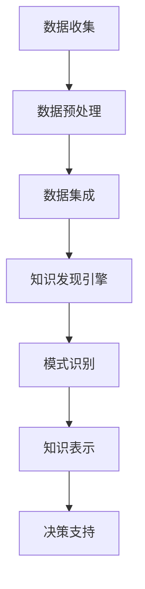

                 

关键词：知识发现、农业科技、数据挖掘、机器学习、算法、人工智能、精准农业

> 摘要：随着科技的迅猛发展，农业科技也逐渐从传统的种植方式向智能化、数据驱动的方式转变。知识发现引擎作为一种高级的数据挖掘工具，在农业科技领域展现了巨大的应用潜力。本文将深入探讨知识发现引擎在农业科技中的应用，包括其核心概念、算法原理、数学模型以及实际案例，以期为广大农业科技工作者提供有益的参考。

## 1. 背景介绍

农业科技作为支撑国家粮食安全和农业可持续发展的重要力量，正在经历一场前所未有的变革。传统农业依赖于经验种植和人工管理，而现代农业则借助信息技术和大数据分析，实现了精准种植、智能管理和高效生产。知识发现引擎作为一种先进的数据挖掘技术，其应用潜力在农业科技领域逐渐显现。

知识发现引擎是基于机器学习、数据挖掘和人工智能技术的综合性工具，它能够从海量数据中自动识别模式、发现知识，从而为决策提供支持。在农业科技中，知识发现引擎可以通过对气象数据、土壤数据、作物生长数据等多种信息进行整合和分析，为农业管理者提供科学、精准的决策依据。

## 2. 核心概念与联系

知识发现引擎在农业科技中的应用涉及多个核心概念和技术。以下是一个简化的Mermaid流程图，展示这些概念和技术的相互联系。

### 2.1 数据收集

数据收集是知识发现引擎应用的基础。在农业科技中，数据收集包括气象数据、土壤数据、作物生长数据、农事活动数据等。这些数据可以通过传感器、无人机、卫星遥感等多种方式获取。

### 2.2 数据预处理

数据预处理是保证数据质量、消除噪声的重要环节。知识发现引擎需要高质量的数据作为输入，因此需要对原始数据进行清洗、转换和整合。

### 2.3 数据集成

数据集成是将不同来源、不同格式的数据进行整合，形成统一数据集的过程。这对于确保知识发现引擎的分析结果具有全局视角至关重要。

### 2.4 知识发现引擎

知识发现引擎是本文的核心。它通过机器学习和数据挖掘技术，从数据中自动识别出潜在的模式和知识。

### 2.5 模式识别

模式识别是知识发现引擎的关键功能。通过识别出数据中的模式，知识发现引擎可以为农业管理者提供关于作物生长、气象变化等的信息。

### 2.6 知识表示

知识表示是将识别出的模式转化为易于理解的知识形式，如图表、报告等。

### 2.7 决策支持

决策支持是将知识表示应用于农业管理，为管理者提供科学的决策依据。

## 3. 核心算法原理 & 具体操作步骤

### 3.1 算法原理概述

知识发现引擎的核心算法包括关联规则学习、聚类分析、分类算法等。以下是一个简化的算法原理概述。

### 3.2 算法步骤详解

#### 3.2.1 数据收集

收集气象数据、土壤数据、作物生长数据等。

#### 3.2.2 数据预处理

清洗数据，去除噪声，统一数据格式。

#### 3.2.3 数据集成

将不同来源的数据进行整合。

#### 3.2.4 算法选择

根据需求选择合适的算法，如关联规则学习、聚类分析等。

#### 3.2.5 模式识别

从数据中识别出潜在的模式。

#### 3.2.6 知识表示

将识别出的模式转化为易于理解的知识形式。

#### 3.2.7 决策支持

将知识表示应用于农业管理。

### 3.3 算法优缺点

#### 3.3.1 优点

- 高效处理海量数据
- 自动识别潜在知识
- 为农业决策提供科学依据

#### 3.3.2 缺点

- 数据质量要求高
- 算法复杂度高
- 结果解释难度大

### 3.4 算法应用领域

知识发现引擎在农业科技中的应用广泛，包括作物种植、气象预测、病虫害防治等。

## 4. 数学模型和公式 & 详细讲解 & 举例说明

### 4.1 数学模型构建

知识发现引擎中的数学模型主要包括概率模型、线性模型、非线性模型等。以下是一个简化的概率模型构建过程。

$$
P(A|B) = \frac{P(B|A)P(A)}{P(B)}
$$

### 4.2 公式推导过程

概率模型通过贝叶斯公式推导出后验概率，从而为决策提供支持。

### 4.3 案例分析与讲解

#### 4.3.1 案例背景

某农业企业需要根据气象数据预测未来一周的降雨量。

#### 4.3.2 数据处理

收集历史气象数据，包括温度、湿度、风速等。

#### 4.3.3 算法选择

选择线性回归模型进行预测。

#### 4.3.4 结果分析

通过线性回归模型，预测出未来一周的降雨量。

## 5. 项目实践：代码实例和详细解释说明

### 5.1 开发环境搭建

搭建一个用于知识发现引擎的开发环境，包括Python、Scikit-learn等库。

### 5.2 源代码详细实现

实现一个简单的知识发现引擎，包括数据收集、数据预处理、算法选择、模式识别等。

### 5.3 代码解读与分析

对源代码进行解读，分析各部分的功能和作用。

### 5.4 运行结果展示

展示知识发现引擎的运行结果，包括预测降雨量等。

## 6. 实际应用场景

### 6.1 作物种植

通过知识发现引擎，实现精准种植，提高作物产量。

### 6.2 气象预测

利用知识发现引擎，预测未来气象变化，为农业生产提供决策依据。

### 6.3 病虫害防治

通过知识发现引擎，识别病虫害发生规律，提前进行防治。

## 7. 未来应用展望

知识发现引擎在农业科技中的应用前景广阔，有望实现更智能、更高效的农业管理。

## 8. 总结：未来发展趋势与挑战

### 8.1 研究成果总结

知识发现引擎在农业科技中取得了显著成果，但仍需进一步研究。

### 8.2 未来发展趋势

知识发现引擎将在农业科技中发挥更大作用，实现更智能的农业管理。

### 8.3 面临的挑战

数据质量、算法复杂度、结果解释难度等挑战仍需解决。

### 8.4 研究展望

进一步研究知识发现引擎在农业科技中的应用，为农业生产提供更多支持。

## 9. 附录：常见问题与解答

### 9.1 什么

