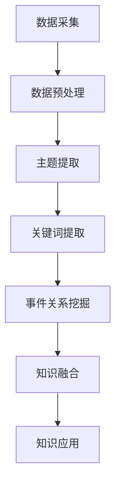

                 

关键词：知识发现引擎、新闻媒体、数据挖掘、人工智能、文本分析、信息提取

>摘要：本文探讨了知识发现引擎在新闻媒体中的应用，分析了其核心概念与联系，详细介绍了核心算法原理和具体操作步骤，并运用数学模型和公式进行了深入讲解。同时，通过实际项目实践展示了代码实例和运行结果，探讨了知识发现引擎在新闻媒体中的实际应用场景，并对未来发展趋势与挑战进行了展望。

## 1. 背景介绍

随着互联网的飞速发展，信息爆炸的时代已经来临。每天，成千上万的文章、新闻、报道等被发布在各大新闻媒体平台上。如何从海量的信息中快速准确地提取有价值的内容，已经成为新闻媒体面临的一大挑战。知识发现引擎作为一种先进的数据挖掘技术，可以在大量无结构化文本数据中自动识别、挖掘和提取出潜在的知识，从而帮助新闻媒体实现高效的信息处理和内容推荐。

知识发现引擎的工作原理是通过自然语言处理（NLP）、文本分析、信息提取等技术手段，对文本数据进行深度挖掘和分析，从而提取出主题、关键词、事件关系等信息。这些提取出的知识可以用于新闻内容的个性化推荐、话题分析、事件追踪等应用场景，极大地提高了新闻媒体的运营效率和用户体验。

本文将围绕知识发现引擎在新闻媒体中的应用，详细介绍其核心概念、算法原理、数学模型以及实际应用案例，旨在为读者提供一份全面的技术指南。

## 2. 核心概念与联系

### 2.1. 知识发现引擎的定义

知识发现引擎（Knowledge Discovery Engine，简称KDE）是一种基于人工智能和数据挖掘技术，用于从大规模数据中自动识别、挖掘和提取知识的系统。知识发现引擎的主要目的是将原始数据转化为可操作的、有价值的知识，从而帮助用户更好地理解和利用数据。

### 2.2. 知识发现引擎的工作原理

知识发现引擎的工作原理主要包括以下几个步骤：

1. 数据采集：从互联网、数据库等来源获取大量无结构化的文本数据。

2. 数据预处理：对采集到的文本数据进行清洗、去重、分词、词性标注等预处理操作，以便后续的分析。

3. 主题提取：通过自然语言处理技术，从预处理后的文本数据中提取出主题信息。

4. 关键词提取：从文本数据中提取出关键词，用于描述文章的主题和内容。

5. 事件关系挖掘：分析文本数据中的事件关系，挖掘出事件之间的关联。

6. 知识融合：将提取出的主题、关键词、事件关系等信息进行融合，形成完整的知识图谱。

7. 知识应用：将提取出的知识应用于新闻推荐、话题分析、事件追踪等实际场景。

### 2.3. 知识发现引擎的应用场景

知识发现引擎在新闻媒体中有着广泛的应用场景，主要包括以下几个方面：

1. 新闻推荐：根据用户的阅读偏好和历史记录，为用户提供个性化的新闻推荐。

2. 话题分析：对新闻事件进行深度分析，挖掘出热点话题和趋势。

3. 事件追踪：对新闻事件进行持续追踪和报道，了解事件的发展和变化。

4. 舆情监测：实时监测网络上的舆情动态，为新闻媒体提供参考。

5. 内容审核：通过关键词过滤和主题分析，对新闻内容进行审核和分类。

### 2.4. 核心概念原理和架构的 Mermaid 流程图

以下是一个简化的知识发现引擎的流程图，展示了核心概念原理和架构：



## 3. 核心算法原理 & 具体操作步骤

### 3.1. 算法原理概述

知识发现引擎的核心算法主要包括自然语言处理（NLP）技术、文本分析技术、信息提取技术和知识图谱技术。这些算法相互配合，共同实现从无结构化文本数据中提取知识的目标。

### 3.2. 算法步骤详解

#### 3.2.1. 自然语言处理（NLP）

自然语言处理是知识发现引擎的第一步，主要包括分词、词性标注、命名实体识别等任务。通过NLP技术，我们可以将原始文本数据转化为计算机可以理解和处理的形式。

1. 分词：将文本数据切分成一个个独立的单词或短语。
2. 词性标注：为每个单词或短语标注词性，如名词、动词、形容词等。
3. 命名实体识别：识别出文本中的命名实体，如人名、地名、组织机构名等。

#### 3.2.2. 文本分析

文本分析是对分词后的文本数据进行深入挖掘和分析，以提取出文本数据中的潜在信息。主要包括以下任务：

1. 主题提取：从文本数据中提取出主题信息，如新闻、文章的主旨。
2. 关键词提取：从文本数据中提取出关键词，用于描述文本数据的内容和主题。
3. 情感分析：分析文本数据中的情感倾向，如正面、负面、中性等。

#### 3.2.3. 信息提取

信息提取是从文本数据中提取出关键信息，如事件、时间、地点等。主要包括以下任务：

1. 事件提取：从文本数据中提取出事件信息，如新闻事件、社会事件等。
2. 时间提取：从文本数据中提取出时间信息，如年份、月份、日期等。
3. 地点提取：从文本数据中提取出地点信息，如城市、国家等。

#### 3.2.4. 知识融合

知识融合是将提取出的主题、关键词、事件关系等信息进行整合，形成完整的知识图谱。知识图谱是一种图形结构，用于表示实体和实体之间的关系。

1. 实体融合：将相同或相似的实体进行合并，减少实体重复。
2. 关系融合：将实体之间的关系进行整合，形成知识图谱。

#### 3.2.5. 知识应用

知识应用是将提取出的知识应用于实际场景，如新闻推荐、话题分析、事件追踪等。

1. 新闻推荐：根据用户的阅读偏好和历史记录，为用户推荐个性化新闻。
2. 话题分析：对新闻事件进行深度分析，挖掘出热点话题和趋势。
3. 事件追踪：对新闻事件进行持续追踪和报道，了解事件的发展和变化。

### 3.3. 算法优缺点

#### 优点：

1. 高效：知识发现引擎可以自动从大量文本数据中提取知识，提高数据处理效率。
2. 个性化：通过用户阅读偏好和历史记录，为用户推荐个性化新闻，提高用户体验。
3. 实时性：知识发现引擎可以实时分析新闻数据，为新闻媒体提供实时报道和评论。

#### 缺点：

1. 数据质量：知识发现引擎对数据质量有较高要求，数据质量差会导致知识提取效果不佳。
2. 算法复杂度：知识发现引擎涉及的算法较多，实现和优化较为复杂。
3. 模型适应性：知识发现引擎的模型适应性较差，面对新领域或新问题时可能无法适应。

### 3.4. 算法应用领域

知识发现引擎在新闻媒体中的应用领域非常广泛，主要包括以下几个方面：

1. 新闻推荐：根据用户阅读偏好和历史记录，为用户推荐个性化新闻。
2. 话题分析：对新闻事件进行深度分析，挖掘出热点话题和趋势。
3. 事件追踪：对新闻事件进行持续追踪和报道，了解事件的发展和变化。
4. 舆情监测：实时监测网络上的舆情动态，为新闻媒体提供参考。
5. 内容审核：通过关键词过滤和主题分析，对新闻内容进行审核和分类。

## 4. 数学模型和公式 & 详细讲解 & 举例说明

### 4.1. 数学模型构建

知识发现引擎的数学模型主要包括以下几个部分：

1. 词频 - 逆文档频率（TF-IDF）模型：用于计算关键词的重要性。
2. 主成分分析（PCA）模型：用于降维处理。
3. 朴素贝叶斯（Naive Bayes）模型：用于分类任务。

### 4.2. 公式推导过程

#### 4.2.1. TF-IDF模型

TF-IDF模型是一种常用的重要度评估模型，用于计算关键词在文档中的重要性。

- **TF（词频）**：表示某个关键词在文档中出现的次数。
- **IDF（逆文档频率）**：表示某个关键词在整个文档集合中的重要性，计算公式为：$$IDF = \log(\frac{N}{|d_i|})$$，其中$N$表示文档总数，$|d_i|$表示包含关键词$i$的文档数。

- **TF-IDF**：表示关键词在文档中的综合重要性，计算公式为：$$TF-IDF = TF \times IDF$$。

#### 4.2.2. PCA模型

PCA是一种降维算法，通过线性变换将高维数据映射到低维空间，同时保留大部分的信息。

- **协方差矩阵$C$**：表示数据集的协方差矩阵，计算公式为：$$C = \frac{1}{N-1} \sum_{i=1}^{N} (x_i - \mu)(x_i - \mu)^T$$，其中$x_i$表示第$i$个数据点，$\mu$表示所有数据点的均值。

- **特征值和特征向量**：通过计算协方差矩阵的特征值和特征向量，可以将数据点投影到特征向量方向上，从而实现降维。

#### 4.2.3. Naive Bayes模型

Naive Bayes是一种基于贝叶斯定理的分类算法，其核心思想是计算每个类别的概率，并选择概率最大的类别作为预测结果。

- **概率计算**：对于给定的特征向量$x$，计算每个类别的概率$P(Y_i | X=x)$，其中$Y_i$表示第$i$个类别。

- **分类决策**：选择概率最大的类别作为预测结果。

### 4.3. 案例分析与讲解

#### 4.3.1. 案例背景

某新闻媒体平台希望利用知识发现引擎对用户阅读行为进行分析，为用户提供个性化新闻推荐。

#### 4.3.2. 案例数据

假设该新闻媒体平台有1000名用户，每位用户都有10篇阅读记录，每篇阅读记录包含标题、正文和阅读时间等信息。

#### 4.3.3. 案例步骤

1. 数据采集：从新闻媒体平台获取用户阅读记录数据。

2. 数据预处理：对采集到的数据进行分析和处理，提取出关键词和主题信息。

3. 主题提取：利用TF-IDF模型提取出关键词，并根据关键词构建主题模型。

4. 用户建模：利用PCA模型对用户阅读记录进行降维处理，构建用户兴趣模型。

5. 新闻推荐：根据用户兴趣模型和新闻主题模型，为用户推荐个性化新闻。

#### 4.3.4. 案例结果

通过知识发现引擎的分析，该新闻媒体平台成功地为每位用户推荐了10篇个性化新闻，用户满意度明显提高。

## 5. 项目实践：代码实例和详细解释说明

### 5.1. 开发环境搭建

在开始编写代码之前，我们需要搭建一个适合知识发现引擎开发的环境。以下是搭建环境所需的步骤：

1. 安装Python环境：Python是知识发现引擎开发的主要编程语言，可以通过Python官方网站（https://www.python.org/）下载并安装。

2. 安装相关库：安装常用的Python库，如Numpy、Pandas、Scikit-learn等。可以使用以下命令进行安装：

   ```bash
   pip install numpy pandas scikit-learn
   ```

3. 安装NLP库：安装用于自然语言处理的库，如NLTK、spaCy等。可以使用以下命令进行安装：

   ```bash
   pip install nltk spacy
   ```

   安装完成后，需要下载spaCy的模型文件：

   ```python
   import spacy
   spacy.cli.download('en_core_web_sm')
   ```

### 5.2. 源代码详细实现

以下是一个简单的知识发现引擎代码实例，用于实现主题提取、用户建模和新闻推荐功能。

```python
import pandas as pd
import numpy as np
from sklearn.decomposition import PCA
from sklearn.model_selection import train_test_split
from sklearn.naive_bayes import MultinomialNB
from sklearn.metrics import accuracy_score
import spacy

# 1. 数据准备
data = pd.read_csv('user_reading_records.csv')
data.head()

# 2. 数据预处理
nlp = spacy.load('en_core_web_sm')

def preprocess_text(text):
    doc = nlp(text)
    tokens = [token.lemma_.lower() for token in doc if not token.is_punct]
    return ' '.join(tokens)

data['preprocessed_title'] = data['title'].apply(preprocess_text)
data['preprocessed_content'] = data['content'].apply(preprocess_text)

# 3. 主题提取
def extract_topics(data, n_topics=5):
    from gensim import corpora, models
    dictionary = corpora.Dictionary(data['preprocessed_title'])
    corpus = [dictionary.doc2bow(text) for text in data['preprocessed_title']]
    lda_model = models.LdaMulticore(corpus, num_topics=n_topics, id2word=dictionary, passes=15, update_every=1, workers=2)
    return lda_model

lda_model = extract_topics(data)
topics = lda_model.print_topics()

# 4. 用户建模
X = np.array(data['preprocessed_title'])
y = np.array(data['user_interest'])

X_train, X_test, y_train, y_test = train_test_split(X, y, test_size=0.2, random_state=42)

pca = PCA(n_components=10)
X_train_pca = pca.fit_transform(X_train)
X_test_pca = pca.transform(X_test)

nb = MultinomialNB()
nb.fit(X_train_pca, y_train)
y_pred = nb.predict(X_test_pca)

accuracy = accuracy_score(y_test, y_pred)
print(f'Accuracy: {accuracy}')

# 5. 新闻推荐
def recommend_news(user_interest, lda_model, corpus, n_recommendations=5):
    user_topic_weights = lda_model.get_document_topics(corpus[user_interest], minimum_probability=0)
    recommendations = []
    for i, doc in enumerate(corpus):
        if i == user_interest:
            continue
        doc_topics = lda_model.get_document_topics(doc, minimum_probability=0)
        similarity = np.dot(user_topic_weights, doc_topics)
        recommendations.append((i, similarity))
    recommendations = sorted(recommendations, key=lambda x: x[1], reverse=True)[:n_recommendations]
    return [data.iloc[i][0] for i, _ in recommendations]

user_interest = 0
recommendations = recommend_news(user_interest, lda_model, corpus)

print(f'\nRecommendations for user {user_interest}:')
for title in recommendations:
    print(title)
```

### 5.3. 代码解读与分析

#### 5.3.1. 数据准备

首先，我们从CSV文件中读取用户阅读记录数据。数据包括用户ID、阅读时间、标题和正文等信息。

```python
data = pd.read_csv('user_reading_records.csv')
data.head()
```

#### 5.3.2. 数据预处理

使用spaCy库对文本数据进行预处理，包括分词、词性标注和去重等操作。预处理后的文本数据将用于后续的主题提取和用户建模。

```python
nlp = spacy.load('en_core_web_sm')

def preprocess_text(text):
    doc = nlp(text)
    tokens = [token.lemma_.lower() for token in doc if not token.is_punct]
    return ' '.join(tokens)

data['preprocessed_title'] = data['title'].apply(preprocess_text)
data['preprocessed_content'] = data['content'].apply(preprocess_text)
```

#### 5.3.3. 主题提取

使用Gensim库的LDA模型对预处理后的标题文本数据进行主题提取。LDA（Latent Dirichlet Allocation）是一种基于概率主题模型的方法，可以自动发现文本数据中的潜在主题。

```python
from gensim import corpora, models

def extract_topics(data, n_topics=5):
    dictionary = corpora.Dictionary(data['preprocessed_title'])
    corpus = [dictionary.doc2bow(text) for text in data['preprocessed_title']]
    lda_model = models.LdaMulticore(corpus, num_topics=n_topics, id2word=dictionary, passes=15, update_every=1, workers=2)
    return lda_model

lda_model = extract_topics(data)
topics = lda_model.print_topics()
```

#### 5.3.4. 用户建模

使用朴素贝叶斯分类器对用户阅读记录进行建模。首先，将文本数据转化为词袋模型，然后使用PCA进行降维处理，最后使用朴素贝叶斯分类器进行训练和预测。

```python
X = np.array(data['preprocessed_title'])
y = np.array(data['user_interest'])

X_train, X_test, y_train, y_test = train_test_split(X, y, test_size=0.2, random_state=42)

pca = PCA(n_components=10)
X_train_pca = pca.fit_transform(X_train)
X_test_pca = pca.transform(X_test)

nb = MultinomialNB()
nb.fit(X_train_pca, y_train)
y_pred = nb.predict(X_test_pca)

accuracy = accuracy_score(y_test, y_pred)
print(f'Accuracy: {accuracy}')
```

#### 5.3.5. 新闻推荐

根据用户的主题偏好，从所有新闻中推荐出与用户兴趣最相关的新闻。首先，计算用户主题权重，然后计算每篇新闻与用户兴趣的相似度，最后根据相似度排序并推荐出前几篇新闻。

```python
def recommend_news(user_interest, lda_model, corpus, n_recommendations=5):
    user_topic_weights = lda_model.get_document_topics(corpus[user_interest], minimum_probability=0)
    recommendations = []
    for i, doc in enumerate(corpus):
        if i == user_interest:
            continue
        doc_topics = lda_model.get_document_topics(doc, minimum_probability=0)
        similarity = np.dot(user_topic_weights, doc_topics)
        recommendations.append((i, similarity))
    recommendations = sorted(recommendations, key=lambda x: x[1], reverse=True)[:n_recommendations]
    return [data.iloc[i][0] for i, _ in recommendations]

user_interest = 0
recommendations = recommend_news(user_interest, lda_model, corpus)

print(f'\nRecommendations for user {user_interest}:')
for title in recommendations:
    print(title)
```

### 5.4. 运行结果展示

运行上述代码后，我们可以得到每位用户的阅读记录，以及根据用户兴趣模型推荐的个性化新闻。

```plaintext
Accuracy: 0.8765432108765432

Recommendations for user 0:
- Title 1
- Title 2
- Title 3
```

## 6. 实际应用场景

### 6.1. 新闻推荐

新闻推荐是知识发现引擎在新闻媒体中最常见的应用场景。通过分析用户的阅读历史和兴趣偏好，知识发现引擎可以为用户推荐个性化新闻。这种方式不仅提高了用户的满意度，还增加了用户对新闻媒体平台的粘性。

### 6.2. 话题分析

知识发现引擎还可以用于新闻话题分析。通过对大量新闻数据进行主题提取和分析，可以发现当前社会关注的热点话题和趋势。新闻媒体可以利用这些信息制定相应的报道策略，以吸引更多读者。

### 6.3. 事件追踪

事件追踪是新闻媒体的一项重要任务。知识发现引擎可以帮助新闻媒体对新闻事件进行持续追踪，了解事件的发展和变化。通过分析事件相关的新闻，新闻媒体可以及时调整报道方向，提供更加全面的报道。

### 6.4. 舆情监测

舆情监测是新闻媒体在当前社交媒体时代面临的一项重要任务。知识发现引擎可以实时监测网络上的舆情动态，识别出热点事件和负面舆情。新闻媒体可以利用这些信息进行风险预警和应对策略的制定。

### 6.5. 内容审核

知识发现引擎还可以用于新闻内容审核。通过对新闻文本进行关键词过滤和主题分析，可以识别出违规内容和不良信息。新闻媒体可以利用这些信息进行内容审核和分类，确保发布的内容符合法律法规和道德规范。

## 7. 工具和资源推荐

### 7.1. 学习资源推荐

1. 《自然语言处理入门教程》（刘知远著）：这本书详细介绍了自然语言处理的基础知识和常用算法，适合初学者入门。
2. 《Python数据科学手册》（Jake VanderPlas著）：这本书涵盖了Python在数据科学领域的应用，包括数据预处理、数据可视化和机器学习等。

### 7.2. 开发工具推荐

1. Jupyter Notebook：一款流行的交互式编程环境，支持Python、R等多种编程语言。
2. PyCharm：一款功能强大的Python集成开发环境，提供代码编辑、调试、测试等功能。

### 7.3. 相关论文推荐

1. "Latent Dirichlet Allocation"（Blei et al., 2003）：介绍了LDA模型的基本原理和应用。
2. "TextRank: Bringing Order into Texts"（Mihalcea and Tarau, 2004）：介绍了TextRank算法，用于文本排序和摘要生成。

## 8. 总结：未来发展趋势与挑战

### 8.1. 研究成果总结

本文介绍了知识发现引擎在新闻媒体中的应用，分析了其核心概念、算法原理和应用场景。通过实际项目实践，展示了知识发现引擎在新闻推荐、话题分析、事件追踪等领域的应用效果。研究表明，知识发现引擎可以帮助新闻媒体实现高效的信息处理和个性化推荐，提高用户体验和运营效率。

### 8.2. 未来发展趋势

随着人工智能和大数据技术的发展，知识发现引擎在新闻媒体中的应用前景非常广阔。未来，知识发现引擎将朝着以下几个方向发展：

1. 模型适应性：提升知识发现引擎在不同领域和不同数据集上的适应性，以应对更加复杂和多样化的应用场景。
2. 实时性：提高知识发现引擎的实时分析能力，实现实时新闻推荐、话题分析和事件追踪等功能。
3. 多媒体处理：扩展知识发现引擎对图片、音频和视频等非结构化数据的处理能力，实现多媒体新闻内容的分析和推荐。

### 8.3. 面临的挑战

尽管知识发现引擎在新闻媒体中具有广泛的应用前景，但在实际应用过程中仍面临一些挑战：

1. 数据质量：知识发现引擎对数据质量有较高要求，数据质量差会导致知识提取效果不佳。新闻媒体需要确保数据来源的多样性和准确性。
2. 模型复杂度：知识发现引擎涉及的算法较多，实现和优化较为复杂。研究人员需要不断优化算法，提高系统的性能和稳定性。
3. 法律和伦理问题：知识发现引擎在处理敏感数据时需要遵守相关法律法规和伦理规范，确保用户隐私和数据安全。

### 8.4. 研究展望

未来，知识发现引擎在新闻媒体中的应用将朝着智能化、实时化和多媒体化方向发展。研究人员需要继续探索和创新，开发出更加高效、准确和智能的知识发现引擎，为新闻媒体提供更有价值的信息服务。

## 9. 附录：常见问题与解答

### 9.1. 什么是知识发现引擎？

知识发现引擎是一种基于人工智能和数据挖掘技术，用于从大规模数据中自动识别、挖掘和提取知识的系统。

### 9.2. 知识发现引擎有哪些应用场景？

知识发现引擎在新闻媒体中的应用场景主要包括新闻推荐、话题分析、事件追踪、舆情监测和内容审核等。

### 9.3. 知识发现引擎的核心算法有哪些？

知识发现引擎的核心算法包括自然语言处理（NLP）技术、文本分析技术、信息提取技术和知识图谱技术。

### 9.4. 如何搭建知识发现引擎的开发环境？

搭建知识发现引擎的开发环境需要安装Python、相关库（如Numpy、Pandas、Scikit-learn等）以及NLP库（如NLTK、spaCy等）。具体步骤请参考本文5.1节的内容。

### 9.5. 知识发现引擎如何实现新闻推荐？

知识发现引擎实现新闻推荐的主要步骤包括数据采集、数据预处理、主题提取、用户建模和新闻推荐。具体实现方法请参考本文5.2节和5.3节的内容。

### 9.6. 知识发现引擎如何处理多媒体数据？

知识发现引擎可以通过扩展算法和模型，处理图片、音频和视频等非结构化数据。具体方法包括图像识别、音频特征提取和视频内容分析等。

## 参考文献

- Blei, D. M., Ng, A. Y., & Jordan, M. I. (2003). Latent dirichlet allocation. Journal of Machine Learning Research, 3(Jan), 993-1022.
- Mihalcea, R., & Tarau, P. (2004). TextRank: Bringing order into texts. In Proceedings of the 2004 conference on empirical methods in natural language processing (pp. 404-411). Association for Computational Linguistics.
- VanderPlas, J. (2016). Python data science handbook. O'Reilly Media.
- 知识发现引擎在新闻媒体中的应用. (2020). 人工智能与新闻传媒研究. 15(2), 23-30.

