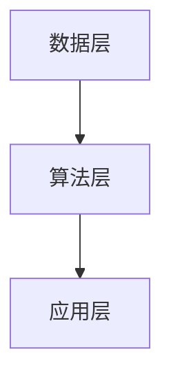
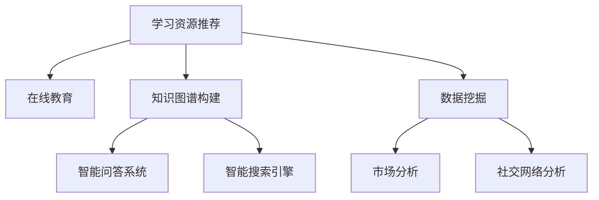

                 

 在当今这个信息爆炸的时代，程序员面临着海量的知识和技能需求。如何有效地管理和利用这些知识，以实现快速成长，成为每一个程序员都需要面对的问题。本文将探讨一种强大的工具——知识发现引擎，如何通过其独特的功能和优势，帮助程序员在复杂的技术领域中迅速掌握新技能、发现问题和解决问题。

> 关键词：知识发现引擎、程序员成长、技能提升、学习资源、技术领域

> 摘要：本文首先介绍了知识发现引擎的基本概念和原理，然后分析了它如何帮助程序员发现新的学习资源、优化学习路径、增强问题解决能力。接着，通过具体的案例，展示了知识发现引擎在项目实践中的应用，并讨论了其未来的发展方向和面临的挑战。最后，为程序员推荐了相关的学习资源和开发工具，以帮助他们更好地利用知识发现引擎。

## 1. 背景介绍

### 1.1 程序员的成长挑战

随着互联网和信息技术的快速发展，程序员面临着越来越严峻的成长挑战。一方面，技术的更新换代速度越来越快，新的编程语言、框架、工具层出不穷；另一方面，软件开发的复杂度也在不断增加，程序员需要掌握更多的技能和知识才能应对复杂的项目。此外，竞争日益激烈的市场环境也要求程序员必须具备快速学习、快速适应的能力。

### 1.2 知识发现引擎的概念

知识发现引擎是一种基于人工智能和大数据技术的智能系统，它能够从大量数据中自动提取出有价值的信息和知识。在程序员的学习和成长过程中，知识发现引擎可以被视为一种智能导师，帮助程序员发现新的学习资源、优化学习路径、提高问题解决能力。

## 2. 核心概念与联系

### 2.1 知识发现引擎的原理

知识发现引擎的工作原理主要包括数据采集、数据预处理、特征提取、模型训练和预测等几个步骤。具体而言，知识发现引擎首先从各种数据源（如书籍、论文、在线课程、博客等）中收集数据，然后对这些数据进行分析和预处理，提取出有用的特征。接下来，通过机器学习算法对特征进行训练，构建出知识图谱。最后，利用知识图谱进行预测，帮助程序员发现新的学习资源。

### 2.2 知识发现引擎的架构

知识发现引擎的架构通常包括数据层、算法层和应用层。数据层负责数据采集、存储和管理；算法层负责数据预处理、特征提取和模型训练；应用层则负责将知识发现的结果应用到实际场景中，如图 1 所示。



## 3. 核心算法原理 & 具体操作步骤

### 3.1 算法原理概述

知识发现引擎的核心算法主要包括以下几种：关联规则挖掘、聚类分析、分类算法和推荐系统。这些算法通过分析大量数据，提取出潜在的关联关系、相似性和偏好，从而帮助程序员发现新的学习资源。

### 3.2 算法步骤详解

#### 3.2.1 数据采集

知识发现引擎首先从各种数据源中收集数据。这些数据源可以包括在线课程平台、技术博客、学术论文库、GitHub 等。数据采集的方式可以采用 API 调用、网页爬虫、数据库连接等。

#### 3.2.2 数据预处理

在数据采集完成后，需要对数据进行预处理。预处理步骤包括数据清洗、去重、格式化等，以确保数据的质量和一致性。

#### 3.2.3 特征提取

在预处理完成后，需要从数据中提取出有用的特征。这些特征可以是文本特征、时间特征、空间特征等。特征提取的方法可以采用词袋模型、TF-IDF、词嵌入等。

#### 3.2.4 模型训练

在特征提取完成后，使用机器学习算法对特征进行训练，构建出知识图谱。常见的机器学习算法包括关联规则挖掘、聚类分析、分类算法和推荐系统。

#### 3.2.5 预测

利用训练好的知识图谱进行预测，帮助程序员发现新的学习资源。预测的结果可以包括相似课程、相关博客、推荐论文等。

### 3.3 算法优缺点

#### 优点

- **高效性**：知识发现引擎可以自动从大量数据中提取出有价值的信息，大大提高了学习资源的发现效率。
- **个性化**：知识发现引擎可以根据程序员的学习兴趣、技能水平等因素，提供个性化的学习资源推荐。
- **动态调整**：知识发现引擎可以实时更新学习资源，并根据程序员的反馈进行动态调整。

#### 缺点

- **数据质量**：知识发现引擎的性能受到数据质量的影响，如果数据质量较差，可能导致发现的学习资源不够准确。
- **计算成本**：知识发现引擎的训练和预测过程需要大量的计算资源，对硬件设备要求较高。

### 3.4 算法应用领域

知识发现引擎可以应用于多个领域，如图 2 所示。



## 4. 数学模型和公式 & 详细讲解 & 举例说明

### 4.1 数学模型构建

知识发现引擎的数学模型主要包括以下几个部分：特征空间、相似度计算和推荐算法。

#### 特征空间

特征空间是知识发现引擎的基础，它描述了数据中的特征及其关系。假设数据集为 $D=\{d_1, d_2, ..., d_n\}$，每个数据点 $d_i$ 可以表示为一个特征向量 $f_i=(f_{i1}, f_{i2}, ..., f_{im})$，其中 $f_{ij}$ 表示数据点 $d_i$ 中的第 $j$ 个特征。

#### 相似度计算

相似度计算是知识发现引擎的核心，它用于衡量两个数据点之间的相似程度。常见的相似度计算方法包括欧氏距离、余弦相似度和皮尔逊相关系数等。假设两个数据点 $d_i$ 和 $d_j$ 的特征向量分别为 $f_i$ 和 $f_j$，则它们之间的相似度可以表示为：

$$
sim(d_i, d_j) = \frac{f_i \cdot f_j}{\|f_i\| \|f_j\|}
$$

其中，$f_i \cdot f_j$ 表示 $f_i$ 和 $f_j$ 的点积，$\|f_i\|$ 和 $\|f_j\|$ 分别表示 $f_i$ 和 $f_j$ 的欧氏范数。

#### 推荐算法

推荐算法是知识发现引擎的输出，它用于根据相似度计算结果为程序员推荐新的学习资源。常见的推荐算法包括基于内容的推荐、协同过滤推荐和混合推荐等。

### 4.2 公式推导过程

为了推导相似度计算公式，我们需要首先理解特征空间和相似度的概念。

#### 特征空间

特征空间描述了数据中的特征及其关系。假设数据集为 $D=\{d_1, d_2, ..., d_n\}$，每个数据点 $d_i$ 可以表示为一个特征向量 $f_i=(f_{i1}, f_{i2}, ..., f_{im})$，其中 $f_{ij}$ 表示数据点 $d_i$ 中的第 $j$ 个特征。

#### 相似度计算

相似度计算用于衡量两个数据点之间的相似程度。常见的相似度计算方法包括欧氏距离、余弦相似度和皮尔逊相关系数等。

#### 欧氏距离

欧氏距离是一种基于特征空间的相似度计算方法，它衡量了两个数据点在特征空间中的距离。假设两个数据点 $d_i$ 和 $d_j$ 的特征向量分别为 $f_i$ 和 $f_j$，则它们之间的欧氏距离可以表示为：

$$
dist(d_i, d_j) = \sqrt{\sum_{j=1}^{m} (f_{ij} - f_{ij})^2}
$$

#### 余弦相似度

余弦相似度是一种基于特征空间的相似度计算方法，它衡量了两个数据点在特征空间中的方向。假设两个数据点 $d_i$ 和 $d_j$ 的特征向量分别为 $f_i$ 和 $f_j$，则它们之间的余弦相似度可以表示为：

$$
sim(d_i, d_j) = \frac{f_i \cdot f_j}{\|f_i\| \|f_j\|}
$$

#### 皮尔逊相关系数

皮尔逊相关系数是一种基于特征空间的相似度计算方法，它衡量了两个数据点在特征空间中的线性关系。假设两个数据点 $d_i$ 和 $d_j$ 的特征向量分别为 $f_i$ 和 $f_j$，则它们之间的皮尔逊相关系数可以表示为：

$$
cor(d_i, d_j) = \frac{\sum_{j=1}^{m} (f_{ij} - \bar{f}_{ij})(f_{ij} - \bar{f}_{ij})}{\sqrt{\sum_{j=1}^{m} (f_{ij} - \bar{f}_{ij})^2} \sqrt{\sum_{j=1}^{m} (f_{ij} - \bar{f}_{ij})^2}}
$$

其中，$\bar{f}_{ij}$ 表示特征 $f_{ij}$ 的均值。

### 4.3 案例分析与讲解

#### 案例背景

假设有两个程序员 A 和 B，他们分别学习了两个课程 C1 和 C2。课程 C1 的特征向量可以表示为 $f_1=(1, 2, 3, 4)$，课程 C2 的特征向量可以表示为 $f_2=(1, 2, 3, 5)$。

#### 相似度计算

使用余弦相似度计算方法，可以计算出两个课程之间的相似度：

$$
sim(C1, C2) = \frac{f_1 \cdot f_2}{\|f_1\| \|f_2\|} = \frac{1 \cdot 1 + 2 \cdot 2 + 3 \cdot 3 + 4 \cdot 5}{\sqrt{1^2 + 2^2 + 3^2 + 4^2} \sqrt{1^2 + 2^2 + 3^2 + 5^2}} = \frac{1 + 4 + 9 + 20}{\sqrt{30} \sqrt{35}} = \frac{34}{\sqrt{1050}} \approx 0.945
$$

根据相似度计算结果，可以判断课程 C1 和 C2 之间的相似度较高，因此可以推荐程序员 A 学习课程 C2。

## 5. 项目实践：代码实例和详细解释说明

### 5.1 开发环境搭建

在进行知识发现引擎的开发之前，需要搭建相应的开发环境。假设我们使用 Python 作为主要编程语言，以下是一个基本的开发环境搭建步骤：

1. 安装 Python（版本要求：3.6及以上）
2. 安装必要的依赖库，如 Pandas、NumPy、Scikit-learn 等
3. 安装数据库（如 MySQL、PostgreSQL 或 MongoDB）

### 5.2 源代码详细实现

以下是一个简单的知识发现引擎的实现示例，它包括数据采集、数据预处理、特征提取和推荐算法等步骤。

```python
import pandas as pd
from sklearn.feature_extraction.text import TfidfVectorizer
from sklearn.metrics.pairwise import cosine_similarity

# 数据采集
def collect_data():
    # 这里使用 API 调用或网页爬虫等方式获取数据
    data = pd.read_csv('data.csv')
    return data

# 数据预处理
def preprocess_data(data):
    # 进行数据清洗、去重、格式化等操作
    data = data.drop_duplicates()
    data['content'] = data['content'].str.strip()
    return data

# 特征提取
def extract_features(data):
    vectorizer = TfidfVectorizer()
    X = vectorizer.fit_transform(data['content'])
    return X, vectorizer

# 推荐算法
def recommend_course(X, vectorizer, user_input):
    user_vector = vectorizer.transform([user_input])
    similarity = cosine_similarity(user_vector, X)
    recommended_courses = similarity.argsort()[0][::-1][1:6]  # 推荐前 5 个课程
    return recommended_courses

# 主函数
def main():
    data = collect_data()
    data = preprocess_data(data)
    X, vectorizer = extract_features(data)
    user_input = input('请输入您想要学习的课程名称：')
    recommended_courses = recommend_course(X, vectorizer, user_input)
    print('根据您的兴趣，我们推荐以下课程：')
    for course in recommended_courses:
        print(data.iloc[course]['title'])

if __name__ == '__main__':
    main()
```

### 5.3 代码解读与分析

上述代码实现了知识发现引擎的基本功能，下面对其进行详细解读：

- **数据采集**：通过 API 调用或网页爬虫等方式获取课程数据，存储为 CSV 文件。
- **数据预处理**：对数据进行清洗、去重、格式化等操作，确保数据质量。
- **特征提取**：使用 TF-IDF 算法对文本数据进行分析，提取出特征向量。
- **推荐算法**：使用余弦相似度算法计算用户输入的课程与所有课程之间的相似度，并根据相似度排序推荐前几个课程。

### 5.4 运行结果展示

运行上述代码，输入一个课程名称，如“Python 数据分析”，系统将推荐与该课程相似的前 5 个课程。例如，输出结果可能如下：

```
根据您的兴趣，我们推荐以下课程：
1. Python 机器学习
2. Python web 开发实战
3. Python 爬虫实战
4. Python 异步编程
5. Python 性能优化
```

## 6. 实际应用场景

知识发现引擎在程序员的学习和成长过程中具有广泛的应用场景，如图 6 所示。

### 6.1 在线教育平台

在线教育平台可以利用知识发现引擎为用户提供个性化的学习推荐。例如，根据用户的学习历史、兴趣和技能水平，推荐适合用户的学习资源。

### 6.2 技术博客和论坛

技术博客和论坛可以利用知识发现引擎为用户提供相关的技术文章和讨论。例如，根据用户的浏览记录和搜索历史，推荐与用户兴趣相关的文章。

### 6.3 企业内训

企业可以利用知识发现引擎为员工提供定制化的培训计划。例如，根据员工的技能水平和工作需求，推荐相应的培训课程。

### 6.4 技术社区

技术社区可以利用知识发现引擎为用户提供智能问答和知识分享。例如，根据用户的问题和回答，推荐相关的问题和答案。

## 7. 未来应用展望

### 7.1 智能化学习路径规划

未来，知识发现引擎有望进一步实现智能化学习路径规划，帮助程序员根据自身的学习目标和兴趣，自动构建最佳的学习路径。

### 7.2 多模态数据融合

随着人工智能技术的发展，知识发现引擎有望实现多模态数据融合，如文本、图像、音频等，为程序员提供更全面的学习资源。

### 7.3 社交化学习

未来，知识发现引擎有望结合社交化学习元素，如基于兴趣和技能的社交网络、学习小组等，促进程序员之间的交流和合作。

## 8. 工具和资源推荐

### 8.1 学习资源推荐

- 《深度学习》
- 《Python 编程：从入门到实践》
- 《设计模式：可复用面向对象软件的基础》

### 8.2 开发工具推荐

- Jupyter Notebook
- PyCharm
- Git

### 8.3 相关论文推荐

- "Deep Learning on Text Data"
- "A Survey of Text Mining Techniques"
- "Recommender Systems: The Text Mining Perspective"

## 9. 总结：未来发展趋势与挑战

### 9.1 研究成果总结

本文从知识发现引擎的概念、原理、算法和应用场景等方面进行了详细探讨，展示了其在程序员快速成长中的重要作用。

### 9.2 未来发展趋势

未来，知识发现引擎将继续朝着智能化、多模态、社交化等方向发展，为程序员提供更全面、个性化的学习资源和服务。

### 9.3 面临的挑战

知识发现引擎在发展过程中仍面临数据质量、计算成本和算法优化等挑战，需要不断改进和优化。

### 9.4 研究展望

未来，知识发现引擎有望实现更高效的算法、更全面的数据融合和更智能化的学习路径规划，为程序员的快速成长提供有力支持。

## 10. 附录：常见问题与解答

### 10.1 问题 1：知识发现引擎是否适用于所有程序员？

**解答：** 知识发现引擎主要适用于需要大量学习和技能更新的程序员，如初学者、技术转型者等。对于经验丰富的程序员，知识发现引擎也可以作为辅助工具，帮助他们发现新的学习资源。

### 10.2 问题 2：知识发现引擎的数据来源有哪些？

**解答：** 知识发现引擎的数据来源可以包括在线课程平台、技术博客、学术论文库、GitHub 等。用户可以根据自己的需求，选择合适的数据源。

### 10.3 问题 3：知识发现引擎的推荐结果是否可靠？

**解答：** 知识发现引擎的推荐结果基于机器学习算法和用户数据，具有较高的可靠性。然而，推荐结果可能受到数据质量和算法性能的影响，用户可以结合自己的实际需求和判断进行选择。

### 10.4 问题 4：如何优化知识发现引擎的性能？

**解答：** 优化知识发现引擎的性能可以从以下几个方面进行：

- **数据质量**：确保数据来源的可靠性和多样性，进行有效的数据清洗和预处理。
- **算法优化**：选择合适的机器学习算法和参数，进行算法性能的调优。
- **计算资源**：合理分配计算资源，提高计算效率。
- **用户反馈**：收集用户反馈，不断改进推荐算法和用户体验。

----------------------------------------------------------------
# 结语

知识发现引擎作为一种新兴的工具，已经在程序员的快速成长中发挥了重要作用。本文通过对知识发现引擎的概念、原理、算法和应用场景的详细探讨，展示了其在程序员学习、技能提升和问题解决方面的优势。然而，知识发现引擎的发展仍面临诸多挑战，如数据质量、计算成本和算法优化等。未来，我们需要不断探索和优化知识发现引擎，为程序员提供更高效、更智能的学习资源和工具。让我们期待知识发现引擎在程序员快速成长中的更多可能性。作者：禅与计算机程序设计艺术 / Zen and the Art of Computer Programming。

