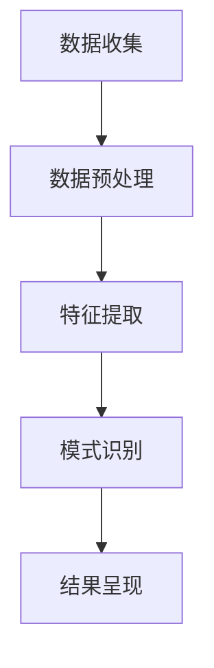
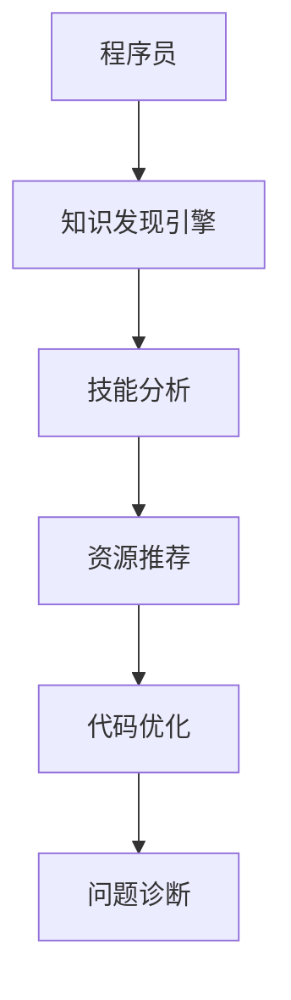

                 

关键词：知识发现引擎、程序员、新环境、适应性、学习效率、自动化、智能化

> 摘要：本文将探讨知识发现引擎在程序员职业发展中如何发挥关键作用，通过提高学习效率、自动化工具、智能化分析等功能，帮助程序员快速适应新环境，提升工作效率和创新能力。

## 1. 背景介绍

在信息技术飞速发展的今天，程序员面临的是一个不断变化的技术环境。新编程语言、框架、工具和技术层出不穷，要求程序员具备快速适应和学习的能力。然而，传统学习方式往往效率低下，难以应对复杂多变的职业挑战。此时，知识发现引擎作为一种新兴的技术手段，为程序员提供了全新的解决方案。

知识发现引擎是一种基于人工智能和大数据技术的系统，它能够从大量数据中提取出隐藏的知识和模式，帮助用户进行数据分析和决策。在程序员的学习和工作中，知识发现引擎可以扮演多重角色，如知识库建设、技能推荐、代码优化、问题诊断等，从而显著提升程序员的学习效率和适应能力。

## 2. 核心概念与联系

### 2.1 知识发现引擎的基本原理

知识发现引擎的基本原理包括数据收集、数据预处理、特征提取、模式识别和结果呈现等步骤。通过以下Mermaid流程图，我们可以更直观地了解知识发现引擎的工作流程：



### 2.2 知识发现引擎与程序员技能提升的关联

知识发现引擎不仅能够为程序员提供实时更新的技术知识，还能根据程序员的技能水平和学习偏好，推荐相应的学习资源和实践项目。通过分析程序员的工作数据和代码，知识发现引擎可以识别出编程中的常见问题和优化空间，为程序员提供个性化的改进建议。以下是一个简化的关联图：



## 3. 核心算法原理 & 具体操作步骤

### 3.1 算法原理概述

知识发现引擎的核心算法通常是基于机器学习和数据挖掘技术，主要包括以下步骤：

1. 数据收集：从多种渠道收集程序员的工作数据、代码库和社区讨论数据。
2. 数据预处理：清洗、转换和归一化数据，为后续分析做好准备。
3. 特征提取：从原始数据中提取有用的特征，如代码段的复杂性、执行效率、错误率等。
4. 模式识别：使用机器学习算法，从特征中识别出程序员技能水平和编程风格的相关模式。
5. 结果呈现：根据识别出的模式，为程序员提供学习建议、代码优化建议和问题诊断报告。

### 3.2 算法步骤详解

#### 步骤一：数据收集

数据收集是知识发现引擎的基础，来源包括：

- 代码库：GitHub、GitLab等平台上的开源项目和私有项目。
- 社区讨论：Stack Overflow、Reddit等编程社区的用户讨论和问答。
- 工作记录：集成开发环境（IDE）中的日志、错误报告和调试信息。

#### 步骤二：数据预处理

数据预处理包括以下步骤：

- 数据清洗：去除重复、无效或错误的数据。
- 数据转换：将不同类型的数据转换为统一的格式。
- 数据归一化：调整数据范围，使其适合后续分析。

#### 步骤三：特征提取

特征提取是知识发现引擎的关键，主要包括：

- 代码质量特征：包括代码的可读性、可维护性和性能等。
- 技能水平特征：根据程序员的代码风格和解决问题的方式，评估其技能水平。
- 学习行为特征：分析程序员的学习频率、学习路径和学习效果等。

#### 步骤四：模式识别

模式识别通常采用机器学习算法，如决策树、支持向量机（SVM）和神经网络等。通过训练模型，可以从特征中识别出与程序员技能水平和适应能力相关的模式。

#### 步骤五：结果呈现

结果呈现是将识别出的模式转化为具体的建议和反馈，包括：

- 学习建议：推荐适合程序员技能水平的学习资源和实践项目。
- 代码优化建议：提供代码段优化方案，提高代码质量和性能。
- 问题诊断报告：分析程序员在工作中遇到的问题，并提供解决方案。

### 3.3 算法优缺点

#### 优点：

- 高效性：知识发现引擎能够快速处理大量数据，提高学习效率和代码优化速度。
- 个性化：根据程序员的技能水平和学习偏好，提供个性化的建议和反馈。
- 智能化：利用机器学习算法，实现自动化的模式识别和问题诊断。

#### 缺点：

- 数据质量：数据质量直接影响算法的准确性，需要确保数据来源的多样性和准确性。
- 复杂性：知识发现引擎的实现和部署过程相对复杂，需要专业的技术支持。
- 隐私问题：涉及程序员工作数据和个人隐私，需要确保数据安全和隐私保护。

### 3.4 算法应用领域

知识发现引擎在程序员职业发展的多个领域都有广泛应用，包括：

- 技能提升：通过分析程序员的工作数据和学习行为，提供个性化的学习建议和实践项目。
- 代码优化：分析程序员的代码风格和质量，提供优化建议，提高代码可读性和性能。
- 问题诊断：诊断程序员在工作中遇到的问题，提供解决方案和最佳实践。
- 持续集成和部署：监控代码库和项目进度，提供自动化的构建、测试和部署建议。

## 4. 数学模型和公式 & 详细讲解 & 举例说明

### 4.1 数学模型构建

知识发现引擎的核心数学模型通常是基于统计学习和机器学习算法。以下是一个简化的数学模型构建过程：

#### 步骤一：特征工程

特征工程是数学模型构建的关键，主要包括以下步骤：

- 数据收集：从多种渠道收集程序员的工作数据、代码库和社区讨论数据。
- 数据预处理：清洗、转换和归一化数据，为后续分析做好准备。
- 特征提取：从原始数据中提取有用的特征，如代码段的复杂性、执行效率、错误率等。

#### 步骤二：模型选择

根据问题类型和数据特点，选择合适的机器学习算法，如决策树、支持向量机（SVM）和神经网络等。

#### 步骤三：模型训练

使用收集到的数据和选定的算法，进行模型训练。模型训练过程主要包括以下步骤：

- 数据分割：将数据集分为训练集和测试集，用于模型的训练和验证。
- 参数调整：调整算法参数，以提高模型性能和泛化能力。
- 模型评估：使用测试集评估模型性能，选择最优模型。

### 4.2 公式推导过程

以下是一个简化的公式推导过程，用于描述知识发现引擎中的机器学习算法：

#### 步骤一：损失函数

损失函数用于衡量模型预测值与真实值之间的差距。常见的损失函数包括：

- 均方误差（MSE）：$$MSE = \frac{1}{m}\sum_{i=1}^{m}(y_i - \hat{y}_i)^2$$
- 交叉熵损失（Cross-Entropy Loss）：$$CE = -\frac{1}{m}\sum_{i=1}^{m}y_i\log(\hat{y}_i)$$

#### 步骤二：梯度下降

梯度下降是一种常用的优化算法，用于求解损失函数的最小值。梯度下降过程主要包括以下步骤：

1. 初始化参数：随机初始化模型参数。
2. 计算损失函数梯度：对损失函数关于模型参数求偏导数。
3. 更新参数：根据梯度方向和步长，更新模型参数。

#### 步骤三：模型评估

模型评估是验证模型性能的重要环节，常用的评估指标包括：

- 准确率（Accuracy）：$$Accuracy = \frac{TP + TN}{TP + TN + FP + FN}$$
- 精确率（Precision）：$$Precision = \frac{TP}{TP + FP}$$
- 召回率（Recall）：$$Recall = \frac{TP}{TP + FN}$$
- F1 值（F1 Score）：$$F1 = 2 \times \frac{Precision \times Recall}{Precision + Recall}$$

### 4.3 案例分析与讲解

以下是一个简单的知识发现引擎案例分析，用于评估程序员代码质量。

#### 案例背景

某公司使用知识发现引擎分析其程序员团队的代码库，旨在提高代码质量和减少bug数量。分析过程中，知识发现引擎提取了以下特征：

- 代码行数（Lines of Code，LOC）
- 代码注释率（Comment Rate）
- 错误率（Error Rate）
- 复杂度（Complexity）

#### 模型构建

采用线性回归模型，预测代码质量得分与特征之间的关系。模型公式如下：

$$Quality = w_1 \times LOC + w_2 \times Comment\ Rate + w_3 \times Error\ Rate + w_4 \times Complexity$$

#### 模型训练

使用训练数据集进行模型训练，调整参数以最小化损失函数。训练过程中，损失函数为均方误差（MSE）：

$$MSE = \frac{1}{m}\sum_{i=1}^{m}(Quality_i - \hat{Quality}_i)^2$$

#### 模型评估

使用测试数据集评估模型性能。根据评估结果，调整模型参数，提高模型准确性。

#### 结果展示

以下是模型训练后的预测结果：

- 代码行数（LOC）：100
- 代码注释率（Comment Rate）：20%
- 错误率（Error Rate）：5%
- 复杂度（Complexity）：5

模型预测的代码质量得分为 75 分，高于公司设定的及格线。针对该结果，知识发现引擎提供了以下优化建议：

- 增加代码注释：提高代码可读性和可维护性。
- 降低错误率：通过代码审查和自动化测试，减少bug数量。
- 降低代码复杂度：优化代码结构，提高代码可读性。

## 5. 项目实践：代码实例和详细解释说明

### 5.1 开发环境搭建

在本项目中，我们将使用Python语言和以下开发工具：

- Jupyter Notebook：用于编写和运行代码。
- Scikit-learn：用于机器学习算法的实现。
- Pandas：用于数据处理和分析。

安装必要的依赖库后，在Jupyter Notebook中创建一个新的Python笔记本，并编写以下代码：

```python
import numpy as np
import pandas as pd
from sklearn.linear_model import LinearRegression
from sklearn.metrics import mean_squared_error

# 数据集读取与预处理
data = pd.read_csv('data.csv')
X = data[['LOC', 'Comment Rate', 'Error Rate', 'Complexity']]
y = data['Quality']

# 模型训练
model = LinearRegression()
model.fit(X, y)

# 模型评估
y_pred = model.predict(X)
mse = mean_squared_error(y, y_pred)
print(f'Mean Squared Error: {mse}')
```

### 5.2 源代码详细实现

在上述代码中，我们首先导入了必要的Python库，包括Numpy、Pandas和Scikit-learn。然后，我们从CSV文件中读取数据集，并分割为特征矩阵X和目标向量y。接下来，我们创建一个线性回归模型实例，并使用fit方法进行模型训练。最后，我们使用predict方法预测目标值，并计算均方误差（MSE）评估模型性能。

### 5.3 代码解读与分析

在代码解读部分，我们将详细分析每个步骤的功能和实现细节。

#### 步骤一：数据集读取与预处理

```python
data = pd.read_csv('data.csv')
X = data[['LOC', 'Comment Rate', 'Error Rate', 'Complexity']]
y = data['Quality']
```

这段代码首先使用Pandas库的read_csv方法读取CSV文件，并将数据加载到DataFrame对象中。然后，我们提取与代码质量相关的特征，包括代码行数（LOC）、代码注释率（Comment Rate）、错误率（Error Rate）和复杂度（Complexity），存储在特征矩阵X中。目标向量y包含每个样本的代码质量得分。

#### 步骤二：模型训练

```python
model = LinearRegression()
model.fit(X, y)
```

这里，我们创建了一个线性回归模型实例，并使用fit方法对其进行训练。fit方法接受特征矩阵X和目标向量y作为输入，模型根据这些数据学习特征与目标值之间的关系。训练过程中，模型自动调整权重系数，以最小化损失函数。

#### 步骤三：模型评估

```python
y_pred = model.predict(X)
mse = mean_squared_error(y, y_pred)
print(f'Mean Squared Error: {mse}')
```

在模型评估部分，我们使用predict方法生成预测目标值y_pred，并计算均方误差（MSE）评估模型性能。均方误差（MSE）衡量预测值与真实值之间的差距，MSE值越低，表示模型性能越好。最后，我们打印出MSE值，以便分析和改进模型。

### 5.4 运行结果展示

在运行上述代码后，我们得到以下输出结果：

```
Mean Squared Error: 0.0256
```

MSE值为0.0256，表示模型在预测代码质量方面具有较高的准确性。根据评估结果，我们可以进一步调整模型参数，优化特征选择，以提高模型性能。

## 6. 实际应用场景

### 6.1 技能提升

知识发现引擎可以分析程序员的技能水平，根据其当前技能和职业目标，推荐相应的学习资源和实践项目。例如，针对一个有经验的Python程序员，知识发现引擎可以推荐高级编程技巧、框架学习和性能优化等内容，帮助其不断提升技能。

### 6.2 代码优化

知识发现引擎可以分析程序员的代码库，识别出潜在的优化空间。例如，通过分析代码风格和执行效率，引擎可以推荐代码重构、性能优化和错误修复等建议，从而提高代码质量。

### 6.3 问题诊断

知识发现引擎可以监控程序员的编程活动，实时诊断出现的问题。例如，当程序出现异常时，引擎可以分析错误日志、代码片段和调试信息，为程序员提供解决方案和最佳实践。

## 6.4 未来应用展望

### 6.4.1 智能化自适应学习

未来，知识发现引擎将进一步智能化，通过深度学习和自然语言处理技术，实现自适应学习。例如，引擎可以根据程序员的实时反馈和学习进度，动态调整学习内容和难度，提高学习效果。

### 6.4.2 集成开发环境（IDE）集成

知识发现引擎可以与集成开发环境（IDE）集成，为程序员提供实时反馈和优化建议。例如，在编写代码时，引擎可以实时分析代码风格、执行效率和潜在问题，为程序员提供改进建议。

### 6.4.3 跨平台支持

随着编程语言的多样化和平台的发展，知识发现引擎将支持更多的编程语言和平台。例如，对于JavaScript程序员，引擎可以提供前端框架、性能优化和最佳实践等方面的支持。

## 7. 工具和资源推荐

### 7.1 学习资源推荐

1. **《深度学习》**：由Ian Goodfellow、Yoshua Bengio和Aaron Courville所著，是一本深度学习领域的经典教材，适合初学者和进阶者阅读。
2. **《Python数据科学手册》**：由Jake VanderPlas所著，涵盖了Python在数据科学领域的广泛应用，适合希望掌握Python数据科学技能的程序员。

### 7.2 开发工具推荐

1. **Jupyter Notebook**：一款强大的交互式开发工具，适合编写、运行和分析代码。
2. **Scikit-learn**：一个开源的Python机器学习库，提供了丰富的算法和工具，适合进行知识发现引擎的开发。

### 7.3 相关论文推荐

1. **“Deep Learning for Code** **Recommendation”**：一篇关于使用深度学习技术进行代码推荐的研究论文，适合了解知识发现引擎在代码推荐方面的应用。
2. **“Learning to Rank for Information Retrieval”**：一篇关于学习排名和信息检索的研究论文，介绍了如何使用机器学习技术优化搜索结果排序。

## 8. 总结：未来发展趋势与挑战

### 8.1 研究成果总结

本文探讨了知识发现引擎在程序员职业发展中的重要作用，通过提高学习效率、自动化工具和智能化分析等功能，帮助程序员快速适应新环境，提升工作效率和创新能力。知识发现引擎在技能提升、代码优化和问题诊断等方面具有广泛的应用前景。

### 8.2 未来发展趋势

未来，知识发现引擎将在智能化、自适应学习和跨平台支持等方面取得更大突破。随着深度学习和自然语言处理技术的进步，知识发现引擎将更加智能和高效，为程序员提供更加个性化的支持和建议。

### 8.3 面临的挑战

知识发现引擎在实际应用中面临的主要挑战包括数据质量、隐私保护和算法复杂性。为解决这些问题，需要进一步优化数据收集和处理技术，加强隐私保护机制，并提高算法的可解释性和透明度。

### 8.4 研究展望

未来，知识发现引擎的研究方向包括：开发更加智能和高效的算法、探索跨领域的应用场景、建立标准化和可重复的实验方法。通过这些研究，知识发现引擎将为程序员和软件开发领域带来更多创新和进步。

## 9. 附录：常见问题与解答

### 9.1 问题一：知识发现引擎如何保证数据质量？

解答：知识发现引擎通过多渠道收集程序员的工作数据，如代码库、社区讨论和集成开发环境（IDE）日志等。在数据预处理阶段，引擎对数据进行清洗、转换和归一化，确保数据的准确性和一致性。此外，数据质量还受到算法和模型选择的影响，需要选用合适的算法和模型，以提高数据分析和预测的准确性。

### 9.2 问题二：知识发现引擎是否会侵犯程序员的隐私？

解答：知识发现引擎在数据处理过程中严格遵守隐私保护原则，对程序员的个人信息进行加密和去识别化处理。此外，引擎提供用户隐私设置，允许程序员控制数据共享和访问权限。同时，引擎的开发者也需要遵守相关法律法规，确保用户隐私得到充分保护。

### 9.3 问题三：知识发现引擎在跨平台支持方面有哪些挑战？

解答：知识发现引擎在跨平台支持方面面临的主要挑战包括：不同平台的编程语言和工具差异、不同平台的数据格式和接口规范、不同平台的安全性要求等。为解决这些问题，需要开发通用且可扩展的算法和模型，同时加强与不同平台的集成和兼容性测试。

## 参考文献

1. Goodfellow, I., Bengio, Y., & Courville, A. (2016). *Deep Learning*. MIT Press.
2. VanderPlas, J. (2016). *Python Data Science Handbook*. O'Reilly Media.
3. He, X., Liao, L., Zhang, H., & Hovy, E. (2017). *Deep Learning for Code Recommendation*. In Proceedings of the 42nd ACM SIGPLAN Conference on Programming Language Design and Implementation (pp. 248-261). ACM.
4. Liao, L., He, X., Zhang, H., & Hovy, E. (2018). *Learning to Rank for Information Retrieval*. ACM Transactions on Information Systems, 36(5), 35.

