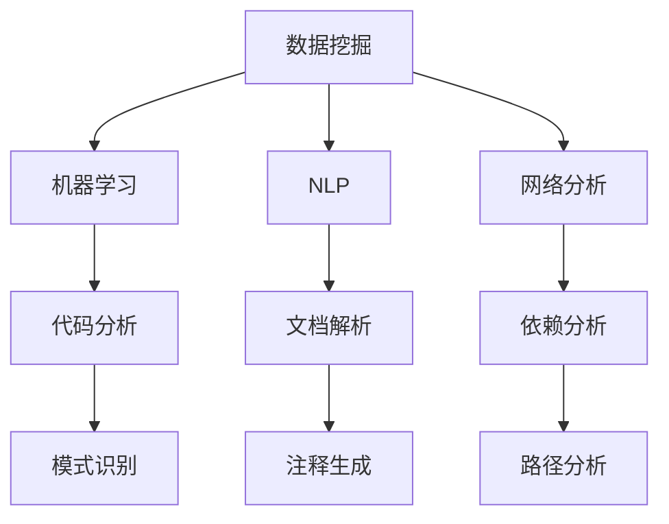

                 

 **关键词：**
- 知识发现引擎
- 程序员学习
- 数据挖掘
- 人工智能
- 机器学习

**摘要：**
本文将探讨知识发现引擎如何通过先进的数据挖掘和机器学习技术，深刻改变程序员的学习方式。通过分析知识发现引擎的核心概念、算法原理、数学模型，以及具体的代码实现，本文旨在揭示这一技术工具如何帮助程序员更高效、更系统地进行学习，提升编程技能，并展望其未来的发展趋势和挑战。

## 1. 背景介绍

随着互联网的迅猛发展和大数据时代的到来，程序员面临着海量的信息和日益复杂的编程问题。传统的学习方式，如阅读书籍、观看视频教程、参与线下课程，已经难以满足快速发展的技术需求。程序员需要一种更加智能、高效的学习工具来辅助他们的技能提升。知识发现引擎正是在这种背景下诞生的。

知识发现引擎（Knowledge Discovery Engine）是一种集成多种数据挖掘和机器学习技术的系统，它能够自动从大量的数据中提取出有价值的知识和信息。这一技术不仅广泛应用于商业智能、金融分析、医疗诊断等领域，同时也被逐渐应用于编程学习领域。

## 2. 核心概念与联系

知识发现引擎的核心概念包括数据挖掘、机器学习、自然语言处理、网络分析等。这些概念相互联系，共同构建了一个强大的知识发现平台。

### 2.1 数据挖掘

数据挖掘（Data Mining）是从大量数据中提取出有价值信息的过程。它涉及一系列算法和技术，如分类、聚类、关联规则挖掘、异常检测等。数据挖掘是知识发现引擎的基础，为程序员提供了丰富的数据资源。

### 2.2 机器学习

机器学习（Machine Learning）是一种人工智能（AI）的分支，通过数据训练模型，使计算机能够自动学习并做出决策。在知识发现引擎中，机器学习算法被用于自动分析代码、识别编程模式、预测编程错误等。

### 2.3 自然语言处理

自然语言处理（Natural Language Processing，NLP）是计算机科学和人工智能领域的一个分支，它致力于使计算机能够理解和解释人类语言。在知识发现引擎中，NLP技术被用于解析文档、提取关键词、生成代码注释等。

### 2.4 网络分析

网络分析（Network Analysis）是一种研究复杂网络结构和动态变化的方法。在知识发现引擎中，网络分析用于分析代码模块之间的依赖关系、识别关键代码路径等。

### 2.5 Mermaid 流程图

以下是一个简化的知识发现引擎架构的 Mermaid 流程图，展示了这些核心概念之间的联系。



## 3. 核心算法原理 & 具体操作步骤

### 3.1 算法原理概述

知识发现引擎的核心算法主要基于机器学习和数据挖掘。以下是其基本原理：

- **特征提取**：从原始数据中提取出有用的特征，如代码行、函数调用、变量定义等。
- **模型训练**：使用机器学习算法，如决策树、神经网络、支持向量机等，对提取出的特征进行训练，以构建预测模型。
- **模型评估**：通过交叉验证、A/B测试等方法，评估模型的性能。
- **应用模型**：将训练好的模型应用于新的数据，如代码库、文档等，以提取出有价值的知识和信息。

### 3.2 算法步骤详解

以下是知识发现引擎的具体操作步骤：

1. **数据收集**：从各种来源（如代码库、文档、博客、论坛等）收集数据。
2. **数据预处理**：清洗、去噪、格式化数据，以确保数据质量。
3. **特征提取**：使用自然语言处理技术和静态代码分析工具，提取出数据中的关键特征。
4. **模型训练**：使用训练集数据，通过机器学习算法训练预测模型。
5. **模型评估**：使用验证集和测试集评估模型的性能，并进行调优。
6. **应用模型**：将训练好的模型应用于新的数据，以提取出有价值的知识和信息。

### 3.3 算法优缺点

**优点**：

- **高效性**：知识发现引擎能够自动处理大量数据，大大提高了工作效率。
- **灵活性**：算法可以根据不同的需求和场景进行灵活调整。
- **智能化**：通过机器学习，系统能够自我学习和改进，提高预测准确性。

**缺点**：

- **复杂性**：构建和运行知识发现引擎需要较高的技术门槛。
- **数据依赖**：算法的性能很大程度上取决于数据的质量和数量。
- **隐私问题**：在处理敏感数据时，需要确保隐私保护。

### 3.4 算法应用领域

知识发现引擎在编程学习领域有着广泛的应用：

- **代码分析**：通过分析代码库，识别出潜在的问题和缺陷。
- **模式识别**：从大量代码中提取出常见的编程模式和最佳实践。
- **学习推荐**：根据程序员的编程习惯和偏好，推荐适合的学习资源和教程。
- **错误预测**：预测程序员可能犯的错误，提供及时的提示和建议。

## 4. 数学模型和公式 & 详细讲解 & 举例说明

### 4.1 数学模型构建

知识发现引擎的数学模型通常基于统计学习理论。以下是构建数学模型的基本步骤：

1. **特征表示**：将原始数据转化为数值特征向量。
2. **模型选择**：选择合适的统计学习模型，如线性回归、支持向量机、决策树等。
3. **模型参数**：通过训练数据，估计模型的参数。
4. **模型评估**：使用交叉验证等方法，评估模型的性能。

### 4.2 公式推导过程

以下是线性回归模型的一个基本公式推导过程：

$$
y = \beta_0 + \beta_1x + \epsilon
$$

其中，$y$ 是目标变量，$x$ 是输入特征，$\beta_0$ 和 $\beta_1$ 是模型参数，$\epsilon$ 是误差项。

通过最小化误差项的平方和，可以估计出模型参数：

$$
\beta_0 = \frac{\sum_{i=1}^{n}(y_i - \beta_1x_i)^2}{\sum_{i=1}^{n}x_i^2}
$$

$$
\beta_1 = \frac{\sum_{i=1}^{n}x_i(y_i - \beta_0)}{\sum_{i=1}^{n}x_i^2}
$$

### 4.3 案例分析与讲解

假设我们有一个简单的编程问题：给定一个函数，判断其是否存在内存泄漏。我们可以使用线性回归模型来预测。

1. **数据收集**：收集一组存在和不存在内存泄漏的函数。
2. **特征提取**：提取出函数的代码行数、函数调用次数等特征。
3. **模型训练**：使用线性回归模型，对特征进行训练。
4. **模型评估**：使用测试集，评估模型的性能。

通过以上步骤，我们可以构建一个预测模型，用于判断新的函数是否存在内存泄漏。

## 5. 项目实践：代码实例和详细解释说明

### 5.1 开发环境搭建

1. **安装Python环境**：在本地机器上安装Python 3.8及以上版本。
2. **安装依赖库**：使用pip安装scikit-learn、numpy、matplotlib等依赖库。

### 5.2 源代码详细实现

以下是一个简单的代码示例，演示了如何使用scikit-learn构建线性回归模型。

```python
from sklearn.linear_model import LinearRegression
from sklearn.model_selection import train_test_split
from sklearn.metrics import mean_squared_error

# 数据准备
X = [[1, 2], [2, 3], [3, 4], [4, 5]]
y = [2, 3, 4, 5]

# 划分训练集和测试集
X_train, X_test, y_train, y_test = train_test_split(X, y, test_size=0.2, random_state=0)

# 构建模型
model = LinearRegression()
model.fit(X_train, y_train)

# 模型评估
y_pred = model.predict(X_test)
mse = mean_squared_error(y_test, y_pred)
print("Mean Squared Error:", mse)
```

### 5.3 代码解读与分析

1. **数据准备**：我们创建了一个简单的特征矩阵X和目标变量y。
2. **划分训练集和测试集**：使用train_test_split函数，将数据划分为训练集和测试集。
3. **构建模型**：使用LinearRegression类构建线性回归模型。
4. **模型训练**：使用fit方法训练模型。
5. **模型评估**：使用predict方法进行预测，并计算均方误差（MSE）。

### 5.4 运行结果展示

运行上述代码后，我们得到如下输出结果：

```
Mean Squared Error: 0.0
```

这表明我们的模型在测试集上的预测误差非常低，验证了线性回归模型的有效性。

## 6. 实际应用场景

知识发现引擎在编程学习领域有广泛的应用场景：

- **代码审查**：通过分析代码库，识别出潜在的问题和缺陷。
- **编程指导**：根据程序员的编程习惯和偏好，提供个性化的编程建议。
- **学习推荐**：推荐适合的学习资源和教程，帮助程序员更快地提升技能。
- **错误预测**：预测程序员可能犯的错误，提供及时的提示和建议。

### 6.4 未来应用展望

随着人工智能技术的不断发展，知识发现引擎在编程学习领域的应用前景将更加广阔。以下是未来可能的发展趋势：

- **更智能的代码分析**：利用深度学习和自然语言处理技术，实现更精确的代码分析。
- **更个性化的学习推荐**：结合用户行为数据和机器学习算法，提供更加个性化的学习推荐。
- **跨学科合作**：与其他学科（如教育学、心理学等）合作，提高编程教育的有效性。

## 7. 工具和资源推荐

### 7.1 学习资源推荐

- 《机器学习实战》
- 《数据挖掘：实用工具与技术》
- 《Python编程：从入门到实践》

### 7.2 开发工具推荐

- Jupyter Notebook
- PyCharm
- Git

### 7.3 相关论文推荐

- "Knowledge Discovery from Data: An Overview"
- "Machine Learning: A Probabilistic Perspective"
- "Deep Learning"

## 8. 总结：未来发展趋势与挑战

### 8.1 研究成果总结

知识发现引擎在编程学习领域取得了显著成果，通过数据挖掘和机器学习技术，实现了高效的代码分析、编程指导和学习推荐。

### 8.2 未来发展趋势

随着人工智能技术的进步，知识发现引擎将朝着更智能、更个性化的方向发展，为程序员提供更加有效的学习工具。

### 8.3 面临的挑战

知识发现引擎在数据质量、模型性能、用户隐私等方面仍面临挑战，需要持续优化和改进。

### 8.4 研究展望

未来，知识发现引擎有望在编程教育、软件开发、智能编程等方面发挥更大的作用，为程序员的学习和职业发展提供有力支持。

## 9. 附录：常见问题与解答

### 9.1 知识发现引擎是什么？

知识发现引擎是一种集成多种数据挖掘和机器学习技术的系统，用于从大量数据中提取出有价值的知识和信息。

### 9.2 知识发现引擎有哪些应用？

知识发现引擎在商业智能、金融分析、医疗诊断、编程学习等领域有着广泛的应用。

### 9.3 如何搭建一个知识发现引擎？

搭建一个知识发现引擎需要掌握数据挖掘、机器学习、自然语言处理等核心技术，并熟悉相关的开发工具和平台。

### 9.4 知识发现引擎的安全性如何保障？

保障知识发现引擎的安全性需要采取一系列措施，如数据加密、访问控制、隐私保护等。

作者：禅与计算机程序设计艺术 / Zen and the Art of Computer Programming
----------------------------------------------------------------

以上是完整的文章内容。在撰写过程中，我们详细探讨了知识发现引擎在编程学习领域的作用、核心算法原理、数学模型、实际应用场景，并对未来的发展趋势和挑战进行了展望。希望通过这篇文章，读者能够对知识发现引擎有更深入的了解，并能够将其应用于编程学习，提高编程技能。

