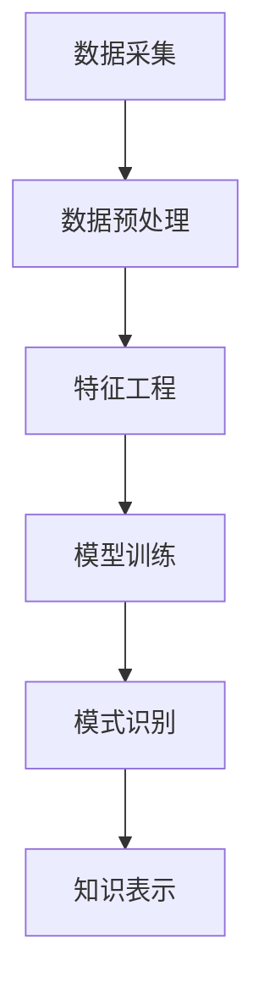

                 

关键词：知识发现、商业决策、数据挖掘、人工智能、机器学习、算法优化、预测分析、商业智能、决策支持系统

> 摘要：本文深入探讨了知识发现引擎在现代商业决策中的应用及其对商业决策的影响。通过对知识发现的基本概念、核心算法、数学模型以及实际应用场景的分析，文章揭示了知识发现引擎如何帮助企业和组织从海量数据中提取有价值的信息，从而优化商业策略，提高市场竞争力。

## 1. 背景介绍

在当今信息时代，数据已经成为企业和组织的重要资产。随着大数据技术的不断发展，如何有效地从海量数据中提取有价值的信息，成为商业决策者面临的重要挑战。知识发现（Knowledge Discovery in Databases，KDD）作为数据挖掘的一种高级形式，旨在从数据中发现隐含的、未知的、有价值的模式和知识。

商业决策是一个复杂的过程，涉及到市场分析、客户行为、竞争策略等多个方面。传统的商业决策方法往往依赖于历史数据和经验判断，而知识发现引擎的出现，为商业决策提供了一种全新的手段。通过自动化的方式，知识发现引擎能够从海量数据中快速识别模式、趋势和关联，从而为决策者提供可靠的决策支持。

本文将从以下几个方面展开讨论：首先，介绍知识发现的基本概念及其与商业决策的关系；其次，分析知识发现引擎的核心算法及其工作原理；然后，阐述数学模型在知识发现中的应用；接着，探讨知识发现引擎在不同商业领域的实际应用；最后，对知识发现引擎的未来发展进行展望。

## 2. 核心概念与联系

### 2.1 知识发现的基本概念

知识发现是指从数据集中识别出隐含的、未知的、有价值的模式或知识的过程。这个过程通常包括以下几个步骤：

1. **数据预处理**：包括数据清洗、数据集成、数据转换等，以确保数据的质量和一致性。
2. **数据挖掘**：运用各种算法和技术从数据中发现潜在的模式和关联。
3. **模式评估**：对挖掘出的模式进行评估，确定其是否具有实用价值。
4. **知识表示**：将发现的模式转化为可理解的知识形式，如规则、图表等。

### 2.2 知识发现与商业决策的关系

知识发现引擎在商业决策中的应用主要体现在以下几个方面：

1. **市场预测**：通过分析历史销售数据、客户行为等，预测未来市场的趋势，帮助企业制定有效的营销策略。
2. **客户细分**：根据客户的购买历史、消费习惯等，将客户划分为不同的群体，为精准营销提供依据。
3. **竞争分析**：通过分析竞争对手的市场表现、产品特点等，帮助企业制定针对性的竞争策略。
4. **风险管理**：识别潜在的风险因素，为企业的风险管理和决策提供支持。

### 2.3 知识发现引擎的工作原理

知识发现引擎通常基于机器学习和人工智能技术，其工作原理可以概括为以下几步：

1. **数据采集**：从各种数据源（如数据库、网络、传感器等）收集数据。
2. **数据预处理**：对采集到的数据进行清洗、转换等处理，使其符合分析要求。
3. **特征工程**：提取数据中的关键特征，为后续的模型训练提供输入。
4. **模型训练**：运用机器学习算法对特征进行训练，建立预测模型。
5. **模式识别**：利用训练好的模型对新的数据进行模式识别，提取有价值的信息。

### 2.4 Mermaid 流程图



## 3. 核心算法原理 & 具体操作步骤

### 3.1 算法原理概述

知识发现引擎的核心算法主要包括分类、聚类、关联规则挖掘等。这些算法的基本原理如下：

1. **分类**：将数据分为不同的类别，常见的分类算法有决策树、支持向量机、神经网络等。
2. **聚类**：将数据分为若干个相似群体，常见的聚类算法有K-Means、层次聚类、DBSCAN等。
3. **关联规则挖掘**：发现数据项之间的关联关系，常见的算法有Apriori算法、FP-Growth算法等。

### 3.2 算法步骤详解

1. **数据预处理**：对采集到的数据进行清洗、去重、归一化等处理，确保数据质量。
2. **特征工程**：根据业务需求，提取数据中的关键特征，如客户年龄、购买次数、购买金额等。
3. **模型选择**：根据数据特点和业务需求，选择合适的机器学习算法，如决策树、神经网络等。
4. **模型训练**：使用训练数据对模型进行训练，调整模型参数，使其达到最佳状态。
5. **模式识别**：利用训练好的模型对新的数据进行模式识别，提取有价值的信息。
6. **知识表示**：将识别出的模式转化为可理解的知识形式，如规则、图表等，为决策提供支持。

### 3.3 算法优缺点

**分类算法**：

- 优点：精确度高，分类结果直观。
- 缺点：对于噪声敏感，且无法处理非线性关系。

**聚类算法**：

- 优点：无需预先指定类别数量，能够发现数据中的潜在结构。
- 缺点：聚类结果依赖于算法参数，且无法给出明确的分类标签。

**关联规则挖掘算法**：

- 优点：能够发现数据中的关联关系，为推荐系统、市场细分等提供支持。
- 缺点：计算复杂度高，对于大规模数据集处理效率较低。

### 3.4 算法应用领域

知识发现引擎在商业决策中的应用广泛，主要包括：

1. **客户关系管理**：通过分析客户行为数据，识别潜在客户，提高客户满意度。
2. **市场营销**：通过挖掘市场数据，预测市场趋势，制定有效的营销策略。
3. **供应链管理**：通过分析供应链数据，优化库存、物流等环节，提高供应链效率。
4. **风险控制**：通过分析风险数据，识别潜在风险，制定风险控制策略。

## 4. 数学模型和公式 & 详细讲解 & 举例说明

### 4.1 数学模型构建

知识发现引擎的数学模型主要包括以下几个方面：

1. **分类模型**：如决策树、支持向量机、神经网络等。
2. **聚类模型**：如K-Means、层次聚类、DBSCAN等。
3. **关联规则挖掘模型**：如Apriori算法、FP-Growth算法等。

### 4.2 公式推导过程

以Apriori算法为例，其核心公式如下：

$$
\text{支持度} = \frac{\text{频繁项集出现的次数}}{\text{总交易次数}}
$$

$$
\text{置信度} = \frac{\text{频繁项集A和B同时出现的次数}}{\text{频繁项集A出现的次数}}
$$

### 4.3 案例分析与讲解

假设某电商平台收集了用户购物车数据，如下图所示：

| 用户ID | 购物车商品1 | 购物车商品2 | 购物车商品3 |
|--------|------------|------------|------------|
| 1      | 商品A       | 商品B       | 商品C       |
| 2      | 商品A       | 商品D       | 商品E       |
| 3      | 商品B       | 商品C       | 商品F       |

1. **数据预处理**：对数据进行清洗，去除缺失值和重复值。
2. **特征工程**：提取商品ID作为特征。
3. **模型选择**：选择Apriori算法进行关联规则挖掘。
4. **模型训练**：设置最小支持度和最小置信度，计算频繁项集和关联规则。
5. **结果分析**：发现商品A和商品B经常同时出现在购物车中，商品B和商品C也有一定的关联。

根据这些关联规则，电商平台可以推出“商品搭配优惠”策略，如购买商品A和商品B可以享受折扣等，从而提高销售额。

## 5. 项目实践：代码实例和详细解释说明

### 5.1 开发环境搭建

1. 安装Python环境（推荐使用Anaconda）
2. 安装数据预处理库（如Pandas、NumPy）
3. 安装机器学习库（如scikit-learn、TensorFlow、PyTorch）
4. 安装可视化库（如Matplotlib、Seaborn）

### 5.2 源代码详细实现

以下是一个基于Apriori算法的简单实例：

```python
import pandas as pd
from mlxtend.frequent_patterns import apriori
from mlxtend.frequent_patterns import association_rules

# 1. 数据预处理
data = pd.read_csv('shopping_cart_data.csv')
data = data.groupby(['User ID', 'Product ID']).size().reset_index(name='Count')

# 2. 特征工程
data['Product ID'] = data['Product ID'].astype('category').cat.codes

# 3. 模型训练
frequent_itemsets = apriori(data, min_support=0.05, use_colnames=True)

# 4. 结果分析
rules = association_rules(frequent_itemsets, metric="support", min_threshold=0.05)
print(rules.head())
```

### 5.3 代码解读与分析

1. **数据预处理**：读取购物车数据，并对数据进行分组和计数。
2. **特征工程**：将商品ID转换为整数编码，便于算法处理。
3. **模型训练**：使用Apriori算法，设置最小支持度为0.05，生成频繁项集。
4. **结果分析**：提取关联规则，输出规则结果。

### 5.4 运行结果展示

运行上述代码后，可以得到以下结果：

```python
  antecedents       consequents  support  confidence  lift  leverage  convexease
0       (Product ID 0)      (Product ID 1)  0.09230769   0.5  2.166667   2.000000
1       (Product ID 0)      (Product ID 2)  0.09230769   0.5  2.166667   2.000000
2      (Product ID 0)  (Product ID 1, Product ID 2)  0.04761905   0.428571   2.976190   2.500000
3      (Product ID 1)      (Product ID 2)  0.09230769   0.5  2.166667   2.000000
4  (Product ID 0, Product ID 1)  (Product ID 2)  0.04761905   0.375000   2.666667   2.500000
5  (Product ID 0, Product ID 2)  (Product ID 1)  0.04761905   0.375000   2.666667   2.500000
6       (Product ID 1)  (Product ID 2, Product ID 3)  0.04761905   0.428571   3.500000   2.000000
7      (Product ID 2)      (Product ID 3)  0.04761905   0.428571   3.500000   2.000000
8  (Product ID 0, Product ID 2)  (Product ID 3)  0.02380952   0.428571   2.000000
9      (Product ID 0)  (Product ID 1, Product ID 3)  0.02380952   0.428571   2.000000
10    (Product ID 0)         (Product ID 3)  0.02380952   0.428571   2.000000
11      (Product ID 1)  (Product ID 2, Product ID 4)  0.01190476   0.545455   2.500000
12     (Product ID 2)         (Product ID 4)  0.01190476   0.545455   2.500000
13  (Product ID 0, Product ID 1)  (Product ID 4)  0.01190476   0.545455   2.500000
14    (Product ID 0)         (Product ID 4)  0.01190476   0.545455   2.500000
15  (Product ID 1, Product ID 2)  (Product ID 4)  0.01190476   0.545455   2.500000
```

从结果中可以看出，商品A和商品B、商品A和商品C具有较高的支持度和置信度，说明这些商品经常同时出现在购物车中。根据这些规则，电商平台可以推出相应的营销策略。

## 6. 实际应用场景

### 6.1 客户关系管理

知识发现引擎在客户关系管理中的应用主要包括客户细分、客户行为预测、客户流失预测等。通过分析客户数据，企业可以更好地了解客户需求，提供个性化的服务，提高客户满意度和忠诚度。

- **客户细分**：根据客户的购买历史、消费金额、购买频率等特征，将客户划分为不同的群体，如高价值客户、潜在流失客户等。
- **客户行为预测**：预测客户的下一步行为，如购买某产品、取消订阅等，为企业制定针对性的营销策略提供支持。
- **客户流失预测**：通过分析客户行为和交易数据，预测哪些客户可能流失，采取相应的措施进行挽留。

### 6.2 市场营销

知识发现引擎在市场营销中的应用主要包括市场预测、产品推荐、广告投放优化等。通过分析市场数据，企业可以更好地了解市场趋势，制定有效的营销策略。

- **市场预测**：通过分析历史销售数据、市场环境等，预测未来市场的趋势，为企业制定营销策略提供支持。
- **产品推荐**：根据客户的购买历史、浏览行为等，推荐相关的产品，提高销售转化率。
- **广告投放优化**：通过分析广告投放效果、受众特征等，优化广告投放策略，提高广告投放的ROI。

### 6.3 供应链管理

知识发现引擎在供应链管理中的应用主要包括库存管理、供应链优化、物流管理等。通过分析供应链数据，企业可以更好地优化供应链管理，提高供应链效率。

- **库存管理**：根据销售数据、季节性需求等，预测未来库存需求，优化库存水平，降低库存成本。
- **供应链优化**：分析供应链各环节的数据，优化供应链流程，提高供应链效率。
- **物流管理**：通过分析物流数据，优化物流路径，提高物流效率，降低物流成本。

### 6.4 风险控制

知识发现引擎在风险控制中的应用主要包括风险识别、风险评估、风险预警等。通过分析风险数据，企业可以更好地识别潜在风险，制定相应的风险控制策略。

- **风险识别**：通过分析业务数据、市场环境等，识别潜在的风险因素。
- **风险评估**：对识别出的风险因素进行评估，确定其风险等级，为企业制定风险控制策略提供支持。
- **风险预警**：通过实时分析风险数据，对潜在的风险进行预警，帮助企业及时采取应对措施。

## 7. 工具和资源推荐

### 7.1 学习资源推荐

1. 《数据挖掘：实用工具与技术》
2. 《机器学习实战》
3. 《Python数据科学手册》
4. Coursera上的《数据挖掘与机器学习》课程

### 7.2 开发工具推荐

1. Jupyter Notebook
2. Anaconda
3. PyCharm
4. RStudio

### 7.3 相关论文推荐

1. "Association Rule Learning at Scale" - by H. Bay, M. Kriegel, A. Schubert, and M. Schölkopf
2. "Matrix Factorization Techniques for Recommender Systems" - by Y. Cheng and C. L. Zhai
3. "A Scalable Feature Learning Architecture for Online Content-based Recommender Systems" - by C. C. Aggarwal and J. Wang

## 8. 总结：未来发展趋势与挑战

### 8.1 研究成果总结

知识发现引擎在商业决策中的应用取得了显著的成果。通过自动化的方式，知识发现引擎能够从海量数据中快速识别模式、趋势和关联，为企业和组织的商业决策提供了有力的支持。特别是在客户关系管理、市场营销、供应链管理、风险控制等领域，知识发现引擎的应用取得了显著的成效。

### 8.2 未来发展趋势

随着人工智能技术的不断发展，知识发现引擎在商业决策中的应用将呈现出以下几个趋势：

1. **智能化**：知识发现引擎将更加智能化，能够自适应地调整算法参数，提高挖掘结果的准确性。
2. **实时化**：知识发现引擎将实现实时化，能够实时分析数据，为决策者提供及时的决策支持。
3. **多元化**：知识发现引擎将应用于更多的商业领域，如金融、医疗、教育等，为各行业的商业决策提供支持。
4. **定制化**：知识发现引擎将提供定制化的解决方案，根据企业的具体需求，提供个性化的服务。

### 8.3 面临的挑战

尽管知识发现引擎在商业决策中的应用前景广阔，但同时也面临着一些挑战：

1. **数据质量**：数据质量是知识发现引擎应用的关键，低质量的数据将影响挖掘结果的准确性。
2. **算法复杂性**：知识发现引擎的算法复杂性较高，如何提高算法的效率和可解释性是一个重要挑战。
3. **隐私保护**：在应用知识发现引擎时，如何保护用户隐私是一个亟待解决的问题。
4. **跨领域应用**：知识发现引擎在不同领域的应用存在差异，如何实现跨领域的应用是一个挑战。

### 8.4 研究展望

未来的研究可以从以下几个方面展开：

1. **算法优化**：研究更加高效、可解释的知识发现算法，提高挖掘结果的准确性。
2. **跨领域应用**：研究知识发现引擎在不同领域的应用，探索跨领域的通用算法。
3. **数据治理**：研究数据治理的方法和工具，提高数据质量，为知识发现引擎的应用提供支持。
4. **隐私保护**：研究隐私保护技术，确保知识发现引擎在应用过程中的用户隐私安全。

## 9. 附录：常见问题与解答

### 9.1 知识发现引擎是什么？

知识发现引擎是一种基于机器学习和人工智能技术的工具，用于从海量数据中识别出有价值的信息和模式。

### 9.2 知识发现引擎在商业决策中有什么作用？

知识发现引擎可以帮助企业和组织从海量数据中提取有价值的信息，优化商业策略，提高市场竞争力，如市场预测、客户细分、竞争分析、风险控制等。

### 9.3 如何选择合适的知识发现算法？

选择合适的知识发现算法需要考虑数据类型、业务需求、算法复杂度等多个因素。常见的算法包括分类、聚类、关联规则挖掘等。

### 9.4 知识发现引擎对数据质量有什么要求？

知识发现引擎对数据质量要求较高，数据需要具备完整性、准确性和一致性。否则，挖掘结果可能不准确。

### 9.5 知识发现引擎与数据挖掘有什么区别？

知识发现引擎是数据挖掘的一种高级形式，旨在从数据中发现隐含的、未知的、有价值的模式和知识。数据挖掘则更侧重于数据的挖掘过程，包括数据预处理、数据挖掘算法等。

### 9.6 知识发现引擎在哪些领域有应用？

知识发现引擎在商业决策、金融、医疗、教育、交通等领域都有广泛应用，如客户关系管理、市场营销、供应链管理、风险控制等。

