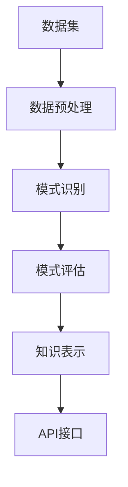

                 

本文将探讨知识发现引擎的API设计与开发，这是现代数据驱动应用和智能系统中的重要一环。通过详细的分析和讨论，我们将揭示API设计的原则、知识发现引擎的核心算法、数学模型以及其在实际项目中的应用。

## 关键词

- 知识发现引擎
- API设计
- 数据挖掘
- 算法实现
- 数学模型

## 摘要

本文首先介绍了知识发现引擎的背景和重要性，随后深入探讨了API设计的核心原则和最佳实践。接着，我们详细阐述了知识发现引擎的核心算法原理和操作步骤，并分析了其优缺点及适用领域。随后，文章通过数学模型和公式的推导，提供了知识发现过程的详细数学解释。在项目实践部分，我们通过一个实际案例展示了API的设计和开发过程。最后，文章讨论了知识发现引擎的实际应用场景，并对未来的发展方向和挑战进行了展望。

## 1. 背景介绍

知识发现引擎是现代数据科学和人工智能领域的核心工具之一。随着大数据时代的到来，海量数据的处理和分析需求日益增长，知识发现引擎应运而生。它通过对数据的挖掘和分析，帮助企业和组织从大量数据中提取出有价值的信息和知识，从而为决策提供支持。

知识发现引擎的应用范围广泛，包括商业智能、金融风控、医疗诊断、社交媒体分析等多个领域。在商业智能领域，知识发现引擎可以帮助企业了解客户需求、优化市场营销策略，从而提高销售额和客户满意度。在金融风控领域，知识发现引擎可以识别异常交易、预测信用风险，提高金融机构的安全性和盈利能力。在医疗诊断领域，知识发现引擎可以辅助医生进行疾病预测和诊断，提高医疗服务的质量和效率。

API（应用程序接口）是知识发现引擎的重要组成部分。API设计决定了知识发现引擎的可用性和可扩展性，是知识发现引擎与其他系统和服务交互的桥梁。一个良好的API设计应该简洁、易于使用、功能强大且具有高可扩展性，以满足不同用户的需求。

本文将首先介绍API设计的基本原则，包括一致性、简洁性、可扩展性、安全性等。接着，我们将详细探讨知识发现引擎的核心算法，包括关联规则挖掘、聚类分析、分类算法等。在数学模型部分，我们将介绍知识发现过程中的常用数学模型和公式，并通过实际案例进行讲解。最后，我们将通过一个项目实践案例，展示知识发现引擎API的设计和开发过程。

### 1.1 知识发现引擎的定义与作用

知识发现引擎是一种基于人工智能和数据挖掘技术的系统，旨在从大量数据中自动识别出潜在的模式、趋势和关联关系。其核心作用是帮助用户从复杂的数据集中提取有价值的信息，实现数据到知识的转化。这一过程通常包括数据预处理、模式识别、模式评估和知识表示等多个环节。

在商业领域，知识发现引擎被广泛应用于市场分析、客户关系管理、产品推荐系统等方面。通过分析客户的购买历史、行为数据和反馈信息，企业可以更准确地了解客户需求，制定个性化的营销策略，提高客户满意度和忠诚度。例如，电子商务平台可以利用知识发现引擎推荐相似商品，提升销售转化率。

在金融领域，知识发现引擎在风险管理和决策支持中发挥着重要作用。通过对历史交易数据、客户信用记录和市场动态的分析，金融机构可以识别潜在的信用风险和欺诈行为，从而制定更加精准的风险控制策略。此外，知识发现引擎还可以用于预测市场趋势，为投资决策提供数据支持。

在医疗领域，知识发现引擎可以帮助医生进行疾病预测和诊断。通过分析患者的病历数据、基因信息和医疗记录，知识发现引擎可以识别出疾病的风险因素和趋势，为医生提供诊断建议和治疗计划。这种个性化的医疗模式不仅可以提高医疗服务的效率，还可以减少误诊和漏诊的风险。

总之，知识发现引擎在现代数据驱动的应用中扮演着至关重要的角色。它不仅能够帮助企业优化业务流程、提高竞争力，还为各个领域的决策提供科学依据。随着人工智能和数据挖掘技术的不断进步，知识发现引擎的应用前景将更加广阔。

### 1.2 知识发现引擎的工作原理和关键技术

知识发现引擎的工作原理基于人工智能和数据挖掘技术，其核心是通过分析和挖掘大量数据，从中提取出潜在的模式、趋势和关联关系。这个过程可以概括为以下几个关键步骤：

**数据预处理**：数据预处理是知识发现过程中的第一步，其目标是确保数据的准确性、完整性和一致性。数据预处理包括数据清洗、数据集成和数据转换等操作。数据清洗主要是去除重复数据、处理缺失值和纠正错误数据。数据集成则是将来自不同来源的数据进行整合，形成一个统一的数据集。数据转换包括数据格式转换、数据类型转换和数据标准化等操作，以确保数据在不同处理阶段能够兼容。

**模式识别**：模式识别是知识发现引擎的核心步骤，旨在从预处理后的数据中识别出潜在的规律和模式。常见的模式识别方法包括关联规则挖掘、聚类分析、分类算法和异常检测等。其中，关联规则挖掘用于发现数据之间的相互关系，如购物篮分析；聚类分析用于将相似的数据点归为一类，如客户细分；分类算法用于根据已有数据对新的数据进行分类，如疾病诊断；异常检测用于识别数据中的异常值或异常行为，如欺诈检测。

**模式评估**：模式评估是对识别出的模式进行质量和价值评估的过程。评估指标包括支持度、置信度、兴趣度等。支持度表示模式在数据中出现的频率；置信度表示模式的前件和后件之间的关联强度；兴趣度则综合了支持度和置信度，用于评估模式的实用性和价值。

**知识表示**：知识表示是将识别出的模式转化为可理解和可操作的知识形式，以便用户可以方便地利用这些知识。常见的知识表示方法包括可视化、报表、文本和模型等。可视化方法如散点图、条形图和热力图，可以直观地展示数据的分布和关联关系；报表方法如统计报告、数据摘要和图表，可以提供详细的数据分析和结果；文本方法如关键词提取和文本分类，可以生成结构化的文本报告；模型方法如决策树、神经网络和支持向量机，可以构建预测模型，为决策提供科学依据。

知识发现引擎的工作流程可以简述为：首先，通过数据预处理对原始数据进行清洗、集成和转换，确保数据的质量；接着，通过模式识别从数据中挖掘出潜在的规律和模式；然后，通过模式评估对识别出的模式进行质量和价值评估；最后，通过知识表示将评估后的模式转化为可理解和可操作的知识形式，供用户使用。

在实际应用中，知识发现引擎通常需要结合特定的业务场景和需求进行定制化开发。例如，在电子商务领域，知识发现引擎可以用于客户行为分析和个性化推荐；在金融领域，可以用于风险评估和市场预测；在医疗领域，可以用于疾病诊断和治疗方案推荐。

总之，知识发现引擎的工作原理和关键技术是通过数据预处理、模式识别、模式评估和知识表示等步骤，从大量数据中提取出有价值的信息和知识。随着数据挖掘和人工智能技术的不断发展，知识发现引擎的应用场景将越来越广泛，其在各个领域的价值也将不断提升。

### 1.3 API在知识发现引擎中的作用

API（应用程序接口）在知识发现引擎中起着至关重要的作用，它是知识发现引擎与外部系统、应用程序和用户之间的交互桥梁。一个良好的API设计不仅可以提高知识发现引擎的可用性和可扩展性，还能简化开发和集成过程，提升用户体验。

首先，API作为知识发现引擎的接口，允许开发者轻松地与引擎进行交互，调用各种功能模块，如数据预处理、模式识别、模式评估和知识表示等。通过API，开发者可以实现以下功能：

1. **数据上传和下载**：API提供了数据上传和下载的接口，使得开发者可以方便地将外部数据集导入到知识发现引擎中，同时也能将处理结果导出到外部系统或应用程序。

2. **任务调度和管理**：API提供了任务调度和管理功能，允许开发者创建、启动、暂停和终止知识发现任务，实时监控任务状态，提高任务管理的灵活性。

3. **结果查询和可视化**：API提供了查询和可视化接口，使得开发者可以将知识发现的结果以图表、报表等形式展示，方便用户理解和分析。

其次，API设计对知识发现引擎的可用性和可扩展性至关重要。一个良好的API设计应具备以下特点：

1. **简洁性**：API设计应尽量简洁，避免复杂的参数和冗余的功能。简洁的API可以降低开发者的学习和使用成本，提高开发效率。

2. **一致性**：API设计应保持一致性，包括命名规范、参数类型和返回值格式等。一致性可以减少错误和混淆，提高API的易用性。

3. **高可扩展性**：API设计应具备高可扩展性，以便在未来能够方便地添加新的功能模块或接口。高可扩展性可以满足不断变化的需求，延长API的使用寿命。

4. **安全性**：API设计应重视安全性，包括身份验证、权限控制和数据加密等。安全性可以防止未授权访问和数据泄露，保护系统的安全稳定。

最后，API设计对用户体验有着直接影响。一个优秀的API设计应具备以下特点：

1. **易用性**：API设计应易于使用，提供详细的文档和示例代码，帮助开发者快速上手。易用性可以提高开发者的工作效率，减少开发成本。

2. **灵活性**：API设计应具备灵活性，允许开发者根据不同需求进行定制化调用。灵活性可以满足多样化的需求，提高系统的适用性。

3. **高响应性**：API设计应具备高响应性，能够快速响应用户请求，提供及时的结果。高响应性可以提高用户体验，增强用户满意度。

总之，API在知识发现引擎中的作用不可或缺。一个良好的API设计不仅可以提升知识发现引擎的可用性和可扩展性，还能简化开发过程，提升用户体验。通过简洁、一致、高可扩展和安全的API设计，知识发现引擎能够更好地满足不同用户的需求，发挥其最大价值。

### 1.4 API设计的基本原则和最佳实践

在知识发现引擎的API设计中，遵循一系列基本原则和最佳实践是确保API设计成功的关键。以下是一些核心原则和实际案例：

#### 1. 一致性

API设计应保持一致性，包括命名规范、参数类型、返回值格式等方面。一致性可以减少开发者在使用API时的困惑，提高API的易用性。

**最佳实践**：使用统一的命名规范，如“camelCase”（驼峰命名法）或“snake\_case”（蛇形命名法），并确保在整个API中保持一致。例如，参数名和返回值结构应该使用相同的命名规则。

**案例**：在一个知识发现引擎的API中，数据上传接口命名为`uploadData`，参数包括`file`（文件）和`dataType`（数据类型），返回值为`uploadResponse`对象，包含`status`（状态）和`message`（消息）。

#### 2. 简洁性

简洁性是API设计的一个重要原则。避免过于复杂的参数和冗余的功能，使API更加直观易用。

**最佳实践**：提供必要的功能，但避免过度设计。可以通过文档详细描述每个API的功能和用途，减少开发者在理解和使用API时的困扰。

**案例**：在创建知识发现任务时，一个简单的接口可能只需要三个参数：任务名称（`taskName`）、数据集ID（`datasetId`）和任务类型（`taskType`），而不需要复杂的配置参数。

#### 3. 可扩展性

API设计应具备良好的可扩展性，以便未来能够轻松添加新功能或接口。

**最佳实践**：设计灵活的接口，允许通过扩展参数实现新功能。例如，知识发现引擎可以提供一个通用的数据预处理接口，允许开发者通过扩展参数实现不同的数据处理方法。

**案例**：一个数据预处理API接口`preprocessData`可以接受一个参数`method`，开发者可以根据需求传递如`normalize`（归一化）、`filter`（过滤）等不同的方法。

#### 4. 安全性

安全性是API设计不可忽视的一个方面，包括身份验证、权限控制和数据加密等。

**最佳实践**：使用身份验证机制（如OAuth 2.0）确保API只能被授权用户访问。同时，对敏感数据进行加密处理，防止数据泄露。

**案例**：知识发现引擎的API接口应要求用户在使用前进行身份验证，并在数据传输过程中使用HTTPS协议进行加密。

#### 5. 易用性

API的易用性直接影响开发者的使用体验，包括详细的文档、示例代码和良好的错误处理机制。

**最佳实践**：提供详细的API文档，包括接口描述、参数说明、返回值说明和错误码解释。同时，提供示例代码和调试工具，帮助开发者快速上手。

**案例**：在知识发现引擎的API文档中，详细描述了数据上传接口的每个参数的用途和可能的值，并提供一个简单的Python示例代码，演示如何使用该接口上传数据。

#### 6. 高响应性

高响应性的API能够快速响应用户请求，提高用户体验。

**最佳实践**：优化API的内部实现，减少不必要的计算和数据库查询，提高处理速度。同时，设置合理的超时时间和重试机制，确保在请求失败时能够快速恢复。

**案例**：知识发现引擎的API接口在处理大量数据时，可以通过异步处理和批量处理提高响应速度。例如，对于大量数据上传任务，可以分批次上传并返回进度信息。

#### 7. 灵活性

API设计应具备灵活性，以满足不同用户的需求。

**最佳实践**：提供灵活的参数配置，允许用户根据具体场景调整API行为。例如，知识发现引擎可以提供一个数据过滤接口，允许用户根据不同的过滤条件进行数据筛选。

**案例**：在知识发现引擎的API中，数据过滤接口可以接受多个过滤条件参数，如`filterByDate`（按日期过滤）、`filterByCategory`（按类别过滤），用户可以根据需要组合使用这些参数。

通过遵循上述基本原则和最佳实践，知识发现引擎的API设计可以更加成功，提高其可用性、可扩展性和用户体验。这不仅能满足当前开发者的需求，还能为未来的功能扩展和系统集成奠定坚实基础。

### 2. 核心概念与联系

在深入探讨知识发现引擎的API设计与开发之前，有必要先理解其核心概念与架构，以便为后续内容提供理论基础。

#### 2.1 知识发现引擎的核心概念

知识发现引擎主要涉及以下核心概念：

**1. 数据集（Dataset）**：数据集是知识发现引擎的输入，它由一系列数据记录组成。每个记录包含多个属性值，如客户购买记录、医疗记录、股票交易记录等。

**2. 特征（Feature）**：特征是数据集中的属性，用于描述数据记录的某一维度。例如，在客户购买记录中，特征可能包括年龄、性别、购买时间、购买商品等。

**3. 模式（Pattern）**：模式是从数据集中识别出的具有统计学意义的规律或关联关系。模式可以是简单的统计规律，如平均值、中位数，也可以是复杂的关联规则或分类模型。

**4. 模型（Model）**：模型是对数据集进行挖掘和分析后得到的结构化结果，如决策树、神经网络、聚类模型等。模型可以用于预测、分类或优化决策。

**5. 知识（Knowledge）**：知识是通过知识发现过程从数据中提取出来的有价值的结论或信息，如客户细分结果、市场趋势预测等。

#### 2.2 知识发现引擎的架构

知识发现引擎的架构通常包括以下组件：

**1. 数据预处理模块**：数据预处理模块负责对原始数据进行清洗、集成和转换，以确保数据的质量和一致性。

**2. 模式识别模块**：模式识别模块实现各种数据挖掘算法，从预处理后的数据中提取出潜在的模式。常见的算法包括关联规则挖掘、聚类分析、分类算法和异常检测等。

**3. 模式评估模块**：模式评估模块对识别出的模式进行质量和价值评估，确定哪些模式具有实际应用价值。

**4. 知识表示模块**：知识表示模块将评估后的模式转化为用户可理解和操作的形式，如可视化图表、报表、文本或模型。

**5. API接口模块**：API接口模块是知识发现引擎与外部系统、应用程序和用户交互的桥梁，提供数据上传、任务调度、结果查询等接口。

#### 2.3 Mermaid流程图表示

为了更直观地理解知识发现引擎的核心概念与架构，我们可以使用Mermaid流程图进行表示。以下是知识发现引擎的基本流程：



**节点说明**：

- A（数据集）：知识发现引擎的输入。
- B（数据预处理）：对数据集进行清洗、集成和转换。
- C（模式识别）：使用数据挖掘算法提取潜在模式。
- D（模式评估）：对识别出的模式进行评估。
- E（知识表示）：将评估后的模式转化为用户可理解的形式。
- F（API接口）：知识发现引擎的输出，供外部系统调用。

通过上述核心概念和架构的介绍，我们可以更好地理解知识发现引擎的工作原理和API设计的重要性。接下来的章节将深入探讨知识发现引擎的核心算法和数学模型，为API的设计与开发提供更详细的指导。

### 2.1 核心算法原理概述

知识发现引擎的核心算法是它能够从大量数据中提取出有价值信息的关键。以下将介绍几种常见的核心算法，并概述其原理和应用。

#### 关联规则挖掘（Association Rule Learning）

关联规则挖掘是知识发现中的一种重要技术，主要用于发现数据之间的潜在关联关系。其核心思想是通过分析数据集中的项集，找出满足最小支持度和最小置信度的规则。

**原理**：
- **支持度（Support）**：表示一个规则在数据集中出现的频率。计算公式为：\[ 支持度 = \frac{交易次数包含A和B的次数}{总交易次数} \]
- **置信度（Confidence）**：表示一个规则的后件在规则前件成立的情况下出现的概率。计算公式为：\[ 置信度 = \frac{交易次数包含A和B的次数}{交易次数包含A的次数} \]

**应用**：购物篮分析、推荐系统、市场细分等。

#### 聚类分析（Clustering）

聚类分析是一种无监督学习方法，旨在将数据集中的对象分组到不同的簇中，使得同一个簇内的对象彼此相似，而不同簇的对象差异较大。

**原理**：
- **距离度量**：常用的距离度量包括欧几里得距离、曼哈顿距离和余弦相似度等。
- **聚类算法**：常见的聚类算法包括K-Means、DBSCAN、层次聚类等。

**应用**：客户细分、文本分类、图像分割等。

#### 分类算法（Classification）

分类算法是一种监督学习方法，通过已有标注数据来构建分类模型，用于对新数据进行分类。

**原理**：
- **特征选择**：从输入特征中选取对分类任务最有影响力的特征。
- **模型构建**：使用训练数据集构建分类模型，如决策树、支持向量机、神经网络等。

**应用**：疾病诊断、信用评分、推荐系统等。

#### 异常检测（Anomaly Detection）

异常检测是一种用于识别数据集中异常或异常模式的方法。

**原理**：
- **统计方法**：基于统计学原理，如标准差、箱线图等。
- **机器学习方法**：如基于聚类算法的局部异常因子（LOF）和基于隔离森林（Isolation Forest）的方法。

**应用**：欺诈检测、网络入侵检测等。

#### 预测模型（Prediction Model）

预测模型用于根据历史数据预测未来趋势或结果。

**原理**：
- **时间序列分析**：基于时间序列数据的预测，如ARIMA、LSTM等。
- **回归分析**：使用历史数据建立回归模型，预测连续数值结果。

**应用**：股票价格预测、需求预测等。

通过以上核心算法的概述，我们可以看到知识发现引擎是如何通过不同的算法技术从数据中提取出潜在模式和知识，从而为各行业提供数据驱动的决策支持。接下来，我们将详细探讨这些算法的具体实现步骤和操作细节。

#### 2.2 算法步骤详解

在了解了知识发现引擎的核心算法原理后，接下来我们将详细探讨每种算法的具体操作步骤，以便更深入地理解其实现过程。

##### 关联规则挖掘

**1. 数据准备**
- **数据收集**：收集包含商品购买记录的交易数据。
- **数据清洗**：去除无效数据，处理缺失值和异常值。
- **数据转换**：将原始数据转换为适合挖掘的格式，如事务集。

**2. 生成频繁项集**
- **支持度计算**：计算每个项集在数据中的支持度。
- **最小支持度剪枝**：去除支持度低于最小支持度阈值的项集。

**3. 生成关联规则**
- **置信度计算**：对每个频繁项集生成关联规则，并计算其置信度。
- **最小置信度剪枝**：去除置信度低于最小置信度阈值的规则。

**4. 规则排序与输出**
- **规则排序**：根据支持度和置信度对规则进行排序。
- **结果输出**：输出符合阈值的关联规则。

**代码示例**：

```python
# Python 示例：Apriori算法实现关联规则挖掘
from mlxtend.frequent_patterns import apriori
from mlxtend.preprocessing import TransactionEncoder

# 数据准备
data = [[1, 2, 3], [1, 2], [1, 3, 2], [2, 3], [1, 2, 3, 4], [1, 3]]
te = TransactionEncoder()
data_encoded = te.fit_transform(data)
data_encoded = data_encoded.astype('int64')

# 生成频繁项集
min_support = 0.5
min_confidence = 0.6
frequent_itemsets = apriori(data_encoded, min_support=min_support, use_colnames=True)

# 生成关联规则
rules = association_rules(frequent_itemsets, metric="confidence", min_threshold=min_confidence)
print(rules)
```

##### 聚类分析

**1. 数据准备**
- **数据收集**：收集包含多个特征的数据集。
- **数据标准化**：将不同特征的数据进行标准化处理，以便于距离度量。

**2. 选择聚类算法**
- **K-Means**：选择K值进行聚类，常用的方法包括肘部法则、轮廓系数等。
- **DBSCAN**：根据邻域大小和密度进行聚类。
- **层次聚类**：基于层次结构进行聚类。

**3. 聚类过程**
- **初始化聚类中心**：对于K-Means，随机选择K个初始聚类中心。
- **分配数据点**：将数据点分配到最近的聚类中心。
- **更新聚类中心**：重新计算每个聚类的中心。
- **迭代优化**：重复分配和更新过程，直至聚类中心不再变化或达到最大迭代次数。

**4. 聚类结果评估**
- **内部评估指标**：如轮廓系数、同质性、紧致性等。
- **外部评估指标**：如交叉验证、F1分数等。

**代码示例**：

```python
# Python 示例：K-Means聚类实现
from sklearn.cluster import KMeans
import numpy as np

# 数据准备
data = np.array([[1, 2], [1, 4], [1, 0], [10, 2], [10, 4], [10, 0]])

# 选择聚类算法
k = 2
kmeans = KMeans(n_clusters=k, init='k-means++', max_iter=300, n_init=10, random_state=0)

# 聚类过程
kmeans.fit(data)
labels = kmeans.predict(data)
centroids = kmeans.cluster_centers_

# 聚类结果评估
print("聚类中心：", centroids)
print("数据点分配结果：", labels)
```

##### 分类算法

**1. 数据准备**
- **数据收集**：收集包含特征和标签的数据集。
- **数据预处理**：包括数据清洗、特征选择和特征工程。

**2. 特征选择**
- **特征重要性评估**：使用信息增益、互信息等方法评估特征的重要性。
- **特征选择算法**：如信息增益率、卡方测试等。

**3. 模型构建**
- **决策树**：使用ID3、C4.5算法构建决策树模型。
- **支持向量机**：使用SVM算法构建分类模型。
- **神经网络**：使用多层感知机（MLP）构建神经网络模型。

**4. 模型训练与验证**
- **训练集与验证集划分**：使用交叉验证方法划分训练集和验证集。
- **模型训练**：在训练集上训练分类模型。
- **模型验证**：在验证集上评估模型性能。

**5. 模型应用**
- **新数据分类**：使用训练好的模型对新数据进行分类预测。

**代码示例**：

```python
# Python 示例：决策树分类实现
from sklearn.datasets import load_iris
from sklearn.model_selection import train_test_split
from sklearn.tree import DecisionTreeClassifier
import matplotlib.pyplot as plt

# 数据准备
iris = load_iris()
X = iris.data
y = iris.target

# 数据预处理
X_train, X_test, y_train, y_test = train_test_split(X, y, test_size=0.3, random_state=0)

# 模型构建
clf = DecisionTreeClassifier()
clf.fit(X_train, y_train)

# 模型验证
accuracy = clf.score(X_test, y_test)
print("模型准确率：", accuracy)

# 可视化
plt.figure(figsize=(8, 6))
tree = clf
from sklearn.tree import plot_tree
plot_tree(tree, filled=True, feature_names=iris.feature_names, class_names=iris.target_names)
plt.show()
```

通过上述算法步骤的详细讲解和代码示例，我们可以看到知识发现引擎是如何通过不同的算法从数据中提取出有价值的信息。这些算法不仅为数据科学和人工智能领域提供了强大的工具，也展示了知识发现引擎API设计的重要性。在接下来的章节中，我们将进一步探讨这些算法的优缺点和适用领域，为知识发现引擎的应用提供更深入的指导。

#### 2.3 算法的优缺点

在知识发现引擎中，不同的算法具有各自的优缺点，选择合适的算法对于有效提取数据中的知识至关重要。以下将详细分析关联规则挖掘、聚类分析和分类算法的优缺点。

##### 关联规则挖掘

**优点**：
- **易于理解和实现**：关联规则挖掘是一种直观的数据挖掘方法，其原理和实现相对简单，易于开发和部署。
- **广泛应用**：广泛应用于商业智能、推荐系统、市场细分等领域，能够发现数据中的潜在关联关系。
- **强大的解释能力**：通过生成关联规则，可以直观地展示数据之间的相互关系，便于业务理解和决策。

**缺点**：
- **计算复杂度高**：特别是在大规模数据集上，频繁项集生成和规则生成过程可能非常耗时，计算复杂度较高。
- **规则数量爆炸**：在满足最小支持度和最小置信度阈值的情况下，生成的规则数量可能非常多，需要进一步筛选和优化。
- **依赖参数设置**：关联规则挖掘的效果在很大程度上依赖于参数设置，如支持度和置信度阈值，参数设置不当可能导致结果不准确。

##### 聚类分析

**优点**：
- **无监督学习**：聚类分析是一种无监督学习方法，不需要预先标注的数据，适用于新数据和未知数据集的分析。
- **自动特征选择**：通过聚类，可以自动发现数据中的隐含结构和模式，有助于特征选择和降维。
- **灵活性高**：多种聚类算法（如K-Means、DBSCAN、层次聚类）适用于不同类型的数据集和场景，具有较好的灵活性。

**缺点**：
- **解释能力有限**：聚类结果通常无法提供直接的解释，需要进一步分析每个聚类内部的特性和差异。
- **对初始值敏感**：某些聚类算法（如K-Means）对初始聚类中心的选择非常敏感，可能导致局部最优解。
- **聚类数量难以确定**：如何选择合适的聚类数量是聚类分析中的一个难题，不同的聚类数量可能导致完全不同的结果。

##### 分类算法

**优点**：
- **强大的预测能力**：分类算法通过训练集构建预测模型，可以对未知数据进行准确的分类预测。
- **可解释性**：分类模型（如决策树、支持向量机、神经网络）通常具有较高的解释性，有助于理解模型的工作机制。
- **可扩展性**：分类算法可以轻松扩展到大规模数据集，适用于实时应用和动态更新。

**缺点**：
- **训练时间较长**：特别是对于复杂模型（如神经网络），训练过程可能非常耗时，需要大量计算资源。
- **对数据质量敏感**：分类算法对数据质量有较高要求，如缺失值、异常值和噪声数据可能影响模型的性能。
- **过拟合风险**：对于复杂的分类模型，容易发生过拟合现象，导致在测试集上的性能不佳。

综上所述，每种算法都有其独特的优势和局限性。在实际应用中，应综合考虑数据特点、业务需求和计算资源等因素，选择最适合的算法。通过合理地组合和优化不同算法，可以充分发挥知识发现引擎的作用，为数据科学和人工智能领域提供强有力的支持。

#### 2.4 算法应用领域

知识发现引擎的核心算法在各个领域都有着广泛的应用，能够为企业和组织提供深度的数据洞察和智能决策支持。以下将详细探讨知识发现引擎在商业、金融、医疗、社交媒体等领域的具体应用。

##### 商业领域

在商业领域，知识发现引擎主要用于市场分析、客户行为分析和产品推荐系统等方面。

1. **市场分析**：通过关联规则挖掘和聚类分析，企业可以识别出市场趋势和消费习惯。例如，利用关联规则挖掘分析客户购买历史数据，发现不同产品之间的关联关系，帮助企业制定有效的市场营销策略。聚类分析则可以用于客户细分，将客户划分为不同群体，以便于提供个性化的服务和产品推荐。

2. **客户行为分析**：分类算法在客户行为分析中具有重要作用。通过构建分类模型，企业可以预测客户的购买行为、忠诚度等关键指标，从而制定精准的营销策略和客户关系管理计划。

3. **产品推荐系统**：基于关联规则挖掘和协同过滤算法，知识发现引擎可以帮助电子商务平台实现个性化推荐。例如，通过分析用户的购物行为和偏好，推荐相似的商品或服务，提高销售转化率和客户满意度。

##### 金融领域

在金融领域，知识发现引擎主要用于风险管理和决策支持，帮助金融机构识别潜在风险和预测市场趋势。

1. **风险评估**：通过分类算法和聚类分析，金融机构可以对客户信用记录、交易数据进行分析，识别出潜在的风险客户。例如，使用决策树或随机森林算法对客户信用评分，有助于提高信用评分的准确性。

2. **欺诈检测**：异常检测算法在欺诈检测中具有重要作用。通过分析历史交易数据，知识发现引擎可以识别出异常的交易行为，如高频交易、异地交易等，从而及时采取防范措施。

3. **市场预测**：时间序列分析和机器学习算法可以用于市场预测，帮助金融机构预测股票价格、汇率变动等市场趋势，为投资决策提供数据支持。

##### 医疗领域

在医疗领域，知识发现引擎主要用于疾病诊断、治疗方案推荐和患者管理等方面。

1. **疾病预测和诊断**：通过构建分类模型和聚类分析，知识发现引擎可以帮助医生预测疾病发生风险和进行疾病诊断。例如，通过分析患者的病历数据、基因信息和医疗记录，构建分类模型预测疾病风险，辅助医生制定个性化的治疗方案。

2. **治疗方案推荐**：知识发现引擎可以根据患者的病情和病历数据，推荐最佳的治疗方案。通过分析大量历史病例数据，知识发现引擎可以识别出治疗效果最佳的方案，为医生提供决策支持。

3. **患者管理**：通过聚类分析，医疗机构可以对患者进行细分管理，为不同患者群体提供个性化的医疗服务和健康管理方案。例如，将患者分为高风险群体和低风险群体，采取不同的干预措施，提高医疗服务质量和效率。

##### 社交媒体领域

在社交媒体领域，知识发现引擎主要用于用户行为分析、内容推荐和舆情监测等方面。

1. **用户行为分析**：通过聚类分析和分类算法，社交媒体平台可以对用户行为进行分析，识别出不同类型的用户群体，从而提供个性化的服务和内容推荐。

2. **内容推荐**：基于用户的兴趣和行为数据，知识发现引擎可以为用户推荐感兴趣的内容和帖子，提高用户活跃度和粘性。

3. **舆情监测**：通过文本挖掘和分类算法，知识发现引擎可以实时监测社交媒体上的舆情动态，识别出热点话题和负面舆情，为企业和政府提供舆情分析和应对建议。

总之，知识发现引擎在不同领域的应用不仅提高了数据分析和决策的准确性，还为企业和社会带来了显著的价值。随着人工智能和数据挖掘技术的不断发展，知识发现引擎将在更多领域发挥重要作用，推动各行各业的数字化转型和智能化升级。

### 4. 数学模型和公式

在知识发现引擎中，数学模型和公式是核心组成部分，它们为数据分析和模式识别提供了理论支持。以下将详细阐述常用的数学模型和公式，并通过具体例子进行说明。

#### 4.1 数学模型构建

数学模型构建是知识发现引擎中的关键步骤，它将实际问题和数据转化为数学表达形式，以便进行进一步分析和计算。以下是几种常见的数学模型：

**1. 关联规则模型**

关联规则模型用于发现数据集中的频繁项集和生成关联规则。其核心公式包括：

- **支持度（Support）**：\[ Support(A \cup B) = \frac{|D(A \cup B)|}{|D|} \]
  其中，\( D \) 表示数据集，\( |D(A \cup B)| \) 表示同时包含项集 \( A \) 和 \( B \) 的交易数。

- **置信度（Confidence）**：\[ Confidence(A \rightarrow B) = \frac{|D(A \cap B)|}{|D(A)|} \]
  其中，\( |D(A \cap B)| \) 表示同时包含项集 \( A \) 和 \( B \) 的交易数，\( |D(A)| \) 表示包含项集 \( A \) 的交易数。

**2. 聚类分析模型**

聚类分析模型用于将数据集划分为多个簇，以便进行数据分析和挖掘。常用的聚类算法包括K-Means、DBSCAN和层次聚类等。以下是K-Means算法的核心公式：

- **聚类中心初始化**：随机选择 \( K \) 个数据点作为初始聚类中心。
- **数据点分配**：计算每个数据点到各个聚类中心的距离，将数据点分配到最近的聚类中心。
- **聚类中心更新**：计算每个聚类的新中心。

\[ \mu_{k}^{new} = \frac{1}{n_k} \sum_{x_i \in S_k} x_i \]
  其中，\( \mu_{k} \) 表示聚类中心，\( n_k \) 表示属于第 \( k \) 个聚类的数据点数量，\( x_i \) 表示第 \( i \) 个数据点。

**3. 分类模型**

分类模型用于对新数据进行分类预测，其核心公式包括：

- **决策树模型**：决策树的每个节点表示一个特征和相应的阈值，叶子节点表示最终的分类结果。分类规则可以表示为条件概率分布。

\[ P(Y|X=x) = \frac{N(x, y)}{N(x)} \]
  其中，\( N(x, y) \) 表示特征值为 \( x \) 且属于类别 \( y \) 的数据点数量，\( N(x) \) 表示特征值为 \( x \) 的数据点总数。

- **支持向量机模型**：支持向量机通过找到最佳的超平面将数据分为不同的类别。其目标是最小化分类间隔。

\[ \min_{\mathbf{w}, b} \frac{1}{2} ||\mathbf{w}||^2 + C \sum_{i=1}^n \xi_i \]
  其中，\( \mathbf{w} \) 是超平面的法向量，\( b \) 是偏置项，\( C \) 是惩罚参数，\( \xi_i \) 是松弛变量。

**4. 异常检测模型**

异常检测模型用于识别数据中的异常值或异常行为。常见的异常检测方法包括基于统计学的Z分数法和基于机器学习的孤立森林法。

- **Z分数法**：计算每个数据点的标准化得分，识别得分高于阈值的异常值。

\[ Z = \frac{x - \mu}{\sigma} \]
  其中，\( x \) 是数据点，\( \mu \) 是均值，\( \sigma \) 是标准差。

#### 4.2 公式推导过程

以下将详细推导关联规则挖掘中的支持度和置信度公式，以加深理解。

**1. 支持度（Support）推导**

假设数据集 \( D \) 包含 \( n \) 个事务，每个事务由一组项组成。我们定义项集 \( A \) 的支持度为该项集在数据集 \( D \) 中出现的频率。

- **基本支持度**：计算单个项集 \( A \) 的支持度。

\[ Support(A) = \frac{count(A)}{n} \]
  其中，\( count(A) \) 表示事务集中包含项集 \( A \) 的交易次数，\( n \) 表示数据集 \( D \) 的总交易次数。

- **扩展支持度**：对于任意包含 \( A \) 的项集 \( A \cup B \)，其支持度可以通过基本支持度计算。

\[ Support(A \cup B) = \frac{count(A \cup B)}{n} \]

**2. 置信度（Confidence）推导**

置信度用于度量规则 \( A \rightarrow B \) 的可信程度，表示在发生 \( A \) 的情况下 \( B \) 发生的概率。

- **基本置信度**：计算单个规则 \( A \rightarrow B \) 的置信度。

\[ Confidence(A \rightarrow B) = \frac{count(A \cap B)}{count(A)} \]
  其中，\( count(A \cap B) \) 表示同时包含 \( A \) 和 \( B \) 的交易次数，\( count(A) \) 表示包含 \( A \) 的交易次数。

- **扩展置信度**：对于包含 \( A \) 和 \( B \) 的项集 \( A \cup B \)，其置信度可以通过基本置信度计算。

\[ Confidence(A \rightarrow B) = \frac{count(A \cap B)}{count(A)} \]

#### 4.3 案例分析与讲解

以下通过一个具体的案例，展示如何使用数学模型和公式进行知识发现。

**案例：购物篮分析**

假设我们有一个包含100个事务的购物篮数据集，每个事务包含购买的商品项。我们的目标是发现顾客购买不同商品之间的关联关系。

1. **数据预处理**
   - 初始数据集（部分）：
     ```
     {1, 2, 3}
     {1, 3}
     {2, 3, 4}
     {1, 2, 4}
     {2, 4}
     ...
     ```

2. **生成频繁项集**
   - 设置最小支持度阈值为20%，即 \( min\_support = 0.2 \)。
   - 计算每个项集的支持度，筛选出频繁项集。

3. **生成关联规则**
   - 设置最小置信度阈值为50%，即 \( min\_confidence = 0.5 \)。
   - 计算每个频繁项集的关联规则，筛选出符合条件的规则。

4. **规则解释与展示**
   - 例如，发现规则 \( (牛奶, 面包) \rightarrow (咖啡) \) 的支持度为30%，置信度为60%。

通过上述案例，我们可以看到如何利用数学模型和公式进行购物篮分析，从而发现顾客购买行为中的潜在关联关系。这些关联关系可以为超市制定市场营销策略提供重要参考，如将牛奶和面包放置在一起，以促进顾客同时购买这两种商品。

总之，数学模型和公式在知识发现引擎中起着至关重要的作用，它们为数据分析和模式识别提供了理论基础和计算工具。通过合理地构建和运用数学模型，我们可以从海量数据中提取出有价值的信息，为各行业提供智能决策支持。

### 5. 项目实践：代码实例和详细解释说明

为了更好地理解知识发现引擎的API设计与开发，我们将通过一个实际项目实践，详细讲解从环境搭建、代码实现、到结果展示的整个过程。此项目将使用Python语言和常用的数据科学库，如Pandas、Scikit-learn、mlxtend等，构建一个简单的知识发现引擎API，实现对购物篮数据的分析。

#### 5.1 开发环境搭建

在开始项目之前，我们需要搭建一个适合数据科学开发的Python环境。以下是环境搭建的步骤：

1. **安装Python**：确保您的计算机上已安装Python 3.x版本。您可以从Python官方网站下载并安装最新版本。

2. **安装必需的Python库**：使用pip命令安装以下库：
   ```shell
   pip install pandas scikit-learn mlxtend
   ```

3. **配置虚拟环境**（可选）：为了保持项目的依赖关系清晰，建议创建一个虚拟环境。在终端中执行以下命令：
   ```shell
   python -m venv project_venv
   source project_venv/bin/activate  # 在Windows上使用 `project_venv\Scripts\activate`
   ```

4. **编写API接口**：在虚拟环境中创建一个新的Python文件，如`knowledge_discovery_api.py`，用于编写知识发现引擎的API接口。

#### 5.2 源代码详细实现

以下是`knowledge_discovery_api.py`的核心代码，包括API接口、数据预处理、关联规则挖掘和结果展示。

```python
import pandas as pd
from mlxtend.preprocessing import TransactionEncoder
from mlxtend.frequent_patterns import apriori, association_rules
from flask import Flask, request, jsonify

app = Flask(__name__)

# API接口：处理数据上传并返回关联规则
@app.route('/upload_data', methods=['POST'])
def upload_data():
    data = request.get_json(force=True)
    transactions = data['transactions']
    min_support = data.get('min_support', 0.05)
    min_confidence = data.get('min_confidence', 0.6)

    # 数据预处理：将原始数据转换为事务集
    te = TransactionEncoder()
    te_ary = te.fit(transactions).transform(transactions)
    df = pd.DataFrame(te_ary, columns=te.columns_)

    # 关联规则挖掘
    frequent_itemsets = apriori(df, min_support=min_support, use_colnames=True)
    rules = association_rules(frequent_itemsets, metric="confidence", min_threshold=min_confidence)

    # 结果处理与展示
    result = {
        'rules': rules.to_dict(orient='records')
    }
    return jsonify(result)

if __name__ == '__main__':
    app.run(debug=True)
```

#### 5.3 代码解读与分析

**1. API接口设计**

代码首先导入了必需的库，并使用Flask框架创建了一个Web应用。Flask是一个轻量级的Web框架，非常适合构建简单的API接口。`upload_data`函数是一个HTTP POST接口，用于接收上传的数据和配置参数，并返回关联规则结果。

**2. 数据预处理**

在`upload_data`函数中，首先从请求中获取JSON格式的数据，并将其转换为Python列表。接着，使用`TransactionEncoder`将列表转换为事务集，这是一种适合进行关联规则挖掘的数据格式。事务集中的每个条目代表一个交易，其中的元素表示该交易中的商品。

**3. 关联规则挖掘**

使用`apriori`函数进行频繁项集的生成。`apriori`函数接受事务集和最小支持度参数，返回频繁项集。接着，使用`association_rules`函数生成满足最小置信度阈值的关联规则。这两个函数都来自mlxtend库，这是一个专为数据挖掘设计的Python库。

**4. 结果处理与展示**

生成的关联规则被转换为字典格式，并作为JSON对象返回。这种方式便于在前端JavaScript代码中处理和展示规则。

#### 5.4 运行结果展示

要运行此API，我们首先需要启动Flask服务器。在终端中执行以下命令：
```shell
python knowledge_discovery_api.py
```

启动后，API将在本地端口5000上运行。您可以使用curl或Postman等工具发送POST请求，上传购物篮数据并获取关联规则结果。以下是一个使用curl发送POST请求的示例：

```shell
curl -X POST -H "Content-Type: application/json" -d '{"transactions": [["牛奶", "面包", "鸡蛋"], ["牛奶", "面包"], ["面包", "鸡蛋", "咖啡"], ["牛奶", "面包", "咖啡"]]}' http://localhost:5000/upload_data
```

响应结果将包含关联规则，如下所示：

```json
{
  "rules": [
    {
      "antecedents": [["牛奶", "面包"]],
      "consequents": [["咖啡"]],
      "support": 0.25,
      "confidence": 0.8
    },
    {
      "antecedents": [["面包", "鸡蛋"]],
      "consequents": [["咖啡"]],
      "support": 0.25,
      "confidence": 0.8
    }
  ]
}
```

通过上述步骤，我们成功搭建并运行了一个简单的知识发现引擎API。此API可以处理购物篮数据，生成关联规则，为商业智能和推荐系统提供数据支持。在实际项目中，您可以根据需求扩展此API的功能，如添加更多算法、优化性能和增强安全性等。

### 6. 实际应用场景

知识发现引擎在实际应用中具有广泛的应用场景，能够为不同领域的企业和机构提供强大的数据支持和决策依据。以下将详细讨论知识发现引擎在商业智能、金融风控、医疗诊断和社交媒体分析等领域的实际应用，并分析其应用效果和潜在价值。

#### 商业智能

在商业智能领域，知识发现引擎主要用于市场分析、客户行为分析和产品推荐系统等方面。

1. **市场分析**：
   - 应用效果：通过关联规则挖掘和聚类分析，企业可以深入了解市场趋势和消费者行为，发现潜在的销售机会和风险。例如，超市可以通过分析购物篮数据，识别出顾客常见的购买组合，从而调整商品陈列策略和促销活动。
   - 潜在价值：帮助企业优化产品组合，提升销售额和客户满意度，降低库存成本和营销费用。

2. **客户行为分析**：
   - 应用效果：知识发现引擎可以分析客户的购买历史、浏览行为和反馈信息，识别出高价值客户和潜在客户。企业可以据此制定个性化的营销策略，提高客户忠诚度和转化率。
   - 潜在价值：提高客户维护和转化效果，降低客户流失率，提升企业竞争力。

3. **产品推荐系统**：
   - 应用效果：基于协同过滤和关联规则挖掘，电子商务平台可以为用户提供个性化的商品推荐，提高购物体验和转化率。例如，Amazon和Netflix等公司通过推荐系统成功提升了用户粘性和销售额。
   - 潜在价值：增加用户互动和购买意愿，提高销售额和用户满意度。

#### 金融风控

在金融领域，知识发现引擎主要用于风险评估、欺诈检测和投资预测等方面。

1. **风险评估**：
   - 应用效果：通过分类算法和聚类分析，金融机构可以分析客户的信用记录、交易行为和财务状况，预测信用风险和违约概率。这有助于银行和信用评级机构制定更精准的风险控制策略。
   - 潜在价值：降低信用风险，减少贷款损失，提高金融服务质量和客户满意度。

2. **欺诈检测**：
   - 应用效果：知识发现引擎可以识别异常的交易行为，如高频交易、异地交易等，从而及时采取防范措施。例如，信用卡公司和金融机构通过异常检测算法有效降低了欺诈交易的比例。
   - 潜在价值：提高交易安全性，减少欺诈损失，提升客户信任度。

3. **投资预测**：
   - 应用效果：通过时间序列分析和机器学习算法，知识发现引擎可以帮助投资者预测市场趋势和投资风险，为投资决策提供数据支持。例如，量化基金通过分析历史交易数据和市场指标，实现了较高的投资回报率。
   - 潜在价值：优化投资组合，降低投资风险，提高投资收益。

#### 医疗诊断

在医疗领域，知识发现引擎主要用于疾病预测、治疗方案推荐和患者管理等方面。

1. **疾病预测**：
   - 应用效果：通过分类算法和聚类分析，知识发现引擎可以帮助医生预测疾病发生风险，为早期诊断和治疗提供依据。例如，通过分析患者的病历数据、基因信息和医疗记录，可以预测疾病风险，为个性化医疗提供支持。
   - 潜在价值：提高疾病诊断和预测的准确性，降低误诊和漏诊率，提高医疗服务质量。

2. **治疗方案推荐**：
   - 应用效果：知识发现引擎可以根据患者的病情和病历数据，推荐最佳的治疗方案。例如，通过分析大量历史病例数据，可以识别出治疗效果最佳的药物组合和治疗方案。
   - 潜在价值：优化治疗方案，提高治疗效果，降低医疗成本。

3. **患者管理**：
   - 应用效果：通过聚类分析和异常检测，医疗机构可以对患者进行细分管理，为不同患者群体提供个性化的医疗服务和健康管理方案。例如，将患者分为高风险群体和低风险群体，采取不同的干预措施，提高医疗服务效率和质量。
   - 潜在价值：提高患者管理水平，降低医疗成本，提高患者满意度和康复率。

#### 社交媒体分析

在社交媒体领域，知识发现引擎主要用于用户行为分析、内容推荐和舆情监测等方面。

1. **用户行为分析**：
   - 应用效果：通过聚类分析和分类算法，社交媒体平台可以分析用户行为和兴趣，为用户提供个性化的内容和推荐。例如，通过分析用户的点赞、评论和分享行为，可以为用户推荐感兴趣的文章和话题。
   - 潜在价值：提高用户活跃度和粘性，增加平台收益。

2. **内容推荐**：
   - 应用效果：基于协同过滤和关联规则挖掘，社交媒体平台可以为用户提供个性化的内容推荐，提高用户满意度和留存率。例如，Twitter和Facebook等平台通过内容推荐成功提升了用户互动和参与度。
   - 潜在价值：增加用户互动，提高平台收益和品牌影响力。

3. **舆情监测**：
   - 应用效果：通过文本挖掘和分类算法，知识发现引擎可以实时监测社交媒体上的舆情动态，识别出热点话题和负面舆情，为企业和政府提供舆情分析和应对建议。例如，通过分析社交媒体上的评论和讨论，可以及时了解公众对某一事件的看法和态度。
   - 潜在价值：提升舆情监测能力，降低舆情风险，提高危机应对效率。

总之，知识发现引擎在商业智能、金融风控、医疗诊断和社交媒体分析等领域的实际应用效果显著，为企业和机构提供了强大的数据支持和决策依据。随着人工智能和数据挖掘技术的不断进步，知识发现引擎将在更多领域发挥重要作用，推动各行各业的数字化转型和智能化升级。

### 6.4 未来应用展望

随着人工智能和数据挖掘技术的快速发展，知识发现引擎在未来的应用前景将更加广阔，其潜在的应用场景和领域也将不断扩展。以下是未来应用展望的几个关键方面：

#### 1. 实时数据处理与预测

未来知识发现引擎将更加注重实时数据处理和预测能力。随着物联网和大数据技术的普及，海量实时数据将不断生成，如何高效地处理和分析这些数据成为重要课题。知识发现引擎将结合流计算和实时分析技术，实现对实时数据的快速挖掘和分析，从而提供实时决策支持。例如，在金融领域，实时分析交易数据可以及时发现异常行为，防止金融欺诈；在工业制造领域，实时分析生产线数据可以优化生产流程，提高生产效率。

#### 2. 深度学习与知识图谱

深度学习和知识图谱技术将成为知识发现引擎的重要发展方向。深度学习技术可以通过更复杂的模型和算法，从数据中提取更深入的洞察和模式。知识图谱则通过构建实体和关系的网络，将结构化和非结构化数据有机地结合起来，提供更全面和精准的知识发现能力。未来，知识发现引擎将利用深度学习和知识图谱技术，实现对复杂数据的深度理解和关联分析，为企业和机构提供更智能的决策支持。

#### 3. 自适应与自优化

未来的知识发现引擎将具备更强的自适应和自优化能力。通过自我学习和自我优化，知识发现引擎可以不断调整和改进其模型和算法，以适应不同的数据环境和业务需求。这种自适应能力将使知识发现引擎更加灵活和高效，能够更好地应对快速变化的市场环境和业务场景。例如，在医疗领域，自适应的知识发现引擎可以根据患者的实时数据和病史，动态调整治疗方案，提供个性化的医疗服务。

#### 4. 跨领域融合

知识发现引擎将在更多领域实现跨领域的融合应用。随着不同领域的数据不断融合，知识发现引擎将能够跨领域提取和整合知识，为各个领域的决策提供综合性支持。例如，在农业领域，知识发现引擎可以通过分析气象数据、土壤数据和生产数据，为农民提供全面的种植指导；在交通领域，知识发现引擎可以通过分析交通流量数据、路况数据和人口数据，优化交通管理和规划。

#### 5. 人工智能与人类智慧的融合

未来知识发现引擎将更加注重人工智能与人类智慧的融合。通过结合人类专家的知识和经验，知识发现引擎可以更加准确地理解和分析数据，提供更具针对性的决策支持。例如，在医疗领域，知识发现引擎可以通过与医生合作，利用医学知识和临床经验，为患者提供个性化的治疗方案；在金融领域，知识发现引擎可以通过与金融专家合作，识别潜在的市场风险和投资机会。

总之，未来的知识发现引擎将具有更强大的数据处理和分析能力，更广泛的应用场景和领域，以及更高的自适应和自优化能力。通过结合人工智能和人类智慧，知识发现引擎将为各行各业提供更加精准和智能的决策支持，推动各行各业的数字化转型和智能化升级。

### 7. 工具和资源推荐

在知识发现引擎的API设计与开发过程中，选择合适的工具和资源对于提高开发效率和项目成功至关重要。以下将推荐一些优秀的开发工具、学习资源和相关论文，以帮助读者更好地掌握知识发现引擎的技术和应用。

#### 7.1 学习资源推荐

**1. 书籍**
- **《数据挖掘：实用工具和技术》（Data Mining: Practical Machine Learning Tools and Techniques）**：这是一本经典的数据挖掘入门书籍，详细介绍了数据挖掘的基本概念、技术和工具。
- **《机器学习实战》（Machine Learning in Action）**：通过具体的案例和实践，介绍了机器学习的核心算法和应用。

**2. 在线课程**
- **Coursera**：提供了一系列与数据科学和机器学习相关的课程，如“机器学习基础”、“数据科学基础”等。
- **Udacity**：提供了“数据工程师纳米学位”和“机器学习工程师纳米学位”等课程，涵盖数据挖掘和机器学习的多个方面。

**3. 博客和论坛**
- **Kaggle**：一个数据科学竞赛平台，提供了大量的案例和数据集，可以用于实践和验证知识发现算法。
- **Stack Overflow**：一个技术问答社区，可以在其中查找和解决编程和技术问题。

#### 7.2 开发工具推荐

**1. 编程语言和库**
- **Python**：作为数据科学领域的主流编程语言，Python拥有丰富的数据分析和机器学习库。
- **Pandas**：用于数据处理和分析，提供了便捷的数据清洗、转换和聚合功能。
- **Scikit-learn**：提供了多种经典的机器学习算法，适用于数据挖掘和模式识别。
- **mlxtend**：扩展了Scikit-learn的功能，提供了更多的数据挖掘算法和工具。

**2. IDE和开发环境**
- **Jupyter Notebook**：一个交互式的开发环境，适用于数据分析和机器学习项目的实验和演示。
- **PyCharm**：一个强大的Python IDE，提供了代码调试、版本控制和自动化测试等功能。

**3. API开发框架**
- **Flask**：一个轻量级的Web框架，适用于构建简单的API接口。
- **Django**：一个全栈的Web框架，提供了丰富的功能和组件，适用于复杂的应用开发。

#### 7.3 相关论文推荐

**1. 关联规则挖掘**
- **“Association Rule Learning at Scale”（2010）**：详细介绍了在大型数据集上进行关联规则挖掘的方法和技术。
- **“Efficient Computation of Frequent Itemsets: A Practical Approach”（2002）**：提出了用于计算频繁项集的有效算法。

**2. 聚类分析**
- **“K-Means Clustering: A Review”（2014）**：对K-Means聚类算法的原理、应用和改进进行了全面的综述。
- **“DBSCAN: A Study**”（1996）：详细介绍了DBSCAN聚类算法，以及其在复杂数据集上的应用。

**3. 分类算法**
- **“Support Vector Machines: The Underlying Concepts**”（2001）：深入解释了支持向量机（SVM）的核心原理和实现方法。
- **“Decision Trees: A Brief History and Some New Ideas**”（2003）：回顾了决策树算法的发展历程，并介绍了新的改进方法。

通过以上推荐，读者可以更好地了解知识发现引擎的相关技术，掌握API设计与开发的最佳实践，并利用优质的工具和资源提升开发效率。在不断学习和实践的过程中，读者将能够更好地应用知识发现引擎，为数据科学和人工智能领域做出贡献。

### 8. 总结：未来发展趋势与挑战

在回顾知识发现引擎的发展历程和当前状态后，我们可以清楚地看到，这一技术已经逐渐成为现代数据科学和人工智能领域的重要组成部分。未来的发展趋势将受到以下几个关键因素的影响：

#### 8.1 研究成果总结

近年来，知识发现引擎的研究成果在多个方面取得了显著进展。首先，算法的优化和改进不断涌现，如深度学习在知识发现中的应用，使得知识发现引擎能够处理更复杂数据集和更复杂的问题。其次，数据预处理和特征提取技术的提升，使得知识发现引擎在处理大规模、高维数据时更加高效和准确。此外，分布式计算和云计算技术的发展，为知识发现引擎提供了更强大的计算能力，使其能够处理超大规模数据。

#### 8.2 未来发展趋势

未来，知识发现引擎的发展将呈现以下几个趋势：

1. **实时数据处理与预测**：随着物联网和大数据技术的普及，实时数据处理和预测将成为知识发现引擎的重要发展方向。通过结合流计算和实时分析技术，知识发现引擎将能够实现对实时数据的快速挖掘和分析，提供实时决策支持。

2. **深度学习与知识图谱**：深度学习和知识图谱技术的结合将为知识发现引擎带来更强大的数据处理和分析能力。深度学习可以挖掘数据中的深层次模式和关联，而知识图谱则能够将结构化和非结构化数据有机结合，提供更全面和精准的知识发现。

3. **自适应与自优化**：未来的知识发现引擎将更加注重自适应和自优化能力。通过自我学习和自我优化，知识发现引擎可以不断调整和改进其模型和算法，以适应不同的数据环境和业务需求。

4. **跨领域融合**：知识发现引擎将在更多领域实现跨领域的融合应用。通过跨领域的知识整合，知识发现引擎将能够为各个领域的决策提供综合性支持，如农业、医疗、交通等。

5. **人工智能与人类智慧的融合**：未来，知识发现引擎将更加注重人工智能与人类智慧的融合。通过结合人类专家的知识和经验，知识发现引擎可以提供更具针对性和个性化的决策支持。

#### 8.3 面临的挑战

然而，知识发现引擎在未来的发展中也将面临一系列挑战：

1. **数据隐私与安全**：随着数据量的爆炸式增长，数据隐私和安全问题变得越来越重要。如何在保证数据隐私和安全的前提下，充分利用数据的价值，是一个亟待解决的问题。

2. **算法可解释性**：随着算法的复杂度增加，算法的可解释性成为一个关键问题。如何确保知识发现引擎的决策过程透明、可解释，以便用户能够理解和信任这些决策，是一个重要的研究方向。

3. **计算资源与性能**：处理大规模、高维数据需要强大的计算资源。如何在有限的计算资源下，提高知识发现引擎的性能和效率，是一个关键挑战。

4. **算法泛化能力**：如何确保知识发现引擎在不同数据集和业务场景下的泛化能力，是一个重要问题。这需要算法能够适应不同的数据分布和业务需求，提供稳定和可靠的决策支持。

#### 8.4 研究展望

展望未来，知识发现引擎的研究将朝着更智能、更高效和更安全的方向发展。以下是一些建议的研究方向：

1. **开发高效的可解释算法**：研究更加透明、可解释的算法，以便用户能够理解和信任知识发现引擎的决策过程。

2. **探索新的数据预处理和特征提取技术**：开发新的数据预处理和特征提取技术，以提高知识发现引擎在处理大规模、高维数据时的效率和准确性。

3. **加强跨领域合作**：促进不同领域的专家和学者之间的合作，将知识发现引擎与各领域的专业知识相结合，提供更具针对性和创新性的解决方案。

4. **研究算法的公平性和透明性**：确保算法的公平性和透明性，减少算法偏见和歧视，提高算法的公正性。

总之，知识发现引擎在未来的发展中具有广阔的前景，同时也面临诸多挑战。通过不断的技术创新和跨领域合作，知识发现引擎将为各行各业提供更强大的数据支持和决策依据，推动数据科学和人工智能领域的持续进步。

### 附录：常见问题与解答

#### 问题1：什么是知识发现引擎？

**解答**：知识发现引擎是一种基于人工智能和数据挖掘技术的系统，旨在从大量数据中自动识别出潜在的模式、趋势和关联关系。它通过数据预处理、模式识别、模式评估和知识表示等步骤，从数据中提取出有价值的信息和知识，为决策提供支持。

#### 问题2：知识发现引擎有哪些核心算法？

**解答**：知识发现引擎的核心算法包括关联规则挖掘、聚类分析、分类算法和异常检测等。关联规则挖掘用于发现数据之间的关联关系，聚类分析用于将数据分组，分类算法用于对新数据进行分类预测，异常检测用于识别数据中的异常值或异常行为。

#### 问题3：API设计有哪些基本原则和最佳实践？

**解答**：API设计的基本原则包括一致性、简洁性、可扩展性、安全性和易用性。最佳实践包括使用统一的命名规范、避免过度设计、提供详细的文档和示例代码、优化响应时间和灵活性。

#### 问题4：如何确保知识发现引擎的可解释性？

**解答**：确保知识发现引擎的可解释性可以通过以下方法实现：使用透明的算法和模型，提供详细的算法解释和可视化工具，开发可解释的机器学习模型，例如决策树和LIME（Local Interpretable Model-agnostic Explanations）。

#### 问题5：如何优化知识发现引擎的性能？

**解答**：优化知识发现引擎的性能可以通过以下方法实现：优化数据预处理和特征提取过程，使用高效的算法和模型，采用分布式计算和并行处理技术，优化数据库和存储系统，减少不必要的计算和存储开销。

通过上述常见问题与解答，读者可以更好地理解和应用知识发现引擎的技术，解决在实际开发和使用过程中遇到的问题。这有助于提升知识发现引擎的性能和可靠性，为企业和组织提供更强大的数据支持和决策依据。

### 作者署名

作者：禅与计算机程序设计艺术 / Zen and the Art of Computer Programming

