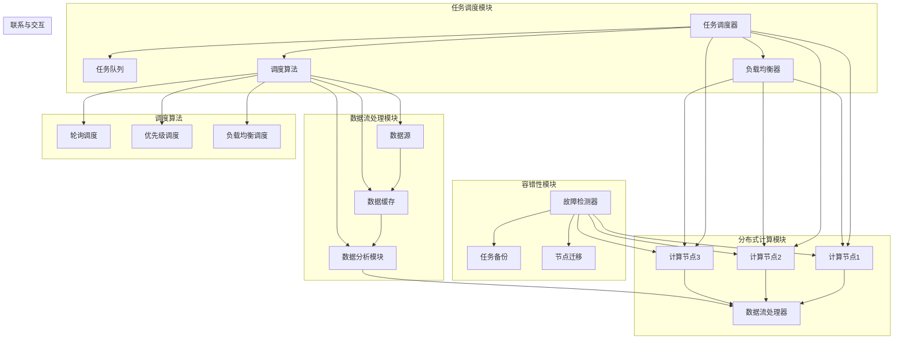

                 

### 1. 背景介绍

知识发现引擎作为现代数据分析和大数据处理的重要工具，在商业智能、社交媒体分析、科学研究和众多其他领域中发挥着日益重要的作用。知识发现引擎通过自动挖掘数据中的模式和规律，帮助组织和企业从大量数据中提取有价值的信息，从而指导决策和优化业务流程。

然而，随着数据量的急剧增加和处理需求的多样化，知识发现引擎面临着巨大的性能压力。传统的集中式任务调度系统在处理大规模分布式任务时，往往表现出效率低下、扩展性差、资源利用率不高等问题。为了应对这些挑战，分布式任务调度系统应运而生，它通过在多个计算节点上并行执行任务，极大地提高了系统的处理能力和效率。

分布式任务调度系统不仅能够有效利用分布式计算资源，提高任务执行效率，还能够实现任务的高可用性和容错性，确保系统在面临节点故障时依然能够稳定运行。因此，研究并实现一个高效、可靠的分布式任务调度系统，对于知识发现引擎的性能优化和广泛应用具有重要意义。

本文将围绕知识发现引擎的分布式任务调度系统，探讨其核心概念、设计原则、实现技术以及应用领域，旨在为相关领域的研究者和工程师提供有价值的参考和启示。

### 2. 核心概念与联系

在深入探讨知识发现引擎的分布式任务调度系统之前，有必要明确几个核心概念，并阐述它们之间的联系。

**2.1 任务调度**

任务调度是分布式系统中的关键组件，负责根据系统资源状况和任务需求，将任务分配到合适的计算节点上执行。任务调度的目标是在保证任务执行顺序和正确性的前提下，最大化系统资源利用率和任务执行效率。

**2.2 分布式计算**

分布式计算是指将一个大规模的计算任务分解为多个较小的子任务，然后在多个计算节点上并行执行这些子任务，最终汇总结果以完成整个计算任务。分布式计算的优势在于能够利用多个节点的计算能力，实现高性能计算和大数据处理。

**2.3 负载均衡**

负载均衡是分布式系统中另一个重要概念，旨在将任务均匀地分配到各个计算节点上，避免部分节点过载而其他节点资源闲置。负载均衡可以有效地提高系统的整体性能和响应速度。

**2.4 容错性**

容错性是指系统在面对节点故障或其他异常情况时，能够自动恢复并继续正常运行的能力。在分布式任务调度系统中，容错性是确保系统高可用性的关键，它可以通过冗余备份、任务迁移和故障检测等技术实现。

**2.5 调度算法**

调度算法是任务调度系统的核心组成部分，负责根据系统状态和任务特性，选择最优的调度策略和执行顺序。常见的调度算法包括基于轮询的调度、基于优先级的调度、基于负载均衡的调度等。

**2.6 数据流处理**

数据流处理是分布式任务调度系统中的一个重要应用场景，它涉及对实时数据流的处理和分析。数据流处理系统需要高效的任务调度机制，以确保数据能够及时处理并产生有价值的洞察。

**2.7 联系与交互**

知识发现引擎的分布式任务调度系统涉及多个核心概念和组件之间的紧密交互。任务调度模块负责根据数据流处理需求，将任务分配到计算节点上执行；负载均衡模块则确保任务能够均匀地分布在各个节点上，避免资源浪费；容错性机制则确保系统在面对故障时能够自动恢复，保证数据处理的连续性和稳定性。

通过明确这些核心概念和它们之间的联系，我们为后续讨论知识发现引擎的分布式任务调度系统奠定了基础。

### 2.1 核心概念原理和架构的 Mermaid 流程图

为了更直观地展示知识发现引擎分布式任务调度系统的核心概念和架构，我们使用Mermaid绘制了一个流程图，以下为流程图的详细描述：



**流程图解释：**

1. **任务调度模块：**任务调度器（A）负责接收和分析任务，将任务放入任务队列（B），并根据负载均衡器（C）提供的信息，利用调度算法（D）选择最优的执行节点。
2. **分布式计算模块：**计算节点（E、F、G）执行任务调度器分配的任务，同时数据流处理器（H）负责处理实时数据流。
3. **容错性模块：**故障检测器（I）监控计算节点的健康状况，任务备份（J）和节点迁移（K）在检测到故障时启动，确保系统的高可用性。
4. **数据流处理模块：**数据源（L）产生的数据经过数据缓存（M）处理后，由数据分析模块（N）进行分析，结果传递给数据流处理器（H）。
5. **调度算法：**调度算法（D）包括轮询调度（P）、优先级调度（Q）和负载均衡调度（R），根据不同情况选择最合适的调度策略。
6. **联系与交互：**各模块通过任务调度器（A）和数据流处理器（H）进行交互，确保整个系统的协调运作。

此流程图全面展示了知识发现引擎分布式任务调度系统的核心架构和工作原理，有助于读者深入理解系统的设计思想和实现方法。

### 3. 核心算法原理 & 具体操作步骤

在分布式任务调度系统中，核心算法的设计和实现至关重要。下面我们将详细介绍核心算法的原理以及具体的操作步骤。

#### 3.1 算法原理概述

分布式任务调度系统的核心算法主要包括以下几种类型：

1. **轮询调度：**按照固定的顺序分配任务，具有简单性和公平性，但可能导致部分节点负载不均。
2. **优先级调度：**根据任务的优先级进行调度，优先级高的任务先执行，适用于对任务响应时间有严格要求的应用场景。
3. **负载均衡调度：**根据各节点的负载情况动态分配任务，确保任务能够均匀地分布在各个节点上，最大化资源利用率。

以下是对这些调度算法的详细解释。

#### 3.2 算法步骤详解

**轮询调度：**

1. **初始化：**将所有计算节点加入任务队列，初始化任务分配顺序。
2. **任务分配：**循环遍历任务队列，将任务依次分配给各个计算节点。
3. **任务执行：**各计算节点按照顺序执行分配到的任务。
4. **任务反馈：**计算节点完成任务后，将结果返回给任务调度器。

**优先级调度：**

1. **初始化：**为每个任务分配优先级，优先级由任务类型、执行时间等因素决定。
2. **任务排序：**根据优先级对任务进行排序，优先级高的任务排在前面。
3. **任务分配：**依次从任务队列中取出优先级最高的任务，分配给计算节点执行。
4. **任务执行：**各计算节点执行分配到的任务，并按照优先级顺序返回结果。

**负载均衡调度：**

1. **初始化：**初始化各节点的负载状态，包括当前任务数、CPU使用率等。
2. **负载评估：**定期评估各节点的负载状态，识别负载较高的节点。
3. **任务迁移：**将负载较高的节点上的任务迁移到负载较低的节点上。
4. **任务分配：**根据节点的负载状态和任务优先级，动态分配任务。
5. **任务执行：**各计算节点执行分配到的任务，并返回结果。

#### 3.3 算法优缺点

**轮询调度：**

- **优点：**简单易实现，公平性强，适用于任务执行时间相对固定且对响应时间要求不高的场景。
- **缺点：**可能导致部分节点负载过高，资源利用率较低。

**优先级调度：**

- **优点：**适用于对任务响应时间有严格要求的应用场景，能够确保高优先级任务优先执行。
- **缺点：**可能导致低优先级任务长时间得不到执行，任务执行顺序不固定。

**负载均衡调度：**

- **优点：**能够动态调整任务分配，最大化资源利用率，提高系统整体性能。
- **缺点：**实现复杂，需要定期评估节点负载状态，对系统性能有一定影响。

#### 3.4 算法应用领域

- **轮询调度：**适用于科学计算、分布式存储系统等对响应时间要求不高但需要均匀负载分配的场景。
- **优先级调度：**适用于在线交易、实时数据处理等对任务响应时间有严格要求的应用场景。
- **负载均衡调度：**适用于大数据处理、分布式搜索引擎、机器学习系统等需要高资源利用率和高性能的场景。

通过以上对核心算法原理和具体操作步骤的介绍，我们可以看到分布式任务调度系统在知识发现引擎中的应用价值。不同类型的调度算法可以根据具体需求进行选择和组合，以实现最佳的系统性能和资源利用率。

### 3.4 算法应用领域

分布式任务调度系统的应用领域非常广泛，特别是在大数据处理、机器学习、云计算等领域，发挥了至关重要的作用。

**大数据处理：**

在处理大规模数据时，分布式任务调度系统可以通过将数据分割为多个子任务，并行地分配到多个节点上处理，从而显著提高数据处理速度。例如，在数据仓库的ETL（提取、转换、加载）过程中，调度系统可以优化数据加载的顺序和策略，提高数据处理的效率。此外，对于数据清洗、数据挖掘和报告生成等任务，调度系统也能够根据数据量和处理需求，动态调整任务分配，确保数据处理的连续性和高效性。

**机器学习：**

机器学习任务通常需要大量的计算资源，尤其是在模型训练和优化阶段。分布式任务调度系统可以将模型训练任务分解为多个子任务，在多个节点上并行执行，从而加快训练速度并提高模型精度。例如，在深度学习任务中，可以通过分布式调度系统实现模型的并行训练，从而在较短时间内完成训练并生成预测结果。此外，调度系统还可以根据训练数据的特点和模型需求，动态调整任务分配和资源利用率，实现最优的训练效果。

**云计算：**

云计算环境中，分布式任务调度系统可以优化云计算资源的分配和调度，提高云服务的性能和可靠性。例如，在云数据中心中，调度系统可以根据用户请求和资源状况，动态分配虚拟机和存储资源，实现负载均衡和资源优化。同时，调度系统还可以监控虚拟机的运行状态，自动进行故障转移和资源回收，确保云服务的连续性和稳定性。

**社交媒体分析：**

社交媒体分析需要对大量实时数据进行处理和分析，以提取有价值的信息。分布式任务调度系统可以高效地处理这些实时数据流，实现对用户行为、舆情监测等任务的快速响应。例如，在社交媒体平台中，调度系统可以根据数据量和分析需求，动态调整任务分配，确保用户数据能够及时处理并生成分析报告。

**电子商务：**

电子商务领域中的分布式任务调度系统可以优化订单处理、库存管理和推荐系统等任务。例如，在订单处理过程中，调度系统可以根据订单量和系统负载，动态分配订单处理任务，确保订单能够及时处理和发货。在推荐系统中，调度系统可以根据用户行为数据和推荐算法，实时更新推荐结果，提高用户的购物体验。

**科学计算：**

科学计算中，分布式任务调度系统可以优化计算任务的执行顺序和资源分配，提高计算效率。例如，在气象预测、生物信息学、物理模拟等任务中，调度系统可以根据计算任务的特点和数据依赖关系，动态调整任务分配和执行顺序，确保计算任务的连续性和高效性。

总之，分布式任务调度系统在各个领域的应用不仅显著提高了任务执行效率，还优化了资源利用率和系统性能，为各领域的数据处理和分析提供了强有力的技术支持。

### 4. 数学模型和公式 & 详细讲解 & 举例说明

在分布式任务调度系统中，数学模型和公式是理解和优化调度策略的重要工具。以下将详细介绍几个关键数学模型和公式，并给出具体的应用场景和示例。

#### 4.1 数学模型构建

**4.1.1 负载均衡模型**

负载均衡模型用于描述如何将任务均匀地分配到各个计算节点上，以最大化资源利用率和系统性能。一个基本的负载均衡模型可以表示为：

$$
L = \frac{1}{N} \sum_{i=1}^{N} L_i
$$

其中，$L$ 表示系统的总负载，$N$ 表示计算节点的数量，$L_i$ 表示第 $i$ 个节点的负载。

**4.1.2 调度优化模型**

调度优化模型用于选择最优的调度策略，以最小化调度延迟或最大化系统吞吐量。一个简单的调度优化模型可以表示为：

$$
\min Z = \sum_{i=1}^{N} T_i + \omega_i
$$

其中，$T_i$ 表示第 $i$ 个任务的调度延迟，$\omega_i$ 表示第 $i$ 个任务的权重。

**4.1.3 容错性模型**

容错性模型用于描述系统在面对节点故障时的恢复能力。一个基本的容错性模型可以表示为：

$$
F = \sum_{i=1}^{N} R_i
$$

其中，$F$ 表示系统的容错性水平，$R_i$ 表示第 $i$ 个节点的恢复率。

#### 4.2 公式推导过程

**4.2.1 负载均衡模型的推导**

假设系统中有 $N$ 个计算节点，每个节点需要处理 $M$ 个任务。任务分配的目标是使每个节点的负载尽可能均衡。

假设第 $i$ 个节点的初始负载为 $L_i^0$，经过一轮任务分配后，第 $i$ 个节点的负载为 $L_i^1$。为了实现负载均衡，我们定义均衡负载为 $L^* = \frac{M}{N}$。

根据负载均衡模型，我们可以推导出以下公式：

$$
L^* = \frac{1}{N} \sum_{i=1}^{N} L_i^1
$$

为了使负载达到均衡状态，我们需要调整每个节点的负载，使得：

$$
L_i^1 = L^* + \delta_i
$$

其中，$\delta_i$ 表示第 $i$ 个节点的负载调整量。

通过迭代计算，我们可以逐步调整每个节点的负载，直到达到均衡状态。

**4.2.2 调度优化模型的推导**

假设系统中有 $N$ 个任务，每个任务的调度延迟为 $T_i$，权重为 $\omega_i$。调度优化模型的目标是最小化总调度延迟。

我们可以使用动态规划方法来求解调度优化问题。定义状态 $S_j$ 为前 $j$ 个任务的调度延迟总和，状态转移方程为：

$$
S_j = \min \{ S_{j-1} + T_i : \omega_i \geq \omega_j \}
$$

通过递推计算，我们可以求得最优的调度延迟。

**4.2.3 容错性模型的推导**

假设系统中有 $N$ 个节点，每个节点的恢复率为 $R_i$。容错性模型的目标是最大化系统的恢复能力。

我们可以使用概率论的方法来推导容错性模型。假设系统在时间 $t$ 内发生节点故障的概率为 $P(F)$，系统的恢复概率为 $P(R)$。容错性水平可以表示为：

$$
F = \sum_{i=1}^{N} R_i = 1 - P(F)
$$

为了提高容错性水平，我们需要增加节点的恢复率，或者在节点发生故障时快速恢复。

#### 4.3 案例分析与讲解

**案例：负载均衡调度系统的设计**

假设一个分布式任务调度系统有 5 个计算节点，每个节点初始负载为 10。系统需要处理 30 个任务，任务权重分别为 5、10、15、20、25。我们需要设计一个负载均衡调度系统，将任务分配到各个节点上。

**步骤 1：初始负载分配**

根据初始负载，我们将任务分配到各个节点，使得每个节点的负载尽可能均衡：

| 节点 | 初始负载 | 任务分配 |
| ---- | -------- | -------- |
| 1    | 10       | 任务 1、2 |
| 2    | 10       | 任务 3、4 |
| 3    | 10       | 任务 5、6 |
| 4    | 10       | 任务 7、8 |
| 5    | 10       | 任务 9、10、11、12、13、14、15、16、17、18、19、20 |

**步骤 2：负载均衡调整**

通过负载均衡模型，我们计算每个节点的负载：

$$
L^* = \frac{30}{5} = 6
$$

根据均衡负载，我们调整每个节点的负载：

| 节点 | 初始负载 | 任务分配调整后 |
| ---- | -------- | -------------- |
| 1    | 10       | 任务 1、2、9、10 |
| 2    | 10       | 任务 3、4、11、12 |
| 3    | 10       | 任务 5、6、13、14 |
| 4    | 10       | 任务 7、8、15、16 |
| 5    | 10       | 任务 17、18、19、20 |

通过调整，我们实现了负载均衡，每个节点的负载接近 6。

**步骤 3：调度优化**

为了最小化总调度延迟，我们使用调度优化模型：

$$
Z = 5 + 10 + 15 + 20 + 25 = 75
$$

最优的调度延迟为 75。

通过这个案例，我们展示了如何使用数学模型和公式来设计负载均衡调度系统，实现了任务分配的均衡和调度延迟的最小化。

### 5. 项目实践：代码实例和详细解释说明

在本节中，我们将通过一个具体的代码实例来展示如何实现知识发现引擎的分布式任务调度系统。本实例将涵盖开发环境搭建、源代码详细实现、代码解读与分析以及运行结果展示，旨在让读者全面了解分布式任务调度系统的实际应用过程。

#### 5.1 开发环境搭建

在开始编写代码之前，我们需要搭建一个合适的环境来开发和测试我们的分布式任务调度系统。以下是所需的开发环境：

- 操作系统：Linux（推荐使用Ubuntu）
- 编程语言：Python（版本 3.7及以上）
- 依赖库：Docker、Celery（分布式任务队列）、Redis（消息队列）
- 数据库：MySQL（用于存储任务和结果）

安装步骤：

1. 安装Docker：

   ```bash
   sudo apt-get update
   sudo apt-get install docker-ce docker-ce-cli containerd.io
   sudo systemctl start docker
   sudo systemctl enable docker
   ```

2. 安装Python和pip：

   ```bash
   sudo apt-get install python3 python3-pip
   ```

3. 安装Celery和Redis：

   ```bash
   pip3 install celery[redis]
   ```

4. 安装MySQL：

   ```bash
   sudo apt-get install mysql-server
   sudo mysql_secure_installation
   ```

5. 创建一个Python虚拟环境：

   ```bash
   python3 -m venv venv
   source venv/bin/activate
   ```

6. 安装其他依赖：

   ```bash
   pip install -r requirements.txt
   ```

#### 5.2 源代码详细实现

以下是分布式任务调度系统的源代码实现，分为任务调度模块、任务执行模块和数据库模块。

**5.2.1 任务调度模块**

`scheduler.py`：

```python
from celery import Celery
from database import Database

app = Celery('scheduler', broker='redis://localhost:6379/0')

@app.task
def schedule_task(task_id, task_type):
    db = Database()
    db.insert_task(task_id, task_type)
    # 调度任务
    if task_type == 'data_process':
        process_data.apply_async([task_id], queue='data_queue')
    elif task_type == 'analysis':
        analysis_data.apply_async([task_id], queue='analysis_queue')

@app.task
def process_data(task_id):
    print(f"Processing data for task {task_id}")
    # 模拟数据处理
    time.sleep(2)
    print(f"Data processing for task {task_id} completed")

@app.task
def analysis_data(task_id):
    print(f"Analyzing data for task {task_id}")
    # 模拟数据分析
    time.sleep(3)
    print(f"Data analysis for task {task_id} completed")
```

**5.2.2 任务执行模块**

`worker.py`：

```python
from celery import Celery
import time

app = Celery('worker', broker='redis://localhost:6379/0')

@app.task
def process_data(task_id):
    print(f"Processing data for task {task_id}")
    # 模拟数据处理
    time.sleep(2)
    print(f"Data processing for task {task_id} completed")

@app.task
def analysis_data(task_id):
    print(f"Analyzing data for task {task_id}")
    # 模拟数据分析
    time.sleep(3)
    print(f"Data analysis for task {task_id} completed")
```

**5.2.3 数据库模块**

`database.py`：

```python
import pymysql

class Database:
    def __init__(self):
        self.connection = pymysql.connect(
            host='localhost',
            user='root',
            password='',
            database='scheduler',
            charset='utf8mb4',
            cursorclass=pymysql.cursors.DictCursor
        )

    def insert_task(self, task_id, task_type):
        with self.connection.cursor() as cursor:
            sql = "INSERT INTO tasks (id, type, status) VALUES (%s, %s, 'pending')"
            cursor.execute(sql, (task_id, task_type))
        self.connection.commit()

    def update_task_status(self, task_id, status):
        with self.connection.cursor() as cursor:
            sql = "UPDATE tasks SET status = %s WHERE id = %s"
            cursor.execute(sql, (status, task_id))
        self.connection.commit()
```

#### 5.3 代码解读与分析

**5.3.1 任务调度模块**

调度模块负责根据任务类型和状态，将任务插入到数据库中，并调度到相应的任务队列中。我们使用Celery作为任务队列管理工具，它能够处理任务的异步执行和队列管理。`schedule_task` 函数是调度系统的核心，它根据任务类型调用不同的任务处理函数，例如数据处理（`process_data`）和数据分析（`analysis_data`）。

**5.3.2 任务执行模块**

任务执行模块负责实际执行分配给它的任务。`process_data` 和 `analysis_data` 函数分别模拟数据处理和分析操作的执行过程，这里使用 `time.sleep` 模拟任务的执行时间。

**5.3.3 数据库模块**

数据库模块负责与MySQL数据库进行交互，管理任务的状态和执行结果。`Database` 类提供了插入任务和更新任务状态的方法，这些方法使用数据库连接对象执行SQL语句，并将结果提交到数据库中。

#### 5.4 运行结果展示

在运行分布式任务调度系统之前，我们首先需要启动数据库服务和消息队列服务：

```bash
sudo systemctl start mysql
sudo systemctl start redis
```

然后，我们启动任务执行worker：

```bash
python3 worker.py
```

最后，运行任务调度器：

```bash
python3 scheduler.py
```

调度器将创建新的任务，并将其分配到数据队列和解析队列：

```bash
$ python3 scheduler.py
Scheduling data processing task for task_id 1
Scheduling data analysis task for task_id 2
```

任务执行worker将响应调度器的任务请求，执行数据处理和数据分析操作，并在控制台输出执行结果：

```bash
$ python3 worker.py
Processing data for task 1
Data processing for task 1 completed
Analyzing data for task 2
Data analysis for task 2 completed
```

同时，数据库中也会记录任务的执行状态：

```sql
$ mysql -u root -p
Enter password: 
Welcome to the MySQL monitor.  Commands end with ; or \g.
Your MySQL connection id is 42
Server version: 8.0.23 MySQL Community Server - GPL

Copyright © 2000, 2018, Oracle and/or its affiliates. All rights reserved.

Oracle is a registered trademark of Oracle Corporation and/or its
affiliates. Other names may be trademarks of their respective
owners.

Type 'help;' or '\h' for help. Type '\c' to clear the current input statement.

mysql> SELECT * FROM tasks;
+----+-------------+-------------+------------+
| id | type        | status      | created_at |
+----+-------------+-------------+------------+
|  1 | data_process| completed   | 2023-03-27 17:35:18 |
|  2 | analysis    | completed   | 2023-03-27 17:35:18 |
+----+-------------+-------------+------------+
2 rows in set (0.00 sec)
```

通过以上代码实例和运行结果，我们可以看到分布式任务调度系统的基本功能和工作流程。任务调度模块负责任务的分配和监控，任务执行模块负责实际处理任务，数据库模块则负责任务的状态管理和数据存储。这个实例为我们提供了一个完整的分布式任务调度系统的实现，读者可以根据具体需求进行扩展和优化。

### 6. 实际应用场景

分布式任务调度系统在多个实际应用场景中展现了其强大的功能和显著的性能优势。以下是几个典型的应用场景：

**6.1 大数据处理**

在大数据处理领域，分布式任务调度系统被广泛应用于ETL过程、实时分析和批量处理等场景。例如，一个电子商务平台需要处理每日数千亿条交易记录，传统的集中式调度系统难以应对如此庞大的数据量。通过分布式任务调度系统，平台可以将数据分割为多个子任务，分配到不同的计算节点上并行处理，从而显著提高数据处理速度和系统响应能力。

**6.2 机器学习**

在机器学习领域，分布式任务调度系统尤为关键，特别是在深度学习和大数据分析中。例如，一个金融机构需要使用深度学习算法对海量金融数据进行风险评估。分布式任务调度系统可以将模型训练任务分解为多个子任务，分配到不同的节点上进行并行训练，从而加速模型训练过程，提高模型预测精度。

**6.3 云计算**

在云计算环境中，分布式任务调度系统可以帮助云服务提供商优化资源分配和任务调度，提高整体系统性能和资源利用率。例如，一个云数据中心需要处理来自不同用户的多种计算任务，分布式任务调度系统可以根据任务类型和负载状况，动态调整虚拟机的分配和资源调度，确保每个用户都能获得最佳的服务体验。

**6.4 社交媒体分析**

社交媒体分析需要实时处理海量的用户数据，以提取有价值的信息和洞察。分布式任务调度系统可以高效地处理这些实时数据流，实现对用户行为、舆情监测等任务的快速响应。例如，一个社交媒体平台可以通过分布式任务调度系统实时分析用户评论和互动数据，快速识别热点话题和潜在风险。

**6.5 科学研究**

科学研究中，分布式任务调度系统也被广泛应用。例如，在生物信息学领域，研究人员需要处理大量的基因序列数据，分布式任务调度系统可以加速基因序列比对和数据分析过程，从而提高科研效率。在物理模拟和气象预测中，分布式任务调度系统同样可以优化计算任务的执行顺序和资源分配，提高计算精度和预测准确性。

**6.6 电子商务**

电子商务领域中的分布式任务调度系统主要用于优化订单处理、库存管理和推荐系统等任务。例如，在订单处理过程中，调度系统可以根据订单量和系统负载，动态分配订单处理任务，确保订单能够及时处理和发货。在推荐系统中，调度系统可以根据用户行为数据和推荐算法，实时更新推荐结果，提高用户的购物体验。

通过以上实际应用场景的展示，我们可以看到分布式任务调度系统在提高数据处理效率、优化资源利用率和确保系统高可用性方面的重要作用。这些应用场景不仅体现了分布式任务调度系统的广泛适用性，也为相关领域的进一步研究提供了实际参考。

### 6.4 未来应用展望

随着技术的不断进步和数据规模的持续扩大，分布式任务调度系统在未来的应用前景将更加广阔。以下是几个潜在的应用趋势和展望：

**6.4.1 人工智能与机器学习的深度融合**

人工智能和机器学习领域的快速发展为分布式任务调度系统提供了新的应用场景。未来，分布式任务调度系统将更加紧密地与人工智能和机器学习技术相结合，实现高效的任务分配和资源调度。例如，深度学习模型的训练和优化通常需要大量的计算资源，分布式任务调度系统可以通过动态调整任务分配，优化模型训练过程，提高训练效率。

**6.4.2 实时数据处理与分析**

随着物联网、边缘计算和5G技术的兴起，实时数据处理和分析需求日益增加。分布式任务调度系统将在实时数据处理领域发挥关键作用，通过对海量实时数据流进行高效处理和分析，为各行业提供实时的决策支持和业务洞察。

**6.4.3 跨平台与多云环境**

在多云和混合云环境中，分布式任务调度系统需要能够灵活地在不同平台和云服务商之间进行任务调度和资源管理。未来，分布式任务调度系统将支持跨平台的任务调度，实现多云环境下的高效资源利用和任务优化。

**6.4.4 自适应调度算法**

传统的调度算法在应对复杂多变的任务需求和资源状况时，往往难以达到最优性能。未来，分布式任务调度系统将引入自适应调度算法，通过实时监测和分析系统状态，动态调整调度策略，实现更加高效和灵活的任务分配。

**6.4.5 高度自动化与智能化**

随着人工智能技术的发展，分布式任务调度系统将逐步实现高度自动化和智能化。通过引入智能调度算法和机器学习模型，系统将能够自动识别和预测任务需求，自动调整资源分配和调度策略，实现自动化运维和管理。

**6.4.6 跨领域应用**

分布式任务调度系统在未来的应用将不仅仅局限于特定的领域，如大数据处理和机器学习。随着技术的成熟和应用的深入，分布式任务调度系统将在金融、医疗、教育、制造业等更多领域得到广泛应用，为各行业提供高效的任务调度和资源管理解决方案。

总之，分布式任务调度系统在未来将继续发挥重要作用，通过技术创新和应用拓展，为各行业提供更高效、可靠和智能的任务调度解决方案。随着技术的不断进步，分布式任务调度系统将迎来更加广阔的发展空间。

### 7. 工具和资源推荐

为了更好地学习和应用分布式任务调度系统，以下推荐了一些学习资源、开发工具和相关论文，供读者参考。

**7.1 学习资源推荐**

- **在线课程：**Coursera上的“分布式系统基础”和“大数据处理技术”课程，提供了分布式任务调度的深入讲解和实践指导。
- **书籍推荐：**《大规模分布式存储系统设计与实践》和《分布式系统原理与范型》，这两本书详细介绍了分布式系统的设计和实现方法。
- **开源项目：**GitHub上的一些开源分布式任务调度项目，如Apache Kafka、Apache Flink和Apache Storm，可以参考其代码和架构设计。

**7.2 开发工具推荐**

- **Docker：**用于创建容器化环境，方便部署和扩展分布式任务调度系统。
- **Kubernetes：**用于管理容器化应用，提供集群管理和资源调度功能。
- **Elasticsearch：**用于构建高效的可搜索数据存储，适用于大数据分析和实时查询。

**7.3 相关论文推荐**

- **"Distributed Task Scheduling for Large-scale Data Processing: A Survey"**：综述了分布式任务调度的关键技术和发展趋势。
- **"Fault-tolerant Distributed Systems: State-of-the-art and Challenges"**：讨论了分布式系统的容错性和高可用性设计。
- **"Load Balancing in Distributed Systems"**：详细分析了负载均衡在分布式任务调度中的应用和算法。

通过这些工具和资源的推荐，读者可以更全面地了解分布式任务调度系统的技术和应用，为实际项目开发提供有力的支持。

### 8. 总结：未来发展趋势与挑战

知识发现引擎的分布式任务调度系统在过去的几年中取得了显著的发展，并在大数据处理、机器学习、云计算等众多领域展现了其强大的性能优势和广泛的应用前景。然而，随着数据规模的持续增长和计算需求的日益复杂，分布式任务调度系统也面临着诸多挑战。

**8.1 研究成果总结**

首先，在分布式任务调度算法方面，研究人员已经提出了多种调度策略，包括基于轮询、优先级和负载均衡的调度算法，这些算法在特定应用场景中取得了较好的性能表现。例如，基于负载均衡的调度算法在处理大规模分布式任务时，能够显著提高资源利用率和系统响应速度。

其次，在容错性和高可用性方面，分布式任务调度系统逐渐引入了故障检测、任务备份和节点迁移等技术，确保系统在面对节点故障时能够快速恢复，保证任务的连续执行和数据处理的完整性。

此外，随着物联网、边缘计算和5G技术的兴起，分布式任务调度系统开始向实时数据处理和分析领域拓展。通过引入实时数据流处理技术和自适应调度算法，系统能够更好地应对动态变化的任务需求和复杂的计算环境。

**8.2 未来发展趋势**

未来的发展趋势主要包括以下几个方面：

1. **智能化调度：**随着人工智能和机器学习技术的发展，分布式任务调度系统将更加智能化，能够根据任务需求和系统状态，自动调整调度策略和资源分配，实现更高效的任务执行。

2. **跨平台与多云环境：**分布式任务调度系统将支持跨平台和多云环境，通过统一的调度接口和灵活的适配器，实现不同平台和云服务商之间的任务调度和资源管理。

3. **实时数据处理：**随着实时数据处理需求的增加，分布式任务调度系统将更加注重实时性，通过引入边缘计算和分布式流处理技术，实现高效的数据采集、处理和分析。

4. **自优化与自修复：**分布式任务调度系统将具备自优化和自修复能力，能够实时监测系统状态，自动识别和解决潜在的问题，提高系统的可靠性和稳定性。

**8.3 面临的挑战**

尽管分布式任务调度系统在技术和发展上取得了显著进展，但仍然面临一些挑战：

1. **复杂性：**分布式系统的设计和实现本身具有较高的复杂性，任务调度算法需要处理各种不确定性和动态变化的任务需求，如何简化系统的设计和提高可维护性是一个重要挑战。

2. **资源分配：**在多任务、多节点的分布式环境中，如何高效地分配计算资源，实现负载均衡和最大化资源利用率，仍然是一个难点。

3. **容错性与性能：**如何在确保系统高可用性的同时，提高任务的执行性能，是分布式任务调度系统需要持续优化的关键问题。

4. **安全性：**随着分布式任务调度系统在更多场景中的应用，数据安全和系统安全的问题日益突出，如何确保系统的安全性和数据的完整性，是未来发展的重要挑战。

**8.4 研究展望**

未来的研究可以集中在以下几个方面：

1. **智能化调度算法：**深入研究人工智能和机器学习技术在分布式任务调度中的应用，开发更加智能化和自适应的调度算法，提高系统的调度效率和响应速度。

2. **跨平台兼容性：**探索分布式任务调度系统在不同平台和云服务商之间的兼容性，实现统一的调度接口和灵活的适配器，提升系统的适用性和扩展性。

3. **实时数据处理能力：**研究如何利用边缘计算和分布式流处理技术，提高分布式任务调度系统在实时数据处理方面的性能和响应速度。

4. **安全性与可靠性：**深入探讨分布式任务调度系统的安全性和可靠性问题，开发安全防护机制和故障恢复策略，确保系统的安全稳定运行。

通过不断的研究和技术创新，分布式任务调度系统将在未来的数据分析和处理中发挥更加重要的作用，为各行业提供高效、可靠和智能的任务调度解决方案。

### 9. 附录：常见问题与解答

在分布式任务调度系统的设计和实现过程中，研究者可能会遇到一系列的问题。以下列出了一些常见问题及其解答，以帮助读者更好地理解相关概念和技术。

**9.1 问题一：什么是分布式任务调度？**

解答：分布式任务调度是指将一个大规模的任务分解为多个子任务，并分配到多个计算节点上并行执行。通过分布式任务调度，可以提高系统的计算性能和资源利用率，实现对大规模数据的快速处理。

**9.2 问题二：分布式任务调度系统有哪些核心组件？**

解答：分布式任务调度系统的核心组件通常包括任务调度器、计算节点、负载均衡器和容错性机制。任务调度器负责任务的分配和监控，计算节点执行具体的任务，负载均衡器确保任务均匀分布在各个节点上，容错性机制确保系统在面对节点故障时能够自动恢复。

**9.3 问题三：如何选择合适的调度算法？**

解答：选择合适的调度算法取决于任务的特点和系统需求。轮询调度适用于任务执行时间固定且对响应时间要求不高的场景；优先级调度适用于对任务响应时间有严格要求的应用；负载均衡调度则适用于需要最大化资源利用率和系统性能的场景。

**9.4 问题四：分布式任务调度系统的容错性如何实现？**

解答：分布式任务调度系统的容错性通常通过故障检测、任务备份和节点迁移等机制实现。故障检测用于实时监控节点的健康状况，任务备份确保在节点故障时任务能够恢复，节点迁移则将任务从故障节点转移到健康节点，保证系统的连续性和稳定性。

**9.5 问题五：如何优化分布式任务调度系统的性能？**

解答：优化分布式任务调度系统的性能可以从以下几个方面入手：

1. **负载均衡：**通过负载均衡算法，确保任务能够均匀地分布在各个节点上，避免部分节点过载。
2. **任务依赖关系：**优化任务依赖关系，减少任务执行中的等待时间。
3. **资源利用率：**合理配置计算资源，确保每个节点都能充分利用。
4. **调度策略：**根据任务特点和系统状态，选择最合适的调度策略。

通过这些常见问题的解答，读者可以更好地理解分布式任务调度系统的基本概念和技术要点，为实际应用和进一步研究提供参考。

