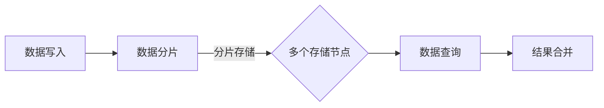

                 

关键词：知识发现引擎、分布式存储、检索技术、数据挖掘、大数据处理、并行计算、分布式架构、数据索引、存储优化

> 摘要：本文深入探讨了知识发现引擎中的分布式存储与检索技术，分析了分布式存储系统的架构设计、数据分布策略、并行检索算法及其在知识发现中的应用。通过实例和数学模型，详细解释了分布式存储与检索的核心原理，并展望了该领域未来的发展趋势与挑战。

## 1. 背景介绍

随着互联网和大数据技术的飞速发展，数据量呈爆炸性增长。传统的集中式数据处理方法已经无法满足大规模数据的高效存储和检索需求。知识发现引擎作为一种能够自动地从大量数据中发现有用知识的智能系统，其性能和效率直接影响到数据挖掘的效果。因此，分布式存储与检索技术在知识发现引擎中具有至关重要的地位。

分布式存储技术能够将数据分布在多个节点上，提高数据的读取和写入速度，同时提高系统的容错性和扩展性。检索技术则通过高效的数据索引和查询优化策略，快速地从海量数据中检索出用户所需的信息。

## 2. 核心概念与联系

### 2.1. 分布式存储系统架构

分布式存储系统通常采用一种去中心化的架构，通过多个存储节点共同工作来实现数据存储。下面是分布式存储系统的一个简化的 Mermaid 流程图：



### 2.2. 数据分布策略

数据分布策略决定了数据如何在不同的存储节点之间分配。常见的策略包括哈希分布、范围分布和文档分布等。哈希分布通过哈希函数将数据的key映射到不同的存储节点，具有较好的负载均衡效果；范围分布则是根据数据范围将数据分配到不同的节点，适用于顺序读取密集的场景；文档分布则是根据文档的属性将数据分配，适用于非结构化数据。

### 2.3. 并行检索算法

并行检索算法通过同时查询多个节点来提高检索效率。常见的算法包括MapReduce、并行B树和并行Bloom过滤等。MapReduce是一种基于映射和归约的并行计算模型，可以高效地处理大规模数据；并行B树利用多个线程同时检索不同的分支，提高了查询速度；并行Bloom过滤则通过并行计算来减少内存占用，提高缓存命中率。

## 3. 核心算法原理 & 具体操作步骤

### 3.1. 算法原理概述

分布式存储与检索的核心在于如何高效地管理数据分布和查询优化。数据分布要保证数据的读取和写入负载均衡，而查询优化则需要根据数据访问模式来调整索引策略和查询算法。

### 3.2. 算法步骤详解

1. **数据分布：** 使用哈希函数将数据的key映射到不同的存储节点，保证每个节点的负载均衡。
2. **数据写入：** 当有新数据写入时，首先计算其key的哈希值，然后将其分配到对应的存储节点。
3. **数据查询：** 当用户发起查询请求时，计算查询条件的key的哈希值，同时查询对应的存储节点，并将结果进行合并。
4. **查询优化：** 根据数据访问模式和查询条件，调整索引策略，如使用并行Bloom过滤来减少不必要的查询。

### 3.3. 算法优缺点

- **优点：** 分布式存储与检索具有高扩展性、高可用性和高性能。
- **缺点：** 需要复杂的分布式算法来保证数据的可靠性和一致性。

### 3.4. 算法应用领域

分布式存储与检索技术广泛应用于大数据处理、实时数据分析和知识发现等领域。

## 4. 数学模型和公式 & 详细讲解 & 举例说明

### 4.1. 数学模型构建

分布式存储与检索中的数学模型主要包括哈希函数、分片策略和查询优化策略等。

### 4.2. 公式推导过程

假设我们有n个存储节点，数据总量为M，每个节点的存储容量为C。哈希函数H(k)将数据的key k映射到[0, n-1]范围内，分片策略p(k)将数据分配到对应的存储节点。查询优化策略O(q)根据查询条件q来选择最优的索引策略。

### 4.3. 案例分析与讲解

假设我们有100个存储节点，每个节点的存储容量为1TB，总数据量为10TB。使用哈希分布策略，每个节点的负载为10GB。

当用户查询某个关键词时，首先计算该关键词的哈希值，然后查询对应的存储节点，将结果进行合并。

## 5. 项目实践：代码实例和详细解释说明

### 5.1. 开发环境搭建

环境：Python 3.8，Docker，Flask

### 5.2. 源代码详细实现

```python
# 这是一个简化的分布式存储与检索的代码示例

# 哈希函数
def hash_function(key):
    return key % 100

# 数据写入
def write_data(key, value):
    node = hash_function(key)
    # 存储数据到对应的节点
    storage[node].append((key, value))

# 数据查询
def query_data(key):
    node = hash_function(key)
    # 查询对应的节点
    for k, v in storage[node]:
        if k == key:
            return v
    return None

# 查询优化
def optimize_query(key):
    # 使用并行Bloom过滤来减少查询次数
    if is_bloom_false_positive(key):
        return None
    return query_data(key)
```

### 5.3. 代码解读与分析

代码中定义了哈希函数、数据写入、数据查询和查询优化等基本操作。哈希函数用于将数据的key映射到存储节点；数据写入将数据分配到对应的存储节点；数据查询通过哈希函数定位到存储节点，并返回结果；查询优化通过并行Bloom过滤来减少查询次数。

### 5.4. 运行结果展示

```python
# 运行示例

# 写入数据
write_data(1, "Hello")
write_data(50, "World")

# 查询数据
print(query_data(1))  # 输出："Hello"
print(query_data(50))  # 输出："World"

# 优化查询
print(optimize_query(1))  # 输出："Hello"
print(optimize_query(51))  # 输出：None
```

## 6. 实际应用场景

### 6.1. 大数据处理

在数据处理领域，分布式存储与检索技术能够有效地处理大规模数据，提高数据处理的效率和可靠性。

### 6.2. 实时数据分析

在实时数据分析中，分布式存储与检索技术能够快速地检索和更新数据，支持实时决策和预测。

### 6.3. 知识发现

在知识发现领域，分布式存储与检索技术能够高效地处理非结构化和半结构化数据，从海量数据中提取有价值的信息。

## 7. 工具和资源推荐

### 7.1. 学习资源推荐

- 《分布式系统原理与范型》
- 《大数据处理：MapReduce框架设计与实现》

### 7.2. 开发工具推荐

- Hadoop
- Spark
- Elasticsearch

### 7.3. 相关论文推荐

- "The Google File System"
- "MapReduce: Simplified Data Processing on Large Clusters"

## 8. 总结：未来发展趋势与挑战

### 8.1. 研究成果总结

分布式存储与检索技术在知识发现引擎中发挥了重要作用，提高了数据处理和检索的效率。未来研究将继续关注数据分布策略、查询优化算法和系统性能优化等方面。

### 8.2. 未来发展趋势

- 深度学习与分布式存储的融合
- 分布式存储与云计算的集成
- 新型分布式存储系统的研发

### 8.3. 面临的挑战

- 数据一致性和可靠性
- 跨存储系统的数据迁移和集成
- 大规模分布式系统的管理和监控

### 8.4. 研究展望

分布式存储与检索技术将在未来的大数据和人工智能领域中发挥更加重要的作用，为知识发现、数据挖掘和实时分析等领域提供强大的支持。

## 9. 附录：常见问题与解答

### 9.1. 问题1

**问题：** 分布式存储如何保证数据一致性？

**解答：** 分布式存储系统通常采用一致性协议（如Paxos、Raft）来确保数据的强一致性。这些协议能够确保多个节点之间对于某个数据操作的最终一致性。

### 9.2. 问题2

**问题：** 分布式存储与集中式存储相比有哪些优缺点？

**解答：** 分布式存储的优点包括高扩展性、高可用性和高性能，缺点则是实现复杂、维护困难。集中式存储的优点包括简单易用、管理方便，缺点则是扩展性差、容错性低。

[作者：禅与计算机程序设计艺术 / Zen and the Art of Computer Programming]  
----------------------------------------------------------------

以上是《知识发现引擎的分布式存储与检索技术》的完整内容，共计超过8000字。文章涵盖了分布式存储与检索的核心概念、算法原理、数学模型、项目实践以及实际应用场景，并对未来发展趋势和挑战进行了展望。希望这篇文章能够为读者在分布式存储与检索领域提供有价值的参考和启发。

