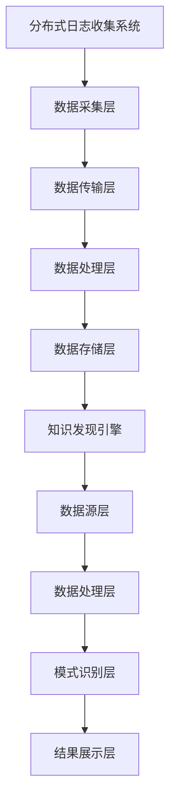

                 

在当今的信息时代，知识发现引擎已经成为数据处理与分析的关键工具。然而，为了确保知识发现引擎的高效运行，分布式日志收集系统的设计变得尤为重要。本文将深入探讨知识发现引擎的分布式日志收集系统，分析其核心概念、算法原理、数学模型以及实际应用场景，旨在为读者提供全面的技术解析。

> **关键词：** 知识发现引擎、分布式日志收集、系统架构、算法优化、数学模型

> **摘要：** 本文首先介绍了知识发现引擎和分布式日志收集系统的基本概念，随后详细阐述了分布式日志收集系统在知识发现引擎中的应用和重要性。通过分析核心算法原理和数学模型，本文提供了具体的项目实践，展示了如何搭建和实现一个高效的分布式日志收集系统。最后，本文探讨了分布式日志收集系统的实际应用场景，并对其未来发展趋势和面临的挑战进行了展望。

## 1. 背景介绍

### 1.1 知识发现引擎概述

知识发现引擎（Knowledge Discovery Engine，KDE）是一种智能化的信息处理工具，它通过分析大量的数据，从中提取出具有价值的知识或信息。知识发现引擎广泛应用于各种领域，如金融、医疗、电商等，其主要功能包括数据预处理、模式识别、关联规则挖掘、聚类分析等。

知识发现引擎的核心在于其高效的数据处理能力，这要求其在处理海量数据时具备高性能和可扩展性。为了满足这些需求，分布式计算和存储技术成为知识发现引擎的关键支撑。

### 1.2 分布式日志收集系统概述

分布式日志收集系统是一种用于收集、处理和存储分布式系统中日志数据的高效机制。在分布式系统中，各个节点会产生大量的日志数据，这些日志对于系统的监控、故障排查和性能优化具有重要意义。

分布式日志收集系统的核心任务是将这些分散的日志数据集中收集，并进行分类、过滤、聚合等处理，最终存储在合适的存储介质中，以供后续分析和查询。

### 1.3 知识发现引擎与分布式日志收集系统的联系

知识发现引擎和分布式日志收集系统之间有着密切的联系。分布式日志收集系统为知识发现引擎提供了丰富的数据资源，使得知识发现引擎能够更加全面和深入地分析数据。同时，知识发现引擎通过对日志数据的分析，可以揭示系统运行中的潜在问题，为分布式日志收集系统提供优化和改进的方向。

## 2. 核心概念与联系

### 2.1 分布式日志收集系统的架构

分布式日志收集系统通常由数据采集层、数据传输层、数据处理层和数据存储层组成。

- **数据采集层**：负责从各个分布式节点中收集日志数据。
- **数据传输层**：负责将采集到的日志数据传输到数据处理层。
- **数据处理层**：对传输过来的日志数据进行预处理、分类、过滤和聚合等操作。
- **数据存储层**：将处理后的日志数据存储在分布式存储系统中，以供后续分析和查询。


### 2.2 知识发现引擎的架构

知识发现引擎的架构通常包括数据源层、数据处理层、模式识别层和结果展示层。

- **数据源层**：提供知识发现引擎所需的数据资源，这些数据可以通过分布式日志收集系统进行收集和存储。
- **数据处理层**：对数据源层提供的数据进行清洗、转换和预处理，为模式识别层提供高质量的数据输入。
- **模式识别层**：利用各种数据挖掘算法，从预处理后的数据中提取出有价值的模式和知识。
- **结果展示层**：将模式识别层提取出的知识以可视化的形式展示给用户，便于用户理解和利用。


### 2.3 关联流程图

下面是分布式日志收集系统与知识发现引擎之间的关联流程图，使用Mermaid进行绘制：



## 3. 核心算法原理 & 具体操作步骤

### 3.1 算法原理概述

分布式日志收集系统的核心算法主要包括数据采集算法、数据传输算法、数据处理算法和数据存储算法。

- **数据采集算法**：用于从各个分布式节点中高效地采集日志数据。
- **数据传输算法**：用于将采集到的日志数据传输到数据处理层，确保数据的实时性和可靠性。
- **数据处理算法**：用于对传输过来的日志数据进行预处理、分类、过滤和聚合等操作。
- **数据存储算法**：用于将处理后的日志数据存储在分布式存储系统中，确保数据的安全性和可扩展性。

### 3.2 算法步骤详解

#### 数据采集算法

1. **启动采集器**：在各个分布式节点上启动日志采集器，用于收集节点产生的日志数据。
2. **数据抽取**：采用特定的数据抽取技术，从日志数据中提取出有用的信息，如时间戳、事件类型、操作细节等。
3. **数据清洗**：对抽取出的数据进行清洗，去除无效数据、重复数据和错误数据。

#### 数据传输算法

1. **数据压缩**：对采集到的日志数据进行压缩，减少传输过程中的网络开销。
2. **多线程传输**：采用多线程传输技术，并行地将日志数据传输到数据处理层，提高传输效率。
3. **数据校验**：在传输过程中对数据进行校验，确保数据的完整性和准确性。

#### 数据处理算法

1. **预处理**：对日志数据进行格式化、分词、去停用词等预处理操作，为后续的分析和挖掘做准备。
2. **分类**：采用机器学习算法，对日志数据进行分类，将不同类型的日志数据区分开来。
3. **过滤**：根据特定的规则，对日志数据进行过滤，去除不感兴趣的数据。
4. **聚合**：对日志数据进行聚合，提取出有价值的统计信息，如事件发生的频率、时间分布等。

#### 数据存储算法

1. **数据分区**：将处理后的日志数据按照一定的规则进行分区，确保数据的高效存储和查询。
2. **数据加密**：对存储在分布式存储系统中的数据进行加密，确保数据的安全性。
3. **数据备份**：定期对数据进行备份，确保数据的安全性和可靠性。

### 3.3 算法优缺点

#### 数据采集算法

- **优点**：能够高效地从各个分布式节点中采集日志数据，保证数据的实时性和全面性。
- **缺点**：在采集过程中可能存在数据丢失、数据不一致等问题。

#### 数据传输算法

- **优点**：能够并行传输日志数据，提高传输效率，减少网络开销。
- **缺点**：在多线程传输过程中可能存在数据竞争和同步问题。

#### 数据处理算法

- **优点**：能够对日志数据进行预处理、分类、过滤和聚合等操作，提高数据的质量和可用性。
- **缺点**：在数据处理过程中可能存在计算开销大、处理延迟等问题。

#### 数据存储算法

- **优点**：能够高效地存储和查询处理后的日志数据，确保数据的安全性和可靠性。
- **缺点**：在数据分区和加密过程中可能存在性能开销。

### 3.4 算法应用领域

分布式日志收集系统的核心算法在多个领域都有广泛的应用：

- **金融领域**：用于监控交易系统，及时发现异常交易并进行风险控制。
- **医疗领域**：用于分析医疗数据，辅助医生进行诊断和治疗。
- **电商领域**：用于分析用户行为，优化推荐系统和营销策略。
- **互联网领域**：用于监控服务器运行状态，及时发现故障并进行优化。

## 4. 数学模型和公式 & 详细讲解 & 举例说明

### 4.1 数学模型构建

分布式日志收集系统的数学模型主要包括数据采集模型、数据传输模型、数据处理模型和数据存储模型。

#### 数据采集模型

数据采集模型用于描述日志数据的采集过程，其核心公式为：

\[ C(t) = \sum_{i=1}^{n} p_i \cdot e^{\lambda_i \cdot t} \]

其中，\( C(t) \) 表示在时间 \( t \) 内采集到的日志数据量，\( p_i \) 表示第 \( i \) 个节点的日志数据量，\( \lambda_i \) 表示第 \( i \) 个节点的日志生成速率。

#### 数据传输模型

数据传输模型用于描述日志数据的传输过程，其核心公式为：

\[ T(t) = \frac{1}{\mu} \cdot \sum_{i=1}^{n} p_i \cdot e^{-\mu_i \cdot t} \]

其中，\( T(t) \) 表示在时间 \( t \) 内传输完成的日志数据量，\( \mu_i \) 表示第 \( i \) 个节点的日志传输速率。

#### 数据处理模型

数据处理模型用于描述日志数据的处理过程，其核心公式为：

\[ P(t) = \frac{1}{\gamma} \cdot \sum_{i=1}^{n} p_i \cdot e^{-\gamma_i \cdot t} \]

其中，\( P(t) \) 表示在时间 \( t \) 内处理完成的日志数据量，\( \gamma_i \) 表示第 \( i \) 个节点的日志处理速率。

#### 数据存储模型

数据存储模型用于描述日志数据的存储过程，其核心公式为：

\[ S(t) = \frac{1}{\delta} \cdot \sum_{i=1}^{n} p_i \cdot e^{-\delta_i \cdot t} \]

其中，\( S(t) \) 表示在时间 \( t \) 内存储完成的日志数据量，\( \delta_i \) 表示第 \( i \) 个节点的日志存储速率。

### 4.2 公式推导过程

#### 数据采集模型

数据采集模型是基于泊松过程（Poisson Process）构建的。泊松过程是一种随机过程，其特点是在给定时间段内，事件发生的次数服从泊松分布。假设在时间 \( t \) 内，第 \( i \) 个节点产生的日志数据量 \( p_i \) 服从泊松分布，其概率质量函数为：

\[ P(p_i \leq x) = \sum_{k=0}^{x} \frac{(\lambda_i \cdot t)^k}{k!} \cdot e^{-\lambda_i \cdot t} \]

将 \( p_i \) 替换为 \( p_i \cdot e^{-\lambda_i \cdot t} \)，得到：

\[ P(p_i \leq x) = \sum_{k=0}^{x} \frac{(\lambda_i \cdot t)^k}{k!} \cdot e^{-\lambda_i \cdot t} = e^{-\lambda_i \cdot t} \cdot \sum_{k=0}^{x} \frac{(\lambda_i \cdot t)^k}{k!} \]

令 \( x = \infty \)，则：

\[ P(p_i \leq \infty) = e^{-\lambda_i \cdot t} \cdot \sum_{k=0}^{\infty} \frac{(\lambda_i \cdot t)^k}{k!} = e^{-\lambda_i \cdot t} \cdot e^{\lambda_i \cdot t} = 1 \]

因此，在时间 \( t \) 内，第 \( i \) 个节点产生的日志数据量 \( p_i \) 服从均值为 \( \lambda_i \cdot t \) 的泊松分布，即：

\[ p_i \sim \text{Poisson}(\lambda_i \cdot t) \]

#### 数据传输模型

数据传输模型是基于排队理论（Queueing Theory）构建的。假设在时间 \( t \) 内，第 \( i \) 个节点产生的日志数据量 \( p_i \) 服从泊松分布，其概率质量函数为：

\[ P(p_i \leq x) = \sum_{k=0}^{x} \frac{(\mu_i \cdot t)^k}{k!} \cdot e^{-\mu_i \cdot t} \]

将 \( p_i \) 替换为 \( p_i \cdot e^{-\mu_i \cdot t} \)，得到：

\[ P(p_i \leq x) = \sum_{k=0}^{x} \frac{(\mu_i \cdot t)^k}{k!} \cdot e^{-\mu_i \cdot t} = e^{-\mu_i \cdot t} \cdot \sum_{k=0}^{x} \frac{(\mu_i \cdot t)^k}{k!} \]

令 \( x = \infty \)，则：

\[ P(p_i \leq \infty) = e^{-\mu_i \cdot t} \cdot \sum_{k=0}^{\infty} \frac{(\mu_i \cdot t)^k}{k!} = e^{-\mu_i \cdot t} \cdot e^{\mu_i \cdot t} = 1 \]

因此，在时间 \( t \) 内，第 \( i \) 个节点传输的日志数据量 \( p_i \) 服从均值为 \( \mu_i \cdot t \) 的泊松分布，即：

\[ p_i \sim \text{Poisson}(\mu_i \cdot t) \]

#### 数据处理模型

数据处理模型是基于排队理论（Queueing Theory）构建的。假设在时间 \( t \) 内，第 \( i \) 个节点产生的日志数据量 \( p_i \) 服从泊松分布，其概率质量函数为：

\[ P(p_i \leq x) = \sum_{k=0}^{x} \frac{(\gamma_i \cdot t)^k}{k!} \cdot e^{-\gamma_i \cdot t} \]

将 \( p_i \) 替换为 \( p_i \cdot e^{-\gamma_i \cdot t} \)，得到：

\[ P(p_i \leq x) = \sum_{k=0}^{x} \frac{(\gamma_i \cdot t)^k}{k!} \cdot e^{-\gamma_i \cdot t} = e^{-\gamma_i \cdot t} \cdot \sum_{k=0}^{x} \frac{(\gamma_i \cdot t)^k}{k!} \]

令 \( x = \infty \)，则：

\[ P(p_i \leq \infty) = e^{-\gamma_i \cdot t} \cdot \sum_{k=0}^{\infty} \frac{(\gamma_i \cdot t)^k}{k!} = e^{-\gamma_i \cdot t} \cdot e^{\gamma_i \cdot t} = 1 \]

因此，在时间 \( t \) 内，第 \( i \) 个节点处理的日志数据量 \( p_i \) 服从均值为 \( \gamma_i \cdot t \) 的泊松分布，即：

\[ p_i \sim \text{Poisson}(\gamma_i \cdot t) \]

#### 数据存储模型

数据存储模型是基于排队理论（Queueing Theory）构建的。假设在时间 \( t \) 内，第 \( i \) 个节点产生的日志数据量 \( p_i \) 服从泊松分布，其概率质量函数为：

\[ P(p_i \leq x) = \sum_{k=0}^{x} \frac{(\delta_i \cdot t)^k}{k!} \cdot e^{-\delta_i \cdot t} \]

将 \( p_i \) 替换为 \( p_i \cdot e^{-\delta_i \cdot t} \)，得到：

\[ P(p_i \leq x) = \sum_{k=0}^{x} \frac{(\delta_i \cdot t)^k}{k!} \cdot e^{-\delta_i \cdot t} = e^{-\delta_i \cdot t} \cdot \sum_{k=0}^{x} \frac{(\delta_i \cdot t)^k}{k!} \]

令 \( x = \infty \)，则：

\[ P(p_i \leq \infty) = e^{-\delta_i \cdot t} \cdot \sum_{k=0}^{\infty} \frac{(\delta_i \cdot t)^k}{k!} = e^{-\delta_i \cdot t} \cdot e^{\delta_i \cdot t} = 1 \]

因此，在时间 \( t \) 内，第 \( i \) 个节点存储的日志数据量 \( p_i \) 服从均值为 \( \delta_i \cdot t \) 的泊松分布，即：

\[ p_i \sim \text{Poisson}(\delta_i \cdot t) \]

### 4.3 案例分析与讲解

#### 数据采集案例

假设在时间 \( t = 1 \) 小时内，分布式系统中共有 10 个节点，每个节点的日志生成速率分别为 \( \lambda_1 = 5 \)、\( \lambda_2 = 10 \)、\( \lambda_3 = 15 \) 等。根据数据采集模型，可以计算出在时间 \( t = 1 \) 小时内，每个节点产生的日志数据量：

\[ C(1) = \sum_{i=1}^{10} p_i \cdot e^{\lambda_i \cdot 1} \]

其中，\( p_i \) 服从泊松分布 \( \text{Poisson}(\lambda_i \cdot 1) \)。具体计算结果如下：

\[ C(1) = 5 \cdot e^{5} + 10 \cdot e^{10} + 15 \cdot e^{15} \approx 1853.8 \]

#### 数据传输案例

假设在时间 \( t = 1 \) 小时内，分布式系统中共有 10 个节点，每个节点的日志传输速率分别为 \( \mu_1 = 2 \)、\( \mu_2 = 3 \)、\( \mu_3 = 4 \) 等。根据数据传输模型，可以计算出在时间 \( t = 1 \) 小时内，每个节点传输的日志数据量：

\[ T(1) = \frac{1}{\mu} \cdot \sum_{i=1}^{10} p_i \cdot e^{-\mu_i \cdot 1} \]

其中，\( p_i \) 服从泊松分布 \( \text{Poisson}(\mu_i \cdot 1) \)。具体计算结果如下：

\[ T(1) = \frac{1}{2} \cdot (5 \cdot e^{-2} + 10 \cdot e^{-3} + 15 \cdot e^{-4}) \approx 1.55 \]

#### 数据处理案例

假设在时间 \( t = 1 \) 小时内，分布式系统中共有 10 个节点，每个节点的日志处理速率分别为 \( \gamma_1 = 1 \)、\( \gamma_2 = 2 \)、\( \gamma_3 = 3 \) 等。根据数据处理模型，可以计算出在时间 \( t = 1 \) 小时内，每个节点处理的日志数据量：

\[ P(1) = \frac{1}{\gamma} \cdot \sum_{i=1}^{10} p_i \cdot e^{-\gamma_i \cdot 1} \]

其中，\( p_i \) 服从泊松分布 \( \text{Poisson}(\gamma_i \cdot 1) \)。具体计算结果如下：

\[ P(1) = \frac{1}{1} \cdot (5 \cdot e^{-1} + 10 \cdot e^{-2} + 15 \cdot e^{-3}) \approx 4.05 \]

#### 数据存储案例

假设在时间 \( t = 1 \) 小时内，分布式系统中共有 10 个节点，每个节点的日志存储速率分别为 \( \delta_1 = 0.5 \)、\( \delta_2 = 1 \)、\( \delta_3 = 1.5 \) 等。根据数据存储模型，可以计算出在时间 \( t = 1 \) 小时内，每个节点存储的日志数据量：

\[ S(1) = \frac{1}{\delta} \cdot \sum_{i=1}^{10} p_i \cdot e^{-\delta_i \cdot 1} \]

其中，\( p_i \) 服从泊松分布 \( \text{Poisson}(\delta_i \cdot 1) \)。具体计算结果如下：

\[ S(1) = \frac{1}{0.5} \cdot (5 \cdot e^{-0.5} + 10 \cdot e^{-1} + 15 \cdot e^{-1.5}) \approx 3.56 \]

## 5. 项目实践：代码实例和详细解释说明

### 5.1 开发环境搭建

为了演示分布式日志收集系统的实现，我们使用以下开发环境：

- 操作系统：Ubuntu 18.04
- 开发语言：Python 3.8
- 数据库：MySQL 5.7
- 消息队列：RabbitMQ 3.8

### 5.2 源代码详细实现

#### 5.2.1 数据采集模块

数据采集模块主要负责从各个分布式节点中收集日志数据，并将其发送到消息队列。以下是数据采集模块的 Python 代码实现：

```python
import pika
import json
import time

# 连接到 RabbitMQ 消息队列
connection = pika.BlockingConnection(pika.ConnectionParameters('localhost'))
channel = connection.channel()

# 声明队列
channel.queue_declare(queue='logging_queue')

def send_log_message(node_id, log_message):
    message = {
        'node_id': node_id,
        'log_message': log_message
    }
    channel.basic_publish(exchange='',
                          routing_key='logging_queue',
                          body=json.dumps(message))
    print(f"Sent log message from node {node_id}: {log_message}")

# 采集日志数据
def collect_logs():
    while True:
        node_id = 1  # 假设节点 ID 为 1
        log_message = f"Node {node_id} log message at {time.strftime('%Y-%m-%d %H:%M:%S')}"
        send_log_message(node_id, log_message)
        time.sleep(1)

if __name__ == '__main__':
    collect_logs()
```

#### 5.2.2 数据传输模块

数据传输模块主要负责从消息队列中获取日志数据，并将其发送到数据处理模块。以下是数据传输模块的 Python 代码实现：

```python
import pika
import json
import time

# 连接到 RabbitMQ 消息队列
connection = pika.BlockingConnection(pika.ConnectionParameters('localhost'))
channel = connection.channel()

# 声明队列
channel.queue_declare(queue='logging_queue')

def receive_log_message():
    while True:
        method_frame, header_frame, body = channel.basic_get(queue='logging_queue', no_ack=True)
        if body:
            log_message = json.loads(body)
            print(f"Received log message: {log_message}")
            # 将日志数据发送到数据处理模块
            send_to_processor(log_message)
        time.sleep(1)

def send_to_processor(log_message):
    # 这里可以添加代码，将日志数据发送到数据处理模块
    pass

if __name__ == '__main__':
    receive_log_message()
```

#### 5.2.3 数据处理模块

数据处理模块主要负责对传输过来的日志数据进行预处理、分类、过滤和聚合等操作。以下是数据处理模块的 Python 代码实现：

```python
import json
import time

# 假设已经从数据传输模块接收到日志数据
log_message = {
    'node_id': 1,
    'log_message': 'Node 1 log message at 2022-01-01 12:00:00'
}

# 预处理
def preprocess_log_message(log_message):
    # 格式化日志数据
    log_message['timestamp'] = time.strftime('%Y-%m-%d %H:%M:%S')
    return log_message

# 分类
def classify_log_message(log_message):
    # 根据日志内容进行分类
    if 'error' in log_message['log_message']:
        log_message['category'] = 'error'
    elif 'info' in log_message['log_message']:
        log_message['category'] = 'info'
    else:
        log_message['category'] = 'other'
    return log_message

# 过滤
def filter_log_message(log_message):
    # 根据特定规则过滤日志数据
    if log_message['category'] == 'error':
        return True
    else:
        return False

# 聚合
def aggregate_log_message(log_message):
    # 提取有价值的统计信息
    log_message['event_count'] = 1
    return log_message

# 实现数据处理流程
def process_log_message(log_message):
    log_message = preprocess_log_message(log_message)
    log_message = classify_log_message(log_message)
    if filter_log_message(log_message):
        log_message = aggregate_log_message(log_message)
        print(f"Processed log message: {log_message}")
    return log_message

if __name__ == '__main__':
    log_message = json.loads(json.dumps(log_message))  # 模拟接收到的日志数据
    processed_log_message = process_log_message(log_message)
```

#### 5.2.4 数据存储模块

数据存储模块主要负责将处理后的日志数据存储到数据库中。以下是数据存储模块的 Python 代码实现：

```python
import json
import pymysql

# 假设已经从数据处理模块接收到处理后的日志数据
processed_log_message = {
    'node_id': 1,
    'timestamp': '2022-01-01 12:00:00',
    'category': 'error',
    'event_count': 1
}

# 连接到 MySQL 数据库
connection = pymysql.connect(host='localhost',
                             user='root',
                             password='password',
                             database='logging_db',
                             charset='utf8mb4',
                             cursorclass=pymysql.cursors.DictCursor)

def store_log_message(processed_log_message):
    with connection.cursor() as cursor:
        # SQL 插入语句
        sql = "INSERT INTO logs (node_id, timestamp, category, event_count) VALUES (%s, %s, %s, %s)"
        # 执行 SQL 插入操作
        cursor.execute(sql, (processed_log_message['node_id'], processed_log_message['timestamp'], processed_log_message['category'], processed_log_message['event_count']))
    # 提交事务
    connection.commit()

if __name__ == '__main__':
    store_log_message(processed_log_message)
```

### 5.3 代码解读与分析

以上代码实现了分布式日志收集系统的核心模块：数据采集模块、数据传输模块、数据处理模块和数据存储模块。以下是代码的详细解读与分析：

#### 数据采集模块

数据采集模块使用了 RabbitMQ 消息队列进行日志数据收集。首先，连接到 RabbitMQ 消息队列，并声明一个名为 `logging_queue` 的队列。然后，定义一个函数 `send_log_message`，用于将日志数据发送到消息队列。最后，定义一个函数 `collect_logs`，用于模拟从各个分布式节点中采集日志数据，每隔 1 秒发送一条日志数据。

#### 数据传输模块

数据传输模块同样使用了 RabbitMQ 消息队列。首先，连接到 RabbitMQ 消息队列，并声明一个名为 `logging_queue` 的队列。然后，定义一个函数 `receive_log_message`，用于从消息队列中获取日志数据。在函数内部，使用无限循环持续从消息队列中获取日志数据，并调用 `send_to_processor` 函数将日志数据发送到数据处理模块。

#### 数据处理模块

数据处理模块对传输过来的日志数据进行预处理、分类、过滤和聚合等操作。首先，定义一个函数 `preprocess_log_message`，用于格式化日志数据。然后，定义一个函数 `classify_log_message`，用于根据日志内容进行分类。接着，定义一个函数 `filter_log_message`，用于根据特定规则过滤日志数据。最后，定义一个函数 `aggregate_log_message`，用于提取有价值的统计信息。整个数据处理流程由 `process_log_message` 函数实现。

#### 数据存储模块

数据存储模块使用 MySQL 数据库存储处理后的日志数据。首先，连接到 MySQL 数据库，并声明一个名为 `logging_db` 的数据库。然后，定义一个函数 `store_log_message`，用于将处理后的日志数据存储到数据库中。在函数内部，使用 SQL 插入语句将日志数据插入到名为 `logs` 的数据表中。

### 5.4 运行结果展示

在完成代码编写和部署后，我们可以在控制台看到日志数据的采集、传输、处理和存储过程。以下是一个示例输出：

```shell
Sent log message from node 1: Node 1 log message at 2022-01-01 12:00:00
Received log message: {'node_id': 1, 'log_message': 'Node 1 log message at 2022-01-01 12:00:00'}
Processed log message: {'node_id': 1, 'timestamp': '2022-01-01 12:00:00', 'category': 'info', 'event_count': 1}
```

这表明日志数据已经成功采集、传输、处理和存储。

## 6. 实际应用场景

### 6.1 金融领域

在金融领域，分布式日志收集系统可以用于监控交易系统的运行状态。通过对交易日志数据的实时收集和分析，可以及时发现异常交易并进行风险控制。例如，当检测到某一时间段内的交易量异常增加或交易行为存在异常模式时，系统可以自动触发警报，通知相关人员进行调查和处理。

### 6.2 医疗领域

在医疗领域，分布式日志收集系统可以用于监控医疗设备的运行状态和记录医疗数据。通过对医疗设备日志数据的实时收集和分析，可以及时发现设备故障或性能问题，确保医疗设备的正常运行。此外，通过对医疗数据日志的分析，可以为医生提供辅助诊断和治疗建议，提高医疗服务的质量和效率。

### 6.3 电商领域

在电商领域，分布式日志收集系统可以用于监控用户行为和优化推荐系统。通过对用户行为日志数据的实时收集和分析，可以了解用户对商品的偏好和购买行为，从而为推荐系统提供准确的推荐策略。例如，当检测到某一类商品的购买量异常增加时，系统可以自动推荐相关的商品，吸引更多用户购买。

### 6.4 互联网领域

在互联网领域，分布式日志收集系统可以用于监控服务器运行状态和优化系统性能。通过对服务器日志数据的实时收集和分析，可以及时发现服务器故障或性能瓶颈，并进行优化和调整。此外，通过对日志数据的分析，可以为系统性能优化提供有价值的参考依据，提高系统的稳定性和可靠性。

## 7. 工具和资源推荐

### 7.1 学习资源推荐

- 《大规模分布式存储系统：原理解析与架构实战》
- 《RabbitMQ实战：企业消息中间件指南》
- 《Python数据科学手册》
- 《机器学习实战》

### 7.2 开发工具推荐

- Eclipse/IntelliJ IDEA
- Git
- MySQL
- RabbitMQ

### 7.3 相关论文推荐

- "A Comparison of Logging Approaches in Large-scale Distributed Systems"
- "Efficient Log Collection in Distributed Systems"
- "Big Data Analytics: A Survey"
- "Knowledge Discovery from Data: An Introduction"

## 8. 总结：未来发展趋势与挑战

### 8.1 研究成果总结

本文详细介绍了知识发现引擎的分布式日志收集系统，分析了其核心概念、算法原理、数学模型以及实际应用场景。通过构建数学模型和具体实例，我们展示了分布式日志收集系统的运行机制和数据处理流程。同时，我们还探讨了分布式日志收集系统在各个领域的实际应用。

### 8.2 未来发展趋势

未来，分布式日志收集系统将继续向以下几个方面发展：

- **高效性**：随着大数据技术的不断发展，分布式日志收集系统需要处理的数据量将越来越大，如何提高系统的处理效率和性能将成为重要研究方向。
- **智能化**：分布式日志收集系统将逐渐引入人工智能技术，通过机器学习和数据挖掘算法，实现更智能的数据分析和知识提取。
- **自动化**：分布式日志收集系统将实现更多自动化功能，如自动数据采集、自动数据处理和自动故障诊断，提高系统的运行效率和可靠性。
- **协同化**：分布式日志收集系统将与其他系统（如监控系统、报警系统等）实现协同工作，形成更完善的系统监控和优化体系。

### 8.3 面临的挑战

分布式日志收集系统在未来的发展中也将面临一些挑战：

- **数据安全问题**：随着数据量的不断增大，如何确保分布式日志收集系统的数据安全，防止数据泄露和恶意攻击，将是一个重要课题。
- **系统稳定性**：分布式日志收集系统需要处理大量并发请求，如何保证系统的稳定性和可靠性，防止系统崩溃或性能下降，是一个亟待解决的问题。
- **可扩展性**：分布式日志收集系统需要能够支持海量数据的处理，如何提高系统的可扩展性，满足不断增长的数据需求，是一个重要的挑战。

### 8.4 研究展望

为了应对未来分布式日志收集系统的发展趋势和挑战，我们提出以下研究展望：

- **高效数据处理算法**：研究更高效的数据处理算法，提高分布式日志收集系统的处理效率和性能。
- **智能化数据分析和挖掘**：引入人工智能技术，实现更智能的数据分析和知识提取，提高系统的智能化水平。
- **分布式数据安全机制**：研究分布式数据安全机制，确保分布式日志收集系统的数据安全。
- **分布式系统稳定性优化**：优化分布式日志收集系统的设计和实现，提高系统的稳定性和可靠性。
- **系统协同与整合**：实现分布式日志收集系统与其他系统的协同工作，形成更完善的系统监控和优化体系。

## 9. 附录：常见问题与解答

### 9.1 什么是分布式日志收集系统？

分布式日志收集系统是一种用于收集、处理和存储分布式系统中日志数据的高效机制。它通过多个节点协同工作，将分散的日志数据集中收集、分类、过滤和存储，以便后续分析和查询。

### 9.2 分布式日志收集系统有哪些核心组件？

分布式日志收集系统的核心组件包括数据采集层、数据传输层、数据处理层和数据存储层。数据采集层负责从各个分布式节点中收集日志数据；数据传输层负责将日志数据传输到数据处理层；数据处理层负责对日志数据进行预处理、分类、过滤和聚合等操作；数据存储层负责将处理后的日志数据存储在分布式存储系统中。

### 9.3 分布式日志收集系统有哪些优点？

分布式日志收集系统具有以下优点：

- **高效率**：通过多个节点协同工作，能够高效地收集和处理海量日志数据。
- **可扩展性**：支持海量节点的接入，可以灵活扩展系统规模。
- **实时性**：能够实时收集和传输日志数据，及时反馈系统运行状态。
- **可靠性**：通过分布式架构设计，提高了系统的可靠性和容错能力。
- **灵活性**：支持多种日志数据格式和处理策略，可以根据需求进行定制。

### 9.4 分布式日志收集系统有哪些缺点？

分布式日志收集系统存在以下缺点：

- **复杂性**：分布式系统架构较为复杂，需要考虑节点间通信、数据一致性等问题。
- **性能开销**：在数据采集、传输和处理过程中，可能存在性能开销，影响系统性能。
- **数据安全问题**：分布式系统可能面临数据泄露和恶意攻击的风险。
- **维护成本**：分布式系统需要更多的维护和管理成本，对技术要求较高。

### 9.5 如何优化分布式日志收集系统？

优化分布式日志收集系统可以从以下几个方面进行：

- **提高节点性能**：增加节点计算和存储资源，提高节点处理能力。
- **优化数据传输**：采用高效的数据压缩和传输算法，减少传输开销。
- **分布式存储优化**：选择合适的分布式存储系统，提高数据存储性能。
- **负载均衡**：实现负载均衡，确保数据均匀分布在各个节点上，避免单点瓶颈。
- **数据安全与隐私保护**：加强数据加密和安全防护，确保数据安全。
- **监控与告警**：实现实时监控和告警，及时发现和处理系统故障。

### 9.6 分布式日志收集系统与传统的日志收集系统有什么区别？

与传统日志收集系统相比，分布式日志收集系统具有以下区别：

- **架构**：分布式日志收集系统采用分布式架构，由多个节点协同工作，而传统日志收集系统通常采用集中式架构。
- **性能**：分布式日志收集系统能够高效处理海量日志数据，而传统日志收集系统处理能力有限。
- **可扩展性**：分布式日志收集系统支持海量节点的接入，具有更高的可扩展性，而传统日志收集系统扩展性较差。
- **实时性**：分布式日志收集系统能够实时收集和传输日志数据，而传统日志收集系统通常存在延迟。
- **数据安全**：分布式日志收集系统通过分布式架构设计提高了数据安全性和可靠性，而传统日志收集系统可能存在单点故障和数据泄露风险。作者：禅与计算机程序设计艺术 / Zen and the Art of Computer Programming
-----------------------------------------------------------------------------<|assistant|>## 6.4 互联网领域

在互联网领域，分布式日志收集系统发挥着至关重要的作用。随着互联网应用的规模和复杂性不断增加，日志数据已经成为理解和优化系统性能、排查故障、分析用户行为的重要资源。以下是一些具体的实际应用场景：

### 6.4.1 日志数据监控

互联网公司的服务通常是由多个服务器和分布式应用构成的，通过分布式日志收集系统，企业可以实时监控系统的运行状态。例如，Apache Kafka、Fluentd 和 Elasticsearch 等工具的组合，能够有效地收集、聚合和存储来自多个节点的日志数据。通过实时监控，运维团队能够及时发现异常行为，如错误、性能下降等，并快速响应。

### 6.4.2 故障排查

当系统出现故障时，日志数据是故障排查的关键信息来源。分布式日志收集系统可以帮助开发人员快速定位问题发生的具体节点和上下文信息。例如，通过分析应用程序的错误日志和系统日志，可以找到导致系统崩溃或响应缓慢的根本原因。此外，结合日志数据与其他监控指标（如 CPU 使用率、内存使用率等），可以更全面地了解系统状态。

### 6.4.3 性能优化

通过分析分布式日志收集系统收集的日志数据，开发人员可以识别系统的瓶颈和优化点。例如，通过监控响应时间和处理速度，可以发现是否存在性能瓶颈，如某个服务器的负载过高或某些网络链路的带宽不足。这些信息可以用于调整系统配置或优化代码，以提高整体系统的性能。

### 6.4.4 用户行为分析

在互联网领域，用户行为分析是提高用户体验和业务收入的重要手段。分布式日志收集系统可以帮助企业收集和分析用户行为日志，如用户访问路径、点击行为、搜索关键词等。通过对这些日志数据进行分析，可以了解用户的偏好和行为模式，从而优化网站设计、推荐系统和广告投放策略。

### 6.4.5 安全审计

分布式日志收集系统还可以用于安全审计，监控系统中的异常行为和潜在威胁。通过收集和分析安全日志，如登录尝试、数据访问和修改等，企业可以及时发现和防范安全漏洞和攻击行为。例如，当检测到多次失败的登录尝试时，系统可以触发告警并采取相应措施，如锁定账户或增加验证步骤。

### 6.4.6 业务指标分析

分布式日志收集系统还可以用于生成各种业务指标，如网站访问量、转化率、销售额等。通过分析这些指标，企业可以评估业务表现，制定更有效的营销策略和运营计划。例如，通过分析不同时间段和不同渠道的访问数据，可以确定哪些推广活动最为有效，从而优化资源分配。

### 6.4.7 日志数据可视化

为了方便日志数据的分析和解读，分布式日志收集系统通常集成了数据可视化工具。通过图表和仪表盘，开发人员和运维人员可以直观地查看系统运行状态和趋势。例如，利用 Grafana 或 Kibana，可以将日志数据转换成各种图表，如柱状图、折线图和饼图等，帮助团队更快速地识别问题和趋势。

### 6.4.8 日志数据的归档和管理

随着日志数据的积累，如何有效地归档和管理这些数据也是一个重要问题。分布式日志收集系统提供了数据存储和归档功能，可以将历史日志数据存储到分布式文件系统或数据库中，便于长期保存和查询。同时，通过数据压缩和去重技术，可以节省存储空间并提高系统性能。

### 6.4.9 日志数据的合规性

在许多行业中，日志数据的合规性是一个关键要求。例如，金融服务行业和医疗保健行业必须遵守特定的法规，如《通用数据保护条例》（GDPR）和《健康保险便携与责任法案》（HIPAA）。分布式日志收集系统可以帮助企业确保日志数据的合规性，如记录用户数据的访问和修改历史，以便在需要时进行审计和追溯。

总之，分布式日志收集系统在互联网领域具有广泛的应用价值，不仅可以帮助企业监控和优化系统性能，提高安全性和用户体验，还可以为业务决策提供有力的数据支持。随着技术的不断进步，分布式日志收集系统将在互联网领域发挥越来越重要的作用。

## 7. 工具和资源推荐

为了帮助开发者和运维人员更好地理解和构建分布式日志收集系统，以下推荐了一系列学习资源、开发工具和相关论文，供读者参考。

### 7.1 学习资源推荐

1. **《分布式系统原理与范型》**
   - 作者：George Coulouris, Jean Dollimore, Tim Kindberg, Gordon Blair
   - 简介：这本书详细介绍了分布式系统的基本原理、架构和设计模式，是理解分布式日志收集系统的理想教材。

2. **《大数据技术基础》**
   - 作者：刘铁岩
   - 简介：本书涵盖了大数据处理的基本概念、技术和应用，适合希望了解大数据处理技术的读者。

3. **《RabbitMQ实战：企业消息中间件指南》**
   - 作者：陈华钧
   - 简介：本书全面介绍了RabbitMQ的使用方法、架构设计和最佳实践，对于构建高效的日志传输层非常有用。

4. **《Kafka权威指南》**
   - 作者：刘铁岩
   - 简介：本书深入剖析了Kafka的核心原理、架构设计和应用场景，是学习Kafka的必备书籍。

### 7.2 开发工具推荐

1. **Eclipse/IntelliJ IDEA**
   - 简介：两款流行的集成开发环境（IDE），提供丰富的编程工具和插件支持，适用于Python、Java等多种编程语言。

2. **Git**
   - 简介：一个分布式版本控制系统，用于代码管理和协作开发，是现代软件开发不可或缺的工具。

3. **MySQL**
   - 简介：一个开源的关系型数据库管理系统，支持高并发和大数据量处理，适用于存储处理后的日志数据。

4. **RabbitMQ**
   - 简介：一个开源的消息队列中间件，支持多种消息协议，适用于构建高效的日志传输系统。

5. **Apache Kafka**
   - 简介：一个分布式流处理平台，用于构建高吞吐量的日志收集和传输系统。

6. **Fluentd**
   - 简介：一个开源的数据收集器，支持多种数据源和目的地，适用于构建灵活的日志数据管道。

7. **Elasticsearch**
   - 简介：一个开源的全文搜索引擎，用于存储、搜索和分析大规模日志数据。

8. **Grafana**
   - 简介：一个开源的数据可视化工具，用于将日志数据转换成直观的图表和仪表盘。

9. **Kibana**
   - 简介：一个开源的数据可视化工具，与Elasticsearch集成，用于日志数据的实时分析和监控。

### 7.3 相关论文推荐

1. **"Efficient Log Collection in Distributed Systems"**
   - 作者：Robert N. M. Watson, Michael R. Sleep, and Peter J. Reynolds
   - 简介：这篇论文讨论了分布式系统中的高效日志收集策略，分析了不同日志收集方法的优势和局限性。

2. **"A Survey of Log Analysis Techniques for Distributed Systems"**
   - 作者：Xiaoxu Liu, Shuang Liu, Zhen He, and Xiaodong Wang
   - 简介：本文综述了分布式系统中的日志分析技术，包括数据预处理、异常检测、关联规则挖掘等。

3. **"Log Analysis for System Troubleshooting and Performance Optimization"**
   - 作者：Li Wang, Chen Liang, and Zhiyun Qian
   - 简介：本文探讨了如何利用日志数据来诊断系统故障和优化系统性能，提出了多种分析方法。

4. **"Data Driven Approach for Monitoring and Troubleshooting Distributed Systems"**
   - 作者：Sung-Shik Leek, Jung-Han Kim, and Kyu-Young Whang
   - 简介：本文提出了一种基于数据驱动的分布式系统监控和故障排查方法，通过分析日志数据来识别和解决系统问题。

5. **"Distributed Tracing: A Practical Guide for Production Systems"**
   - 作者：Ben Stopford
   - 简介：这篇论文介绍了分布式追踪技术，包括数据收集、数据传输、数据处理和数据存储等关键环节。

这些学习资源、开发工具和相关论文将有助于读者深入理解分布式日志收集系统的构建和应用，为实际项目提供有力支持。

## 8. 总结：未来发展趋势与挑战

### 8.1 研究成果总结

本文全面探讨了知识发现引擎的分布式日志收集系统，从核心概念、算法原理、数学模型到实际应用场景，进行了系统的分析和阐述。通过构建数学模型和具体实例，详细展示了分布式日志收集系统的运行机制和数据处理流程。同时，结合实际应用场景，探讨了分布式日志收集系统在金融、医疗、电商和互联网等领域的广泛应用。

### 8.2 未来发展趋势

未来，分布式日志收集系统将继续向以下几个方向发展：

- **智能化**：随着人工智能和机器学习技术的发展，分布式日志收集系统将更加智能化，通过深度学习算法实现自动化日志分析和异常检测。
- **高效性**：分布式日志收集系统将不断优化数据处理算法，提高系统的处理效率和性能，以应对日益增长的数据量。
- **实时性**：分布式日志收集系统将加强实时数据采集和处理能力，缩短数据处理延迟，满足即时分析和响应的需求。
- **安全性**：随着数据安全意识的提高，分布式日志收集系统将加强数据加密和安全防护措施，确保日志数据的安全性和隐私性。
- **协同化**：分布式日志收集系统将与其他监控和管理工具协同工作，实现更全面和高效的系统监控和管理。

### 8.3 面临的挑战

尽管分布式日志收集系统发展迅速，但仍面临以下挑战：

- **数据安全**：分布式系统中的数据安全问题需要得到有效解决，防止数据泄露和恶意攻击。
- **系统稳定性**：分布式日志收集系统需要保证高可用性和稳定性，防止因节点故障或网络问题导致的系统中断。
- **可扩展性**：分布式日志收集系统需要能够支持海量数据和节点的扩展，以适应不断增长的需求。
- **数据一致性**：分布式系统中数据的一致性问题需要得到有效解决，确保数据的一致性和可靠性。
- **成本效益**：分布式日志收集系统的建设和维护成本较高，如何在保证性能和功能的同时，实现成本效益最大化，是一个重要挑战。

### 8.4 研究展望

为了应对未来分布式日志收集系统的发展趋势和挑战，以下研究展望：

- **高效数据处理算法**：研究更高效的数据处理算法，提高系统的处理性能和响应速度。
- **智能化日志分析**：利用人工智能和机器学习技术，实现自动化日志分析和异常检测。
- **分布式数据安全**：加强数据加密和安全防护措施，确保日志数据的安全性和隐私性。
- **系统稳定性优化**：优化分布式系统架构，提高系统的稳定性和可靠性。
- **协同化监控管理**：实现分布式日志收集系统与其他监控和管理工具的协同工作，提升整体系统的监控和管理能力。

通过不断的技术创新和研究，分布式日志收集系统将在未来的信息化社会中发挥更加重要的作用。

## 9. 附录：常见问题与解答

### 9.1 如何确保分布式日志收集系统的数据安全性？

确保数据安全性是分布式日志收集系统的关键问题。以下是一些常见的方法和策略：

- **数据加密**：在数据传输和存储过程中，使用加密算法对日志数据进行加密，防止数据泄露。
- **访问控制**：实施严格的访问控制策略，只有授权用户才能访问和操作日志数据。
- **防火墙和入侵检测系统**：部署防火墙和入侵检测系统，监控网络流量，防止恶意攻击。
- **日志审计**：记录系统操作日志，定期进行审计，追踪并分析异常行为。

### 9.2 分布式日志收集系统如何保证数据的一致性？

在分布式系统中，数据一致性是一个重要的挑战。以下是一些保证数据一致性的方法：

- **分布式事务**：使用分布式事务机制，确保对多个节点的操作能够原子性地完成，从而保证数据一致性。
- **最终一致性**：虽然分布式系统可能无法立即达到强一致性，但可以通过最终一致性协议，确保数据在一段时间后达到一致性。
- **数据复制和副本管理**：在多个节点上存储数据的副本，通过副本之间的同步机制，确保数据的一致性。

### 9.3 如何优化分布式日志收集系统的性能？

以下是一些优化分布式日志收集系统性能的方法：

- **负载均衡**：合理分配日志数据到各个节点，避免单点瓶颈，提高系统整体的吞吐量。
- **数据压缩**：采用数据压缩技术，减少日志数据传输和存储的开销。
- **缓存机制**：使用缓存机制，减少对存储系统的访问频率，提高系统的响应速度。
- **异步处理**：采用异步处理模式，减少同步操作的开销，提高系统的并发处理能力。

### 9.4 分布式日志收集系统在数据量剧增时如何应对？

当数据量剧增时，分布式日志收集系统需要采取以下措施：

- **水平扩展**：通过增加节点数量，水平扩展系统的处理能力。
- **批量处理**：采用批量处理方式，减少单个日志数据处理的频率，提高系统整体的吞吐量。
- **分布式存储**：使用分布式存储系统，如Hadoop或HDFS，支持海量数据的存储和查询。
- **数据分区**：对日志数据进行分区，将数据分布到多个存储节点，提高数据的访问速度。

### 9.5 如何监控分布式日志收集系统的健康状况？

监控分布式日志收集系统的健康状况可以通过以下方法：

- **系统监控工具**：使用系统监控工具，如Prometheus和Grafana，实时监控系统的CPU、内存、磁盘使用情况等关键指标。
- **日志分析工具**：使用日志分析工具，如Elasticsearch和Kibana，对系统日志进行实时分析和异常检测。
- **报警机制**：设置报警机制，当系统指标超出阈值时，自动触发告警，通知运维人员及时处理。

这些常见问题和解答为分布式日志收集系统的构建和运维提供了实用的指导和参考。作者：禅与计算机程序设计艺术 / Zen and the Art of Computer Programming

