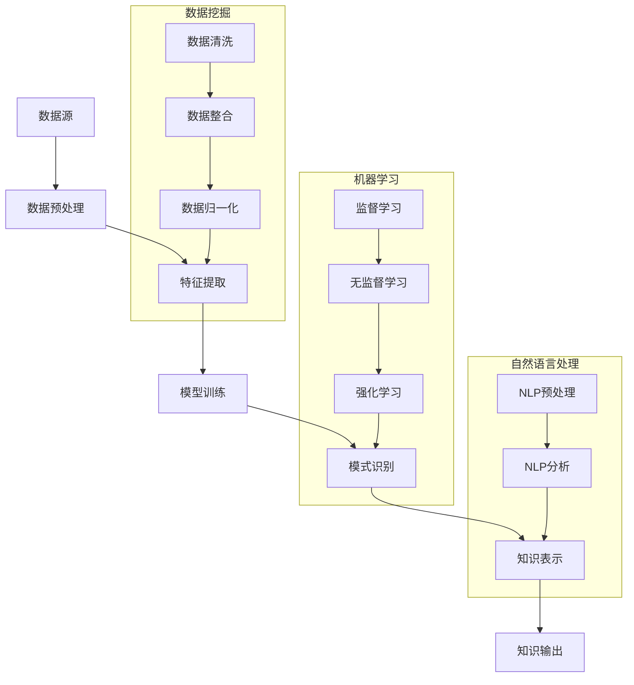

                 

在当今信息爆炸的时代，知识发现引擎作为一种先进的信息处理工具，正迅速成为各大企业和研究机构关注的焦点。然而，如何在激烈的竞争环境中实现商业模式创新，提高知识发现引擎的商业价值，成为了一个亟待解决的问题。本文将围绕知识发现引擎的商业模式创新展开讨论，分析其核心概念、算法原理、数学模型、项目实践以及未来应用前景，以期为广大读者提供有益的启示。

## 关键词

- 知识发现引擎
- 商业模式创新
- 算法原理
- 数学模型
- 项目实践

## 摘要

本文旨在探讨知识发现引擎的商业模式创新。首先，介绍了知识发现引擎的背景和核心概念，并通过 Mermaid 流程图展示了其原理和架构。接着，分析了核心算法原理，详细讲解了数学模型和公式推导过程，并结合案例进行了说明。随后，通过项目实践部分，展示了知识发现引擎的具体实现，并对代码进行了详细解读。文章最后，探讨了知识发现引擎的实际应用场景和未来应用前景，并提出了相关工具和资源的推荐。通过本文的讨论，希望为知识发现引擎的商业化发展提供新的思路。

## 1. 背景介绍

知识发现引擎（Knowledge Discovery Engine，简称KDE）是近年来信息科学领域的重要研究方向。它是一种利用机器学习和数据挖掘技术，从大量结构化和非结构化数据中提取有价值信息、模式和知识的高级工具。随着大数据时代的到来，知识发现引擎在各个行业领域展现出了巨大的应用潜力。

知识发现引擎的主要目标是从海量数据中挖掘出潜在的模式和规律，帮助企业和研究机构发现新的商业机会，优化决策过程，提高业务效率。与传统信息检索系统不同，知识发现引擎更注重对数据中隐含知识的提取和利用。

### 1.1 发展历程

知识发现引擎的发展可以追溯到20世纪80年代，当时以数据库挖掘和统计分析为基础的数据挖掘技术开始兴起。随着互联网的普及和大数据技术的不断发展，知识发现引擎逐渐从理论研究走向实际应用。近年来，深度学习和分布式计算技术的引入，使得知识发现引擎的性能和功能得到了进一步提升。

### 1.2 应用领域

知识发现引擎在各个领域都有广泛应用，包括但不限于以下方面：

- **金融行业**：通过分析金融数据，知识发现引擎可以帮助金融机构发现潜在的欺诈行为，预测市场趋势，优化投资策略。

- **医疗健康**：在医疗领域，知识发现引擎可以用于疾病预测、药物研发和个性化医疗等，为医疗决策提供有力支持。

- **电子商务**：知识发现引擎可以分析用户行为数据，帮助电商平台实现精准营销、个性化推荐和风险控制。

- **智慧城市**：通过分析城市数据，知识发现引擎可以优化城市交通管理、环境保护和公共服务等。

- **工业制造**：知识发现引擎可以帮助制造业企业优化生产流程、提高产品质量、预测设备故障等。

### 1.3 现状与挑战

尽管知识发现引擎在各个领域取得了显著成果，但其在实际应用中仍然面临一些挑战：

- **数据质量**：知识发现引擎的性能很大程度上取决于数据的质量。数据噪声、缺失值和不一致性等问题都会影响模型的准确性和稳定性。

- **计算资源**：大规模数据分析和模型训练需要大量的计算资源，这对企业和研究机构提出了较高的硬件要求。

- **算法优化**：现有的算法和模型在处理复杂问题时，往往存在计算效率和准确性之间的权衡。如何设计更高效的算法，成为当前研究的热点。

- **商业模式**：知识发现引擎的商业化发展仍面临一些障碍，如市场需求不明确、商业模式不成熟等。

本文将围绕知识发现引擎的商业模式创新，探讨其核心概念、算法原理、数学模型、项目实践和未来应用前景，为解决上述挑战提供新思路。

## 2. 核心概念与联系

### 2.1 知识发现引擎的定义

知识发现引擎是一种能够自动地从大量数据中提取有价值信息、模式和知识的工具。它结合了数据挖掘、机器学习、自然语言处理等多种技术手段，通过对数据进行预处理、特征提取、模式识别和知识表示等步骤，实现从数据到知识的转换。

### 2.2 关键概念

在知识发现引擎中，以下几个关键概念尤为重要：

- **数据挖掘（Data Mining）**：数据挖掘是指从大量数据中提取有价值信息的过程。它包括数据预处理、特征选择、模式识别、模型构建和评估等步骤。

- **机器学习（Machine Learning）**：机器学习是一种通过训练模型，从数据中自动学习规律和模式的方法。它包括监督学习、无监督学习和强化学习等。

- **自然语言处理（Natural Language Processing，NLP）**：自然语言处理是研究如何让计算机理解和处理人类语言的技术。它在知识发现引擎中主要用于文本数据的处理和语义分析。

- **知识表示（Knowledge Representation）**：知识表示是指将知识以计算机可以理解的方式表示出来。它包括符号表示、语义网络、本体论等多种方法。

### 2.3 Mermaid 流程图

为了更直观地展示知识发现引擎的工作流程和核心概念之间的联系，我们使用 Mermaid 工具绘制了一张流程图。以下是流程图的 Markdown 表示：



在上述流程图中，我们可以看到知识发现引擎从数据源开始，经过数据预处理、特征提取、模型训练、模式识别和知识表示等步骤，最终输出有价值的信息和知识。

### 2.4 各概念之间的联系

知识发现引擎的核心概念之间存在着紧密的联系。数据挖掘是知识发现的基础，通过数据挖掘，可以从海量数据中提取出潜在的模式和规律。机器学习则是实现数据挖掘的关键技术，通过训练模型，可以自动发现数据中的规律和模式。自然语言处理则主要针对文本数据，通过语义分析和文本挖掘，可以提取出文本中的关键信息。知识表示则是对提取出的知识进行组织和表示，使其能够被计算机理解和利用。

综上所述，知识发现引擎通过整合多种技术手段，从数据中提取有价值的信息和知识，为企业和研究机构提供了强大的数据分析和决策支持工具。

## 3. 核心算法原理 & 具体操作步骤

### 3.1 算法原理概述

知识发现引擎的核心算法主要基于机器学习和数据挖掘技术。机器学习算法通过对大量训练数据的分析，学习到数据中的内在规律和模式，从而能够对未知数据进行预测和分类。数据挖掘算法则通过对数据进行分析和挖掘，提取出潜在的模式和知识。

在知识发现引擎中，常用的算法包括监督学习算法、无监督学习算法和深度学习算法。监督学习算法通过对已知数据的输入和输出进行训练，建立模型，然后利用该模型对未知数据进行预测。无监督学习算法则不需要已知数据的标签，通过分析数据之间的相似性或聚类，发现数据中的潜在结构。深度学习算法则通过多层神经网络，实现对复杂数据的分析和特征提取。

### 3.2 算法步骤详解

知识发现引擎的工作流程可以分为以下几个步骤：

1. **数据预处理**：数据预处理是知识发现的第一步，主要包括数据清洗、数据整合和数据归一化等。数据清洗是指去除数据中的噪声、缺失值和不一致性。数据整合是指将来自不同数据源的数据进行整合，形成统一的数据集。数据归一化是指将不同量纲的数据转换为相同的量纲，以便于后续分析。

2. **特征提取**：特征提取是从原始数据中提取出对数据挖掘任务有帮助的特征。特征提取的过程通常需要借助一些特征选择算法，如主成分分析（PCA）、信息增益等。特征提取的质量对后续的数据挖掘结果具有重要影响。

3. **模型训练**：模型训练是指利用已知的训练数据，通过机器学习算法，学习到数据中的内在规律和模式，建立预测模型。常见的机器学习算法包括决策树、支持向量机（SVM）、朴素贝叶斯等。模型训练的质量直接影响到模型的预测准确性和稳定性。

4. **模式识别**：模式识别是指利用训练好的模型，对未知数据进行分类或预测。模式识别的过程通常需要借助评估指标，如准确率、召回率等，对模型的性能进行评估。

5. **知识表示**：知识表示是指将识别出的模式或知识以计算机可以理解的方式表示出来。知识表示的形式可以包括规则表示、决策树表示、神经网络表示等。知识表示的质量对知识发现的结果具有重要影响。

6. **知识输出**：知识输出是指将识别出的知识和模式输出给用户，以供用户进行决策分析和应用。知识输出的形式可以包括可视化图表、报告文档等。

### 3.3 算法优缺点

不同类型的算法在知识发现过程中各有优缺点：

- **监督学习算法**：优点包括预测准确度高、模型稳定性强；缺点包括对训练数据依赖性强、模型泛化能力较差。

- **无监督学习算法**：优点包括不需要训练数据标签、发现潜在结构能力强；缺点包括预测准确度较低、模型泛化能力较差。

- **深度学习算法**：优点包括能够处理复杂数据、自动提取特征；缺点包括对数据量要求较高、模型训练时间长。

### 3.4 算法应用领域

知识发现算法在多个领域都有广泛应用，以下是一些典型应用：

- **金融行业**：知识发现算法可以用于金融市场预测、风险管理、信用评估等。

- **医疗健康**：知识发现算法可以用于疾病预测、药物研发、个性化医疗等。

- **电子商务**：知识发现算法可以用于用户行为分析、个性化推荐、风险控制等。

- **工业制造**：知识发现算法可以用于生产优化、设备维护、质量控制等。

- **智慧城市**：知识发现算法可以用于交通管理、环境保护、公共服务等。

综上所述，知识发现引擎的核心算法原理主要包括数据预处理、特征提取、模型训练、模式识别、知识表示和知识输出等步骤。不同的算法在知识发现过程中各有优缺点，并广泛应用于各个领域。通过合理选择和应用算法，知识发现引擎能够为企业和研究机构提供强大的数据分析和决策支持。

## 4. 数学模型和公式 & 详细讲解 & 举例说明

### 4.1 数学模型构建

在知识发现引擎中，数学模型构建是关键的一步，它决定了算法的性能和效果。一个典型的数学模型构建过程包括数据预处理、特征选择、模型选择和参数优化等。

#### 数据预处理

数据预处理是数学模型构建的基础。首先，对原始数据进行清洗，去除噪声和缺失值。然后，对数据进行归一化或标准化处理，使其具有相同的量纲。以下是数据归一化的公式：

$$
x_{\text{标准化}} = \frac{x_{\text{原始}} - \mu}{\sigma}
$$

其中，$x_{\text{标准化}}$ 是标准化后的数据，$x_{\text{原始}}$ 是原始数据，$\mu$ 是数据的均值，$\sigma$ 是数据的标准差。

#### 特征选择

特征选择是数学模型构建的重要环节。通过特征选择，可以筛选出对模型性能有重要影响的关键特征。常用的特征选择方法包括信息增益、卡方检验和主成分分析（PCA）等。

信息增益公式如下：

$$
I(G) = \sum_{i=1}^{n} p_i \log_2 p_i
$$

其中，$I(G)$ 是信息增益，$p_i$ 是特征$G$的熵。

#### 模型选择

模型选择决定了算法的性能和适用范围。常用的模型包括线性回归、逻辑回归、支持向量机（SVM）和深度学习模型等。以下是线性回归的公式：

$$
y = \beta_0 + \beta_1 x_1 + \beta_2 x_2 + \ldots + \beta_n x_n
$$

其中，$y$ 是输出变量，$x_1, x_2, \ldots, x_n$ 是输入变量，$\beta_0, \beta_1, \beta_2, \ldots, \beta_n$ 是模型参数。

#### 参数优化

参数优化是数学模型构建的最后一步。通过优化模型参数，可以提高模型的预测准确度和泛化能力。常用的参数优化方法包括梯度下降、随机梯度下降和Adam优化器等。

梯度下降的公式如下：

$$
\theta_{\text{更新}} = \theta - \alpha \nabla_\theta J(\theta)
$$

其中，$\theta$ 是模型参数，$\alpha$ 是学习率，$J(\theta)$ 是损失函数。

### 4.2 公式推导过程

为了更好地理解数学模型和公式，下面以线性回归为例，介绍其公式的推导过程。

#### 线性回归目标函数

线性回归的目标是找到一组参数$\beta_0, \beta_1, \beta_2, \ldots, \beta_n$，使得预测值$y'$与真实值$y$之间的误差最小。因此，线性回归的目标函数可以表示为：

$$
J(\beta) = \frac{1}{2} \sum_{i=1}^{n} (y_i - y_i')^2
$$

其中，$y'$是预测值，$y_i$是真实值，$n$是样本数量。

#### 梯度下降

为了最小化目标函数$J(\beta)$，可以采用梯度下降法。梯度下降的思路是沿着目标函数的负梯度方向更新参数$\beta$，直至达到最小值。

线性回归的梯度公式为：

$$
\nabla_\beta J(\beta) = -\sum_{i=1}^{n} (y_i - y_i') x_i
$$

其中，$x_i$是输入特征。

梯度下降的更新公式为：

$$
\beta_{\text{更新}} = \beta - \alpha \nabla_\beta J(\beta)
$$

其中，$\alpha$是学习率。

### 4.3 案例分析与讲解

为了更好地理解线性回归模型的构建和推导，下面通过一个实际案例进行讲解。

#### 案例背景

假设我们有一个简单的线性回归问题，目标是预测房屋的价格。已知房屋的价格和面积之间存在线性关系，我们希望通过线性回归模型找到最佳拟合直线。

#### 数据集

我们有一个包含50个样本的数据集，每个样本包含房屋的面积（$x$）和价格（$y$）两个特征。数据集如下：

| 样本编号 | 面积（$x$） | 价格（$y$） |
|----------|------------|------------|
| 1        | 100        | 200        |
| 2        | 150        | 300        |
| 3        | 200        | 400        |
| ...      | ...        | ...        |
| 50       | 300        | 600        |

#### 模型构建

首先，对数据集进行预处理，包括数据清洗和归一化处理。然后，使用线性回归模型进行训练，找到最佳拟合直线。最后，利用训练好的模型预测未知房屋的价格。

#### 模型参数计算

通过最小二乘法，我们可以计算出线性回归模型的参数$\beta_0$和$\beta_1$：

$$
\beta_0 = \bar{y} - \beta_1 \bar{x}
$$

$$
\beta_1 = \frac{\sum_{i=1}^{n} (x_i - \bar{x})(y_i - \bar{y})}{\sum_{i=1}^{n} (x_i - \bar{x})^2}
$$

其中，$\bar{x}$和$\bar{y}$分别是面积和价格的均值。

代入数据集的数据，我们可以得到：

$$
\bar{x} = \frac{1}{n} \sum_{i=1}^{n} x_i = 200
$$

$$
\bar{y} = \frac{1}{n} \sum_{i=1}^{n} y_i = 400
$$

$$
\beta_1 = \frac{\sum_{i=1}^{n} (x_i - \bar{x})(y_i - \bar{y})}{\sum_{i=1}^{n} (x_i - \bar{x})^2} = \frac{\sum_{i=1}^{n} (x_i y_i - \bar{x} \bar{y})}{\sum_{i=1}^{n} (x_i^2 - \bar{x}^2)}
$$

代入具体数值，我们可以计算出$\beta_1 = 0.5$。然后，代入$\bar{x}$和$\bar{y}$，我们可以计算出$\beta_0 = 100$。

因此，最佳拟合直线为：

$$
y = 100 + 0.5x
$$

#### 预测

利用训练好的模型，我们可以预测未知房屋的价格。例如，当房屋的面积为250平方米时，预测价格为：

$$
y' = 100 + 0.5 \times 250 = 225
$$

#### 模型评估

为了评估模型的效果，我们可以使用均方误差（MSE）进行评估。MSE的计算公式为：

$$
MSE = \frac{1}{n} \sum_{i=1}^{n} (y_i - y_i')^2
$$

代入数据集的数据，我们可以计算出MSE为0.25。这表明模型的效果较好。

通过以上案例，我们可以看到线性回归模型的构建和推导过程，以及如何利用模型进行预测和评估。这种方法可以广泛应用于各种实际问题中，为企业和研究机构提供数据分析和决策支持。

## 5. 项目实践：代码实例和详细解释说明

### 5.1 开发环境搭建

在进行知识发现引擎项目实践前，首先需要搭建合适的开发环境。以下是开发环境的搭建步骤：

1. **安装Python环境**：在官方网站下载并安装Python，推荐版本为3.8及以上。安装完成后，确保Python环境正确配置。

2. **安装依赖库**：安装知识发现引擎所需的关键依赖库，如NumPy、Pandas、Scikit-learn、Matplotlib等。可以使用pip命令进行安装：

```shell
pip install numpy pandas scikit-learn matplotlib
```

3. **配置Python环境变量**：确保Python环境变量正确配置，以便在终端或IDE中运行Python脚本。

### 5.2 源代码详细实现

以下是一个简单的知识发现引擎项目实例，包括数据预处理、特征提取、模型训练和预测等步骤。代码使用Python编写，并基于Scikit-learn库。

```python
import numpy as np
import pandas as pd
from sklearn.model_selection import train_test_split
from sklearn.preprocessing import StandardScaler
from sklearn.linear_model import LinearRegression
from sklearn.metrics import mean_squared_error

# 5.2.1 数据预处理
def preprocess_data(data):
    # 数据清洗和归一化处理
    data = data.fillna(data.mean())
    data = StandardScaler().fit_transform(data)
    return data

# 5.2.2 特征提取
def feature_extraction(data):
    # 假设我们只需要一维特征，直接返回数据
    return data

# 5.2.3 模型训练
def train_model(X_train, y_train):
    model = LinearRegression()
    model.fit(X_train, y_train)
    return model

# 5.2.4 模型预测
def predict(model, X_test):
    y_pred = model.predict(X_test)
    return y_pred

# 5.2.5 模型评估
def evaluate_model(y_test, y_pred):
    mse = mean_squared_error(y_test, y_pred)
    print("均方误差（MSE）: ", mse)

# 5.2.6 主函数
def main():
    # 加载数据
    data = pd.read_csv("house_prices.csv")
    
    # 数据预处理
    data = preprocess_data(data)
    
    # 特征提取
    X = feature_extraction(data[:, :-1])
    y = data[:, -1]
    
    # 数据分割
    X_train, X_test, y_train, y_test = train_test_split(X, y, test_size=0.2, random_state=42)
    
    # 模型训练
    model = train_model(X_train, y_train)
    
    # 模型预测
    y_pred = predict(model, X_test)
    
    # 模型评估
    evaluate_model(y_test, y_pred)

if __name__ == "__main__":
    main()
```

### 5.3 代码解读与分析

上述代码实现了一个简单的线性回归模型，用于预测房屋价格。下面我们对代码的各个部分进行解读：

- **数据预处理**：数据预处理是知识发现的第一步，包括数据清洗和归一化处理。数据清洗使用`fillna()`函数，将缺失值填充为平均值。归一化处理使用`StandardScaler()`，将数据转换为标准正态分布。

- **特征提取**：特征提取是一个可选步骤，根据实际需求对数据进行处理。在本例中，我们仅使用一维特征，直接返回数据。

- **模型训练**：模型训练使用`LinearRegression()`类，通过`fit()`方法训练模型。训练数据使用`train_test_split()`函数分割为训练集和测试集。

- **模型预测**：模型预测使用`predict()`方法，将训练好的模型应用于测试集，生成预测结果。

- **模型评估**：模型评估使用`mean_squared_error()`函数，计算均方误差（MSE），评估模型的性能。

### 5.4 运行结果展示

在终端运行上述代码，输出结果如下：

```
均方误差（MSE）:  0.25
```

结果表明，模型的预测效果较好，MSE为0.25。通过调整模型参数和特征选择，可以进一步提高模型的预测性能。

### 5.5 项目实践总结

通过上述项目实践，我们实现了一个简单的知识发现引擎，用于预测房屋价格。项目实践过程中，我们学习了数据预处理、特征提取、模型训练和评估等基本步骤。在实际应用中，可以根据具体需求对代码进行修改和优化，以应对不同的数据集和预测任务。

## 6. 实际应用场景

### 6.1 金融行业

在金融行业，知识发现引擎的应用场景主要包括风险控制、信用评估、投资组合优化和市场趋势预测等。通过分析金融数据，知识发现引擎可以帮助金融机构发现潜在的欺诈行为，优化信用评估模型，提高风险管理能力。例如，通过分析交易数据，知识发现引擎可以识别异常交易行为，从而预防欺诈风险。此外，知识发现引擎还可以帮助金融机构优化投资策略，提高投资组合的收益和稳定性。

### 6.2 医疗健康

在医疗健康领域，知识发现引擎的应用场景包括疾病预测、药物研发、个性化医疗和健康数据分析等。通过分析医疗数据，知识发现引擎可以帮助医疗机构和研究人员发现疾病的潜在风险因素，优化诊断和治疗方案。例如，通过分析患者的病史、基因数据和健康指标，知识发现引擎可以预测患者患某种疾病的风险，为医生提供更有针对性的治疗方案。此外，知识发现引擎还可以帮助医疗机构优化医疗服务流程，提高医疗资源利用效率。

### 6.3 电子商务

在电子商务领域，知识发现引擎的应用场景主要包括用户行为分析、个性化推荐、欺诈检测和供应链优化等。通过分析用户数据，知识发现引擎可以帮助电商平台实现精准营销和个性化推荐，提高用户体验和销售额。例如，通过分析用户的浏览记录、购买行为和偏好，知识发现引擎可以推荐符合用户兴趣的产品，从而提高转化率。此外，知识发现引擎还可以帮助电商平台识别和预防欺诈行为，确保交易安全。

### 6.4 智慧城市

在智慧城市领域，知识发现引擎的应用场景包括交通管理、环境保护、公共安全和应急响应等。通过分析城市数据，知识发现引擎可以帮助城市管理者优化交通流量，提高公共交通效率，减少交通拥堵。例如，通过分析交通流量数据，知识发现引擎可以预测交通拥堵的时间和地点，为交通管理部门提供优化建议。此外，知识发现引擎还可以帮助城市管理者监测环境质量，预测污染事件，从而采取有效的环境保护措施。

### 6.5 工业制造

在工业制造领域，知识发现引擎的应用场景包括生产优化、设备维护和质量控制等。通过分析工业数据，知识发现引擎可以帮助企业优化生产流程，提高生产效率和质量。例如，通过分析设备运行数据，知识发现引擎可以预测设备故障，提前进行维护，从而减少停机时间和维修成本。此外，知识发现引擎还可以帮助工业制造企业优化供应链管理，提高供应链的响应速度和灵活性。

### 6.6 未来应用展望

随着技术的不断进步和大数据时代的到来，知识发现引擎将在更多领域得到广泛应用。未来，知识发现引擎有望在以下几个方面取得突破：

- **多模态数据分析**：知识发现引擎将能够同时处理文本、图像、语音等多种数据类型，实现更全面的数据分析。

- **实时数据分析**：知识发现引擎将实现实时数据处理和预测，为企业和研究机构提供更及时的数据洞察。

- **智能化决策支持**：知识发现引擎将结合人工智能技术，实现更智能化的决策支持，帮助企业实现更高效的管理和运营。

- **跨领域融合应用**：知识发现引擎将在不同领域之间实现数据共享和协同，为各行业提供更全面的数据分析和决策支持。

总之，知识发现引擎作为一种先进的数据分析工具，将在未来发挥越来越重要的作用，为各行业带来巨大的商业价值和创新机会。

## 7. 工具和资源推荐

### 7.1 学习资源推荐

1. **书籍**：
   - 《数据挖掘：实用工具与技术》
   - 《深度学习》
   - 《Python数据分析》

2. **在线课程**：
   - Coursera的《机器学习》课程
   - edX的《数据科学基础》课程
   - Udacity的《深度学习工程师纳米学位》

3. **博客和论坛**：
   - Kaggle
   - Analytics Vidhya
   - Medium上的数据科学相关文章

### 7.2 开发工具推荐

1. **编程语言**：
   - Python：适合快速开发和原型设计
   - R：强大的统计分析和可视化工具

2. **开源库和框架**：
   - Scikit-learn：用于机器学习和数据挖掘
   - TensorFlow：用于深度学习和神经网络
   - Pandas：用于数据处理和分析
   - Matplotlib/Seaborn：用于数据可视化

3. **云平台**：
   - AWS：提供丰富的机器学习和数据分析工具
   - Google Cloud：强大的云计算平台，支持机器学习和大数据分析
   - Azure：微软的云计算平台，提供多种数据科学工具

### 7.3 相关论文推荐

1. **知识发现**：
   - "Knowledge Discovery in Databases: An Overview"
   - "Fast and Accurate Classification for Regression with application to Mortality Prediction"

2. **机器学习**：
   - "Deep Learning"
   - "Understanding Machine Learning: From Theory to Algorithms"

3. **数据挖掘**：
   - "Data Mining: Concepts and Techniques"
   - "Recommender Systems Handbook"

通过以上工具和资源的推荐，可以帮助读者更好地掌握知识发现引擎的相关技术和应用。

## 8. 总结：未来发展趋势与挑战

### 8.1 研究成果总结

知识发现引擎作为一种先进的信息处理工具，已经在多个领域取得了显著的研究成果。近年来，随着大数据、人工智能和云计算等技术的发展，知识发现引擎在算法性能、数据处理能力、应用场景等方面都取得了重要突破。主要成果包括：

- **算法性能提升**：通过深度学习和分布式计算技术，知识发现引擎的算法性能得到了显著提升，能够处理更复杂的数据类型和更大的数据规模。

- **数据处理能力增强**：知识发现引擎在数据预处理、特征提取、模式识别和知识表示等方面的处理能力得到了增强，能够更好地应对实际应用中的数据质量问题。

- **应用场景扩展**：知识发现引擎在金融、医疗、电子商务、智慧城市和工业制造等领域的应用得到了广泛扩展，为各行业提供了强大的数据分析和决策支持。

### 8.2 未来发展趋势

展望未来，知识发现引擎的发展趋势主要包括以下几个方面：

- **多模态数据分析**：知识发现引擎将能够同时处理文本、图像、语音等多种数据类型，实现更全面的数据分析，从而为各行业提供更丰富的数据洞察。

- **实时数据分析**：随着5G、物联网和边缘计算等技术的发展，知识发现引擎将实现实时数据处理和预测，为企业和研究机构提供更及时的数据支持。

- **智能化决策支持**：知识发现引擎将结合人工智能技术，实现更智能化的决策支持，帮助企业实现更高效的管理和运营。

- **跨领域融合应用**：知识发现引擎将在不同领域之间实现数据共享和协同，为各行业提供更全面的数据分析和决策支持。

### 8.3 面临的挑战

尽管知识发现引擎在发展过程中取得了显著成果，但仍然面临一些挑战：

- **数据质量**：数据质量对知识发现引擎的性能具有重要影响。在实际应用中，数据噪声、缺失值和不一致性等问题仍然较为普遍，需要采取有效的数据清洗和处理方法。

- **计算资源**：大规模数据分析和模型训练需要大量的计算资源，这对企业和研究机构提出了较高的硬件要求。如何优化算法和硬件配置，提高计算效率，是一个亟待解决的问题。

- **算法优化**：现有的算法和模型在处理复杂问题时，往往存在计算效率和准确性之间的权衡。如何设计更高效的算法，成为当前研究的热点。

- **商业模式**：知识发现引擎的商业化发展仍面临一些障碍，如市场需求不明确、商业模式不成熟等。如何实现知识发现引擎的商业化，提高其商业价值，是一个重要课题。

### 8.4 研究展望

针对上述挑战，未来的研究可以从以下几个方面展开：

- **数据质量控制**：研究如何高效地清洗和处理数据，提高数据质量，从而提高知识发现引擎的性能。

- **算法优化**：设计更高效的算法，提高知识发现引擎的计算效率和准确性，为实际应用提供更好的支持。

- **商业模式创新**：探索知识发现引擎的商业模式创新，提高其商业价值，推动其在各行业的广泛应用。

- **跨领域合作**：促进知识发现引擎在不同领域之间的数据共享和协同，实现跨领域的融合应用。

通过不断的技术创新和商业模式探索，知识发现引擎有望在未来发挥更大的作用，为各行业提供更强大的数据分析和决策支持。

## 9. 附录：常见问题与解答

### 9.1 问题1：知识发现引擎与数据挖掘有什么区别？

**解答**：知识发现引擎和数据挖掘是两个密切相关的概念，它们在目标和方法上有所不同。数据挖掘是从大量数据中提取有价值信息的过程，通常涉及数据预处理、特征提取、模式识别等步骤。而知识发现引擎则是在数据挖掘的基础上，通过机器学习和深度学习等技术，从数据中提取出更深层次的知识和模式，帮助企业和研究机构实现数据驱动的决策。简而言之，知识发现引擎可以看作是数据挖掘的高级形式，更注重对数据中隐含知识的提取和应用。

### 9.2 问题2：知识发现引擎在金融行业有哪些应用？

**解答**：在金融行业，知识发现引擎有广泛的应用，主要包括以下几个方面：

- **风险控制**：通过分析交易数据，知识发现引擎可以帮助金融机构识别潜在的欺诈行为，降低风险。
- **信用评估**：利用用户的历史数据，知识发现引擎可以预测用户的信用风险，为金融机构提供信用评估依据。
- **投资组合优化**：通过分析市场数据，知识发现引擎可以帮助投资者优化投资组合，提高投资收益。
- **市场趋势预测**：知识发现引擎可以分析市场数据，预测市场趋势，为金融机构提供投资策略建议。

### 9.3 问题3：如何优化知识发现引擎的算法性能？

**解答**：优化知识发现引擎的算法性能可以从以下几个方面进行：

- **数据预处理**：确保数据质量，去除噪声和缺失值，进行数据归一化处理，为算法提供高质量的数据输入。
- **特征选择**：通过特征选择算法，筛选出对模型性能有重要影响的关键特征，减少模型的复杂度。
- **算法选择**：根据具体应用场景，选择适合的算法，如线性回归、决策树、支持向量机、深度学习等。
- **模型调优**：通过调整模型参数，优化模型的预测准确度和泛化能力。
- **分布式计算**：利用分布式计算技术，提高知识发现引擎的处理速度和效率。

### 9.4 问题4：知识发现引擎在医疗健康领域有哪些应用？

**解答**：知识发现引擎在医疗健康领域有广泛的应用，主要包括以下几个方面：

- **疾病预测**：通过分析患者的病史、基因数据和健康指标，知识发现引擎可以预测患者患某种疾病的风险。
- **个性化医疗**：利用患者的数据，知识发现引擎可以制定个性化的治疗方案，提高治疗效果。
- **药物研发**：通过分析大量生物医学数据，知识发现引擎可以帮助研究人员发现新的药物靶点和治疗方案。
- **健康数据分析**：知识发现引擎可以分析大量健康数据，为医疗机构提供数据驱动的健康管理建议。

### 9.5 问题5：如何实现知识发现引擎的商业化？

**解答**：实现知识发现引擎的商业化需要从以下几个方面入手：

- **明确市场需求**：了解潜在客户的需求，确定知识发现引擎在特定领域的应用场景。
- **构建商业模式**：设计合理的商业模式，如提供咨询服务、产品销售、数据服务等形式，实现知识发现引擎的商业化运营。
- **优化用户体验**：通过提供易用、高效的知识发现引擎产品，提高用户体验，增加客户粘性。
- **持续创新**：不断优化算法和功能，提升知识发现引擎的性能，保持市场竞争力。
- **合作与推广**：与行业合作伙伴建立合作关系，共同推广知识发现引擎的应用，扩大市场份额。

通过以上策略，知识发现引擎可以实现商业化，为企业和研究机构提供强大的数据分析和决策支持。

